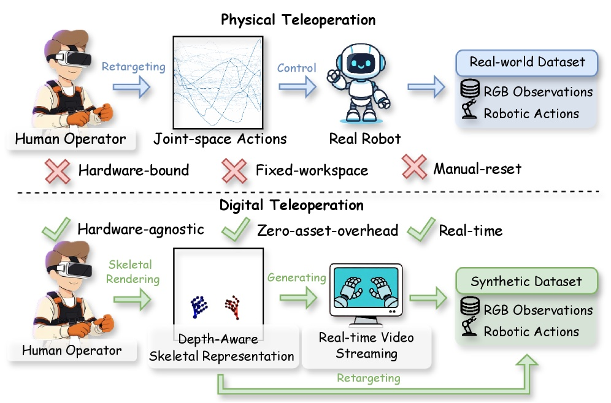
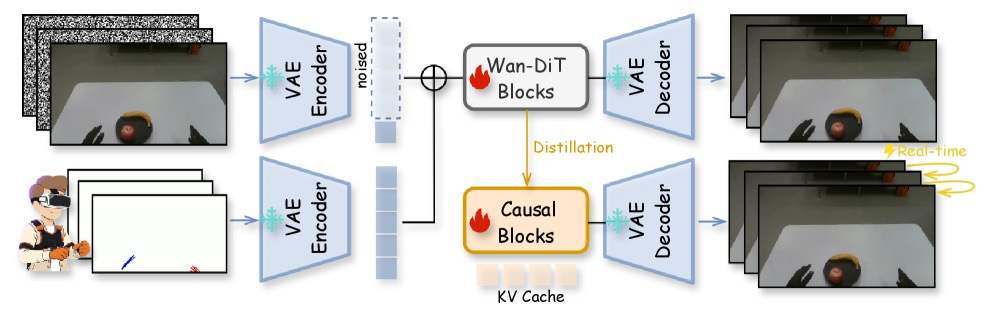
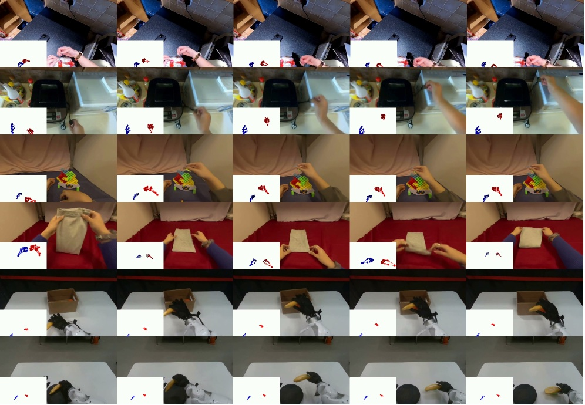

# A World Model That Synthesizes Robot Training Data from Hand Motion Alone

_Alibaba DAMO_

## Executive Summary

> [!callout]
> The old bottleneck in robot learning was never the model — it was the data. Training a single policy means a person has to teleoperate a robot to collect demonstrations, and each of those demonstrations is bound entirely to a specific piece of robot hardware and to human time. RynnWorld-Teleop, released by Alibaba DAMO Academy in July 2026, breaks that chain from a different angle. A person wears only trackers and a data glove and moves their hands; a robot-centric generative world model synthesizes, in real time, the point-of-view video of "what it would look like if that robot performed the same motion." Not a single physical robot arm ever runs.

> The effect was most pronounced in precise manipulation. Mixing 300 synthetic demonstrations into 300 real ones lifted the lid-placement success rate from 42.86% to 62.86%, a 20-point jump, and a synthetic-only policy that used zero real data still recorded 82.86% on block pushing. The authors, however, drew their own lines: complex physical phenomena such as fluid dynamics and highly deformable objects remain hard to generate, and the embodiment gap still varies from one robot platform to the next.

> This article traces the path from a hand-motion stream to robot-view video, and asks what those numbers prove and what they do not. As we cross from an era of collecting data into an era of generating it, the definition of quality shifts from label accuracy toward authenticity and physical consistency — and we look at how. It is the latest case in the bottleneck our [Physical AI](/project/PhysicalAI/en/) data series has tracked.

<!-- stat-card -->
**40+ FPS** — Real-time generation — Hand motion to robot-view video on a single H100

<!-- stat-card -->
**Zero** — Real robot data — Condition of the zero-shot synthetic-only policy

<!-- stat-card -->
**82.86%** — Zero-shot success — Block pushing, trained on synthetic data alone

<!-- stat-card -->
**+20pp** — Precise manipulation — Lid placement 42.86%→62.86% with mixed data

## Manipulation Video Made Without a Single Robot Arm

In the video, a two-armed robot picks up an apple and a banana, pushes blocks in sequence, and lifts a cushion with both arms. Yet the person who produced that motion was nowhere near a robot. Wearing HTC Vive trackers on the chest and both wrists and upper arms, and Manus data gloves, they simply moved their hands through the air. The footage that looks like a robot at work was **drawn in real time by a generative world model**. Alibaba DAMO Academy calls this "digital teleoperation": the operator teleoperates a model instead of a real robot.

Why this matters becomes clear once you see how robot training data is actually made. Training a robot policy such as a VLA (Vision-Language-Action) model requires large volumes of demonstration data that says "in this situation, the robot moved like this." But those demonstrations have to be built one at a time by a person teleoperating a robot, and even an expert struggles to exceed a few dozen an hour. Worse, the data collected that way is tied to that robot, that gripper, that camera placement — change the hardware and you start over. The real bottleneck in robot learning was never model performance; it was **the fact that demonstration collection depends on human time and specific hardware**.

*▲ Physical teleoperation (top) is bound to hardware, workspace, and manual resets; digital teleoperation (bottom) renders hand motion as a skeleton and generates synthetic data in real time | Source: [Zhao et al., arXiv:2607.06558](https://arxiv.org/abs/2607.06558)*

> [!callout]
> What RynnWorld-Teleop changes is clear. Human hand motion is still needed, but the part that turns that motion into demonstration video moves from a physical robot to a generative model. The physical constraint — one robot can produce only one demonstration at a time — becomes a software problem, where a model can churn out demonstrations from many combinations of reference images and hand motions.

## How Hand Motion Becomes Robot Video

Human hands and robot hands look different. So if you render the signal "the person moved their hand like this" directly onto the screen, you get a **human hand**, not a robot demonstration. That is exactly the problem RynnWorld-Teleop solves. The model takes a single reference image (that robot, that scene) and a stream of human hand poses, and predicts the video of the robot performing the motion, from a robot-centric, egocentric viewpoint.

### 2.1. A Hand Skeleton That Keeps Its Depth

One key device is depth-aware skeleton conditioning. Render a hand pose as a flat 2D skeleton and feed it to the model, and the distance-to-camera information is flattened away. The researchers adjusted the skeleton's color and radius according to distance from the camera, so that near joints and far joints stay distinguishable on screen — explicitly loading a 3D cue into a 2D signal. As a result, the model does not confuse whether a hand is moving forward or back.

*▲ The hand skeleton's color and size shift with distance from the camera, embedding 3D depth cues into a 2D rendering | Source: [Zhao et al., arXiv:2607.06558](https://arxiv.org/abs/2607.06558)*

### 2.2. Learn from Human Video, Transfer onto Robot Data

The model is built on a video Diffusion Transformer and trained in two stages. First, on large-scale egocentric human video (VITRA's 30.7 million frames, EgoDex's 74 million frames), it acquires a physical intuition for "how a scene changes when a hand manipulates an object." Then it is fine-tuned on a small set of paired human-robot data (1,800 episodes of real robot demonstrations) to transfer the same motion onto the robot's body. Finally, a bidirectional teacher model is distilled into a causal student model, yielding real-time generation of 40+ FPS on a single H100 GPU.

*▲ Hand motion and video are each VAE-encoded and fused through Wan-DiT blocks, then distilled into causal blocks for real-time, KV-cache-based generation | Source: [Zhao et al., arXiv:2607.06558](https://arxiv.org/abs/2607.06558)*

This is where it diverges from prior work. Attempts to turn human video into robot video (Masquerade, Phantom) only transformed observations; they did not generate robot actions. Action-conditioned egocentric world models (such as Hand2World) left the on-screen hand still human, preserving the embodiment gap. RynnWorld-Teleop claims to be the first to satisfy three conditions at once: robot-centric, action-based, and real-time. It is also worth distinguishing from the [GR00T-style approach](/project/AgenticAI/isaac-groot/en/) that expands trajectories with a simulator's physics engine — here, a generative video model shoots the demonstrations instead.

## The Numbers: What Works and What Doesn't

Evaluation ran on a TIANJI M6 mobile robot — dual 7-DoF arms topped with two 20-DoF hands (54 DoF in total) — across four tasks: dual picking, sequential block pushing, dual-arm cushion lifting, and precise lid placement. When training mixed 300 synthetic demonstrations into 300 real ones, the success-rate changes were as follows.

*▲ Four evaluation tasks on the TIANJI M6 mobile robot — from left, dual picking, block pushing, dual-arm cushion lifting, and precise lid placement | Source: [Zhao et al., arXiv:2607.06558](https://arxiv.org/abs/2607.06558)*

| Task | 300 real | 300 real + 300 synthetic |
| --- | --- | --- |
| Dual picking (apple, banana) | 94.29% | 97.14% |
| Dual-arm cushion lifting | 94.29% | 100% |
| Precise lid placement | 42.86% | 62.86% |

Two things stand out. First, tasks the robot already did well (picking, lifting) rose slightly, but the hard task — precise lid placement — jumped 20 points. Synthetic data pays off most where real demonstrations are scarce, as in fine manipulation. Second, even when a π₀ policy was trained on synthetic demonstrations alone, with zero real data, it recorded 82.86% on block pushing and 77.14% on dual-arm lifting — evidence that "a policy runs even on data made without a real robot." The world model's own generation quality improved over competing models, at PSNR 26.78 and FVD 550.

*▲ One hand-motion stream synthesized into both a human-view and a robot-view video — pretraining on large-scale human video transfers into robot execution | Source: [Zhao et al., arXiv:2607.06558](https://arxiv.org/abs/2607.06558)*

But it is just as important to be clear about what these numbers do not prove. The results are confined to four tasks and one robot platform. The authors acknowledged two limits directly. One is that generation remains fragile for complex physical phenomena such as fluid dynamics or heavily deforming objects; the other is that closing the embodiment gap still relies on per-platform fine-tuning. Scaling to an entire robot fleet needs further work, and the researchers themselves named the next task: a "cross-embodiment foundation world model conditioned on robot kinematics."

> [!callout]
> In short, RynnWorld-Teleop gave a positive answer, under controlled conditions, to the question of how far synthetic robot data can replace or augment real data. At the same time, it left open the question of how physically valid that synthetic data is. It is a signal that the success-rate table needs a new column beside it: physical consistency.

## Authenticity as a New Quality Axis

On the text side, this is a transition we have already lived through. As synthetic data grew in language-model training, the quality question moved from "is the label correct?" to "does this data represent the real world?" When the loop of training models on model-generated data compounds, the distribution narrows and the distance from the original world quietly widens. Robot data now stands at the same threshold. The difference is that in robotics, that "real world" is the laws of physics.

In an era of collecting data, quality was measured by label accuracy, missing-value rates, and class balance. In an era of generating data, two more axes attach. The first is **authenticity**: does a synthesized demonstration represent the data a real robot would plausibly have produced? The second is **physical consistency**: does that demonstration respect physics such as gravity, friction, and contact? RynnWorld-Teleop raising the lid-placement success rate is progress on the first axis; admitting fragility with fluids and deformable objects is a confession that the second axis is still empty.

This frame extends the questions Pebblous has worked through in its discussions of the [behavioral data bottleneck](/report/korea-physical-ai-behavior-data/en/) and the [physical data moat](/blog/prometheus-physical-ai-data-moat/en/). The more a path opens to generating data without capital, the more verifying whether that data represents the real thing becomes the new bottleneck. What the next generation of data-quality frameworks must answer is not the accuracy of a label, but the ability to pinpoint where a generated demonstration diverges from reality.

## FAQ

## References

### R.1. Academic Papers

- 1.Zhao, H. et al. (2026). "[RynnWorld-Teleop: An Action-Conditioned World Model for Digital Teleoperation](https://arxiv.org/abs/2607.06558)." arXiv:2607.06558. Alibaba DAMO Academy.
- 2.Alibaba DAMO Academy. (2026). "[RynnWorld-4D: A 4D Embodied World Model](https://arxiv.org/html/2607.06559v1)." arXiv:2607.06559.
- 3.Lepert, M., Fang, J., Bohg, J. (2025). "[Phantom: Training Robots Without Robots Using Only Human Videos](https://arxiv.org/abs/2503.00779)." arXiv:2503.00779.
- 4.Lepert, M., Fang, J., Bohg, J. (2025). "[Masquerade: Learning from In-the-wild Human Videos using Data-Editing](https://arxiv.org/abs/2508.09976)." arXiv:2508.09976.
- 5.Wang, Y. et al. (2026). "[Hand2World: Autoregressive Egocentric Interaction Generation via Free-Space Hand Gestures](https://arxiv.org/abs/2602.09600)." arXiv:2602.09600.
- 6.Xie, L. et al. (2026). "[Generated Reality: Human-centric World Simulation using Interactive Video Generation with Hand and Camera Control](https://arxiv.org/abs/2602.18422)." arXiv:2602.18422.

### R.2. Industry & Press

- 7.Tech Times. (2026-07-09). "[Alibaba Robot World Model Predicts Geometry, Motion Before Each Move](https://www.techtimes.com/articles/319971/20260709/alibaba-robot-world-model-predicts-geometry-motion-before-each-move.htm)." Tech Times.

A single paper like RynnWorld-Teleop does not make the robot-data bottleneck disappear. But the same team released the 4D embodied world model RynnWorld-4D within a day, and back in February it had unveiled RynnBrain, a Qwen3-VL-based cognition model. Seeing the layers stacked in sequence — cognition (RynnBrain), prediction (RynnWorld-4D), teleoperation (RynnWorld-Teleop) — it becomes clear this is one company's roadmap. The shift of robot data from hardware to software has already begun.

Thanks for reading. If you have thoughts or questions on how to verify the authenticity of synthetic robot data, we would love to hear them.

**Pebblous Data Communication Team**  
July 10, 2026

<!-- stat-card -->
**📚 Physical AI Series** — This article is part of the series curated at [Physical AI](/project/PhysicalAI/en/) — from how a robot sees, understands, and acts, to the data, simulation, models, and industry landscape, read together in one place.
