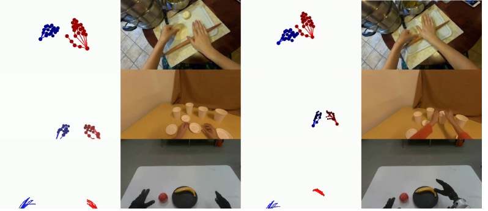
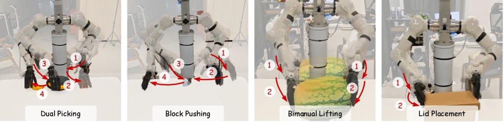

# 사람 손동작만으로 로봇 학습 데이터를 합성하는 월드모델

_실제 로봇 하드웨어 없이 시연 데이터를 만드는 알리바바 다모의 실시간 생성 모델_

## Executive Summary

> [!callout]
> 로봇 학습에서 오래된 병목은 모델이 아니라 데이터였다. 정책 하나를 훈련하려면 사람이 로봇을 원격조종해 시연을 쌓아야 하고, 그 시연은 특정 로봇 하드웨어와 사람의 시간에 통째로 묶인다. 알리바바 다모 아카데미가 2026년 7월 공개한 RynnWorld-Teleop은 이 사슬을 다른 방향에서 끊는다. 사람이 트래커와 데이터 글러브만 차고 손을 움직이면, 로봇 중심 생성형 월드모델이 "그 로봇이 같은 동작을 했을 때"의 시점 영상을 실시간으로 합성한다. 실제 로봇 팔은 한 대도 돌아가지 않는다.

> 효과는 정밀 조작에서 가장 두드러졌다. 실제 시연 300개에 합성 시연 300개를 섞어 학습하자 뚜껑 배치 성공률이 42.86%에서 62.86%로 20%포인트 올랐고, 실제 데이터를 한 개도 쓰지 않은 합성-전용 학습으로도 블록 밀기 82.86%를 기록했다. 다만 저자들은 액체 역학·고변형 물체 같은 복잡한 물리 현상과 로봇 플랫폼별 구체화 격차가 여전히 남는다고 스스로 못박았다.

> 이 글은 손동작 스트림이 로봇 시점 영상이 되는 경로와 그 수치가 무엇을 증명하고 무엇을 증명하지 않는지를 짚는다. 데이터를 모으는 시대에서 생성하는 시대로 넘어갈 때, 품질의 정의가 라벨 정확도에서 진본성·물리 정합성으로 어떻게 옮겨가는지를 함께 본다. [피지컬 AI](/project/PhysicalAI/ko/) 데이터 시리즈가 다뤄 온 병목의 최신 해법 사례다.

<!-- stat-card -->
**40+ FPS** — 실시간 생성 — 단일 H100에서 손동작을 로봇 시점 영상으로

<!-- stat-card -->
**0개** — 실제 로봇 데이터 — 합성만으로 학습한 제로샷 정책의 조건

<!-- stat-card -->
**82.86%** — 제로샷 성공률 — 합성 데이터만으로 학습한 블록 밀기

<!-- stat-card -->
**+20%p** — 정밀 조작 향상 — 혼합 학습 시 뚜껑 배치 42.86%→62.86%

## 로봇 팔 하나 없이 만든 조작 영상

영상 속에서는 두 팔 로봇이 사과와 바나나를 집고, 블록을 순서대로 밀고, 양팔로 쿠션을 들어 올린다. 그런데 그 동작을 만든 사람은 로봇 근처에 있지도 않았다. 그는 가슴과 양 손목·상완에 HTC Vive 트래커를 붙이고 Manus 데이터 글러브를 낀 채, 허공에서 손을 움직였을 뿐이다. 로봇이 수행하는 것처럼 보이는 영상은 **생성형 월드모델이 실시간으로 그려낸 것**이다. 알리바바 다모 아카데미는 이 방식을 "디지털 텔레오퍼레이션"이라고 부른다. 오퍼레이터가 실제 로봇 대신 모델을 원격조종하는 것이다.

왜 이게 중요한지는 로봇 학습 데이터가 어떻게 만들어지는지를 보면 드러난다. VLA(Vision-Language-Action) 같은 로봇 정책을 훈련하려면 "이 상황에서 이렇게 움직였다"는 시연 데이터가 대량으로 필요하다. 그런데 그 시연은 사람이 로봇을 하나씩 원격조종해 쌓아야 하고, 숙련자도 시간당 수십 개를 넘기기 어렵다. 게다가 그렇게 모은 데이터는 그 로봇, 그 그리퍼, 그 카메라 배치에 묶인다. 하드웨어가 바뀌면 다시 처음부터다. 로봇 학습의 진짜 병목은 모델 성능이 아니라 **시연 수집이 사람 시간과 특정 하드웨어에 종속된다는 사실**이었다.

*▲ 물리적 텔레오퍼레이션(위)은 로봇·워크스페이스·수동 리셋에 묶이지만, 디지털 텔레오퍼레이션(아래)은 손동작을 골격으로 렌더링해 실시간으로 합성 데이터를 생성한다 | Source: [Zhao et al., arXiv:2607.06558](https://arxiv.org/abs/2607.06558)*

> [!callout]
> RynnWorld-Teleop이 바꾸는 지점은 명확하다. 사람의 손동작은 여전히 필요하지만, 그것을 받아 시연 영상을 만들어 내는 쪽이 실제 로봇에서 생성 모델로 옮겨 간다. 로봇 한 대가 한 번에 하나의 시연만 만들 수 있던 물리적 제약이, 모델이 여러 참조 이미지와 손동작 조합으로 시연을 찍어내는 소프트웨어 문제로 바뀐다.

## 손동작이 로봇 영상이 되는 경로

사람 손과 로봇 손은 생김새가 다르다. 그래서 "사람이 손을 이렇게 움직였다"는 신호를 그대로 화면에 그리면 **사람 손**이 나올 뿐, 로봇 시연이 되지 않는다. RynnWorld-Teleop이 푸는 문제가 바로 이 지점이다. 모델은 단일 참조 이미지 한 장(그 로봇, 그 장면)과 사람의 손 자세 스트림을 입력받아, 로봇 중심(robot-centric)의 자아중심 시점에서 로봇이 그 동작을 수행하는 영상을 예측한다.

### 2.1. 깊이를 잃지 않는 손 골격

핵심 장치 하나는 깊이 인식 골격 조건화다. 손 자세를 2D 골격으로 렌더링해 모델에 넣으면 카메라와의 거리 정보가 납작하게 눌린다. 연구진은 골격의 색과 반지름을 카메라 거리에 따라 조정해, 가까운 관절과 먼 관절이 화면에서 구분되도록 했다. 2D 신호 안에 3D 단서를 명시적으로 실어 주는 방식이다. 덕분에 모델은 손이 앞으로 나오는지 뒤로 빠지는지를 헷갈리지 않는다.

*▲ 손 골격의 색·크기가 카메라와의 거리에 따라 달라져, 2D 렌더링에도 3D 깊이 단서가 실린다 | Source: [Zhao et al., arXiv:2607.06558](https://arxiv.org/abs/2607.06558)*

### 2.2. 사람 영상으로 배우고 로봇 데이터로 옮겨 앉기

모델은 비디오 Diffusion Transformer를 뼈대로, 두 단계로 학습한다. 먼저 대규모 자아중심 인간 영상(VITRA 3,070만 프레임, EgoDex 7,400만 프레임)으로 "손이 물체를 다루면 장면이 어떻게 변하는가"라는 물리 감각을 익힌다. 그다음 사람-로봇이 짝지어진 소규모 데이터(실제 로봇 시연 1,800 에피소드)로 미세조정해, 같은 동작을 로봇의 몸으로 옮겨 앉힌다. 마지막으로 양방향 교사 모델을 인과적 학생 모델로 증류해, 단일 H100 GPU에서 40FPS 이상의 실시간 생성을 얻는다.

*▲ 손동작과 영상을 각각 VAE로 인코딩하고 Wan-DiT 블록으로 합성한 뒤, 인과적 블록으로 증류해 KV 캐시 기반 실시간 생성을 얻는다 | Source: [Zhao et al., arXiv:2607.06558](https://arxiv.org/abs/2607.06558)*

이 대목에서 기존 연구와의 차이가 갈린다. 사람 영상을 로봇 영상처럼 바꾸는 시도(Masquerade, Phantom)는 관찰을 변환할 뿐 로봇의 행동을 생성하지 않았고, 행동 조건형 자아중심 월드모델(Hand2World 등)은 화면 속 손이 여전히 사람 손이라 구체화 격차를 남겼다. RynnWorld-Teleop은 로봇 중심·행동 기반·실시간이라는 세 조건을 동시에 만족한 첫 사례라고 주장한다. 시뮬레이터의 물리엔진으로 궤적을 늘리는 [GR00T 계열 접근](/project/AgenticAI/isaac-groot/ko/)과 달리, 여기서는 생성형 비디오 모델이 시연을 찍어낸다는 점도 구분해 둘 만하다.

## 숫자로 보는 효과와 한계

평가는 듀얼 7자유도 팔에 20자유도 손 두 개(합 54자유도)를 얹은 TIANJI M6 모바일 로봇에서, 네 가지 과제로 진행됐다. 듀얼 피킹, 블록 순차 밀기, 양팔 쿠션 들어 올리기, 정밀 뚜껑 배치다. 실제 시연 300개에 합성 시연 300개를 섞어 학습했을 때 성공률 변화는 다음과 같다.

*▲ TIANJI M6 모바일 로봇으로 진행한 네 가지 평가 과제 — 왼쪽부터 듀얼 피킹, 블록 밀기, 양팔 쿠션 들어 올리기, 정밀 뚜껑 배치 | Source: [Zhao et al., arXiv:2607.06558](https://arxiv.org/abs/2607.06558)*

| 과제 | 실제 300개 | 실제 300 + 합성 300 |
| --- | --- | --- |
| 듀얼 피킹(사과·바나나) | 94.29% | 97.14% |
| 양팔 쿠션 들어 올리기 | 94.29% | 100% |
| 정밀 뚜껑 배치 | 42.86% | 62.86% |

읽어 낼 지점은 두 가지다. 첫째, 이미 잘하던 과제(피킹·들어 올리기)는 소폭 올랐지만, 어려운 과제인 정밀 뚜껑 배치에서 20%포인트가 뛰었다. 합성 데이터의 효과는 정밀 조작처럼 실제 시연이 귀한 곳에서 크다. 둘째, 실제 데이터를 한 개도 쓰지 않고 합성 시연만으로 π₀ 정책을 학습했을 때도 블록 밀기 82.86%, 양팔 들기 77.14%를 기록했다. "실제 로봇 없이 만든 데이터로도 정책이 돈다"는 근거다. 월드모델 자체의 생성 품질은 PSNR 26.78, FVD 550으로 경쟁 모델 대비 개선됐다.

*▲ 동일한 손동작 스트림 하나가 사람 시점과 로봇 시점 양쪽으로 합성된 결과 — 대규모 인간 영상 사전학습이 로봇 실행으로 옮겨 앉는다 | Source: [Zhao et al., arXiv:2607.06558](https://arxiv.org/abs/2607.06558)*

다만 이 숫자들이 증명하지 않는 것도 분명히 해야 한다. 결과는 네 가지 과제, 하나의 로봇 플랫폼에 한정된다. 저자들은 두 가지 한계를 직접 인정했다. 하나는 액체 역학이나 크게 변형되는 물체처럼 복잡한 물리 현상에서 생성이 여전히 취약하다는 점, 다른 하나는 구체화 격차(embodiment gap)를 좁히는 일이 로봇 플랫폼별 미세조정에 의존한다는 점이다. 로봇 함대 전체로 확장하려면 아직 추가 작업이 필요하고, 연구진 스스로 다음 과제로 "로봇 운동학으로 조건화된 교차-구체화 기초 월드모델"을 제시했다.

> [!callout]
> 정리하면, RynnWorld-Teleop은 "합성 로봇 데이터가 실제 데이터를 얼마나 대체·보강할 수 있는가"라는 질문에 통제된 조건에서 긍정적인 답을 냈다. 동시에 "그 합성 데이터가 물리적으로 얼마나 타당한가"라는 질문은 열어 둔 채 남겼다. 성공률 표 옆에 물리 정합성이라는 새 열이 필요하다는 신호다.

## 진본성이라는 새 품질 축

텍스트 쪽에서는 이미 겪은 전환이다. 언어 모델 학습에서 합성 데이터가 늘면서 품질의 질문은 "라벨이 맞는가"에서 "이 데이터가 실재를 대표하는가"로 옮겨 갔다. 모델이 만든 데이터로 다시 모델을 학습하는 순환이 쌓이면 분포가 좁아지고, 원본 세계와의 거리가 조용히 벌어진다. 로봇 데이터도 같은 문턱 앞에 섰다. 다른 점은 로봇에서는 그 "실재"가 물리 법칙이라는 것이다.

데이터를 모으는 시대에는 품질이 라벨 정확도, 결측률, 클래스 균형으로 측정됐다. 데이터를 생성하는 시대에는 두 축이 더 붙는다. 하나는 **진본성**이다. 합성된 시연이 실제 로봇이 만들었을 법한 데이터를 대표하는가를 묻는다. 다른 하나는 **물리 정합성**이다. 그 시연이 중력·마찰·접촉 같은 물리를 어기지 않는가를 묻는다. RynnWorld-Teleop이 뚜껑 배치에서 성공률을 올린 것은 첫 축의 진전이고, 액체·변형 물체에서 취약하다고 인정한 것은 둘째 축이 아직 비어 있다는 고백이다.

이 프레임은 페블러스가 [행동 데이터 병목](/report/korea-physical-ai-behavior-data/ko/)과 [물리 데이터 해자](/blog/prometheus-physical-ai-data-moat/ko/) 논의에서 다뤄 온 질문의 연장선에 있다. 데이터를 자본 없이 생성하는 길이 열릴수록, 그 데이터가 진짜를 대표하는지 검증하는 일이 새 병목이 된다. 다음 세대의 데이터 품질 프레임워크가 답해야 할 것은 라벨의 정확도가 아니라, 생성된 시연이 어디에서 현실과 갈라지는지를 짚어 내는 능력이다.

## FAQ

## 참고문헌

### R.1. 학술 논문

- 1.Zhao, H. et al. (2026). "[RynnWorld-Teleop: An Action-Conditioned World Model for Digital Teleoperation](https://arxiv.org/abs/2607.06558)." arXiv:2607.06558. Alibaba DAMO Academy.
- 2.Alibaba DAMO Academy. (2026). "[RynnWorld-4D: A 4D Embodied World Model](https://arxiv.org/html/2607.06559v1)." arXiv:2607.06559.
- 3.Lepert, M., Fang, J., Bohg, J. (2025). "[Phantom: Training Robots Without Robots Using Only Human Videos](https://arxiv.org/abs/2503.00779)." arXiv:2503.00779.
- 4.Lepert, M., Fang, J., Bohg, J. (2025). "[Masquerade: Learning from In-the-wild Human Videos using Data-Editing](https://arxiv.org/abs/2508.09976)." arXiv:2508.09976.
- 5.Wang, Y. et al. (2026). "[Hand2World: Autoregressive Egocentric Interaction Generation via Free-Space Hand Gestures](https://arxiv.org/abs/2602.09600)." arXiv:2602.09600.
- 6.Xie, L. et al. (2026). "[Generated Reality: Human-centric World Simulation using Interactive Video Generation with Hand and Camera Control](https://arxiv.org/abs/2602.18422)." arXiv:2602.18422.

### R.2. 업계·보도

- 7.Tech Times. (2026-07-09). "[Alibaba Robot World Model Predicts Geometry, Motion Before Each Move](https://www.techtimes.com/articles/319971/20260709/alibaba-robot-world-model-predicts-geometry-motion-before-each-move.htm)." Tech Times.

RynnWorld-Teleop 한 편으로 로봇 데이터의 병목이 사라지는 것은 아니다. 그러나 같은 팀이 하루 사이에 4D 임바디드 월드모델 RynnWorld-4D를 함께 내놓았고, 앞서 2월에는 Qwen3-VL 기반 인지 모델 RynnBrain을 공개했다. 인지(RynnBrain)·예측(RynnWorld-4D)·원격조작(RynnWorld-Teleop) 레이어를 순차로 쌓아 올리는 흐름을 보면, 이것이 한 회사의 로드맵이라는 점은 분명해진다. 로봇 데이터가 하드웨어에서 소프트웨어로 옮겨 앉는 전환은 이미 시작됐다.

읽어주셔서 감사합니다. 합성 로봇 데이터의 진본성을 어떻게 검증할지에 대한 의견이나 질문이 있으시면 언제든 나눠 주세요.

**(주)페블러스 데이터 커뮤니케이션팀**  
2026년 7월 10일

<!-- stat-card -->
**📚 피지컬 AI 시리즈** — 이 글은 [피지컬 AI](/project/PhysicalAI/ko/)에서 큐레이션하는 시리즈의 일부입니다. 로봇이 환경을 보고, 이해하고, 행동하기까지 — 데이터·시뮬레이션·모델·산업 지형을 한자리에서 묶어 읽는 자리.
