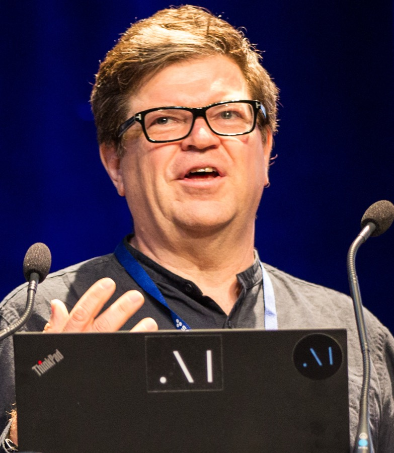
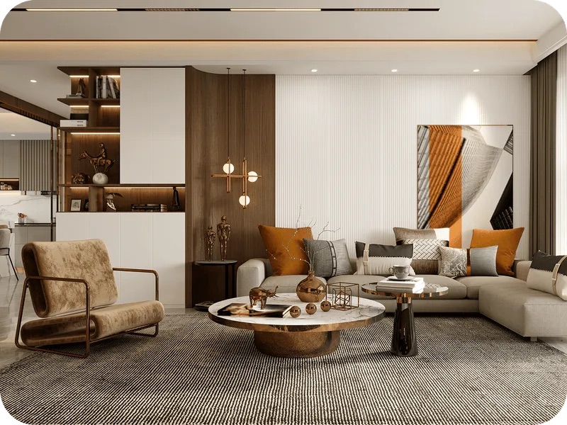

# 쓰임새를 모르고 만든 데이터로 좋은 AI가 나올까?

_얀 르쿤과 페이페이 리의 월드모델 회사가 제품 계획을 밝히지 않아, 학습 데이터를 대는 공급사도 무엇에 맞춰 만들지 모른다_

## Executive Summary

> [!callout]
> 테크크런치의 AI 에디터 러셀 브랜덤이 9월 18일에 올리고 이틀 뒤 다시 손본 기사 하나가 월드모델 업계의 이상한 풍경을 전한다. 얀 르쿤이 세운 AMI 랩스와 페이페이 리가 세운 월드 랩스는 화제도 돈도 넉넉히 모았는데, 그 기술을 어디에 팔 것이냐는 물음 앞에서는 말이 흐려진다. 이 글은 그 침묵이 모델을 만드는 쪽이 아니라 데이터를 만드는 쪽에 무엇을 남기는지를 본다.

> 기사에서 가장 오래 남는 말은 모델 회사가 아니라 공급사에서 나왔다. 이 회사들에 3D 학습 데이터를 대는 피지클의 대표 알렉스 드 비강은 고객이 정확히 무엇을 만드는지 여전히 모른다고 했다. 더 알려 주면 더 쓸모 있는 데이터를 만들 수 있을 텐데, 라는 것이다. 데이터가 모자란다는 흔한 진단과는 결이 다르다. 만들 물량도 능력도 있는데 무엇에 맞춰 만들지를 모르는 쪽에 가깝다.

> 3절까지는 기사와 공개된 자료에 적힌 것을 따라간다. 4절에서 이 상황을 데이터 사양서의 문제로 옮겨 읽는 대목은 기사에 없는 이 글의 해석이다.

### 주요 수치

출처: 각 회사 발표와 보도. 자세한 출처는 본문에 걸어 두었다.

<!-- stat-card -->
**10억 3천만 달러** — AMI 랩스가 받은 시드 투자 — 2026년 3월 발표. 투자 전 기업가치 35억 달러로, 유럽에서 나온 시드 라운드 가운데 가장 큰 규모다

<!-- stat-card -->
**3~5년** — 르쿤이 말한 범용 시스템 목표 시점 — 1~2년 안에 기업 파트너와 논의를 시작하고 3~5년 안에 두루 쓸 만한 지능 시스템을 내놓겠다고 AFP에 말했다. 지금은 제품도 매출도 없다

<!-- stat-card -->
**12억 3천만 달러** — 월드 랩스의 누적 조달액 — 2026년 2월 10억 달러를 더 모으면서 첫 제품 마블을 정식 출시했다. 오토데스크가 2억 달러로 라운드를 받쳤다

<!-- stat-card -->
**수백만 점** — 피지클이 내건 시뮬레이션용 3D 자산 수 — 2026년 3월 엔비디아 GTC에서 공개했다. 마찰과 질량, 충돌 속성을 형상과 재질에서 자동으로 끌어낸다고 밝혔다

## 돈은 모였는데 무엇을 만들지는 말하지 않는다

브랜덤은 [기사](https://techcrunch.com/2026/09/20/world-model-companies-are-keeping-a-lot-of-secrets/)에서 자신이 올인 콘퍼런스의 월드모델 패널을 진행했다고 적었다. 같은 이름의 팟캐스트와는 무관한 행사다. 그 자리에서 이 분야의 큰 두 곳을 AMI 랩스와 월드 랩스로 꼽으면서, 두 회사가 화제와 자금은 잔뜩 모았는데 돈을 벌려는 노력에서는 꽤 아래쪽에 있다고 썼다.

*▲ 메타를 떠난 얀 르쿤은 2025년 12월 파리에서 AMI 랩스를 세웠다 | 사진: Jérémy Barande (CC BY-SA 2.0), [Wikimedia Commons](https://commons.wikimedia.org/wiki/File:Yann_LeCun_-_2018_(cropped).jpg)*

기사의 설명을 따르면 월드모델의 핵심은 공간 지능을 자동으로 다루는 일이다. 가장 단순한 형태는 자율주행차를 움직이는 모델처럼 세상을 오갈 수 있게 그려 둔 지도다. 그런데 자율주행차가 차들 사이를 빠져나가게 해 주는 바로 그 방식이 휴머노이드 로봇이 상자를 나르는 데에도 쓰일 수 있다. 그래서 갈 수 있는 방향이 로보틱스부터 조작 가능한 영상, 더 복잡한 자율주행까지 넓게 열려 있다.

방향이 넓다는 말은 어디로 갈지 아직 고르지 않았다는 말이기도 하다. 상용화가 실제로 어디서 먼저 보이겠느냐고 밀어붙이자 대답이 뿌예졌다고 브랜덤은 적었다. AMI 랩스에서 월드모델을 맡은 마이클 라바는 패널에서 이렇게 답했다. 이야기할 준비가 되면 이야기하겠다는 것이다. 이메일로 다시 물었을 때 돌아온 답도 다르지 않았다. 아직 연구하고 만드는 단계라 제품 계획이나 일정을 공개적으로 이야기하지 않는다는 내용이었다.

아무것도 안 하고 있다는 뜻은 아니다. 기사에 따르면 AMI 랩스는 제조와 생명의학, 로보틱스에 이미 발을 걸쳤고 의사가 쓰는 AI 소프트웨어에도 협업으로 닿아 있다. 걸친 자리는 여럿인데 어느 쪽이 먼저 제품이 되는지는 말하지 않는 상태다.

상대적으로 말이 많은 쪽은 월드 랩스다. 브랜덤은 이 회사의 마블을 이 분야에서 가장 완성도가 높은 제품으로 꼽았고, 데모가 단순한 미디어 제작부터 비디오 게임용 탐험 가능 환경, CGI 효과까지 걸쳐 있다고 적었다. 마블은 2025년 11월 제한된 베타로 나왔다가 2026년 2월 정식 출시됐다. 같은 달 이 회사는 [10억 달러를 추가로 모았다](https://theaiinsider.tech/2026/02/19/fei-fei-lis-world-labs-raises-1b-in-fresh-funding-to-advance-development-of-world-models/). 오토데스크가 2억 달러를 넣어 라운드를 받쳤고 엔비디아와 AMD도 참여했다. 누적 조달액은 12억 3천만 달러가 됐다. 그래도 이 제품 다음에 무엇이 오는지는 마찬가지로 비어 있다.

## 왜 아무도 먼저 말하지 않나

기사가 내놓는 설명은 두 갈래로 읽힌다. 하나는 경쟁이고 하나는 돈이다.

경쟁 논리는 간단하다. 어디에 쓸 기술인지를 먼저 밝히면 시장으로 가는 길이 드러나고, 그 길이 보이는 순간 경쟁사도 그 길을 향해 자금을 모을 수 있다. 브랜덤은 류츠신의 독자라면 알아볼 암흑의 숲 상황이라고 적었다. 숲에 누가 또 있는지 모른다면 관심을 끌지 않는 편이 낫다는 것이다. 자금이 넉넉하다는 사실이 오히려 이 계산을 강하게 만든다. 나를 조용히 만들게 해 준 그 돈이 잠재적 경쟁자들도 함께 먹이고 있기 때문이다.

자금 이야기는 침묵을 견딜 체력에 관한 것이다. AMI 랩스는 2025년 12월 파리에서 세워졌고, 석 달 뒤인 2026년 3월에 [10억 3천만 달러를 시드로 받았다](https://techcrunch.com/2026/03/09/yann-lecuns-ami-labs-raises-1-03-billion-to-build-world-models/). 투자 전 기업가치는 35억 달러였고, 유럽에서 나온 시드 라운드 가운데 가장 컸다. 대표 알렉상드르 르브룅은 이 회사가 3개월 만에 제품을 내고 6개월 만에 매출을 올리는 흔한 응용 AI 스타트업이 아니라고 테크크런치에 말했다. 근본 연구에서 출발하는 기획이라는 설명이었다. 르쿤 본인은 AFP에 1~2년 안에 기업 파트너와 논의를 시작하고, 3~5년 안에 두루 쓸 만한 지능 시스템을 내놓는 것이 목표라고 말했다. 이 라운드를 다룬 보도들은 그동안 이 회사가 팔 제품 없는 연구 조직으로 남을 것이라고 적었다. 5년쯤이라는 기간은 그 보도들의 정리이고, 회사가 공언한 일정은 아니다.

여기에 하나가 더 붙는다. 월드모델이라는 말 자체가 아직 넓다는 사정이다. 르브룅은 반년쯤 지나면 모든 회사가 자금을 모으려고 스스로를 월드모델 회사라 부를 것이라고 예측한 적이 있다. 이름이 넓으면 무엇에 쓸지 특정하지 않아도 투자 서사가 성립한다. 침묵에 드는 비용이 그만큼 낮아진다.

월드 랩스는 실제로 꽤 많은 말을 했다. 2026년 6월 3일 이 회사는 월드모델이라는 말을 세 갈래로 가르는 [글](https://drfeifei.substack.com/p/a-functional-taxonomy-of-world-models)을 냈다. 사람 눈에 보일 픽셀을 내놓는 렌더러, 사람과 프로그램이 함께 계산하고 다룰 수 있는 상태를 내놓는 시뮬레이터, 다음에 무엇을 할지 행동을 내놓는 플래너다. 셋 가운데 시뮬레이터가 가장 주목을 덜 받으면서 가장 중요하다는 것이 이 글의 판단이었다. 데이터 이야기도 들어 있다. 기하 구조와 재질 속성, 물리 주석이 명시된 3D 데이터는 렌더러가 학습하는 인터넷 영상보다 몇 자릿수나 드물다고 짚었다.

*▲ 월드 랩스가 2026년 6월 3일 낸 분류 글의 표지 그림 — 렌더러가 내놓는 2차원 그림과 시뮬레이터가 다루는 3차원 세계를 나란히 그렸다 | Source: [World Labs (Substack)](https://drfeifei.substack.com/p/a-functional-taxonomy-of-world-models)*

무엇이 모자란지까지 공개한 셈이다. 그런데 이걸로 데이터를 만드는 쪽의 물음이 풀리지는 않는다. 드문 것이 무엇인지는 알려 줬지만, 그 데이터가 어느 과제에서 얼마나 정확해야 값을 하는지는 열려 있다. 목록을 받은 것이지 과제를 받은 것은 아니다.

> [!callout]
> 경쟁과 자금, 앞의 두 논리를 합치면 이 회사들의 침묵은 충분히 합리적이다. 말하지 않아서 잃을 것이 적고, 말해서 잃을 것이 크다. 다만 이 계산은 회사 경계 안에서만 맞아떨어진다. 경계 밖에는 그 회사가 무엇을 만드는지에 맞춰 일해야 하는 사람들이 있다.

## 침묵의 비용은 데이터를 만드는 쪽이 치른다

브랜덤은 같은 콘퍼런스의 복도에서 피지클의 대표 알렉스 드 비강을 만났다. 피지클은 2026년 3월 엔비디아 GTC에서 스텔스를 벗은 프랑스 회사다. 리테일용 3D 데이터를 다루던 엔파이닛 팀이 피지컬 AI 전용으로 새로 세웠다. 출발 시점에 시뮬레이션에 바로 넣을 수 있는 3D 자산과 환경을 수백만 점 갖췄다고 [발표했다](https://www.prnewswire.com/news-releases/physicl-launches-the-data-infrastructure-layer-for-physical-ai-at-nvidia-gtc-302715165.html). 겨냥한 곳은 셋이다. 로봇, 월드모델, 그리고 이미지와 언어를 함께 다루는 모델이다. 같은 발표문은 이 플랫폼이 이미 지원하고 있는 팀으로 메타와 딥마인드, 월드 랩스, 게티 이미지를 적었다. 자산을 어떻게 만드는지는 [자사 사이트](https://www.physicl.ai/)에 적혀 있다. 들어온 원본을 물리 속성이 태깅된 3D로 바꾸면서 형상을 정리하고 재질을 확정하고 마찰과 질량, 충돌 속성을 자동으로 끌어낸다는 설명이다.

*▲ 피지클이 만드는 시뮬레이션용 3D 장면의 예시 — 형상·재질·물리 속성이 함께 태깅된다 | Source: [physicl.ai](https://www.physicl.ai/)*

드 비강이 발표문에 적어 둔 창업 논리는 분명하다. AI의 큰 도약에는 언제나 새로운 데이터 층이 필요했고, 피지컬 AI에서 빠져 있는 층은 구조가 잡혀 있고 공간적으로 일관되며 물리를 아는 데이터라는 것이다. 모델이 실제로 배울 수 있는 형태여야 한다는 단서가 그 문장에 붙어 있다.

그런 회사가 정작 고객이 무엇을 만드는지 모른 채 일하고 있다. 자기 데이터가 유용했다는 것은 안다. 무엇에 유용했는지를 모른다. 그래서 그가 한 말은 하소연이 아니라 사양 이야기로 읽힌다. 더 알려 주면 더 쓸모 있는 데이터를 만들 수 있을 텐데, 라는 문장은 만들 능력이 목적 부재에 막혀 있다는 보고다.

이 차이는 자산 하나를 만드는 장면에서 드러난다. 창고 한 칸을 3D로 짓는다고 하자. 로봇 팔이 물건 집는 법을 배우는 데 쓸 것이라면 손이 닿는 면의 마찰과 물체의 질량, 잡을 때 생기는 미세한 변형이 맞아야 한다. 영상이나 게임 환경을 만드는 데 쓸 것이라면 겉모습과 조명, 장면의 다양성이 먼저다. 둘 다 최고 수준으로 맞추려면 비용이 몇 배가 되고, 어느 쪽도 정해 주지 않으면 양쪽에 조금씩 모자란 자산이 나온다.
