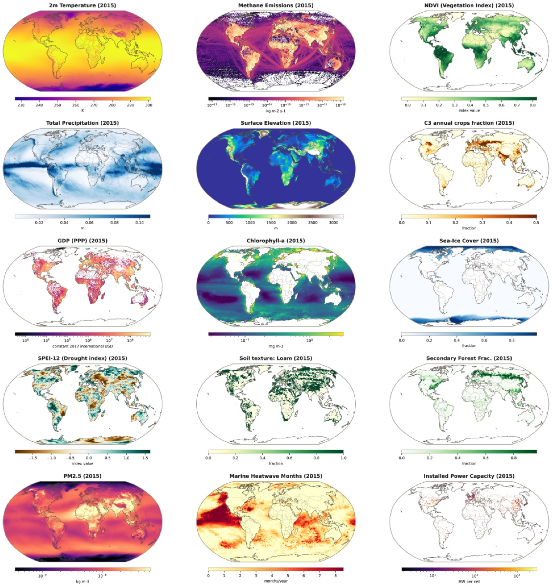
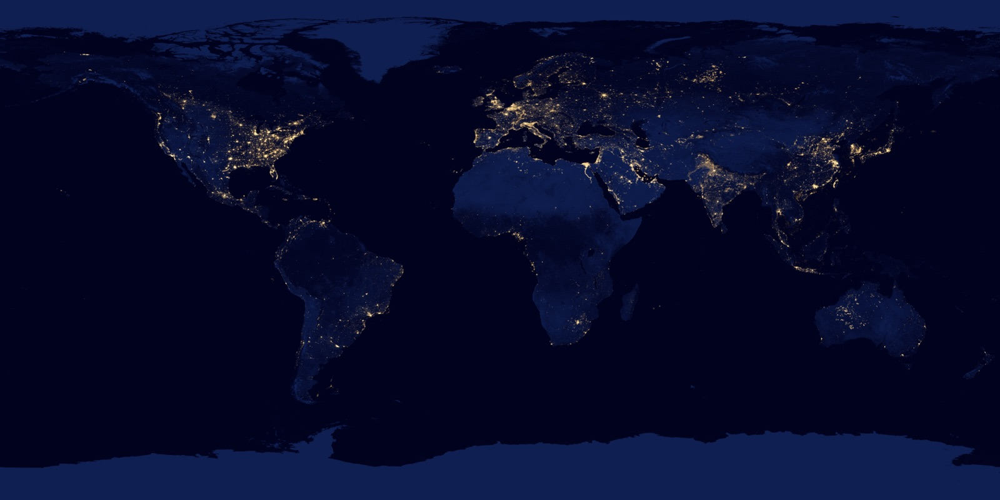

# WorldTensor Puts People Into the Climate Grid

_Politecnico di Milano_

## Executive Summary

> [!callout]
> For the past few years, Earth-system foundation models have grown up on physical data alone — weather, ocean, cryosphere. ClimaX and ECMWF's AIFS are emblematic of that path. Left out of training was the one presence that both alters the environment and reacts to its changes: people. In July 2026, a team from Politecnico di Milano and CMCC posted WorldTensor to arXiv, a dataset built to fill that gap. It aligns 757 variables — emissions, land use, infrastructure, disasters, socioeconomic indicators — onto a single 0.25° grid, placing the people who move the planet onto the same coordinates as physical data for the first time.

> The point is not scale but alignment. Climate reanalysis arrives on dense grids, while population, GDP, power plants, and conflict statistics are scattered as points, administrative boundaries, and sparse yearly snapshots. Resolution, projection, and temporal cadence all differ, so no matter how much data there is, it cannot be fed into one model as-is. What WorldTensor did was not the cleaning that fixes errors, but the work of reconciling sources that could not speak to one another onto a single common coordinate system.

> Even for someone who never touches climate science, this case leaves behind a question familiar to anyone who works with data: the real difficulty of AI-Ready Data is not the cleaning that fills in missing values, but giving heterogeneous sources a common language. And who defines that common language — with which grid — decides how a model gets to see the world.

*▲ 15 representative WorldTensor variables for 2015 — from physical fields like temperature and precipitation to human variables like GDP and installed power capacity, all placed on the same 0.25° grid | Source: [Rodriguez-Pardo & Tavoni, arXiv:2607.03298](https://arxiv.org/abs/2607.03298) (CC BY 4.0)*

<!-- stat-card -->
**757 variables** — aligned on one grid — climate, emissions, land use, disasters, socioeconomics on shared coordinates

<!-- stat-card -->
**1.03M cells** — 0.25° grid — Earth's surface split into 720×1,440 = 1,036,800 cells

<!-- stat-card -->
**22 human variables** — in the same cells — population, GDP, HDI, night lights, urban area, conflict aligned for the first time

<!-- stat-card -->
**annual limit** — short signals fade — captures El Niño and conflict, but COVID-style shocks blur

## What Earth-Learning AI Never Saw

Earth-system foundation models have multiplied quickly in the last few years. ClimaX emulates climate and weather; ECMWF's AIFS forecasts weather at daily resolution. They share one trait: all were trained on physical variables alone — temperature, precipitation, ocean currents, sea ice. In effect, they saw the planet only as a collection of physical phenomena.

This gap did not arise from a lack of interest. It is a structural problem, born from the fact that the data come in fundamentally different shapes. Climate reanalysis arrives on grids that blanket the whole planet at hourly or daily resolution. Population, GDP, disaster, and infrastructure statistics, by contrast, are scattered not as grids but as points (power-plant coordinates), vectors (administrative boundaries), and sparse snapshots taken once every few years. Physical data and human data record the same planet, yet they are written in different languages.

*▲ Night lights are one of the 22 human-system variables WorldTensor aligns. Human presence is visible as light even from orbit, yet models trained on physical data alone never carried this signal | Source: [NASA Earth Observatory](https://commons.wikimedia.org/wiki/File:The_earth_at_night.jpg)*

The WorldTensor team's motivation starts here. Human systems both drive environmental change and respond to it, yet there was no resource to place the two on the same coordinate system and learn them together. For a single model to see the loop — emissions pushing climate, climate in turn pushing migration and conflict — emissions, climate, and conflict must first live inside the same cell.

> [!callout]
> **Core observation**: Earth-system AI failed to see people not because the data were missing, but because people's data were scattered in a different shape from physical data. What blocked integration was not quantity but the coordinate system.

## Reconciling Scattered Data onto One Grid

WorldTensor places 757 variable series onto a single regular 0.25° grid — 658 time-varying variables plus 99 static layers such as terrain and soil. The grid cuts latitude and longitude at 0.25° intervals, dividing Earth's surface into 720×1,440, or 1,036,800 cells. Climate (ERA5) 276, land use (LUH3) 112, static terrain and soil 99, emissions (EDGAR, CEDS, ODIAC) 67, energy 52, air quality 40, disasters and conflict 28, and a human-system set of 22 holding population density, GDP, HDI, night lights, and urban area — all meet on this one grid.

The team calls this work harmonisation, not cleaning. It is not filling in missing values or fixing errors, but forcibly fitting data scattered across different resolutions, projections, and temporal cadences into one common coordinate system. The method splits into three tracks depending on the shape of the source.

### 2.1. Three Alignment Techniques

- **Spatial harmonisation** — continuously varying fields like temperature are fitted to the grid with bilinear resampling; categorical values like land cover use nearest-neighbour assignment. Where the source is finer than the grid, area-weighted averaging presses it down.
- **Rasterisation** — point data like power plants or earthquakes are placed directly in the relevant cell and also converted into a separate field holding the distance to the nearest event. Line and area data such as administrative regions are estimated as density in a metric coordinate system.
- **Temporal harmonisation** — years without data are left blank rather than filled arbitrarily. The principle is to reflect the source's actual availability honestly instead of inventing values that do not exist.
