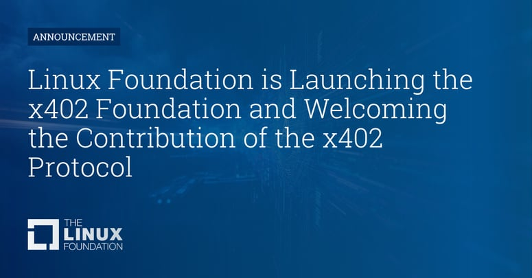
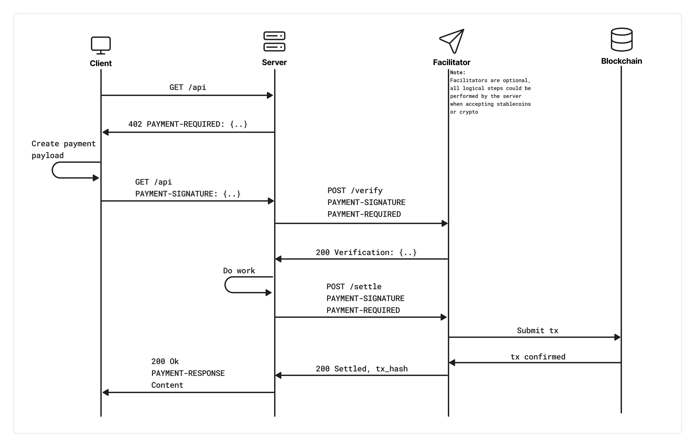

# AI Agents Pay Their Own Bills — x402 Embeds a Wallet into HTTP

_HTTP 402, dormant for 30 years, is back as the autonomous payment standard for AI agents. 100M+ transactions processed. Google, AWS, KakaoPay and 20+ companies joined the Linux Foundation._

## Executive Summary

In May 2025, Coinbase dusted off a status code that had sat unused for three decades. HTTP 402 — "Payment Required." Left in the original HTTP spec as a placeholder for a future paid internet, it was forgotten the moment credit cards took over. Now it's back — as the autonomous payment standard for AI agents.

x402 works simply: a server responds to an API request with 402; the client (an agent) automatically sends USDC and gains access. No account creation, no API key management, no human in the loop. V2 launched in December 2025. On April 2, 2026, x402 joined the Linux Foundation with Google, AWS, Microsoft, Stripe, Visa, Mastercard, KakaoPay, and 20+ others as founding members.

<!-- stat-card -->
**100M+** — Total payments processed

<!-- stat-card -->
**$24M** — Volume (last 30 days)

<!-- stat-card -->
**75M** — Transactions (last 30 days)

<!-- stat-card -->
**20+** — Linux Foundation founding members

This post covers how x402 actually works, which services are using it, whether it works in Korea, and what it changes for data businesses.

## The Resurrection of HTTP 402 — A Status Code Three Decades Late

HTTP status codes like 404 (Not Found) and 500 (Internal Server Error) are part of everyday internet life. But 402 is different. When HTTP was designed in 1991, its authors reserved this code with the expectation that a paid internet would eventually arrive. It never did — credit cards and subscription models took over, and 402 gathered dust for 30 years.

Coinbase recognized that this code's moment had finally come. The dominant actors on the internet are shifting from humans to AI agents. Agents don't create accounts. They don't go through KYC. They don't enter credit card numbers. But they do make HTTP requests — and if payment can be embedded in those requests, the way the internet handles money changes fundamentally.

<!-- stat-card -->
**x402's core premise** — "Payments on the internet are fundamentally flawed. Filling out a form is a human behavior that doesn't match the programmatic nature of the internet. It's time for an open, internet-native form of payments." — — x402.org

### 1.1 The Problem with the Old Way

- 1. Create account with API provider
- 2. Add payment method, wait for KYC
- 3. Buy credits or choose subscription
- 4. Manage API keys securely
- 5. Pay — slow, fees, chargebacks

<!-- stat-card -->
**Old way (5 steps)**

- 1. HTTP request → server responds 402
- 2. Agent sends USDC instantly
- 3. API access granted — no accounts or keys

<!-- stat-card -->
**x402 way (3 steps)**

### 1.2 One Year of Growth

May 2025

Coinbase publicly launches x402 V1 — HTTP 402 payment standard proposal

Sep 2025

x402 Foundation co-founded with Cloudflare — pay-per-crawl pilot launched

Dec 2025

x402 V2 released — multi-chain, wallet sessions, dynamic routing. Surpasses 100M payments.

Apr 2026

Joins Linux Foundation. Google, Microsoft, AWS, Stripe, Visa, Mastercard, KakaoPay and 20+ companies sign on as founding members.

*▲ April 2, 2026: x402 joins the Linux Foundation with 20+ industry partners | Source: [Linux Foundation](https://www.linuxfoundation.org/press/linux-foundation-launches-x402-foundation-to-standardize-ai-agent-payment-protocols)*

## How It Actually Works — Protocol Anatomy

x402 follows the HTTP request-response cycle exactly. It's not a new communication protocol — it layers payment on top of existing HTTP.

### 2.1 The 5-Step Payment Flow

<!-- stat-card -->
**①** — Client → Server: HTTP request — The agent sends a normal GET/POST request to a paid API endpoint.

<!-- stat-card -->
**②** — Server → Client: 402 Payment Required — The server responds with machine-readable payment terms. — `HTTP/1.1 402 Payment Required
Content-Type: application/json

{
  "accepts": [{
    "scheme": "exact",
    "network": "base-mainnet",
    "maxAmountRequired": "1000000",  // $1.00 USDC
    "asset": "0x833589...USDC",
    "payTo": "0xMerchantAddress"
  }],
  "description": "Weather data - 1 request"
}`

<!-- stat-card -->
**③** — Client → Server: Retry with payment header — The agent executes an on-chain USDC transfer and re-sends the original request with a payment authorization header.

<!-- stat-card -->
**④** — Payment facilitator: verify and settle — The Coinbase CDP facilitator (or a third-party) verifies the payment payload and confirms on-chain settlement.

<!-- stat-card -->
**⑤** — Server → Client: 200 OK + resource — After settlement confirmation, the server returns the requested data. The entire flow completes in seconds.

*▲ x402 official sequence diagram — 4-party flow: Client, Server, Facilitator, Blockchain. Settlement completes without human intervention | Source: [Coinbase/x402 GitHub](https://github.com/coinbase/x402)*

### 2.2 One Line of Code to Add a Paywall

`app.use(
  paymentMiddleware({
    "GET /weather": {
      accepts: [{ network: "base-mainnet", asset: "USDC", maxAmount: "1.00" }],
      description: "Weather data per request"
    },
    "GET /analytics": {
      accepts: [{ network: "base-mainnet", asset: "USDC", maxAmount: "0.10" }],
      description: "Analytics query"
    }
  })
);`

### 2.3 What's New in V2

- •Wallet-based sessions: Pay once, and the same agent maintains access without re-paying every call
- •Dynamic payTo routing: Recipient and amount determined per-request — perfect for marketplaces and multi-tenant APIs
- •Multi-chain by default: Base, Solana, Polygon, and other L2s without custom code
- •Legacy rail compatibility: ACH, SEPA, and card payments via the same interface (deferred payment scheme)
- •Plugin-driven SDK: Add new chains and payment methods without touching the core spec

## Robots Settling Their Own Bills — The Agent Economy in Action

The most dramatic x402 demonstration comes from OpenMind's robot dog "Bits." When its battery ran low, Bits autonomously located the nearest charging station, plugged itself in, and paid for electricity in USDC — without any human intervention. HTTP request → 402 response → USDC transfer → charging begins. This is the agent economy, made tangible.

### 3.1 Key Services in the Ecosystem

### 3.2 MCP + x402 — Tools with Price Tags

## The Data Economy's New Payment Layer

### 4.1 From Subscriptions to Pay-Per-Query

### 4.2 What Changes for Data Marketplaces

- •Dataset access gates — protect datasets behind x402 endpoints; agents buy exactly what they need
- •Real-time data streams — sell financial ticks and sensor data per event or per second
- •AI model inference — sell proprietary model outputs as paid API calls
- •Data quality validation — services like DataClinic auto-inserted into agent pipelines as paid quality gates

### 4.3 Agents Autonomously Purchasing Data Quality

## Korea's Angle — KakaoPay and the KRW Stablecoin Future

### 5.1 KakaoPay — A Linux Foundation Founding Member

### 5.2 The KRW Stablecoin Synergy

- •Visa publicly called Korea "the optimal country for stablecoin experimentation" (April 2026)
- •KB, Shinhan, Hana, and Toss are all developing KRW-pegged stablecoins
- •Korea's Digital Asset Basic Act is being legislated — KRW stablecoin issuance requirements being codified
- •x402 V2's plugin-driven SDK means adding a KRW facilitator requires no core spec changes

## DataClinic's Place in the x402 Economy

### 6.1 The DataClinic MCP + x402 Scenario

### 6.2 What to Explore Now

- •Open a Coinbase CDP developer account → test x402's free tier (1,000 transactions/month)
- •PoC: add x402 middleware to a DataClinic API endpoint — one line of Node.js code
- •Monitor KakaoPay's x402 roadmap — integrate their facilitator when KRW payments go live
- •Deploy a lightweight DataClinic API on Cloudflare Workers → global x402 pay-per-query access point
