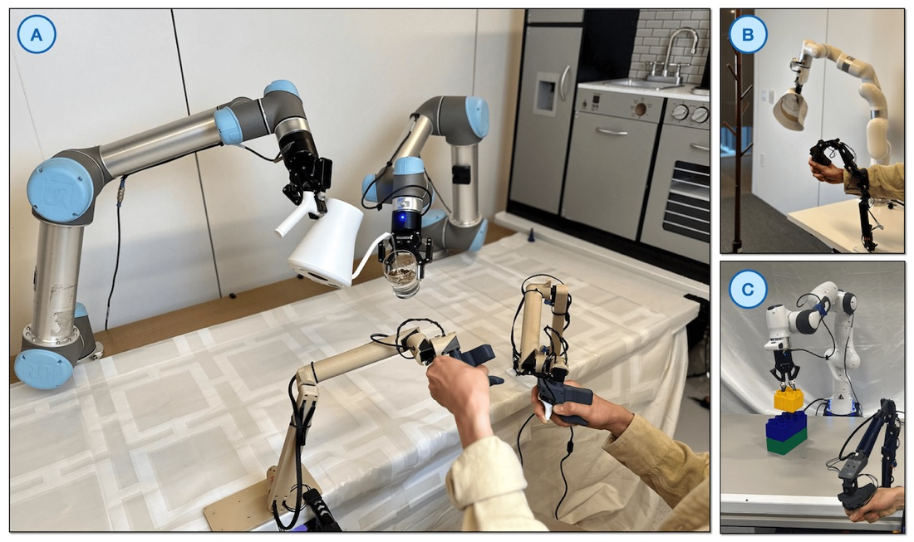

# XDOF, a Robot Data Company Valued at $1.2 Billion Three Months Out of Stealth

_A company that builds neither models nor robots sells the teleoperation collection pipeline behind the ABC-130K dataset_

## Executive Summary

> [!callout]
> On September 4, TechCrunch reported that XDOF, a startup that collects teleoperation data for robot learning, is in late-stage talks for a Series B at a valuation of about $1.2 billion, led by 8VC. That comes three months after the company left stealth in June by disclosing a $70 million Series A. XDOF builds no models and no robots. It gathers records of humans moving robots remotely and hands them to frontier AI labs and robotics companies.

> What that valuation rests on is visible in a dataset released in June. ABC-130K, which lists two XDOF founders among its co-authors, is 3,553 hours of bimanual manipulation. All 3,553 hours were recorded on one kind of workstation, inside an enclosure walled off on three sides in white. The paper states for itself that this narrows background diversity. And separately from the 3,553 hours released, the researchers had an internal 7,000-hour corpus they used for development.

> The annotations do not cover all of it either. The layer that segments each episode into subtasks and describes them runs to 1,552 of the 3,553 hours, and it sits thicker on some tasks than on others. A quote listing only total hours does not show that, so for teams that buy robot learning data from outside, the question left over is what to write into the contract.

### Key figures

Source: Allshire et al., [Scalable Behavior Cloning with Open Data, Training, and Evaluation](https://arxiv.org/abs/2606.27375) (arXiv:2606.27375, June 25, 2026); Temkin, [TechCrunch](https://techcrunch.com/2026/09/04/xdof-just-three-months-out-of-stealth-is-in-talks-for-a-series-b-at-a-1-2b-valuation/) (September 4, 2026)

<!-- stat-card -->
**3,553 hours** — Real-robot manipulation in ABC-130K — 134,806 episodes across 195 tasks. The internal corpus the same team held for development runs to 7,000 hours

<!-- stat-card -->
**$8,000** — Price of one rig that recorded it — The paper puts the AgiBot G1 at $30,000 and ALOHA-class rigs at about $20,000

<!-- stat-card -->
**44%** — Share carrying subtask annotations — 1,552 of the 3,553 hours. Coverage varies sharply by task, and every t-shirt-folding episode has them

<!-- stat-card -->
**20** — Customers XDOF has disclosed — How many of them are frontier labs is described only as several

## Venture Investors Approached a Company With No Plans to Raise Again

XDOF was founded in 2024 by the UC Berkeley researchers Philipp Wu (CEO) and Fred Shentu (CTO). It disclosed a $70 million Series A in June, with participation from Thrive Capital, Spark Capital, Andreessen Horowitz, Lux, and WndrCo. The DOF in the name comes from degrees of freedom, the number of independent motions a robot can perform, and the X in front stands for putting no ceiling on that number, as Wu explained it. The company was not planning to raise again so soon. Growth accelerated to the point where annualized revenue is approaching $50 million, and venture investors approached the company about a new round, people with knowledge of the deal told TechCrunch.

None of this is settled. TechCrunch also said it was unable to learn the total capital being raised or whether the $1.2 billion valuation includes the new funding. The terms of the deal are not final and could still change.

Investors describe the company as the Scale AI or Mercor for physical robotics. Mecka AI is named as a rival in real-world data collection, and human-data platforms expanding beyond large language models, such as Scale AI and Micro1, are moving toward the same ground. The company previously told TechCrunch that it works with 20 customers, several of which are frontier AI labs. That is not the same as saying all 20 are frontier labs. How many are has not been disclosed.

## What It Sells Is the Collection Pipeline, Not the Labels

TechCrunch summarized the company's aim as building the data pipelines, collection tools, and annotation systems that frontier AI labs and robotics companies cannot easily build themselves. The shape of it is closer to outsourcing the robotics industry's entire data-supply chain. Large language models trained on the whole internet, but physical robots have no equivalent body of real-world data to draw from, which makes collection itself the bottleneck.

Collection runs along two tracks. In one, a person moves a robot arm remotely and leaves behind a demonstration. In the other, a person wears sensors on their body and records everyday work such as folding clothes or flattening boxes. The company says it plans to hire and train both teleoperators and egocentric operators worldwide. Because the source of the product is people who move robots rather than people who attach labels, the labor economics differ from those of a conventional data-labeling company.

The company sorts this raw material into three tiers. The most valuable tier is teleoperation data collected on the very robot a customer will deploy. Next comes teleoperation on general-purpose rigs like GELLO. At the bottom sits everyday human motion captured through wearable sensors, and in June the company said it plans to build those sensors itself. It added that a business handing over data alone could be a dead end, which is why cleaning, tooling, and annotation are attached to it.

Wu put the reason labs do not do this themselves in operational terms. You need a warehouse of hundreds of thousands of square feet with hundreds of robots, and you need to maintain those robots, calibrate their physical parameters, and properly train operators. What a company of about 60 people as of June sells to 20 customers is closer to a promise to carry that operational burden for them.

### 2.1. The Company That Started With a $300 Leader Arm

Wu studied how robots learn from large datasets as a PhD student. What blocked the research was the lack of large-scale data to work with, he told TechCrunch in June. So he and Shentu built a low-cost teleoperation system called GELLO, and that work became an influential paper in robotics and the foundation for the company.

The design described in the 2023 paper is simple. You build a leader device that shares the kinematic structure of the robot arm you want to control, using 3D-printed parts and inexpensive off-the-shelf servo motors. The bill of materials for one device comes to under $300. The comparison table in the paper puts a 3D mouse at $150, a Meta Quest 2 setup at $300, robot-on-robot teleoperation at $30,000, and a haptic device at $40,000. The researchers ran a user study showing that GELLO collects demonstrations more reliably and more efficiently than VR controllers or a 3D mouse, and released designs for the Franka, UR5, and xArm.

*▲ A GELLO leader device (foreground, tan 3D-printed arm) teleoperating the follower robot arm behind it | Source: [GELLO project page](https://wuphilipp.github.io/gello_site/) (Wu et al., 2023)*

> [!callout]
> The General in GELLO does not mean a single standard coordinate frame. It means a methodology in which you build a separate leader device matching each target arm's structure. What GELLO standardized is not a coordinate frame but a collection method, the low-cost leader arm.

## The 3,553 Hours Were Recorded Inside White Walls

The paper posted to arXiv on June 25, "Scalable Behavior Cloning with Open Data, Training, and Evaluation," released a dataset, training code, and a simulator together under the name ABC. Its centerpiece, ABC-130K, holds 134,806 episodes across 195 tasks for 3,553 hours. The abstract rounds that to 3,500. Another 400 hours of simulated teleoperation came with it. The license is Apache 2.0 and the data is on Hugging Face.

The released 3,553 hours are not everything the researchers had. The paper states that its architecture ablations were run not on the public dataset but on a larger internal corpus of 7,000 hours, described as what the team had during development before the release dataset was finalized. The fine-tuning experiments lined up three starting points, and a policy pretrained on the released 3,553 hours beat training from scratch while a policy pretrained on the internal 7,000 hours beat that in turn, on all four tasks. How the two corpora differ in content is not disclosed, but the paper measured for itself how much of that difference survives into results.

Appendix C describes the hardware that recorded all of it. Collection and evaluation both ran on a bimanual platform of two I2RT YAM 6-DoF arms mounted parallel to each other on a table. The cameras are three Intel RealSense D405 units streaming at 30Hz, one mounted above the workstation for a third-person view and two on the wrists. The paper calls this setup an $8,000 YAM station in the body text. And the two arms sit inside an enclosure walled off on three sides in white. The rig is not uniform down to the fingertips: the hardware figure notes that a subset of the dataset was collected with a different gripper called FlexPoint, a part the I2RT store currently sells for $699.

"The enclosure narrows background diversity in the training distribution, but (i) reduces variance in evaluation from incidental visual disturbances and (ii) isolates fine-manipulation learning from the confound of background generalization. We note, however, that despite using only data collected in this caged setup, many of our policies transfer outside the cage and can be deployed in some in-the-wild settings."

ABC paper, Appendix C.1 (Hardware)

That trade-off is one the paper states itself. The cost side stays open: how far a policy trained on that data holds up against a different background is a separate question, and the paper logged transfer outside the enclosure as an incidental observation rather than a systematic test.

Box folding is where that cost showed up. The pretrained model alone had zero real-world success there, and even after ten more hours collected under a stricter standard operating procedure and a round of fine-tuning, it reached only 24 percent. So the researchers collected more data by rolling out the policy and stepping in only when it got stuck, and they collected those interventions with the cage removed. Training on the intervention segments alone then let the policy exploit spurious correlations with the background and made it worse. They had to find a new mixture instead, 80 percent from the previous round, 10 percent from the current round's interventions, and 10 percent from the rest of those episodes. The white walls did not only narrow background diversity. They came back as an obstacle when data from a different background had to be mixed in.

Anonymized teleoperator IDs and collection timestamps are attached to all 3,553 hours, while annotations that segment an episode into subtasks and describe each one cover 1,552 of them. Elsewhere the paper puts the annotated share at 44 percent of the whole. A company selling annotation systems and the annotation coverage of a released dataset are two separate numbers, so a procurement conversation has to ask about each. That 44 percent is not spread evenly either. The paper notes that every t-shirt-folding episode is annotated, and coverage swings widely from task to task.

The paper sets its dataset alongside existing open ones. BridgeData-V2 is about 100 hours on a low-cost WidowX arm, DROID is 350 hours on a single Franka arm, and the bimanual data of MolmoAct 2, gathered on the same YAM platform, is 720 hours. The closest in scale is AgiBot World at about 3,000 hours, collected on the $30,000 AgiBot G1, while ALOHA-class rigs run about $20,000 by the paper's account.
