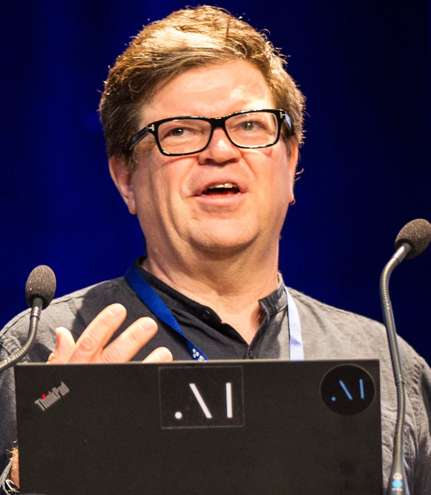
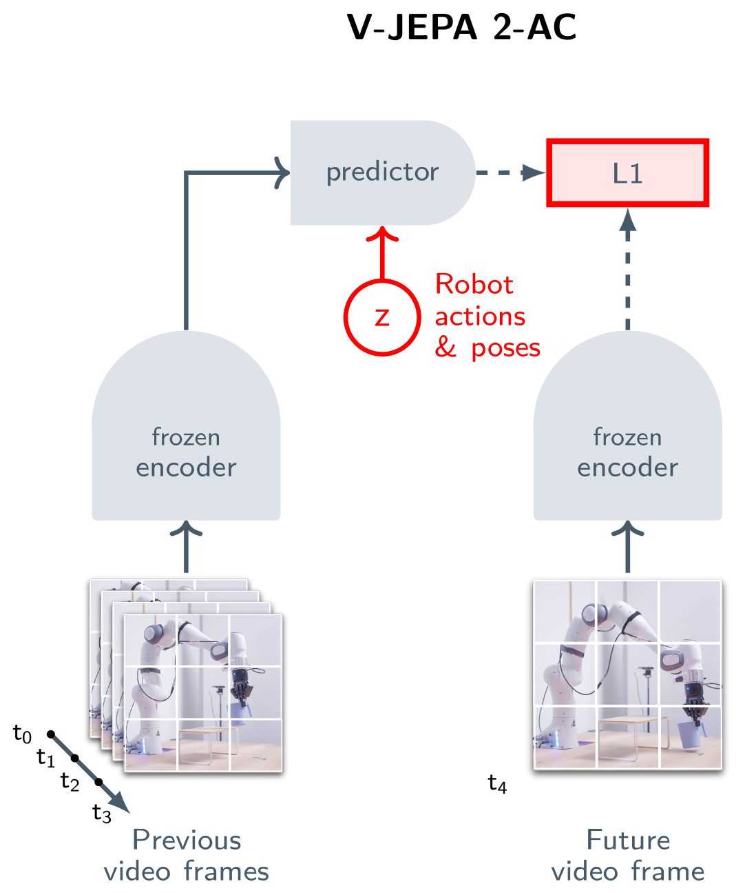

# The Billion Dollar Bet Against Generative AI

_How Yann LeCun_

## Executive Summary

> [!callout]
> Yann LeCun argues that generative AI has fundamental limitations when it comes to understanding the world. Predicting the future pixel by pixel produces only a "blurry average," never reaching the abstract understanding needed for action. His alternative is JEPA (Joint Embedding Predictive Architecture) -- an architecture designed to predict the future in latent representation space rather than pixel space, forcing models to learn the semantic structure of the world.

> This idea is already delivering concrete results. V-JEPA 2 achieved an 80% success rate in zero-shot robot control (versus 15% for Octo), adapting to new environments with just 62 hours of unlabeled video. Meta continues to invest billions in this direction.

> What JEPA aims to prove is clear: the foundation of a good AI model is a good representation space. This shifts the definition of "good data" from quantity or label accuracy to whether data can produce meaningful representations. This piece is the world-model chapter of the [Physical AI](/project/PhysicalAI/en/) series — a different path from VLA intuition for how robots learn.

## Most of the Cake Is Invisible

At NIPS 2016, Yann LeCun compared intelligence to a cake. Reinforcement learning is the cherry on top, supervised learning is the icing, and **unsupervised learning is the cake itself**. The point was not merely about scale. Learning from labeled data captures only a fraction of how humans understand the world. True intelligence, LeCun declared, lies in the ability to infer the structure of the world from observation alone.

Three years later, he revised the metaphor. "Unsupervised learning" sounded too much like "no learning at all." The new name was **self-supervised learning (SSL)** -- extracting supervisory signals from the data itself. In NLP, BERT's masked language model and GPT's next-token prediction were already proving the principle. The challenge was vision. How could the same idea apply to images and video?

> [!callout]
> LeCun's core insight is this: humans process hundreds of thousands of visual frames every day, yet receive labeled feedback only rarely. A baby does not need the label "this is gravity" to understand gravity. Repeatedly watching objects fall is enough. Self-supervised learning is the attempt to replicate this process in machines.

*▲ Yann LeCun at École Polytechnique, 2018 | Source: [Wikimedia Commons (CC BY-SA 2.0)](https://commons.wikimedia.org/wiki/File:Yann_LeCun_-_2018_(cropped).jpg)*

## The Blurry Future -- Structural Limits of Generative AI

GPT predicting the next token and diffusion models recovering images from noise have produced remarkable results. But LeCun argues this approach hits a fundamental wall in the vision domain. The core argument is the **"blurry prediction" problem**.

Consider a model that predicts the next frame of a video pixel by pixel. When predicting one second ahead of a person walking in a room, the person could go left or right. A generative model averages all possibilities, producing a "blurry" frame. Over time, this blur compounds exponentially -- predictions a few seconds out become meaningless fog.

LeCun draws a more fundamental conclusion from this. **"Modeling the world by generating pixels is wasteful and doomed to fail."** The information needed for action is not pixel-level detail but abstract understanding. To pick up a cup, you need to know its position, size, and material -- not recreate the light reflection pattern on its surface.

Comparing the two approaches makes the difference clear.

### Generative Approach

- •Predicts every pixel/token
- •Uncertainty = blurry average
- •Models details unnecessary for action
- •Compute cost scales with resolution

### Predictive Approach (JEPA)

- •Predicts in latent representation space
- •Uncertainty = multiple possible representations
- •Learns only abstract information needed for action
- •Computes only in representation dimension -- efficient

> [!callout]
> The crux of the debate is the question: "Will a bigger model solve this?" LeCun's answer is unequivocal. The problem is not model size but a structural limitation of the approach. The uncertainty in pixel prediction is an intrinsic property of the world, not a consequence of insufficient training data.

## The Rise and Fall of Contrastive Learning

The idea of "learning representations, not pixels" predates JEPA. The first major attempt was **contrastive learning**. SimCLR (Chen et al., 2020) trained representation spaces by pulling different augmentations of the same image closer together and pushing different images apart. It could capture semantic similarity without labels.

But contrastive learning had a structural Achilles' heel: **representation collapse**. The easiest way for an encoder to minimize its loss function is to map every input to nearly the same embedding. Cat or car, send them all to the same point -- the "same image should be close" condition is trivially satisfied. The prediction is perfect, but the learned representation is completely useless.

SimCLR solved this with **negative pairs**. Beyond telling the model "these two images are the same thing (positive)," it explicitly signals "these two images are different things (negative)." It worked, but at a cost. Generating good negative pairs required very large batch sizes (4096-8192), driving up GPU memory and compute.

Siamese networks hit a similar wall. Two identical networks processing different views of the same input -- but without negative signals, training invariably collapsed to a single point. This became the central bottleneck of self-supervised visual learning. The most fundamental challenge of "learning without labels": **how to overcome the temptation of mapping everything to a single point**.

> [!callout]
> Representation collapse is not a mere technical bug. When the learning objective is insufficient, models always find the easiest solution. And the easiest solution is almost always a meaningless one. Without solving this, self-supervised visual learning could never match the success of NLP.

## Barlow Twins and DINO -- Preventing Collapse Without Contrastive Pairs

In 2021, two breakthrough approaches emerged. Both showed how to prevent representation collapse without negative pairs, opening the path to JEPA.

### 4.1. Barlow Twins -- The Redundancy Reduction Principle

Barlow Twins (Zbontar et al., 2021) drew inspiration from neuroscientist Horace Barlow's "redundancy reduction" hypothesis. It computes the cross-correlation matrix of two network outputs and drives it toward the identity matrix. Diagonal elements pushed toward 1 (different views of the same image should have the same representation); off-diagonal elements pushed toward 0 (each dimension of the representation should encode independent information). This structural constraint means each dimension must carry distinct information, making it structurally impossible to collapse everything into a single point.

### 4.2. VICReg -- Balancing Three Forces

VICReg decomposed collapse prevention into three explicit regularization terms. **V**ariance (maintain minimum variance in each representation dimension), **I**nvariance (align representations of different views of the same image), and **C**ovariance (drive inter-dimension covariance to zero -- ensuring each dimension encodes independent information). A more intuitive decomposition of Barlow Twins' insight, making theoretical analysis more tractable.

### 4.3. DINO -- When Attention Sees Meaning

DINO (Caron et al., 2021) used self-distillation. The teacher network is an exponential moving average (EMA) of the student, and the student learns to match the teacher's output. Within this simple framework, a striking phenomenon emerged: the attention maps of Vision Transformers (ViT) **spontaneously developed semantic segmentation boundaries**. Nobody taught the model "this is a cat and that is background," yet it learned those boundaries on its own.

*▲ DINO: student learns by following the EMA teacher (self-distillation) | Source: [Caron et al., arXiv 2104.14294](https://arxiv.org/abs/2104.14294)*

> [!callout]
> What Barlow Twins, VICReg, and DINO proved in common: **representation collapse can be prevented without negative samples.** This was not an incremental improvement but a paradigm shift. Even without explicitly teaching "what is different," structural constraints on the representation space alone can produce meaningful representations. JEPA was built on this discovery.

## JEPA -- Predicting Meaning, Not Pixels

JEPA (Joint Embedding Predictive Architecture) is the logical culmination of everything that came before. Where contrastive learning was based on **comparison** -- "pull similar things closer, push different things apart" -- JEPA shifts the learning objective to **prediction**: "predict the future representation from the current observation." And crucially, this prediction operates in latent representation space, not pixel space.

The architecture has three core components. The **Context Encoder** encodes the observable portion into a representation. The **Predictor** predicts the representation of the unobserved portion from this encoding. The **Target Encoder** generates the "ground truth" representation of the unobserved portion. The Target Encoder is updated as an EMA (exponential moving average) of the Context Encoder, leveraging the self-distillation principle proven by DINO.

The critical insight is that the Predictor predicts **representations**, not pixels. It predicts "what the masked portion means," not "what it looks like." This structurally bypasses the "blurry average" problem of generative models.

*▲ I-JEPA: predicting representations (not pixels) of masked image patches | Source: [Assran et al., arXiv 2301.08243](https://arxiv.org/abs/2301.08243)*

The architecture has evolved rapidly.

### I-JEPA (2023)

Predicted representations of masked patches in images. Achieved SOTA on ImageNet low-shot. 632M parameters, trained on 16 A100 GPUs for 72 hours.

### V-JEPA (Feb 2024)

Extended to video. Learned temporal representation prediction from 2M+ unlabeled videos. Achieved video understanding through feature prediction alone.

### V-JEPA 2 (Jun 2025)

1.2B parameters. SSv2 77.3% top-1, Epic-Kitchens 39.7% R@5 (SOTA). Zero-shot robot control 65-80% success rate.

### VL-JEPA (Dec 2025)

Vision-language extension. Surpassed CLIP/SigLIP2 with 50% fewer learnable parameters and 2.85x decoding efficiency.

> [!callout]
> The core lesson of JEPA: **"what you predict determines how the model understands the world."** Predict pixels and you mimic surfaces. Predict representations and you understand structure. This is not a technical choice but a philosophical one.

## World Models -- When Robots Start to Dream

JEPA is a key building block of a larger vision. In his 2022 paper "A Path Towards Autonomous Machine Intelligence," LeCun proposed an **autonomous machine intelligence architecture** with six modules: Configurator (goal setting), Perception Module (sensory input processing), World Model (internal model of the world), Cost Module (cost evaluation), Actor (action selection), and Short-term Memory. JEPA corresponds to the **learning method for the World Model** in this architecture.

"World model" might sound abstract. But the experimental results from V-JEPA 2-AC (Action-Conditioned) demonstrate this is already concrete technology.

*▲ V-JEPA 2: video representation prediction — 1.2B params, SSv2 77.3% SOTA | Source: [Bardes et al., arXiv 2506.09985](https://arxiv.org/abs/2506.09985)*

### V-JEPA 2-AC Key Results

Cup Moving Task

80%

Success rate (Octo: 15%)

Planning Time

16 sec

Cosmos model: 4 min

Training Data

62 hrs

Unlabeled robot video

Environment Adaptation

Zero-shot

Immediate performance in new settings

Let's unpack what these numbers mean. V-JEPA 2-AC learned a physical model of the world from just 62 hours of unlabeled robot observation video. In a completely new environment it had never trained on, it formulated a plan in 16 seconds and executed the "move the cup" task with 80% success. On the same task, the existing Octo model achieved 15%, and Cosmos-based models required 4 minutes for planning alone.

> [!callout]
> A "world model" is no longer an abstract concept -- it is **technology that moves real robot arms**. The key point is that this model did not explicitly learn "how to move a cup." It learned an internal model of how the world works and applied that knowledge to a new task. This is what LeCun means by "autonomous machine intelligence."

## Two Sides of the Billion Dollar Bet

Meta is pouring enormous resources into this direction. In 2025, it reorganized FAIR into Meta Superintelligence Labs (MSL), acquired Scale AI for $15B, and offered signing bonuses of up to $1B for top AI talent. V-JEPA 2 is a 1.2B parameter model trained on over 1 million hours of video and 1 million images. The stakes on LeCun's vision are literally a "Billion Dollar Bet."

But there is no guarantee this bet will pay off. The criticisms of JEPA are specific, and some are fundamental.

*▲ V-JEPA 2-AC: action-conditioned world model achieves 80% cup-moving success (vs Octo 15%) | Source: [Bardes et al., arXiv 2506.09985](https://arxiv.org/abs/2506.09985)*

### 7.1. Five Key Criticisms

"Isn't this just autoregressive in disguise?"

Apply JEPA recursively -- predict the next representation from the current one, then predict the next from that -- and it becomes essentially an autoregressive/generative model in latent space (arXiv:2507.05169). The theoretical proof that autoregression in latent space is superior to autoregression in pixel space remains insufficient, critics argue.

Representation collapse: still a threat

The possibility of trivial collapsed solutions in end-to-end JEPA training has not been completely eliminated. Regularization techniques from VICReg and Barlow Twins exist, but whether they suffice at all scales and domains remains unverified.

Limited real-world evidence

V-JEPA 2-AC's robot experiments were mostly conducted in controlled tabletop environments. Between "a robot that moves cups" and "a robot that autonomously performs household tasks in complex home environments," a vast gap remains.

Absent from NLP

JEPA's achievements are concentrated in vision. A JEPA-based model that outperforms autoregressive LLMs like GPT-4 or Claude 3 in the language domain does not yet exist. Whether vision success will transfer to language is uncertain.

"Is there real novelty here?"

Some view JEPA as a rebranding of existing ideas -- predictive coding, autoencoders, variational inference. The individual components are not new; whether the combination constitutes a genuine paradigm shift or incremental improvement is still debated.

### 7.2. Conditions for Success

For this bet to succeed, several conditions must be met. First, JEPA-based World Models must outperform existing approaches not only in vision but also in language and multimodal domains. Second, performance must be demonstrated beyond controlled lab environments in the messy real world. Third, an open-source infrastructure is needed for both academia and industry to participate in the JEPA ecosystem. Meta's decision to open-source I-JEPA, V-JEPA, and V-JEPA 2 is a strategic move aimed at this third condition.

> [!callout]
> The essence of the "Billion Dollar Bet" is not technology but philosophy. "Is generating the world the same as understanding it, or is representing it?" LeCun has bet on the latter. The outcome of this bet will become clear within the next 5-10 years.

## What Prediction-Based Representation Learning Means for Data Quality

Beyond the technical details of JEPA, this line of research poses a larger question for data practitioners: **what does "good data" actually mean?**

Traditionally, data quality has been measured by label accuracy, missing value rates, and class balance. But what JEPA is demonstrating is a different dimension of quality. For a model to understand the world, data must be able to create a **meaningful representation space**. Even with perfect labels, if the representation space is impoverished -- data clustered in certain regions with vast empty zones -- the model understands only a fragment of the world.

From this perspective, there is a structural isomorphism between JEPA's approach and data quality diagnostics.

| JEPA Principle | Data Quality Counterpart |
| --- | --- |
| Prediction in latent representation space | Embedding-space data distribution analysis |
| Representation quality determines prediction quality | Training data's representation space quality determines model performance |
| Collapse prevention = maintaining diverse, meaningful representations | Diversity diagnostics + gap-coordinate-based augmentation |
| World Model = abstract model of the physical world | Simulation-based synthetic data = practical implementation of world modeling |
| 62 hours of unlabeled video for new environment adaptation | Minimal real data + simulation-based synthesis for model adaptation |

Pebblous's DataClinic diagnoses data distribution in embedding space, and PebbloSim fills the gaps through simulation-based generation -- a practical implementation of this very trend. If JEPA proves that "a good representation space is the precondition for good prediction," then DataClinic is the tool that diagnoses whether your data is producing a good representation space, and PebbloSim is the tool that corrects its deficiencies through physics simulation.

> [!callout]
> The most important legacy JEPA may leave for AI research may not be a specific architecture. It may be **shifting the definition of "good data" to "data that creates a good representation space."** This shift forces a reexamination of every practice in data collection, preprocessing, and quality management.

## FAQ

Yann LeCun's Billion Dollar Bet remains unresolved. But the journey from SimCLR to V-JEPA 2 has made one thing clear: the question of how AI should understand the world is still open, and the current dominant paradigm may not be the only answer.

This article does not argue that "JEPA is better than LLMs." Both approaches have their strengths and limitations, and no one can predict which combination will ultimately win. What is clear is that the ability to extract meaningful representations from data -- whether we call it JEPA or something else -- will play a central role in AI's next leap.

Thank you for reading. If you have thoughts or questions on this topic, we welcome your feedback.

**Pebblous Data Communication Team**  
May 3, 2026

<!-- stat-card -->
**📚 Physical AI Series** — This article is part of the [Physical AI](/project/PhysicalAI/en/) series curated by Pebblous — how robots come to see, understand, and act, read together across data, simulation, models, and industry landscape.

<!-- stat-card -->
**📚 World Model Series** — This article is part of the series curated by the [World Models](/project/WorldModel/en/) hub — the two paths AI takes to understand the world and predict the future, from intro to JEPA, Sora, and Genie, five articles in one place.
