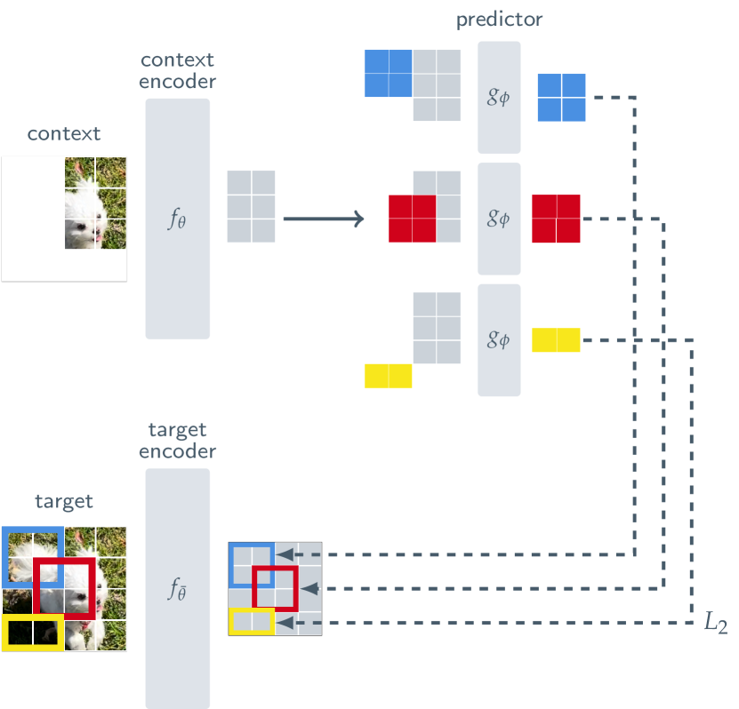
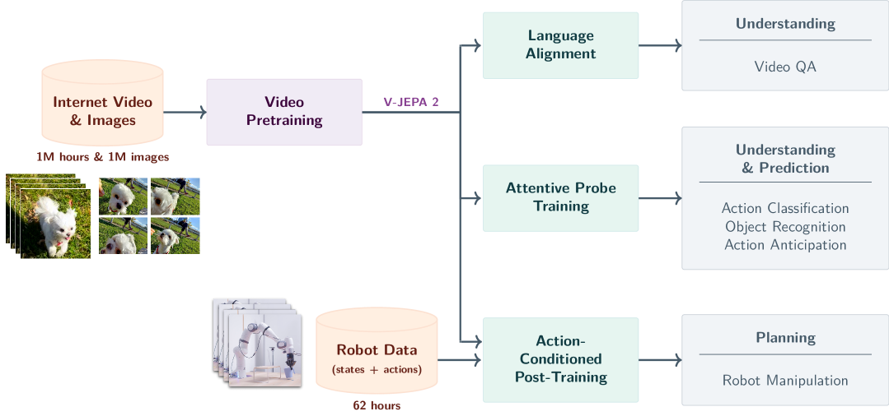

# 픽셀을 버린 남자의 10억 달러 베팅

_Yann LeCun의 JEPA와 World Models — 자기지도학습이 여는 다른 길_

## Executive Summary

> [!callout]
> Yann LeCun은 생성형 AI가 세계를 이해하는 데 근본적 한계가 있다고 주장한다. 픽셀 단위로 미래를 예측하면 "흐릿한 평균"만 남고, 행동에 필요한 추상적 이해에는 도달하지 못한다는 것이다. 그가 제안한 대안이 JEPA(Joint Embedding Predictive Architecture)다. 픽셀이 아닌 잠재 표현(latent representation) 공간에서 미래를 예측함으로써, 모델이 세계의 의미 구조를 학습하도록 설계된 아키텍처다.

> 이 아이디어는 이미 구체적 성과로 이어지고 있다. V-JEPA 2는 로봇 제로샷 제어에서 80%의 성공률을 기록했고(기존 Octo 모델 15%), 62시간의 라벨 없는 영상만으로 새로운 환경에 적응했다. Meta는 이 방향에 수십억 달러 규모의 투자를 지속하고 있다.

> JEPA가 증명하려는 것은 명확하다. "좋은 AI 모델"의 전제가 "좋은 표현 공간"이라는 것이다. 이는 곧 "좋은 데이터"의 정의가 양이나 라벨 정확도가 아니라 "의미 있는 표현 공간을 만드는 데이터"로 이동하고 있음을 뜻한다. 이 글은 [피지컬 AI](/project/PhysicalAI/ko/) 시리즈의 월드 모델 편으로, VLA의 직관과 다른 길에서 로봇 학습을 보는 자리다.

## 케이크의 대부분은 보이지 않는다

2016년 NIPS 강연에서 Yann LeCun은 지능을 케이크에 비유했다. 강화학습은 체리이고, 지도학습은 아이싱이며, **비지도학습이 케이크 그 자체**라는 주장이었다. 이 비유의 핵심은 단순한 양의 문제가 아니다. 라벨이 붙은 데이터에서 배우는 것은 인간이 세계를 이해하는 방식의 극히 일부에 불과하며, 진짜 지능은 관찰 자체에서 세계의 구조를 추론하는 능력이라는 선언이었다.

3년 뒤 LeCun은 이 비유를 수정했다. "비지도학습"이라는 이름이 "학습이 없다"는 인상을 주기 때문이었다. 새 이름은 **자기지도학습(Self-Supervised Learning)**. 데이터 자체에서 감독 신호를 추출한다는 뜻이다. NLP에서는 BERT의 마스크 언어 모델, GPT의 다음 토큰 예측이 이미 이 원리를 증명하고 있었다. 문제는 비전이었다. 이미지와 비디오에서 같은 원리를 어떻게 적용할 것인가?

> [!callout]
> LeCun의 핵심 통찰은 이것이다. 인간은 하루에 수십만 개의 시각 프레임을 처리하지만, 라벨이 붙은 피드백을 받는 경우는 극히 드물다. 아기가 중력을 이해하는 데 "이것은 중력입니다"라는 라벨은 필요 없다. 물체가 떨어지는 것을 반복해서 관찰하는 것만으로 충분하다. 자기지도학습은 이 과정을 기계로 옮기려는 시도다.

*▲ Yann LeCun, 2018년 에콜 폴리테크닉 강연 | Source: [Wikimedia Commons (CC BY-SA 2.0)](https://commons.wikimedia.org/wiki/File:Yann_LeCun_-_2018_(cropped).jpg)*

## 흐릿한 미래 — 생성형 AI의 구조적 한계

GPT가 다음 토큰을 예측하고, 확산 모델이 노이즈에서 이미지를 복원하는 방식은 놀라운 결과를 만들어냈다. 그러나 LeCun은 이 접근이 비전 영역에서 근본적 한계에 부딪힌다고 주장한다. 핵심 논거는 **"흐릿한 예측(blurry prediction)"** 문제다.

비디오의 다음 프레임을 픽셀 단위로 예측하는 모델을 생각해보자. 사람이 방 안에서 걸어가는 영상의 1초 뒤를 예측할 때, 그 사람이 왼쪽으로 갈 수도, 오른쪽으로 갈 수도 있다. 생성 모델은 모든 가능성을 평균화하여 "흐릿한" 프레임을 출력한다. 시간이 지날수록 이 흐림은 기하급수적으로 악화되어, 몇 초 뒤의 예측은 의미 없는 안개가 된다.

LeCun이 이 문제에서 도출하는 결론은 더 근본적이다. **"픽셀을 생성하여 세계를 모델링하는 것은 낭비이며, 실패할 운명이다."** 행동을 결정하는 데 필요한 정보는 픽셀 수준의 디테일이 아니라 추상적 수준의 이해다. 컵을 집으려면 컵의 위치, 크기, 재질을 알아야 하지, 컵 표면의 빛 반사 패턴을 재현할 필요는 없다.

두 가지 접근을 비교하면 차이가 명확해진다.

### 생성형 접근

- •모든 픽셀/토큰을 예측
- •불확실성 = 흐릿한 평균
- •행동에 불필요한 디테일까지 모델링
- •계산 비용이 해상도에 비례하여 증가

### 예측형 접근 (JEPA)

- •잠재 표현 공간에서 예측
- •불확실성 = 다수의 가능한 표현
- •행동에 필요한 추상적 정보만 학습
- •표현 차원에서만 계산, 효율적

> [!callout]
> 이 논쟁의 핵심은 "더 큰 모델이면 해결될 것인가"라는 질문이다. LeCun의 답은 명확하다. 문제는 모델의 크기가 아니라 접근의 구조적 한계다. 픽셀 예측의 불확실성은 세계의 본질적 속성이지, 학습 데이터의 부족이 아니다.

## 대조 학습의 부상과 좌절

"픽셀이 아닌 표현을 학습한다"는 아이디어는 JEPA 이전에도 존재했다. 그 첫 번째 시도가 **대조 학습(Contrastive Learning)**이다. 2020년 등장한 SimCLR(Chen et al.)은 같은 이미지의 서로 다른 변환(augmentation)은 가까이, 다른 이미지는 멀리 배치하도록 표현 공간을 학습시켰다. 라벨 없이도 이미지의 의미적 유사성을 포착할 수 있었다.

그러나 대조 학습에는 구조적 난제가 있었다. **표현 붕괴(representation collapse)**다. 인코더가 가장 쉽게 손실 함수를 최소화하는 방법은 모든 입력을 거의 동일한 임베딩으로 매핑하는 것이다. 고양이든 자동차든 같은 점으로 보내면 "같은 이미지는 가깝게" 조건은 자동으로 충족된다. 예측은 완벽하지만, 학습된 표현은 완전히 무용하다.

SimCLR은 이 문제를 **negative pairs**로 해결했다. "이 두 이미지는 같은 것이다(positive)"뿐 아니라 "이 두 이미지는 다른 것이다(negative)"라는 신호를 명시적으로 제공한 것이다. 효과는 있었지만, 대가가 컸다. 좋은 negative pair를 만들려면 매우 큰 배치 사이즈(4096~8192)가 필요했고, 그만큼 GPU 메모리와 계산 비용이 증가했다.

Siamese Networks도 비슷한 난관에 부딪혔다. 두 개의 동일한 네트워크가 같은 입력의 서로 다른 뷰를 처리하는 구조였지만, negative 신호 없이는 어떻게 학습해도 결국 하나의 점으로 수렴했다. 이것이 자기지도 비전 학습의 핵심 병목이 되었다. "라벨 없이 학습"의 가장 기본적인 난제 — **모든 것을 같은 점으로 매핑하는 유혹**을 어떻게 극복할 것인가.

> [!callout]
> 표현 붕괴는 단순한 기술적 버그가 아니다. 학습 목표(objective)가 부족할 때, 모델은 항상 가장 쉬운 해법을 찾는다. 그리고 가장 쉬운 해법은 대부분 의미 없는 해법이다. 이 문제를 풀지 못하면 자기지도 비전 학습은 NLP만큼의 성공을 거둘 수 없었다.

## Barlow Twins와 DINO — 대조 없이 붕괴를 막다

2021년, 두 가지 획기적인 접근이 등장했다. 둘 다 negative pairs 없이 표현 붕괴를 방지하는 방법을 제시했고, 이것이 JEPA로 가는 길을 열었다.

### 4.1. Barlow Twins — 중복 제거의 원리

Barlow Twins(Zbontar et al., 2021)는 신경과학자 Horace Barlow의 "중복 제거(redundancy reduction)" 가설에서 영감을 받았다. 두 네트워크 출력의 교차 상관 행렬을 계산하고, 이것을 단위 행렬에 가깝게 만드는 것이 학습 목표다. 대각선 원소는 1에 가깝게(같은 이미지의 다른 뷰는 같은 표현), 비대각선 원소는 0에 가깝게(표현의 각 차원이 독립적 정보를 담도록). 이렇게 하면 각 차원이 서로 다른 정보를 담아야 하므로, 모든 것을 하나의 점으로 압축하는 붕괴가 원천적으로 차단된다.

### 4.2. VICReg — 세 가지 힘의 균형

VICReg은 붕괴 방지를 세 가지 명시적 정규화 항으로 분해했다. **V**ariance(각 표현 차원의 분산을 일정 수준 이상으로 유지), **I**nvariance(같은 이미지의 다른 뷰 표현을 일치), **C**ovariance(차원 간 공분산을 0으로 — 각 차원이 독립적 정보를 담도록). Barlow Twins의 아이디어를 더 직관적으로 분해한 것이며, 이론적 분석이 용이해졌다.

### 4.3. DINO — 주의(attention)가 의미를 본다

DINO(Caron et al., 2021)는 자기 증류(self-distillation)를 사용했다. Teacher 네트워크는 Student의 지수 이동 평균(EMA)이며, Student는 Teacher의 출력을 따라가도록 학습한다. 이 간단한 구조에서 놀라운 현상이 발견되었다. Vision Transformer(ViT)의 attention map에서 객체의 **의미적 분할(semantic segmentation) 경계가 자연적으로 출현**한 것이다. 아무도 "이것이 고양이이고 저것이 배경이다"라고 가르치지 않았는데, 모델이 스스로 그 경계를 학습한 것이다.

*▲ DINO 자기 증류 구조: Student가 Teacher(자신의 EMA)를 따라가며 학습 | Source: [Caron et al., arXiv 2104.14294](https://arxiv.org/abs/2104.14294)*

> [!callout]
> Barlow Twins, VICReg, DINO가 공통으로 증명한 것이 있다. **Negative sample 없이도 표현 붕괴를 방지할 수 있다.** 이것은 단순한 기술적 개선이 아니라 패러다임 전환이었다. "무엇과 다른지" 명시적으로 가르치지 않아도, 표현 공간의 구조적 제약만으로 의미 있는 표현을 학습할 수 있다는 것. JEPA는 이 발견 위에 세워졌다.

## JEPA — 픽셀이 아닌 의미를 예측하다

JEPA(Joint Embedding Predictive Architecture)는 앞선 모든 연구의 논리적 귀결이다. 대조 학습이 "같은 것은 가깝게, 다른 것은 멀게"라는 **비교**에 기반했다면, JEPA는 "현재 관찰에서 미래 표현을 **예측**한다"로 학습 목표를 전환한다. 그리고 이 예측은 픽셀이 아닌 잠재 표현(latent representation) 공간에서 이루어진다.

구조는 세 가지 핵심 구성 요소로 이루어진다. **Context Encoder**가 관찰 가능한 부분을 표현으로 인코딩하고, **Predictor**가 이 표현에서 관찰되지 않은 부분의 표현을 예측하며, **Target Encoder**가 실제 관찰되지 않은 부분의 "정답" 표현을 생성한다. Target Encoder는 Context Encoder의 EMA(지수 이동 평균)로 업데이트되어, DINO에서 증명된 자기 증류 원리를 활용한다.

핵심은 Predictor가 예측하는 것이 픽셀이 아니라 **표현**이라는 점이다. 이미지의 가려진 부분(마스킹된 패치)이 "어떻게 생겼는지"가 아니라 "어떤 의미인지"를 예측한다. 이로써 생성 모델의 "흐릿한 평균" 문제를 구조적으로 우회한다.

*▲ I-JEPA: 마스킹된 이미지 패치의 표현(픽셀이 아님)을 예측하는 구조 | Source: [Assran et al., arXiv 2301.08243](https://arxiv.org/abs/2301.08243)*

이 아키텍처는 빠르게 진화했다.

### I-JEPA (2023)

이미지에서 마스킹된 패치의 표현을 예측. ImageNet low-shot에서 SOTA 달성. 632M 파라미터, 16 A100 GPU에서 72시간 학습.

### V-JEPA (2024.02)

비디오로 확장. 200만 개 이상의 라벨 없는 영상에서 시간적 표현 예측. 비디오 이해를 feature prediction만으로 달성.

### V-JEPA 2 (2025.06)

1.2B 파라미터. SSv2 77.3% top-1, Epic-Kitchens 39.7% R@5 (SOTA). 로봇 제로샷 제어 65-80% 성공률.

### VL-JEPA (2025.12)

비전-언어 확장. CLIP/SigLIP2를 능가하면서 학습 파라미터 50% 감소, 디코딩 2.85배 효율.

> [!callout]
> JEPA의 핵심 교훈은 **"무엇을 예측하느냐"가 모델이 세계를 이해하는 방식을 결정한다**는 것이다. 픽셀을 예측하면 표면을 모방하고, 표현을 예측하면 구조를 이해한다. 이것은 기술적 선택이 아니라 철학적 선택이다.

## World Models — 로봇이 꿈을 꾸기 시작했다

JEPA는 더 큰 비전의 핵심 구성 요소다. LeCun이 2022년 논문 "A Path Towards Autonomous Machine Intelligence"에서 제안한 **자율 기계 지능 아키텍처**는 여섯 개의 모듈로 구성된다. Configurator(목표 설정), Perception Module(감각 입력 처리), World Model(세계의 내부 모델), Cost Module(비용 평가), Actor(행동 결정), Short-term Memory(단기 기억). JEPA는 이 아키텍처에서 **World Model의 학습 방법**에 해당한다.

"월드 모델"이라는 개념은 추상적으로 들릴 수 있다. 그러나 V-JEPA 2-AC(Action-Conditioned)의 실험 결과는 이것이 이미 구체적인 기술임을 보여준다.

*▲ V-JEPA 2: 비디오 표현 예측 학습 개요 — 1.2B 파라미터, SSv2 77.3% SOTA | Source: [Bardes et al., arXiv 2506.09985](https://arxiv.org/abs/2506.09985)*

### V-JEPA 2-AC 핵심 성과

컵 이동 태스크

80%

성공률 (Octo: 15%)

계획 수립 시간

16초

Cosmos 모델: 4분

학습 데이터

62시간

라벨 없는 로봇 영상

환경 적응

제로샷

새로운 환경에서 즉시 수행

이 수치들이 의미하는 바를 풀어보자. V-JEPA 2-AC는 62시간 분량의 라벨 없는 로봇 관찰 영상만으로 세계의 물리적 모델을 학습했다. "컵을 옮기시오"라는 명령을 한 번도 학습한 적 없는 새로운 환경에서, 16초 만에 계획을 수립하고 80%의 성공률로 과제를 수행했다. 같은 과제에서 기존의 Octo 모델은 15%, Cosmos 기반 모델은 계획 수립에만 4분이 걸렸다.

> [!callout]
> "세계 모델"이 추상적 개념이 아니라 **실제 로봇 팔을 움직이는 기술**이 되고 있다. 중요한 것은 이 모델이 "컵을 어떻게 옮기는지" 명시적으로 학습한 것이 아니라, 세계가 어떻게 작동하는지에 대한 내부 모델을 학습하고 이를 새로운 과제에 적용했다는 점이다. 이것이 LeCun이 말하는 "자율 기계 지능"의 핵심이다.

## Billion Dollar Bet의 양면

Meta는 이 방향에 어마어마한 자원을 쏟고 있다. 2025년 FAIR을 Meta Superintelligence Labs(MSL)로 재편하고, Scale AI를 $15B에 인수했으며, AI 인재 영입에 사이닝 보너스 최대 $1B을 제시하고 있다. V-JEPA 2는 1.2B 파라미터 모델로, 100만 시간 이상의 비디오와 100만 개 이상의 이미지로 학습되었다. LeCun의 비전에 걸린 판돈은 말 그대로 "Billion Dollar Bet"이다.

그러나 이 베팅이 성공할 것이라는 보장은 없다. JEPA에 대한 비판은 구체적이고, 일부는 근본적이다.

*▲ V-JEPA 2-AC: 행동 조건부 월드 모델로 컵 이동 태스크 80% 성공 (Octo 15% 대비) | Source: [Bardes et al., arXiv 2506.09985](https://arxiv.org/abs/2506.09985)*

### 7.1. 다섯 가지 주요 비판

"결국 autoregressive가 아닌가?"

JEPA를 재귀적으로 적용하면 — 현재 표현에서 다음 표현을 예측하고, 그 예측에서 다시 다음을 예측하면 — 이것은 본질적으로 autoregressive/generative 모델과 같지 않은가? (arXiv:2507.05169). 잠재 공간에서의 autoregression이 픽셀 공간에서의 autoregression보다 왜 우월한지, 이론적 증명이 아직 불충분하다는 지적이다.

표현 붕괴, 여전히 위협

End-to-end JEPA 학습에서 trivial collapsed solution의 가능성은 완전히 제거되지 않았다. VICReg, Barlow Twins의 정규화 기법이 있지만, 이들이 모든 스케일과 도메인에서 충분한지는 미검증이다.

실세계 증거의 한계

V-JEPA 2-AC의 로봇 실험은 대부분 통제된 테이블탑 환경에서 수행되었다. "컵을 옮기는 로봇"과 "복잡한 가정 환경에서 자율적으로 가사를 수행하는 로봇" 사이에는 여전히 거대한 간극이 있다.

NLP에서의 부재

JEPA의 성과는 비전 영역에 집중되어 있다. 언어 도메인에서 GPT-4, Claude 3 같은 autoregressive LLM을 능가하는 JEPA 기반 모델은 아직 존재하지 않는다. 비전에서의 성공이 언어로 이전될 수 있을지는 불확실하다.

"Novelty가 있는가?"

Predictive coding, autoencoder, variational inference 등 기존 아이디어의 리브랜딩이라는 시각도 있다. JEPA의 개별 구성 요소는 새롭지 않으며, 조합의 효과가 진정한 패러다임 전환인지 점진적 개선인지는 논쟁 중이다.

### 7.2. 성공의 조건

이 베팅이 성공하려면 몇 가지 조건이 충족되어야 한다. 첫째, JEPA 기반 World Model이 비전뿐 아니라 언어, 멀티모달 영역에서도 기존 접근을 능가해야 한다. 둘째, 통제된 실험실 환경을 넘어 복잡한 실세계에서의 성능을 입증해야 한다. 셋째, 학계와 산업계가 JEPA 생태계에 참여할 수 있는 오픈소스 인프라가 필요하다. Meta가 I-JEPA, V-JEPA, V-JEPA 2를 모두 오픈소스로 공개한 것은 이 셋째 조건을 의식한 전략이다.

> [!callout]
> "Billion Dollar Bet"의 본질은 기술이 아니라 철학에 있다. "세계를 생성하는 것이 이해하는 것인가, 아니면 표현하는 것이 이해하는 것인가?" LeCun은 후자에 베팅했다. 이 베팅의 결과는 향후 5-10년 안에 명확해질 것이다.

## 예측 기반 표현 학습이 데이터 품질에 던지는 질문

JEPA의 기술적 세부사항을 넘어, 이 연구 흐름이 데이터 실무자에게 던지는 더 큰 질문이 있다. **"좋은 데이터"란 무엇인가?**

전통적으로 데이터 품질은 라벨의 정확성, 결측값의 비율, 클래스 균형 같은 지표로 측정되었다. 그러나 JEPA가 증명하고 있는 것은 다른 차원의 품질이다. 모델이 세계를 이해하려면 데이터가 **의미 있는 표현 공간(representation space)**을 만들 수 있어야 한다. 라벨이 완벽하더라도 표현 공간이 빈약하면 — 특정 영역에 데이터가 밀집하고 다른 영역이 텅 비어 있다면 — 모델은 세계의 일부만 이해하게 된다.

이 관점에서 JEPA의 접근과 데이터 품질 진단 사이에는 구조적 동형성이 존재한다.

| JEPA의 원리 | 데이터 품질 대응 |
| --- | --- |
| 잠재 표현 공간에서 예측 | 임베딩 공간 기반 데이터 분포 분석 |
| 표현 품질이 예측 품질을 결정 | 학습 데이터의 표현 공간 품질이 모델 성능을 결정 |
| 표현 붕괴 방지 = 다양하고 의미 있는 표현 유지 | 데이터 다양성 진단 + 공백 좌표 기반 보강 |
| World Model = 물리 세계의 추상적 모델 | 시뮬레이션 기반 합성 데이터 = 물리 세계 모델의 실무적 구현 |
| 62시간 비라벨 영상으로 새 환경 적응 | 최소한의 실제 데이터로 시뮬레이션 기반 합성 후 모델 적응 |

페블러스의 DataClinic이 임베딩 공간에서 데이터 분포를 진단하고, PebbloSim이 그 공간의 빈 곳을 시뮬레이션 기반으로 채우는 접근은 이 흐름의 실무적 구현이다. JEPA가 "좋은 표현 공간이 좋은 예측의 전제"라고 증명하고 있다면, DataClinic은 "당신의 데이터가 좋은 표현 공간을 만들고 있는지"를 진단하는 도구이며, PebbloSim은 그 공간의 결함을 물리 시뮬레이션으로 보정하는 도구다.

> [!callout]
> JEPA가 AI 연구에 남길 가장 중요한 유산은 특정 아키텍처가 아닐 수 있다. 그것은 **"좋은 데이터"의 정의를 "좋은 표현 공간을 만드는 데이터"로 이동시킨 것**이다. 이 전환은 데이터 수집, 전처리, 품질 관리의 모든 관행을 재검토하게 만든다.

## FAQ

Yann LeCun의 Billion Dollar Bet은 아직 결론이 나지 않았다. 그러나 SimCLR에서 V-JEPA 2까지 이어진 여정은 한 가지를 분명히 했다. AI가 세계를 이해하는 방법에 대한 질문은 아직 열려 있으며, 현재의 지배적 패러다임이 유일한 답은 아닐 수 있다는 것이다.

이 글이 "JEPA가 LLM보다 낫다"를 주장하기 위한 것은 아니다. 두 접근 모두 각자의 강점과 한계를 가지고 있으며, 최종적으로 어떤 조합이 승리할지는 알 수 없다. 분명한 것은, 데이터에서 의미 있는 표현을 추출하는 능력이 — 그것을 JEPA라 부르든, 다른 무엇이라 부르든 — AI의 다음 도약에서 핵심적인 역할을 할 것이라는 점이다.

읽어주셔서 감사합니다. 이 주제에 대한 의견이나 질문이 있으시면 언제든 공유해주세요.

**(주)페블러스 데이터 커뮤니케이션팀**  
2026년 5월 3일

<!-- stat-card -->
**📚 피지컬 AI 시리즈** — 이 글은 [피지컬 AI](/project/PhysicalAI/ko/)에서 큐레이션하는 시리즈의 일부입니다. 로봇이 환경을 보고, 이해하고, 행동하기까지 — 데이터·시뮬레이션·모델·산업 지형을 한자리에서 묶어 읽는 자리.

<!-- stat-card -->
**📚 월드 모델 시리즈** — 이 글은 [월드 모델](/project/WorldModel/ko/) 허브가 묶는 시리즈의 일부입니다. AI가 세계를 이해하고 미래를 예측하는 두 갈래 길 — 입문부터 JEPA·Sora·Genie까지 다섯 편을 한자리에서.
