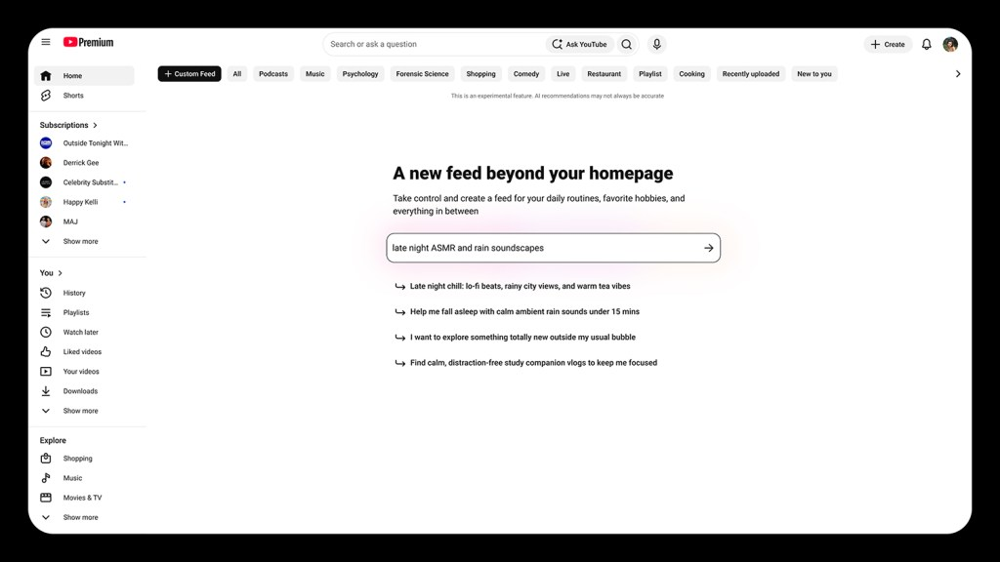

# YouTube Puts Off Choosing Between What You Say and What You Watch

_YouTube_

## Executive Summary

> [!callout]
> YouTube made custom feeds public on September 23, 2026. Write out the kind of video you are after and Gemini collects only what matches, then gives that collection a separate tab on the home page. Web and mobile receive it in turn from next month. This article treats the feature as something other than a product update: the preference data behind recommendation has picked up a second source.

> The same experiment has run once before. When Netflix retired its five-star rating in 2017 and put thumbs in its place, it cut the scale it put to people from five notches down to two. A question its product vice president put to reporters that day has outlasted the change. Which is the stronger signal, he asked: five stars promised to a documentary about unrest in Ukraine, or an Adam Sandler movie watched ten times more often? A 2026 study of news consumption, built from interviews with twenty people, recorded the same mismatch. Its participants said trustworthy information was what they wanted, then pressed material from outlets rated low for reliability.

> So when the two signals split, which one did YouTube decide to believe? It postponed the verdict. The new tab sits at the top of the home page, and the original recommendation screen stays beside it. Sections 1 through 4 follow what the announcement and the published research actually say, and section 5, which reads this choice as a question about company data, is where the interpretation is ours.

### Key Numbers

Sources: [TechCrunch](https://techcrunch.com/2026/09/23/youtube-will-let-you-build-your-own-algorithm-with-ai/) (2026-09-23), [Netflix](https://about.netflix.com/en/news/goodbye-stars-hello-thumbs) (2017-03-16), [PEBOL](https://dl.acm.org/doi/10.1145/3640457.3688142) (RecSys 2024).

<!-- stat-card -->
**20B+** — Videos in the YouTube corpus — The scale the announcement gave as the reason for the feature. Clicks alone do not cut a warehouse this deep down to one evening's viewing

<!-- stat-card -->
**200%** — More ratings once stars became thumbs — Netflix measured this in a 2016 test. A signal people leave in words lost on volume before anyone got to argue about its accuracy

<!-- stat-card -->
**0.27** — Hit rate after ten turns of dialogue — MRR@10 in the PEBOL study. Under the same conditions, the single-model approach came in at 0.17. Preference given in words does narrow down when a method handles it

<!-- stat-card -->
**2** — Feeds left on the YouTube home page — A tab built from sentences arrived and the feed built from behavior stayed. Withholding the verdict is this design's answer

## You Type a Sentence, YouTube Builds a Tab

YouTube unveiled custom feeds on September 23 at Made On YouTube, its annual event. Using one is simple. You write a sentence describing the videos you want, Gemini reads it, gathers videos that fit, and pins them to the top of your home page in a tab of their own. Examples in the announcement run to a feed of video podcasts for a 30-minute train commute, or "relaxing commentary videos to unwind with." No limit sits on the length of the request, so you can spell out what to feature, what to exclude, and what to prioritize. The rollout reaches web and mobile in stages starting next month.

*▲ The custom feed prompt screen — write a sentence describing what you want to watch, and suggestions appear below it | Source: [TechCrunch](https://techcrunch.com/2026/09/23/youtube-will-let-you-build-your-own-algorithm-with-ai/) (image supplied by YouTube)*

Where the tab lands deserves a pause. A custom feed does not push the original recommendation feed aside. Open the home page and two feeds stand side by side as tabs, and you pick one according to what you feel like doing. Nothing in the announcement describes a switch that turns the old recommendations off or alters them. Letting you "build your own algorithm" made a good headline, but a tab is what actually gets built. Nor does it stop at one tab. What the company said would roll out starting next month is support for creating multiple custom feeds.

Emily Moxley, VP of Product Management for Viewer AI, introduced the feature by pointing at scale. "One of the amazing things about being on YouTube is that the world is always at your fingertips," she told reporters. "There's over 20 billion videos in the YouTube corpus, so you're always one search away from a treasure trove of topics." That figure of 20 billion explains the need for the feature on its own. A warehouse that size makes it hard to narrow down tonight's viewing from a record of what a viewer pressed.

YouTube did not cut this path first, either. The reporting itself places the announcement inside a movement Bluesky opened. Bluesky has offered user-built feeds since 2023 and attached an AI tool to them in 2026. Meta's Threads launched public custom feeds in 2025, and Instagram released Blend, which mixes your taste with a friend's, the same year. X opened AI-powered custom feeds in 2026, and Spotify opened a taste profile that year as well. YouTube brought the approach to the largest warehouse. It did not try it first.

The same day, YouTube put out a bundle of AI features for the people who make the videos. Inside the Studio app they give feedback on unpublished drafts, generate titles and thumbnails, and cycle through three thumbnail options in a test before swapping one in automatically. A figure came with that release: creators have run more than 40 million A/B tests on titles and thumbnails. On one side the company asks viewers to state their taste, and on the other it has tested what actually gets clicked 40 million times. Two separate tracks, delivered from one stage on one day.

## Why Star Ratings Went Away

It is not as though recommenders never listened to people. They listened once at scale, and the result was that they listened less.

On March 16, 2017, Netflix dropped its five-star rating and replaced it with a thumbs-up and a thumbs-down. Two reasons went into the official announcement. People had misread the stars: they took the number on screen for an average across all members, when it was in fact a prediction drawn from their own viewing history. Volume was the other reason. In a 2016 test run against hundreds of thousands of members, thumbs collected 200 percent more ratings than stars did. Picking one box out of five had been asking for too much thought.

*▲ Netflix's design team reviewing home page mockups before stars became thumbs | Source: [Netflix](https://about.netflix.com/en/news/goodbye-stars-hello-thumbs)*

In the press briefing, Todd Yellin, Netflix's vice president of product, added something that lands exactly on the subject of this article.

> [!callout]
> "What's more powerful: you telling me you would give five stars to the documentary about unrest in the Ukraine; that you'd give three stars to the latest Adam Sandler movie; or that you'd watch the Adam Sandler movie 10 times more frequently?" Yellin said. "What you do versus what you say you like are different things." In the same briefing he also said, "Five stars feels very yesterday now."

Stars asked for a verdict on a title's worth, and the company wanted to know what would go on tonight. Once the answers to those two questions came apart, the industry picked the one that does not come apart. What you pressed, what you finished, what you came back to: none of it needs a separate reading. For the decade that followed, behavior records were the base material of recommendation, and preference written by hand survived as a screen where you check off a few genres on the way in.

Jonathan Stray and his co-authors set the same shift down in drier terms. Asking about preference one item at a time runs into a limited set of items you can ask about, a cognitive load that grows as you ask, and answers that are hard to extend past the items rated.

Stars lost, then, for a reason other than people lying. Closer to say that a scale of five boxes held too little of what a member meant. Three stars could mean "fine, but I won't watch it twice" or "good only on a tired day," and a notched scale cannot tell those apart. What YouTube has opened now is a far wider box than that scale. So the same experiment is running again, with one condition changed.

## Ten Coins, One Minute, Twenty People

How much, then, can you trust a preference someone writes down? A 2026 study takes that question head on. "Understanding the Gap Between Stated and Revealed Preferences in News Curation," by Do Won Kim, Cody Buntain, and Giovanni Luca Ciampaglia, surveyed and interviewed young adult social media users, had them curate feeds by hand, and laid the two preferences side by side.

Participants were users aged 18 to 24 living in the United States, and every number in the paper comes from the twenty people who made it through the interviews. Stated preference was measured by having them spread ten coins across eight posts, and revealed preference by giving them one minute with the same screen and watching what they engaged with. Quality was sorted by NewsGuard's source reliability ratings. Four people whose two preferences did not diverge were screened out in advance, on the grounds that whether a gap exists is a question prior research had settled and not one this study was after. The authors write plainly that their results cannot be extended past young adults.

Results pointed one way. Participants said high-quality information mattered to them, and then engaged with low-quality posts. Yet asked to design an ideal news feed for a hypothetical persona, the same participants put accuracy and diversity first while also weighing that persona's relationships and circumstances. Curating a feed, the researchers concluded, is less an expression of private taste than "a socially situated process of judging what should be visible and appropriate in shared information spaces."

The researchers also put a number on the gap. They compared how far the rankings of a hand-curated feed overlapped with an engagement-maximizing feed, and set both against feeds drawn at random from the same inventory. Hand-curated feeds sat further from the engagement-maximizing feed. Further than random selection did. Two sources, in other words, do not give similar answers phrased a little differently; they pick different things altogether. A worry people often raise did not hold up. Contrary to the expectation that letting people curate by their own words leaves them hearing only what they already agree with, hand-curated feeds gave about as much exposure to opposing viewpoints as the engagement-maximizing feed did.

That conclusion hangs directly on YouTube's new input box. The moment you write into a blank field, you are not alone. What gets written sits closer to the person you would like to think you are than to whatever you want to press tonight. Asking for documentaries and then pressing short comedy every evening is not a lie. Those are answers to two different questions. The first answers what kind of person you want to be, and the second answers how to spend the next half hour.

None of which means the authors tell you to discount what people write. While granting that true preferences may be impossible to ascertain, they hold that a statement made with time to reflect serves as a closer proxy than behavior caught in passing. Participants explained the gap in terms that pointed away from themselves as well. Provocative material gets pressed more, and that is what earns the platform money. Taking up this thread, the paper concludes that engagement metrics survive in practice "not because they reflect the underlying values of users, but because they align with broader platform incentives."

Seen from the side that builds recommenders, this distance is a headache. Fill the tab strictly by the written sentence and the user stops opening it within days; fill it strictly by behavior records and the reason for asking for a sentence disappears. Being unable to tip fully either way is the starting condition of this feature.

## YouTube Refused to Pick a Side

YouTube kept both instead of dropping one. A custom feed stands as its own tab, and the original feed stays where it was. Rather than weighing the two signals against each other inside one model, the design separates them and hands the choice to the user. That act of choosing then becomes a signal in itself. Tapping into the custom tab amounts to saying "right now I want what I wrote down," and staying in the original feed says the opposite. Reporting described the result as being able to hop right into whichever feed best suits your purposes when you open the app, and this structure is what that describes. No verdict is passed on which side is true; which side to use gets handed back to the user, moment by moment.

## Why Pebblous Is Watching This Announcement

From here we read the announcement through the lens of our own work. YouTube's tab does not stay another company's business, because boxes that take preference in natural language are being attached to nearly every product right now. Search bars take sentences, support windows take requirements, internal tools take "find me something like this." Each time, a new kind of row piles up in a company database. Preference a person stated in their own words.

When we talk about AI-Ready Data, we usually look first at the condition of the values. Whether the format is consistent, whether the labels are right, whether provenance survived. This feature adds the question that comes before all of those. What does the row piling up right now record? Something a person actually did, or something a person said they wanted to do? If both rows sit in the same table, that table has already mixed two things together.

### 5.1. The Column That Forgets Where a Row Came From

Once behavior records and stated records go into the same column and the source marking falls away, no way remains to retrace why a model judged as it did. These two signals differ in how far they can be trusted and in how fast they go stale. A sentence written once stays as written even after that person's circumstances change, while yesterday's click records yesterday's circumstances precisely. Translate YouTube's choice to split the feeds into tabs rather than blend them into data design, and what it asks for is one more column: which source the value arrived from.

### 5.2. The Gap Is Not Noise to Be Deleted

When words and behavior diverge, the temptation is to pick one and delete the other. Training is easier with a single ground-truth label. Yet the study in the previous section showed that the divergence itself says something about the person. Distance between who somebody wants to be and what they actually do is, in itself, a value worth recording. Keep a record of which users show a wide gap and which a narrow one, and you have grounds for weighting the two signals differently later. Data with the distance erased in advance cannot give those grounds back.

### 5.3. Record What Was Asked and How

Stated data carries one property that behavior data lacks. Answers change with how the question is put. Just as participants in that study cited different criteria when designing a feed for another person, the same person offers a different preference when the question changes. So when stated data comes in, keep more than the value: keep when it was asked, on what screen, and in what wording. Stated data missing that context has no way of being read again later. This is where Pebblous gets its habit of asking that data quality cover the route a value travelled and not only the value itself.

Something else belongs alongside the wording of the question. That study held an exception that matters here. Four of the twenty built feeds resembling what an engagement-maximizing algorithm would produce. Two did it deliberately, saying they were thinking as a company would, and the other two said they wanted educational and trustworthy feeds and ended up there because they could not tell which outlets were reliable. A statement that misses its mark is not always a lie. Sometimes it marks a spot where the ability to recognize what was said ran short. What the paper wrote next was that the system should guide users through the process instead of leaving the choosing entirely to them. Translated into data, that means recording whether the person was in a position to recognize what they asked for when their statement came in.

Thank you for reading this far. The announcement quoted here comes from [TechCrunch](https://techcrunch.com/2026/09/23/youtube-will-let-you-build-your-own-algorithm-with-ai/)'s September 23 report, and the study on the distance between stated and revealed preference is at [arXiv 2604.11517](https://arxiv.org/abs/2604.11517). Are boxes for users to write sentences into multiplying in your product too? We would be glad to hear how you are treating the sentences that collect there.

## References

### Primary Reporting

- 1.Perez, S. (2026). "[YouTube will let you build your own algorithm with AI](https://techcrunch.com/2026/09/23/youtube-will-let-you-build-your-own-algorithm-with-ai/)." TechCrunch, 2026-09-23.
- 2.Perez, S. (2026). "[YouTube releases new AI features for creators within its Studio app](https://techcrunch.com/2026/09/23/youtube-releases-new-ai-features-for-creators-within-its-studio-app/)." TechCrunch, 2026-09-23.
- 3.Netflix. (2017). "[Goodbye Stars, Hello Thumbs](https://about.netflix.com/en/news/goodbye-stars-hello-thumbs)." About Netflix, 2017-03-16.
- 4.Popper, B. (2017). "[Netflix ditches its five-star rating system in favor of thumbs up, thumbs down](https://www.theverge.com/2017/3/16/14944648/netflix-thumbs-vs-stars-ratings-change)." The Verge, 2017-03-16.

### Academic Papers

- 5.Kim, H., Buntain, C., & Ciampaglia, G. L. (2026). "[Understanding the Gap Between Stated and Revealed Preferences in News Curation: A Study of Young Adult Social Media Users](https://arxiv.org/abs/2604.11517)." Proceedings of the ACM on Human-Computer Interaction (CSCW 2026).
- 6.Kim, J. (2024). "[PEBOL: Bayesian Optimization with Language Models for Cold Start Recommendations](https://arxiv.org/abs/2405.00981)." RecSys 2024. DOI: [10.1145/3640457.3688142](https://dl.acm.org/doi/10.1145/3640457.3688142).
- 7.Sanner, S., Balog, K., Radlinski, F., Wedin, B., & Dixon, L. (2023). "[Large Language Models are Competitive Near Cold-start Recommenders for Language- and Item-based Preferences](https://arxiv.org/abs/2307.14225)." RecSys 2023. DOI: [10.1145/3604915.3608845](https://doi.org/10.1145/3604915.3608845).
