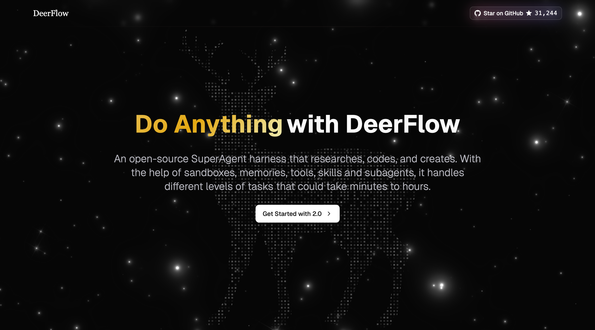
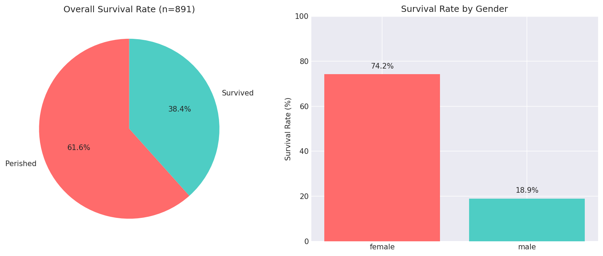

# AI That Works for Hours Without Checking In

_ByteDance DeerFlow 2.0: Open-source SuperAgent that autonomously handles long-horizon goals using sub-agents, memory, and sandboxes_

## Executive Summary

> [!callout]
> ByteDance's DeerFlow 2.0 is an open-source super agent harness that orchestrates sub-agents, memory, and sandboxes. It fans out a single goal into 12+ parallel sub-agents and converges the results, supporting three sandbox modes (Local/Docker/Kubernetes) and processing long-horizon tasks with 100k+ context windows.

> DeerFlow 2.0's fan-out/converge pattern is one of the first open-source implementations of AI autonomously performing the way humans lead teams. It aligns structurally with the agentic data pipeline automation pursued in Pebblous's AADS initiative, and serves as a practical reference for multi-agent orchestration design.

12+

Concurrent Sub-agents

Single goal broken down and executed by dozens of parallel sub-agents

3

Sandbox Modes

Local / Docker / Kubernetes — choose the execution environment to match your scale

100k+

Recommended Context

Minimum requirement for long-horizon task processing. DeepSeek v3 and similar recommended

On February 28, 2026, ByteDance released **DeerFlow 2.0**. The official description is concise: _"An open-source super agent harness that orchestrates sub-agents, memory, and sandboxes to do almost anything."_

Where v1 was a deep research tool, v2 is a complete ground-up rewrite — no shared code with the original. Built on an entirely new architecture, its purpose expanded fundamentally. Not just research, but code execution, slide generation, dashboard building, and data pipeline automation — any long-horizon task.

"The agent receives a goal, fans out into dozens of sub-agents, each explores a different angle, then converges into a single output."

This fan-out/converge pattern is not a simple chain. It's AI performing the way humans lead teams — dividing work, running it in parallel, then integrating the results. DeerFlow is one of the first open-source implementations of this pattern.

The core of DeerFlow 2.0 is three layers working in organic combination. Built on LangGraph, each layer can scale independently while collaborating tightly.

LEADLead Agent (Coordinator)

Goal decomposition · Sub-agent spawning · Result integration · Final output

SUBSub-agent A — Web Research

Independent context · Web search + Fetch tools · Isolated from parent agent

SUBSub-agent B — Code Execution

Docker sandbox · Bash/Python execution · Filesystem isolation

SUBSub-agent C — Slide / Report Generation

Skill loading · Output creation · Saved to /mnt/user-data/outputs

SKILLSkill Module (Markdown-defined)

Workflow · Best practices · Supporting resources — dynamically loaded when needed

*▲ DeerFlow 2.0 official site (deerflow.tech). "Do Anything with DeerFlow" — 31,000+ GitHub stars | Source: [bytedance/deer-flow](https://github.com/bytedance/deer-flow)*

🤖

#### Agent Layer

The lead agent decomposes goals and dynamically spawns sub-agents. Each sub-agent has its own independent context and tool access, isolated from parent and sibling agents.

🧠

#### Memory Layer

Long-term persistent memory that survives sessions. Accumulates user preferences, writing styles, and technical patterns. Prevents infinite growth by deduplicating facts, and guarantees data sovereignty through local storage.

🔒

#### Sandbox Layer

Isolated code execution environment. Three modes — Local (host machine), Docker container, Kubernetes pod — so you can match execution environment to your scale.

One of DeerFlow's most distinctive design choices is the **Skill**. A skill is a structured capability module defined in a Markdown file. Describe a workflow, best practices, and supporting resources in natural language — not code — and the agent interprets and executes it.

---  
name: deep-research  
version: 2.1  
author: bytedance  
---  
  
# Deep Research Skill  
  

                        When this skill is invoked:  
1. Decompose the query into 5-8 research angles  
2. Spawn parallel sub-agents for each angle  
3. Use web_search + web_fetch for each agent  
4. Synthesize results into structured report

Skills operate via **Progressive Loading**. Rather than pre-loading all skills into the context window, each skill is loaded only when needed. This strategy maximizes the 100k token context window for actual long-horizon task processing.

#### Built-in Skills

🔍 Deep Research (web search + synthesis)

📊 Report Generation (structured documents)

🎨 Slide Generation (presentations)

🌐 Web Page Generation

🖼️ Image / Video Generation

⚙️ Custom User-defined Skills

Skills can be packaged into `.skill` archives and shared. As the community ecosystem grows, DeerFlow could effectively become a _"package manager for AI capabilities."_

## The Context Engineering That Makes Long-horizon Possible

For AI to handle hours-long tasks autonomously, the context window must never overflow. DeerFlow solves this problem in three ways.

*▲ DeerFlow demo: Given the Titanic dataset, the agent executed Python code and completed the visualization automatically | Source: [bytedance/deer-flow demo](https://github.com/bytedance/deer-flow)*

📝

#### 1. Task Summarization

Instead of passing the full conversation history of completed sub-tasks, only compressed summaries are sent to the parent agent. Core information is preserved while token consumption is minimized.

💾

#### 2. Filesystem Offloading

Intermediate outputs (data, code, images, etc.) are saved to `/mnt/user-data/workspace`, and only the file path is kept in context. Large data is pushed out of memory entirely.

🗜️

#### 3. Sub-agent Context Isolation

Each sub-agent has its own independent context. It cannot see the context of parent or sibling agents, allowing it to focus on specialized tasks without unnecessary information contamination.

> [!callout]
> Key Insight

> This design mirrors how human teams work. A team lead doesn't need to remember every detail — they receive summarized results. DeerFlow applies this principle to AI, handling dozens of long-horizon steps without hitting context window limits.

## The Pebblous View: DataGreenhouse and Long-horizon Agents

The emergence of DeerFlow 2.0 directly intersects with Pebblous DataGreenhouse's vision of an **autonomous data operating system**. Four perspectives:

*▲ DeerFlow official demo scenario: "Titanic data analysis" — agent receives raw data and autonomously handles the entire pipeline | Source: [bytedance/deer-flow demo](https://github.com/bytedance/deer-flow)*

#### 1. Data Pipeline Automation Becomes Real

It's no coincidence that DeerFlow cites "slide generation, dashboard building, and data pipeline automation" as community use cases. The core of DataGreenhouse — autonomous data operations including collection, cleansing, pipelines, and monitoring — is already within the application scope of Long-horizon Agents.

#### 2. Skills = Domain Expertise as Code

DeerFlow's Markdown Skill concept codifies domain knowledge into reusable modules. In the DataGreenhouse context, defining "data quality diagnosis skill," "anomaly detection skill," and "synthetic data generation skill" would let non-developers delegate complex data tasks to agents.

#### 3. Memory + Context = Long-term Data Project Management

Cross-session memory and filesystem offloading lay the foundation for agents to consistently execute data projects spanning days or weeks. An agent that remembers your data schema, business rules, and past decisions becomes more than a tool — it becomes a genuine data partner.

#### 4. The Open-source Ecosystem Accelerates

ByteDance releasing architecture of this quality as open-source signals that the foundational technology of Agentic AI is commoditizing rapidly. The competitive differentiation point for DataGreenhouse is shifting — from infrastructure to domain knowledge and data quality.

"The emergence of DeerFlow signals the inflection point at which Long-horizon Agentic AI crosses from research into real data operations infrastructure."

### Frequently Asked Questions

### References

- • [bytedance/deer-flow — GitHub (2026)](https://github.com/bytedance/deer-flow)
- • [LangGraph Official Documentation — LangChain](https://langchain-ai.github.io/langgraph/)
- • Harrison Chase et al., "LangChain: Building applications with LLMs through composability" (2022)
- • [Pebblous DataGreenhouse — pebblous.ai](https://www.pebblous.ai)
