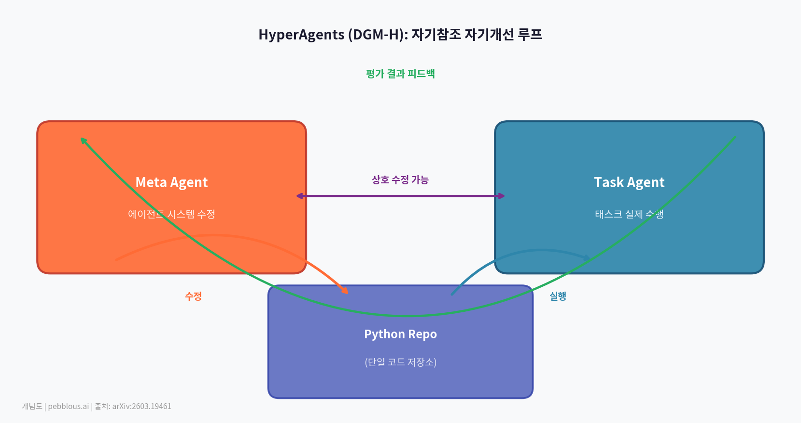

# AI가 스스로를 고친다 — 자기참조 에이전트와 자율형 데이터 운영

_Meta FAIR HyperAgents: 메타 에이전트가 자기 자신과 태스크 에이전트를 동시에 수정하는 재귀적 자기개선 루프_

## Executive Summary

> [!callout]
> HyperAgents는 Darwin Godel Machine(DGM)의 한계를 넘어, 코딩뿐 아니라 수학·과학·언어·게임·검색 등 6개 도메인에서 범용 자기개선을 실현한 아키텍처다. Task Agent와 Meta Agent 두 계층을 모두 편집 가능하게 설계해, 메타인지 수정이 가능해지면 개선 속도 자체가 가속되는 재귀적 자기개선 구조를 구현했다.

> 이 연구는 AI 에이전트가 외부 개입 없이 스스로 진화하는 시대의 시작점을 보여준다. 페블러스의 에이전틱 AI 데이터 사이언티스트(AADS) 과제에서도 에이전트 자기개선은 핵심 연구 방향이며, HyperAgents의 도메인 무관 아키텍처는 데이터 품질 자동화에 직접 적용 가능한 설계 패턴이다.

6

테스트 도메인

코딩·수학·과학·언어·게임·검색 — 도메인 무관한 범용 자기개선 검증

2

에이전트 계층

Task Agent (태스크 수행) + Meta Agent (에이전트 수정) — 두 계층 모두 편집 가능

∞

이론적 개선 깊이

메타인지 수정이 가능해지면 개선 속도 자체가 개선된다 — 재귀적 자기가속

HyperAgents를 이해하려면 먼저 **Darwin Gödel Machine(DGM)**을 알아야 한다. DGM은 AI가 자신의 코드를 직접 수정하면서 성능을 개선하는 오픈엔드 자기개선 시스템이다. 코딩 과제에서 에이전트가 스스로 변종을 생성하고, 각 변종을 평가해 더 나은 것을 선택하는 진화적 방식으로 동작한다.

DGM의 핵심 강점은 "코딩 능력이 향상되면 자기수정 능력도 향상된다"는 정렬(alignment)이다. 더 잘 코딩하는 에이전트는 자신을 더 잘 수정할 수 있다. 하지만 이 정렬은 **코딩 도메인에서만 성립**한다는 근본적 한계가 있었다.

"기존 자기개선 시스템은 고정된 수작업 메타 수준 메커니즘에 의존해, 시스템이 얼마나 빠르게 개선될 수 있는지에 근본적 한계를 부과한다."

HyperAgents는 바로 이 제약을 제거한다. **어떤 도메인에서도** — 코딩이든 수학이든 언어이든 게임이든 — 자기개선이 작동하도록 아키텍처를 재설계했다. 그 핵심은 메타 에이전트 자체를 편집 가능하게 만드는 것이다.

HyperAgents의 구조는 두 에이전트와 하나의 루프로 이루어진다. 태스크 에이전트가 목표를 수행하고, 메타 에이전트가 양쪽을 모두 수정한다. 결정적으로, **메타 에이전트 자신도 수정 대상**이다.

🧬 메타 에이전트
                            자신 + 태스크 에이전트 수정편집 가능 프로그램

수정→

🎯 태스크 에이전트
                            목표 수행편집 가능 프로그램

평가→

📊 평가 & 선택
                            성능 측정아카이브 갱신

↩

*▲ HyperAgents (DGM-H) 아키텍처: 메타 에이전트가 자신과 태스크 에이전트를 동시에 편집하는 재귀적 루프 | Source: [arXiv:2603.19461](https://arxiv.org/abs/2603.19461)*

🧬

#### 메타 에이전트 (Meta Agent)

태스크 에이전트를 수정하는 역할을 담당한다. HyperAgents에서는 **자기 자신도 수정 대상**이 된다. 수정 메커니즘을 개선함으로써 미래의 개선 속도 자체를 높인다.

🎯

#### 태스크 에이전트 (Task Agent)

실제 목표를 수행하는 에이전트. 메타 에이전트에 의해 지속적으로 수정된다. 각 세대마다 새로운 변종이 생성되고, 평가 결과로 선택된 변종이 다음 세대의 부모가 된다.

#### 메타인지적 자기수정이란?

기존 자기개선 AI는 _"더 잘 수행하도록"_ 자신을 수정했다. HyperAgents는 _"더 잘 개선하도록"_ 자신을 수정한다. 이 차이는 작아 보이지만 근본적이다.

1차 개선 (기존)

수행 능력 향상: 태스크를 더 잘 풀도록 에이전트를 수정

2차 개선 (HyperAgents)

개선 메커니즘 향상: **개선 방법 자체**를 더 잘 개선하도록 메타 수준을 수정
