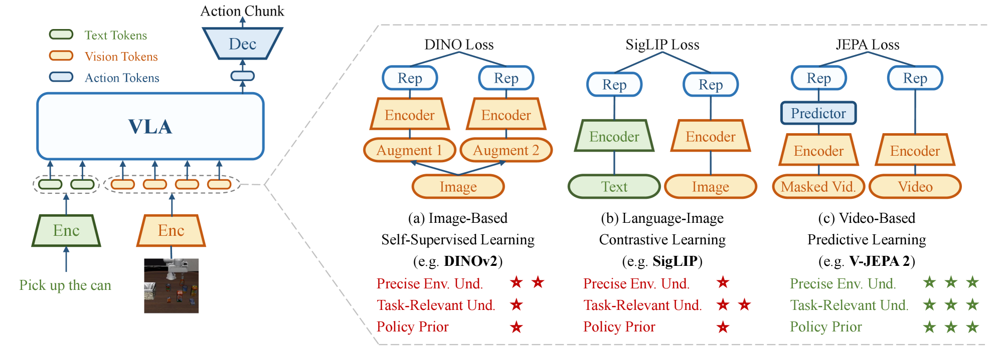
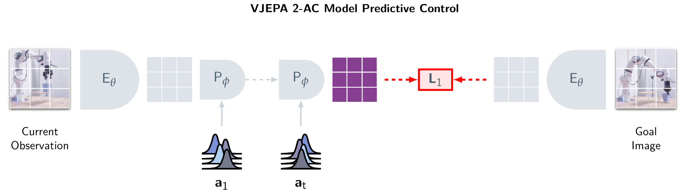
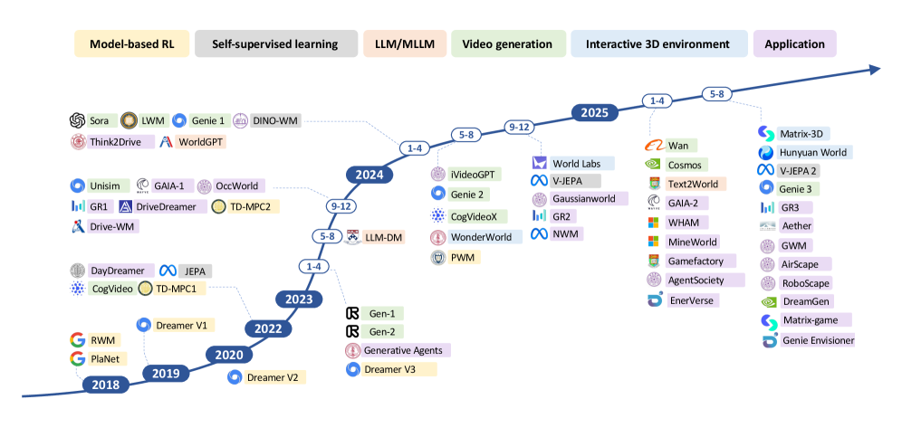

# Eyes Without Understanding — Beyond VLM·VLA to World Models

_VLMs see. VLAs act. But neither can answer: \_

## Executive Summary

> [!callout]
> VLMs perceive. VLAs act. But neither can answer: "If I do this now, what happens to the world in 5 seconds?" This is the absence of causal reasoning — the structural ceiling of Physical AI.

> V-JEPA 2 learns physics from 1 million hours of video and transfers to robot control with just 62 hours of robot data. NVIDIA Cosmos produces synthetic data from 20 million hours of footage. Genie 3 generates real-time 3D worlds from a single text prompt.

> This report analyzes the structural limits of VLM and VLA, compares four world model architectures, and examines why data quality is the decisive bottleneck.

<!-- stat-card -->
**30×** — Planning Speed

<!-- stat-card -->
**1.2B** — V-JEPA 2 Params

<!-- stat-card -->
**62h** — Robot Transfer Data

<!-- stat-card -->
**4** — Architectures Compared

## VLM·VLA — What They Do Well

Two paradigms have rapidly shifted the center of AI research in recent years: **VLMs (Vision-Language Models)** and **VLAs (Vision-Language-Action Models)**.

VLMs excel at integrating images and text to describe "what is happening in this photo" in language. GPT-4V, Gemini, and LLaVA are leading examples — they have reached near-human performance in image classification, captioning, and VQA (Visual Question Answering). VLAs go one step further, predicting actions: "how should a robot move in this situation?" RT-2, π₀ (Pi0), NVIDIA GR00T, and OpenVLA fall into this category.

### What VLMs Do Well

- Object recognition and description in images/video
- Visual Question Answering (VQA)
- Image-based instruction understanding
- Multilingual multimodal reasoning
- Document and chart comprehension

### What VLAs Do Well

- Language instructions → robot actions
- Manipulation tasks in constrained environments
- Cross-embodiment generalization
- Imitation learning from demonstration data
- Sequential execution of structured tasks

Yet both share a fundamental gap: **neither has an internal model of how the world works**. They can see and understand, receive instructions and act — but they don't know how their current action will change the world 5 seconds from now.

## Limits of VLMs — Perception Is Not Enough

VLMs are powerful, but they run into three fundamental walls.

> [!callout]
### ① The Symbol Grounding Problem

> VLMs are statistical distribution models. They appear to "understand" that "an apple falls," but in reality this is just a probabilistic connection between language patterns — not an internalized understanding of gravity. The symbol grounding that cognitive science refers to is absent. Even connecting images through multimodality doesn't fully solve this.

> [!callout]
### ② Reasoning Requires Language

> VLM reasoning is tightly coupled to textual representation. Humans can reason through spatial and sensorimotor imagination without language, but VLMs process even non-linguistic tasks through language structure. This creates structural weaknesses in spatiotemporal reasoning and intuitive physics understanding. Ask GPT-4V "if this ball rolls down this ramp, where does it stop?" with an image — it can describe verbally, but accurately predicting the physical trajectory is hard, because the physics are approximated through language patterns, not internalized.

> [!callout]
### ③ Temporal Disconnection — Frame-Independent Processing

> Most VLMs process images or video frames independently. With multi-camera input, token counts explode making real-time inference difficult, and the basic architecture makes temporal causal reasoning — "where was this object 5 seconds ago, and where will it be in 5 seconds?" — structurally hard to perform.

*VLA visual representation comparison. Image-based self-supervised (DINO) and language-image contrastive (SigLIP) methods lack Policy Priors, while V-JEPA 2's video prediction learning scores highest across all three dimensions: environment understanding, task understanding, and policy priors. (Source: JEPA-VLA, arXiv:2602.11832, CC BY)*

"MLLMs cannot truly reason without language. Their reasoning, perception, and decision-making processes are tightly coupled to textual representations. Unlike humans, who can form visual or sensorimotor imaginations..."

## Limits of VLAs — Action Is Not Enough

VLAs added an action prediction layer to VLMs. But three core weaknesses remain.

①

Myopic Action Planning

②

Data Scalability Limits

③

Causality-Free Explanations

### Why Causality Is Decisive

A self-driving vehicle recognizing "there is a person ahead" and taking the action "stop" is achievable with VLA. But predicting "will this person walk right in 3 seconds, or suddenly step into the road?" based on physics and behavioral laws is a different kind of capability. This is **causal reasoning and future state prediction** — precisely the structural gap of VLAs.

Long-horizon tasks requiring thousands of sequential actions — like mining a diamond in Minecraft or complex robotic assembly — are hard to solve with VLAs alone. The ability to imagine the future, evaluate action consequences inside that imagination, and select an optimal path — this is what world models provide.

## What Is a World Model?

A world model is **an AI's predictive representation that can internally simulate how the environment changes and what consequences follow**. Rather than simply perceiving the current state, it can imagine and evaluate in its mind: "If I take this action, how will the world change?"

"A world model is an internal predictive simulation of the environment that enables an agent to reason about causality and make plans by imagining the consequences of possible actions."

Yann LeCun has consistently argued this direction for years. In late 2025, he reiterated: "In 3–5 years, nobody will be using LLMs the way we use them today — world models will be the mainstream AI architecture." He then founded AMI Labs, raising €500M at a €3B valuation, betting directly on this direction.

*V-JEPA 2's Model Predictive Control (MPC). From current observations (Encoder), the Predictor imagines future states in latent space along an action sequence, selecting actions that minimize L1 distance to the goal image. (Source: V-JEPA 2, arXiv:2506.09985, CC BY)*

### Two Core Functions

#### 1. World Understanding

Internally representing the environment's mechanisms. Implicitly learning physical laws — gravity, friction, object permanence, causal structure. Can explain "why did this happen?"

#### 2. Future Prediction

Simulating the consequences of possible actions. Evaluating "what happens if I do A?" in imagination without taking the actual action, then selecting the optimal action.

## Major World Model Architectures Compared

2025 was an inflection point for world models. Four large systems competed with different approaches and demonstrated real capability.

V-JEPA 2Meta AI · 2025

1.2B parameters. Trained on 1M+ hours of video, but **generates no pixels** — it predicts in latent space. That is the key differentiator. Stage 1 learns physics from internet video; Stage 2 adds just 62 hours of robot data to transfer to robot control. It achieves planning speeds **30× faster than NVIDIA Cosmos**.

Latent space prediction2-stage trainingOpen sourceRobot control

NVIDIA CosmosNVIDIA · CES 2025

A Physical AI platform trained on 20 million hours of real-world video. Composed of three model families: Predict (future video generation), Transfer (simulation-to-real conversion), and Reason (planning + VLM). **Strong at synthetic data generation** — robotics and autonomous driving companies can create diverse training data without real-world collection. Reached **2 million downloads** in its first month after launch.

Synthetic dataPixel generationAutonomous drivingPartially open source

Genie 3Google DeepMind · 2025

The first general-purpose interactive world model that **generates real-time interactive 3D worlds at 24fps** — learning physical laws from data alone, with no physics engine. You can "type" a 3D level from a single text prompt. Has significant potential as an RL agent training environment in games and simulation. Currently in limited preview.

InteractiveReal-time 3DRL training environmentText → world

DreamerV3 / Dreamer 4DeepMind · RL-specialized

An imagination-based training framework for reinforcement learning agents. Agents learn not in the real environment, but inside **mental simulations created by the world model**. Dreamer 4 solved the Minecraft diamond challenge using only offline data. It breaks the assumption that "world model = pixel predictor" and redefines it as an **experience generator**.

RL-specializedImagination-based learningLatent spaceOpen source

*World model development roadmap (2018–2025). From model-based RL (Dreamer) through self-supervised learning (JEPA) to video generation (Sora, Cosmos) and interactive environments (Genie 3) — a genealogy of major models across 6 categories. (Source: World Models Survey, arXiv:2411.14499, CC BY)*

| Model | Approach | Primary Use | Pixel Generation | Open Source |
| --- | --- | --- | --- | --- |
| V-JEPA 2 | Latent space JEPA | Physics reasoning, robot control | No | Full |
| Cosmos | Diffusion + AR transformer | Synthetic data, autonomous driving | Yes | Partial |
| Genie 3 | Interactive generative model | 3D world generation, RL environments | Yes | Limited |
| DreamerV3/4 | Recurrent latent model | RL agent training | Partial | Full |

****************

> [!callout]
### What World Models Still Can't Do

> ① Physical prediction ≠ abstract understanding

> Show a world model thousands of dominoes falling and it will accurately predict each piece's physical state and causal impact. But if that arrangement implements a primality-testing logic circuit? The model tracks physical causation perfectly — yet has no idea what the system _means_. The gap between intuitive physics and higher-order abstract reasoning remains an open problem. (ref: arXiv:2511.12239)

> ② Partial observability in the open world

> World models perform well in controlled environments, but the real world has sensor limits, fog, rain, and out-of-distribution variables that can't be anticipated. When an agent relies too heavily on its internal simulation, the gap between imagination and reality accumulates — sometimes causing hallucinated behavior. Raising the abstraction level improves compute efficiency but reduces physical fidelity. This trade-off is unsolved.

## Key Keyword Analysis

The most frequently appearing keywords in world model research from 2025–2026, organized by category.

### Architecture Keywords

Latent space predictionJEPA4D occupancy predictionBEVDiffusion modelAutoregressive transformerVAE compression

### Application Domain Keywords

Physical AIEmbodied AIAutonomous drivingRobot manipulationSynthetic dataSim-to-RealInteractive simulation

### Capability Keywords

Causal reasoningLong-horizon planningObject permanenceIntuitive physicsCounterfactual reasoningSpatiotemporal consistency

### Limitations & Research Direction Keywords

Symbol groundingOOD generalizationError accumulationLong-term temporal consistencyMissing eval metricsCausal-structural datasets

> [!callout]
### New Benchmarks Emerging in 2026

> A wave of benchmarks is emerging to measure the real capabilities of world models. **PhysicsMind** evaluates intuitive physics reasoning (falling, collisions, water flow); **RBench** measures how accurately robots model the world under embodiment conditions; **DrivingGen** evaluates future scene generation quality in autonomous driving scenarios. All three go beyond simple next-frame prediction to directly measure causality, intuitive physics, and long-horizon planning.

## Pebblous Perspective — Do Data Operations Need a World Model Too?

This might sound like a story about robots and self-driving cars. But from the perspective of **DataGreenhouse** — the platform Pebblous is building — the world model paradigm has direct implications.

### ① The "Future Prediction" Problem in Data Pipelines

Most data quality systems today are reactive — they detect errors after they occur. The world model approach would simulate in advance: "What downstream quality impact will this data transformation have 3 steps from now?" This is the technical foundation for proactive data quality management.

### ② Causal Maps of AI Model Performance

DataGreenhouse manages training and evaluation data for AI models. Understanding "which data changes have what causal impact on model performance" is structurally the same task as what world models do. Building a data-model causal map is the next step toward autonomous data operations.

### ③ Sim-to-Real Applies to Data Too

Just as Cosmos reduces real-world training costs through synthetic data in robotics, the ability to generate synthetic data and manage distribution gaps between synthetic and real data becomes central in data operations too. DataGreenhouse's data diversity and representativeness evaluation is meaningful in this direction.

> [!callout]
### Pebblous's Observation

> If the limitation of VLMs and VLAs is "perception and action without causal understanding," many data pipelines today share the same structural limitation — they process data, but do not understand what causal consequences that processing creates for AI performance. The concept of an "internal causal model" proposed by world model research can serve as a core principle in designing autonomous data operation systems.

## FAQ

## References

- [1]Tsinghua University et al., _"Understanding World or Predicting Future? A Comprehensive Survey of World Models"_, ACM CSUR 2025 · arXiv:2411.14499
- [2]Meta AI, _"V-JEPA 2: Self-Supervised Video Models Enable Understanding, Prediction and Planning"_, 2025
- [3]NVIDIA, _"Cosmos World Foundation Model Platform for Physical AI"_, CES 2025 · arXiv:2501.03575
- [4]Google DeepMind, _"Genie 3: A New Frontier for World Models"_, 2025
- [5]Hafner et al., _"Mastering Diverse Domains through World Models (DreamerV3)"_, 2024
- [6]Survey, _"A Survey of World Models for Autonomous Driving"_, arXiv:2501.11260, 2025
- [7]Shang et al., _"A Survey of Embodied World Models"_, Tsinghua FIB Lab, 2025 · arXiv:2510.16732
- [8]Frontiers in Systems Neuroscience, _"Will multimodal large language models ever achieve deep understanding of the world?"_, Nov 2025
- [9]arXiv:2602.01630, _"Research on World Models Is Not Merely Injecting World Knowledge into Specific Tasks"_, Feb 2026
- [10]GitHub: _LMD0311/Awesome-World-Model_, _leofan90/Awesome-World-Models_ — community-curated paper lists

<!-- stat-card -->
**📚 World Model Series** — This article is part of the series curated by the [World Models](/project/WorldModel/en/) hub — the two paths AI takes to understand the world and predict the future, from intro to JEPA, Sora, and Genie, five articles in one place.
