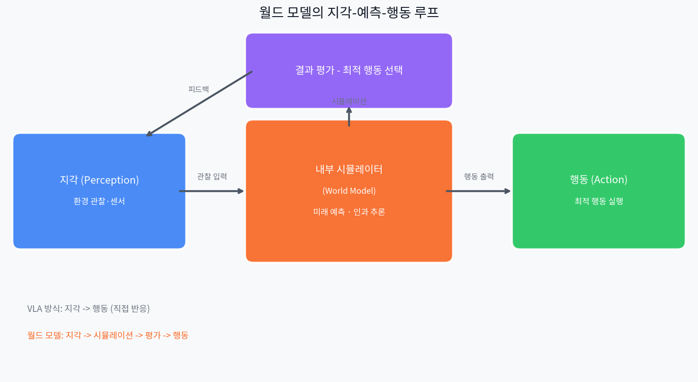

# 눈이 있어도 세계를 모른다 — VLM·VLA를 넘어 월드 모델로

_VLM은 보고, VLA는 행동한다. 그런데 왜 부족한가 — 인과 추론과 미래 예측이 없는 AI가 맞닥뜨리는 한계, 그리고 월드 모델이 여는 다음 장_

## Executive Summary

> [!callout]
> VLM은 보고, VLA는 행동한다. 그러나 둘 다 "내가 이걸 하면 5초 후 세계가 어떻게 바뀔까"에 답하지 못한다. 이것이 인과 추론의 부재이며, Physical AI의 구조적 천장이다.

> V-JEPA 2는 100만 시간의 비디오로 물리 법칙을 학습하고, 단 62시간의 로봇 데이터로 로봇 제어에 전이한다. NVIDIA Cosmos는 2,000만 시간 영상으로 합성 데이터를 생산한다. Genie 3는 텍스트 하나로 실시간 3D 세계를 생성한다.

> 이 글은 VLM·VLA의 구조적 한계를 분석하고, 4개 월드 모델 아키텍처를 비교하며, 데이터 품질이 왜 월드 모델의 결정적 병목인지를 살펴본다.

<!-- stat-card -->
**30×** — 계획 속도 우위

<!-- stat-card -->
**1.2B** — V-JEPA 2 파라미터

<!-- stat-card -->
**62h** — 로봇 전이 데이터

<!-- stat-card -->
**4종** — 아키텍처 비교

## VLM·VLA — 무엇을 잘하는가

지난 몇 년간 AI 연구의 중심을 빠르게 이동한 두 가지 패러다임이 있다. **VLM(Vision-Language Model)**과 **VLA(Vision-Language-Action Model)**다.

VLM은 이미지와 텍스트를 통합해 "이 사진에서 무슨 일이 일어나고 있는가"를 언어로 설명하는 데 탁월하다. GPT-4V, Gemini, LLaVA 등이 대표적이며, 이미지 분류·캡셔닝·VQA(시각 질의응답)에서 인간 수준에 근접했다. VLA는 한 걸음 더 나아가 "이 상황에서 로봇이 어떻게 움직여야 하는가"라는 행동까지 예측한다. RT-2, π₀(Pi0), NVIDIA GR00T, OpenVLA 등이 이 범주에 속한다.

### VLM이 잘하는 것

- 이미지·영상 내 객체 인식 및 설명
- 시각적 질의응답 (VQA)
- 이미지 기반 지시 이해
- 다국어 멀티모달 추론
- 문서·차트 이해

### VLA가 잘하는 것

- 언어 지시 → 로봇 동작 변환
- 제한된 환경 내 조작 작업
- 크로스-임바디먼트 일반화
- 데모 데이터 기반 모방 학습
- 구조적 작업의 순차 실행

그러나 두 모델 모두가 공유하는 근본적인 공백이 있다. 그것은 **세계가 어떻게 작동하는가에 대한 내부 모델**이 없다는 것이다. 보고 이해하고, 지시를 받아 행동하지만 — 지금 이 행동이 5초 후 세계를 어떻게 바꿀지는 모른다.

## VLM의 한계 — 보는 것만으로는 부족하다

VLM은 강력하지만, 세 가지 근본적인 벽에 부딪힌다.

> [!callout]
### ① 기호 접지 문제 (Symbol Grounding Problem)

> VLM은 통계적 분포 모델이다. "사과가 떨어진다"는 문장을 이해하는 것처럼 보이지만, 실제로는 언어 패턴 간의 확률적 연결일 뿐 중력이라는 물리 법칙을 내면화한 것이 아니다. 인지과학에서 말하는 기호 접지가 되어 있지 않다. 멀티모달로 이미지를 연결해도 이 문제는 완전히 해결되지 않는다.

> [!callout]
### ② 언어 없이는 추론 불가

> VLM의 추론 과정은 텍스트 표현에 강하게 결합되어 있다. 인간은 언어를 쓰지 않고도 공간적·감각운동적 상상으로 추론할 수 있지만, VLM은 비언어적 과제도 언어 구조를 통해서만 처리한다. 이것은 시공간 추론, 직관적 물리 이해에서 구조적 취약점을 만든다. 예를 들어 GPT-4V에게 "이 공이 경사면을 굴러내려 가면 어디서 멈출까?"를 이미지로 물으면 언어적 설명은 가능하지만, 실제 물리 궤적을 정확히 예측하는 것은 어렵다 — 물리 법칙이 내면화된 게 아니라 언어 패턴으로 근사하기 때문이다.

> [!callout]
### ③ 시간축 단절 — 프레임 독립 처리

> 대부분의 VLM은 이미지나 영상 프레임을 독립적으로 처리한다. 멀티카메라 입력 시 토큰 수가 폭발적으로 늘어나 실시간 추론이 어렵고, "이 물체가 5초 전 어디 있었고 5초 후 어디 있을 것인가"라는 시간적 인과 추론을 기본 구조상 수행하기 어렵다.

*VLA의 시각 표현 비교. 이미지 기반 자기지도(DINO)·언어-이미지 대조(SigLIP)는 정책 사전(Policy Prior)이 부족한 반면, V-JEPA 2의 비디오 예측 학습은 환경 이해·태스크 이해·정책 사전 세 지표 모두에서 우수하다. (출처: JEPA-VLA, arXiv:2602.11832, CC BY)*

"MLLMs cannot truly reason without language. Their reasoning, perception, and decision-making processes are tightly coupled to textual representations. Unlike humans, who can form visual or sensorimotor imaginations..."

## VLA의 한계 — 행동하는 것만으로는 부족하다

VLA는 VLM에 행동 예측 레이어를 추가했다. 하지만 세 가지 핵심 취약점이 남아 있다.

①

근시안적 행동 계획

②

데이터 확장성 한계

③

인과성 없는 설명

### 왜 인과성이 결정적인가

자율주행 차량이 "앞에 사람이 있다"를 인식하고 "멈춘다"는 행동을 취하는 것은 VLA로 가능하다. 그러나 "이 사람이 3초 후 오른쪽으로 걸어갈 것인가, 갑자기 뛰어들 것인가"를 물리·행동 법칙을 기반으로 예측하는 것은 다른 종류의 능력이다. 이것이 바로 **인과 추론과 미래 상태 예측**이며, VLA의 구조적 공백이다.

장기 시퀀스(수천 단계의 행동)가 필요한 Minecraft 다이아몬드 채굴이나 복잡한 로봇 조립은 VLA 단독으로는 해결이 어렵다. 미래를 상상하고, 상상 속에서 행동 결과를 평가하고, 최적 경로를 선택하는 능력 — 이것이 월드 모델이 제공하는 것이다.

## 월드 모델이란 무엇인가

월드 모델(World Model)은 **환경의 변화와 그 결과를 내부적으로 시뮬레이션할 수 있는 AI의 예측 표현**이다. 단순히 현재 상태를 인식하는 것이 아니라, "내가 이 행동을 취하면 세계가 어떻게 달라지는가"를 머릿속에서 상상하고 평가할 수 있다.

"월드 모델은 에이전트가 인과성에 대해 추론하고, 가능한 행동의 결과를 상상함으로써 계획을 세울 수 있게 하는 환경의 내부 예측 시뮬레이션이다."

Yann LeCun은 수년간 이 방향을 일관되게 주장해왔다. "3~5년 안에 LLM이 아닌 세계 모델이 AI 아키텍처의 주류가 될 것이며, 오늘날 우리가 쓰는 방식의 LLM을 사용하는 이는 아무도 없을 것"이라고 2025년 말 다시 한 번 강조했다. 그리고 AMI Labs를 창업해 €3B 밸류에이션으로 €500M을 조달, 이 방향에 직접 베팅했다.

*V-JEPA 2의 모델 예측 제어(MPC). 현재 관찰(Encoder)에서 예측기(Predictor)가 행동 시퀀스를 따라 미래 상태를 잠재 공간에서 상상하고, 목표 이미지와의 L1 거리를 최소화하는 행동을 선택한다. (출처: V-JEPA 2, arXiv:2506.09985, CC BY)*

### 두 가지 핵심 기능

#### 1. 세계 이해 (Understanding)

환경의 메커니즘을 내부적으로 표현. 중력, 마찰, 물체 영속성, 인과 구조 등 물리 법칙을 암묵적으로 학습한다. "왜 이런 일이 일어났는가"를 설명할 수 있다.

#### 2. 미래 예측 (Predicting)

가능한 행동의 결과를 시뮬레이션. "내가 A를 하면 어떤 일이 벌어지는가"를 실제 행동 없이 상상 속에서 평가하고 최적 행동을 선택한다.

## 주요 월드 모델 아키텍처 비교

2025년은 월드 모델의 변곡점이었다. 4개의 대형 시스템이 서로 다른 접근법으로 경쟁하며 실질적인 능력을 증명했다.

V-JEPA 2Meta AI · 2025

1.2B 파라미터. 100만 시간 이상의 영상을 학습했지만 **픽셀을 생성하지 않는다** — 잠재 공간(latent space)에서 예측한다. 이것이 핵심 차별점이다. 1단계에서 인터넷 비디오로 물리 법칙을 학습하고, 2단계에서 단 62시간의 로봇 데이터를 추가해 로봇 제어로 전이한다. NVIDIA Cosmos 대비 **30배 빠른 계획 속도**를 달성했다.

잠재 공간 예측2단계 학습오픈소스로봇 제어

NVIDIA CosmosNVIDIA · CES 2025

실세계 영상 2000만 시간으로 학습한 물리 AI 플랫폼. Predict(미래 영상 생성), Transfer(시뮬레이션→실사 변환), Reason(계획 + VLM) 세 모델 패밀리로 구성된다. **합성 데이터 생성에 강점**이 있어 자율주행·로봇 기업이 실제 수집 없이 다양한 훈련 데이터를 만들 수 있다. 출시 한 달 만에 **200만 다운로드**를 기록했다.

합성 데이터픽셀 생성자율주행부분 오픈소스

Genie 3Google DeepMind · 2025

물리 엔진 없이 스스로 물리 법칙을 학습해 **24fps 실시간 인터랙티브 3D 세계를 생성**하는 첫 번째 범용 인터랙티브 월드 모델. 텍스트 하나로 3D 레벨을 "타이핑"할 수 있다. 게임·시뮬레이션 분야에서 RL 에이전트 훈련 환경으로 활용 가능성이 크다. 현재는 제한적 프리뷰 단계다.

인터랙티브실시간 3DRL 훈련 환경텍스트→세계

DreamerV3 / Dreamer 4DeepMind · RL 특화

강화학습 에이전트를 위한 상상 기반 훈련 프레임워크. 에이전트는 실제 환경이 아닌 **월드 모델이 만든 정신적 시뮬레이션** 안에서 학습한다. Dreamer 4는 오프라인 데이터만으로 Minecraft 다이아몬드 챌린지를 해결했다. "월드 모델 = 픽셀 예측기"라는 통념을 깨고, **경험 생성기**로 재정의한다.

RL 특화상상 기반 학습잠재 공간오픈소스

*월드 모델 발전 로드맵(2018–2025). 모델 기반 강화학습(Dreamer)에서 자기지도 학습(JEPA), 비디오 생성(Sora, Cosmos), 인터랙티브 환경(Genie 3)까지 6개 카테고리로 정리한 주요 모델 계보. (출처: World Models Survey, arXiv:2411.14499, CC BY)*

| 모델 | 방식 | 주요 용도 | 픽셀 생성 | 오픈소스 |
| --- | --- | --- | --- | --- |
| V-JEPA 2 | 잠재 공간 JEPA | 물리 추론, 로봇 제어 | ❌ 없음 | ✅ 완전 |
| Cosmos | 확산 + AR 트랜스포머 | 합성 데이터, 자율주행 | ✅ 있음 | ⚠️ 부분 |
| Genie 3 | 인터랙티브 생성 모델 | 3D 세계 생성, RL 환경 | ✅ 있음 | ❌ 제한 |
| DreamerV3/4 | 재귀 잠재 모델 | RL 에이전트 훈련 | 부분 | ✅ 완전 |

****************

> [!callout]
### 월드 모델도 아직 풀지 못한 것

> ① 물리적 예측 ≠ 추상적 이해

> 도미노 수천 개가 쓰러지는 영상을 보여주면, 현재 월드 모델은 각 도미노의 물리적 상태와 인과적 충격을 정확히 예측할 수 있다. 그런데 만약 그 배열이 소수 판별 회로를 구현하는 논리 게이트라면? 물리 인과성은 완벽히 추적하지만, 그 시스템이 무엇을 _의미_하는지는 모른다. 직관적 물리 이해와 고차원 추상 추론 사이의 간극은 아직 열린 문제다. (참고: arXiv:2511.12239)

> ② 개방 세계의 부분 관찰성

> 실험실 환경에서는 강하지만, 현실은 센서 한계·안개·폭우·분포 외(OOD) 변수가 상존한다. 에이전트가 내부 시뮬레이션에 과도하게 의존할 때, 상상과 현실의 괴리가 쌓여 로봇이 환각적 행동을 할 수 있다. 추상화 수준을 높이면 연산 효율이 올라가지만 현실 충실도가 낮아진다 — 이 트레이드오프는 아직 해결되지 않았다.

## 핵심 키워드 분석

2025~2026년 월드 모델 연구에서 가장 자주 등장하는 키워드들을 분류해 정리했다.

### 아키텍처 키워드

잠재 공간 예측JEPA4D 점유 예측BEV확산 모델자기회귀 트랜스포머VAE 압축

### 응용 도메인 키워드

Physical AIEmbodied AI자율주행로봇 조작합성 데이터Sim-to-Real인터랙티브 시뮬레이션

### 능력 키워드

인과 추론장기 계획물체 영속성직관적 물리반사실적 추론시공간 일관성

### 한계·연구 방향 키워드

기호 접지OOD 일반화오차 누적장기 시간 일관성평가 메트릭 부재인과-구조 데이터셋

> [!callout]
### 2026년 새로 등장한 벤치마크

> 월드 모델의 실제 능력을 측정하기 위한 벤치마크가 쏟아지고 있다. **PhysicsMind**는 낙하·충돌·물 흐름 등 직관적 물리 추론을 평가하고, **RBench**는 로봇이 임바디먼트 상황에서 세계를 얼마나 정확히 모델링하는지를 측정하며, **DrivingGen**은 자율주행 시나리오에서 미래 장면 생성 품질을 평가한다. 이 세 벤치마크 모두 단순 다음 프레임 예측을 넘어 인과성·직관적 물리·장기 계획을 직접 측정한다는 공통점이 있다.

## 페블러스 관점 — 데이터 운영에도 월드 모델이 필요한가

로봇과 자율주행의 이야기처럼 들릴 수 있다. 하지만 페블러스가 구축하는 **DataGreenhouse**의 관점에서 월드 모델 패러다임은 직접적인 함의를 가진다.

### ① 데이터 파이프라인의 "미래 예측" 문제

현재 대부분의 데이터 품질 시스템은 반응적이다 — 오류가 발생한 후 탐지한다. 월드 모델 방식은 "이 데이터 변환 작업이 3단계 후 다운스트림 품질에 어떤 영향을 미치는가"를 사전에 시뮬레이션할 수 있다. 이것은 선제적(proactive) 데이터 품질 관리의 기술적 기반이다.

### ② AI 모델 성능의 인과 지도

DataGreenhouse는 AI 모델의 훈련·평가 데이터를 관리한다. 여기서 "어떤 데이터 변화가 모델 성능에 어떤 인과적 영향을 주는가"를 이해하는 것은 월드 모델이 하는 일과 구조적으로 같다. 데이터-모델 인과 지도를 만드는 것이 자율형 데이터 운영의 다음 단계다.

### ③ Sim-to-Real이 데이터에도 적용된다

로봇 분야에서 Cosmos가 합성 데이터로 실세계 훈련 비용을 낮추듯, 데이터 운영에서도 합성 데이터 생성과 실제 데이터 간 분포 차이를 관리하는 능력이 핵심이 된다. DataGreenhouse의 데이터 다양성·대표성 평가는 이 방향에서 의미가 있다.

> [!callout]
### 페블러스의 관찰

> VLM·VLA의 한계가 "인과 이해 없는 지각·행동"이라면, 현재 많은 데이터 파이프라인도 같은 구조적 한계를 가진다 — 데이터를 처리하지만 그 처리가 AI 성능에 어떤 인과적 결과를 만드는지 이해하지 못한다. 월드 모델 연구가 제시하는 "내부 인과 모델"의 개념은 자율형 데이터 운영 시스템 설계에서 핵심 원리로 적용될 수 있다.

## FAQ

## 레퍼런스

- [1]Tsinghua University et al., _"Understanding World or Predicting Future? A Comprehensive Survey of World Models"_, ACM CSUR 2025 · arXiv:2411.14499
- [2]Meta AI, _"V-JEPA 2: Self-Supervised Video Models Enable Understanding, Prediction and Planning"_, 2025
- [3]NVIDIA, _"Cosmos World Foundation Model Platform for Physical AI"_, CES 2025 · arXiv:2501.03575
- [4]Google DeepMind, _"Genie 3: A New Frontier for World Models"_, 2025
- [5]Hafner et al., _"Mastering Diverse Domains through World Models (DreamerV3)"_, 2024
- [6]Survey, _"A Survey of World Models for Autonomous Driving"_, arXiv:2501.11260, 2025
- [7]Shang et al., _"A Survey of Embodied World Models"_, Tsinghua FIB Lab, 2025 · arXiv:2510.16732
- [8]Frontiers in Systems Neuroscience, _"Will multimodal large language models ever achieve deep understanding of the world?"_, Nov 2025
- [9]arXiv:2602.01630, _"Research on World Models Is Not Merely Injecting World Knowledge into Specific Tasks"_, Feb 2026
- [10]GitHub: _LMD0311/Awesome-World-Model_, _leofan90/Awesome-World-Models_ — 커뮤니티 큐레이션 논문 리스트

<!-- stat-card -->
**📚 월드 모델 시리즈** — 이 글은 [월드 모델](/project/WorldModel/ko/) 허브가 묶는 시리즈의 일부입니다. AI가 세계를 이해하고 미래를 예측하는 두 갈래 길 — 입문부터 JEPA·Sora·Genie까지 다섯 편을 한자리에서.
