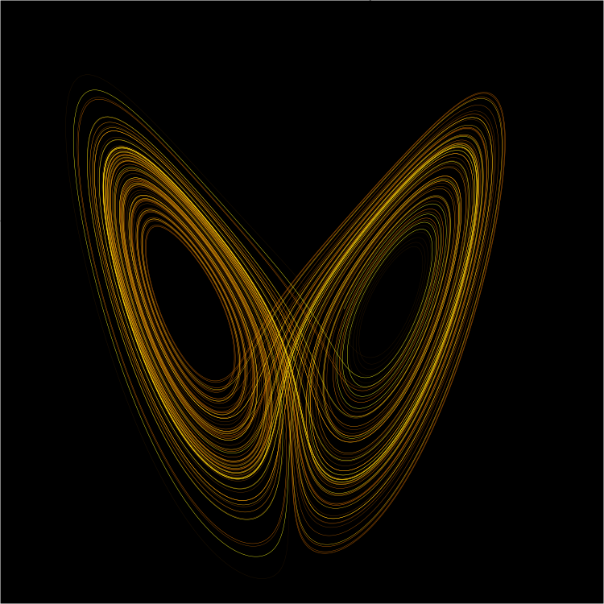

# 나비효과와 데이터

_초기 조건이 미래를 결정한다_

## 들어가며

"Does the flap of a butterfly's wings in Brazil set off a tornado in Texas?"

얼마 전 지인의 Facebook 포스트가 눈에 들어왔습니다. 카오스이론과 나비효과를 다룬 글이었는데, 읽으면서 이 개념이 단순한 물리학 이론에 그치지 않는다는 생각이 들었습니다. 나비효과는 데이터를 다루는 사람이라면 반드시 내면화해야 할 인식론적 경고입니다.

나비효과(Butterfly Effect)는 복잡계에서 미세한 초기 조건의 차이가 시간이 지남에 따라 비선형적으로 증폭되어 완전히 다른 결과를 만들어내는 현상입니다. 이 글은 그 발견의 역사, 카오스이론의 핵심 원칙, 그리고 데이터와의 깊은 연결을 탐구합니다.

🦋

소수점 아래 세 자리의 차이가 두 달 뒤의 날씨를 바꿨습니다

## 로렌츠의 발견: 반올림 하나가 세상을 바꿨다

1961년, MIT의 기상학자 에드워드 로렌츠는 기상 시뮬레이션을 재실행하고 싶었습니다. 시간을 아끼려 중간 지점의 결과를 프린터에서 읽어 재입력했는데, 컴퓨터 내부 정밀도인 0.506127 대신 인쇄물에 찍힌 0.506을 입력했습니다.

### 그 차이: 0.000127

1만 분의 1도 안 되는 이 미세한 차이는 처음에는 거의 동일한 경로를 따라가다가, 시간이 지날수록 점점 벌어졌습니다. 두 달 뒤의 시뮬레이션은 완전히 다른 날씨 패턴을 보였습니다. 로렌츠는 처음에 컴퓨터 오류라고 생각했지만, 이것이 자연의 근본적 성질임을 깨달았습니다.

로렌츠는 1963년 이 발견을 "결정론적 비주기 흐름(Deterministic Nonperiodic Flow)"이라는 논문으로 발표했습니다. 그리고 1972년 강연에서 "브라질의 나비 날갯짓이 텍사스에 토네이도를 일으킬 수 있는가?"라는 제목을 붙이면서 '나비효과'라는 개념이 대중에 퍼졌습니다.

> [!callout]
> 핵심 통찰

> 로렌츠가 발견한 것은 단순한 기상 현상이 아닙니다. 규칙이 완벽하게 정해진 결정론적 시스템에서도, 초기 조건을 무한히 정밀하게 알지 못하면 장기적 예측은 원리적으로 불가능하다는 것입니다.

*▲ 로렌츠 어트랙터 — 결정론적이지만 예측 불가능한 궤적 | Source: [Wikimedia Commons](https://commons.wikimedia.org/wiki/File:Lorenz_attractor_yb.svg)*

## 카오스이론의 3원칙

나비효과를 이해하려면 카오스이론이 세 가지 핵심 원칙을 통해 복잡계를 어떻게 설명하는지 알아야 합니다.

원칙 1

### 결정론적 카오스 (Deterministic Chaos)

카오스계는 무작위하게 작동하지 않습니다. 완전히 결정론적인 방정식을 따르지만, 그 결과는 예측 불가능합니다. 이것이 핵심적 역설입니다.

기상 시스템은 뉴턴 역학과 열역학 법칙을 정확히 따릅니다. 규칙은 완벽합니다. 하지만 초기 상태를 무한한 정밀도로 알 수 없다는 현실적 한계 때문에, 시스템은 카오스적으로 행동합니다.

규칙 = 완벽  |  초기 조건의 정밀도 = 유한  |  예측 = 불가능

원칙 2

### 민감한 의존성 (Sensitive Dependence)

초기 조건의 아주 작은 차이도 시스템 궤적을 지수적으로 다르게 만듭니다. 이 발산을 수학적으로 표현한 것이 리아푸노프 지수(Lyapunov exponent)입니다.

초기 차이

ε = 0.000127

60일 후 오차

≫ 예측 불가

원칙 3

### 예측 지평선 (Prediction Horizon)

카오스계에는 신뢰할 수 있는 예측이 가능한 시간적 한계가 존재합니다. 기상 예측의 경우 약 2주가 이론적 한계입니다. 아무리 관측 장비와 계산 능력이 발전해도 이 한계는 근본적으로 극복될 수 없습니다.

> [!callout]
> 10일 예보를 5일 예보 수준으로 향상시키려면 관측 정밀도를 10배 높여야 하고, 14일 예보 수준으로 향상시키려면 정밀도를 100배 높여야 합니다. 이것이 지수적 증폭의 의미입니다.

## 현실 세계의 나비효과

나비효과는 추상적 이론이 아닙니다. 경제, 유체역학, 공학, 생태계 — 복잡계가 존재하는 모든 곳에서 작동합니다.

### 경제 & 금융

### 유체역학 & 기상

### 공학 & 구조

### 생태계 & 진화

<!-- stat-card -->
**📈** — 2008년 금융위기는 미국 서브프라임 모기지 시장의 국지적 부실에서 시작했습니다. 인터넷으로 연결된 글로벌 금융 네트워크는 이 충격을 기하급수적으로 증폭시켜 전 세계 금융 시스템을 붕괴로 이끌었습니다. 1997년 아시아 금융위기도 태국 밧화의 평가절하라는 단일 사건이 촉발점이었습니다. — 🌊 — 난류(turbulence)는 카오스의 교과서적 사례입니다. 층류에서 작은 교란이 발생하면 레이놀즈수가 임계값을 넘는 순간 완전히 다른 흐름 패턴이 형성됩니다. 이것이 항공기 설계와 엔진 효율을 계산하는 데 근본적 불확실성을 남깁니다. — 🏗️ — 1940년 타코마 내로스 교량 붕괴는 설계 하중의 10%도 안 되는 바람에 의해 발생했습니다. 공명 주파수와 카오스적 진동의 상호작용이 구조를 파괴했습니다. 작은 초기 진동이 시스템 전체의 붕괴로 이어진 전형적인 나비효과입니다. — 🌿 — 포식자-피식자 개체수 모델(로트카-볼테라 방정식)은 결정론적 방정식이지만 카오스적 거동을 보입니다. 특정 종의 개체수 변화가 수십 년 후 생태계 전체 구조를 근본적으로 바꿀 수 있습니다. 1995년 옐로스톤 국립공원의 늑대 재도입이 강의 흐름을 바꾼 것이 대표적 사례입니다.

## 철학적 함의: 정밀도, 통제, 겸손

카오스이론이 제시하는 세계관은 단순한 물리학을 넘어섭니다. 그것은 과학, 공학, 의사결정에 대한 근본적 인식론입니다.

### 정밀도가 왕이다

카오스계에서는 측정의 정밀도가 예측 가능한 시간 범위를 직접적으로 결정합니다. 정밀도를 10배 높이면 예측 가능 기간이 일정 수치만큼 늘어납니다. 데이터 수집, 센서 정밀도, 수치 표현의 정확도가 단순한 기술적 문제가 아닌 예측 시스템의 근본 설계 파라미터입니다.

### 통제의 한계를 알아야 한다

카오스이론은 우리가 예측하고 통제할 수 있다고 믿어온 시스템들이 실제로 그렇지 않을 수 있음을 보여줍니다. 경제 정책, 기후 개입, 생태계 관리 — 이 모든 것에는 예측 지평선이 존재합니다. 그 한계를 인정하지 않는 것이 더 큰 위험을 만들어냅니다.

### 데이터의 겸손함

나비효과는 우리에게 데이터 앞에서 겸손해야 한다고 가르칩니다. 우리가 가진 데이터가 얼마나 정밀한지, 어느 시점까지 신뢰할 수 있는지, 그리고 우리가 놓치고 있는 초기 조건은 무엇인지를 끊임없이 질문해야 합니다. 이 겸손함이 더 나은 예측과 의사결정의 출발점입니다.

"카오스는 예측 불가능성의 과학이 아닙니다. 그것은 우리가 어디까지 예측할 수 있고, 어디서부터 예측을 포기해야 하는지를 정확히 알려주는 과학입니다."

## AI 데이터와 나비효과

나비효과는 기상 시뮬레이션에서만 작동하지 않습니다. AI 모델 학습 파이프라인 역시 카오스이론의 무대입니다.

| 카오스이론 개념 | AI 데이터 파이프라인 |
| --- | --- |
| 초기 조건기상 시뮬레이션의 시작 상태 | 학습 데이터셋모델 학습의 출발점 |
| 0.506127 → 0.506 반올림미세한 초기 오류 | 레이블 노이즈 / 클래스 불균형학습 데이터의 미세한 편향 |
| 민감한 의존성오류의 지수적 증폭 | 레이어를 거칠수록 증폭되는 편향딥러닝의 비선형 증폭 |
| 예측 지평선신뢰할 수 있는 예측의 한계 | 모델 신뢰 범위 (Distribution boundary)데이터 분포를 벗어나면 신뢰도 급락 |

AI 모델은 학습 데이터라는 초기 조건에서 출발합니다. 학습 데이터에 존재하는 미세한 편향이나 오류는 모델이 깊어질수록 비선형적으로 증폭됩니다. 로렌츠의 0.000127 반올림이 두 달 뒤의 날씨를 뒤바꾼 것처럼, 학습 데이터의 미세한 오류가 모델의 예측을 예상치 못한 방향으로 이끕니다.

그리고 모든 모델에는 예측 지평선이 있습니다. 학습 데이터의 분포를 벗어난 입력이 들어오는 순간, 모델의 신뢰도는 급격히 무너집니다. 이 한계를 정확히 측정하고 문서화하는 것 — 그것이 데이터 품질 진단의 핵심 가치입니다.

## DataClinic: 초기 조건을 진단하는 도구

나비효과의 관점에서 데이터 품질 진단은 단순한 검수가 아닙니다. AI 예측 시스템의 초기 조건을 측정하고, 그 오염 지점을 제거하고, 신뢰 범위를 정의하는 작업입니다.

🔬

### 이상치 탐지

밀도 기반 분석(DataLens)으로 학습 데이터의 이상 샘플을 탐지합니다. 로렌츠의 반올림 오류처럼 작지만 치명적인 데이터 오염 지점을 사전에 발견합니다.

📊

### 분포 편향 정량화

클래스 불균형과 분포 편향을 수치로 측정합니다. 어느 클래스에서 초기 조건이 왜곡되어 있는지, 그 왜곡이 모델 성능에 얼마나 영향을 미칠지를 사전에 추정합니다.

🏷️

### 레이블 품질 검증

레이블 노이즈와 어노테이션 불일치는 학습 데이터의 가장 미세한 오류입니다. DataClinic은 이를 시각화하고, 오염 비율을 정량화합니다.

🎯

### 신뢰 범위 리포트

데이터 품질 진단 결과를 종합하여 모델의 예측 신뢰 범위를 추정합니다. 나비효과의 예측 지평선처럼, 이 모델이 어디까지 신뢰할 수 있는지를 명시합니다.

> [!callout]
> 나비효과와 DataClinic의 공통 목표

> 카오스이론이 기상 예측의 한계를 정확히 정의하듯, DataClinic은 AI 모델 예측의 한계를 데이터 레벨에서 정의합니다. 예측 불가능성을 인정하고, 신뢰할 수 있는 범위를 명확히 하는 것 — 이것이 과학적 접근의 본질입니다.

## 자주 묻는 질문

나비효과란 무엇인가?
                                    나비효과(Butterfly Effect)는 복잡계에서 미세한 초기 조건의 차이가 시간이 지남에 따라 비선형적으로 증폭되어, 완전히 다른 결과를 만들어내는 현상입니다. 에드워드 로렌츠가 1961년 기상 시뮬레이션에서 발견했으며, 1963년 논문으로 학계에 발표됐습니다.

로렌츠는 나비효과를 어떻게 발견했나?
                                    1961년 에드워드 로렌츠는 기상 시뮬레이션을 재실행하면서 0.506127 대신 0.506으로 반올림된 값을 입력했습니다. 소수점 아래 세 자리의 차이(0.000127)가 두 달 후 시뮬레이션에서 완전히 다른 날씨 패턴을 만들었고, 이것이 카오스이론의 출발점이 되었습니다.

결정론적 카오스란 무엇인가?
                                    결정론적 카오스는 규칙은 완벽하게 정해져 있지만 결과는 예측 불가능한 시스템을 말합니다. 방정식 자체에는 무작위성이 없지만, 초기 조건의 극도로 민감한 의존성 때문에 장기적 예측이 근본적으로 불가능해집니다. 기상 시스템, 경제 시장, 생태계가 모두 이 범주에 속합니다.

나비효과가 경제에 미치는 영향은?
                                    금융 시장은 나비효과의 대표적 사례입니다. 2008년 서브프라임 모기지 위기는 특정 지역의 소규모 대출 부실에서 시작해 전 세계 금융 시스템 붕괴로 이어졌습니다. 인터넷으로 연결된 글로벌 경제에서 각 노드 간 상호의존성이 초기 충격을 기하급수적으로 증폭시킵니다.

예측 지평선이란 무엇인가?
                                    예측 지평선(Prediction Horizon)은 초기 조건의 불확실성이 증폭되어 신뢰할 수 있는 예측이 불가능해지는 시간적 한계입니다. 기상 예측의 경우 약 2주가 이론적 한계로, 아무리 관측 장비와 계산 능력이 발전해도 이 한계를 극복할 수 없습니다.

나비효과와 AI 학습 데이터의 관계는?
                                    AI 모델은 학습 데이터의 초기 조건에서 출발합니다. 학습 데이터의 미세한 편향이나 오류는 모델이 깊어질수록 비선형적으로 증폭됩니다. 나비효과의 관점에서 데이터 품질 진단은 단순한 검증이 아니라 예측 시스템의 신뢰 한계를 정의하는 작업입니다.

DataClinic은 나비효과 문제를 어떻게 다루는가?
                                    페블러스 DataClinic은 AI 학습용 이미지·레이블 데이터셋의 품질을 진단합니다. 밀도 기반 이상치 탐지로 초기 조건의 오염 지점을 찾고, 클래스 불균형·레이블 노이즈·분포 편향을 정량화하여 모델 예측의 신뢰 범위를 사전에 추정합니다.

카오스이론의 한계와 통제 가능성은?
                                    카오스이론은 장기 예측의 근본적 불가능성을 보여주지만, 동시에 카오스 제어(Chaos Control) 연구를 통해 작은 개입으로 시스템을 원하는 상태로 유도하는 방법도 개발되고 있습니다. 핵심은 통제를 포기하는 게 아니라 통제의 한계를 정확히 이해하고 그 안에서 최선의 의사결정을 내리는 것입니다.

> [!callout]
> 결론: 데이터 앞에서 겸손해야 하는 이유

> 에드워드 로렌츠는 0.000127의 차이에서 세상의 근본 성질을 발견했습니다. 우리가 다루는 AI 시스템도 마찬가지입니다. 학습 데이터의 미세한 오염, 레이블의 작은 노이즈, 분포의 미묘한 편향 — 이것들은 모두 나비의 날갯짓입니다. 그 날갯짓이 어디서 토네이도를 만들어낼지 미리 알 수는 없지만, 날갯짓의 존재를 측정하고 기록할 수 있습니다. 데이터 품질 진단은 그런 의미에서 예측 가능성을 팔지 않고 신뢰 가능성을 판매합니다.
