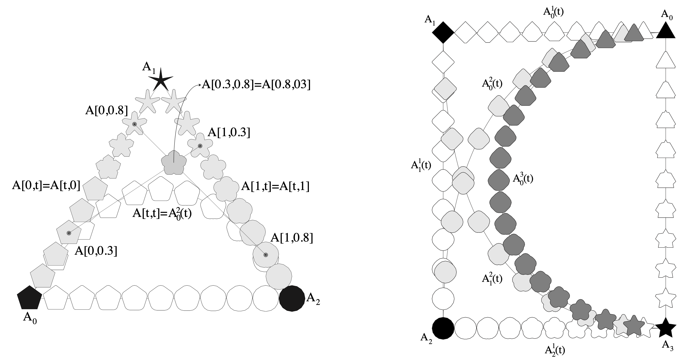
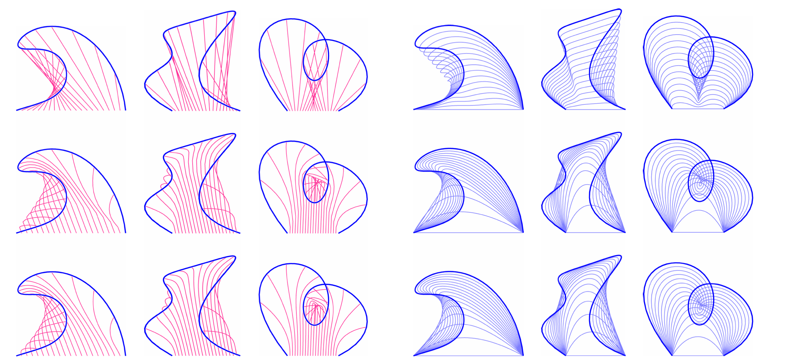
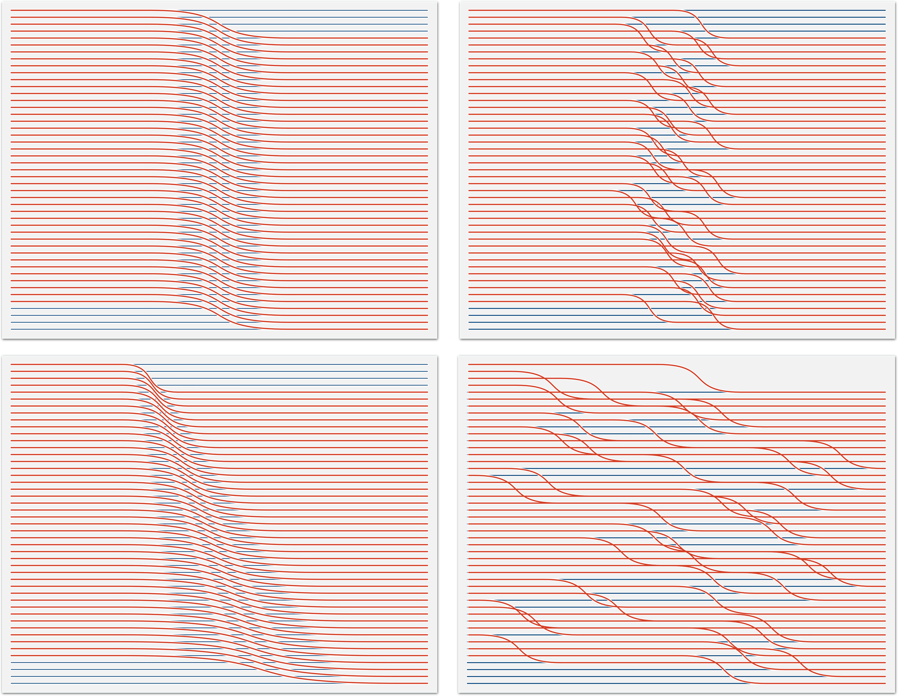
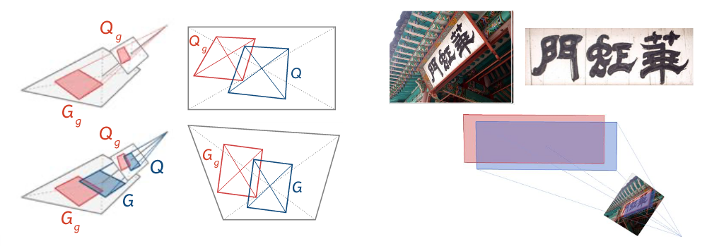
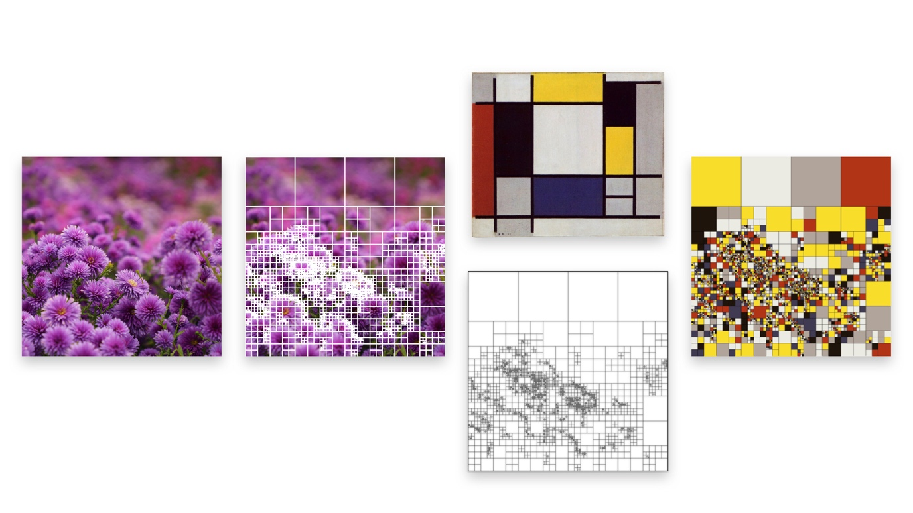
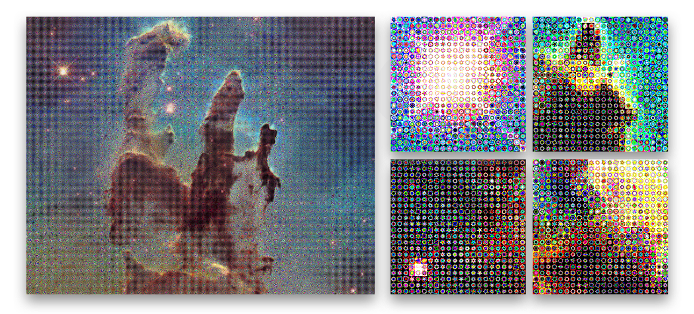
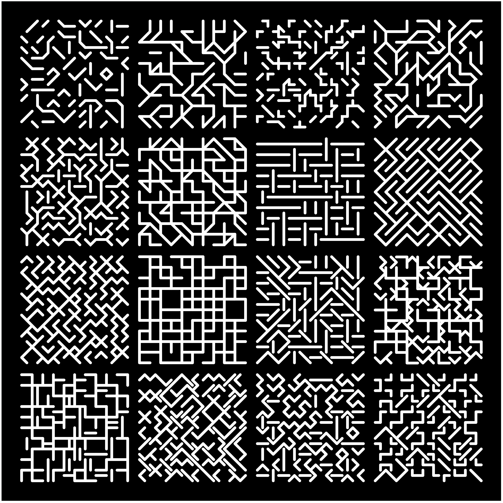

[Korean](../ko/)

Data Art Lab Essay

# Code Painting

A Computer Scientist's Story of AI and Art

**Original source:** Contributed essay for Daejeon Biennale 2020 'AI: Sunshine Loses Its Glass Window'  
**Author:** LEE Joohaeng (Co-founder/CEO of Pebblous, Principal Researcher at ETRI, Professor at UST, Artist)

## Introduction

While preparing artworks to submit to the Daejeon Biennale, I received a request to write an essay on the subject of artificial intelligence and art. As a computer scientist who researches AI at a national research institute, and also as an artist who creates artworks using these technologies in my spare time, I thought it would be a wonderful opportunity to share my experiences and thoughts on AI and art with all of you.

In the first part of this essay, I would like to begin with a light account of how I came to enter the world of computer art, and the personal stories -- both exhilarating and stumbling -- of my debut as an artist last year. In the latter part, I will explain to my fellow Biennale participants the intersection of science and art, and in particular what recent advances in AI technology mean for art, drawing from my personal experience. As a working researcher at Daedeok Science Town, and as an artist who was given the precious opportunity to debut through the Daejeon Science Festival, I have prepared this essay with a heart that supports and cheers on the new artistic direction that the Daejeon Biennale is charting.

## Entering the World of Computer Art

I studied computer science as an undergraduate and in graduate school. My specialization in graduate school was computer graphics. Unlike computer graphics taught in art schools, computer graphics in engineering is grounded in mathematics and physics. It involves building mathematical and physical models that represent shape, motion, and color, and then simulating them on computers.

My connection to computer graphics actually began with computer music. While conducting small computer music experiments in my college dormitory, I was invited to compose background music for an animation project at a graduate computer graphics lab. The excellent research equipment and the warmth of the senior students were wonderful, but what truly captivated me was the fact that I was participating in creating animations with computers. Eventually, through undergraduate research, I decided to pursue graduate studies in the computer graphics lab.

However, once I officially joined the lab and began participating in research in earnest, the proportion of animation work diminished. Instead, I was able to study "images" more seriously. Although I had never had the opportunity to receive proper art training during my middle and high school years, I personally enjoyed drawing and had studied art history with considerable pleasure. So the prospect of studying how to create images with cutting-edge computers was tremendously exciting.

Yet serious computer graphics research is somewhat distant from "art." While the aesthetic application of research results is considered, what matters most is mastering deep mathematical theories and complex computer algorithms. My advisor had majored in mathematics and studied computer science as a second major, so his theoretical depth in computer graphics was formidable. Thanks to studying under him, unlike typical computer science graduate students, I was able to experience a rather sophisticated world of mathematics. Although many years have passed since I graduated, the mathematics and the experience of abstract thinking I cultivated during those years have been of great help in my subsequent engineering research and artistic endeavors.

*[Figure 1] Doctoral research on offset curves of freeform curves. The image depicts the trajectories of circles of varying sizes moving along a curve. While these hold significant importance in industrial applications, their forms alone possess an inherent beauty. (1999, POSTECH)*

No matter how well armed one is with theory, the results of computer graphics research must ultimately be accompanied by beautiful equations and equally beautiful images. Creating beautiful images using existing theories, and then venturing to find new theories that could produce even better images -- this was an immensely appealing process. Being able to freely create stunning images using the finest computer graphics equipment of the time was also a sweet reward for the arduous theoretical study. Truly, for me, the field of computer graphics felt like an ideal realm where research and hobby became one.

Looking back now, what I primarily learned in school was "the method of observing reality, modeling it, and reproducing it computationally." When the reproduction turned out well, I could enjoy the visual luxury of beautiful imagery as a bonus. But what ultimately mattered was the process of abstract thinking required to model complex reality, along with the tools of mathematics and physics. This experience in modeling and simulation, together with my knowledge of mathematics and physics, seems to have provided the foundation that allowed me to explore a wide range of research areas beyond my graduate specialization, even after completing my degree and working at a research institute.

## Drawing Imagination with Code - What to Draw, and How?

Immediately after graduating, I joined a research institute through an alternative military service program. In the early days of my life as a researcher, I spent busy yet joyful days. Above all, I was able to conduct a wide variety of new experiments based on the knowledge I had studied in graduate school. In particular, the research team I belonged to at the time was quite unlike the typical atmosphere of a government-funded research institute -- open communication and free-spirited research were "tacitly" guaranteed. Thanks to this, beyond the projects I carried out in exchange for my salary, I was also able to pursue more fundamental research topics and write papers. I believe this is how I was fortunate enough to receive major research awards such as the Gaheon Academic Award on two separate occasions.

*[Figure 2] Research on Shape Blending using Direction Maps of Polygons (2003)*

From the early 2000s through the mid-2010s, the foundation of my research was modeling and simulation grounded in mathematical and physical knowledge. From robotics to rendering technology, though the research topics varied, the methodology remained the same. And for presenting research results, I always used meticulously prepared illustrations. I also devoted great effort to crafting presentation materials. This was partly the result of countless hours of training in graduate school, but it was also a personal inclination to pursue completeness in both content and form.

At some point -- I cannot say exactly when -- I came to think of a research presentation as a well-prepared "short play" or "show" for the audience. Of course, the illustrations in papers, the presentation materials, and the presentation itself are all means of objective knowledge communication, but I suspect that my aesthetic sensibilities inevitably found their way in. This background seems to have been of great help in my long practice of sketching and my more recent artistic endeavors.

*[Figure 3] Growth structure of higher-order Bezier curves (Rib and Fan). A geometric study that began with the question: does each unique curve possess its own "fingerprint"? (2006)*

The tools for creating images with a computer are remarkably diverse. Different tools are chosen depending on the situation. Image tools like Photoshop may be used in the final stages, but for an engineer trained in computer graphics, most images are produced through "code." Code is also known as a "computer program." Just as people use language to communicate with one another, we need a special language when instructing a computer to do work. This is called a programming language. Code is a special kind of "writing" composed in a programming language. Occasionally there is beautiful code, but most of the time it is very long, abstruse, and tedious. Yet through such code, human thoughts can be conveyed to a computer. With advances in AI technology, today's computers can provide answers even to simple inputs on their own, but in most cases, one still needs to give very meticulous instructions to obtain the desired result.

In this way, a computer performs tasks according to the code a person has entered and produces output. While outputs can take the form of text, sound, or motion, in computer graphics we primarily deal with the image output generated by the computer. Looking at the output images can also reveal errors in the code. When creating images in the context of engineering research, there is usually a predetermined purpose. If the image contains elements that contradict this purpose, it is regarded as an error, and the code that produced the image is revised.

Writing code and verifying the resulting image is a process that is typically repeated many times. This process usually takes a very long time and can be quite tedious. Coding, therefore, can be seen as a form of intellectual labor. Nonetheless, if good results can be obtained, it can be a sufficient reward for the labor. But is it not possible for the process itself to be enjoyable? Can beautiful images be created with reduced labor? Could it not be as immediate and intuitive as a painter moving a paint-laden brush across a canvas?

This is greatly influenced by which programming language one uses. When building large, functional systems, rigorous programming languages like C or Python are employed. However, using such programming languages when trying to create creative images can break the very inspiration to draw. The preparation is complex, and the interactive feedback is weak.

On the other hand, there are programming languages like the Wolfram Language. The Wolfram Language runs on a special software called Mathematica. This language is designed so that scientists can focus on problem-solving, and its greatest advantage is that it enables intuitive coding. In particular, without complex preparations for programming, one can quickly sketch an idea that has come to mind and experiment with it. It is much like jotting down an idea on a napkin over coffee. While it excels in modeling and simulation -- the fundamental methods of computational science -- it is also tremendously useful even when used solely for creating images. Philosophers and writers have even used it to organize and communicate their ideas.

*[Figure 4] An example of expressing changes of the mind through geometric symbols. Connected Lines 4 Streams (2017)*

I have been using Mathematica since my graduate school days. For the most part, it was used to create images intended for knowledge communication. However, perhaps due to the convenience of the tool, I gradually began using it for more "whimsical" endeavors as well. This was the beginning of my "code painting" — paintings drawn by code, much as watercolor painting is painting drawn with water-based pigments. Beyond images drawn for the purpose of conveying knowledge, I started creating images that carried imagination and emotion. Though the two types of images differed in content, their method and form of creation were identical. When studying, does one not sometimes doodle in the corner of a notebook? It was exactly that kind of process. Some people have even compared it, in more elegant terms, to literati painting. Did not the scholars of old use the very brush, ink, and paper of their literary studies to depict the world of ideas or record their amusements? Since I drew images using the same coding I used for research, the connection is unmistakable.

## Encountering AI - The Discovery of a New Fire

Visual expression utilizing theories of mathematics and physics, along with computer models and simulation methods, remained my most important research subject until around 2015. It was a period in which I pursued expressing any phenomenon through concise equations and symbols. For instance, there was a case where I took a geometric approach to the principles of cameras. Although it was already a well-established research area, I discovered a new question, and made various attempts to find its answer. More specifically, the problem was to simultaneously determine the exact shape of a rectangle and the position and rotation of the camera, from a single camera image containing a rectangle whose aspect ratio was unknown. I articulated the vague question in my mind into proper mathematical formalism, and went through countless rounds of visualization and equation refinement to find the answer. The equation I finally arrived at was concise and beautiful.

*[Figure 5] A geometric study of the relationship between rectangles and cameras. From a single photograph of a rectangle whose exact shape is unknown, one can simultaneously determine the precise shape of the rectangle and the camera's shooting position. (2012, 2013)*

Recently, however, a new area of interest emerged that defied this established framework. A strange creature, unlike anything I had ever seen, appeared -- and I simply could not take my eyes off it. The more I gazed at it, the more deeply I fell under its fatal charm. Yet when I observed this seemingly perfect creature up close, I found it full of flaws. Many people say it stands at the center of the "Fourth Industrial Revolution," and that it will threaten countless jobs. It is, of course, artificial intelligence (AI).

What charm of AI, then, drew my attention? Especially when it was so fundamentally different from the mathematical methods I had always loved. I suspect it was because, thanks to AI, I experienced a new dimension of coding. If the old dimension was one in which a highly knowledgeable and thoroughly trained human found answers to problems of limited scope through the sophisticated interplay of symbols, the new dimension was one in which anyone could find answers to enormous problems through combinations of irregular patterns that high-performance computers extracted from sufficient data. Even though we do not yet fully understand how this new dimension works, and even though it does not work perfectly.

Observing complex phenomena, discovering concise equations that explain them, and then manually implementing them in code to create beautiful images -- this is an elegant and intellectual process. Although crafting code requires manual work, there is also a certain pride in knowing it is a domain where the artisan's touch is needed, stitch by stitch. For someone who loved this way of working, recent AI methods were quite surprising, unfamiliar, and even disconcerting. Imagine a handsome, wealthy transfer student arriving from the capital and topping the very first exam, yet sounding oddly inarticulate whenever he speaks -- something like that. I would like to share this feeling, so let me elaborate a bit more.

*[Figure 6] Examples of patterns created through recombination of symbols. Lantana and 4x4 Pixel Stack (2018)*

Let us consider the role of the human in code painting. The computer executes the code, but it is the human's role to create that code. First, one must define what the computer is to do. The inputs and outputs need to be specified. Then the procedure for producing the output from the given input must be defined. The computer knows nothing of this procedure. Instead, the human must know it precisely. Once the input, output, and procedure are defined, the process of translating them directly into code is required. Unlike assigning work to a clever person, when assigning work to a computer, one must explain things in an almost excessively "considerate" manner. Because the computer operates exactly and only as the code dictates. That is why coding is a field that demands high proficiency and a great deal of time and effort.

*[Figure 7] An experiment in automatically generating Mondrian-style compositions from photographs. (Birth of Abstraction, 2018)*

What is astonishing about AI in this context is that it can accomplish a task on its own even when only the input and output of the task are defined and the procedure is not. If we do not call this "intelligence," then what else would be? For example, classifying one million different photographs into a thousand categories is a task for which the input and output can be sufficiently defined. However, it is virtually impossible for a human to specify the detailed procedure needed for such classification. Consequently, writing the corresponding code is equally impossible. Yet AI, given a task definition and data that matches it, can generate the code to perform the task on its own. Even though no human explained the procedure in detail! The only caveat is that an enormous amount of data is required, along with a special machine learning method and computational hardware to generate the code.

*[Figure 8] An example of visualizing a deep reinforcement learning neural network. The case of the Streams game at $10.20. (2018)*

This approach -- in which a computer generates code on its own from given data without human intervention -- has been a longstanding topic in AI. Among the various methods, recent efforts are directly related to artificial neural networks (ANNs). I first encountered artificial neural networks during my graduate school years in the 1990s, but I did not find them particularly elegant theoretically, and their practical applications at the time were confined to very small problems. So artificial neural networks were entirely outside the scope of my research interests.

I was not alone; many researchers at the time turned their backs on artificial neural networks. However, a small number of researchers abroad steadily advanced neural network techniques, which eventually evolved into what we now call deep neural networks (DNNs). Conceptually, deep neural networks are not drastically different from traditional artificial neural networks, but there has been an enormous increase in the complexity and scale of the networks. Consequently, the volume and variety of data they can handle have also greatly increased. The development of specialized computing hardware such as GPUs, needed to run these networks, also progressed in tandem. In other words, the alignment of these three elements -- algorithms, data, and hardware -- created conditions highly favorable for the advancement of deep neural networks, enabling the resolution of enormous problems that were previously unthinkable using conventional methods. The era of computer-generated code had finally arrived.

The game of Go was one of those enormous problems that AI solved. AlphaGo's victory thus became a shocking and symbolic event that announced the presence of deep neural network-based AI to the entire world. As a result, computer scientists across various fields -- including the computer graphics community, which had been quite cold toward AI -- began to seriously embrace data-driven coding through deep neural networks. Academic disciplines such as physics, neuroscience, medicine, and economics also began to earnestly consider and actively adopt this new tool called AI. It was around this time that I, too, was able to remove my tinted glasses regarding AI. Rather than abandoning the elegant mathematical methods I had cherished, I came to accept data-driven automatic coding as one new tool among many.

*[Figure 9] Drawing with the star-shaped synthetic training set Star-MNIST, created for AI experiments. (Star Swap Pillars of Creation Nebula, 2019)*

Still, my stance on current AI remains cautious. There are more than enough unsolved challenges: the need for excessively vast amounts of training data, the excessive energy consumption related to carbon emissions, and the fact that humans cannot understand the internal workings of these systems. Nevertheless, the achievements of current AI are also clear. We have become able to handle data at scales and problems of complexity that were unimaginable in the history of human civilization. I think this is not unlike the moment when humanity first discovered fire. We realized for the first time that fire-roasted meat tasted extraordinary, and everyone -- without exception -- fell for the dazzling allure of fire and began conducting all sorts of experiments. But since we had not yet mastered fire, we also extinguished flames by accident and burned ourselves. Yet humanity ultimately conquered fire and, through several industrial revolutions, built the civilization we know today. If so, can humanity also unravel the principles of AI, conquer it, and use it as a stepping stone toward the next civilization?

## Embracing Errors - An Expanded Horizon of Perception

With these questions as a backdrop, let me now explain the influence that AI has had on my code painting. Current AI is challenging many capabilities that conventional computer graphics technology could not provide, and in some areas it has already surpassed existing techniques. Among the various possibilities, what I find most appealing is the ability to easily create complex patterns using AI. However, I do not insist on only the new tool. If the images I used to draw with mathematical methods were like watercolor, then images drawn with AI code can be seen as oil painting. Though the materials are entirely different, they share common ground as tools of painting, and depending on need, one can choose between them or use them in combination.

More importantly, AI is not merely a novel tool for creating images; it is an innovative tool that opens new possibilities for expression and provides inspiration for creation. For example, the "Line Grids" series that I am exhibiting at this Biennale encompasses a wide range of expression methods, from symbols created with mathematical tools to patterns generated with AI. In particular, the works in the latter part of this series, based on complex patterns, would have been impossible without AI methods. Thanks to this, I was able to discover new methods for generating irregular patterns, and the artworks created through this process became an occasion to rethink the relationship between structured symbols and unstructured patterns.

*[Figure 10] Examples of geometric patterns created through repetition of line segments. Atlas of Line Grids - 16 Tribes (2018)*

"Atlas of Line Grids - 16 Tribes" is a work that expresses abstract imagination and concepts through geometric symbols. Starting from the question, "Can a simple line segment become the gene of a complex pattern?" it is the result of an experiment in creating new patterns through the repetition and layering of line segments. This was the way of working I enjoyed before encountering AI. However, starting with the creation of "Line Grids - Evolution of Disorder," I began to incorporate AI techniques. I used AI methods on top of the underlying drawings created with geometric symbols to generate complex patterns, which were then used in the production of artworks. This is different from entrusting the entirety of art production to AI-generated code. Let us look at this method a little more closely below.

Among AI techniques for handling images, there is a method called "Style Transfer." Typically, style transfer requires two input images. One is the style image, which carries the manner of painting. The other is the content image, which carries the subject matter of the painting. For example, if one feeds in a Van Gogh painting as the style and a photograph of flowers as the content, the style transfer deep neural network will transform the flower photograph in imitation of Van Gogh's painterly style. It produces flowers that look as if Van Gogh had painted them.

I tried an interesting experiment here. I fed the same Line Grids pattern image as both the style and content inputs. If a human were to compute the style transfer in this situation, they would easily recognize that the two input images were identical and simply output one of the input images as is. But the AI style transfer did not recognize that the style and content were the same. Instead, it began transforming the structured pattern it received as input into an irregular pattern. Moreover, the degree of irregularity appeared to be controllable.

*[Figure 11] Examples of pattern generation using style transfer. It depicts the process of gradually "breaking down" geometrically defined structured patterns through deep learning. Line Grid - Evolution of Disorder (2018)*

This was a fascinating discovery. I had expected that a pattern similar to but somehow different from the input would be generated, but I could not have imagined its specific appearance in my mind. As a result, through this experiment I found an extremely simple method for creating irregular patterns from structured geometric symbols. It was an unexpected harvest. It would have been impossible with mathematical methods alone; it was the result of adding AI methods and employing them in an unconventional way. From an engineering perspective, one could say I discovered an error in style transfer that occurs when the style and content inputs are identical. This enabled me to begin new research aimed at understanding and eliminating such errors. At the same time, from an artistic perspective, I had discovered a new mode of expression born from error. It was a welcome error, a joyful error. Interpreting such errors opened a new world from an engineering standpoint. However, to seriously employ these errors in art production, it was necessary to be able to reproduce them at will. In the end, a process of "conquering errors" was required.

*[Figure 12-a] Line Grid - Evolution of Disorder (2019)*

*[Figure 12-b] The mathematical surface that generated Line Grid - Evolution of Disorder (2019)*

*[Figure 13] Line Grid - Ambiguous Boundary (2019)*

## 'Code Painting' in One Line of Code

The process of code painting can be expressed in a single line of code. Below is that one line of code.

imgL = Table[ f [imagination, Param->p, Author->"Joo-Haeng Lee"], {p, paramL}]

For those seeing computer code for the first time, it may look like an unfamiliar foreign language, but its meaning is not complicated. It is the process of repeatedly executing a function f using Table to produce images (imgL). Let us look a little more closely.

*[Figure 14] Line Grid - Spring (2020)*

The symbol f is a function. It corresponds to f(x)=y as learned in mathematics class. To draw an image with the function f, inputs are needed, and the most important input is imagination. Creating a function f that can render this imagination into something perceivable is one of the most important tasks for the code painting artist. Specifying the author (Author-> "Joo-Haeng Lee") as a symbolic gesture also serves as an input to the function. Another important input is the parameter (Param->p) that controls the function's behavior. For example, in "Line Grid - Evolution of Disorder," specifying the complexity of the pattern corresponds to this control parameter.

The artist's knowledge and intuition play a significant role in determining what control parameters a particular function requires. And discovering the most appropriate values for those parameters requires countless iterative experiments. These iterations are performed within the Table construct for different parameter values (paramL). In this process, errors may be discovered, and by mastering them, they can become new techniques of expression. Through iterative experiments with different parameters, multiple images (imgL) are obtained. Selecting artworks from these images is also the artist's role. One may choose works for exhibition or select commercial pieces. And that choice will differ from artist to artist.

If one cannot create a function directly, one can also make use of functions generated by AI. This process is generally akin to the experimentation that an artist must undergo to master new tools and techniques. Furthermore, it is a creative process of implementing new artistic imagination and concepts so that they can be perceived as artworks. This resonates with Picasso's definition of his own works as experiments and research.

"My paintings are all research and experiment. I do not paint as a work of art. Everything is research. I search constantly, and there is a logical sequence in this research."
                - Pablo Picasso

Code painting may feel like a cold process that requires no human role. However, as we have seen above, when the working process of code painting is expressed in code, we come to realize that the human role is in fact essential, just as in any other form of art. In the many stages of imagining, writing functions, selecting parameters, discovering errors, mastering new techniques, and choosing artworks from among the images, the role of the human artist is indispensable.

By now, you will have understood that code painting is entirely different from paintings drawn by the code itself. Code is merely a tool used by the artist, much like paint, brushes, and canvas. The Korean title of this essay, "코드로 그린 그림," literally means "paintings drawn by code" — but the term "code painting" better captures the spirit: it is a medium, just like watercolor painting. For me, traditional computer graphics code has long been my tool. Now I am welcoming functions generated by AI as a new tool.

Recently, there has been debate about whether AI can become an artist. I believe that if AI can replace all of the human roles that are necessary in code painting, then we could recognize AI as an artist. However, I think that is a story for a rather distant future. Before then, AI will continue to evolve as an intelligent tool for artists. And more and more artists will come to embrace AI as a new tool. As a computer scientist who elucidates and advances the principles of AI, and simultaneously as an artist who uses AI as a tool, I intend to explore the ambiguous boundary between science and art, and to find delight within it.

LEE Joohaeng

Co-founder/CEO of Pebblous | Principal Researcher at ETRI | Professor at UST | Artist

Original source: Daejeon Biennale 2020  

                    'AI: Sunshine Loses Its Glass Window'

### PDF Download

[⬇KoreanKorean v0.8.pdf](../Code%20Painting%20-%20Daejeon%20Biennale%202020%20Korean%20v0.8.pdf)[⬇EnglishEnglish v0.8.pdf](../Code%20Painting%20-%20Daejeon%20Biennale%202020%20English%20v0.8.pdf)
