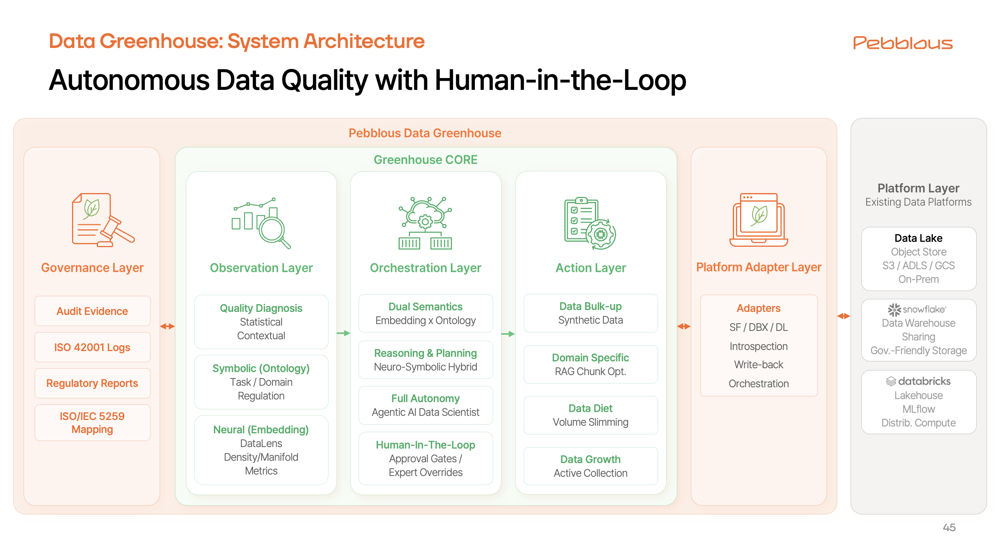

# Data Greenhouse

_자율형 데이터 운영체제_

## 들어가며: 가트너 AI에게 페블러스를 묻다

페블러스는 가트너(Gartner)의 고객사로서 그들의 인사이트를 통해 시장을 읽고 전략을 수립해 왔습니다.
            최근 가트너 서비스에 생성형 AI 기능(AskGartner)이 도입되었다는 소식을 접하고, 우리는 문득 궁금해졌습니다.

"가트너의 AI는 페블러스를 어떻게 알고 있을까?"  

                "데이터 품질 진단에서 합성 데이터 생성까지, 이 통합된 가치를 제공하는 또 다른 플레이어가 존재할까?"

그래서 우리는 가트너 AI에게 질문을 던져 봤고, 돌아온 답변은 꽤나 흥미로웠습니다.
            가트너는 현재 시장의 스타트업들이 해결해야 할 핵심 과제(Challenge)로
            **'진단과 개선의 긴밀한 통합'**,
            **'완전 자동화'**,
            **'신뢰성 확보'** 등을 꼽았습니다.

놀랍게도, 가트너가 제시한 '미래의 과제'들은 페블러스가 이미 해결했거나, 차세대 기술(AADS)을 통해 완성해 나가고 있는 것들이었습니다.
            가트너가 "아직 시장에 드물다"고 평가한 그 기술적 난제들을 우리가 이미 넘어서고 있다는 사실은, 페블러스의 방향성이 틀리지 않았음을 재확인시켜 주었습니다.

## 1. 개요 (Executive Summary)

## 2. 2025년 시장 동향: "대전쟁의 서막"

### 2.1 주요 시장 트렌드

### 2.2 가트너의 데이터 품질관리 시장 평가

## 3. 가트너의 4대 통합 패턴

## 4. Data Greenhouse로의 도약

*▲ Data Greenhouse 시스템 아키텍처 — Governance Layer, Observation Layer, Orchestration Layer, Action Layer, Platform Adapter Layer의 5계층 구조*

### 4.1 핵심 개념: 자율 순환 루프
