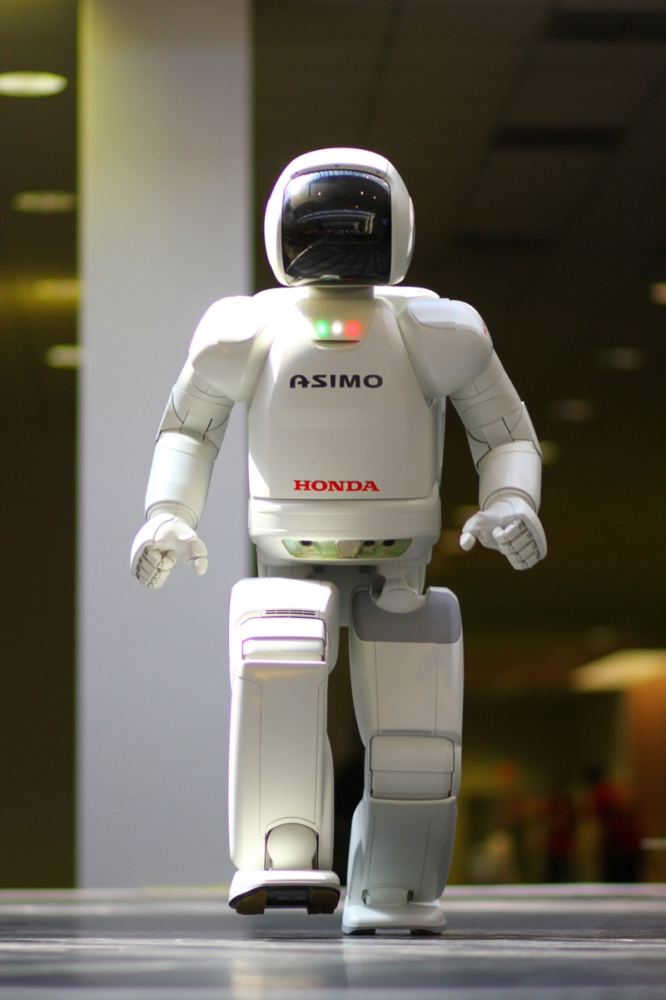
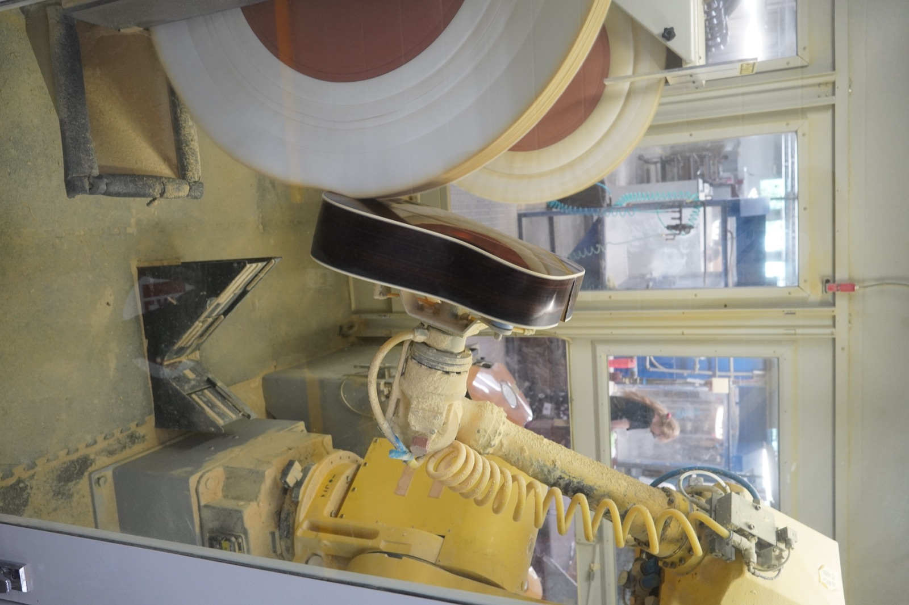
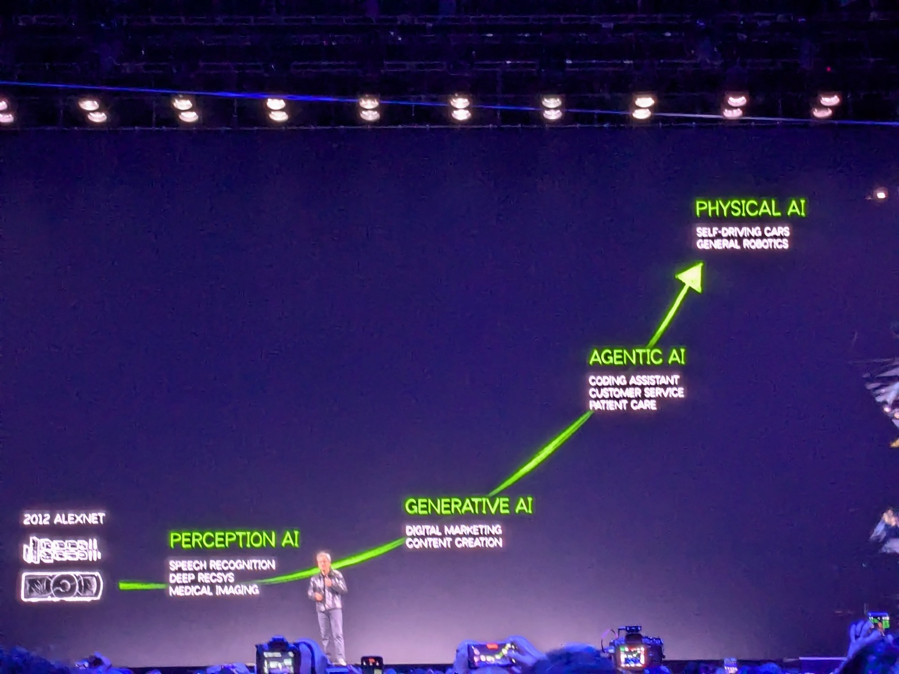
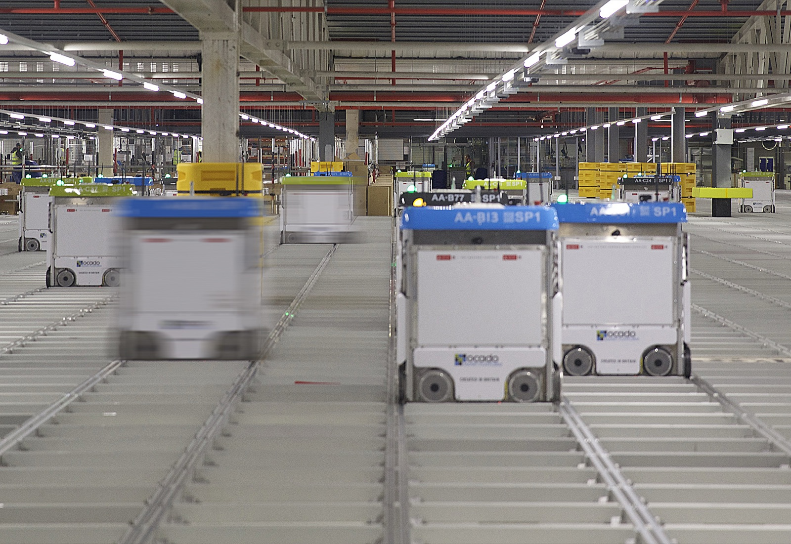

# What Is a VLA (Vision-Language-Action) Model?

_Physical AI Model Evolution & Data Strategy (2026 Edition)_

## Executive Summary

> [!callout]
> **Physical AI** is the technology that lets robots, self-driving cars, and smart factories perceive and act in the real world. Its brain has evolved from text-only LLMs, through vision-added VLMs, to **VLA (Vision-Language-Action)** models that also output actions. This guide maps where that evolution stands today — and why the real contest is fought not over hardware, but over data.

> Since we published the first edition in late 2025, VLA has moved from "research demo" to a full-blown **foundation-model race**. General-purpose robot models such as π0, GR00T, Gemini Robotics, and Helix arrived in quick succession, and humanoids have left the lab to work on real automotive assembly lines. Yet every one of these models grows by consuming **millions of real-robot manipulation episodes**. The three challenges the first edition laid out — heterogeneity, the Sim-to-Real Gap, and scarcity — remain the bottleneck even now that the models have grown far larger.

> In 2026, as humanoids step onto factory floors, the question facing manufacturing, logistics, and drone companies converges on one thing: "How do we turn our field data into a form AI can actually learn from?" Pebblous's [DataClinic](https://dataclinic.ai), [Data Greenhouse](/project/DataGreenhouse/data-greenhouse-strategy/en/), and [PebbloSim](/project/PebbloSim/pebblosim-design-strategy/en/) address exactly this point — sensor fusion, synthetic data, edge-case coverage, and edge optimization. This is a comprehensive guide that runs from the basic concepts, through the latest VLA landscape and data strategy, to 2026 industry trends and eight in-depth reports.

<!-- stat-card -->
**🔄 **This is a fully revised, July 2026 update of the original December 2025 edition.**
                            It reflects the latest VLA foundation models (π0, GR00T, Gemini Robotics, Helix), verified cases of humanoid commercialization, and refreshed market and investment figures.
                            The original is preserved unchanged in the [archived edition](../archive/2025-12/en/).**

<!-- stat-card -->
**77.6%** — Investment flowing to the robot "brain" — Share of 2025 robotics investment going to the AI brain (models & software) rather than hardware (New Market Pitch)

<!-- stat-card -->
**1M+** — Robot trajectories for VLA training — Open X-Embodiment: real-robot manipulation trajectories pooled across 21 institutions and 22 robots (arXiv:2310.08864)

<!-- stat-card -->
**~60%↓** — Drop in data-collection cost — Teleoperation cost fell from $340/hour (2024) to $118–200 (2026). The bottleneck moved from equipment to quality

<!-- stat-card -->
**54%** — China's industrial-robot share — Of 542K new installations worldwide in 2024, China accounted for 295K (IFR World Robotics 2025)

## What Is Physical AI?

If the past decade was an AI revolution inside digital space (search, recommendations, generation), we are now in the era of **Physical AI**, where AI interacts directly with the physical world. Systems that fuse hardware and AI to perceive, understand, and act in reality are arriving in earnest: autonomous vehicles, humanoid robots, smart factories, drones, and unmanned defense platforms.

> [!callout]
> **Physical AI** is the technology that enables autonomous systems (robots, self-driving cars, smart factories) to **perceive**, **reason**, and **act** on objects in the real physical world. Where generative AI concentrates on producing digital content, Physical AI concentrates on the intelligence of machines that actually operate in reality.

Only recently this trend was described as "a story for the next ten years." It is already present tense. As of 2026, humanoid robots have moved past demo reels and begun working on real automotive lines at the likes of BMW and Hyundai, and general-purpose robot foundation models sit at the center of startup valuation races. Physical AI is no longer a forecast — it is a technology being validated on industrial floors right now.

*▲ A humanoid robot built to perceive, reason, and act is the archetype of the autonomous system Physical AI aims for (pictured: Honda ASIMO) | Source: [Wikimedia Commons](https://commons.wikimedia.org/wiki/File:ASIMO_4.28.11.jpg)*

## How Physical AI Models Evolved: From LLM to VLA

To understand Physical AI, you first have to understand how AI models have evolved. The easiest way to picture it is as a **human body** — starting with a brain alone, then gaining eyes, and finally acquiring hands and feet.

### LLM (Large Language Model)

<!-- stat-card -->
**🧠** — **= A brain, and nothing else** — It can understand and generate text. It can neither see ahead nor move. — e.g., ChatGPT, Claude

### VLM (Vision-Language Model)

<!-- stat-card -->
**👁️🧠** — **= Brain + eyes** — It can see the world and describe what it sees — but it cannot touch or manipulate anything. — e.g., GPT-4o, Claude (image analysis)

### VLA (Vision-Language-Action)

<!-- stat-card -->
**🤖** — **= Brain + eyes + hands and feet** — It sees, reasons, and carries out **action**. This is the brain of Physical AI — and it is **not a finished product but the arena of an active, fast-moving foundation-model race**. — e.g., π0, NVIDIA GR00T, Google Gemini Robotics, Figure Helix

Laying the three models side by side across four axes (input, output, real-world interaction, and training data) makes the picture snap into focus. The row that repays a close look is the last one. **Where the training data comes from** is what fundamentally separates VLA from the two models before it. While LLMs and VLMs draw on data already piled up on the internet, VLA has to manufacture its own — field sensor readings and real robot motion, data that does not yet exist in the world.

| Dimension | LLM | VLM | VLA (Physical AI) |
| --- | --- | --- | --- |
| Input | Text | Text + images | Text + images + sensors |
| Output | Text | Text | Text + action commands |
| Real-world interaction | None | Observation only | Direct manipulation |
| Training data | Internet text | Text + images | Field sensors + real robot motion |

### 2.1. The latest VLA foundation-model landscape

The VLA examples the first edition cited (RT-2, Optimus, Isaac) are now just the starting line. Over the past year or two, several camps have released **general-purpose robot foundation models** one after another. The names and the teams differ, but the message running through all of them is the same: every one of these models is bound to large-scale, high-quality robot data.

| Model | Developer | What it means from a data standpoint |
| --- | --- | --- |
| π0 / π0.5 | Physical Intelligence | A cross-embodiment VLA that stacks an action expert on top of a VLM. Co-training across heterogeneous sources is the key to generalization |
| Isaac GR00T | NVIDIA | An open foundation model for humanoids. Trained on a blend of real + synthetic + web data — a flagship case of using synthetic data to fill real-data shortfalls |
| Gemini Robotics | Google DeepMind | Porting a large multimodal base model onto robots. An on-device version has also been released |
| Helix | Figure AI | A dual-system VLA that runs on board. A real implementation of edge / on-device inference |
| OpenVLA | Stanford et al. (open source) | An open VLA trained on Open X-Embodiment — the scale of the open dataset is the performance |
| Cosmos | NVIDIA | A world foundation model (world model) for Physical AI. Infrastructure for Sim-to-Real and synthetic-data generation |

※ The specific architectures and release dates above follow each developer's official materials; verify detailed figures against the original sources in the [References](#references). For a dataset-level comparison, go deeper in the report ["Six Robot Physical AI Datasets Compared."](/report/robot-physical-ai-datasets-landscape/en/)

> [!callout]
> 💡 **Key point:** An LLM learns from internet text, but **a VLA needs real-world physical data** — the experience of a robot falling over or dropping an object. The more general the model becomes, the more differentiation shifts away from architecture and toward **which data you secured, and how much of it**. That is precisely why Physical AI data is special.

## The Battleground for Physical AI: Why "Data"?

"We want to do Physical AI — but what do we do about data?" Many companies stall right here. An **LLM** like ChatGPT trained on text lying all over the internet, but **Physical AI data** is fundamentally different in nature. And as we just saw, now that every recent VLA is bound to data, that difference has grown past academic interest into **the battleground of investment and business**.

### 3.1. LLM data vs. Physical AI data

Even though we call both "AI training data," what an LLM eats and what a Physical AI eats differ from the source up. One is already stacked on the internet and pulled in by crawling; the other is obtained only by sending a robot into the field and recording it directly through sensors. That difference reshapes the whole character of collection difficulty, cost, and quality control.

#### 📝 LLM training data

- •Collectible en masse from the internet (web crawling)
- •Single modality — text, images, and the like
- •Relatively cheap to collect
- •Often order-independent in time

#### 🤖 Physical AI training data

- •**Must be collected directly in the field**
- •**Multimodal sensor fusion** — LiDAR, IMU, thermal, and more
- •Expensive to collect and process
- •**Time synchronization** determines quality

### 3.2. The three defining traits of Physical AI data

What makes Physical AI data hard to work with narrows down to three factors: heterogeneity, the reality gap, and scarcity. They are not separate problems — they interlock, and together they become the root cause that pushes collection and refinement costs up. Let's take them one at a time.

<!-- stat-card -->
**🔀**Heterogeneity**You have to fuse sensors of different rates (Hz) and formats — cameras, LiDAR, radar, IMU, thermal. This is not a simple merge; **sensor fusion** is essential.**

<!-- stat-card -->
**🌉**The Sim-to-Real Gap**There are subtle physical differences between **synthetic data** generated in simulation and real factory or road environments. Fail to bridge that gap and the robot fails in reality.**

<!-- stat-card -->
**📉**Scarcity**Unlike text you can scrape off the internet, robot-motion and industrial field-sensor data are **absolutely in short supply**. Edge-case (exceptional situation) data in particular is extremely hard to collect because it occurs so rarely.**

### 3.3. Measured evidence that data is performance

"Data matters" is no longer a slogan; it is a measured fact. **Open X-Embodiment (OXE)**, which pooled trajectories from 21 institutions and 22 robot platforms, integrated more than a million real-robot manipulation episodes. Models trained on that corpus posted substantially higher success rates than models using single-robot data alone, and worked noticeably better even on new tasks absent from training. It showed that the **scale and diversity** of data translate directly into generalization performance.

At the same time, the economics of data collection are changing fast. The cost of **teleoperation**, where a human physically demonstrates a task for the robot, fell from roughly $340 per hour in 2024 to $118–200 in 2026, about 60% lower. As equipment costs dropped, the bottleneck moved elsewhere: 20–30% of collected episodes are thrown out in quality filtering, and training a single skilled operator costs $1,000–3,000 per person. In other words, **the bottleneck has shifted from "equipment" to "skilled operators and data quality."**

> [!callout]
> 💡 This shows up in investment, too. A large share of 2025 robotics investment flowed not into the robot's body but into the **AI "brain" (foundation models and general-purpose software)**. The body has converged; the contest is decided by the quantity and quality of training data. For how these technical challenges get solved at the practical level — sensor synchronization, physical-validity checks, label consistency — see
>                             **["The Physical AI Data Pipeline: Four Core Challenges and Solutions."](../../data-pipeline-for-physical-ai-01/en/)**

## The Three Core Challenges — and the Role of Data

The fundamental problems Physical AI has to solve come in three stages: **perception**, **reasoning**, and **action**. At every stage, data plays the decisive role.

### ① The limits of perception

<!-- stat-card -->
**Sensor noise, lighting changes, and occlusion degrade the accuracy of environmental recognition. **Embodied AI** is especially vulnerable, because its sensors are mounted on the robot's own body and exposed to physical interference such as vibration and shock.**

### ② The limits of reasoning

<!-- stat-card -->
**Systems misbehave in edge cases absent from the training data. That is exactly why **robotics foundation models** draw so much attention — the goal is judgment that generalizes across diverse situations. World models such as NVIDIA Cosmos and domain randomization are the latest attempts to close this gap.**

### ③ The limits of action

<!-- stat-card -->
**Physical properties of robot joints (backlash, friction, elasticity) affect control accuracy. It is why a motion that was perfect in simulation fails on the real robot, and it must ultimately be corrected with real motion data.**

*▲ Physical properties of a robot's joints are never fully captured by simulation alone — they ultimately have to be corrected with real motion data | Source: [Wikimedia Commons](https://commons.wikimedia.org/wiki/File:Robotic_Arm_Polishing_Guitars_at_Martin_Guitar_Factory.jpg)*

> [!callout]
> 🎯 The takeaway: every Physical AI challenge ultimately comes back to securing **"AI-Ready Data."** For how a nation is trying to solve this problem at the policy level, see
>                             **["Physical AI and the National Strategic Value of Data-Centric AI Startups,"](../../data-startup-physical-ai-01/en/)** along with data alliances and voucher policy.

## Data Quality Is Safety

As humanoids leave the lab and take their place on real factory lines, safety stops being theory and becomes a live problem. For a robot handling heavy parts in the same space as people, a malfunction is an accident. That is why **Gartner (2025)** named **safety engineering**, **AI red-teaming**, and **simulation validation** as core criteria for choosing a Physical AI partner.

### AI red-teaming & simulation validation

<!-- stat-card -->
**🛡️** — To guarantee safety, Gartner sets **AI red-teaming** (simulated vulnerability testing) and **large-scale simulation testing** as mandatory. You have to run thousands of edge-case scenarios before real deployment.

### Edge-case data

<!-- stat-card -->
**⚠️** — **Exceptional-situation** data that could trigger an accident is extremely rare and hard to collect. But without it, a robot produces **catastrophic errors** in situations it never anticipated.

> [!callout]
> 🛡️ **What Pebblous DataClinic does:** it systematically generates and validates the scarce **edge-case** data so that a customer's AI model operates **safely** in the field. With a **Safety-by-Design** approach that fuses simulation and real-environment data, it filters out risk at the data stage — before the robot ever enters the factory.

## Physical AI in 2026

2026 is the inflection point where Physical AI moves past the lab and onto industrial floors in earnest. Where the first edition emphasized market size, the clearer signals now are **the direction of the money** and **humanoids actually being deployed**. Market-size estimates diverge by 20× to 100× depending on definition, but every report agrees on one thing: a **32–47% compound annual growth rate**. So it is more accurate to watch measurable investment, installation, and price data than any single headline number.

*▲ At CES 2025, NVIDIA framed the AI evolution as "Perception AI → Generative AI → Agentic AI → Physical AI (self-driving cars, general robotics)" | Source: [Wikimedia Commons](https://commons.wikimedia.org/wiki/File:Jensen_Huang_-_Nvidia_Keynote_-_CES_2025_Las_Vegas_(1).jpg)*

### 6.1. Investment is piling into the "brain"

Robotics investment in 2025 surpassed the 2021 peak, and by the first half of 2026 it had already approached the full prior-year total. Totals vary with the sample used, but the direction is unmistakable. Capital is concentrating not in robot bodies but in the **AI brain (foundation models and general-purpose software)**. Individual valuations bear this out: Physical Intelligence, which builds VLA models, was valued in the multi-billion-dollar range, and the humanoid company Figure AI and robotics-AI firm Skild AI closed large rounds in succession. This "not the body, the brain" trend is the market's version of **"Physical AI = a data problem."**

### 6.2. Humanoids take their place on the line

The most symbolic scene is the factory. **Figure 02** was deployed at BMW's plant in Spartanburg, USA, and reportedly worked on sheet-metal part loading for about 11 months, moving more than 90,000 parts with high placement accuracy. But you have to separate overheated expectations from results. **Tesla Optimus** set out a goal of 50,000–100,000 units a year, yet as of mid-2026 there is effectively no official mass-production record. **Read "plans" and "results" as one and you will misjudge the market.** In Korea, Hyundai unveiled a fully electric Atlas at CES 2026, and the RB-Y1 from Samsung Electronics–Rainbow Robotics went into a proof-of-concept at a Coupang logistics center.

### 6.3. Korea: policy and big-company investment take concrete shape

Korea's moves are far more concrete than at the time of the first edition. The 2026 government R&D budget rose to roughly ₩35.5 trillion, and the AI share within it expanded to about ₩9.9 trillion — roughly triple the prior year (this is not a Physical-AI-only budget; it covers AI broadly). The government plans to establish a **(provisional) Physical AI Build-out and Diffusion Strategy** in the first half of 2026. On the industry side, Hyundai Motor Group has signaled large-scale AI and robotics investment for 2026–2030, and the **K-Humanoid Alliance** has set a goal of more than ₩1 trillion in investment and a robot AI foundation model by 2030.

> [!callout]
> 📌 **China's share must be split by category.** For **industrial robots overall**, China's share of global new installations was confirmed at 54% in 2024 (IFR), and the share of domestic brands rose from 47% to 57%. For **humanoid robots** specifically, however, the share is reported anywhere from 78% to 90% — a different category, with a formula that varies by source. Blend the two numbers together and you arrive at a wrong conclusion.

### Key trends

Distilling the investment, commercialization, and policy currents above into a practitioner's view yields the following six trends. They look like six separate strands, but they share a single axis: whichever one you follow, you end up back at the question of which data you secure, and how much of it.

<!-- stat-card -->
**🧠**The VLA foundation-model race**General-purpose robot models (π0, GR00T, Gemini Robotics, Helix) sit at the center of the startup funding contest. The axis of differentiation is shifting from architecture to training data.**

<!-- stat-card -->
**🦾**Humanoid commercialization**Cases of real factory-line deployment, like Figure × BMW, have appeared. But read the gap between plans and results (e.g., Tesla Optimus) with a fact-checker's eye.**

<!-- stat-card -->
**🏭**The rise of AI autonomous manufacturing**Systems that collect and analyze field data to improve the process itself. Domestic semiconductor fabs — Samsung Pyeongtaek, SK hynix Icheon — are evaluating adoption.**

<!-- stat-card -->
**🤖**Generalist robotics**A shift from fixed-function robots to VLA-based adaptive systems. Hyundai Motor Group's Boston Dynamics leads with Spot and Atlas.**

<!-- stat-card -->
**🔗**Digital twins and simulation**Factory digital twins and synthetic-data generation using NVIDIA Omniverse and Cosmos are expanding. The [Digital Twin × Physical AI report](../../digital-twin-physical-ai-market/en/) covers where the two markets intersect.**

<!-- stat-card -->
**📊**The Physical AI data pipeline**Building collection, refinement, and validation pipelines for robotics, autonomous driving, and vision AI is accelerating. The data infrastructure itself becomes a strategic asset.**

## Pebblous's Physical AI Solutions

<!-- stat-card -->
****[Pebblous](https://pebblous.ai)** provides **AI-Ready Data** solutions that turn manufacturing-floor data into a form AI can learn from. As we saw, the bottleneck for the latest VLAs is not equipment but data quality and skilled operators. Pebblous's **DataClinic** works precisely at that point — systematically collecting, refining, and labeling sensor data, 3D environment data, and robot-motion data to lift model performance.** — **[Data Greenhouse](/project/DataGreenhouse/data-greenhouse-strategy/en/)** is an **autonomous data-operations infrastructure** that unifies synthetic-data generation, quality diagnosis, labeling, and deployment into a single pipeline, automatically cultivating and managing large-scale simulation data. **[PebbloSim](/project/PebbloSim/pebblosim-design-strategy/en/)** generates synthetic data in simulation environments that faithfully replicate the laws of physics, shrinking the Sim-to-Real Gap and safely producing the **edge-case data** that is otherwise so hard to obtain.

*▲ Fleets of autonomous robots running on grid tracks — collecting and refining the robot-motion and sensor data these sites generate is exactly what DataClinic does | Source: [Wikimedia Commons](https://commons.wikimedia.org/wiki/File:Ocado_warehouse_bots.jpg)*

### 7.1. Optimizing the edge infrastructure

Physical AI has to run in real time not in the cloud but **inside the robot (on-device)**. Gartner names **edge / on-device inference** and **hyperefficient models** as core capabilities for Physical AI startups. In practice, edge AI inference has already become a real bottleneck — it accounts for the bulk of related hardware volume — and on-board VLAs like Figure Helix show the way forward.

#### Low latency

<!-- stat-card -->
**⏱️** — Real-time processing without network delay is vital

#### Lightweight data

<!-- stat-card -->
**📦** — Data slimmed to fit limited compute resources

#### On-device AI

<!-- stat-card -->
**🤖** — Autonomous systems that infer on the robot itself

> [!callout]
> ⚡ **Pebblous's data optimization:** we **optimize** data to fit a robot's limited compute resources, enabling light, fast model training. We design data pipelines that reduce cloud dependence and make **hyperefficient inference on edge devices** possible.

## Use Cases by Industry

Gartner finds that companies offering **vertical specialization** and concrete use cases shorten a customer's **time-to-value**. Here is where Pebblous's solutions are used, in concrete scenes.

*▲ In semiconductor fabs like Samsung's and SK hynix's, fused vision-sensor data feeds AI inspection systems that catch microscopic defects in real time | Source: [Wikimedia Commons](https://commons.wikimedia.org/wiki/File:Clean_room.jpg)*

### Autonomous manufacturing

<!-- stat-card -->
**🏭** — Fusing vision-sensor data to **detect defects in real time** and fine-tune robot arms. Applied in AI inspection systems that catch micro-defects in semiconductor processes at Samsung Electronics, SK hynix, and others. — Vision inspectionRobot-arm controlQuality control

### Logistics & transport

<!-- stat-card -->
**📦** — Using **simulation data** to train logistics robots in collision avoidance and path optimization. In practice, the dual-arm **RB-Y1** from Samsung Electronics–Rainbow Robotics went into a proof-of-concept at a Coupang logistics center, and the approach applies to systems where AGVs/AMRs in large warehouses autonomously move thousands of packages. — AMR/AGVPath optimizationCollision avoidance

### Special-purpose drones

<!-- stat-card -->
**🚁** — Supporting autonomous-flight data processing in **bad weather and communication-dead zones (edge environments)**. Applied to missions where the robot must decide for itself with no cloud connection — power-line inspection, agricultural spraying, disaster-site reconnaissance. — Offline inferenceAdverse-weather flightFacility inspection

> [!callout]
> 🎯 **Vertical specialization:** Pebblous understands the particular demands of each industry and builds **domain-specific data pipelines** that shorten a customer's time-to-value. If you have a Physical AI project of your own, [get in touch](https://pebblous.ai/contact).

## Why Pebblous Watches Physical AI

The whole story so far reduces to one sentence: **the contest in Physical AI is decided not by hardware but by data.** That proposition is why Pebblous keeps a close eye on this field, and it is where the business begins.

### The market is proving, with money, that data is the battleground

The fact that the new generation of VLAs (π0, GR00T, and the rest) are all bound to large-scale cross-embodiment data, together with the flow of investment toward the brain rather than the body, amounts to capital testifying on behalf of the claim that "Physical AI is a data problem."

### The challenges still come back to "data quality"

The three challenges (heterogeneity, Sim-to-Real, scarcity) remain the bottleneck even now that the models have grown. Advances in world models, synthetic data, and domain randomization all converge on the same question: which data do you refine and feed in, and how much of it? The new economic data, showing that the teleoperation bottleneck has shifted from equipment to skilled operators and quality, re-confirms, in measured terms, Pebblous's approach of data **diagnosis and cultivation**.

### Customers' practical questions converge on one thing

Now that humanoids are entering automotive lines, manufacturing, logistics, and drone customers face the question, "How do we make our field data AI-Ready?" [DataClinic](https://dataclinic.ai) (diagnosis), [Data Greenhouse](/project/DataGreenhouse/data-greenhouse-strategy/en/) (cultivation), and [PebbloSim](/project/PebbloSim/pebblosim-design-strategy/en/) (synthetic and edge-case data) are the answers at each stage — and this hub is the entrance to the question.

### Gathering a scattered conversation in one place

This page is the gateway that connects the basic definition, the latest VLA landscape, data strategy, industry trends, and eight in-depth reports. Organizing the Physical AI data conversation so you can follow it all in one place. That is why we rewrote this article to a 2026 baseline.

## Physical AI Reports

The eight in-depth reports below each go deep on Physical AI's data strategy, industrial applications, the global and Korean competitive landscape, and the core datasets. From this hub, jump straight to the topic that interests you.

### 📄 The Arrival of Physical AI: A Data Strategy for Manufacturing Innovation

The core requirements for building a data pipeline, and the moves of leading global players.

[../../data-pipeline-for-physical-ai-01/en/](../../data-pipeline-for-physical-ai-01/en/)

### 📄 Physical AI and the National Strategic Value of Data-Centric AI Startups

The strategic value of data-centric startups and their impact on national competitiveness.

[../../data-startup-physical-ai-01/en/](../../data-startup-physical-ai-01/en/)

### 📄 The Race for Physical AI Supremacy: A Data-Centric Survival Strategy

The three data barriers, the GICO concept, and a 10-capability evaluation framework.

[../../physical-ai-competition-strategy/en/](../../physical-ai-competition-strategy/en/)

### 📄 The Strategic Opportunity in Physical AI Data Infrastructure

The business opportunities opening at the data-infrastructure layer, and how to position for them.

[../../physical-ai-data-infra-strategy/en/](../../physical-ai-data-infra-strategy/en/)

### 📄 Digital Twin × Physical AI: Where Two Giant Markets Meet

Finding the opportunity where digital twins and Physical AI intersect.

[../../digital-twin-physical-ai-market/en/](../../digital-twin-physical-ai-market/en/)

### 📄 Korea's ₩1,350T Physical AI Investment — and the Robot Experience Data Missing From the Budget

The gap between vast investment plans and the robot experience data that is nowhere to be found.

[/report/korea-880-trillion-physical-ai-data-gap/en/](/report/korea-880-trillion-physical-ai-data-gap/en/)

### 📄 Physical AI Behavior Data: Why Korea Is Building Training Centers First

The rationale behind a training-center strategy for securing behavior data.

[/report/korea-physical-ai-behavior-data/en/](/report/korea-physical-ai-behavior-data/en/)

### 📄 Six Robot Physical AI Datasets Compared

DROID, OXE, GR00T, RoboCasa, MimicGen, and LIBERO compared from a data standpoint.

[/report/robot-physical-ai-datasets-landscape/en/](/report/robot-physical-ai-datasets-landscape/en/)

## References

### Academic

- 1.Open X-Embodiment Collaboration (2023). "Open X-Embodiment: Robotic Learning Datasets and RT-X Models." arXiv:2310.08864. [Link](https://arxiv.org/abs/2310.08864)
- 2.Physical Intelligence. "π0 / π0.5" technical reports and official blog. [Link](https://www.physicalintelligence.company/)
- 3.NVIDIA. "Isaac GR00T — Foundation Model for Humanoid Robots." [Link](https://developer.nvidia.com/isaac/gr00t)
- 4.Google DeepMind. "Gemini Robotics." [Link](https://deepmind.google/discover/blog/gemini-robotics/)
- 5.Figure AI. "Helix — A Vision-Language-Action Model." [Link](https://www.figure.ai/)

### Policy · Statistics · Market

- 6.IFR (2025). _World Robotics 2025_ — 2024 results; China 54%, 4.6M+ operational worldwide. [Link](https://ifr.org)
- 7.Gartner (2025). "Top Strategic Technology Trends for 2026" — Physical AI, AI TRiSM. [Link](https://www.gartner.com/en/newsroom/press-releases/2025-10-20-gartner-identifies-the-top-strategic-technology-trends-for-2026)
- 8.New Market Pitch (2025). "Physical AI Funding" — 77.6% of investment concentrated in the AI brain (software & models). [Link](https://newmarketpitch.com)
- 9.Goldman Sachs (2025-01). "Humanoid robots market — $38B by 2035." [Link](https://www.goldmansachs.com/insights)
- 10.Ministry of Science and ICT, Korea (2026). "AI Master Plan 2026–2028" and the (provisional) Physical AI Build-out and Diffusion Strategy. [Link](https://www.msit.go.kr)
- 11.NVIDIA (2025). "CES 2025: Jensen Huang on Physical AI." [Link](https://blogs.nvidia.com/blog/ces-2025-jensen-huang/)

### Pebblous-adjacent

- 12.Pebblous Blog (2025). "The Physical AI Data Pipeline: An AI-Ready Data Strategy for Manufacturing Innovation." [Link](../../data-pipeline-for-physical-ai-01/en/)
- 13.Pebblous Blog (2025). "Physical AI and the National Strategic Value of Data-Centric AI Startups." [Link](../../data-startup-physical-ai-01/en/)
- 14.Pebblous (2026). "What Is a World Model? The Condition for AI That Prevents a ₩2B Loss." Data Clinic Blog. [Link](https://blog.dataclinic.ai/world-model/)

※ Market-size figures vary widely by research firm — definitional differences reach up to 100×. Read the market-related figures in this article as trends, not as assertions from any single source.

> [!callout]
> 📚 The Physical AI Series

> This article is the gateway page for the series featured on the [Physical AI Hub](/project/PhysicalAI/en/).
>                         Explore the in-depth reports (market analysis, data pipelines, competitive strategy, digital twins, and Korea's national strategy) on the hub.
