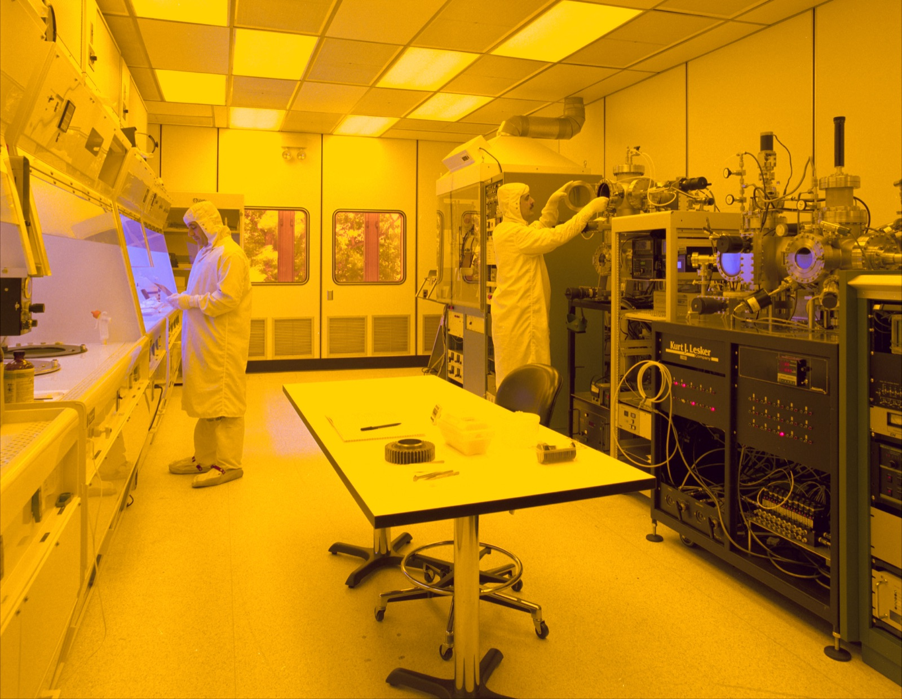

# VLA(Vision-Language-Action)란?

_피지컬 AI 모델 진화와 데이터 전략 (2026 개정판)_

## Executive Summary

> [!callout]
> **피지컬 AI(Physical AI)**는 로봇·자율주행차·스마트 공장이 실제 세계를 인지하고 행동하게 하는 기술입니다. 그 두뇌는 텍스트만 다루는 LLM에서, 시각을 더한 VLM을 거쳐, 행동까지 출력하는 **VLA(Vision-Language-Action)**로 진화했습니다. 이 글은 그 진화의 현재 지점과, 진짜 승부처가 왜 하드웨어가 아니라 데이터인지를 정리합니다.

> 초판을 발행한 2025년 말 이후, VLA는 '연구 데모'에서 **파운데이션 모델 경쟁**으로 넘어갔습니다. π0·GR00T·Gemini Robotics·Helix 같은 범용 로봇 모델이 쏟아졌고, 휴머노이드는 실험실을 나와 자동차 공장 라인에 실제로 투입됐습니다. 그런데 이 모델들은 하나같이 **수백만 건의 실로봇 조작 데이터**를 먹고 자랍니다. 초판이 세운 3대 난제, 곧 이질성·Sim-to-Real Gap·희소성은 모델이 커진 지금도 그대로 병목입니다.

> 휴머노이드가 공장 라인에 들어가는 2026년, 제조·물류·드론 기업의 질문은 하나로 모입니다. "우리 현장 데이터를 어떻게 AI가 학습 가능한 형태로 만드나." 페블러스의 [DataClinic](https://dataclinic.ai)·[Data Greenhouse](/project/DataGreenhouse/data-greenhouse-strategy/ko/)·[PebbloSim](/project/PebbloSim/pebblosim-design-strategy/ko/)은 바로 이 지점, 즉 센서 퓨전·합성데이터·에지 케이스 확보·에지 최적화를 다룹니다. 개념부터 최신 VLA 지형, 데이터 전략, 2026년 산업 동향, 그리고 8편의 심화 리포트로 이어지는 종합 가이드입니다.

<!-- stat-card -->
**🔄 **이 글은 2025년 12월 초판을 2026년 7월 기준으로 전면 개정한 버전입니다.**
                            최신 VLA 파운데이션 모델(π0·GR00T·Gemini Robotics·Helix), 휴머노이드 상용화 실측 사례, 갱신된 시장·투자 수치를 반영했습니다.
                            초판은 [보관판](../archive/2025-12/ko/)에서 그대로 확인할 수 있습니다.**

<!-- stat-card -->
**77.6%** — 로봇 '두뇌'에 몰린 투자 — 2025년 로보틱스 투자 중 하드웨어가 아닌 AI 두뇌(모델·SW)가 차지한 비중 (New Market Pitch)

<!-- stat-card -->
**100만+** — VLA 학습 로봇 궤적 — Open X-Embodiment: 21개 기관·22개 로봇의 실로봇 조작 궤적 통합 (arXiv:2310.08864)

<!-- stat-card -->
**약 60%↓** — 데이터 수집 단가 하락 — 텔레오퍼레이션 수집 단가 시간당 $340(2024)→$118~200(2026). 병목은 장비에서 품질로 이동

<!-- stat-card -->
**54%** — 중국 산업용 로봇 점유율 — 2024년 전세계 신규 설치 54.2만 대 중 중국 29.5만 대 (IFR World Robotics 2025)

## 피지컬 AI란?

지난 10년이 검색·추천·생성처럼 디지털 공간 안에서의 AI 혁명이었다면, 지금은 AI가 물리적 세계(Physical World)와 직접 상호작용하는 **피지컬 AI**의 시대입니다. 자율주행차, 휴머노이드 로봇, 스마트 팩토리, 드론, 국방 무인 체계처럼 하드웨어와 AI가 결합해 현실을 인지하고, 이해하고, 행동하는 시스템이 본격적으로 등장하고 있습니다.

> [!callout]
> **피지컬 AI(Physical AI)**는 로봇·자율주행차·스마트 공장 같은 자율 시스템이 실제 물리 세계에서 사물을 **인지(Perceive)**하고, **추론(Reason)**하며, **행동(Act)**할 수 있게 하는 기술입니다. 생성형 AI가 디지털 콘텐츠를 만드는 데 집중한다면, 피지컬 AI는 현실에서 실제로 작동하는 기계의 지능에 집중합니다.

불과 얼마 전까지 "향후 10년의 이야기"로 불렸던 이 흐름은 이미 현재형입니다. 2026년 현재, 휴머노이드 로봇은 시연 영상 단계를 지나 BMW·현대차 같은 완성차 라인에 실제로 투입되기 시작했고, 범용 로봇 파운데이션 모델은 스타트업 밸류에이션 경쟁의 중심에 섰습니다. 피지컬 AI는 더 이상 전망이 아니라, 지금 산업 현장에서 검증받고 있는 기술입니다.

*▲ 인지·판단·행동을 갖춘 휴머노이드 로봇은 피지컬 AI가 지향하는 자율 시스템의 대표적 형태입니다 (사진: 혼다 ASIMO) | Source: [Wikimedia Commons](https://commons.wikimedia.org/wiki/File:ASIMO_4.28.11.jpg)*

## 피지컬 AI 모델의 진화: LLM에서 VLA까지

피지컬 AI를 이해하려면 먼저 AI 모델이 어떻게 진화해 왔는지 알아야 합니다. **사람의 신체**에 비유하면 쉽게 잡힙니다. 뇌만 있는 단계에서 눈이 더해지고, 마침내 손발까지 갖추는 과정입니다.

### LLM (Large Language Model)

<!-- stat-card -->
**🧠** — **= 뇌(Brain)만 있는 상태** — 텍스트를 이해하고 생성하는 능력만 있습니다. 앞을 볼 수도, 움직일 수도 없습니다. — 예: ChatGPT, Claude

### VLM (Vision-Language Model)

<!-- stat-card -->
**👁️🧠** — **= 뇌 + 눈(Brain + Eyes)** — 세상을 볼 수 있고, 본 것을 설명할 수 있습니다. 하지만 직접 만지거나 조작할 수는 없습니다. — 예: GPT-4o, Claude (이미지 분석)

### VLA (Vision-Language-Action)

<!-- stat-card -->
**🤖** — **= 뇌 + 눈 + 손발(Brain + Eyes + Hands/Feet)** — 보고, 생각하고, **'행동(Action)'**까지 수행합니다. 피지컬 AI의 두뇌에 해당하며, **완성형이 아니라 지금도 빠르게 진화하는 파운데이션 모델 경쟁**의 무대입니다. — 예: π0, NVIDIA GR00T, Google Gemini Robotics, Figure Helix

세 모델의 차이를 입력·출력·현실 상호작용·학습 데이터라는 네 축으로 정리하면 아래 표처럼 한눈에 들어옵니다. 눈여겨볼 곳은 맨 아랫줄입니다. **학습 데이터가 어디서 오는가**가 VLA를 앞선 두 모델과 근본적으로 갈라놓습니다. LLM·VLM이 인터넷에 이미 쌓인 데이터를 쓰는 동안, VLA는 현장 센서와 실제 로봇 동작이라는, 세상에 아직 없는 데이터를 직접 만들어 내야 합니다.

| 구분 | LLM | VLM | VLA (피지컬 AI) |
| --- | --- | --- | --- |
| 입력 | 텍스트 | 텍스트 + 이미지 | 텍스트 + 이미지 + 센서 |
| 출력 | 텍스트 | 텍스트 | 텍스트 + 행동 명령 |
| 현실 세계 상호작용 | 불가능 | 관찰만 가능 | 직접 조작 가능 |
| 학습 데이터 | 인터넷 텍스트 | 텍스트 + 이미지 | 현장 센서 + 실로봇 동작 |

### 2.1. 최신 VLA 파운데이션 모델 지형

초판이 VLA 사례로 든 RT-2·Optimus·Isaac은 이제 출발점일 뿐입니다. 최근 1~2년 사이 여러 진영에서 **범용 로봇 파운데이션 모델**이 잇달아 공개됐습니다. 이름과 개발 주체는 달라도 관통하는 메시지는 하나입니다. 이 모델들은 전부 대규모·고품질 로봇 데이터에 종속됩니다.

| 모델 | 개발 주체 | 데이터 관점의 함의 |
| --- | --- | --- |
| π0 / π0.5 | Physical Intelligence | VLM 위에 액션 전문가를 얹은 크로스-엠바디먼트 VLA. 이질적 소스 공동학습(co-training)이 일반화의 열쇠 |
| Isaac GR00T | NVIDIA | 휴머노이드용 오픈 파운데이션 모델. 실데이터 + 합성데이터 + 웹 데이터 혼합 학습 — 합성데이터로 실데이터 부족을 메우는 대표 사례 |
| Gemini Robotics | Google DeepMind | 대형 멀티모달 기반모델을 로봇에 이식하는 흐름. 온디바이스 버전도 공개 |
| Helix | Figure AI | 온보드에서 구동하는 이중 시스템 VLA. 에지·온디바이스 추론의 실제 구현 |
| OpenVLA | Stanford 등 (오픈소스) | Open X-Embodiment로 학습한 오픈 VLA — 오픈 데이터셋 규모가 곧 성능 |
| Cosmos | NVIDIA | 피지컬 AI용 월드 파운데이션 모델(월드 모델). Sim-to-Real·합성데이터 생성 인프라 |

※ 위 모델들의 구체 아키텍처·발표 시점은 각 개발사 공식 자료 기준이며, 세부 수치는 [참고문헌](#references)에서 원출처를 확인하세요. 데이터셋 관점의 비교는 리포트 [「로봇 피지컬 AI 데이터셋 6종 비교」](/report/robot-physical-ai-datasets-landscape/ko/)에서 심화합니다.

> [!callout]
> 💡 **핵심 포인트:** LLM은 인터넷의 텍스트로 배우지만, **VLA는 로봇이 넘어진 경험, 물건을 놓친 경험** 같은 실제 물리 세계 데이터가 필요합니다. 모델이 범용화될수록 차별화는 아키텍처가 아니라 **어떤 데이터를 얼마나 확보했느냐**로 옮겨갑니다. 바로 이 점이 피지컬 AI 데이터가 특별한 이유입니다.

## 피지컬 AI의 승부처, 왜 '데이터'인가?

"피지컬 AI를 하려는데 데이터는 어떻게 해야 하지?" — 많은 기업이 이 질문 앞에서 막힙니다. ChatGPT 같은 **LLM**은 인터넷에 널린 텍스트를 학습했지만, **피지컬 AI 데이터**는 본질적으로 성격이 다릅니다. 그리고 앞서 봤듯 최신 VLA들이 전부 데이터에 종속되면서, 이 차이는 학술적 관심을 넘어 **투자와 사업의 승부처**가 됐습니다.

### 3.1. LLM 데이터 vs 피지컬 AI 데이터

같은 'AI 학습 데이터'라고 불러도, LLM이 먹는 데이터와 피지컬 AI가 먹는 데이터는 출처부터 다릅니다. 한쪽은 이미 인터넷에 쌓여 있어 크롤링으로 긁어오지만, 다른 쪽은 로봇을 현장에 내보내 센서로 직접 기록해야만 얻어집니다. 이 차이가 수집 난이도와 비용, 그리고 품질 관리의 성격을 통째로 바꿔 놓습니다.

#### 📝 LLM 학습 데이터

- •인터넷에서 대량 수집 가능 (웹 크롤링)
- •텍스트·이미지 등 단일 모달리티
- •상대적으로 수집 비용 저렴
- •시간 순서 무관한 경우가 많음

#### 🤖 피지컬 AI 학습 데이터

- •**현장에서 직접 수집** 필수
- •LiDAR·IMU·열화상 등 **멀티모달 센서 퓨전**
- •수집·가공 비용 높음
- •**시간 동기화**가 품질을 결정

### 3.2. 피지컬 AI 데이터의 3대 특수성

피지컬 AI 데이터를 다루기 어렵게 만드는 요인은 크게 세 가지로 좁혀집니다. 이질성, 현실 갭, 희소성입니다. 세 가지는 따로 노는 문제가 아니라 서로 맞물려 수집·정제 비용을 밀어 올리는 근본 원인이 됩니다. 하나씩 짚어 보겠습니다.

<!-- stat-card -->
**🔀**이질성 (Heterogeneity)**카메라·LiDAR·레이더·IMU·열화상 등 서로 다른 주기(Hz)와 형식의 센서를 융합해야 합니다. 단순 병합이 아니라 **센서 퓨전(Sensor Fusion)**이 필수입니다.**

<!-- stat-card -->
**🌉**현실 갭 (Sim-to-Real Gap)**시뮬레이션에서 생성한 **합성 데이터**와 실제 공장·도로 환경 사이에는 미세한 물리적 차이가 있습니다. 이 갭을 메우지 못하면 로봇은 현실에서 실패합니다.**

<!-- stat-card -->
**📉**희소성 (Scarcity)**인터넷에서 긁어올 수 있는 텍스트와 달리, 로봇 동작·산업 현장 센서 데이터는 **절대적으로 부족**합니다. 특히 에지 케이스(예외 상황) 데이터는 발생 빈도 자체가 낮아 수집이 극히 어렵습니다.**

### 3.3. 데이터가 곧 성능이라는 실측 증거

"데이터가 중요하다"는 말은 이제 구호가 아니라 측정된 사실입니다. 21개 기관·22개 로봇 플랫폼이 궤적을 모은 **Open X-Embodiment(OXE)**는 100만 건 넘는 실로봇 조작 데이터를 통합했고, 이 코퍼스로 학습한 모델은 단일 로봇 데이터만 쓴 모델보다 성공률이 크게 뛰었으며 학습에 없던 새 태스크에서도 눈에 띄게 잘 작동했습니다. 데이터의 **규모와 다양성**이 곧 일반화 성능으로 이어진다는 것을 보여준 결과입니다.

동시에 데이터 수집의 경제학도 빠르게 바뀌고 있습니다. 로봇에게 사람이 직접 시범을 보이는 **텔레오퍼레이션** 수집 단가는 2024년 시간당 $340 수준에서 2026년 $118~200으로 약 60% 내려갔습니다. 장비값이 떨어진 만큼 병목은 다른 곳으로 이동했습니다. 수집한 에피소드의 20~30%는 품질 필터링에서 버려지고, 숙련 오퍼레이터 한 명을 길러내는 데 1인당 $1,000~3,000이 듭니다. 즉 **병목이 '장비'에서 '숙련 오퍼레이터와 데이터 품질'로 옮겨간** 것입니다.

> [!callout]
> 💡 이 흐름은 투자에서도 드러납니다. 2025년 로보틱스 투자의 상당 부분이 로봇 몸체가 아니라 **AI '두뇌'(파운데이션 모델·범용 소프트웨어)**로 흘러들었습니다. 몸체는 상향평준화됐고, 승부는 학습 데이터의 양과 질에서 갈립니다. 기술적 난제를 실무 단계에서 어떻게 푸는지는
>                             **[「피지컬 AI 데이터 파이프라인: 4가지 핵심 난제와 해결책」](../../data-pipeline-for-physical-ai-01/ko/)**에서 센서 동기화·물리적 유효성 검증·라벨 일관성까지 확인하세요.

## 피지컬 AI의 3대 난제와 데이터의 역할

피지컬 AI가 풀어야 할 근본 과제는 **인지(Perception)**·**판단(Reasoning)**·**행동(Action)** 세 단계입니다. 각 단계마다 데이터가 결정적 역할을 합니다.

### ① 인지(Perception)의 한계

<!-- stat-card -->
**센서 노이즈, 조명 변화, 가려진 객체(Occlusion) 때문에 환경 인식 정확도가 떨어집니다. 특히 **엠바디드 AI(Embodied AI)**는 센서가 로봇 본체에 달려 있어 진동·충격 같은 물리적 간섭에도 취약합니다.**

### ② 판단(Reasoning)의 한계

<!-- stat-card -->
**학습 데이터에 없던 예외 상황(Edge Case)에서 시스템이 오작동합니다. **로보틱스 파운데이션 모델**이 주목받는 이유도, 다양한 상황에 일반화되는 판단력을 얻기 위해서입니다. NVIDIA Cosmos 같은 **월드 모델(World Model)**과 도메인 랜덤화가 이 간극을 메우는 최신 시도입니다.**

### ③ 행동(Action)의 한계

<!-- stat-card -->
**로봇 관절의 백래시(Backlash)·마찰·탄성 같은 물리 특성이 제어 정확도에 영향을 줍니다. 시뮬레이션에서 완벽했던 모션이 실제 로봇에서 실패하는 이유이며, 결국 실제 동작 데이터로 보정해야 합니다.**

*▲ 로봇 관절의 물리 특성은 시뮬레이션만으로 완벽히 재현되지 않아, 결국 실제 동작 데이터로 보정해야 합니다 | Source: [Wikimedia Commons](https://commons.wikimedia.org/wiki/File:Robotic_Arm_Polishing_Guitars_at_Martin_Guitar_Factory.jpg)*

> [!callout]
> 🎯 결론: 피지컬 AI의 모든 난제는 결국 **"AI-Ready Data"**의 확보로 귀결됩니다. 이 문제를 국가 차원에서 어떻게 풀려 하는지는
>                             **[「피지컬 AI와 데이터 중심 AI 스타트업의 국가 전략적 가치」](../../data-startup-physical-ai-01/ko/)**에서 데이터 얼라이언스·바우처 정책과 함께 확인하세요.

## 데이터 품질이 곧 안전(Safety)입니다

휴머노이드가 실험실을 나와 실제 공장 라인에 서게 되면서, 안전은 이론이 아니라 실전 문제가 됐습니다. 사람과 같은 공간에서 무거운 부품을 다루는 로봇에게 오작동은 곧 사고입니다. **Gartner(2025)**가 피지컬 AI 파트너를 고를 때 **'안전성 공학(Safety Engineering)'**·**'AI 레드티밍'**·**'시뮬레이션 검증'** 수행 여부를 핵심 평가 요소로 꼽은 이유입니다.

### AI 레드티밍 & 시뮬레이션 검증

<!-- stat-card -->
**🛡️** — Gartner는 안전성 보장을 위해 **AI 레드티밍**(모의 취약점 검증)과 **대규모 시뮬레이션 테스트**를 필수 요건으로 제시합니다. 실제 배포 전 수천 가지 에지 케이스 시나리오를 돌려봐야 합니다.

### 에지 케이스(Edge Case) 데이터

<!-- stat-card -->
**⚠️** — 사고를 부를 수 있는 **예외 상황** 데이터는 발생 빈도가 극히 낮아 수집이 어렵습니다. 하지만 이 데이터가 없으면 로봇은 예상치 못한 상황에서 **치명적 오류**를 냅니다.

> [!callout]
> 🛡️ **페블러스 DataClinic의 역할:** 희소한 **에지 케이스** 데이터를 체계적으로 생성·검증해, 고객사의 AI 모델이 현장에서 **안전하게 작동**하도록 보장합니다. 시뮬레이션과 실제 환경 데이터를 융합하는 **Safety-by-Design** 접근으로, 로봇이 공장에 들어가기 전에 위험을 데이터 단계에서 걸러냅니다.

## 2026년 피지컬 AI 동향

2026년은 피지컬 AI가 실험실을 넘어 산업 현장에 본격 투입되는 전환점입니다. 초판이 강조한 것이 시장 규모였다면, 지금 더 또렷한 신호는 **돈의 방향**과 **휴머노이드의 실투입**입니다. 시장 규모 자체는 정의에 따라 편차가 20~100배에 이르지만, 모든 리포트가 **연평균 32~47%의 고성장**에는 한목소리를 냅니다. 그러니 단일 숫자보다 실측 가능한 투자·설치·가격 데이터를 보는 편이 정확합니다.

*▲ NVIDIA는 CES 2025 키노트에서 "인지 AI → 생성 AI → 에이전틱 AI → 피지컬 AI(자율주행·범용 로보틱스)"로 이어지는 진화 축을 제시했습니다 | Source: [Wikimedia Commons](https://commons.wikimedia.org/wiki/File:Jensen_Huang_-_Nvidia_Keynote_-_CES_2025_Las_Vegas_(1).jpg)*

### 6.1. 투자는 '두뇌'로 몰린다

2025년 로보틱스 투자는 2021년 최고치를 넘어섰고, 2026년 상반기에 이미 전년 실적에 근접했습니다. 집계 표본에 따라 총액은 다르게 잡히지만, 방향은 분명합니다. 자본은 로봇 몸체가 아니라 **AI 두뇌(파운데이션 모델·범용 소프트웨어)**로 쏠립니다. 개별 기업 밸류에이션도 이를 뒷받침합니다. VLA 모델을 만드는 Physical Intelligence가 수조 원대 가치를 인정받았고, 휴머노이드 기업 Figure AI, 로보틱스 AI의 Skild AI가 잇달아 대형 라운드를 마감했습니다. "몸이 아니라 두뇌"라는 이 흐름이 곧 **"피지컬 AI = 데이터 문제"**의 시장 버전입니다.

### 6.2. 휴머노이드, 공장 라인에 서다

가장 상징적인 장면은 공장입니다. **Figure 02**는 BMW의 미국 스파턴버그 공장에 배치돼 약 11개월간 시트메탈 부품 적재 작업에 투입됐고, 9만 개 넘는 부품을 옮기며 높은 배치 정확도를 기록했다고 보고됐습니다. 다만 과열된 기대와 실적은 구분해야 합니다. **Tesla Optimus**는 연 5만~10만 대 생산을 목표로 내세웠지만, 2026년 중반 기준 공식 양산 실적은 사실상 없습니다. **'계획'과 '실적'을 섞어 읽으면 시장을 오판**하게 됩니다. 한국에서는 현대차가 CES 2026에서 완전 전기구동 아틀라스를 공개했고, 삼성전자–레인보우로보틱스의 RB-Y1이 쿠팡 물류센터 실증에 투입됐습니다.

### 6.3. 한국: 정책과 대기업 투자가 구체화됐다

한국의 움직임도 초판 때보다 훨씬 구체적입니다. 2026년 정부 R&D 예산은 약 35.5조 원으로 늘었고, 그중 AI 분야는 전년 대비 3배 수준인 약 9.9조 원으로 확대됐습니다(피지컬 AI 전용 예산은 아니며, AI 전반을 포함합니다). 정부는 **(가칭) 물리적 AI 구축·확산 전략**을 2026년 상반기 수립할 예정이고, 산업계에서는 현대차그룹이 2026~2030년 AI·로봇에 대규모 투자를 예고했으며, **K-휴머노이드 연합**은 2030년까지 1조 원 이상 투자와 로봇 AI 파운데이션 모델 개발을 목표로 내걸었습니다.

> [!callout]
> 📌 **중국 점유율은 카테고리를 구분해야 합니다.** **산업용 로봇 전체** 기준 중국의 글로벌 신규 설치 점유율은 2024년 54%로 확정됐고(IFR), 자국산 브랜드 비중도 47%→57%로 올랐습니다. 반면 **휴머노이드 로봇** 한정 점유율은 78~90%까지 다르게 보고되는데, 이는 산업용 로봇과 다른 카테고리이며 출처마다 산식이 다릅니다. 두 수치를 섞으면 잘못된 결론에 이릅니다.

### 주요 트렌드

앞서 본 투자·상용화·정책의 흐름을 실무자 관점의 트렌드로 추리면 다음 여섯 가지로 모입니다. 여섯 갈래처럼 보이지만 실은 하나의 축을 공유합니다. 어느 쪽을 따라가도 결국 '어떤 데이터를 얼마나 확보하느냐'라는 질문으로 돌아온다는 점입니다.

<!-- stat-card -->
**🧠**VLA 파운데이션 모델 경쟁**π0·GR00T·Gemini Robotics·Helix 등 범용 로봇 모델이 스타트업 투자 경쟁의 중심에 섰습니다. 차별화의 축은 아키텍처에서 학습 데이터로 이동 중입니다.**

<!-- stat-card -->
**🦾**휴머노이드 상용화**Figure×BMW처럼 실제 공장 라인 투입 사례가 등장했습니다. 다만 계획과 실적의 괴리(예: Tesla Optimus)를 팩트체크해 읽어야 합니다.**

<!-- stat-card -->
**🏭**AI 자율제조의 부상**현장 데이터를 수집·분석해 공정 자체를 스스로 개선하는 시스템. 삼성전자 평택, SK하이닉스 이천 등 국내 반도체 공장도 도입을 검토 중입니다.**

<!-- stat-card -->
**🤖**범용 로봇(Generalist Robotics)**고정 기능 로봇에서 VLA 기반 적응형 시스템으로 전환. 현대차그룹의 보스턴다이내믹스가 Spot·Atlas로 선도합니다.**

<!-- stat-card -->
**🔗**디지털 트윈과 시뮬레이션**NVIDIA Omniverse·Cosmos를 활용한 공장 디지털 트윈과 합성데이터 생성이 확대되고 있습니다. [디지털트윈×피지컬AI 리포트](../../digital-twin-physical-ai-market/ko/)에서 시장 교차점을 다룹니다.**

<!-- stat-card -->
**📊**피지컬 AI 데이터 파이프라인**로봇·자율주행·비전 AI용 데이터 수집·정제·검증 파이프라인 구축이 가속화됩니다. 데이터 인프라 자체가 전략 자산이 됩니다.**

## 페블러스의 피지컬 AI 솔루션

<!-- stat-card -->
****[페블러스(Pebblous)](https://pebblous.ai)**는 제조 현장의 데이터를 AI가 학습 가능한 형태로 바꾸는 **AI-Ready Data** 솔루션을 제공합니다. 앞서 봤듯 최신 VLA의 병목은 장비가 아니라 데이터 품질과 숙련 오퍼레이터입니다. 페블러스의 **DataClinic**은 바로 이 지점에서, 센서 데이터·3D 환경 데이터·로봇 동작 데이터를 체계적으로 수집·정제·라벨링해 모델 성능을 끌어올립니다.** — **[Data Greenhouse](/project/DataGreenhouse/data-greenhouse-strategy/ko/)**는 합성데이터 생성부터 품질 진단·라벨링·배포까지 하나의 파이프라인으로 통합한 **자율형 데이터 운영 인프라**로, 대규모 시뮬레이션 데이터를 자동으로 경작·관리합니다. **[PebbloSim](/project/PebbloSim/pebblosim-design-strategy/ko/)**은 물리 법칙을 정확히 복제한 시뮬레이션 환경에서 합성데이터를 생성해, Sim-to-Real Gap을 줄이고 실제로는 얻기 힘든 **에지 케이스 데이터**를 안전하게 만들어냅니다.

*▲ 격자형 궤도 위를 오가는 자율주행 로봇들 — 이런 현장에서 쏟아지는 로봇 동작·센서 데이터를 수집·정제하는 것이 DataClinic의 역할입니다 | Source: [Wikimedia Commons](https://commons.wikimedia.org/wiki/File:Ocado_warehouse_bots.jpg)*

### 7.1. 에지(Edge) 인프라 최적화

피지컬 AI는 클라우드가 아니라 **로봇 내부(On-device)**에서 실시간으로 작동해야 합니다. Gartner는 **'에지·온디바이스 추론'**과 **'고효율 모델(Hyperefficient models)'**을 피지컬 AI 스타트업의 핵심 역량으로 꼽습니다. 실제로 에지 AI 추론은 이미 관련 하드웨어 물량의 대부분을 차지할 만큼 현실 병목이 됐고, Figure Helix처럼 온보드에서 구동하는 VLA가 이 방향을 앞서 보여줍니다.

#### Low Latency

<!-- stat-card -->
**⏱️** — 통신 지연 없는 실시간 처리가 생명

#### Lightweight Data

<!-- stat-card -->
**📦** — 제한된 컴퓨팅 자원에 맞춘 데이터 경량화

#### On-device AI

<!-- stat-card -->
**🤖** — 로봇 자체에서 추론하는 자율 시스템

> [!callout]
> ⚡ **페블러스의 데이터 최적화:** 로봇의 제한된 컴퓨팅 자원에 맞춰 데이터를 **최적화**해, 가볍고 빠른 모델 학습을 지원합니다. 클라우드 의존도를 낮추고 **에지 디바이스에서의 고효율 추론**이 가능하도록 데이터 파이프라인을 설계합니다.

## 산업별 적용 사례

Gartner는 **'산업별 특화 경험(Vertical Specialization)'**과 구체적 사용 사례를 제시하는 기업이 고객의 **가치 창출 시간(Time-to-Value)**을 앞당긴다고 분석합니다. 페블러스 솔루션이 어디에 쓰이는지, 구체적 장면으로 살펴봅니다.

*▲ 삼성전자·SK하이닉스 같은 반도체 공정에서는 비전 센서 데이터를 융합해 미세 결함을 실시간으로 감지하는 AI 검사 시스템이 적용됩니다 | Source: [Wikimedia Commons](https://commons.wikimedia.org/wiki/File:Clean_room.jpg)*

### 자율 제조 (Autonomous Manufacturing)

<!-- stat-card -->
**🏭** — 비전 센서 데이터를 융합해 **불량품을 실시간으로 감지**하고 로봇 팔을 미세 조정합니다. 삼성전자·SK하이닉스 등 반도체 공정에서 미세 결함을 잡아내는 AI 검사 시스템에 적용됩니다. — 비전 검사로봇 팔 제어품질 관리

### 물류 / 이송 (Logistics & Transport)

<!-- stat-card -->
**📦** — **시뮬레이션 데이터**로 물류 로봇의 충돌 방지와 경로 최적화를 학습합니다. 실제로 삼성전자–레인보우로보틱스의 양팔 로봇 **RB-Y1**이 쿠팡 물류센터 실증에 투입됐고, 대형 물류센터의 AGV/AMR이 수천 개 패키지를 자율 이송하는 시스템에 적용됩니다. — AMR/AGV경로 최적화충돌 방지

### 특수 목적 드론 (Specialized Drones)

<!-- stat-card -->
**🚁** — **악천후·통신 음영 지역(에지 환경)**에서의 자율 비행 데이터 처리를 지원합니다. 송전탑 점검, 농업 방제, 재난 현장 정찰처럼 클라우드 연결이 끊긴 곳에서 스스로 판단해야 하는 미션에 적용됩니다. — 오프라인 추론악천후 비행시설물 점검

> [!callout]
> 🎯 **Vertical Specialization:** 페블러스는 각 산업의 특수한 요구를 이해하고 **도메인 특화 데이터 파이프라인**을 구축해 고객사의 Time-to-Value를 단축합니다. 귀사의 피지컬 AI 프로젝트가 있다면 [문의하기](https://pebblous.ai/contact).

## 페블러스가 피지컬 AI에 주목하는 이유

지금까지의 이야기는 결국 한 문장으로 모입니다. **피지컬 AI의 경쟁은 하드웨어가 아니라 데이터에서 갈린다.** 이 명제가 페블러스가 이 영역을 계속 지켜보는 이유이자, 사업의 출발점입니다.

### 데이터가 승부처라는 것을 시장이 돈으로 증명하고 있다

2025~2026년의 신세대 VLA(π0·GR00T 등)가 전부 대규모 크로스-엠바디먼트 데이터에 종속된다는 사실, 그리고 투자가 몸체가 아니라 두뇌로 쏠린다는 흐름은 "피지컬 AI = 데이터 문제"라는 주장을 자본이 대신 증언하는 셈입니다.

### 난제는 여전히 '데이터 품질'로 귀결된다

3대 난제(이질성·Sim-to-Real·희소성)는 모델이 커진 지금도 그대로 병목입니다. 월드 모델·합성데이터·도메인 랜덤화의 발전도 결국 "어떤 데이터를 얼마나 정제해 넣느냐"의 문제로 수렴합니다. 텔레오퍼레이션 병목이 장비에서 숙련 오퍼레이터·품질로 옮겨갔다는 신규 경제성 데이터가, 데이터 **진단과 경작**이라는 페블러스의 접근을 실측으로 재확인해 줍니다.

### 고객의 실무 질문은 하나로 모인다

휴머노이드가 완성차 라인에 들어가는 지금, 제조·물류·드론 고객은 "우리 현장 데이터를 어떻게 AI-Ready로 만드나"라는 질문에 직면합니다. [DataClinic](https://dataclinic.ai)(진단)·[Data Greenhouse](/project/DataGreenhouse/data-greenhouse-strategy/ko/)(경작)·[PebbloSim](/project/PebbloSim/pebblosim-design-strategy/ko/)(합성·에지 케이스)이 그 단계마다의 답이며, 이 허브는 질문의 입구입니다.

### 흩어진 논의를 한자리에 모은다

이 페이지는 개념 정의부터 최신 VLA 지형, 데이터 전략, 산업 동향, 그리고 8편의 심화 리포트까지를 잇는 관문입니다. 피지컬 AI 데이터 담론을 한곳에서 따라갈 수 있도록 정리하는 것, 그것이 이 글을 2026년 기준으로 다시 쓴 이유입니다.

## 피지컬 AI 리포트

아래 8편의 심화 리포트는 피지컬 AI의 데이터 전략, 산업 적용, 글로벌·한국 경쟁 구도, 그리고 핵심 데이터셋을 각각 깊게 다룹니다. 이 허브에서 관심 주제로 바로 들어가세요.

### 📄 피지컬 AI 시대의 도래: 제조 혁신을 위한 데이터 전략

데이터 파이프라인 구축의 핵심 요구사항과 글로벌 선도 기업 동향.

[../../data-pipeline-for-physical-ai-01/ko/](../../data-pipeline-for-physical-ai-01/ko/)

### 📄 피지컬 AI와 데이터 중심 AI 스타트업의 국가 전략적 가치

데이터 중심 스타트업의 전략적 가치와 국가 경쟁력에의 영향.

[../../data-startup-physical-ai-01/ko/](../../data-startup-physical-ai-01/ko/)

### 📄 피지컬 AI 시대의 패권 경쟁: 데이터 중심 생존 전략

3대 데이터 장벽, GICO 개념, 10대 핵심 역량 평가 프레임워크.

[../../physical-ai-competition-strategy/ko/](../../physical-ai-competition-strategy/ko/)

### 📄 피지컬 AI 데이터 인프라의 전략적 기회

데이터 인프라 계층에서 열리는 사업 기회와 포지셔닝 전략.

[../../physical-ai-data-infra-strategy/ko/](../../physical-ai-data-infra-strategy/ko/)

### 📄 디지털트윈 × 피지컬AI: 두 거대 시장의 교차점

디지털트윈과 피지컬 AI가 만나는 지점에서 찾는 기회.

[../../digital-twin-physical-ai-market/ko/](../../digital-twin-physical-ai-market/ko/)

### 📄 한국 1,350조 피지컬 AI 투자, 예산에 없는 로봇 경험 데이터

대규모 투자 계획과 정작 비어 있는 로봇 경험 데이터의 간극.

[/report/korea-880-trillion-physical-ai-data-gap/ko/](/report/korea-880-trillion-physical-ai-data-gap/ko/)

### 📄 피지컬 AI 행동 데이터: 한국이 트레이닝센터부터 짓는 이유

행동 데이터 확보를 위한 트레이닝센터 전략의 배경.

[/report/korea-physical-ai-behavior-data/ko/](/report/korea-physical-ai-behavior-data/ko/)

### 📄 로봇 피지컬 AI 데이터셋 6종 비교

DROID·OXE·GR00T·RoboCasa·MimicGen·LIBERO를 데이터 관점에서 비교.

[/report/robot-physical-ai-datasets-landscape/ko/](/report/robot-physical-ai-datasets-landscape/ko/)

## 참고문헌 (References)

### 학술

- 1.Open X-Embodiment Collaboration (2023). "Open X-Embodiment: Robotic Learning Datasets and RT-X Models." arXiv:2310.08864. [링크](https://arxiv.org/abs/2310.08864)
- 2.Physical Intelligence. "π0 / π0.5" 기술 보고서 및 공식 블로그. [링크](https://www.physicalintelligence.company/)
- 3.NVIDIA. "Isaac GR00T — Foundation Model for Humanoid Robots." [링크](https://developer.nvidia.com/isaac/gr00t)
- 4.Google DeepMind. "Gemini Robotics." [링크](https://deepmind.google/discover/blog/gemini-robotics/)
- 5.Figure AI. "Helix — A Vision-Language-Action Model." [링크](https://www.figure.ai/)

### 정책 · 통계 · 시장

- 6.IFR (2025). _World Robotics 2025_ — 2024년 실적, 중국 54%·전 세계 460만+ 가동. [링크](https://ifr.org)
- 7.Gartner (2025). "Top Strategic Technology Trends for 2026" — Physical AI, AI TRiSM. [링크](https://www.gartner.com/en/newsroom/press-releases/2025-10-20-gartner-identifies-the-top-strategic-technology-trends-for-2026)
- 8.New Market Pitch (2025). "Physical AI Funding" — 투자의 77.6%가 AI 두뇌(SW·모델)에 집중. [링크](https://newmarketpitch.com)
- 9.Goldman Sachs (2025-01). "Humanoid robots market — $38B by 2035." [링크](https://www.goldmansachs.com/insights)
- 10.과학기술정보통신부 (2026). "인공지능 기본계획 2026–2028" 및 (가칭) 물리적 AI 구축·확산 전략. [링크](https://www.msit.go.kr)
- 11.NVIDIA (2025). "CES 2025: Jensen Huang on Physical AI." [링크](https://blogs.nvidia.com/blog/ces-2025-jensen-huang/)

### 페블러스 인접

- 12.페블러스 블로그 (2025). "피지컬 AI 데이터 파이프라인: 제조 혁신을 위한 AI-Ready 데이터 전략." [링크](../../data-pipeline-for-physical-ai-01/ko/)
- 13.페블러스 블로그 (2025). "피지컬 AI와 데이터 중심 AI 스타트업의 국가 전략적 가치." [링크](../../data-startup-physical-ai-01/ko/)
- 14.Pebblous (2026). "세계 모델이란 무엇일까? 20억 원 손실을 막는 AI의 조건." Data Clinic Blog. [링크](https://blog.dataclinic.ai/world-model/)

※ 시장 규모 수치는 리서치 기관별로 정의 편차(최대 100배)가 큽니다. 본문의 시장 관련 수치는 특정 단일 출처의 단언이 아니라 추세로 읽어 주세요.

> [!callout]
> 📚 피지컬 AI 시리즈

> 이 글은 [피지컬 AI 허브](/project/PhysicalAI/ko/)에 소개된 시리즈의 관문 페이지입니다.
>                         시장 분석, 데이터 파이프라인, 경쟁 전략, 디지털트윈, 한국 전략 등 심화 리포트를 허브에서 확인하세요.
