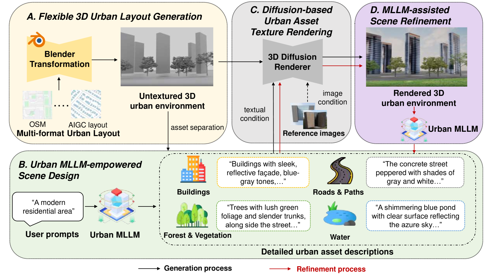
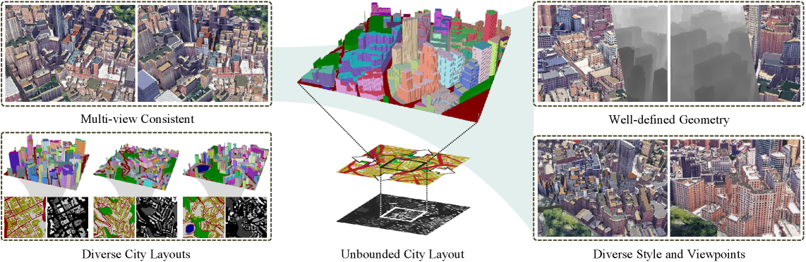
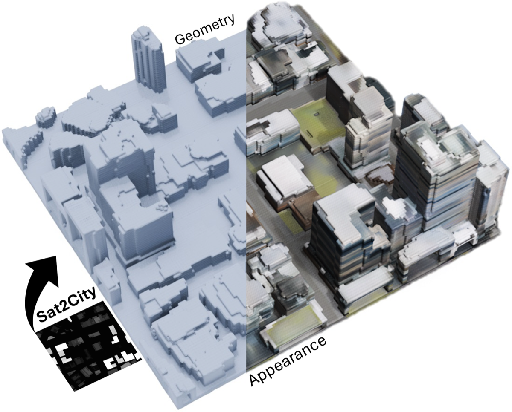

# Should We Score Spatial AI?

_Five evaluation criteria from PebbloSim_

## Executive Summary

> [!callout]
> In September 2024, Fei-Fei Li founded World Labs with a $230M seed round. By November 2025, the company shipped Marble and crossed $1B in cumulative funding. In parallel, STF Labs (Studio Tim Fu) released UrbanGPT 2.0 Beta — generating 3D city layouts from natural language — and HKUST's Sat2City presented an ICCV 2025 model that reconstructs 3D cities from a single satellite image. AI urban planning is projected to grow from $2.26B in 2025 to $13.60B by 2035 (CAGR 19.65%), and Geospatial AI from $38B to $64.6B by 2030 (CAGR 9.25%). Yet there is no industry consensus on how to measure the quality of these outputs — the 3D city models, metadata, and scenarios that come out of these systems. **The standard for scoring Spatial AI is missing.**

> Pebblous **proposes five evaluation criteria** from the perspective of PebbloSim — our simulation engine for synthesizing urban, traffic, and environmental data. **(1) Geographic Coherence** — do coordinates and scale align with real geography? **(2) Scale Consistency** — are the proportions of buildings, roads, and vegetation realistic? **(3) GFA Validation** — do Floor Area Ratio and lot coverage comply with regulations? **(4) Scenario Coverage** — how much variation does a single seed produce? **(5) Sim-to-Real Gap** — how distant is the synthetic output from real city data (Chamfer, MMD, EMD, Fréchet Distance)? These five sit at the intersection of academic priors and industry gaps. Scenario coverage and Sim-to-Real gap have been quantified by academia (UrbanWorld's Homogeneity Index, HiFi DT's 4-metric package). Scale consistency can extend CityDreamer's Depth/Camera Error with urban sub-metrics. Geographic coherence and GFA validation are open academic territory — defining them becomes a contribution in itself.

> Among the ten major players surveyed in this report — STF Labs, World Labs, Cesium AI, Esri GeoAI, Mapbox MapGPT, NVIDIA Omniverse, Bentley iTwin, Autodesk Forma, TestFit, Hypar — only Esri publishes a quality validation methodology for its own AI outputs (the ISO 23894-aligned "Trusted AI" guide). The other nine excel at automation and generation but stay silent on "how outputs are verified." As ISO/IEC 5259-4 became an EU standard (EN ISO/IEC 5259-4:2025) in February 2025, the data quality conversation is poised to expand from LLMs into Spatial AI. **The team that proposes an evaluation framework first earns a seat at the standards table.** Pebblous offers this report as a first step.

<!-- stat-card -->
**$13.6B** — AI Urban Planning 2035 — CAGR 19.65% (Metatech)

<!-- stat-card -->
**$64.6B** — Geospatial AI 2030 — CAGR 9.25% (Arizton)

<!-- stat-card -->
**10** — Major Players — STF, World, Esri, etc.

<!-- stat-card -->
**1/10** — Disclose Evaluation — Only Esri publishes

<!-- stat-card -->
**5** — Pebblous Criteria — Geo, Scale, GFA, Coverage, Gap

## The Rise of Spatial AI — UrbanGPT as a Case Study

"Spatial AI" effectively became a new category between 2024 and 2025. In September 2024, Stanford's Fei-Fei Li founded World Labs with a $230M seed round. By November 2025, the company released Marble and crossed $1B in cumulative funding. World Labs framed the thesis bluntly: "Spatial Intelligence is the next frontier of AI, rivaling and complementing language intelligence." The conceptual foundation traces back to Andrew Davison of Imperial College, who defined Spatial AI in his 2018–2019 FutureMapping essays as the evolution of SLAM — a system that perceives, models, reasons, and acts on space in an integrated loop. That academic framing has now been absorbed as an industry term.

### 1.1. Five Concurrent Signals

Throughout 2025, tools and papers following the same pattern — natural language to 3D spatial structure — appeared in rapid succession. Within the same category, however, the tools differ in flavor. World Labs Marble focuses on navigable environments. STF Labs UrbanGPT 2.0 is specialized for urban and architectural domains, handling GFA and FAR (Floor Area Ratio). Sat2City reconstructs cities from satellite imagery alone. Cesium and Esri layer AI on top of established GIS infrastructure.

| Platform | Launch | Core Capability | Evaluation Methodology Disclosure |
| --- | --- | --- | --- |
| STF Labs UrbanGPT 2.0 Beta | Early 2026 | NL → 3D city layout, automatic GFA optimization | ⚪ None (qualitative claims only) |
| World Labs Marble | 2025-11 | Text/Image → navigable 3D (Chisel UI) | ⚪ Official metrics not disclosed |
| HKUST AI4City Sat2City | ICCV 2025 | Single satellite image → 3D city (cascaded latent diffusion) | ✅ Academic metrics disclosed (Chamfer 100%, EMD 60% COV) |
| Cesium ion + AI (Bentley) | 2025-07 | 3D geospatial + Gaussian Splatting + AI detectors | △ Partial per detector |
| Esri ArcGIS AI Assistant | 2025-10 | GIS + LLM Assistant (Arcade, Business Analyst) | ✅ Trusted AI official guide, ISO 23894 aligned |

### 1.2. Market Numbers — Three Sources Pointing the Same Way

Three market research firms cover different slices but point in the same direction. AI urban planning is projected to grow from $2.26B in 2025 to $13.60B by 2035 at CAGR 19.65% (Metatech Insights). Geospatial AI is forecast to expand from $38B in 2024 to $64.6B by 2030 at CAGR 9.25% (Arizton), while the broader Geospatial Intelligence market reaches $62.88B by 2030 (MarketsandMarkets). What began as a narrow category — natural-language-to-3D generation — is expanding across GIS, digital twins, and urban planning as a whole.

### 1.3. ⚠️ UrbanGPT Namesake Disclaimer

> [!callout]
> **The UrbanGPT discussed in this report is STF Labs UrbanGPT 2.0 Beta** (natural language → 3D city layout). Do not confuse it with the unrelated **HKUDS UrbanGPT** (KDD'2024, a joint HKUST·SCUT·Baidu project on spatio-temporal LLMs). HKUDS UrbanGPT is not a 3D generation model — it is a spatio-temporal predictor for traffic, population, and environmental signals (arXiv:2403.00813). Same name, different purpose, different outputs, different evaluation metrics — two separate projects.

### 1.4. STF Labs UrbanGPT 2.0 — Public Information

STF Labs (Studio Tim Fu) is a London-based RIBA and ARB-registered architecture studio founded by Tim Fu. UrbanGPT 2.0 Beta combines GPT-4o (language layer) with real-time diffusion (spatial generation) and Rhino/Grasshopper (precision geometry) to generate cities from natural language. A prompt such as "70% residential, 30% commercial, FAR 450%" returns a 3D city layout along with automatic GFA optimization. Disclosed partners include NVIDIA and Lenovo, and the STF Labs roadmap states a clear direction: "integrate real-world city data → move from form-generation to spatial decision-making."

However, **the evaluation methodology is not disclosed**. The Beta announcement consists of qualitative phrases like "production workflow integration, reaching stability and precision," with no public quantitative benchmark, evaluation dataset, or baseline comparison. The phrase "automatic GFA calculation" appears, but the underlying regulatory database and algorithm are unspecified. This information asymmetry is the starting point of the present report.

*▲ The standard Spatial AI pipeline — from natural language to urban assets to 3D environments (UrbanWorld diagram). STF Labs UrbanGPT 2.0 follows the same shape. | Source: [UrbanWorld (arXiv:2407.11965)](https://arxiv.org/abs/2407.11965)*

## Why Evaluation Is Hard

A Spatial AI output has three dimensions: **(1) the 3D model** (geometry of buildings, roads, and vegetation), **(2) metadata** (coordinate system, GFA, FAR, zoning), and **(3) scenarios** (population, traffic, and environmental simulation inputs). All three must be coherent for the output to qualify as a "usable urban design proposal." Yet existing LLM benchmarks (MMLU, HELM, MMBench) measure only the accuracy and consistency of text outputs. 3D geometry, coordinate systems, regulatory conflicts, and the validity of simulation inputs sit outside their measurement scope.

### 2.1. The Academic Diagnosis — "Reliance on Human Evaluation"

In 2024, researchers from Tsinghua and SJTU published **T3Bench** (arXiv:2310.02977), formally diagnosing that Text-to-3D evaluation has "largely relied on subjective user experiments." T3Bench's Quality metric reaches a Spearman correlation of **0.784** with human ratings (via ImageReward), and Alignment reaches **0.780** (via GPT-4) — strong, but still not a single automatic metric that closes the loop. The concurrent **3D Scene Generation Survey** (arXiv:2505.05474, S-Lab NTU) summarized the same consensus: "no single metric performs consistently across all datasets." Even SOTA models like CityDreamer (CVPR 2024) rely on user studies of N=20 with 1–5 scales. Industry and academia stand on the same blank space.

> [!callout]
> The T3Bench authors put it plainly: "Text-to-3D evaluation has so far largely depended on subjective user experiments." Automated metrics now correlate with human judgment at 0.78 — impressive, but still incapable of answering the questions that matter: _Does this city comply with regulations? How far is it from ground truth?_

### 2.2. "Visually Plausible ≠ Usable"

The UrbanWorld authors (arXiv:2407.11965) identified the central weakness of their own model: "homogeneous styles, limited diversity." A city that looks plausible but produces near-identical variants regardless of seed is unusable for decision-making in urban planning. Even a halving of distribution distance from **FID 213.56** (SceneDreamer) to **97.38** (CityDreamer) in just one year does not guarantee usability. The gap between visual plausibility and operational applicability remains large.

### 2.3. The Standards Lag

ISO/IEC 23894:2023 (AI risk management) and the ISO/IEC 5259 series (data quality — 5259-4 published 2024-07, adopted as the EU standard EN ISO/IEC 5259-4:2025 in February 2025) are starting to apply to LLMs. They have **not yet been applied to 3D spatial outputs**. Esri's Trusted AI guide centers on GIS analysis workflows, leaving natural-language-to-3D generation blank. ISO 23247 (digital twins) is manufacturing-centric and requires complementary standards (such as ITU T-REC-Y.3090) to apply to urban use cases. OGC CityGML 3.0 reached its conceptual model in 2021, and implementation accelerated in 2025 with 3DCityDB v5 — but a formalized role as "Spatial AI output validation" has not yet emerged. The gap between standards and technology runs roughly 2–3 years.

## Five Evaluation Criteria Proposed by Pebblous

These five criteria are an evaluation framework that Pebblous **proposes** from the PebbloSim perspective. They are not standards we operate today; they are a **hypothetical proposal** meant to fill the Spatial AI evaluation gap. The five are derived from the intersection of metrics that academia has partially formalized and validation dimensions that industry has left empty. For each criterion we provide the definition, measurement approach, academic priors, and the distinctive contribution Pebblous proposes.

### 3.1. Geographic Coherence

This criterion asks whether the coordinates, scale, and road topology of the generated city align with real geography (GIS, satellite imagery). When the prompt specifies, for example, "Lower Manhattan, 700,000 m²," does the output match the actual GIS polygon, area, and road network topology to a reasonable degree?

- Coordinate IoU of generated layout vs real GIS polygon
- Road network topology matching (graph isomorphism)
- Satellite alignment (Sentinel-1/2 cross-reference)

<!-- stat-card -->
**Measurement (Proposed)** — Academic Prior — **Largely absent — a new territory.** Adjacent work exists in GeoAI / remote sensing, e.g., RemoteBAGEL (which adds GPT-4o "geographically plausible" judgments on top of FID) and RSWISE (which reflects geospatial alignment better than FID), but neither has been formalized as GIS-grounded validation for Spatial AI outputs. — Pebblous's Proposed Contribution — Standardize a checklist that cross-references GIS data with satellite imagery. Once defined, the criterion itself becomes a fresh academic contribution.

### 3.2. Scale Consistency

This criterion measures whether the relative proportions of building heights, road widths, vegetation density, and block sizes match urban reality. A 30-story single-family home appearing in a low-rise residential district is visually plausible but contextually wrong. We quantify the statistical distance between the generated distribution and the city-specific reference distribution.

- Depth Error (DE) — estimated depth vs pseudo-GT
- Camera Error (CE) — inference vs COLMAP camera trajectory
- Urban sub-metrics — building height distribution / road width ratios / vegetation footprint

<!-- stat-card -->
**Measurement (Proposed)** — Academic Prior — **Rich.** CityDreamer (CVPR 2024) and UrbanWorld (2024) treat DE and CE as standard. CityDreamer reports DE 0.147 / CE 0.060; UrbanWorld improves DE by 44.2% over CityDreamer. GPTEval3D (arXiv:2401.04092) has a "Geometry Plausibility" axis, and 3DGen-Bench (arXiv:2503.21745) splits the same concept into "Geometry Plausibility" and "Geometry Details" — both map directly to this criterion. — Pebblous's Proposed Contribution — Extend with urban-domain sub-metrics. Concrete quantitative claims become possible — e.g., "building height distribution is significant under a KS test against district X."

*▲ CityDreamer visualizes the foundational signals for Scale Consistency — segmentation masks, depth estimation, and multi-view rendering. | Source: [CityDreamer (CVPR 2024, arXiv:2309.00610)](https://arxiv.org/abs/2309.00610)*

### 3.3. GFA Validation (Gross Floor Area)

This criterion auto-verifies whether the generated city's FAR, lot coverage, and zoning distribution comply with regulations. When UrbanGPT 2.0 receives "FAR 450%" as a prompt, two questions follow: does the actual sum of building footprint × number of floors really reach FAR 450%, and is FAR 450% permitted under the zoning code of that lot? In B2B and regulated environments, this criterion delivers the most immediate value.

- Building footprint extraction (IoU, F1, Jaccard — Nature Sci Rep 2024)
- Building height estimation (MSE — Sentinel-1/2 based, ScienceDirect 2023)
- **Conflict checks against a regulatory rule engine** (new Pebblous proposal)

<!-- stat-card -->
**Measurement (Proposed)** — Academic / Industry Prior — Footprint extraction and height regression are active areas in GeoAI, but **automated regulatory validation of generated outputs has no academic prior**. In industry, Autodesk Forma (formerly Spacemaker), TestFit, and Hypar are strong at automated generation but do not publish ML evaluation metrics. Even STF Labs UrbanGPT 2.0 only states "automatic GFA calculation" without specifying which regulatory database or which algorithm. — Pebblous's Proposed Contribution — An auto-validation checklist tied to a regulatory database. **An immediate differentiator for B2B and regulated deployments.** Publishing the methodology builds trust.

### 3.4. Scenario Coverage

This criterion measures the breadth and coverage of city variants produced from a single prompt or seed, and the risk of mode collapse. When only the seed changes, how distinct are the resulting cities? Low diversity erodes the system's value as a decision-support tool. This is precisely the dimension the UrbanWorld authors flagged as their own weakness — "homogeneous styles, limited diversity."

- **Homogeneity Index (HI)** — mean cosine similarity over ResNet features (lower is more diverse)
- **Precision / Recall / Density / Coverage** (Kynkäänniemi 2019, Naeem 2020)
- **Graph embedding-based coverage** (Argoverse 2.0 / CARLA)
- **Coreset selection** — assembling a compact set that guarantees broad coverage

<!-- stat-card -->
**Measurement (Proposed)** — Academic Prior — **The richest of the five.** UrbanWorld introduced HI and improved on CityDreamer by 10.4% (0.665 vs 0.830). The UrbanWorld authors themselves identified "homogeneous styles, limited diversity" as the core weakness — aligned exactly with Pebblous's diagnosis. — Pebblous's Proposed Contribution — Recommend adopting HI immediately as part of a standard package. In PebbloSim, measure seed-level scenario fan-out to auto-generate diversity reports.

### 3.5. Sim-to-Real Gap

This criterion measures the distributional and geometric distance between generated city data and real city data (LiDAR, aerial imagery, GIS). Can a model trained on simulated data work in the real world? The question sits at the core of autonomous driving, robotics, and digital twins. UCF's HiFi DT framework has effectively assembled the standard package.

- Chamfer Distance (raw point cloud distance)
- MMD — latent feature distribution distance (kernel)
- EMD — Earth Mover's Distance
- Fréchet Distance (latent) — feature mean + covariance comparison

<!-- stat-card -->
**Measurement (Proposed) — Adopt the HiFi DT 4-metric package** — Academic Prior — **The most mature of the five.** HiFi DT (arXiv:2509.02904) reports CD 0.32 / MMD 1.05e-5 / EMD 0.988 / FD 0.210 on Synthetic (UT-LUMPI) vs Real (LUMPI) evaluation. More striking: the synthetic-trained model achieved 44.74% AP, outperforming the real-data-trained model (42.70%) by +4.8% — **a well-built simulation can exceed real data**. Sat2City (ICCV 2025) also uses the same metric family in the urban domain, reporting Chamfer 100% COV / EMD 60% COV. — Pebblous's Proposed Contribution — Adopt the HiFi DT 4-metric as a standard package for academic compatibility. Extend the domain by adding urban-specific raw data (GIS, satellite, LiDAR).

*▲ Sat2City reconstructs the Geometry and Appearance of a 3D city from a single satellite image — concrete evidence that Chamfer / EMD / MMD metrics are measurable in the urban domain. | Source: [Sat2City (ICCV 2025, arXiv:2507.04403)](https://arxiv.org/abs/2507.04403)*

### 3.6. The Five Criteria, Side by Side

The five criteria, summarized across academic priors, industry priors, and Pebblous's proposed contribution. ✅ marks areas with rich priors that can be adopted immediately; ⚪ marks areas where both academia and industry are blank — defining the criterion is itself a contribution.

| Criterion | Academic Prior | Industry Prior | Pebblous's Contribution |
| --- | --- | --- | --- |
| 3.1 Geographic Coherence | ⚪ Largely absent | ⚪ None | ⭐ Defining the standard is itself a contribution |
| 3.2 Scale Consistency | ✅ CityDreamer DE/CE, GPTEval3D, 3DGen-Bench | △ Partial | Urban-specific sub-metrics |
| 3.3 GFA Validation | ⚪ Footprint/height only, no regulatory validation | △ Forma/TestFit, evaluation undisclosed | ⭐ Regulatory database-linked auto-validation |
| 3.4 Scenario Coverage | ✅ HI, P/R/D/C, Graph Embedding, Coreset | ⚪ None | Adopt HI + PebbloSim fan-out |
| 3.5 Sim-to-Real Gap | ✅ HiFi DT 4-metric, Sat2City | ⚪ None | Adopt HiFi DT package + urban raw data |

## Applying the Five Criteria to UrbanGPT 2.0

> [!callout]
> ⚠️ **Disclaimer**: Every score and observation in this section is an **external observation-based estimate** drawn from publicly available STF Labs material (LinkedIn announcement, Parametric Architecture magazine, demo videos) and Pebblous's prior analysis. This is not an STF Labs official internal evaluation, and because the evaluation methodology is not disclosed, the quantitative scores are hypothetical. The purpose of this table is to demonstrate how the five criteria might be applied — not to render a verdict on UrbanGPT 2.0.

### 4.1. Application Table (External-Observation Estimate)

We attempt an evaluation for each criterion using only public information. Where the evaluation methodology is undisclosed, we mark the entry as ⚪ unmeasured.

| Criterion | Hypothetical Assessment | External Evidence |
| --- | --- | --- |
| 3.1 Geographic Coherence | ◯ Moderate to good (estimated) | Rhino/Grasshopper-based precision geometry. Cross-reference metrics against real GIS are not disclosed |
| 3.2 Scale Consistency | ◯ Good (estimated) | GPT-4o + diffusion combination yields stable visual proportions. DE/CE quantitative metrics not disclosed |
| 3.3 GFA Validation | △ Weakness (hypothesized) | "Automatic GFA calculation" is stated but the regulatory database integration is not disclosed. No information on zoning compliance verification |
| 3.4 Scenario Coverage | △ Unmeasurable (hypothesized) | Seed-level fan-out information not disclosed. The same "homogeneous styles" risk diagnosed by UrbanWorld is likely |
| 3.5 Sim-to-Real Gap | ⚪ Unmeasured (estimated) | "Real-world data integration" is the next step in the STF Labs roadmap. Chamfer/EMD tooling is not disclosed |

### 4.2. Estimated Strengths (Two)

The evaluation methodology is undisclosed, but the public technical stack and demo videos consistently surface two strengths.

<!-- stat-card -->
**1. Geometric Precision** — The Rhino/Grasshopper backend gives the system the precision geometry the architecture and urban-design domains demand. Unlike pure diffusion outputs, this reaches architect-grade quality.

<!-- stat-card -->
**2. Mature Natural-Language Interface** — GPT-4o integration handles compound prompts such as "70% residential, 30% commercial, FAR 450%." A UX friendly to urban planning practitioners.

### 4.3. Estimated Weaknesses (Three)

On the other hand, the undisclosed methodology produces visible weaknesses across three dimensions. All three are gaps the proposed five criteria can fill precisely.

<!-- stat-card -->
**1. Regulatory Validation Is Opaque** — The internal algorithm and regulatory database underlying "automatic GFA calculation" are not disclosed. No way to verify zoning compliance across jurisdictions — US, UK, EU, Japan, Korea.

<!-- stat-card -->
**2. No Diversity Measurement Tooling** — No quantitative report on how diverse the cities generated from the same prompt actually are. Standard metrics like HI are not applied.

<!-- stat-card -->
**3. No Sim-to-Real Gap Measurement** — No public tooling or results for measuring the distance between generated cities and real city data. "Real-world data integration" sits on the roadmap, not in current capability.

> [!callout]
> **Bottom line**: STF Labs UrbanGPT 2.0 is the most domain-specialized tool in the natural-language-to-3D generation category for cities and architecture. The next step — disclosing the evaluation methodology, regulatory compliance verification, and Sim-to-Real gap measurement — is the gating factor for industry adoption. The five criteria proposed here are one blueprint for that next step.

## Combining with PebbloSim — A Possibility

> [!callout]
> ⚠️ **Tone caveat**: This section is a **unilateral proposal of possibilities** from Pebblous, not an announcement of an official partnership with STF Labs. STF Labs's publicly disclosed partners are NVIDIA and Lenovo. No official collaboration with Pebblous has been announced. The language throughout is deliberate: "exploring," "possibility," "blueprint."

If UrbanGPT 2.0 generates the city layout from natural language, PebbloSim can simulate the population, traffic, and environmental scenarios on top of that layout — turning it into an "executable urban design proposal." In that framing, **UrbanGPT output → PebbloSim simulation → five-criteria evaluation → feedback** becomes a natural pipeline. This section sketches that pipeline at the blueprint level.

### 5.1. Workflow — A Five-Step Pipeline

From input to feedback loop, each step maps directly to one or more Pebblous products.

| Step | Processing | Owner |
| --- | --- | --- |
| 1. Input | "Lower Manhattan, 700,000 m², 70% residential, 30% commercial, FAR 450%, BRT corridor" | Natural language prompt |
| 2. Generation | 3D city layout + coordinate, GFA, and zoning metadata | UrbanGPT 2.0 |
| 3. Simulation | Population flow / traffic / solar, thermal, noise + per-seed fan-out | PebbloSim |
| 4. Evaluation | Five-criteria automated evaluation → quality score + per-sub-metric improvement guidance | DataClinic + PebbloScope + Data Greenhouse |
| 5. Feedback | Report → loops back as regeneration input for UrbanGPT | Evaluation layer → Generation layer |

### 5.2. Pebblous Products ↔ Five Criteria Mapping

DataClinic (training-data diagnostics), PebbloScope (distribution and visual analytics), PebbloSim (synthetic data generation), and Data Greenhouse (ground-truth curation) together compose the measurement infrastructure for the five criteria.

| Criterion | DataClinic | PebbloScope | PebbloSim | Data Greenhouse |
| --- | --- | --- | --- | --- |
| 3.1 Geographic Coherence | ✅ Coordinate validation | ✅ GIS visualization | — | — |
| 3.2 Scale Consistency | — | ✅ Proportion distribution | △ | — |
| 3.3 GFA Validation | ✅ Regulatory rule engine | ✅ Zoning visualization | — | — |
| 3.4 Scenario Coverage | — | △ | ✅ Fan-out + HI | — |
| 3.5 Sim-to-Real Gap | — | — | ✅ Synthetic generation | ✅ Ground-truth curation |

### 5.3. Positioning Against NVIDIA Omniverse Smart City Blueprint

NVIDIA's Smart City AI Blueprint (Palermo case study, 50B pixels processed per second) sits at the infrastructure layer — Cosmos, NeMo, and Metropolis analyze more than 1,000 video streams in real time. Bentley iTwin is a digital twin platform for infrastructure assets; Cesium is 3D geospatial infrastructure. All three are powerful, and all three leave **the evaluation methodology for natural-language-to-3D outputs blank**. Pebblous's place is the **evaluation meta-layer** that runs on top of these stacks. While NVIDIA Omniverse runs the simulation, Pebblous evaluates the output against the five criteria and feeds the results back. The relationship is complementary, not competitive — Pebblous operates on top of these infrastructures rather than entering the same category.

This blueprint represents one form of a possibility we are exploring with STF Labs. For teams in AI urban planning, digital twins, and simulation who are wrestling with evaluation methodology, the five criteria offer a starting point.

## The Future of Spatial AI Evaluation — Standards Landscape

Between 2023 and 2025, ISO/IEC, IEC, OGC, and NIST have been steadily updating standards across AI trustworthiness, data quality, and digital twin security. Yet **no formal urban-domain standard directly applicable to Spatial AI (natural-language-to-3D generation) exists**. That gap is a time window for Pebblous to enter the standards conversation.

### 6.1. Four Core Standards

Four standards connect directly or indirectly to Spatial AI evaluation. We summarize their date, scope, and applicability to Spatial AI.

| Standard | Date | Scope | Spatial AI Applicability |
| --- | --- | --- | --- |
| ISO/IEC 23894 | Published 2023 | AI risk management framework | Only Esri aligns via Trusted AI. Not applied to 3D output evaluation |
| ISO/IEC 5259-4 | Published 2024-07 → EU standard adopted 2025-02 | AI data quality process framework | ⭐ Applied to LLMs now. Will be the direct standard once it extends to Spatial AI |
| OGC CityGML 3.0 | Conceptual model 2021 → 3DCityDB v5 in 2025 | 3D city model standard (BIM integration, indoor LOD) | Latent base. Can verify whether outputs conform to CityGML LOD criteria |
| NIST IR 8356 | Published 2025 | Digital twin security framework | Adjacent standard. The last link in the evaluation = trust = security chain |

### 6.2. The Gap in Urban-Domain Standards

The ISO 23247 series is manufacturing-centric and requires complementary standards (ITU T-REC-Y.3090) to apply to urban and smart-city contexts. The Digital Twin Consortium and OGC UDTIP (the Urban Digital Twin Implementation Pilot, which concluded in February 2025) remain in the consensus-building phase. No formal urban-domain standard exists — which is to say, the time window is open for whichever team proposes an evaluation framework first to set the agenda.

> [!callout]
> **The EN adoption of ISO 5259-4 in February 2025 is the signal.** Data quality standards are beginning to formalize at the EU level. When that current expands into Spatial AI, the agenda of **the team that proposes an evaluation framework** will shape the draft. That is why Pebblous is publishing the five criteria openly now.

## Conclusion — Evaluation Is the Market Entry Barrier

Among the ten major players in this report — STF Labs, World Labs, Cesium, Esri, Mapbox, NVIDIA, Bentley, Autodesk Forma, TestFit, Hypar — only **Esri** publishes a methodology for verifying the quality of its own AI outputs. The other nine excel at automated generation but stay silent on "how outputs are verified." The implication is simple: **the team that owns an evaluation framework owns a market entry barrier**.

### 7.1. An Evaluation Framework Is Reusable IP

The five criteria are not merely measurement tools. They are an IP asset reusable across four layers: (a) definitions academia can cite in follow-on research, (b) checklists potential partners can apply to their own tools, (c) line items policymakers can adopt as procurement criteria, and (d) self-diagnostic tools that Pebblous's prospective customers can apply to their own data quality. Once defined, an evaluation framework compounds — citation, reuse, and extension create network effects.

### 7.2. Pebblous's Place — "Spatial AI Data Quality" Thought Leader

Pebblous is an AI-Ready Data infrastructure provider. In the Spatial AI era, we plant a flag in the place that defines what "AI-Ready" means — which data, which evaluation criteria, which standards. DataClinic for training-data diagnostics, PebbloScope for distribution and visual analytics, PebbloSim for synthetic data generation, Data Greenhouse for ground-truth curation. These four products together constitute the measurement infrastructure for the five criteria. **The evaluation framework is both the integrating shell of the Pebblous product line and the interface to the outside world.**

### 7.3. Next Steps

The EN adoption of ISO 5259-4 in February 2025 and the acceleration of OGC CityGML 3.0 implementation (with 3DCityDB v5 in 2025) both signal that standards are moving. The five criteria are the agenda Pebblous brings to that conversation. This report is the first step. Signature Series #2 (Palantir) will extend the same "evaluation lens" to data operations platforms.

> [!callout]
> **Evaluation is the market entry barrier.** Plenty of teams generate well. Few teams evaluate well. Pebblous aims for the latter seat.

## References

Academic papers, industry announcements, and standards / market sources cited in this report, organized by track.

### Academic (Track A)

1. Wen, B., Xie, H., Chen, Z., Hong, F., Liu, Z. (2025). "3D Scene Generation: A Survey." arXiv:2505.05474. [Link](https://arxiv.org/abs/2505.05474)
2. He, Y., Bai, Y., Lin, M., Zhao, W. (2024). "T3Bench: Benchmarking Current Progress in Text-to-3D Generation." arXiv:2310.02977. [Link](https://arxiv.org/abs/2310.02977)
3. 3DGen-Bench Team (2025). "3DGen-Bench: Comprehensive Benchmark Suite for 3D Generative Models." arXiv:2503.21745. [Link](https://arxiv.org/abs/2503.21745)
4. Xie, H., Chen, Z., Hong, F., Liu, Z. (2024). "CityDreamer: Compositional Generative Model of Unbounded 3D Cities." CVPR 2024 / arXiv:2309.00610. [Link](https://arxiv.org/abs/2309.00610)
5. Shang, Y., Lin, Y., Zheng, Y. (2024). "UrbanWorld: An Urban World Model for 3D City Generation." arXiv:2407.11965. [Link](https://arxiv.org/abs/2407.11965)
6. Shahbaz, M., Agarwal, S. (2025). "High-Fidelity Digital Twins for Bridging the Sim2Real Gap in LiDAR-Based ITS Perception." arXiv:2509.02904. [Link](https://arxiv.org/abs/2509.02904)
7. Hua, T. et al. (2025). "Sat2City: 3D City Generation from A Single Satellite Image." ICCV 2025 / arXiv:2507.04403. [Link](https://arxiv.org/abs/2507.04403)

### Industry (Track B)

1. STF Labs (Studio Tim Fu). "Introducing UrbanGPT 2.0 Beta." LinkedIn announcement. [Link](https://www.linkedin.com/posts/studio-tim-fu_introducing-urbangpt-20-beta-most-ai-urban-activity-7440822430853447680-Fqbw)
2. World Labs. "Marble: Multimodal World Model." World Labs Blog. [Link](https://www.worldlabs.ai/blog/marble-world-model)
3. Esri. "Trusted AI — Implementation Best Practices" (ISO 23894 aligned). [Link](https://trust.arcgis.com/en/trusted-ai/ai-implementation-guidance.htm)
4. NVIDIA. "Smart City AI Blueprint" (Palermo case study). NVIDIA Blog. [Link](https://blogs.nvidia.com/blog/smart-city-ai-blueprint-europe/)
5. Fei-Fei Li. "From Words to Worlds: Spatial Intelligence." World Labs Substack. [Link](https://drfeifei.substack.com/p/from-words-to-worlds-spatial-intelligence)

### Standards & Market (Track C)

1. ISO/IEC 5259-4:2024 — AI Data Quality Process Framework (adopted as EN ISO/IEC 5259-4:2025 in the EU). [Link](https://digital.nemko.com/standards/iso-iec-5259-4)
2. ISO/IEC 23894:2023 — AI Risk Management. [Link](https://sgsystemsglobal.com/glossary/iso-iec-23894-ai-risk-management/)
3. Metatech Insights. "AI in Urban Planning Market 2025-2035." [Link](https://www.metatechinsights.com/industry-insights/ai-in-urban-planning-market-3209)
4. Arizton. "Geospatial AI Market Report." [Link](https://www.arizton.com/market-reports/geospatial-artificial-intelligence-market)
5. OGC. "CityGML 3.0 Standard." [Link](https://www.ogc.org/publications/standard/citygml/)
