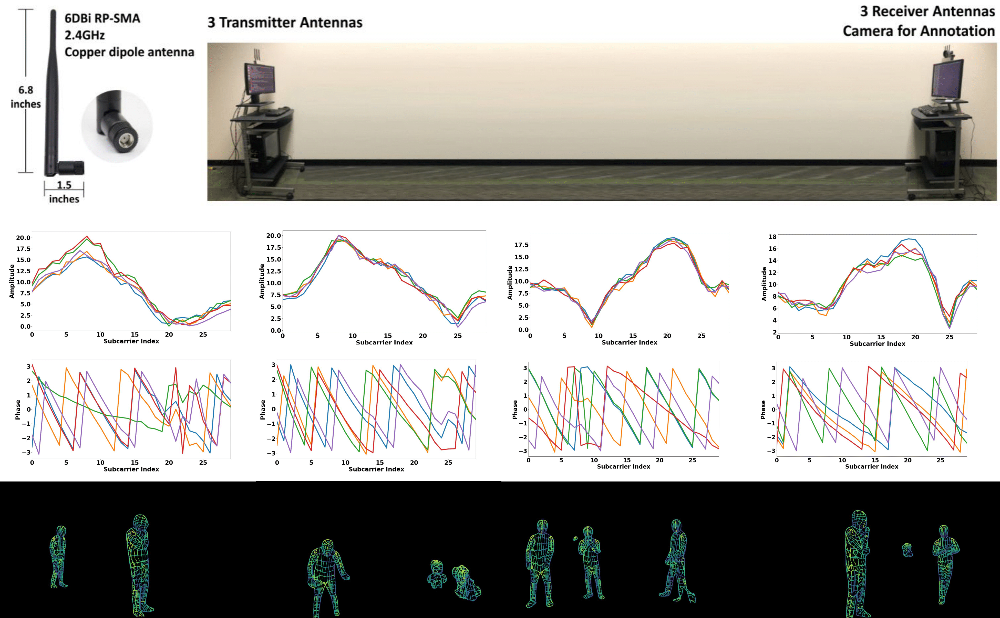
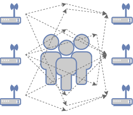
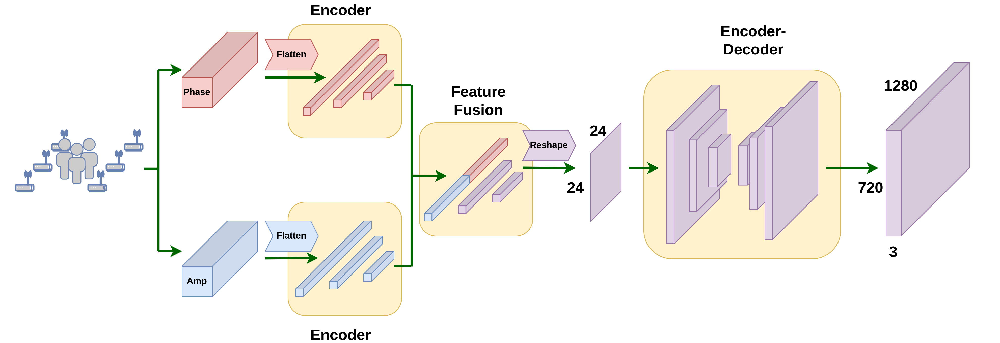
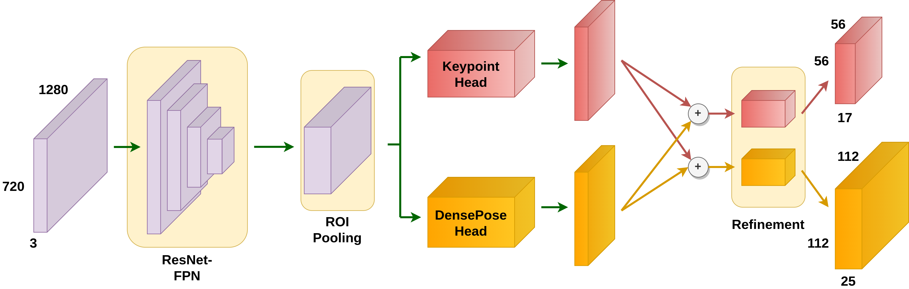

# WiFi DensePose — Seeing People Through Walls Without Cameras

_The shock of RuView: real-time human pose and vital sign detection using only WiFi signals_

## Executive Summary

In late 2025, an open-source project appeared on GitHub that garnered tens of thousands of stars in a single day. **RuView** — a system that detects real-time human poses and vital signs using only WiFi signals, without any cameras. It tracks a person's posture behind walls using 17 body keypoints and even measures respiration and heart rate. All it needs is one existing WiFi router, costing $0 to $8 per zone.

The roots of this technology lie in CMU's (Carnegie Mellon University) **"DensePose From WiFi"** (arXiv:2301.00250, 2023) paper. The research team achieved performance comparable to camera-based pose estimation models using just two WiFi routers. RuView implemented this as open source, completely rewritten in Rust to process 54,000 frames per second.

This technology is not merely a security camera replacement. It is a new sensor data paradigm that could fundamentally change how Physical AI perceives the world. Dark spaces beyond the reach of cameras, privacy-sensitive healthcare environments, factory floors filled with dust and vibration — in all these places, WiFi CSI (Channel State Information) signals become a new data source.

**Original Paper:**[DensePose From WiFi (Geng et al., CMU, 2023)](https://arxiv.org/abs/2301.00250) ·
                                **Open Source:**[ruvnet/RuView (GitHub)](https://github.com/ruvnet/RuView)

17COCO Body Keypoints

54KFrames Per Second (Rust)

$0~8Cost Per Zone (Using Existing WiFi)

810×Faster Than Python

*▲ WiFi antenna setup (top), CSI amplitude/phase signals (middle), DensePose estimation results (bottom) | Source: [arXiv:2301.00250](https://arxiv.org/abs/2301.00250)*

## 1. The Origin — CMU's Bold Challenge

In early 2023, the CMU research team posed a seemingly obvious question: _"When a person is in a room, WiFi signals change. Could we reverse-engineer those changes to determine a person's posture?"_

A WiFi router broadcasts signals through the air, and a receiver picks them up. In this process, **CSI (Channel State Information)** is generated. CSI numerically represents how the amplitude and phase of the signal changed for each frequency subcarrier. The CSI of an empty space differs from that of a space with a person standing in it. When the person moves, the CSI changes accordingly.

Core Claim of the CMU Paper

"WiFi CSI signals contain sufficient information to estimate the 2D DensePose of a human body — UV coordinates + 17 COCO keypoints — without any cameras."

The research team placed two standard WiFi routers (3 antennas each, 6 total) facing each other and collected CSI from each antenna pair. They extracted CSI matrices of 56 subcarriers from 3x3 = 9 antenna links and fed them into a deep learning model. The output was 17 joint positions (COCO keypoints) and a DensePose UV coordinate map of the human body.

The results were stunning. Compared to existing camera-based pose estimation systems, the WiFi-based system achieved **comparable AP (Average Precision) scores**. The same performance held in pitch-dark rooms, through walls, and regardless of clothing.

*▲ CMU research team's experimental setup — TX/RX antenna placement | Source: [arXiv:2301.00250](https://arxiv.org/abs/2301.00250)*

## 2. How It Works — From CSI to Pose

RuView's signal processing pipeline consists of 6 stages. It is the process by which raw CSI data enters and real-time human poses and vital signs come out.

📡

CSI Capture

WiFi Signal Capture

→

🔧

Preprocessing

Hampel · SpotFi · BVP

→

🎯

Coherence Gate

Noise Filtering

→

🤖

AI Inference

RuVector Attention

→

🦴

Pose + Vitals

17 Keypoints · BPM

### Stage 1: CSI Collection and Multistatic Fusion

With N WiFi antenna pairs, N×(N-1) links are generated. RuView fuses CSI data from these multiple links using **attention-based weighted averaging** (multistatic fusion). 3 channels x 56 subcarriers = 168 virtual subcarriers are obtained.

### Stage 2: Signal Preprocessing

Raw CSI contains significant noise from hardware, frequency offsets (CFO/SFO), and packet detection delays. RuView sequentially applies the **Hampel filter** (outlier removal), **SpotFi algorithm** (angle of arrival estimation), **Fresnel model** (motion sensitivity enhancement), and **BVP filter** (vital sign extraction).

### Stage 3: Coherence Gate — Only Reliable Measurements Pass

Not all CSI frames are created equal. RuView's coherence gate evaluates each frame using Z-score-based hysteresis. Depending on reliability, each frame is labeled as Accept / PredictOnly / Reject / Recalibrate. Bad data is blocked before it enters the AI model.

> [!callout]
> Data Quality Comes First

> The coherence gate is software-level data quality control, not hardware. Even with the same WiFi signal, reliability varies dramatically depending on the measurement environment, and if bad frames enter the AI model, pose estimation accuracy drops sharply. This is why RuView designed a dedicated quality gate.

### Stage 4: AI Inference — RuVector Graph Transformer

The preprocessed CSI feature matrix is fed into a **graph transformer**. Cross-attention layers learn the correlations between each subcarrier and ultimately output 17 COCO body keypoint coordinates and a DensePose UV coordinate map. For vital sign extraction, it analyzes the spectrogram of the BVP filter output to calculate respiration (6~30 BPM) and heart rate (40~120 BPM).

*▲ Domain Translation network — encoder-decoder architecture converting WiFi CSI (phase + amplitude) to image domain | Source: [arXiv:2301.00250](https://arxiv.org/abs/2301.00250)*

## 3. Core Capabilities — 17 Keypoints and Beyond

### 17 COCO Body Keypoints

The 17 keypoints extracted by RuView follow the same COCO dataset standard. WiFi signals reproduce the same coordinate system that camera-based pose estimation models have been trained on for decades.

👃 Nose

👁️ L/R Eye

👂 L/R Ear

💪 L/R Shoulder

🦾 L/R Elbow

✋ L/R Wrist

🦵 L/R Hip

🦿 L/R Knee

🦶 L/R Ankle

*▲ Camera-based GT (left) vs WiFi CSI-based DensePose estimation results (right) | Source: [arXiv:2301.00250](https://arxiv.org/abs/2301.00250)*

### Real-Time Vital Sign Detection

Pose estimation is not the whole story. RuView also extracts vital signs from the same WiFi CSI signals.

- **Respiration Rate:** 6~30 breaths per minute range, ±1 BPM accuracy
- **Heart Rate:** 40~120 beats per minute range
- **Occupancy Detection:** >95% accuracy for presence/absence detection
- **Fall Detection:** Detects rapid velocity changes above 15.0 rad/s²
- **Multi-Person:** Physically tracks 3~5 people simultaneously per AP (no software limit)

### Hardware Options — From Existing WiFi to ESP32

📶

Existing WiFi (RSSI Only)

Laptop or existing router. $0 per zone. No precise CSI — only presence detection and coarse movement sensing.

🔌

ESP32-S3 Nodes

$8~48 per zone (4 nodes = $48). Full CSI support — all 17 keypoints + vital signs enabled. TDM mesh network configurable.

## 4. Real-World Use Cases — Where Cameras Cannot Go

What makes WiFi DensePose powerful is that it works in environments where cameras are fundamentally impossible.

🏥

Hospital Patient Monitoring

24/7 continuous respiration and heart rate monitoring in non-critical wards without cameras. Nurse alerts on anomaly detection. Patient fall detection with no privacy invasion. 1~2 APs per ward cover all beds.

🏭

Factory Safety Monitoring

Manufacturing environments where dust, high heat, and vibration continuously contaminate camera lenses. WiFi CSI is unaffected by dust. Real-time detection of restricted zone entry, falls, and abnormal postures (injury-prone movements).

🏋️

Fitness & Sports

Posture correction, rep counting, and breathing synchronization guidance even in spaces like locker rooms where cameras cannot be installed. Exercise vital sign measurement using only WiFi, without wearables.

🚁

Drone Landing Zone Verification

When downward-facing cameras fail in rain, dust, or low-light conditions, ground ESP32 nodes use WiFi CSI to determine human presence in landing zones with over 95% accuracy. A safety layer for autonomous drone logistics.

🚨

Disaster Response & Search-Rescue

Detecting survivor breathing in collapsed building debris. WiFi signals penetrate concrete walls. Vital sign detection of survivors beyond 5m regardless of smoke or darkness.

*▲ WiFi-DensePose R-CNN — pipeline estimating human body surface UV coordinates from translated images | Source: [arXiv:2301.00250](https://arxiv.org/abs/2301.00250)*

## 5. Comparison with Cameras — Complement, Not Replacement

WiFi DensePose is not a technology that fully replaces camera systems. They are complementary sensors, each with its own strengths.

| Criterion | WiFi DensePose (RuView) | Camera-Based Pose Estimation |
| --- | --- | --- |
| Cost Per Zone | $0~8 (using existing WiFi) | $200~2,000 |
| Lighting Dependency | None — works in complete darkness | Limited at night without IR assist |
| Through-Wall | Yes — 5m through concrete | Impossible |
| Privacy | High — no video data | Requires regulation/consent |
| Pose Resolution | 17 keypoints (coarse motion) | 133+ keypoints (fine motion) |
| Face Recognition | Impossible | Possible |
| Vital Signs | Respiration & heart rate included | Separate sensors required |
| Dust/Smoke Environments | Unaffected | Lens contamination / blocked view |
| Training Data Required | Per-environment fine-tuning needed | Large public datasets available |

> [!callout]
> Key Insight: The Training Data Asymmetry

> Camera-based pose estimation benefits from decades of large-scale public datasets like COCO, MPII, and Human3.6M. In contrast, WiFi CSI-based pose estimation requires different CSI patterns for each environment (building structure, furniture layout, number of people), making **per-deployment fine-tuning data essential**. This is the biggest bottleneck to scaling this technology.

## 6. Pebblous Perspective — The Data Questions WiFi CSI Raises

WiFi DensePose is more than a technological curiosity. It raises fundamental questions that Pebblous, as a Physical AI data platform, must answer.

🔍

DataClinic — How to Diagnose CSI Data Quality

WiFi CSI data is extremely sensitive to the environment. Even the same posture produces different CSI patterns when furniture layout changes. When collecting fine-tuning data for each deployment environment, DataClinic's role is to automatically diagnose how much noise exists in the data and whether certain poses are underrepresented. The rejection rate from the coherence gate itself becomes a data quality metric.

🏗️

PebbloSim — Generating Synthetic CSI Data via Indoor Digital Twins

The biggest challenge in WiFi CSI data collection is that "people must physically move through the actual environment while labels are manually assigned." PebbloSim builds digital twins of factories, hospital wards, and warehouses, then simulates various human postures and trajectories within them to generate synthetic CSI data. This enables deployment to new environments without real data collection.

🌿

Data Greenhouse — Automated Continuous CSI Data Pipeline

Even after WiFi DensePose is deployed on-site, the environment changes. New furniture, renovations, seasonal staffing fluctuations. Data Greenhouse is an autonomous pipeline that continuously collects, refines, and labels on-site CSI streams, automatically detects model performance degradation, and triggers retraining.

🔭

PebbloScope — Explainability of CSI-Based Pose Results

To convince decision-makers that WiFi-based pose estimation is reliable, you need to visualize "why it determined this posture." PebbloScope's role is to translate attention maps into human-understandable forms — showing which subcarrier's CSI changes contributed to which keypoint estimation.

> [!callout]
> It All Comes Down to the Data Bottleneck

> The gap between "technically possible" and "actually used in industry" for WiFi DensePose lies not in technology but in **data**. Per-environment CSI collection costs, labeling difficulty, and the domain gap in synthetic data — solving these three challenges is the core mission of a Physical AI data platform, and exactly where Pebblous needs to be.

## Frequently Asked Questions

Q. Can WiFi DensePose completely replace cameras?

Not yet. Cameras are far superior in pose resolution (17 keypoints vs 133+), face recognition, color detection, and fine-grained action classification. However, WiFi has irreplaceable advantages in requiring no lighting, penetrating walls, low cost, and strong privacy protection. The two technologies are complementary.

Q. Does it work with regular home WiFi routers?

Basic RSSI (Received Signal Strength Indicator) detection works with most WiFi. However, 17-keypoint pose estimation and vital sign measurement require CSI data access, which is only supported by certain Intel WiFi chipsets (5300, 9260, etc.) or specialized hardware like the ESP32-S3. Standard routers do not expose CSI externally.

Q. How does it distinguish between multiple people in a room?

RuView uses the MinCut graph algorithm to separate CSI signals into individual body reflections, then uses a Kalman tracker and Re-ID module to continuously track each person. The practical limit is 3~5 people per AP due to physical constraints, but connecting multiple APs via mesh enables handling more people.

Q. How many training samples are needed for CSI data?

It varies significantly by environment. RuView employs a two-stage approach: first performing contrastive learning on unlabeled CSI to learn environment representations, then fine-tuning with a small amount of pose-labeled data. It is designed to adapt to new environments with as few as several hundred labeled samples.

Q. Is it safe from a privacy perspective?

WiFi DensePose generates no video data whatsoever. The output consists only of numerical coordinates (keypoint x,y) and metrics (BPM). Unlike camera CCTV, there is no visual information that could identify specific individuals, making it advantageous under GDPR and other privacy regulations. However, linking data across multiple environments could enable behavioral pattern inference, and regulatory discussions are ongoing.

Q. What is needed to deploy this in industrial settings?

You need hardware (ESP32-S3 nodes or CSI-capable WiFi), per-site CSI training data collection (minimum hundreds to thousands of samples), a continuous retraining pipeline for environmental changes, and visualization tools for result interpretation. Data infrastructure, more than technology, is the key variable for adoption.

Q. Why did RuView suddenly gain attention on GitHub?

Several factors converged. It was completely rewritten in Rust, demonstrating 810x faster processing than Python. The $0 entry cost with existing WiFi, combined with the intuitive and striking demo potential of camera-free human detection, captured the Hacker News and GitHub communities. Being the first open-source project to practically implement the CMU paper was also a key factor.

Q. How does this technology connect to Physical AI?

Physical AI refers to AI systems that operate in the physical world, like robots, drones, and autonomous vehicles. For these systems to safely perceive and collaborate with humans, they need diverse sensor data. WiFi DensePose is a new sensor layer that provides human position and pose data in environments where cameras are impossible. It is essentially giving Physical AI an additional pair of eyes.

## Conclusion — An Era of Seeing the Invisible

WiFi signals have been around us since the early 2000s. The fact that those signals reflect human presence has always been physically true. What has changed is that AI has gained the ability to read meaning from those subtle variations.

What makes RuView's emergence fascinating is not the technology itself but the **data bottleneck** it reveals. The algorithm is now open source. Hardware costs have nearly vanished. What remains is the challenge of how to acquire quality CSI data to train AI for each environment.

This mirrors a broader pattern across Physical AI. Robots need grasp data for thousands of objects to pick things up. Autonomous vehicles need edge-case driving data to navigate roads. WiFi DensePose needs CSI data unique to each factory to ensure safety. **In the era of Physical AI, data infrastructure is just as important as technology infrastructure.**

pb's Perspective

The idea that WiFi signals can see people instead of cameras is stunning. But the question that follows the shock matters more — "Where and how do you train the AI?" The technology is open. Now data infrastructure becomes the differentiator.
