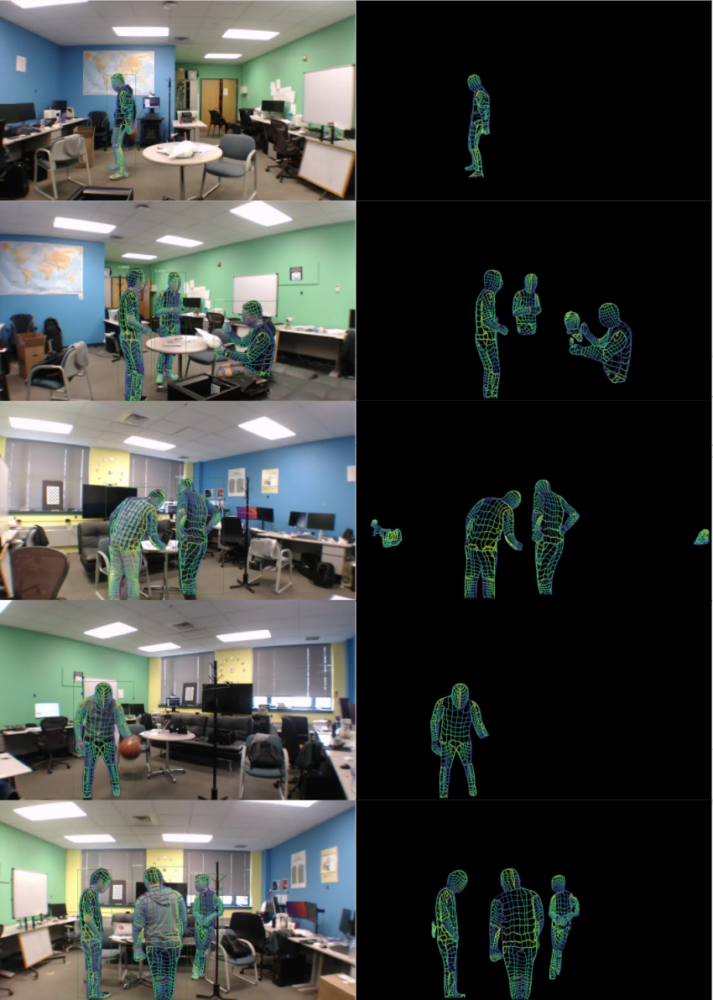

# WiFi DensePose — 카메라 없이 벽 너머 사람을 본다

_WiFi 신호만으로 실시간 인체 포즈와 생체신호를 감지하는 RuView의 충격_

## Executive Summary

2025년 말, GitHub에서 하루 만에 수만 개의 별을 받은 오픈소스 프로젝트가 등장했습니다. **RuView** — WiFi 신호만으로 카메라 없이 실시간 인체 포즈와 생체신호를 감지하는 시스템입니다. 벽 너머에 있는 사람의 자세를 17개 신체 키포인트로 추적하고, 분당 호흡수와 심박수까지 측정합니다. 기존 WiFi 공유기 하나, 비용은 구역당 0~8달러.

이 기술의 뿌리는 CMU(카네기멜론대학교)의 **"DensePose From WiFi"**(arXiv:2301.00250, 2023) 논문입니다. 연구팀은 WiFi 라우터 2개만으로 기존 카메라 기반 포즈 추정 모델에 근접한 성능을 달성했습니다. RuView는 이를 오픈소스로 구현하고, Rust로 완전 재작성해 초당 54,000 프레임을 처리하는 수준으로 끌어올렸습니다.

이 기술은 단순한 보안 카메라 대체재가 아닙니다. 피지컬AI(Physical AI)가 세계를 인식하는 방식을 근본적으로 바꿀 새로운 센서 데이터 패러다임입니다. 카메라가 닿지 않는 어두운 공간, 프라이버시가 중요한 의료 환경, 먼지와 진동이 심한 공장 현장 — 이 모든 곳에서 WiFi CSI(채널 상태 정보) 신호가 새로운 데이터 원천이 됩니다.

**원본 논문:**[DensePose From WiFi (Geng et al., CMU, 2023)](https://arxiv.org/abs/2301.00250) ·
                                **오픈소스:**[ruvnet/RuView (GitHub)](https://github.com/ruvnet/RuView)

17COCO 신체 키포인트

54K초당 처리 프레임 (Rust)

$0~8구역당 비용 (기존 WiFi 활용)

810×Python 대비 처리 속도

*▲ WiFi 안테나 설정(상단), CSI 진폭/위상 신호(중단), DensePose 추정 결과(하단) | Source: [arXiv:2301.00250](https://arxiv.org/abs/2301.00250)*

## 1. 기술의 탄생 — CMU 연구팀의 도전

2023년 초, CMU 연구팀은 당연해 보이는 질문을 던졌습니다. _"인간이 방에 있으면 WiFi 신호가 변한다. 그 변화를 역으로 분석하면 인간의 자세를 알 수 있지 않을까?"_

WiFi 라우터는 신호를 공기 중으로 쏘고 수신기는 그것을 받습니다. 이 과정에서 **CSI(Channel State Information, 채널 상태 정보)**가 생성됩니다. CSI는 각 주파수 서브캐리어별로 신호의 진폭과 위상이 어떻게 변했는지를 수치로 나타냅니다. 장애물이 없는 공간과 사람이 서 있는 공간의 CSI는 다릅니다. 사람이 움직이면 CSI도 변합니다.

CMU 논문의 핵심 주장

"WiFi CSI 신호는 카메라 없이도 인체의 2D DensePose — UV 좌표 + 17개 COCO 키포인트 — 를 추정할 수 있는 충분한 정보를 담고 있다."

연구팀은 표준 WiFi 라우터 2개(3개 안테나씩, 총 6개)를 마주 보게 배치하고, 각 안테나 쌍 간의 CSI를 수집했습니다. 3×3 = 9개 안테나 링크에서 56개 서브캐리어의 CSI 행렬을 추출해 딥러닝 모델에 입력했습니다. 출력은 인체의 17개 관절 위치(COCO 키포인트)와 DensePose UV 좌표맵이었습니다.

결과는 충격적이었습니다. 기존 카메라 기반 포즈 추정 시스템과 비교했을 때, WiFi 기반 시스템이 **유사한 AP(Average Precision) 수치**를 달성했습니다. 빛이 없는 어두운 방에서도, 벽 너머에서도, 옷 위에서도 동일한 성능이 유지됐습니다.

*▲ CMU 연구팀의 실험 설정 — TX/RX 안테나 배치 | Source: [arXiv:2301.00250](https://arxiv.org/abs/2301.00250)*

## 2. 작동 원리 — CSI에서 포즈까지

RuView의 신호 처리 파이프라인은 6단계로 구성됩니다. 원시 CSI 데이터가 들어와 실시간 인체 포즈와 생체신호로 나오는 과정입니다.

📡

CSI 수집

WiFi 신호 캡처

→

🔧

전처리

Hampel · SpotFi · BVP

→

🎯

코히런스 게이트

노이즈 필터링

→

🤖

AI 추론

RuVector 어텐션

→

🦴

포즈 + 생체신호

17 키포인트 · BPM

### 단계 1: CSI 수집과 멀티스태틱 융합

WiFi 안테나 쌍 N개가 있으면 N×(N-1)개의 링크가 생성됩니다. RuView는 이 여러 링크의 CSI 데이터를 **어텐션 기반 가중 평균**으로 융합합니다(멀티스태틱 융합). 3개 채널 × 56개 서브캐리어 = 168개 가상 서브캐리어가 확보됩니다.

### 단계 2: 신호 전처리

원시 CSI에는 하드웨어 노이즈, 주파수 편차(CFO/SFO), 패킷 검출 지연 등 잡음이 많습니다. RuView는 **Hampel 필터**(이상값 제거), **SpotFi 알고리즘**(도착각 추정), **Fresnel 모델**(움직임 감도 향상), **BVP 필터**(생체신호 추출)를 순서대로 적용합니다.

### 단계 3: 코히런스 게이트 — 신뢰할 수 있는 측정만 통과

모든 CSI 프레임이 동등하지는 않습니다. RuView의 코히런스 게이트는 Z-score 기반 히스테리시스로 각 프레임을 평가합니다. 신뢰도에 따라 Accept / PredictOnly / Reject / Recalibrate 중 하나의 레이블이 붙습니다. 불량 데이터는 AI 모델에 입력되기 전에 차단됩니다.

> [!callout]
> 데이터 품질이 먼저다

> 코히런스 게이트는 하드웨어가 아닌 소프트웨어 수준의 데이터 품질 관리입니다. 같은 WiFi 신호라도 측정 환경에 따라 신뢰도가 천차만별이며, 불량 프레임이 AI 모델에 유입될 경우 포즈 추정 정확도가 급격히 떨어집니다. RuView가 별도의 품질 게이트를 설계한 이유입니다.

### 단계 4: AI 추론 — RuVector 그래프 트랜스포머

전처리된 CSI 특징 행렬은 **그래프 트랜스포머**에 입력됩니다. 크로스-어텐션 레이어가 각 서브캐리어 간의 상관관계를 학습하고, 최종적으로 17개 COCO 신체 키포인트 좌표와 DensePose UV 좌표맵을 출력합니다. 생체신호 추출에는 BVP 필터 출력의 스펙트로그램을 분석해 호흡(6~30 BPM)과 심박수(40~120 BPM)를 계산합니다.

*▲ Domain Translation 네트워크 — WiFi CSI(위상+진폭)를 이미지 도메인으로 변환하는 인코더-디코더 구조 | Source: [arXiv:2301.00250](https://arxiv.org/abs/2301.00250)*

## 3. 핵심 기능 — 17개 키포인트와 그 너머

### 17개 COCO 신체 키포인트

RuView가 추출하는 17개 키포인트는 COCO 데이터셋 표준과 동일합니다. 카메라 기반 포즈 추정 모델들이 수십 년 동안 학습한 것과 같은 좌표 체계를 WiFi 신호로 재현합니다.

👃 코

👁️ 왼눈 / 오른눈

👂 왼귀 / 오른귀

💪 왼어깨 / 오른어깨

🦾 왼팔꿈치 / 오른팔꿈치

✋ 왼손목 / 오른손목

🦵 왼엉덩이 / 오른엉덩이

🦿 왼무릎 / 오른무릎

🦶 왼발목 / 오른발목

*▲ 카메라 기반 GT(좌)와 WiFi CSI 기반 DensePose 추정 결과(우) 비교 | Source: [arXiv:2301.00250](https://arxiv.org/abs/2301.00250)*

### 생체신호 실시간 감지

포즈 추정만이 전부가 아닙니다. RuView는 동일한 WiFi CSI 신호에서 생체신호도 추출합니다.

- **호흡수:** 분당 6~30회 범위, ±1 BPM 정확도
- **심박수:** 분당 40~120회 범위
- **재실 감지:** >95% 정확도의 존재 유무 판별
- **낙상 감지:** 초당 15.0 rad/s² 이상의 급격한 속도 변화 감지
- **다중 인원:** AP당 물리적으로 3~5명 동시 추적 (소프트웨어 한계 없음)

### 하드웨어 옵션 — 있는 WiFi부터 ESP32까지

📶

기존 WiFi (RSSI 전용)

노트북 또는 기존 공유기. 구역당 비용 $0. 정밀 CSI 없음 — 존재 유무와 거친 움직임 감지만 가능.

🔌

ESP32-S3 노드

구역당 $8~48 (4개 기준 $48). 완전한 CSI 지원 — 17 키포인트 + 생체신호 전부 활성화. TDM 메시 네트워크 구성 가능.

## 4. 실제 적용 사례 — 카메라가 갈 수 없는 곳

WiFi DensePose가 강력한 이유는 카메라가 본질적으로 불가능한 환경에서도 작동한다는 점입니다.

🏥

병원 환자 모니터링

비중증 병상에서 카메라 없이 호흡·심박 24시간 연속 감시. 이상 감지 시 간호사 알림. 프라이버시 침해 없이 환자 낙상 감지. 병동당 1~2개 AP로 전 병상 커버.

🏭

공장 안전 모니터링

분진, 고온, 진동이 많아 카메라 렌즈가 지속적으로 오염되는 제조 환경. WiFi CSI는 분진에 영향받지 않습니다. 위험 구역 진입, 낙상, 비정상 자세(허리 부상 유발 동작) 실시간 감지.

🏋️

피트니스 & 스포츠

탈의실 같이 카메라를 설치할 수 없는 공간에서도 자세 교정, 동작 횟수 카운팅, 호흡 동기화 가이드 제공. 웨어러블 없이 순수 WiFi만으로 운동 생체신호 측정.

🚁

드론 착지 구역 확인

비, 먼지, 저조도 환경에서 하향 카메라가 실패하는 상황에 지상 ESP32 노드의 WiFi CSI로 착지 구역의 사람 유무를 95% 이상 정확도로 판별. 자율 드론 물류의 안전 레이어.

🚨

재난 대응 & 수색구조

붕괴된 건물 잔해 속 생존자의 호흡 감지. WiFi 신호는 콘크리트 벽을 통과합니다. 연기·어둠 관계없이 5m 거리 너머 생존자의 생체신호 감지 가능.

*▲ WiFi-DensePose R-CNN — 변환된 이미지에서 인체 표면 UV 좌표를 추정하는 파이프라인 | Source: [arXiv:2301.00250](https://arxiv.org/abs/2301.00250)*

## 5. 카메라와의 비교 — 대체가 아닌 보완

WiFi DensePose는 카메라 시스템을 전면 대체하는 기술이 아닙니다. 각자 강점이 있는 상호 보완적 센서입니다.

| 항목 | WiFi DensePose (RuView) | 카메라 기반 포즈 추정 |
| --- | --- | --- |
| 구역당 비용 | $0~8 (기존 WiFi 활용) | $200~2,000 |
| 조명 의존성 | 없음 — 완전 암흑 가능 | IR 보조 없이는 야간 한계 |
| 벽 투과 | 가능 — 콘크리트 5m | 불가 |
| 프라이버시 | 높음 — 영상 데이터 없음 | 규제·동의 필요 |
| 포즈 해상도 | 17 키포인트 (굵은 동작) | 133 키포인트+ (세밀한 동작) |
| 얼굴 인식 | 불가 | 가능 |
| 생체신호 | 호흡·심박 포함 | 별도 센서 필요 |
| 분진·연기 환경 | 영향 없음 | 렌즈 오염·시야 차단 |
| 학습 데이터 필요량 | 환경별 파인튜닝 필요 | 대용량 공개 데이터셋 존재 |

> [!callout]
> 핵심 인사이트: 학습 데이터의 비대칭

> 카메라 기반 포즈 추정은 COCO, MPII, Human3.6M 등 수십 년치 대용량 공개 데이터셋이 존재합니다. 반면 WiFi CSI 기반 포즈 추정은 환경(건물 구조, 가구 배치, 사람 수)마다 CSI 패턴이 달라져 **각 배포 환경별 파인튜닝 데이터가 필수**입니다. 이것이 이 기술 확산의 최대 병목입니다.

## 6. 페블러스 시각 — WiFi CSI가 묻는 데이터 질문들

WiFi DensePose는 단순한 기술 흥미거리가 아닙니다. 피지컬AI 데이터 플랫폼으로서 페블러스가 답해야 할 핵심 질문들을 던집니다.

🔍

DataClinic — CSI 데이터의 품질을 어떻게 진단하나

WiFi CSI 데이터는 환경에 극도로 민감합니다. 같은 자세라도 가구 배치가 바뀌면 CSI 패턴이 달라집니다. 배포 환경별 파인튜닝 데이터를 수집할 때, 이 데이터에 노이즈가 얼마나 있는지, 특정 포즈가 과소 표현되어 있지는 않은지를 자동 진단하는 것이 DataClinic의 역할입니다. 코히런스 게이트에서 Reject된 프레임 비율 자체가 데이터 품질 지표가 됩니다.

🏗️

페블로심(PebbloSim) — 실내 환경 디지털트윈으로 CSI 합성데이터 생성

WiFi CSI 데이터 수집의 최대 난점은 "실제 환경에서 사람을 직접 움직여가며 레이블을 달아야 한다"는 점입니다. 페블로심은 공장, 병원 병동, 물류창고의 디지털트윈을 구성하고 그 안에서 다양한 인체 자세와 동선을 시뮬레이션해 CSI 합성데이터를 생성합니다. 실제 데이터 수집 없이 새 환경에 배포할 수 있게 됩니다.

🌿

데이터 그린하우스 — 지속적인 CSI 데이터 파이프라인 자동화

WiFi DensePose가 현장에 배포된 이후에도 환경은 바뀝니다. 새 가구, 리모델링, 계절별 인원 변화. 데이터 그린하우스는 현장 CSI 스트림을 지속적으로 수집·정제·레이블링하고, 모델 성능 저하를 자동으로 감지해 재학습을 트리거하는 자율형 파이프라인입니다.

🔭

페블로스코프(PebbloScope) — CSI 기반 포즈 결과의 설명 가능성

WiFi로 포즈를 추정했다고 의사결정자를 설득하려면 "왜 이 자세라고 판단했는가"를 시각화할 수 있어야 합니다. 어떤 서브캐리어의 CSI 변화가 어떤 키포인트 추정에 기여했는지, 어텐션 맵을 사람이 이해할 수 있는 형태로 변환하는 것이 페블로스코프의 역할입니다.

> [!callout]
> 결국 데이터 병목 문제

> WiFi DensePose가 "기술적으로 가능하다"와 "산업 현장에서 실제로 쓰인다" 사이의 간극은 기술이 아닌 **데이터**에 있습니다. 환경별 CSI 수집 비용, 레이블링의 어려움, 합성데이터의 도메인 격차 — 이 세 가지를 해결하는 것이 피지컬AI 데이터 플랫폼의 핵심 과제이며, 페블러스가 있어야 할 자리입니다.

## 자주 묻는 질문

Q. WiFi DensePose는 카메라를 완전히 대체할 수 있나요?

아직은 아닙니다. 포즈 해상도(17 키포인트 vs 133+), 얼굴 인식, 색상 및 세밀한 동작 분류 등에서 카메라가 월등합니다. 다만 조명 불필요, 벽 투과, 낮은 비용, 강한 프라이버시 보호 측면에서 카메라가 대체 불가한 영역이 있습니다. 두 기술은 상호 보완적입니다.

Q. 일반 가정용 WiFi 공유기로도 작동하나요?

RSSI(수신 신호 강도) 기반 기본 감지는 대부분의 WiFi로 가능합니다. 그러나 17 키포인트 포즈 추정과 생체신호 측정에는 CSI 데이터 접근이 필요한데, 이는 일부 Intel WiFi 칩셋(5300, 9260 등) 또는 ESP32-S3 같은 특수 하드웨어에서만 지원됩니다. 일반 공유기는 CSI를 외부에 노출하지 않습니다.

Q. 여러 명이 동시에 방에 있으면 어떻게 구분하나요?

RuView는 MinCut 그래프 알고리즘으로 CSI 신호를 개별 인체 반사로 분리하고, Kalman 트래커와 재식별(Re-ID) 모듈로 각 사람을 지속 추적합니다. 물리적 한계로 하나의 AP당 3~5명이 실용적 최대치이나, 여러 AP를 mesh로 연결하면 더 많은 인원도 처리 가능합니다.

Q. CSI 데이터 학습에 얼마나 많은 샘플이 필요한가요?

환경별로 크게 다릅니다. RuView는 먼저 레이블 없는 CSI로 대조 학습(contrastive learning)을 수행해 환경 표현을 학습한 뒤, 소량의 포즈 레이블 데이터로 파인튜닝하는 2단계 방식을 채용합니다. 새 환경에서 수백 개의 레이블 샘플으로도 적응이 가능하도록 설계되었습니다.

Q. 개인정보 보호 측면에서 안전한가요?

WiFi DensePose는 영상 데이터를 일절 생성하지 않습니다. 출력은 숫자 좌표(키포인트 x,y)와 수치(BPM)뿐입니다. 카메라 CCTV와 달리 특정 인물을 식별할 수 있는 시각 정보가 없어 GDPR 등 개인정보 규제 관점에서 유리합니다. 다만 여러 환경의 데이터를 연계하면 행동 패턴 추론이 가능해질 수 있어 규제 논의가 진행 중입니다.

Q. 산업 현장에 도입하려면 무엇이 필요한가요?

하드웨어(ESP32-S3 노드 또는 CSI 지원 WiFi), 현장별 CSI 학습 데이터 수집(최소 수백~수천 샘플), 환경 변화에 따른 지속적 재학습 파이프라인, 그리고 결과 해석을 위한 시각화 도구가 필요합니다. 기술보다 데이터 인프라가 도입의 핵심 변수입니다.

Q. RuView가 GitHub에서 갑자기 주목받은 이유는 무엇인가요?

몇 가지 요인이 겹쳤습니다. Rust로 완전 재작성해 Python 대비 810배 빠른 처리 속도를 증명했고, $0 비용으로 기존 WiFi에서 즉시 시작할 수 있는 낮은 진입장벽, 그리고 카메라 없는 인체 감지라는 직관적이고 강렬한 데모 가능성이 해커뉴스와 GitHub 커뮤니티를 자극했습니다. CMU 논문을 실용적으로 구현한 첫 오픈소스 프로젝트라는 점도 주효했습니다.

Q. 이 기술이 피지컬AI와 어떻게 연결되나요?

피지컬AI는 로봇, 드론, 자율주행처럼 물리 세계에서 동작하는 AI 시스템입니다. 이 시스템이 사람을 안전하게 인식하고 협력하려면 다양한 센서 데이터가 필요합니다. WiFi DensePose는 카메라가 불가능한 환경에서 인체 위치·자세 데이터를 제공하는 새로운 센서 계층입니다. 피지컬AI의 눈이 하나 더 생기는 셈입니다.

## 마치며 — 보이지 않는 것을 보는 시대

WiFi 신호는 2000년대 초부터 우리 주변에 있었습니다. 그 신호가 사람의 존재를 반영한다는 사실도 물리적으로는 항상 사실이었습니다. 달라진 것은 AI가 그 미세한 변화에서 의미를 읽어내는 능력을 갖추게 됐다는 점입니다.

RuView의 등장이 흥미로운 이유는 기술 자체보다도 그것이 드러내는 **데이터 병목** 때문입니다. 알고리즘은 오픈소스가 됐습니다. 하드웨어 비용은 거의 사라졌습니다. 남은 것은 각 환경마다 AI를 훈련시킬 양질의 CSI 데이터를 어떻게 확보하느냐의 문제입니다.

이것은 피지컬AI 전반의 패턴과 같습니다. 로봇이 물건을 집으려면 수천 가지 물건의 파지(grasp) 데이터가 필요합니다. 자율주행이 도로를 달리려면 엣지 케이스 주행 데이터가 필요합니다. WiFi DensePose가 공장 안전을 지키려면 그 공장 고유의 CSI 데이터가 필요합니다. **피지컬AI의 시대, 데이터 인프라는 기술 인프라만큼 중요합니다.**

pb의 시각

WiFi 신호가 카메라 대신 사람을 본다는 발상은 충격적입니다. 하지만 그 충격 뒤에 오는 질문이 더 중요합니다 — "그 AI를 어디서, 어떻게 학습시킬 것인가?" 기술은 공개됐고, 이제 데이터 인프라가 차별점이 됩니다.
