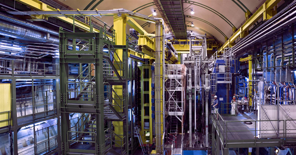

# AI가 낸 발견, 누가 참이라 채점하는가

_AI 검증의 세 근본 한계, 그리고 데이터 준비도의 다음 단계 — 발견 준비도_

## Executive Summary

> [!callout]
> AI는 이미 물리학의 한복판에 들어와 있다. 유럽입자물리연구소(CERN)의 LHCb 실험은 어떤 충돌을 저장하고 어떤 것을 버릴지 결정하는 트리거 판단의 상당 부분을 머신러닝에 맡기고, 딥마인드의 GNoME은 하룻밤 사이 수백만 개의 신물질 후보를 예측했다. 그래서 남은 문제는 속도가 아니라 채점이다. AI가 "발견"을 쏟아내는 시대에, 그것을 발견으로 인정하기 전에 무엇을 통과시켜야 하는가. 물리학자 세 사람(Grosso·Mikuni·Heinrich)이 [arXiv:2607.10039](https://arxiv.org/abs/2607.10039)으로 던지는 질문이 이것이다. 이 글은 그 답을 물리학이 아니라 검증의 언어로 옮겨 읽는다.

> 저자들의 결론은 단호하다. AI는 세 가지 근본 한계, 곧 귀납 편향과 표본 복잡도와 실험 제약을 우회할 수 없고, 그래서 물리학자의 역할은 'AI 사용자'에서 'AI 평가자'로 바뀌어야 한다. 그 근거는 하나의 숫자에 압축된다. GNoME이 예측한 220만 개의 안정 구조 가운데 지금까지 독립 실험으로 검증된 것은 약 736개, 0.03% 남짓이다. 다만 이 숫자를 실패로 읽어서는 안 된다. 저자측은 검증이 느린 이유가 실험 화학의 속도 탓이라 반박하고, 비판자는 상당수가 기존 구조의 사소한 변형이라 지적한다. 이 논쟁이 존재한다는 사실 자체가 'AI 발견을 채점하는 일'이 얼마나 어려운지를 보여준다.

> 페블러스 독자에게 이 논문은 익숙한 개념의 상위 버전이다. 데이터 준비도(data readiness)가 'AI가 학습할 수 있는 데이터인가'를 물었다면, 이 논문이 요구하는 것은 '발견 준비도(discovery readiness)', 즉 'AI가 낸 산출물을 결론으로 승격시킬 수 있는 검증 체계인가'다. 세 한계 가운데 표본 복잡도와 실험 제약은 곧 학습 데이터의 대표성·희소성·측정 한계 문제이며, 이는 DataClinic이 다루는 품질 게이트를 '검증 게이트'로 확장하는 논리와 정확히 겹친다. EU AI Act의 고위험 시스템 검증 의무가 집행에 들어간 지금, "이 결과를 신뢰해도 되는가"의 게이트 설계는 물리학만의 문제가 아니다.

**편집자의 노트.** 데이터와 AI의 경계를 측정하는 일이라면 페블러스는 늘 관심이 간다. 그 경계가 기초과학 발견의 신뢰에 관한 것이라면 더욱 그렇다. 이 글은 물리학 해설서가 아니다. 물리학은 AI 검증의 한계가 가장 선명하게 드러나는 _사례_일 뿐, 본론은 그 검증 방법론을 데이터 실무의 언어로 옮기는 데 있다. 8월 1일 [「재현할 수 없는 도구로 하는 과학」](https://blog.pebblous.ai/blog/closed-model-science-reproducibility/ko/)이 도구의 불투명성을 물었다면, 이 글은 그다음 질문, 곧 검증의 설계를 다룬다. 자연과학×AI 검증 시리즈의 완결편이다.

### 주요 수치

네 숫자가 이 글의 뼈대다. 모두 'AI가 쏟아낸 규모'와 '실제로 검증된 규모'의 간극을 보여준다.

<!-- stat-card -->
**2.2M → 736** — 예측 vs 검증 신물질 — GNoME 예측 220만, 독립 실험 검증 약 736(≈0.03%)

<!-- stat-card -->
**99%+** — LHC 충돌 데이터 폐기율 — 무엇을 볼지 사람이 트리거로 설계 = 실험 제약

<!-- stat-card -->
**1 vs 10억** — 표본 밀도의 양극단 — 암흑물질 ton·year당 1 이벤트 미만 ↔ LHC 초당 10억 충돌

<!-- stat-card -->
**5.0σ** — 물리학의 발견 문턱 — p≈2.9×10⁻⁷, 약 350만분의 1 — 검증 문화의 정량

## AI가 발견을 내놓기 시작했다 — 질문이 바뀐 지점

"AI를 과학에 쓸 것인가"는 이미 지난 논쟁이다. 물리학의 최전선에서 AI는 도구가 아니라 의사결정의 일부다. LHCb 실험에서는 초당 수천만 번 일어나는 입자 충돌 가운데 무엇을 저장하고 무엇을 버릴지, 즉 무엇을 '볼지'를 판단하는 트리거 시스템의 상당 부분이 머신러닝으로 돌아간다. 물리학자 Mike Williams의 표현대로, 머신러닝은 이미 입자물리의 실험 파이프라인 곳곳에 퍼져 있다. 생성모델은 검출기 시뮬레이션을 전통적 방법보다 수천에서 수만 배 빠르게 대체하고 있다. 남은 질문은 "AI를 쓸까"가 아니라 "AI가 낸 결과를 누가, 무엇으로 채점하는가"다.

*▲ CERN LHCb 검출기 — 트리거의 상당 부분을 머신러닝이 판단한다 | Source: [Wikimedia Commons (STFC / Kathleen Yurkewicz, CC BY-SA 2.0)](https://commons.wikimedia.org/wiki/File:The_LHCb_detector._Courtesy_of_Kathleen_Yurkewicz._(10134715223).jpg)*

이 전환이 가장 극적으로 보이는 사례가 재료과학이다. 딥마인드의 GNoME은 하룻밤 사이에 220만 개의 안정한 결정 구조를 예측했다([Merchant et al., _Nature_ 2023](https://www.nature.com/articles/s41586-023-06735-9)). 인간 화학자 수백 년의 축적을 하루로 압축한 규모다. 그런데 그 220만 개 가운데 다른 연구실이 실제로 합성해 독립 검증한 것은 지금까지 약 736개, 전체의 0.03% 남짓에 불과하다. 예측은 생성의 속도로 쏟아지고, 검증은 실험의 속도로 기어간다. 이 세 자릿수, 네 자릿수의 간극이 이 글 전체의 출발점이다.

다만 이 0.03%를 곧바로 "AI의 실패"로 읽는 것은 성급하다. GNoME 연구진은 검증율이 낮은 이유가 실험 화학의 속도가 느리기 때문이지 모델의 결함이 아니라고 반박한다. 반대로 케임브리지의 Anthony Cheetham과 UC 산타바바라의 Ram Seshadri 같은 재료과학자들은 예측된 구조의 상당수가 이미 알려진 물질의 사소한 변형(trivial variant)이라 진정한 신규성이 과장됐다고 지적한다([404 Media](https://www.404media.co) 보도). 어느 쪽이 옳든, 이 논쟁이 존재한다는 사실 자체가 핵심이다. AI가 낸 산출물을 '발견'으로 채점하는 일은 그 자체로 어렵고, 논쟁적이며, 아직 합의된 규칙이 없다.

> [!callout]
> 8월 1일 「재현할 수 없는 도구로 하는 과학」이 물었던 것은 **도구의 불투명성**이었다. 우리가 쓰는 AI가 어떻게 작동하는지 모른 채 과학을 해도 되는가. 이 글이 묻는 것은 그다음 질문, **검증의 설계**다. AI가 낸 결과를 발견으로 인정하기 전에 무엇을 통과시켜야 하는가. Grosso·Mikuni·Heinrich의 논문은 그 통과 조건이 임의로 정해질 수 없다고 본다. AI가 구조적으로 우회할 수 없는 세 가지 한계가 있고, 검증 게이트는 바로 그 한계 위에 세워져야 한다는 것이다.

## 세 개의 못 — AI가 우회할 수 없는 한계

검증 게이트를 어디에 세울지 정하려면, 먼저 AI가 절대 넘지 못하는 선이 어디인지 알아야 한다. Grosso 외(2026)는 그 선을 세 개의 못으로 박는다. 셋 다 "더 큰 모델·더 많은 데이터·더 많은 연산"으로 소거되지 않는 _구조적_ 한계라는 점이 중요하다. 스케일이 해결해 주지 않기 때문에, 인간의 판단이 반드시 개입해야 하는 자리이기도 하다.

### 2.1. 귀납 편향 — 모든 것을 푸는 학습기는 없다

첫 번째 못은 학습 이론의 오래된 정리, 이른바 '공짜 점심은 없다(No Free Lunch)'에서 온다. 모든 문제를 똑같이 잘 푸는 보편 학습기는 존재하지 않는다. 어떤 모델이 특정 문제에서 좋은 성능을 내는 이유는 그 문제의 구조에 맞는 **귀납 편향**(무엇을 우선 가정할지에 대한 사전 편향)을 갖고 있기 때문이다. 물리학에서 이 편향은 임의로 고를 수 있는 것이 아니다. 대칭성, 보존 법칙, 국소성 같은 물리의 원리가 어떤 편향이 옳은지를 결정한다. 저자들은 이 지점에서 물리학자의 역할이 시작된다고 본다. 어떤 편향을 모델에 넣을지 고르는 일은 데이터가 대신해 줄 수 없는, 이론적 판단의 문제다.

### 2.2. 표본 복잡도 — 유한한 관측자의 정보 한계

두 번째 못은 정보에 접근하는 비용이다. 자원이 유한한 관측자는 원하는 만큼 데이터를 얻을 수 없고, 어떤 신호는 근본적으로 희소하다. 이 한계의 양극단을 물리학이 그대로 보여준다. 한쪽 끝에는 암흑물질 직접 탐색 실험이 있다. 검출기 1톤을 1년간 가동해도 기대되는 신호가 1건에 못 미칠 만큼 사건이 희귀하다. 반대쪽 끝에는 LHC가 있어, 초당 약 10억 번의 양성자 충돌이 일어난다. 데이터가 극단적으로 부족한 영역과 극단적으로 넘치는 영역, 그 어느 쪽에서도 "표본을 더 모으면 된다"는 해법은 통하지 않는다. 희소한 쪽은 물리적으로 더 모을 수 없고, 넘치는 쪽은 무엇을 버릴지가 문제가 된다.
