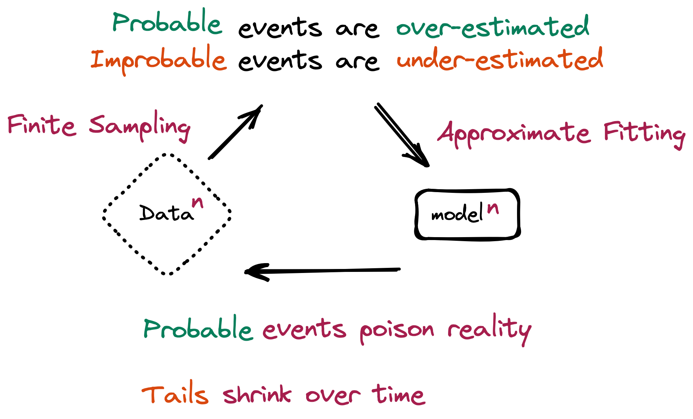

# When AI Eats AI, Human Data Gets More Expensive

_The more recursive training collapses models, the more provenance becomes a market price rather than a technical requirement_

## Executive Summary

> [!callout]
> The text and images that generative AI produces are flowing back in as training material for the next generation of AI. This recursive loop is no longer a thought experiment. By 2025, 74% of newly created web pages already contained AI-generated content. So what happens when a model keeps eating its own output? This piece reads that question not as a technical phenomenon but as a **question about the price of data**.

> When a model is retrained over and over on its own contaminated output, measurable performance collapse begins within 5 to 10 generations under the worst case, retraining on purely synthetic data. The tails of the distribution go first: the rare but important cases disappear, and the model converges toward the average. The paradox lives here. The more limitlessly AI churns out data, the scarcer verified, human-made original data becomes.

> And that scarcity is already being priced. The data licensing deals struck by Reddit and News Corp, the steep climb in premium text rates, and an "optimal provenance subsidy" derived directly by academic economists all point one way. The provenance of data is moving past a regulatory checkbox and becoming an asset condition that the market itself puts a price on.

Four numbers run through this piece.

5–10 gens

Generations until model collapse begins under pure-synthetic retraining

Under 1%

A synthetic fraction this small can already trigger strong collapse

+41%/yr

Annual rise in premium human-text licensing rates

74%

Share of new 2025 web pages containing AI content

## When a Model Eats Its Own Output

Photocopy a copy, then photocopy that copy. After a few rounds the letters smear and the colors fade. Model collapse from recursive training works much like this. When data made by one model trains the next, and the output of that model trains the one after, the richness the original held gets shaved away generation by generation.

*▲ The recursive loop in which a model eats its own output as the next generation's training data. It converges toward Data⁰ ≈ Data¹ ≈ … ≈ Dataⁿ. | Source: [Shumailov et al., The Curse of Recursion (arXiv:2305.17493)](https://arxiv.org/abs/2305.17493)*

A 2024 study by Shumailov and colleagues, published in **Nature**, was the first to measure this collapse precisely. Repeated retraining on purely synthetic data produces measurable degradation within 5 to 10 generations. But the number comes with a clear caveat: it describes the worst case, running on synthetic data alone. Mixing in even a fraction of real human data softens the collapse. That very mitigation becomes the first academic justification for the economic value of human data.

What breaks first? The tails of the distribution. Common cases flood the data, while rare, exceptional ones are few. Recursive training forgets these scarce tails first. The model increasingly produces only "average" output and loses diversity and rare knowledge. The statistically ordinary answer stays plausible, while the genuinely valuable exception vanishes.

*▲ Probable events are over-estimated and improbable ones under-estimated, so the tails shrink over time. | Source: [Shumailov et al., The Curse of Recursion (arXiv:2305.17493)](https://arxiv.org/abs/2305.17493)*

> [!callout]
> **The intuition that a small dose is harmless is wrong.** The Strong Model Collapse study (ICLR 2025) showed that under 1%, even as little as 0.1%, of synthetic data in the training set can trigger collapse, and that pouring in more data does not fix it. The problem is not the volume of synthetic data. It is the provenance.

And this contamination is not a warning about the future. It is a fact already in motion. One analysis found that 74% of new 2025 web pages contain AI-generated content, and that more than half of newly published articles were written by AI. As this content flows into the next generation's training data, the recursive contamination loop is already running at internet scale. The scarcity of human data is not a distant assumption. It is a condition that exists right now.

## Scarcity Makes a Price

In economics, price comes from scarcity. As collapse becomes structural, human data with verified provenance grows rarer, and the rarer it gets, the more it costs. This logic is not abstract. It is already written into contracts.

Reddit reported some $200 million in licensing revenue from handing its data to AI companies, and News Corp signed a deal worth more than $250 million. Meta poured roughly $14.3 billion into the data labeling firm Scale AI. Data that people wrote and people refined has started to wear a price tag as a strategic asset.

Lining up the major deals side by side makes the going rate for human data clear.

#### Reddit

$203M

Cumulative revenue from licensing community text data

#### News Corp

$250M+

Multi-year licensing deal for news content

#### Meta → Scale AI

$14.3B

Investment to secure data labeling capacity (2025)

The direction of unit prices is just as clear. Premium exclusive text licensing rates climb 41% a year. The fastest-growing segment in the data licensing market is not the standard package but the custom license. That is a signal that provenance and usage terms have become negotiable variables. Who made the data and how it was verified is now what sets the price.

> [!callout]
> The common assumption is that synthetic data replaces human data. The market moves the other way. The synthetic data generation market is growing in the low-to-mid 30% range a year, while the human data and labeling market that anchors that synthesis is also growing in the low 20% range alongside it. One is not cannibalizing the other. They **grow together**. The more synthetic data you use, the greater the demand for the human "ground truth" that holds it to reality. This is companionship, not replacement.

## When Provenance Becomes a Price Tag

If that is the market's signal, academia took a step further. The decisive primary source for this piece is an economics paper titled, from the start, **"The Economics of Model Collapse: Equilibrium, Welfare, and Optimal Provenance Subsidies in Synthetic Data Markets."** It does not stop at measuring collapse. It analyzes the equilibrium and social welfare of the synthetic data market, then derives mathematically the **optimal "provenance subsidy"** that prevents collapse.

What is a provenance subsidy? It is the optimal economic incentive assigned to the provenance of human data to hold off collapse. In other words, a price. Academia put a number directly on provenance. The paper reports that when this intervention works, performance against collapse improves by 23.1% and distributional drift is cut nearly in half. Verified provenance, it shows, is not a simple quality stamp but a measurable economic variable.

This pricing happens on top of regulatory infrastructure. The EU AI Act mandates documentation of training data provenance, and content provenance standards like C2PA, with more than 6,000 participating organizations, are heading toward international standardization. While the foundation for tracking provenance is being laid, on top of it provenance is being translated from a regulatory obligation into a condition the market puts a price on.

> [!callout]
> At one end sits the EU AI Act's **provenance documentation mandate**; at the other, the **optimal provenance subsidy** derived by academics. Both ends of the process by which a regulatory requirement turns into a market price are visible at once. The case that managing data provenance is asset investment rather than cost gets completed precisely here.

## Conclusion: The Age When Provenance Becomes Price

A single causal chain runs from start to finish. Recursive training collapses the model, collapse makes human data scarce, scarcity attaches a premium to provenance, and that premium hardens into price inside contracts and papers. The more structural the collapse, the sharper the next link in the chain becomes.

So the core question shifts from "when does the model break" to "how do we recognize and price the data that does not break." Human-generated data with verified provenance is the most honest scarce asset of the collapse era. Data that can prove who made it and how it was verified is the data that does not break.

> [!callout]
> Model collapse is not an apocalypse narrative. It is a price signal that forces us to recalculate the value of human-made data. Now that academia is subsidizing provenance and the market is pricing it, the provenance of data has stopped being a regulatory checkbox and become a price tag.

## Editor's Note

Why Pebblous pays attention to this paper is straightforward. Our thesis, that the provenance and quality of data are not technical requirements but conditions that determine asset value, was priced directly by outside academic research in the form of an "optimal provenance subsidy." Why DataClinic, which diagnoses the distributional health of data, and the AI-Ready Data infrastructure that verifies readiness for training are investments rather than costs, this piece explains in language from outside our own walls. The body of this report closes on external arguments alone; this single paragraph is an editor's note meant to connect those arguments to our work.

## References

### Academic Papers

- 1.arXiv:2605.20279 Authors. (2026). "[The Economics of Model Collapse: Equilibrium, Welfare, and Optimal Provenance Subsidies in Synthetic Data Markets](https://arxiv.org/abs/2605.20279)." arXiv Preprint.
- 2.Dohmatob, E., Feng, Y., Subramonian, A., & Kempe, J. (2024). "[Strong Model Collapse](https://arxiv.org/abs/2410.04840)." ICLR 2025.
- 3.Shumailov, I., Shumailov, Z., Zhao, Y., Gal, Y., Papernot, N., & Anderson, R. (2024). "[AI models collapse when trained on recursively generated data](https://www.nature.com/articles/s41586-024-07566-y)." _Nature_.
- 4.arXiv:2510.16657 Authors. (2025). "[Escaping Model Collapse via Synthetic Data Verification](https://arxiv.org/html/2510.16657v2)." arXiv Preprint.

### Industry & Policy Guides

- 5.AI Security and Safety. (2025). "[Model Collapse: A Guide to AI Safety](https://aisecurityandsafety.org/en/guides/model-collapse/)."
- 6.Invisible Technologies. (2026). "[AI Training in 2026: Anchoring Synthetic Data in Human Truth](https://invisibletech.ai/blog/ai-training-in-2026-anchoring-synthetic-data-in-human-truth)."

### Market & Statistics

- 7.Ahrefs. (2025). "[What Percentage of New Content Is AI-Generated? (We Checked 900K Pages)](https://ahrefs.com/blog/what-percentage-of-new-content-is-ai-generated/)."
- 8.TechCrunch. (2024). "[Reddit says it's made $203M so far licensing its data](https://techcrunch.com/2024/02/22/reddit-says-its-made-203m-so-far-licensing-its-data/)."
- 9.Digiday. (2025). "[A timeline of the major deals between publishers and AI tech companies in 2025](https://digiday.com/media/a-timeline-of-the-major-deals-between-publishers-and-ai-tech-companies-in-2025/)."
- 10.Fortune Business Insights. (2025). "[Synthetic Data Generation Market Size, Share & Industry Analysis](https://www.fortunebusinessinsights.com/synthetic-data-generation-market-108433)."
- 11.DataIntelo. (2025). "[Dataset Licensing for AI Training Market](https://dataintelo.com/report/dataset-licensing-for-ai-training-market)."
- 12.Shutterstock Investor Relations. (2025). "[Shutterstock Builds Data Licensing Strength with New AI Services](https://investor.shutterstock.com/news-releases/news-release-details/shutterstock-builds-data-licensing-strength-new-ai-services)."
- 13.Kigen. (2025). "[Data Provenance: Enhancing AI Authenticity with C2PA](https://kigen.com/resources/blog/data-provenance-enhancing-ai-authenticity/)."
