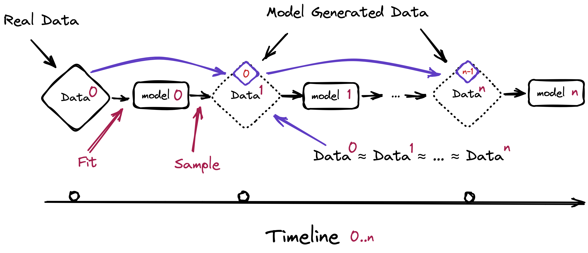

# AI가 AI를 먹으면, 인간의 데이터값이 오른다

_재귀 학습이 모델을 붕괴시킬수록, 출처(provenance)는 기술 요건이 아니라 시장 가격이 된다_

## Executive Summary

> [!callout]
> 생성형 AI가 만든 글과 그림이 다시 다음 세대 AI의 학습 재료로 들어간다. 이 재귀 루프는 더 이상 사고실험이 아니다. 2025년 새로 만들어진 웹페이지의 74%가 이미 AI 생성 콘텐츠를 품고 있다. 모델이 자기 출력을 거듭 먹으면 어떤 일이 벌어지는가. 이 글은 그 물음을 기술 현상이 아니라 **데이터 가격의 문제**로 읽는다.

> 오염된 데이터로 모델이 자기 출력을 반복 학습하면, 순수 합성 데이터만으로 재훈련하는 최악의 조건에서 5~10세대 안에 측정 가능한 성능 붕괴가 시작된다. 분포의 꼬리, 즉 드물지만 중요한 사례부터 사라지고 모델은 평균으로 수렴한다. 역설은 여기서 나온다. AI가 데이터를 무한히 찍어낼수록, 사람이 직접 만든 검증된 원본 데이터의 희소성은 거꾸로 올라간다.

> 그리고 그 희소성은 이미 값으로 매겨지고 있다. Reddit과 News Corp의 데이터 라이선싱 계약, 프리미엄 텍스트 단가의 가파른 상승, 그리고 학계가 직접 도출한 '출처 보조금(provenance subsidy)'까지. 데이터의 출처는 규제가 요구하는 체크박스를 넘어, 시장이 직접 가격을 매기는 자산 조건으로 옮겨가고 있다.

이 글을 관통하는 숫자는 네 개다.

5~10세대

순수 합성 재훈련 시 모델 붕괴가 시작되는 세대 수

1% 미만

이 비율의 합성 데이터만으로도 강한 붕괴가 유발될 수 있다

+41%/년

프리미엄 인간 텍스트 데이터 라이선싱 단가 상승률

74%

AI 콘텐츠를 포함한 2025년 신규 웹페이지 비율

## 모델이 자기 출력을 먹을 때

복사기로 복사본을 복사하고, 그 복사본을 다시 복사한다. 몇 번을 거치면 글자는 뭉개지고 색은 바랜다. 재귀 학습으로 인한 모델 붕괴는 이 비유와 닮았다. 모델이 만든 데이터로 다음 모델을 학습시키고, 그 모델의 출력으로 또 다음 모델을 학습시키는 일이 반복되면, 원본이 가지고 있던 풍부함이 세대를 거치며 깎여 나간다.

*▲ 모델이 자기 출력을 다음 세대의 학습 데이터로 먹는 재귀 루프. Data⁰ ≈ Data¹ ≈ … ≈ Dataⁿ으로 수렴한다. | Source: [Shumailov et al., The Curse of Recursion (arXiv:2305.17493)](https://arxiv.org/abs/2305.17493)*

Shumailov 등이 학술지 **Nature**에 발표한 2024년 연구는 이 붕괴를 처음으로 정밀하게 측정했다. 순수 합성 데이터만으로 재훈련을 반복하면 5~10세대 안에 측정 가능한 성능 저하가 나타난다. 다만 이 숫자에는 분명한 단서가 붙는다. '순수 합성 데이터로만' 돌리는 최악의 조건일 때다. 실제 인간 데이터를 일부만 섞어도 붕괴는 완화된다. 바로 이 완화 조건이 인간 데이터의 경제적 가치를 학술적으로 정당화하는 첫 단추가 된다.

무엇이 먼저 무너지는가. 분포의 꼬리다. 흔한 사례는 데이터에 차고 넘치지만, 드물고 예외적인 사례는 몇 안 된다. 재귀 학습은 이 희소한 꼬리부터 잊어버린다. 모델은 점점 '평균적인' 출력만 내놓고, 다양성과 희소 지식을 잃는다. 통계적으로 평범한 답은 그럴듯하게 유지되지만, 정작 가치 있는 예외는 사라진다.

*▲ 흔한 사건은 과대평가되고 드문 사건은 과소평가되며, 세대를 거치며 분포의 꼬리가 줄어든다(Tails shrink over time). | Source: [Shumailov et al., The Curse of Recursion (arXiv:2305.17493)](https://arxiv.org/abs/2305.17493)*

> [!callout]
> **조금만 섞으면 괜찮다는 직관은 틀렸다.** Strong Model Collapse 연구(ICLR 2025)는 학습셋의 1% 미만, 심지어 0.1%의 합성 데이터만으로도 붕괴가 유발될 수 있으며, 데이터를 더 부어도 해결되지 않음을 보였다. 문제는 합성 데이터의 양이 아니라 출처다.

그리고 이 오염은 미래의 경고가 아니라 지금 진행 중인 사실이다. 한 분석은 2025년 신규 웹페이지의 74%가 AI 생성 콘텐츠를 포함하고, 새로 올라온 기사의 절반 이상이 AI로 작성됐다고 집계했다. 이 콘텐츠가 다음 세대 학습 데이터로 흘러 들어가며 재귀 오염 루프는 이미 인터넷 규모에서 돌아가고 있다. 인간 데이터의 희소성은 먼 훗날의 가정이 아니라 지금 실재하는 조건이다.

## 희소성이 가격을 만든다

경제학에서 가격은 희소성에서 나온다. 붕괴가 구조화될수록 출처가 검증된 인간 데이터는 더 귀해지고, 귀해진 만큼 값이 오른다. 이 논리는 추상이 아니다. 이미 계약서에 적혀 있다.

Reddit은 자사 데이터를 AI 기업에 넘기며 2억 달러 규모의 라이선싱 매출을 보고했고, News Corp은 2.5억 달러를 웃도는 계약을 맺었다. Meta는 데이터 레이블링 기업 Scale AI에 약 143억 달러를 투입했다. 사람이 쓰고 사람이 다듬은 데이터가 전략 자산으로 가격표를 달기 시작했다.

주요 계약 규모를 나란히 놓으면 인간 데이터의 몸값이 어느 수준인지 드러난다.

#### Reddit

$203M

커뮤니티 텍스트 데이터 라이선싱 누적 매출

#### News Corp

$250M+

언론 콘텐츠 다년 라이선싱 계약

#### Meta → Scale AI

$14.3B

데이터 레이블링 역량 확보 투자(2025)

단가의 방향도 분명하다. 프리미엄 독점 텍스트 라이선싱 단가는 연 41%씩 오른다. 데이터 라이선싱 시장에서 가장 빠르게 크는 세그먼트는 표준 패키지가 아니라 '맞춤 계약(custom license)'이다. 출처와 사용 조건이 협상의 변수가 됐다는 신호다. 누가 만들었고 어떻게 검증됐는지가 곧 값을 가른다.

> [!callout]
> 흔한 통념은 '합성 데이터가 인간 데이터를 대체한다'는 것이다. 시장은 반대로 움직인다. 합성 데이터 생성 시장은 연 30%대로 커지는데, 그 합성을 앵커링할 인간 데이터·레이블링 시장도 연 20%대 초반으로 함께 큰다. 한쪽이 다른 쪽을 갉아먹는 게 아니라 **같이 성장한다**. 합성 데이터를 많이 쓸수록, 그것을 현실에 붙들어 둘 인간의 '진실 데이터(human truth)' 수요가 오히려 커지기 때문이다. 대체가 아니라 동반이다.

## 증적이 가격표가 되는 순간

여기까지가 시장의 신호라면, 학계는 한 걸음 더 나아갔다. 이 글의 결정적 1차 소스인 한 경제학 논문은 제목부터 **「모델 붕괴의 경제학: 합성 데이터 시장의 균형, 후생, 그리고 최적 출처 보조금」**이다. 붕괴를 측정하는 데서 그치지 않고, 합성 데이터 시장의 균형과 사회적 후생을 분석한 뒤 붕괴를 막는 **최적의 '출처 보조금(provenance subsidy)'**을 수학적으로 도출했다.

출처 보조금이란 무엇인가. 붕괴를 막기 위해 인간 데이터의 출처에 부여하는 최적의 경제적 인센티브, 다시 말해 가격이다. 학계가 출처에 직접 값을 매겼다. 논문은 이 개입이 작동할 때 붕괴 대비 성능이 23.1% 개선되며, 분포의 드리프트가 절반 가까이 줄어든다고 보고한다. '검증된 출처'가 단순한 품질 표시가 아니라 측정 가능한 경제적 변수임을 보여준 셈이다.

이 가격화는 규제 인프라 위에서 일어난다. EU AI Act는 학습 데이터의 출처를 문서화하도록 의무화하고, C2PA 같은 콘텐츠 출처 표준에는 6,000곳이 넘는 기관이 참여하며 국제 표준화로 향하고 있다. 출처를 추적하는 기반이 깔리는 동안, 그 위에서 출처는 규제가 요구하는 의무를 넘어 시장이 값을 매기는 조건으로 번역되고 있다.

> [!callout]
> 한쪽 끝에는 EU AI Act의 **출처 문서화 의무**가 있고, 다른 쪽 끝에는 학계가 도출한 **최적 출처 보조금**이 있다. 규제 요건이 시장 가격으로 옮겨가는 과정의 양 끝이 동시에 관측된다. 데이터의 증적(provenance)을 관리하는 일이 비용이 아니라 자산 투자인 근거가, 바로 이 지점에서 완성된다.

## 결론: 출처가 값이 되는 시대

하나의 인과 사슬이 처음부터 끝까지 이어진다. 재귀 학습이 모델을 붕괴시키고, 붕괴는 인간 데이터를 희소하게 만들며, 희소성은 출처에 프리미엄을 붙이고, 그 프리미엄은 계약서와 논문 속에서 가격으로 굳어진다. 붕괴가 구조화될수록 이 사슬의 다음 칸은 더 분명해진다.

그래서 핵심 질문은 '모델이 언제 무너지는가'가 아니라 '무너지지 않는 데이터를 어떻게 알아보고 값을 매기는가'로 옮겨간다. 출처가 검증된 인간 생성 데이터는 붕괴의 시대에 가장 정직한 희소 자산이다. 누가 만들었고 어떻게 검증됐는지를 증명할 수 있는 데이터가, 무너지지 않는 데이터다.

> [!callout]
> 모델 붕괴는 종말의 서사가 아니다. 그것은 인간이 만든 데이터의 값을 다시 계산하게 만드는 가격 신호다. 학계가 출처에 보조금을 매기고 시장이 출처에 단가를 붙이는 지금, 데이터의 증적은 규제 체크박스가 아니라 가격표가 됐다.

## Editor's Note

페블러스가 이 논문에 주목하는 이유는 분명하다. "데이터의 출처와 품질은 기술 요건이 아니라 자산 가치를 결정하는 조건"이라는 우리의 명제를, 외부 학술 연구가 '최적 출처 보조금'이라는 형태로 직접 가격화해 주었기 때문이다. 데이터의 분포 건강도를 진단하는 DataClinic, 학습에 투입될 준비를 검증하는 AI-Ready Data 인프라가 왜 비용이 아니라 투자인지를, 이 글은 우리 바깥의 언어로 설명한다. 본문은 외부 논거만으로 닫았고, 이 한 단락은 그 논거를 우리 일과 잇기 위한 편집자 주석이다.

## 참고문헌

### 학술 논문

- 1.arXiv:2605.20279 Authors. (2026). "[The Economics of Model Collapse: Equilibrium, Welfare, and Optimal Provenance Subsidies in Synthetic Data Markets](https://arxiv.org/abs/2605.20279)." arXiv Preprint.
- 2.Dohmatob, E., Feng, Y., Subramonian, A., & Kempe, J. (2024). "[Strong Model Collapse](https://arxiv.org/abs/2410.04840)." ICLR 2025.
- 3.Shumailov, I., Shumailov, Z., Zhao, Y., Gal, Y., Papernot, N., & Anderson, R. (2024). "[AI models collapse when trained on recursively generated data](https://www.nature.com/articles/s41586-024-07566-y)." _Nature_.
- 4.arXiv:2510.16657 Authors. (2025). "[Escaping Model Collapse via Synthetic Data Verification](https://arxiv.org/html/2510.16657v2)." arXiv Preprint.

### 업계·정책 가이드

- 5.AI Security and Safety. (2025). "[Model Collapse: A Guide to AI Safety](https://aisecurityandsafety.org/en/guides/model-collapse/)."
- 6.Invisible Technologies. (2026). "[AI Training in 2026: Anchoring Synthetic Data in Human Truth](https://invisibletech.ai/blog/ai-training-in-2026-anchoring-synthetic-data-in-human-truth)."

### 시장·통계

- 7.Ahrefs. (2025). "[What Percentage of New Content Is AI-Generated? (We Checked 900K Pages)](https://ahrefs.com/blog/what-percentage-of-new-content-is-ai-generated/)."
- 8.TechCrunch. (2024). "[Reddit says it's made $203M so far licensing its data](https://techcrunch.com/2024/02/22/reddit-says-its-made-203m-so-far-licensing-its-data/)."
- 9.Digiday. (2025). "[A timeline of the major deals between publishers and AI tech companies in 2025](https://digiday.com/media/a-timeline-of-the-major-deals-between-publishers-and-ai-tech-companies-in-2025/)."
- 10.Fortune Business Insights. (2025). "[Synthetic Data Generation Market Size, Share & Industry Analysis](https://www.fortunebusinessinsights.com/synthetic-data-generation-market-108433)."
- 11.DataIntelo. (2025). "[Dataset Licensing for AI Training Market](https://dataintelo.com/report/dataset-licensing-for-ai-training-market)."
- 12.Shutterstock Investor Relations. (2025). "[Shutterstock Builds Data Licensing Strength with New AI Services](https://investor.shutterstock.com/news-releases/news-release-details/shutterstock-builds-data-licensing-strength-new-ai-services)."
- 13.Kigen. (2025). "[Data Provenance: Enhancing AI Authenticity with C2PA](https://kigen.com/resources/blog/data-provenance-enhancing-ai-authenticity/)."
