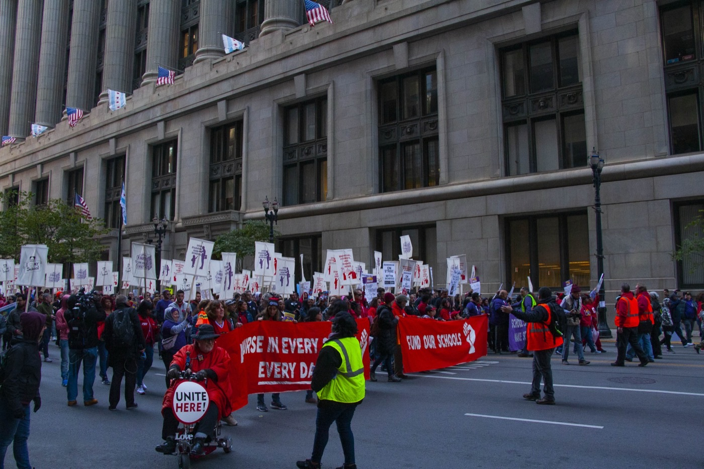
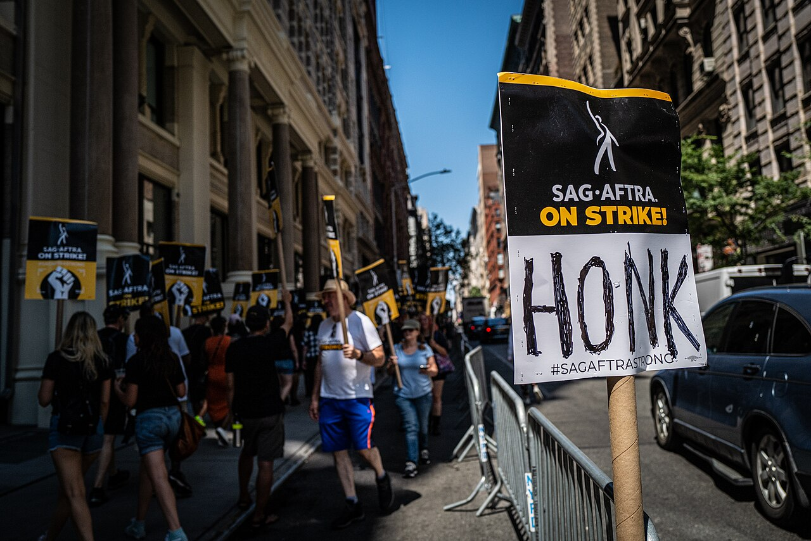

# The Most AI-Exposed Workers Have No Seat at the Table

_A map of U.S. labor data where AI exposure meets union protection_

## Executive Summary

> [!callout]
> Most of the AI-automation debate stays fixed on one question: "who loses their job?" But overlay two axes of U.S. labor data and a more structural mismatch appears. **The more exposed an occupation is to automation, the less likely it is to have a seat at the bargaining table.** In the U.S. Bureau of Labor Statistics' 2025 tally, the union representation rate for computer and math occupations is 4.4%, while low-exposure education occupations sit at 35.9%. This report puts exposure and union representation on a single map to see, in coordinates, exactly where the shield has piled up.

> The negative correlation is real, but its range has to be stated honestly. Across all 22 major occupation groups it is weak (r≈−0.16); narrow to the professional super-group the hook actually targets and it sharpens (r≈−0.70). Because the market's own bargaining does not fill this vacuum, regulation is beginning to move into it: California's Executive Order N-6-26 (signed 2026-05-21) explicitly names "how collective bargaining addresses AI in organized workplaces" as an item for review. For every occupation that is not organized, not even that sentence exists yet.

> The heart of this work is data alignment. Exposure indices reshuffle their rankings by method (re-score the same O*NET data with a different AI model and the share of "high-exposure" occupations swings by a factor of 19), and exposure is an occupation-axis measure while the hook's "finance 1.1%" is an industry-axis measure, two different coordinate systems from the start. To overlay two datasets, you have to align the classifications first. Mapping a policy gap is, precisely, that act of alignment.

<!-- stat-card -->
**4.4% vs 35.9%** — Computer & math vs. education representation — The most exposed occupation is protected at ~1/8 the rate of the least exposed

<!-- stat-card -->
**~46.2 million** — White-collar workers with no seat at the table — 93.3% of workers in the top-5 exposed groups (this report's calculation)

<!-- stat-card -->
**19×** — Spread when the exposure index is re-scored — Same data, different model → high-exposure share of 2.7%–51.5%

<!-- stat-card -->
**101,743** — AI-attributed cuts, first-half 2026 — Nearly double the entire 2025 total (54,836) — Challenger

## The Map of the Mismatch — Exposure and Protection Look in Different Directions

The map has two axes. On the horizontal axis, put "how much of this occupation's work AI could theoretically do" (exposure); on the vertical axis, "how much of a union bargaining table this occupation actually has" (representation). The size of each circle is headcount. The two axes point in different directions. In the lower right (high exposure, low protection) white-collar professions cluster densely: computer & math, business & finance, management, office & administrative support, legal. In the upper left (low exposure, high protection) education and public safety sit off on their own.

*12 representative groups of the 22 BLS major categories. Horizontal axis (exposure) = Anthropic (2026-03) theoretical AI coverage; vertical axis (representation) and circle size (employment) = BLS Table 3 (2025). The shaded lower right is the "high exposure · low protection" quadrant. Seven white-collar professions (computer & math, business & finance, management, office & administrative support, legal, engineering, arts & media) cluster there.*

This picture is the report in a single line. **The shield has piled up where it is least needed.** Computer & math and business & finance occupations, rated as theoretically 94%-automatable, carry union representation rates of just 4–6%, while education, whose exposure is only about two-thirds as high, has 35.9% inside a bargaining structure. If exposure and protection pointed the same way, the dots would line up toward the top-right or bottom-left; instead they scatter along the opposite diagonal.

### 1.1. Putting 22 occupations onto a coordinate plane

Below is the raw data behind the chart, sorted from most to least exposed, with union representation and employment in the two right-hand columns. The top five rows (shaded) are the most-exposed white-collar occupations, and you can see with the naked eye that every one of their representation rates is a single digit.

| Occupation (BLS major group) | Theoretical AI exposure | Union representation | Employment |
| --- | --- | --- | --- |
| Computer & math | 94.3% | 4.4% | 6.51M |
| Business & finance | 94.3% | 5.8% | 9.08M |
| Management | 91.3% | 5.0% | 16.55M |
| Office & admin support | 90.0% | 9.9% | 15.76M |
| Legal | 89.0% | 8.5% | 1.60M |
| Engineering | 84.8% | 7.7% | 3.59M |
| Arts, design & media | 83.7% | 7.6% | 2.39M |
| Life, physical & social science | 77.0% | 12.7% | 1.79M |
| Sales | 62.0% | 3.1% | 12.21M |
| Education | 61.7% | 35.9% | 9.37M |
| Healthcare practitioners & technical | 59.9% | 13.5% | 9.75M |
| Protective service | 31.6% | 34.1% | 3.33M |
| Transportation & logistics | 12.1% | 14.1% | 11.08M |
| Construction & extraction | 16.9% | 17.4% | 6.85M |

Data note The exposure column uses Anthropic's 2026-03 data (which maps 1:1 onto the major groups) because the original papers (Eloundou, AIOE) do not publish a major-group average table. That substitution is itself a live example of the data-alignment problem discussed later (Section 5). The table shows 14 representative groups of the 22 major categories. Note too that the 2025 union representation figures are 11-month averages: the October federal-government shutdown dropped that month's CPS survey — so this is not an exactly like-for-like comparison with prior years.

### 1.2. The correlation is real, but it sharpens only when the range narrows

Measuring the negative correlation as a number calls for honesty. Across all 22 major groups, the Pearson correlation between exposure and representation is r≈−0.16. The sign matches the hypothesis, but it is weak. Public-sector over-organization pulls hard toward the low-exposure, high-protection corner (protective service at 31.6% exposure yet 34.1% representation; education at 61.7% exposure, 35.9% representation), while low-exposure, low-protection groups like sales and transportation muddy the line.

Narrow to what the hook actually compares — the 10 major groups of the management-and-professional super-group, and it sharpens to r≈−0.70. In other words: saying "across the whole labor market, exposure and protection move inversely" overstates it, but limiting the claim to "within professional occupations, more exposure means a thinner shield" is clearly supported by the data. That said, this 10-group analysis rests on a small sample (n=10) where education carries outsized weight; drop education and the correlation could weaken. The coefficients are values this report computed directly and are reproducible; no significance test (p-value) was performed.

> [!callout]
> The map's conclusion is not a verdict but an alignment. Overlay exposure and protection on one coordinate plane and a structure becomes visible: where the risk is greatest, the buffer is thinnest. To keep from overstating that structure, you have to write down both the range ("within professional occupations") and the limitation ("a directly computed correlation"). That is the first rule of mapping a policy gap with data.

## Exposure Has More Than One Yardstick

The horizontal axis in Section 1 was lumped together under one phrase, "AI exposure." But that axis is actually several different numbers, measured several different ways. There are four leading methods for gauging exposure, and the four rank the same occupations differently. That is exactly why this report reads exposure only as a "direction," never as a fixed score.

### 2.1. Four exposure indices, four lenses

Each of the four looks at something different. **Eloundou et al.'s "GPTs are GPTs"** (2023, _Science_ 2024) has humans and GPT-4 jointly score how substitutable each O*NET task is by an LLM — the source of the finding that roughly 80% of the U.S. workforce could see LLM impact on at least 10% of their tasks. **Felten, Raj & Seamans' AIOE** (2021) matches the application areas where AI excels to the abilities a job requires. **Webb** (2020) measures exposure by the vocabulary overlap between patent text and job descriptions. **The Anthropic Economic Index** uses not theory but observed usage rates in real Claude conversation logs.

The direction largely converges. Computer & math and clerical work at the top, education and manual labor near the bottom: the four indices mostly agree on that ordering; one follow-up study reports a rank correlation (Spearman ρ) of 0.84 between its own measure and AIOE. The trouble is in the detail, and finance most of all.

### 2.2. Finance swings between top and bottom depending on the index

The same finance occupations land in the most-exposed tier on one index and the least-exposed tier on another. Felten's AIOE puts information-heavy finance roles — credit analysts, financial analysts — at the very top of exposure. Webb's patent-based method, by contrast, drops finance and insurance into the lowest group, because it is labor that patents represent poorly. The correlation between the two indices' exposure scores is just 0.31. The answer to "how exposed is finance to AI?" flips to the opposite depending on the method.

| Index | Measurement approach | Where finance lands |
| --- | --- | --- |
| Eloundou (GPTs are GPTs) | LLM substitutability of O*NET tasks (human + GPT-4 scoring) | Upper tier (many information-processing tasks) |
| Felten AIOE | AI applications × job abilities matching | Very top tier |
| Webb (patent-based) | Patent text × job text overlap | Lowest group |
| Anthropic (real usage) | Observed Claude conversation / API logs | Middle tier (real usage 28.4%) |

********

### 2.3. Same data, different model — a 19× swing in the verdict

It is not only the gap between indices. Even within a single index, swapping the scoring model makes the result lurch. A recent study that directly stress-tested the reliability of exposure indices (arXiv:2606.23633) re-scored the same O*NET task data with Gemini, GPT-4, Claude 4.5, and GPT-5 in turn. The share of occupations judged "high-exposure" then spread from 2.7% to 51.5% — roughly **19×**. That means the exposure number depends substantially not on the data but on the scorer (the model).

> [!callout]
> Hold the input fixed and change only the scoring model, and the high-exposure share swings 2.7%↔51.5%, a factor of 19. Quote an exposure score to the decimal as if it were an established fact, and you are really quoting the scorer's taste. That is why this report reads exposure only as a direction and never as a fixed score.

### 2.4. Real-usage data backs the direction most strongly

As the theoretical indices wobble, the weight of actual usage data grows. Per the Anthropic Economic Index (2026), computer & math-related tasks account for 34% of Claude.ai conversations and 44–46% of enterprise API usage. Given that this occupation is only about 4% of total employment, its usage concentration runs 9–12× its employment share. Because it observes what AI is actually doing now rather than what it theoretically could do, it carries higher confidence.

The same data also gives a signal in the opposite direction. Computer & math's theoretical exposure is 94.3%, but its real-usage exposure is 35.8%, a gap of 2.5–3×. That is the distance between "what AI can do" and "what AI is actually doing." The gap does not mean exposure is overstated; it can be read as exposure having already arrived but not yet reaching its ceiling. If the problem is the gap in protection, that gap has room to widen further.

## Why Does the Shield Sit Exactly There?

It is no accident that protection clusters in the upper left of the map. U.S. unions have historically taken root only in particular places. Organizing concentrated in the public sector, education, public safety, transportation, and manufacturing, while tech, finance, and clerical white-collar work stood outside it from the start. Education's 35.9% and public safety's 34.1% representation rates are high not because those occupations are especially resistant to AI, but because they had already built a bargaining structure in the pre-AI era.

*▲ A 2019 Chicago Teachers Union (CTU) rally. Education's high representation rate (35.9%) reflects a bargaining structure already built in the pre-AI era, not any special resistance to AI. | Source: [Wikimedia Commons (Charles Edward Miller, CC BY-SA 2.0)](https://commons.wikimedia.org/wiki/File:Chicago_Teachers_Union_Rally_10-14-19_3703_(48905846123).jpg)*

### 3.1. Top-5 exposed groups at 6.3% vs. top-3 protected groups at 28.6%

Put the gap in numbers, with the caveat that the multiple depends on how you cut the "top" groups, so the composition is shown alongside it. The five most-exposed white-collar occupations average 6.3% representation; the three most-organized groups average 28.6%. About a 4.5× difference.

| Top-5 exposed groups | Representation | Top-3 protected groups | Representation |
| --- | --- | --- | --- |
| Computer & math | 4.4% | Education | 35.9% |
| Business & finance | 5.8% | Protective service | 34.1% |
| Management | 5.0% | Community & social service | 15.9% |
| Legal | 8.5% |  |  |
| Engineering | 7.7% |  |  |
| Average | 6.3% | Average | 28.6% |

****************

How to read it This 4.5× shifts with how you group the "most exposed" and "most protected." The composition above gives 4.5×, but add office & admin support (9.9%) to the exposed group and the gap narrows. So read the composition list, not a single multiple.

### 3.2. Why tech, finance, and clerical work never organized

The white-collar non-union story has several layers. Silicon Valley long wore an anti-union culture like a brand, and stock options and individual negotiation displaced collective bargaining. Attempts to unionize clerical work recurred throughout the 20th century but rarely took durable hold. In finance, high pay and individual performance bonuses weakened the incentive to organize. As a result, when AI exposure surged in the 2020s, these occupations met that moment already lacking any bargaining structure.

The key point is that bargaining power, in the face of technological change, works "only where it already exists." An organized occupation can put the speed, scope, and terms of AI adoption on the table and contest them; an unorganized occupation has no table at all. Given the same exposure, one side negotiates the terms and the other is simply notified.

Here it is worth revisiting an earlier discussion that likened organizational "inertia" to a shield. Pebblous previously examined [the shield of organizational inertia](/blog/ai-jobs-organizational-friction/en/): the view that a large organization's slow adoption pace acts as a buffer, buying workers time. The two views operate at different levels. If organizational inertia is the buffer that buys time, a union is the only institutional mechanism that can actually negotiate the terms during that borrowed time. Inertia delays adoption; a union negotiates it. For the most exposed occupations, both shields are thin.

> [!callout]
> The shield sits there not because the place is safe, but because that place was already organized before AI. Bargaining power does not spring up when the technology changes. It works only where it existed before the change. Exposure does not summon a shield; the shield lies along a historical concentration that has nothing to do with exposure.

## When There Is No Table, Regulation Takes the Empty Seat

Having no bargaining table is not an abstract absence. When workers have no voice in the decision to adopt AI, three things change: how many days' notice precede a layoff, whether retraining is offered, and how far the speed and scope of adoption are pushed. In organized occupations these three become clauses in an agreement; in unorganized ones they become the employer's discretion. And when the market's own bargaining fails to fill that vacuum, regulation begins to move toward the vacant seat.

This absence is a felt reality before it is a statistic. In a Pew Research survey conducted in October 2024, 52% of U.S. workers said they were "worried" about AI use in the workplace, and 32% expected their opportunities to shrink over the long run. Notably, lower- and middle-income workers were more likely than high earners to say "AI will reduce my opportunities." And actual use is spreading fast: the share of workers using at least some AI at work rose from 16% in October 2024 to roughly 21% a year later (10% said they use it daily). Worry and use are growing together, yet for most occupations the channel to negotiate the terms of adoption still does not exist.

### 4.1. Organized occupations negotiated — the SAG-AFTRA contrast

High exposure can still be governed when there is a table. The actors' and voice performers' union [SAG-AFTRA secured the scope, consent, and compensation for AI use in a collective-bargaining agreement](/blog/sag-aftra-ai-consent-collective-bargaining/en/). Dealing with assets extraordinarily exposed to AI replication (voice and face), it nonetheless nailed down "when and how they may be replicated" in contract language, through an organized bargaining structure. The problem is that this channel does not exist for most highly exposed white-collar occupations. Given the same exposure, SAG-AFTRA negotiates while unorganized data and clerical occupations are notified.

*▲ A 2023 SAG-AFTRA strike picket. Even while handling assets extraordinarily exposed to AI replication — voice and face — an organized bargaining structure let the union lock down the terms of AI use in contract language. | Source: [Wikimedia Commons (Phil Roeder, CC BY 2.0)](https://commons.wikimedia.org/wiki/File:SAG-AFTRA_Picket_(53084605016).jpg)*

### 4.2. California EO N-6-26 — the first sentence aimed at the union's vacant seat

On May 21, 2026, California Governor Gavin Newsom signed Executive Order N-6-26. Per K&L Gates' analysis, the order imposes no immediate obligations; it is a study-and-review directive that assigns phased tasks to several state agencies. Among them, the Labor and Workforce Development Agency (LWDA) is directed to review "how collective bargaining addresses AI in organized workplaces." It is, at present, almost the only line of text that engages head-on with this report's "no bargaining table" frame.

*▲ The California State Capitol in Sacramento. Executive Order N-6-26, signed here on May 21, 2026, is the first line of text aimed at the seat unions left vacant. | Source: [Wikimedia Commons (Tony Webster, CC BY 2.0)](https://commons.wikimedia.org/wiki/File:The_California_State_Capitol_Building,_Sacramento_(32884057540).jpg)*

2026.05.21Gov. Newsom signs EO N-6-26. No immediate obligations; a study-and-review directive.

2026.08.19First report due. Initial analysis of AI's impact on the labor market.

180 daysReview of whether to expand the WARN Act (advance notice of mass layoffs).

2026.10.15Deadline for multiple agency directives, including review of how collective bargaining treats AI.

What matters is the weight. Per K&L Gates' analysis, this order is not an obligation that compels anything right now but the start of a review; for it to become actual legislation, look to after 2027. It is true that regulation is moving toward the union's vacant seat, but, without overstating, we note that it is still at the "review" stage. (This is a citation of a law firm's public analysis, not legal advice.)

### 4.3. The gap intersects with the layoffs happening now

This gap is not an abstract statistic. Per Challenger, Gray & Christmas, layoff notices that named AI as the reason totaled 101,743 in the first half of 2026, nearly double the full-year 2025 figure (54,836). The tech sector alone announced 139,156 cuts in the first half (+83% year over year). In finance, Block cut 4,000 (2026-02) and Coinbase 700 (2026-05), while Citigroup set a target of roughly 20,000 cuts by the end of 2026.

Balance is needed, though. One researcher notes that finance's 2026 layoff data shows no particular spike, arguing that AI's impact shows up first as hiring slowdowns and attrition rather than mass layoffs, the quiet way of shrinking, without announcements. So the layoff figures should be read for direction, avoiding a causal verdict of the "AI cut this many" kind. What is certain is that employment adjustment is under way in the most exposed occupations, and that in most of them there is no institutionally guaranteed channel for workers' voice in that adjustment.

> [!callout]
> Regulation enters the vacuum the market cannot fill. California's EO N-6-26 wrote, for the first time, a sentence aimed at the seat unions left vacant, but it is still at the review stage, and its subject is workplaces that are already organized. For the many unorganized, highly exposed occupations, there is neither a bargaining table nor, yet, a line of regulation aimed at them.

## Align the Coordinate Systems Before You Overlay

What this report did was overlay two datasets — an exposure measure and union statistics — on one coordinate plane. Overlaying looks easy, but in practice you have to align the coordinate systems before you can overlay them. That alignment ran into three traps, and those three are this piece's data-integrity story. This is why Pebblous views the matter from an observer's seat rather than as advocate or critic: not the pro/con of AI's spread, but the alignment work of surfacing a policy gap through data, which has the same shape as what we do every day.

### 5.1. Trap one — mixing the occupation axis and the industry axis distorts the quadrants

The hook's three figures are all verifiable in BLS. But "computer & math 4.4%" and "education 35.9%" are occupation-axis values, whereas "finance 1.1%" is an industry-axis value. BLS's occupation classification has no category called "Finance" at all; the nearest occupation is "Business and financial operations," whose representation rate is 5.8%. That is, unify finance onto the occupation axis and you must use 5.8%, not 1.1%. The conclusion that both are low is the same, but plot a scatter chart with the axes mixed and the same "finance" lands in two places on the map. That is why this report states, every time, which axis a figure is on.

### 5.2. Trap two — the correlation moves from −0.16 to −0.70 with the range

From the same data, the correlation coefficient moves from −0.16 (all 22 groups) to −0.70 (10 professional groups) depending on how many occupations you include. Neither is false. But say only "exposure and protection move inversely" without stating the range, and the reader cannot tell whether that sentence is a law of the whole labor market or a tendency within professional occupations. The honesty of data lies not in the number but in the boundary within which the number holds.

### 5.3. Trap three — change the scoring model and the exposure verdict swings 19×

The 19× spread from Section 2 is the most fundamental trap when overlaying exposure indices. Depending on which AI model scores the same O*NET tasks, the share of high-exposure occupations spreads from 2.7% to 51.5%. On top of that, the original Eloundou/AIOE papers carry no major-group average table, so this report substituted Anthropic's secondary data to align onto the major-group axis. Leaving a footnote for "which index to trust, how to align, and what was substituted for what": that is the real work of overlaying.

### 5.4. A problem of the same shape — data integrity as the substructure

One can offer the view that these three traps share their shape with the problem Pebblous works on through AI-Ready Data and DataClinic. To overlay data from multiple sources into a single decidable form, you must first align and validate the classification (occupation vs. industry), the measurement methodology (each index scores differently), and the substitution history (missing in the source paper → secondary source). The SOC↔index↔BLS mapping problem that arose in overlaying exposure and protection is isomorphic to the quality-and-integrity problems of training and evaluation data. The alignment obstacles this report met in social and policy data are a miniature of the very obstacles that data-quality practice faces every day. (This connection to our own work is offered as a perspective, not a verdict.)

Practically, this map is also useful to companies adopting AI. Read from the data which occupations sit in the high-exposure, low-protection quadrant, and which disclosure and notice obligations (WARN expansion, collective-bargaining review) are approaching, and you can factor labor and regulatory variables into adoption decisions ahead of time. The broader context of the AI labor-market reshaping continues in our report on [expert data and the labor market](/report/expert-data-labor-market-2026/en/).

> [!callout]
> Mapping a policy gap comes down, in the end, to aligning coordinate systems. More important than the conclusion that exposure and protection are misaligned is the discipline of stating which axis, which index, and which substituted value you used to measure that misalignment. On this matter Pebblous does not sell an answer. Honestly overlaying where the data diverges: that is the observer's seat.

## References

### Academic Papers

- 1.Eloundou, T., Manning, S., Mishkin, P., & Rock, D. (2023/2024). "GPTs are GPTs: An Early Look at the Labor Market Impact Potential of Large Language Models." _Science_, 384(6702). [arXiv:2303.10130](https://arxiv.org/abs/2303.10130)
- 2.Felten, E., Raj, M., & Seamans, R. (2021). "Occupational, Industry, and Geographic Exposure to Artificial Intelligence." _Strategic Management Journal_, 42(12), 2195–2217. (AIOE data: [github.com/AIOE-Data/AIOE](https://github.com/AIOE-Data/AIOE))
- 3.Webb, M. (2020). "The Impact of Artificial Intelligence on the Labor Market." SSRN Working Paper. [web.stanford.edu](https://web.stanford.edu/~mww/webb_jmp.pdf)
- 4."AI Exposure Scores: what they measure, what they miss, and what comes next." (2026). [arXiv:2606.23633](https://arxiv.org/abs/2606.23633) — re-scoring the same tasks across models shifts the "high-exposure" share from 2.7% to 51.5% (~19×).

### Policy & Statistics

- 5.U.S. Bureau of Labor Statistics (2026). "[Union Members — 2025](https://www.bls.gov/news.release/union2.t03.htm)," news release USDL-26-0229, 2026-02-18. Table 3: Union affiliation by occupation and industry, 2024–2025 annual averages.
- 6.U.S. Bureau of Labor Statistics. "[CPS Table 42](https://www.bls.gov/cps/cpsaat42.htm)" (annual averages).
- 7.Anthropic (2026). _Labour Market Impacts of AI: A New Measure and Early Evidence_ (2026-03-14); Anthropic Economic Index report series (2026-01, 2026-03). [anthropic.com/economic-index](https://www.anthropic.com/economic-index)
- 8.Pew Research Center (2025). "[U.S. Workers More Worried Than Hopeful About Future AI Use in the Workplace](https://www.pewresearch.org/social-trends/2025/02/25/u-s-workers-are-more-worried-than-hopeful-about-future-ai-use-in-the-workplace/)" (2025-02-25).
- 9.Executive Order N-6-26 (Newsom, 2026-05-21). [gov.ca.gov](https://www.gov.ca.gov/)
- 10.K&L Gates (2026). "[California Lays the Groundwork for More Sweeping AI Workforce Regulation](https://klgates.com/California-Lays-the-Groundwork-for-More-Sweeping-AI-Workforce-RegulationEmployers-Should-Start-Preparing-Now-6-8-2026)" (client alert, 2026-06-08). Law-firm public analysis — not legal advice.
- 11.Challenger, Gray & Christmas (2026). First-half 2026 layoff tally — 101,743 AI-attributed cuts (cross-verified across outlets).
- 12.NOTUS (Jade Lozada, 2026-06-12). "[Labor Unions and AI](https://www.notus.org/technology/labor-unions-ai)." Used for narrative and field quotes — not the source of the occupation-level figures.

### Related Pebblous Reading

- 13.Pebblous (2026). "[The Shield That Guards Jobs: Organizational Inertia](/blog/ai-jobs-organizational-friction/en/)" — the contrasting "shield" metaphor.
- 14.Pebblous (2026). "[SAG-AFTRA's AI Consent and Collective Bargaining](/blog/sag-aftra-ai-consent-collective-bargaining/en/)" — an organized occupation that negotiated AI.
- 15.Pebblous (2026). "[California AI Surplus Sharing](/blog/california-ai-surplus-sharing/en/)" — adjacent California AI labor policy.
- 16.Pebblous (2026). "[Expert Data and the Labor Market](/report/expert-data-labor-market-2026/en/)" — the broader AI labor-market reshaping.
