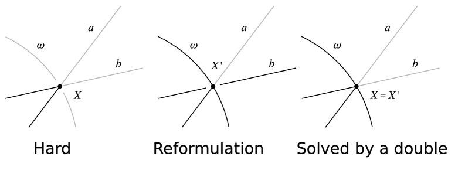
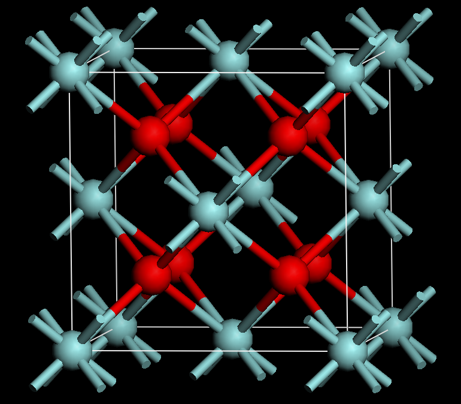
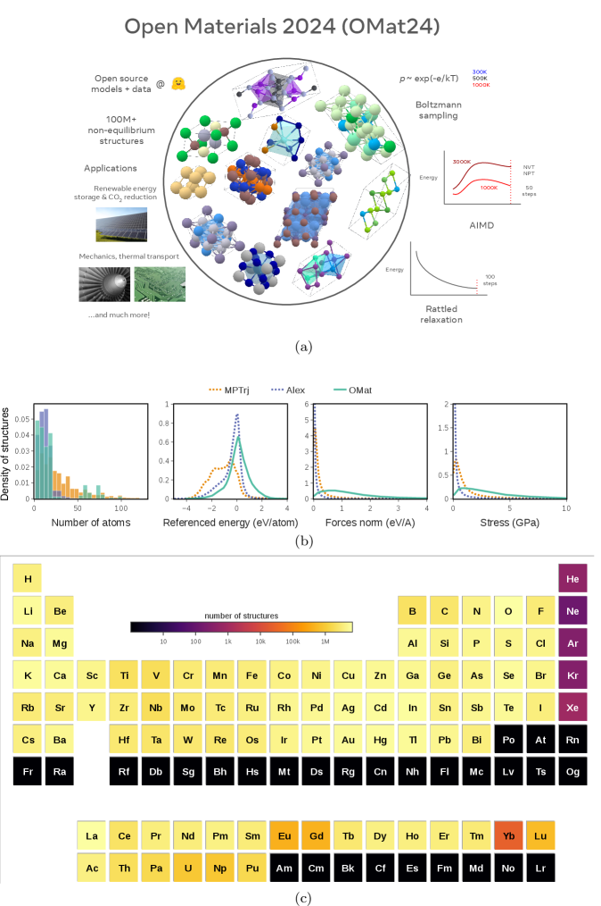

# AI가 다시 쓰는 과학의 질문

_AlphaGeometry부터 신물질 탐색까지, AI가 수학·물리학의 발견 과정을 다시 쓰는 법 — 그리고 그 신뢰를 떠받치는 데이터_

## Executive Summary

> [!callout]
> AI가 과학에 일으킨 진짜 변화는 답을 더 빨리 내는 것이 아니다. 어떤 질문과 추측을 던질지, 그 첫 단계를 바꿔 놓았다. 2021년 딥마인드와 수학자들이 24만 개 매듭의 기하 정보를 딥러닝에 보여주자, 모델은 인간이 보지 못한 두 양 사이의 연결을 추측으로 먼저 제안했다([Davies et al., _Nature_ 2021](https://www.nature.com/articles/s41586-021-04086-x)). 발견은 보통 추측을 세우고, 증명이나 해를 찾고, 그 결과를 검증하는 세 단계를 거친다. 그동안 AI는 가운데 단계, 빠른 계산에 머물렀다. 지금의 변곡점은 AI가 첫 단계, 질문을 만드는 자리로 올라섰다는 데 있다. 이 글은 그 전환이 수학과 물리·재료에서 어디까지 진짜였는지를 본다.

> 전환은 헤드라인이 아니라 조건과 함께 읽어야 정확하다. 수학에서 AI는 2024년 국제수학올림피아드(IMO)에서 28/42점 은메달 기준에 1점 차로 닿았고, 1년 뒤 자연어만으로 35/42점, 공식 인증된 금메달 기준에 올라섰다. 다만 2024년은 전문가가 문제를 형식언어로 손수 옮기고 며칠을 연산한 결과였다. 재료과학의 GNoME는 안정한 결정 구조 220만 개를 예측했지만, 같은 시기 외부 연구실이 실제로 합성해 확인한 것은 736개였다. 예측과 검증 사이에는 늘 세 자릿수, 네 자릿수의 간극이 있다.

> 그래서 남는 질문은 신뢰다. AI가 던지는 질문이 많아질수록, 그 질문이 어떤 데이터의 경계 안에서 나왔는지를 따지는 일이 중요해진다. AI 재료 발견의 가장 흔한 실패는 무질서한 상을 질서 있는 상으로 잘못 보는 것인데, 이는 절대영도의 완벽한 질서를 가정하는 학습 데이터의 편향이 그대로 모델로 옮겨 간 결과다. 발견의 신뢰는 결국 학습·검증 데이터의 품질과 커버리지, 출처 추적 가능성에 달려 있다. 페블러스가 AI-Ready 데이터와 DataClinic으로 다루는 바로 그 층이다.

**편집자의 노트.** 데이터와 AI의 경계를 측정하는 일이라면 페블러스는 늘 관심이 간다. 그것이 기초과학 발견의 신뢰에 관한 문제라면 더욱 그렇다. 이 글은 AI가 발견을 '대신'하는가를 묻지 않는다. 발견의 어느 단계를 AI가 맡았고, 그 결과를 사람과 기계가 어떻게 검증했는지를 단계별로 분리해 본다. 본문은 Nature 2026년 6월 피처([d41586-026-01820-1](https://www.nature.com/articles/d41586-026-01820-1))를 도입점으로 삼되, 모든 수치는 1차 논문에서 다시 확인했다.

### 주요 수치

네 숫자가 이 글의 뼈대다. 모두 '주장된 규모'와 '검증된 규모'를 함께 보여준다.

<!-- stat-card -->
**2.2M → 736** — 신물질 예측 vs 검증 — GNoME 예측 220만, 외부 실험 합성 736

<!-- stat-card -->
**28 → 35** — IMO 은→금 (/42점) — 2024 은메달급 → 2025 금메달 인증

<!-- stat-card -->
**496 → 512** — cap set 하한 개선 — FunSearch, 20년 만의 최대폭

<!-- stat-card -->
**~70%** — 재현 불가 추정 — AI 기반 과학 연구의 재현성 한계

## '답'에서 '질문'으로 — 발견의 무엇이 바뀌었나

AI가 과학을 돕는다는 말은 보통 속도 이야기로 들린다. 더 빨리 계산하고, 더 많은 후보를 추려 낸다는 뜻으로. 그러나 지난 5년의 진짜 변화는 속도가 아니라 자리다. AI가 발견의 첫 단계, 즉 무엇을 물을지 정하는 자리로 들어왔다. 정답을 더 빨리 내는 도구에서 질문을 먼저 던지는 동반자로 옮겨 간 것이다.

그 원형은 2021년에 있다. 딥마인드와 옥스퍼드·시드니의 수학자들이 24만 3,000개 매듭의 18개 기하 정보를 딥러닝 모델에 보여줬다. 모델은 매듭의 기하적 성질과 대수적 성질 사이에 인간이 주목하지 않았던 연결이 있다고 가리켰다. 수학자들은 그 신호를 따라가 새 정리를 증명했다. 모델이 답을 준 게 아니다. 어디를 봐야 하는지를 알려줬다. Davies와 동료들은 이 결과를 _Nature_에 실으며 "AI가 수학자의 직관을 안내한다"고 표현했다. 발견의 첫 질문에 기계가 개입한 첫 장면이었다.

*▲ 트레포일 매듭(세 번 꼬인 매듭) — 위상수학의 가장 기본적인 매듭 중 하나. 딥마인드·옥스퍼드 연구팀은 24만 3,000개 매듭의 기하 정보를 AI에 입력해, 수학자들이 미처 주목하지 않았던 기하-대수적 연결을 AI가 추측으로 먼저 제안하게 했다. | Source: [Wikimedia Commons (CC BY-SA 4.0)](https://commons.wikimedia.org/wiki/File:Blue_Trefoil_Knot.png)*

### 1.1. 발견의 세 단계라는 자

과장과 실적을 가르려면 잣대가 필요하다. 이 글은 발견을 세 단계로 나눠 모든 사례를 그 위에 올려놓는다. 첫째는 추측 생성, 무엇을 증명하고 무엇을 만들지 가설을 세우는 단계다. 둘째는 증명이나 해의 탐색, 그 가설이 맞는지 길을 찾는 단계다. 셋째는 검증, 찾은 결과가 진짜인지 기계나 실험으로 확인하는 단계다. AI가 어느 단계를 맡았는지를 사례마다 명시하면, "AI가 발견했다"는 한 문장이 실제로 무엇을 뜻하는지가 또렷해진다.

<!-- stat-card -->
**① 추측 생성** — 무엇을 물을까. 가설·구조·후보를 제안한다. Davies 매듭이론, GNoME 후보, MatterGen 역설계

<!-- stat-card -->
**② 증명·해 탐색** — 길을 찾는다. 증명을 탐색하고 해를 구성한다. AlphaGeometry, AlphaProof, FunSearch

<!-- stat-card -->
**③ 검증** — 진짜인지 확인한다. 형식증명·실험으로 거른다. Lean 기계검증, A-Lab 자율합성

> [!callout]
> 이 잣대를 들고 보면, 뒤에 나올 모든 사례가 "AI가 전부 했다"와 "사람이 다 했다" 사이 어딘가에 정확히 놓인다. 어떤 사례는 추측만 맡았고, 어떤 사례는 검증까지 갔다. 그 위치를 분명히 하는 것이 이 글이 과장을 피하는 방법이다.

## 수학 — AI가 추측하고, 증명을 탐색하고, 검증을 통과한다

수학은 검증이 가장 깔끔한 분야다. 증명은 맞거나 틀리고, 기계가 한 줄씩 확인할 수 있다. 그래서 AI의 발견을 가장 정직하게 측정할 수 있는 곳이기도 하다. 세 단계의 잣대로 대표 사례를 하나씩 짚는다.

### 2.1. 증명 탐색 — AlphaGeometry와 IMO의 은에서 금까지

2024년 1월, 딥마인드의 AlphaGeometry는 인간의 시연 없이 수백만 개의 합성 증명만으로 학습해 IMO 기하 문제 30개 중 25개를 풀었다. 직전까지의 최고 기록이 10개였으니 큰 도약이었다. 같은 해 7월에는 AlphaProof와 AlphaGeometry 2가 IMO 2024의 여섯 문제 중 네 개를 풀어 28/42점을 받았다. 금메달 커트라인은 29점, 단 1점 차이였다. 풀어낸 문제는 모두 만점이었고, 그중 P6은 그해 인간 참가자 가운데 다섯 명만 푼 최난문이었다.

여기서 조건을 분명히 해야 한다. 2024년의 성과는 전문가가 문제를 자연어에서 형식언어 Lean으로 손수 번역해 주고, 시스템이 2~3일을 연산한 결과였다. 인간의 손이 입구와 출구에 들어가 있었다. 1년 뒤 그림이 달라진다. 2025년 7월, Gemini Deep Think는 자연어로 받은 문제를 자연어로 직접 풀어 여섯 문제 중 다섯을 맞히고 35/42점, 금메달 기준에 올라섰다. 결정적 차이는 점수가 아니라 절차다. IMO 코디네이터가 학생과 똑같은 기준으로 채점하고 공식 인증한 첫 AI였고, 며칠이 아니라 표준 시험시간(4.5시간씩 두 번) 안에 끝냈다. "AI가 IMO 금메달"이라는 문장은 2025년, 자연어, 시험시간이라는 세 조건이 모두 붙을 때만 정확하다.

| 시점 | 결과 | 조건 |
| --- | --- | --- |
| 2024 IMO | 28/42 · 은메달급 (커트 29) | 전문가가 Lean으로 수동 번역, 2~3일 연산 |
| 2025 IMO | 35/42 · 금메달 공식 인증 | 자연어 직접 풀이, 표준 시험시간, 코디네이터 채점 |

*▲ AlphaGeometry 2 핵심 아이디어 — X와 선 a·b의 교점 증명이 어려울 때(왼쪽), LM이 보조점 X'를 제안하고(가운데) DDAR이 X=X'를 증명해 완성한다(오른쪽). 언어 모델이 보조 구성을 제안하고 기호 엔진이 나머지를 완성하는 협업 구조다. | Source: [Trinh et al., arXiv:2502.03544 (2025)](https://arxiv.org/abs/2502.03544)*

### 2.2. 검증 가능한 새 지식 — FunSearch

AlphaGeometry가 증명을 탐색했다면, FunSearch는 그보다 한 발 더 나아간 의미가 있다. 2023년 12월 _Nature_에 실린 이 연구는 대규모 언어 모델이 만든, 검증 가능한 새 과학 지식의 첫 사례로 꼽힌다. 핵심 아이디어가 영리하다. 모델이 답 자체를 내놓게 하지 않고, 답을 만들어 내는 프로그램(코드)을 진화시키게 했다. 코드는 사람이 읽고 실행하고 재현할 수 있으니, "그럴듯하지만 틀린" 출력이 끼어들 여지가 줄어든다.

성과는 수십 년 묵은 조합론 난제에서 나왔다. cap set 문제에서 차원 n=8의 알려진 구성을 크기 496에서 512로 키웠다. 인간이 찾은 어떤 구성보다 컸고, 점근 하한을 20년 만에 가장 크게 끌어올린 결과였다. FunSearch는 발견의 세 단계 중 추측 생성과 검증을 한 묶음으로 해냈다. 새 구성을 제안하고, 그것을 만드는 코드로 곧바로 확인까지 한 셈이다.

### 2.3. 검증의 언어 — Lean과 형식증명

AI가 추측을 많이 던질수록, 그것을 기계가 한 줄씩 확인하는 공용 언어가 중요해진다. 그 언어가 Lean이고, 그 위에 쌓인 정리 라이브러리가 mathlib다. mathlib는 2025년 기준 12만에서 25만 개의 정리를 형식화했다(시점에 따라 다르다). 수학자 테런스 타오는 자신의 PFR 정리를 3주 만에 Lean으로 형식화했고, 2,200만 개의 함의를 전수 기계검증한 등식이론 프로젝트를 이끌었다. 다만 규모를 발견 기여와 곧바로 등치하면 안 된다. AlphaProof 연구진조차 mathlib의 정리 상당수가 보조정리라고 짚었다. 형식증명의 가치는 개수가 아니라, 그럴듯한 거짓을 거르는 가장 엄밀한 관문이라는 데 있다.

타오는 이 도구들과 함께 일하며 LLM을 두고 "좋고 나쁜 아이디어를 구분하는 전문성 없이 제안을 쏟아내는, 자신감 넘치는 학부생"이라 비유했다. 칭찬이자 경고다. 제안은 풍부하지만, 그 제안을 거를 사람과 관문이 없으면 신뢰는 만들어지지 않는다.

> [!callout]
> 수학에서 AI는 세 단계를 모두 건드렸다. 추측을 제안하고(Davies), 증명을 탐색하고(AlphaGeometry·AlphaProof), 검증 가능한 새 지식을 만들었다(FunSearch). 그러나 어느 경우에도 검증의 관문은 사람과 기계가 쥐고 있었다. 은메달과 금메달을 가른 것도 점수가 아니라 그 절차의 자립도였다.

## 물리·재료 — 어떤 실험을 할지 AI가 다시 짠다

재료과학에서 AI의 역할은 더 직접적이다. 어떤 물질을 만들어 볼지, 어떤 실험을 먼저 할지를 다시 배치한다. 수학과 다른 점은 검증이 종이가 아니라 실험실에서 일어난다는 것이다. 그래서 후보의 수와 검증된 수 사이의 간극이 훨씬 크게, 그리고 비싸게 벌어진다.

*▲ 형석(플루오라이트)형 결정 구조 — GNoME 예측 신물질의 대표적인 규칙적 결정 격자. DFT 계산은 절대영도의 이처럼 완벽한 결정 질서를 가정하기 때문에, AI가 무질서 상을 질서 상으로 오인하는 편향의 뿌리가 된다. | Source: [Wikimedia Commons (CC BY-SA 3.0)](https://commons.wikimedia.org/wiki/File:Fluorite-like_crystal_structure_of_ceria_and_cubic_zirconia.png)*

### 3.1. 후보를 쏟아내다 — GNoME와 220만이라는 숫자

2023년 딥마인드의 GNoME는 안정할 것으로 예측되는 결정 구조 220만 개를 내놓았고, 그중 38만여 개를 새롭게 안정한 후보로 분류했다. 헤드라인은 "AI가 220만 신물질을 발견"으로 퍼졌다. 그러나 단어를 정확히 써야 한다. 220만은 예측이지 발견이 아니다. 같은 시기 외부 연구실이 독립적으로 합성해 실제로 확인한 것은 736개였다. 예측에서 검증으로 내려오는 깔때기는 이렇게 좁다.

<!-- stat-card -->
**2,200,000 예측된 안정 구조 (GNoME)**

<!-- stat-card -->
**381,000 새롭게 안정한 후보로 분류**

<!-- stat-card -->
**736 외부 연구실 독립 합성·검증**

▲ 예측에서 실험 검증으로 내려올수록 좁아지는 깔때기. 출처: Merchant et al., _Nature_ 624, 80–85 (2023).

### 3.2. 역설계와 자율실험실 — MatterGen과 A-Lab

GNoME가 후보를 넓게 펼쳤다면, 마이크로소프트의 MatterGen은 방향을 뒤집었다. 원하는 물성을 조건으로 주면 그 조건을 만족하는 물질을 거꾸로 설계한다. 연구진은 새롭고 안정한 후보를 낼 확률이 종전보다 두 배 이상 높아졌다고 보고했고, 설계한 TaCr2O6의 목표 물성 200 GPa에 대해 실측 169 GPa를 얻어 상대오차 20% 안쪽을 확인했다. 추측 생성 단계를 "무엇이든"에서 "원하는 것"으로 좁힌 셈이다.

검증 쪽에서는 로런스버클리연구소의 A-Lab이 발견 루프를 물리적으로 닫으려 했다. 로봇 자율실험실이 17일 동안 58개 목표 물질 중 41개를 합성하는 데 성공했다(초기 보고 기준, 후속 정정에서는 36/57). 사람이 며칠씩 매달릴 일을 기계가 하루에 여러 건씩 돌렸다. 발견의 첫 질문부터 마지막 확인까지 자동화의 사슬이 이어진 드문 사례다. 다만 이 사슬의 검증 고리에는 곧 강한 비판이 따라붙는데, 그 이야기가 다음 장이다.

규모의 배경도 짚어 둘 만하다. 머신러닝 원자간 퍼텐셜의 학습셋인 OMat24는 1억 1,000만 건이 넘는 DFT 계산으로 만들어졌다. 발견을 가속하는 힘이 모델 그 자체가 아니라, 그 아래 깔린 막대한 시뮬레이션 데이터에서 나온다는 사실을 숫자가 말해 준다.

> [!callout]
> 재료에서 AI는 후보 생성과 역설계, 자율검증까지 세 단계 모두에 손을 댔다. 그러나 220만과 736이라는 두 숫자가 늘 함께 읽혀야 한다. 발견의 진짜 이야기는 "얼마나 많이 예측했나"가 아니라 "얼마나 검증으로 살아남았나"에 있다.

## 신뢰의 문제 — 그럴듯한 거짓을 어떻게 거르나

같은 데이터가 이야기의 그늘도 비춘다. AI가 던지는 추측이 많아질수록, 그중 그럴듯하지만 틀린 것을 거르는 비용이 커진다. 이 장은 그 그늘을 숨기지 않는다. 그것이 이 글의 신뢰를 떠받치는 부분이기 때문이다.

### 4.1. GNoME를 둘러싼 논쟁

GNoME의 220만은 곧 비판을 받았다. Cheetham과 Seshadri는 2024년, 다수의 구조가 "재료"라기보다 무기 결정 화합물에 가깝고, 신규성과 신뢰성, 유용성에 의문이 있다고 지적했다. 더 날카로운 비판은 신규라고 주장된 결정 상당수가 실은 기존 데이터베이스의 중복일 수 있다는 것이었다. 발견의 핵심인 '새로움'이 데이터의 중복 제거와 출처 추적이 부실한 탓에 흔들린 셈이다.

이 패턴은 GNoME 하나만의 문제가 아니었다. 앞서 본 MatterGen도 같은 자리에서 검증대에 올랐다. 2026년 _Materials Horizons_에 실린 후속 분석은, 모델이 새롭다고 내놓은 화합물 상당수가 실은 학습 데이터셋 안에 이미 있던 것이라고 지적했다. 후보를 넓게 펼치든(GNoME) 원하는 물성으로 좁혀 설계하든(MatterGen), 모델이 '새로움'을 판별하는 능력은 결국 그 모델이 본 데이터의 출처가 얼마나 깨끗하게 추적되느냐에 묶여 있다. 생성 방식이 달라도 병목은 같은 곳, 데이터에 있다.

### 4.2. 공통의 실패 모드 — 무질서를 질서로 오인하다

A-Lab도 비슷한 자리에서 흔들렸다. Leeman과 동료들은 자율실험실이 수행한 XRD 분석(Rietveld refinement)의 품질이 초보 수준이어서, 일부 화합물을 잘못 동정하거나 기존 물질을 신규로 주장했을 수 있다고 비판했다. 여기서 공통 패턴이 드러난다. AI 재료 발견의 가장 흔한 실패는 무질서한 상을 질서 있는 상으로 잘못 보는 것이다. 그리고 그 뿌리는 모델이 아니라 데이터에 있다. DFT 계산은 절대영도의 완벽히 질서 잡힌 구조를 가정하는데, 그 가정이 학습 데이터에 새겨져 모델의 내부 표현으로 그대로 옮겨 간다. 데이터의 편향이 곧 발견의 오류가 되는 교과서적 사례다.

### 4.3. 재현성이라는 바닥

더 근본적인 문제는 재현성이다. AI 기반 과학 연구의 재현 불가 비율은 약 70%로 추정되며, 머신러닝을 쓴 생의학 논문 가운데 데이터를 공개한 비율은 6%(257편 중 16편)에 그쳤다는 분석이 있다. 추측을 아무리 빨리 던져도, 그 결과를 다른 사람이 다시 확인할 수 없으면 발견이라 부르기 어렵다. 형식증명, 실험검증, 데이터 공개가 재현성을 떠받치는 최소 조건이다.

> [!callout]
> 인간 과학자의 역할은 사라지는 게 아니라 이동한다. 푸는 사람에서, 무엇을 풀지 고르고 결과를 검증·해석·선별하는 사람으로 옮겨 간다. AI가 제안을 쏟아낼수록 그 제안을 거를 전문가가 더 중요해진다. 신뢰는 모델의 크기가 아니라 검증의 설계에서 온다.

## 발견의 신뢰는 데이터에서 온다

앞선 네 장의 결론은 하나로 모인다. AI가 던질 수 있는 질문의 범위는 그 모델이 본 데이터의 경계가 정한다. GNoME는 대략 4만 8,000개 결정 스냅샷에서 출발해 220만을 그렸고, 그 데이터에 없던 무질서 상은 끝내 오인했다. 데이터의 커버리지가 곧 발견의 커버리지였고, 데이터의 편향이 곧 발견의 허위였다.

### 5.1. 발견의 병목은 모델이 아니라 데이터다

AI 과학 발견의 모든 사례는 데이터 파이프라인 위에서 돌아간다. AlphaProof는 8,000만 개의 형식 수학 문제로, MLIP는 1억 건이 넘는 DFT 계산으로, GNoME는 결정구조 데이터로 학습했다. 연구·R&D 조직이 AI를 발견 워크플로에 들일 때 가장 큰 병목은 모델이 아니라, 검증 가능하고 출처가 추적되는 데이터를 갖추는 일이다. 구체적으로 세 가지가 걸린다. 학습 데이터가 무엇을 못 보는지 진단하는 일(커버리지·편향), 후보에서 검증으로 넘어갈 때 거짓 양성을 거르는 필터를 설계하는 일, 그리고 형식증명이나 실험검증 같은 검증 관문의 데이터 처리 품질을 확보하는 일이다. A-Lab 비판의 핵심이 검증 단계의 분석 품질이었다는 사실이 이 셋의 무게를 말해 준다.

*▲ OMat24 데이터셋 개요 — 1억 1,000만 건이 넘는 DFT 계산, 원소주기율표 대부분을 커버하는 AI 재료 발견 인프라. AI가 던질 수 있는 질문의 범위는 이 데이터의 경계가 정한다. | Source: [Barroso-Luque et al., arXiv:2410.12771 (2024)](https://arxiv.org/abs/2410.12771)*

### 5.2. 페블러스의 자리

"AI가 발견을 한다"는 담론이 뜨거워질수록, 그 발견을 신뢰 가능하게 만드는 데이터 인프라라는 빈자리가 함께 커진다. 페블러스가 보는 자리가 거기다. 누가 더 큰 모델을 가졌는가의 경쟁이 아니라, 그 아래층에서 데이터의 품질을 진단하고 AI-Ready 상태로 정비하며 검증 관문을 설계하는 일이다. 발견의 신뢰를 데이터 레벨에서 추적하는 일, 무질서 상의 오인 같은 실패가 어느 데이터의 공백에서 비롯됐는지를 짚어 내는 일이 DataClinic이 다루는 고유한 가치다. AI가 더 많은 질문을 던지는 시대에, 그 질문이 믿을 만한 데이터의 경계 안에서 나왔는지를 묻는 일은 점점 더 결정적인 인프라가 된다.

> [!callout]
> AI는 답이 아니라 질문을 바꿨다. 그 질문이 발견이 되려면 검증을 통과해야 하고, 검증의 품질은 데이터의 품질에서 온다. 220만과 736 사이의 간극을 메우는 일, 그것이 다음 10년의 과학이 풀 진짜 숙제다.

## 참고문헌

이 글이 인용한 1차 논문(수학·물리·재료), 균형을 위한 회의론·검증 문헌, 정책·통계·생태계 자료를 출처별로 묶었다. 모든 수치는 1차 출처에서 다시 확인했다.

### 학술 — 수학

- 1.Davies, A., et al. (2021). [**Advancing mathematics by guiding human intuition with AI**](https://www.nature.com/articles/s41586-021-04086-x). _Nature_, 600, 70–74. DOI: 10.1038/s41586-021-04086-x.
- 2.Trinh, T. H., et al. (2024). [_Solving olympiad geometry without human demonstrations_ (AlphaGeometry)](https://www.nature.com/articles/s41586-023-06747-5). _Nature_, 625, 476–482. DOI: 10.1038/s41586-023-06747-5.
- 3.Romera-Paredes, B., et al. (2023). [_Mathematical discoveries from program search with large language models_ (FunSearch)](https://www.nature.com/articles/s41586-023-06924-6). _Nature_, 625, 468–475. DOI: 10.1038/s41586-023-06924-6.
- 4.Hubert, T., et al. (2025). _Olympiad-level formal mathematical reasoning with reinforcement learning_ (AlphaProof). _Nature_. DOI: 10.1038/s41586-025-09833-y.
- 5.AlphaGeometry 2 team, Google DeepMind (2025). [_Gold-medalist Performance in Solving Olympiad Geometry with AlphaGeometry2_](https://arxiv.org/abs/2502.03544). arXiv:2502.03544.
- 6.Google DeepMind (2024). _AI achieves silver-medal standard solving International Mathematical Olympiad problems_ (blog, 2024-07-25).
- 7.Google DeepMind (2025). _Advanced version of Gemini with Deep Think achieves gold-medal standard at the IMO_ (blog, 2025-07-21, 공식 인증).
- 8.Tao, T. (2023–2024). _Formalizing PFR in Lean4_ · _Equational Theories Project_ (blog, What's new).

### 학술 — 물리·재료

- 9.Merchant, A., et al. (2023). [_Scaling deep learning for materials discovery_ (GNoME)](https://www.nature.com/articles/s41586-023-06735-9). _Nature_, 624, 80–85. DOI: 10.1038/s41586-023-06735-9.
- 10.Szymanski, N. J., et al. (2023). _An autonomous laboratory for the accelerated synthesis of novel materials_ (A-Lab). _Nature_, 624, 86–91.
- 11.Zeni, C., et al. (2025). _A generative model for inorganic materials design_ (MatterGen). _Nature_. DOI: 10.1038/s41586-025-08628-5.
- 12.Barroso-Luque, L., et al. (2024). [_Open Materials 2024 (OMat24)_](https://arxiv.org/abs/2410.12771). arXiv:2410.12771 → _Nature Computational Science_ (2026).

### 회의론 · 검증 (균형)

- 13.Cheetham, A. K., & Seshadri, R. (2024). _Artificial Intelligence Driving Materials Discovery? Perspective on the Article: Scaling Deep Learning for Materials Discovery_. _Chemistry of Materials_, 36(8). DOI: 10.1021/acs.chemmater.4c00643.
- 14.Leeman, J., Palgrave, R., Schoop, L. M., et al. (2024). _Challenges in high-throughput inorganic materials prediction and autonomous synthesis_ (A-Lab 비판). ChemRxiv.
- 15.(2026). _Continued challenges in materials discovery: MatterGen predicts compounds from the training dataset_. _Materials Horizons_. DOI: 10.1039/D6MH00268D.
- 16.The Register (2024-01-31). _'Novel' AI-made materials are not actually new, study finds_.

### 정책 · 통계 · 생태계

- 17.Stanford HAI (2025). _2025 AI Index Report_.
- 18.Growing Mathlib team (2025). [_Growing Mathlib: maintenance of a large scale mathematical library_](https://arxiv.org/abs/2508.21593). arXiv:2508.21593.
- 19.Nature feature (2026-06-08). [_How AI is changing the way scientists make discoveries_](https://www.nature.com/articles/d41586-026-01820-1). DOI: d41586-026-01820-1.
- 20.Quanta Magazine (2026-06-08). _How Terence Tao Became an Evangelist for AI in Mathematics_.
