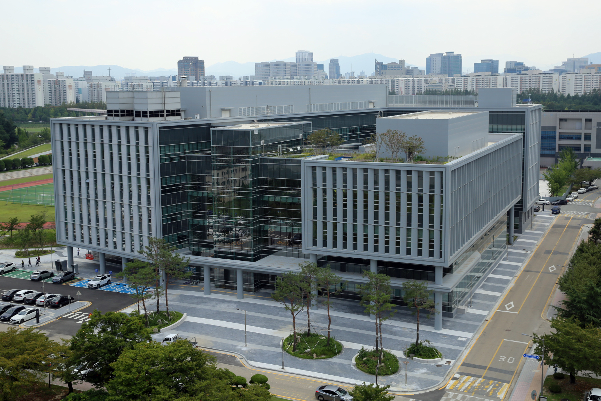

# AI Made Individual Scientists Stronger, Made Science Itself Narrower

_Nature analysis of 41.3 million papers… after 23 years of AI adoption, topic diversity down 4.6% and exploratory engagement down 22%_

## Executive Summary

> [!callout]
> AI has made individual scientists much stronger and the field of science as a whole much narrower. That is the conclusion of a [41.3-million-paper study](https://www.nature.com/articles/s41586-025-09922-y) published in _Nature_ in January 2026. Researchers who use AI publish three times as many papers as their peers, but the range of topics that science as a whole studies has actually shrunk. Everyone is moving to popular fields where data has already piled up. The individual wins, and science narrows. One study pointed in two opposite directions at once.

> This is not something to brush off. The sample is 41.3 million papers, the time series is 23 years, and the senior author is James Evans at the University of Chicago, who has been working on this question for 11 years. Two months after the paper appeared, a _Nature_ editorial called on institutions, funders, and publishers to redesign evaluation metrics, funding allocation, and publishing standards. Korea is pouring money in the same direction. In 2026, KRW 10 trillion (~$7B) of the government's AI budget flows into six scientific fields (bio, materials chemistry, earth science, semiconductors, energy, secondary batteries), with the InnoCORE postdoc program (400 researchers) and the AI Co-Scientist Challenge serving as that money's hands and feet. The problem: all six are already rich in data (papers, experimental measurements, datasets), and no mechanism is in place to keep the range of topics that this money supports broad.

> The remaining question is plain. When money and talent concentrate in six data-rich fields, who holds up the fields without data — mathematics, theoretical physics, philosophy, parts of the social sciences? Evans himself said we need "AI that expands not only cognitive capacity but also sensory and experimental capacity." That means moving fields with no data into a form that can be measured, and filling thin spots with synthetic data. This is where Pebblous's next line begins: **"Knowledge Diversity,"** the seventh signal of DataClinic.

**_Editor's Note._** Measuring bias in data and AI is something Pebblous always finds itself drawn to. When the bias shows up in science, even more so. Pebblous is currently running an "Agentic AI Data Scientist" project. As the territory of AI-based data science keeps widening, this study landed a serious question in the middle of it. This piece is the fifth in our AI Governance series, following [Magnifica Humanitas](/report/pope-magnifica-humanitas/en/), [SkillOpt](/report/microsoft-skillopt-self-evolving-agents/en/), [MUSE-Autoskill](/report/muse-autoskill-self-evolving-skill-lifecycle/en/), and [PIPEDA](/report/openai-pipeda-ai-training-data-regulation/en/), and an attempt to answer the question of the diversity of knowledge.

### Key Metrics

Source: [Hao, Xu, Li, Evans (2026), _Nature_ 649, pp. 1237–1243](https://www.nature.com/articles/s41586-025-09922-y). DOI: 10.1038/s41586-025-09922-y. arXiv:2412.07727v4.

<!-- stat-card -->
**+3.02x** — Individual paper output — AI users vs peers

<!-- stat-card -->
**+4.84x** — Individual citations — Matthew effect accelerated

<!-- stat-card -->
**-4.63%** — Collective topic diversity — collective volume

<!-- stat-card -->
**-22%** — Follow-on engagement — "lonely crowds"

## What 41.3 Million Papers Are Saying

"Does AI help science or hurt it?" The debate is not new. After [AlphaFold 2](https://www.nature.com/articles/s41586-021-03819-2) effectively solved protein folding in its 2021 _Nature_ paper, one camp argued that AI had ushered science into a golden age, while the other countered that AI hallucinates and erodes depth. Both leaned on anecdote and intuition. **In January 2026, a paper in _Nature_ Vol. 649 put 41.3 million papers' worth of data on the table.**

There are four authors. **Qianyue Hao, Fengli Xu, Yong Li** (Tsinghua University), and the corresponding author **James A. Evans** (University of Chicago Knowledge Lab). Evans is a professor of sociology at Chicago and an external professor at the Santa Fe Institute, and he runs the meta-science research center known as Knowledge Lab. His lab has been working on one proposition for 11 years since its 2015 paper "Tradition and Innovation in Scientists' Research Strategies" in _American Sociological Review_: when individuals each act rationally, collective knowledge can actually narrow. This paper is where that 11-year project lands.

*▲ University of Chicago campus — home of Evans Knowledge Lab, where the eleven-year "narrowing of science" thesis has been tracked. | Source: [Wikimedia Commons](https://commons.wikimedia.org/wiki/File:University_of_Chicago_campus_panorama_(2011).jpg)*

### 1.1. Method — an F1 = 0.875 Classifier Across 23 Years

One number conveys the weight of this paper. The team ran titles (up to 16 tokens) and abstracts (up to 256 tokens) of natural-science papers through a two-stage fine-tuned `bert-base-uncased` classifier to identify "AI-augmented research." In validation, five domain experts labeled the data with a Fleiss' κ of **0.964**, near-perfect agreement, and the classifier scored **F1 = 0.875**. For meta-science work, that level of agreement and accuracy is rare. The 23-year time series naturally spans three eras of AI: classical machine learning (late 1990s onward), deep learning (2012 onward), and generative or large language models (2020 onward).

Six fields are analyzed: biology, medicine, chemistry, physics, materials science, and geology. One fact deserves to be named up front. **Mathematics, theoretical physics, and philosophy are not in the analysis from the start.** That fact is itself another piece of evidence. Data-poor fields drop out of analysis before they drop out of attention. We return to this in §5.

### 1.2. Six Statistics, One Sentence — Individuals Win, the Collective Loses

The result fits into one paragraph of the abstract. Verbatim:

"Scientists who engage in AI-augmented research publish **3.02 times more papers**, receive **4.84 times more citations**, and become research project leaders **1.37 years earlier** than those who do not. By contrast, AI adoption shrinks the collective volume of scientific topics studied by **4.63%** and decreases scientist's engagement with one another by **22.00%**."

— Hao, Xu, Li, Evans (2026), Abstract

The conclusion of the same paragraph reads: _"AI adoption in science presents a seeming paradox — an expansion of individual scientists' impact but a contraction in collective science's reach — as AI-augmented work moves collectively toward areas richest in data."_ The last sentence is even more direct. _"AI tools appear to automate established fields rather than explore new ones."_ Attention rushes to fields that can be automated, and fields that need exploration fall further out of view. The one-line summary of this piece is almost a translation of those two sentences. **Individuals get stronger, and science gets narrower.**

> [!callout]
> So the answer to "Does AI help science or hurt it?" is "both, but in opposite directions." Individual utility and collective diversity move at the same time, in opposite directions. 41.3 million papers as a sample. F1 = 0.875 and Fleiss κ = 0.964 as inter-rater agreement. 23 years as a time series. Any one of those would carry weight on its own. They arrived together in one paper.

## The Individual Victory — A Leap in Productivity, Influence, and Leadership

Three individual-level numbers, one at a time. What each one means and why the effect is the size it is — these are the next two subsections.

### 2.1. Papers +3.02x · Citations +4.84x · Leadership −1.37 Years

**Papers +3.02x.** A researcher who routinely uses AI tools publishes roughly three times as many papers in the same window as a peer in the same field at the same career stage. This can sound like a difference in "quantity," but as long as hiring, promotion, and grants treat publication count as a first-order metric, a 3x output gap translates into a 3x gap in professional stability.

**Citations +4.84x.** The heavier point is not that AI users write more, but that what they write is cited more. Citations are accumulated peer judgment, and that accumulation pulls in still more citations for the next paper (the Matthew effect, Merton 1968). 4.84x is not simple multiplication. It is the entry point of a structure where the gap widens with time. Supplementary material reports a citation-concentration Gini coefficient of **0.754** for the AI-using group, meaningfully above the 0.690 for non-users. The top 22.20% of papers absorb 80% of citations. The AI-era superstar effect.

**Leadership −1.37 years.** Socially, this may be the heaviest of the three. The moment a postdoc rises to independent Principal Investigator arrives 1.37 years earlier for AI users. Sixteen months is a wide gap in an academic life cycle. The first year you can apply for grants, the first year you supervise a PhD student, the first year you enter the tenure track — all of them shift forward by that much. To be 1.37 years behind a peer is to be one cycle behind.

### 2.2. Aren't the Better Researchers Just the Early Adopters? — Selection or Effect

The natural first suspicion: "Aren't the smarter, faster researchers simply the ones who adopt AI first?" The authors carried the same question into the design. In their causal-inference step, they extracted **11,019** researchers who adopted AI tools and matched them with **1,926** non-adopters whose early-career trajectories — years in field, sub-area, productivity — were statistically similar. By year 10, AI adopters had received **24.45%** more citations than their matched non-adopters. The fact that the gap widens despite a similar starting point suggests that a substantial share of the gap is the effect of adoption, not prior selection.

The authors are candid about the limit. _"Despite consistently suggestive evidence, we cannot fully identify the causal linkage between AI adoption and scientific impact."_ That is the inherent boundary of observational data without random assignment. Still, the +24.45% estimate from an 11,019 vs 1,926 match makes clear this is no run-of-the-mill bibliometric correlation study.

### 2.3. Reading This Alongside "Small Teams Disrupt" (Wu·Wang·Evans 2019)

Reading this paper next to an earlier Evans Lab work changes the weight. Lingfei Wu, Dashun Wang, and James A. Evans published "Large teams develop and small teams disrupt science and technology" in _Nature_ in 2019. Analyzing 65 million papers and patents, they showed that smaller teams produce more disruptive (paradigm-shifting) work while larger teams produce more incremental development.

Overlay the 2026 finding onto that 2019 thesis. AI tools let a small team, even a single researcher, produce at the output scale of a large team. On the surface, an era of "small teams disrupting more" should have arrived. What we observe is the opposite. AI-using small teams head for the rich-data, popular topics, where the citation magnets are, and get pulled in. **Rather than AI accelerating small teams' disruptive potential, small teams cling more tightly to automation in place of disruption.** The abstract's last line, _"AI tools appear to automate established fields rather than explore new ones,"_ supports the reading.

*▲ Tsinghua University main building — home of co-authors Qianyue Hao, Fengli Xu, and Yong Li. The 41.3M-paper analysis was possible because the co-authorship infrastructure bridges two campuses, Chicago and Beijing. | Source: [Wikimedia Commons](https://commons.wikimedia.org/wiki/File:Main_building_of_Tsinghua_University_(20190709103617).jpg)*

> [!callout]
> The individual victory is real. The catch is that the same victory is also the cause of the collective loss in the next section. A 3x · 4.8x · 1.4-year reward funnels rational individual choice in one direction. What that direction looks like is the work of §3 and §4. When individual rationality accumulates, collective breadth can narrow. That is where Evans Lab's eleven-year thesis really begins.

## The Collective Loss — Diversity and Collaboration Retreat

The two collective numbers, **−4.63%** in topic diversity and **−22%** in follow-on engagement among researchers, may look small on the surface. They are not. Both are cumulative signals, and both have a clear basis for being read as leading indicators of field collapse.

### 3.1. How −4.63% Was Measured

Topic diversity is not a keyword count. The authors measure it as the "collective volume of topics studied" in an embedding space. Unpacked: every paper is mapped into a semantic embedding, and the change in the volume of that distribution is tracked. When more papers crowd onto the same topic, the volume shrinks. When papers spread into new topics, the volume grows. Across the 23-year time series, the periods of higher AI-adoption rates show a 4.63% contraction in volume. That is the headline measurement.

Follow-on engagement at **−22%** is the faster signal. It does not simply count co-authorship. It captures the degree to which other researchers engage with a paper's topic and method after it is published, which is the intensity of scientific dialogue. A 22% drop describes a state in which attention concentrates on popular topics but interaction across papers thins out. The authors gave that state a name: **"lonely crowds."**

### 3.2. What "Lonely Crowds" Points At

The image is immediate. A hundred people sitting in the same café without speaking to one another are a cluster, not a community. The diagnosis is that this is exactly what is happening on popular topics in the AI era. Papers pile onto the same topic, but the density of dialogue — citation, extension, rebuttal — among those papers is falling. The surface is busy. Beneath it, the weave of the scholarly community comes loose.

Three scholarly labels point at the same phenomenon. Evans 2026's "lonely crowds," Lisa Messeri and M. J. Crockett's **scientific monocultures** in their 2024 _Nature_ article "Artificial intelligence and illusions of understanding in scientific research," and Jon Kleinberg and Manish Raghavan's **algorithmic monoculture** from their 2021 _PNAS_ piece "Algorithmic monoculture and social welfare." Sameness of tools begets sameness of thought. Individual accuracy rises, but the diversity and robustness of collective decision-making fall. That is why §4 holds the three in a single box.

### 3.3. Reading Park · Funk 2023 and Kang · Evans 2024 Together

Why −4.63% is not a "small number" becomes clear when you read it next to two companion works. Michael Park, Erin Leahey, and Russell J. Funk published "Papers and patents are becoming less disruptive over time" in _Nature_ in 2023. Analyzing 45 million papers and 3.9 million patents across 60 years, they showed that the CD (Consolidate-Disrupt) Index has been falling steadily. The trend began before AI. What Evans 2026 adds is that AI accelerates it.

Decisively, Donghyun Kang and James Evans published "Limited diffusion of scientific knowledge forecasts collapse" in _Nature Human Behaviour_ in 2024, and the title is the whole argument. **Limited diffusion of scientific knowledge forecasts collapse.** In other words, the basis for reading −4.63% as a leading signal of collapse has already been published, by the same author. The −22% in collaboration is the concurrent indicator of that signal.

"AI research creates what the authors call **'lonely crowds'** — popular topics that attract concentrated attention but with reduced interaction among papers."

— UChicago DSI press, paraphrasing Hao · Xu · Li · Evans 2026

> [!callout]
> So −4.63% should be read not as a statistical shock but as the first fracture of field collapse. −22% indicates how fast that fracture is deepening. A trend that began before AI is being accelerated by AI. That is the throughline that ties Evans 2026, Park 2023, Kang 2024, and Messeri 2024 into a single argument.

## Why the Data-Rich Get Richer

Evans 2026's real core lives in one quotation. _"Data availability appears to be a major impacting factor, where areas with an abundance of data are increasingly and disproportionately amenable to AI research."_ Data availability is decisive. AI piles onto the places AI is good at. AI needs enough data to be good at them. And the fields where the data has already accumulated pull more resources back in. That loop widens the gap between data-rich and data-poor domains over time.

### 4.1. The Streetlight Effect Is No Longer a Metaphor

Sociology of science has an old joke. A drunk loses his keys and searches only under a streetlight. Asked why, he answers, "because the light is here." The **streetlight effect** names the bias of searching only where measurement is easy. Julian Hoelzemann quantified the effect in NBER Working Paper 32401 (2024), "The Streetlight Effect in Data-Driven Exploration." In the AI era, the metaphor crossed into a measurable size, and that size is exactly the −4.63% and −22% Evans 2026 reports.

*▲ Only the area under the lamp is lit. The key that might be in the dark will never be found — exactly the structure of the data-rich / data-poor polarization in AI for Science. | Source: [Wikimedia Commons](https://commons.wikimedia.org/wiki/File:Streetlight_at_night.jpg)*

The streetlight effect runs through four reinforcing channels.

- **Incentives.** As long as paper counts and citations are the first-order metrics for hiring, promotion, and grants, individuals rationally choose places where they can publish most and fastest. AI tools' efficiency gains are largest in data-rich fields, so the pull toward those fields gets stronger.
- **Compute and data cost.** Training or fine-tuning an LLM in a data-poor field can cost 5 to 10 times what it costs in a data-rich one. Synthetic-data augmentation is a path, but it is itself an infrastructure investment. The cost curve pulls resources further toward the rich.
- **Evaluation metrics.** h-index, Altmetric, citation-concentration indices are all cumulative. A topic that enters the popular zone earns more follow-on citations, and those citations shape the next evaluation. That is the Matthew effect operating at the field level.
- **Peer review and grant review.** If reviewers are unfamiliar with AI-era paradigms, new proposals in data-poor fields may be scored lower. Wang, Veugelers, and Stephan documented exactly this novelty penalty in their 2017 _Research Policy_ paper "Bias against novelty in science." The AI era is likely to sharpen, not soften, that penalty.

If the four channels were independent, a single policy lever — reforming evaluation metrics, subsidizing compute, opening a new-topic track — could partially loosen them. The trouble is that the four reinforce one another. When incentives pull toward data-rich fields, evaluation metrics accumulate further there. That accumulation attracts more funding. The funding lowers compute costs. The lower costs bring the next generation of researchers back to the same place. Pull one channel and the other three pull back. That is why the convergence in the next subsection matters. Three labels from three different angles arriving at the same coordinate suggests this alignment is structural, not accidental.

### 4.2. lonely crowds = scientific monocultures = algorithmic monoculture

Put the three names side by side and what emerges is a shared scholarly diagnosis, not a single study. The cards below hold one frame of it.

<!-- stat-card -->
**lonely crowds** — Evans 2026, _Nature_ — Attention concentrates on popular topics, but interaction among papers drops. The 41.3M-paper empirical coordinate.

<!-- stat-card -->
**scientific monocultures** — Messeri & Crockett 2024, _Nature_ — AI produces a monoculture of methods, questions, and perspectives that crowds out other approaches. An epistemological critique.

<!-- stat-card -->
**algorithmic monoculture** — Kleinberg & Raghavan 2021, _PNAS_ — Adoption of the same algorithm raises individual accuracy but lowers the quality of collective decision-making.

The three works look at the same phenomenon from different angles. Evans through scholarly-publication data. Messeri through epistemology and experimental design. Kleinberg through algorithm adoption and social welfare. Bound together, what shows is not one critic's intuition but a **six-year (2021–2026) scholarly consensus** about the gravitational pull toward data-rich domains. It is hard to dismiss this as "one pessimist's claim" any longer.

### 4.3. Gini 0.754 — the Matthew Effect in the AI Era

Robert Merton published "The Matthew Effect in Science" in _Science_ in 1968. The name, from the Gospel of Matthew ("to those who have, more will be given"), captures the cumulative advantage that builds in citation distributions. Evans 2026's citation-concentration Gini coefficient of **0.754** is the AI-era variant of that effect. Compared to 0.690 in the non-using group, the gap is 0.064 points. On the Gini scale, that gap is what produces the superstar effect, with the top 22.20% of papers absorbing 80% of citations.

A field-level variant of the Matthew effect weighs even more. It is not cumulative advantage between individual papers, but cumulative advantage **between fields**. Fields where data, funding, and people are already accumulated pull in still more through AI tools, while data-poor fields fall further behind. At this scale, the Matthew effect is structural pressure that accelerates field collapse.

> [!callout]
> So the streetlight effect is now measured fact. The four-channel mechanism (incentives, compute cost, evaluation metrics, peer review) produces an algorithmic monoculture, and that monoculture accelerates the field-level Matthew effect. Three labels converging at the same place is not coincidence. Policy has to respond here.

## The Shape of Science Is Changing

The six fields Evans 2026 analyzed, biology, medicine, chemistry, physics, materials science, and geology, are all data-rich. That tells two things at once. First, where analysis is possible, polarization shows up at a measurable size. Second, where analysis was not possible, the thinning is likely happening even faster. **The fact that mathematics, theoretical physics, and philosophy were not in the analyzed set from the start is itself evidence of how data-poor fields get omitted.**

### 5.1. NIH $30.1B vs NSF MPS $1.562B — a 20x Funding Gap

Look at funding and the streetlight effect shows up in money as well. In the United States, NIH (biology, medicine) runs an annual budget of **$30.1B**. The NSF MPS (Mathematical and Physical Sciences) division has an FY2025 budget of **$1.562B** across mathematics, physics, chemistry, materials, and astronomy combined. Unpack by field and the gap widens. Even at the divisional roll-up it is roughly **20x**. AI-for-Science tooling drifts naturally toward the fields NIH funds. Data, money, and tools align along the same axis.

The arXiv monthly-submissions distribution paints the same picture. Of 24,226 new submissions in October 2024, the three categories `cs.LG`, `cs.CV`, and `cs.CL` (machine learning, computer vision, natural language processing) together exceed 6,000. Pure mathematics (`math.AG` and the like) and theoretical physics (`hep-th`) over the same period are flat or barely growing. Conference acceptances, PhD-granting distributions, faculty hiring distributions — nearly every academic flow points the same way.

### 5.2. Fields Missing Even from the Analysis — Math, Theoretical Physics, Philosophy

The table below compares the fields Evans 2026 saw with those it did not. "Did not see" is not the team's failure. It points to an asymmetry in the analyzable data itself.

| Status | Field | Data / Funding Profile | AI for Science Exemplar |
| --- | --- | --- | --- |
| Included | Biology · Medicine | Large-scale sequence · imaging · clinical data; NIH $30B | AlphaFold 2 (Nature 2021) |
| Included | Chemistry | Reaction databases, molecular-structure libraries | Recursion, Insilico, Isomorphic Labs |
| Included | Materials | Materials Project, MP-API accumulated corpus | GNoME (Nature 2023, 380K stable crystals) |
| Included | Physics (experimental) · Geology | Observational data, simulation outputs | DESI, LSST, and other large surveys |
| Excluded | Mathematics | Proof / definition text, sparse labeled corpora; NSF MPS $1.5B | AlphaProof · AlphaGeometry (exceptional synthetic-data breakthrough) |
| Excluded | Theoretical Physics | Small set of core papers, equation-centric | Limited |
| Excluded | Philosophy · Part of Social Sciences | Concept / narrative centric, no quantitative corpus | Essentially none |

____Source: Hao et al. 2026 (analyzed fields); NIH FY2025 / NSF MPS FY2025 official budget announcements; arXiv stats (2024-10); DeepMind announcements.

### 5.3. AlphaProof's Exception — the Cost of Breakthrough in Data-Poor Territory

If [AlphaFold 2](https://www.nature.com/articles/s41586-021-03819-2) showed acceleration in the life sciences, DeepMind's AlphaProof and AlphaGeometry produced an interesting exception in mathematics. In 2024, the two systems combined to solve 4 of the 6 problems at the International Mathematical Olympiad (IMO), reaching a silver-medal score. The fact tells two things at once. One, AI can break through in data-poor fields too. Two, that breakthrough was made possible by generating a massive volume of **synthetic proof data** (over 100 million examples, in AlphaProof's case), turning scarcity into abundance by hand.

In other words, breakthroughs in data-poor territory are possible, but the cost far exceeds the cost of simply using AI in data-rich fields. Academic labs without DeepMind-scale infrastructure cannot easily walk the same path. The structural pressure toward data-rich concentration remains. Borrowing Kuhn's old term **paradigm shift**, in the AI era the paradigm-shift cycle is likely to accelerate in some data-rich fields and slow down in data-poor ones. The flow of time between fields becomes asymmetric.

*▲ A protein 3D structure (C17orf58 / UPF0450) predicted by AlphaFold. The image symbolizes AI for Science acceleration in the data-rich life sciences — the same acceleration does not occur in data-poor fields. | Source: [Wikimedia Commons](https://commons.wikimedia.org/wiki/File:C17orf58_protein_(UPF0450)_structure_with_AlphaFold.png)*

> [!callout]
> The shape of science is deepening in six data-rich fields and thinning in mathematics, theoretical physics, and philosophy. The exclusion of the latter from Evans 2026 is not a coincidence but a structural omission produced by the alignment of data, funding, tools, and evaluation. Exceptions like AlphaProof exist, but the cost curve of those exceptions points directly to the place where Pebblous's synthetic-data and simulation infrastructure belongs (§7).

## The AI Governance Quintet — Morality · Scholarship · Law · Meta

Four pieces Pebblous published in May 2026 form a series. This is the fifth. The flow runs **morality (principles) → scholarship (optimizer) → scholarship (lifecycle) → law (enforcement) → meta (the change in science itself)**. If 1–4 worked inside governance, the fifth sits one level above, as a mirror that asks **how AI is changing science**.

| # | Title (one line) | Track | Published |
| --- | --- | --- | --- |
| 1 | Magnifica Humanitas — the Vatican's AI charter | Morality · Theology | 2026-05-25 |
| 2 | SkillOpt — self-evolving optimizer | Scholarship · Optimizer | 2026-05-27 |
| 3 | MUSE-Autoskill — five-stage skill lifecycle | Scholarship · Lifecycle | 2026-05-28 |
| 4 | PIPEDA — Canada's enforcement on AI training data | Law · Regulation | 2026-05-29 |
| 5 | This piece — Evans Nature 2026 meta-critique | Meta · Sociology of Science | 2026-05-31 |

[****](/report/pope-magnifica-humanitas/en/)[****](/report/microsoft-skillopt-self-evolving-agents/en/)[****](/report/muse-autoskill-self-evolving-skill-lifecycle/en/)[****](/report/openai-pipeda-ai-training-data-regulation/en/)Source: Pebblous Blog publication record.

### 6.1. The Three Actors the Nature Editorial Named — institutions, funders, publishers

Two months after Evans 2026 appeared, on **March 25, 2026**, _Nature_ responded with an editorial: _"AI scientists are changing research — institutions, funders and publishers must respond"_ (DOI: 10.1038/d41586-026-00934-w). One paper being elevated from a scholarly agenda to a policy agenda is a rare event. The editorial distributes responsibility across three actors. **Institutions** must redesign evaluation metrics, **funders** must create preservation tracks for data-poor fields, and **publishers** must establish transparency standards and metadata conventions for AI use.

A follow-up editorial, _"AI grant flood must prioritize fairness as part of excellence,"_ drove the point home. In funding allocation, excellence as a single criterion has to be paired with fairness as a second axis. Judged by excellence alone, all funding flows to the data-rich. Without fairness as a second axis, the diversity retreat accelerates. Evans's proposition, translated into policy language.

### 6.2. What the Four Drew Inside, What the Fifth Draws Above

One line for each of the four. [Magnifica Humanitas](/report/pope-magnifica-humanitas/en/) asks about the principles of human dignity in the AI era. [SkillOpt](/report/microsoft-skillopt-self-evolving-agents/en/) reads the scholarly design of a self-evolving optimizer for AI agents. [MUSE-Autoskill](/report/muse-autoskill-self-evolving-skill-lifecycle/en/) proposes a scholarly model of skill lifecycle. [PIPEDA](/report/openai-pipeda-ai-training-data-regulation/en/) covers the four-Commissioner Canadian enforcement action on OpenAI training data. Morality asks, scholarship answers, law enforces.

This piece adds one more coordinate above that flow, the meta perspective of **how AI is reshaping science itself**. While morality, scholarship, and law work inside governance, the object of that governance — science — is narrowing. Taken together, the quintet looks both inside governance and at the transformation of what governance is meant to govern. That completes the series.

> [!callout]
> Morality (principles), scholarship (optimizer), scholarship (lifecycle), law (enforcement), meta (the shape of science). Any one of these alone is partial. Taken together, they outline how far AI governance must reach. The place from which Pebblous's next pieces begin shows up naturally inside that outline.

## Restoring Data-Poor Domains — A Pebblous Read

If Evans 2026 is one strand of a shared scholarly diagnosis, what Pebblous wants to add is one infrastructure line on top of it. Evans himself left a single sentence as the policy implication.

"To preserve collective exploration in an era of AI use, we will need to **reimagine AI systems that expand not only cognitive capacity but also sensory and experimental capacity**."

— James Evans, UChicago DSI press (policy implications of Hao · Xu · Li · Evans 2026)

Pebblous takes that sentence as the direct scholarly grounding for its product line. **DataGreenhouse** is the expansion of sensory capacity — synthetic data supply for data-poor fields. **PebbloSim** is the expansion of experimental capacity — simulation to cover experiment costs and blind spots. Evans's policy implication points directly at the coordinate Pebblous's product line already occupies.

### 7.1. DataClinic's Seventh Signal — "Knowledge Diversity"

DataClinic has, to date, diagnosed dataset-internal quality through six signals: **completeness, accuracy, consistency, timeliness, uniqueness, legality**. The sixth, legality, was added in our [PIPEDA piece (Part 4 of the series)](/report/openai-pipeda-ai-training-data-regulation/en/). This piece proposes a seventh: **Knowledge Diversity**.

The first six look **inside** a dataset. The seventh looks **outside**, at which fields are absent.

| # | Signal | Lens | Example Measurement |
| --- | --- | --- | --- |
| 1 | Completeness | Dataset-internal | Missing rates, field fill rates |
| 2 | Accuracy | Dataset-internal | Label error rates, validation agreement |
| 3 | Consistency | Dataset-internal | Duplicate-definition conflicts, schema fit |
| 4 | Timeliness | Dataset-internal | Most-recent update timestamp, drift |
| 5 | Uniqueness | Dataset-internal | Duplicate-record share |
| 6 | Legality | Dataset-external — law | Consent validity, provenance traceability (PIPEDA piece) |
| 7 | Knowledge Diversity | Dataset-external — fields | Field-embedding coverage, Gini thresholds, "lonely cluster" score |

Source: Pebblous DataClinic existing six signals + this piece's proposed seventh.

The seventh signal's operational definition can be set this way. **Measurement**: compute the training-corpus coverage distribution in field-embedding space, and measure distance and evenness with respect to adjacent data-poor regions. **Signal**: Gini thresholds (for example, a warning above 0.7), field-omission rates (against the NSF and NIH classification), and a "lonely cluster" score (connection strength to adjacent clusters). **Application**: insert before AI-model training as a corpus-diagnostic step, with a recommendation to augment data-poor regions via synthetic data. The augmentation itself is DataGreenhouse's job.

### 7.2. The Missing Diversity Mechanism in Korea's AI4Science Policy

Korea's AI4Science policy is fast and ambitious. The piece that is missing is a mechanism to keep diversity. The 2026 government R&D budget is KRW 35.5T (~$24.5B, +19.9% YoY), of which the AI budget is KRW 10.1T (~$7.0B), and within that the line item for "AI-augmented S&T R&D innovation" is **KRW 600B (~$414M)**. The NRF AI+S&T six priority fields (bio, materials chemistry, earth science, semiconductors, energy, secondary batteries) are all data-rich. The 2026 AI Co-Scientist Challenge Korea (KRW 1.9B / ~$1.3M prize pool) Track 1 includes mathematics, which is a small step forward, but no diversity indicator appears in the evaluation criteria.

The biggest variable is the **InnoCORE postdoc program** across four science-and-technology institutes, supporting 400 researchers at KRW 90M (~$62K) per year, with KAIST alone hosting 200. Where those 400 researchers flow over the next five to ten years will shape Korean science. If the six fields stay all data-rich and the 400 cluster in the same place, the Korean version of the −4.63% and −22% that Evans 2026 measured in the United States is likely to show up here as well.

*▲ KAIST campus (IBS–KAIST building) — of the 400 InnoCORE postdocs across four institutes, 200 start from this campus alone. Whether the pull toward the six data-rich fields produces a Korean version of -4.63% / -22% is the question for the next five to ten years. | Source: [Wikimedia Commons](https://commons.wikimedia.org/wiki/File:IBS%E2%80%93KAIST_Campus_Building.jpg)*

On the industry side, LG AI Research's **EXAONE Discovery** is the peak case. An AI system that screens 40 million substances per day, the Korean apex of new-materials and new-drug discovery automation. That EXAONE Discovery sits at the peak of data-rich-field automation is reason to applaud. At the same time, the infrastructure for data-poor regions that this automation cannot reach is the open question: whose responsibility is it, and who will build it? That place remains unfilled. Pebblous can stand in it.

### 7.3. "Scientific Diversity Infrastructure" as a New Category

The identity this piece draws for Pebblous fits in one line: **Scientific Diversity Infrastructure**. The three-stage architecture of data diagnostics (DataClinic), synthesis (DataGreenhouse), and simulation (PebbloSim) is no longer just a product line. It is an infrastructure-operator identity that joins the diagnosis Evans, Park, Messeri, and Kleinberg have been building. We do not enter the autonomous-research-agent race (Sakana AI Scientist v2, Google Co-Scientist, FutureHouse Crow/Falcon/Owl/Phoenix, LG EXAONE Discovery) on the same track. Pebblous sits **one layer below**, in the infrastructure layer that supplies those agents with data, especially in data-poor regions.

We recommend reading one sister piece. [AI Science New Era](/report/ai-science-new-era/) drew the arrival of the new AI-for-Science era from an industry-and-policy view. If this piece traces the shadow of that era from a meta-and-sociology-of-science view, the sister piece looks at the light. Two pieces, one era, two sides.

> [!callout]
> Evans's one sentence pointed exactly at Pebblous's scholarly coordinate. The expansion of sensory and experimental capacity is the grounding for DataGreenhouse and PebbloSim. DataClinic is diagnosis, DataGreenhouse is augmentation, PebbloSim is simulation. The three-stage architecture is what Scientific Diversity Infrastructure looks like. The seventh DataClinic signal, "Knowledge Diversity," is this piece's one concrete action item.

## Living With Both Acceleration and Narrowing

+3.02x and −4.63% sit on the same screen above a 41.3-million-paper sample. That is where this piece needs to close. Individual acceleration and collective narrowing are two faces of the same era. The choice is not between them. **Both have to be lived at once**, and a new era begins on that recognition.

One honest admission first. The acceleration AlphaFold 2 brought to protein folding is real. GNoME finding 380,000 stable inorganic crystals is a chapter in the history of science. AlphaProof and AlphaGeometry showing IMO silver-medal reasoning proved that frontal breakthroughs in data-poor territory are possible. The era of autonomous research agents is approaching fast. There is no reason to belittle acceleration. The trouble is that a view that sees only acceleration misses −4.63% and −22%. A view that holds both is what we need.

Read Evans's policy sentence once more. _"reimagine AI systems that expand not only cognitive capacity but also sensory and experimental capacity."_ Not only the expansion of cognition, but the expansion of sensing and experiment. That one line is a design principle for the next era. Enjoy the acceleration where AI can automate, and lay down infrastructure — synthetic data, simulation, diversity diagnostics — where AI does not yet do well. Both have to move at once for the era of acceleration-and-narrowing to keep its balance.

Where this piece ends, more questions begin. How do we measure the diversity of fields that are poor in data? Where do we start filling data in? Over the next five to ten years, how do we read the field distribution of 400 InnoCORE postdocs, or the next round of NRF AI+S&T's six priority fields, along the diversity dimension? These exceed what one piece can answer, and they happen to be the questions Pebblous's "Agentic AI Data Scientist" project is already running into. The concrete answers will come in other pieces.

> [!callout]
> What four scholars left above 41.3 million papers is a simple conclusion. **Individuals get stronger, and science gets narrower.** Both propositions are true at once. A view that enjoys the acceleration while still seeing the fields emptying out in its shadow is the most important homework this study leaves behind.

1. [**Magnifica Humanitas**](/report/pope-magnifica-humanitas/en/) — Morality · Theology (2026-05-25)
2. [**SkillOpt**](/report/microsoft-skillopt-self-evolving-agents/en/) — Scholarship · Optimizer (2026-05-27)
3. [**MUSE-Autoskill**](/report/muse-autoskill-self-evolving-skill-lifecycle/en/) — Scholarship · Lifecycle (2026-05-28)
4. [**PIPEDA**](/report/openai-pipeda-ai-training-data-regulation/en/) — Law · Regulatory enforcement (2026-05-29)
5. **This piece** — Meta · Sociology of science (2026-05-31)

<!-- stat-card -->
**Series — Pebblous AI Governance Quintet** — This piece is the fifth coordinate (meta · sociology of science) of the Pebblous AI Governance Quintet. Morality → scholarship → scholarship → law → meta — five coordinates that draw the full landscape of AI governance. — Sister piece — [AI Science New Era](/report/ai-science-new-era/) (AI for Science from the industry-and-policy perspective).

## References

The primary source (Evans 2026 Nature), the eleven-year Evans Lab lineage, the Park · Messeri · Kleinberg · Hoelzemann meta-science chord, AI-for-Science tooling, _Nature_ editorials, Korean and global policy sources, and the Pebblous five-part series — all grouped by source category.

### Primary Source

- 1.Hao, Q., Xu, F., Li, Y., & Evans, J. A. (2026). [**Artificial intelligence tools expand scientists' impact but contract science's focus**](https://www.nature.com/articles/s41586-025-09922-y). _Nature_, 649, 1237–1243. DOI: 10.1038/s41586-025-09922-y. arXiv:2412.07727v4.

### Evans Lab Lineage (Scholarly Genealogy)

- 2.Foster, J. G., Rzhetsky, A., & Evans, J. A. (2015). _Tradition and Innovation in Scientists' Research Strategies_. _American Sociological Review_, 80(5), 875–908.
- 3.Wu, L., Wang, D., & Evans, J. A. (2019). [_Large teams develop and small teams disrupt science and technology_](https://www.nature.com/articles/s41586-019-0941-9). _Nature_, 566, 378–382. DOI: 10.1038/s41586-019-0941-9.
- 4.Shi, F., & Evans, J. A. (2023). _Surprising combinations of research contents and contexts are related to impact and emerge with collaboration_. _Nature Communications_.
- 5.Kang, D., Danziger, R. S., Rehman, J., & Evans, J. A. (2024). _Limited diffusion of scientific knowledge forecasts collapse_. _Nature Human Behaviour_.

### Meta-Science Chord

- 6.Park, M., Leahey, E., & Funk, R. J. (2023). [_Papers and patents are becoming less disruptive over time_](https://www.nature.com/articles/s41586-022-05543-x). _Nature_, 613, 138–144. DOI: 10.1038/s41586-022-05543-x.
- 7.Wang, J., Veugelers, R., & Stephan, P. (2017). _Bias against novelty in science: A cautionary tale for users of bibliometric indicators_. _Research Policy_, 46(8), 1416–1436. DOI: 10.1016/j.respol.2017.06.006.
- 8.Messeri, L., & Crockett, M. J. (2024). [_Artificial intelligence and illusions of understanding in scientific research_](https://www.nature.com/articles/s41586-024-07146-0). _Nature_, 627, 49–58. DOI: 10.1038/s41586-024-07146-0.
- 9.Kleinberg, J., & Raghavan, M. (2021). _Algorithmic monoculture and social welfare_. _PNAS_, 118(22), e2018340118. DOI: 10.1073/pnas.2018340118.
- 10.Hoelzemann, J., et al. (2024). _The Streetlight Effect in Data-Driven Exploration_. _NBER Working Paper_ 32401.
- 11.Merton, R. K. (1968). _The Matthew Effect in Science_. _Science_, 159(3810), 56–63.

### AI for Science Tooling and Advocacy

- 12.Jumper, J., Evans, R., Pritzel, A., et al. (2021). _Highly accurate protein structure prediction with AlphaFold_. _Nature_, 596, 583–589. DOI: 10.1038/s41586-021-03819-2.
- 13.Merchant, A., Batzner, S., Schoenholz, S. S., Aykol, M., Cheon, G., & Cubuk, E. D. (2023). _Scaling deep learning for materials discovery (GNoME)_. _Nature_, 624, 80–85. DOI: 10.1038/s41586-023-06735-9.
- 14.Lu, C., et al. (2024). [_The AI Scientist: Towards Fully Automated Open-Ended Scientific Discovery_](https://arxiv.org/abs/2408.06292). arXiv:2408.06292.
- 15.Yuan, Y., et al. (Sakana AI, 2025). [_The AI Scientist-v2: Workshop-Level Automated Scientific Discovery via Agentic Tree Search_](https://arxiv.org/abs/2504.08066). arXiv:2504.08066.
- 16.Chen, Z., et al. (2024). [_ScienceAgentBench: Toward Rigorous Assessment of Language Agents for Data-Driven Scientific Discovery_](https://arxiv.org/abs/2410.05080). ICLR 2025. arXiv:2410.05080.
- 17.Bommasani, R., Klyman, K., Longpre, S., et al. (2024). [_The 2024 Foundation Model Transparency Index v1.1_](https://arxiv.org/abs/2407.12929). Stanford CRFM. arXiv:2407.12929.

### Nature Editorials and Press

- 18.Nature Editorial. (2026, March 25). _AI scientists are changing research — institutions, funders and publishers must respond_. _Nature_. DOI: 10.1038/d41586-026-00934-w.
- 19.Nature Editorial. (2026). _Responses to the AI grant flood must prioritize fairness as part of excellence_. _Nature_. DOI: 10.1038/d41586-026-01422-x.
- 20.Science (AAAS). (2026, January). _AI has supercharged scientists — but may have shrunk science_.

### Korea — Policy and Funding

- 21.National Research Foundation of Korea (NRF). (2025). [2026 H1 AI+S&T R&D Technology Demand Survey](https://plan.nrf.re.kr/site/kor/html/sub01/0102.html?mode=V&site_dvs_cd=kor&mng_no=8244).
- 22.Ministry of Science and ICT. (2025). [_2026 AI Co-Scientist Challenge Korea_](https://co-scientist.kr/en/). Prize pool KRW 1.9B (~$1.3M).
- 23.KAIST News. (2025). [Launch of the InnoCORE Research Cluster to lead AI-convergent innovation](https://news.kaist.ac.kr/). 400 postdocs at KRW 90M (~$62K) per year.
- 24.MIT Tech Review Korea. (2025). LG AI Research files patent on core process for new-materials and new-drug discovery AI (EXAONE Discovery).
- 25.KISTEP. (2025). 2026 Korean government R&D budget KRW 35.5T (~$24.5B, +19.9% YoY).

### Global — Policy and Infrastructure

- 26.NIH Common Fund. [_Bridge2AI Program_](https://commonfund.nih.gov/bridge2ai).
- 27.NSF. (2025). [_$100M investment in National AI Research Institutes_](https://www.nsf.gov/news/nsf-announces-100-million-investment-national-artificial).
- 28.European Commission. (2025-10-08). _Keeping European industry and science at the forefront of AI_.
- 29.Google DeepMind. (2025). _Co-Scientist: A multi-agent AI partner to accelerate research_.
- 30.FutureHouse. (2025-05-01). _Launching FutureHouse Platform: Superintelligent AI Agents for Scientific Discovery_.

### Researcher Surveys and Market

- 31.Wiley. (2025). _ExplanAItions 2025: The Evolution of AI in Research_ (2,430 researchers, AI usage rate 84%).
- 32.Nature. (2025-05). _5,000-researcher survey on AI writing_. _Nature_, 641. DOI: 10.1038/d41586-025-01463-8.

### Pebblous AI Governance Quintet

- 33.Pebblous (2026-05-25). [**Magnifica Humanitas — Human Dignity in the AI Era**](/report/pope-magnifica-humanitas/en/). Part 1 of the quintet · Morality · Theology.
- 34.Pebblous (2026-05-27). [**When Skill Docs Start to Learn — Microsoft SkillOpt Deep Dive**](/report/microsoft-skillopt-self-evolving-agents/en/). Part 2 of the quintet · Scholarship · Optimizer.
- 35.Pebblous (2026-05-28). [**Skills Accumulate Experience Too — MUSE-Autoskill Five-Stage Lifecycle**](/report/muse-autoskill-self-evolving-skill-lifecycle/en/). Part 3 of the quintet · Scholarship · Lifecycle.
- 36.Pebblous (2026-05-29). [**Ex-Post Consent Is Impossible — Canada's PIPEDA Findings #2026-002**](/report/openai-pipeda-ai-training-data-regulation/en/). Part 4 of the quintet · Law · Regulatory enforcement.
- 37.Pebblous (2026). [_AI Science New Era_](/report/ai-science-new-era/). Sister piece · AI for Science from the industry-and-policy perspective.
