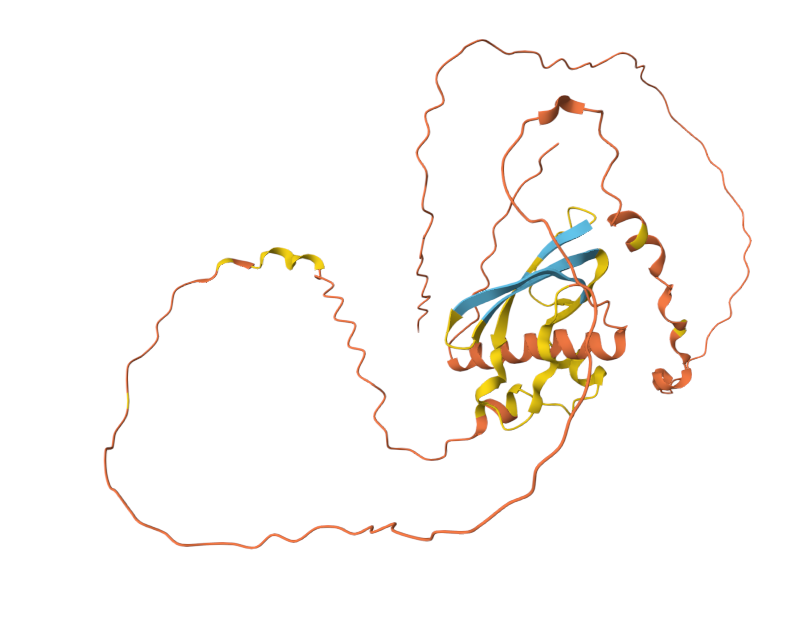

# AI가 과학자 개인은 강하게, 과학 전체는 좁게 만들었다

_Nature 게재 4,130만 편 분석… 23년간 AI 도구 도입 후 주제 다양성 4.6%·탐구행동 22% 감소_

## Executive Summary

> [!callout]
> AI는 과학자 개인을 훨씬 강하게, 과학 전체는 더 좁게 만들었다. 2026년 1월 _Nature_에 실린 [4,130만 편 분석](https://www.nature.com/articles/s41586-025-09922-y)의 결론이다. AI를 쓰는 연구자는 동료보다 논문을 3배 더 내지만, 정작 과학이 다루는 주제의 폭은 줄었다. 모두가 이미 데이터가 많이 쌓인 인기 분야로 몰리기 때문이다. 개인은 이기고, 과학은 좁아진다. 한 연구가 정반대 두 방향을 동시에 가리켰다.

> 흘려들을 얘기가 아니다. 표본이 4,130만 편, 시계열이 23년이고, 책임저자는 이 주제를 11년간 파 온 시카고대 James Evans다. 논문이 나온 지 두 달 만에 _Nature_는 사설을 통해 평가 지표·자금 분배·출판 표준을 다시 설계할 것을 기관·자금기관·출판사 세 주체에 요구했다. 한국도 같은 방향에서 자금을 쏟는 중이다. 2026년 정부 AI 예산 10조원이 6대 과학 분야(바이오·재료화학·지구과학·반도체·에너지·이차전지)에 흘러들고, 이노코어 박사후 400명 사업과 AI Co-Scientist Challenge가 그 자금의 손과 발이 된다. 문제는 그 6대 분야가 모두 이미 데이터(논문·실험치·데이터셋)가 풍부히 쌓인 영역이고, 자금이 다루는 주제의 범위를 넓게 유지할 장치는 빠져 있다는 점이다.

> 그래서 남는 질문은 분명하다. 자금과 인재가 데이터가 풍부한 6대 분야로 쏠릴 때, 데이터가 없는 분야(수학·이론물리·철학·사회과학)는 누가 떠받치는가. Evans 본인은 "인지 능력만이 아니라 감각·실험 능력까지 확장하는 AI"가 필요하다고 했다. 데이터가 없어서 정량화되지 못한 분야를 측정 가능한 형태로 옮기고, 빈약한 자리에 합성 데이터를 만들어 채우는 일이다. 이 자리에서 페블러스의 다음 한 줄, 데이터 진단(DataClinic)의 일곱 번째 신호 **"지식 다양성"**이 시작된다.

**_편집자의 노트._** 데이터와 AI의 편향을 측정하는 일이라면 페블러스는 늘 구미가 당긴다. 그게 과학에서 벌어지는 문제라면 더욱 그렇다. 마침 페블러스는 'Agentic AI 데이터 과학자' 과제를 수행하고 있다. AI 기반 데이터 과학의 영역이 점점 넓어지는 지금, 이 연구는 그 한가운데에 중요한 질문 하나를 던졌다. 이 글은 그간의 AI 거버넌스 4부작([Magnifica Humanitas](/report/pope-magnifica-humanitas/ko/) · [SkillOpt](/report/microsoft-skillopt-self-evolving-agents/ko/) · [MUSE-Autoskill](/report/muse-autoskill-self-evolving-skill-lifecycle/ko/) · [PIPEDA](/report/openai-pipeda-ai-training-data-regulation/ko/))에 이어 '지식의 다양성'에 대한 질문에 답해 보려는 다섯 번째 글이다.

### 주요 수치

출처: [Hao, Xu, Li, Evans (2026), _Nature_ 649, pp. 1237–1243](https://www.nature.com/articles/s41586-025-09922-y). DOI: 10.1038/s41586-025-09922-y. arXiv:2412.07727v4.

<!-- stat-card -->
**+3.02배** — 개인 논문 생산 — AI 활용 연구자 vs 동료

<!-- stat-card -->
**+4.84배** — 개인 인용 수 — 매튜 효과 가속

<!-- stat-card -->
**-4.63%** — 집단 주제 다양성 — collective volume

<!-- stat-card -->
**-22%** — 연구자 후속 참여 — "lonely crowds"

## 4,130만 편이 말하는 것

"AI는 과학을 돕는가, 망치는가." 새 논쟁이 아니다. [AlphaFold 2](https://www.nature.com/articles/s41586-021-03819-2)가 단백질 폴딩을 사실상 풀어낸 2021년 _Nature_ 논문 이후, 한쪽은 "AI 덕분에 과학이 황금기에 들어섰다"고 했고 다른 쪽은 "AI가 환각을 일으키고 연구를 얕게 만든다"고 맞섰다. 양쪽 다 일화와 직관에 기댔다. **2026년 1월 _Nature_ Vol. 649에 실린 한 논문이 그 자리에 4,130만 편의 데이터를 깔았다.**

저자는 넷이다. **Qianyue Hao, Fengli Xu, Yong Li**(Tsinghua University), 그리고 책임저자 **James A. Evans**(University of Chicago Knowledge Lab). Evans는 시카고대 사회학과 교수이자 Santa Fe Institute 외부 교수이고, 메타-과학 연구센터 Knowledge Lab을 이끈다. 그의 연구실은 2015년 _American Sociological Review_에 실은 「Tradition and Innovation in Scientists' Research Strategies」 이후 11년 동안 한 명제를 파고들었다. 개인이 각자 합리적으로 움직이면 집단의 지식은 오히려 좁아질 수 있다는 것. 이번 논문은 그 11년 작업이 다다른 지점이다.

*▲ 시카고대학교 캠퍼스 — Evans Knowledge Lab의 본거지. 11년에 걸친 "과학의 좁아짐" thesis가 이 캠퍼스에서 추적되어 왔다. | Source: [Wikimedia Commons](https://commons.wikimedia.org/wiki/File:University_of_Chicago_campus_panorama_(2011).jpg)*

### 1.1. 방법론 — F1 0.875 분류기와 23년 시계열

수치 하나가 논문의 무게를 가늠하게 한다. 연구팀은 자연과학 논문의 제목(최대 16 토큰)과 초록(최대 256 토큰)을 `bert-base-uncased` 2-stage fine-tuning 분류기로 처리해 "AI를 활용한 연구"를 골라냈다. 검증 단계에서 전문가 5명이 라벨을 매겼는데, 일치도(Fleiss' κ)가 **0.964**로 거의 완전 합의에 가까웠고 분류기 **F1은 0.875**였다. 메타-과학 연구에서 이 정도 합의와 정확도는 흔치 않다. 23년이라는 시계열은 AI의 세 시기 — 전통적 기계학습(1990년대 후반~), 딥러닝(2012~), 생성형·대규모 언어 모델(2020~) — 을 자연스럽게 가른다.

분석 대상은 여섯 분야다. 생물, 의학, 화학, 물리, 재료, 지질. 여기서 미리 못 박아둘 게 있다. **수학·이론물리·철학은 애초에 분석에 들어가지도 않았다.** 이 사실이 곧 이 논문의 또 다른 증거다. 데이터가 빈약한 분야는 눈에 띄기도 전에 분석에서부터 누락된다. 5장에서 다시 다룬다.

### 1.2. 여섯 통계, 한 문장 — 개인은 이기고 집단은 진다

결과는 초록 한 단락에 압축돼 있다. 그대로 옮긴다.

"Scientists who engage in AI-augmented research publish **3.02 times more papers**, receive **4.84 times more citations**, and become research project leaders **1.37 years earlier** than those who do not. By contrast, AI adoption shrinks the collective volume of scientific topics studied by **4.63%** and decreases scientist's engagement with one another by **22.00%**."

— Hao, Xu, Li, Evans (2026), Abstract

같은 단락의 결론은 이렇다. _"AI adoption in science presents a seeming paradox — an expansion of individual scientists' impact but a contraction in collective science's reach — as AI-augmented work moves collectively toward areas richest in data."_ 마지막 한 줄은 더 직설적이다. _"AI tools appear to automate established fields rather than explore new ones."_ 자동화할 수 있는 분야로 주의가 몰리고, 정작 탐색이 필요한 분야는 더 외면받는다. 이 글의 한 줄 요약은 이 두 문장과 거의 같다. **개인은 강해지고, 과학은 좁아진다.**

> [!callout]
> 그러니 "AI는 과학을 돕는가, 망치는가"에 대한 답은 "둘 다, 단 반대 방향으로"가 된다. 개인의 효용과 집단의 다양성이 동시에, 그러나 서로 반대로 움직인다. 4,130만 편이라는 표본, F1 0.875·Fleiss κ 0.964라는 합의도, 23년이라는 길이. 이 중 하나만으로도 의미 있을 수치들이 한 논문에 모였다.

## 개인의 승리 — 생산성·영향력·리더십의 도약

개인 차원의 세 숫자를 하나씩 읽어본다. 각 숫자가 무엇을 뜻하고 왜 그만한 크기인지가 이어지는 두 절의 내용이다.

### 2.1. 논문 +3.02배 · 인용 +4.84배 · 리더십 −1.37년

**논문 +3.02배.** AI 도구를 일상적으로 쓰는 연구자는 같은 분야·같은 연차의 동료보다 같은 기간에 약 3배 많은 논문을 낸다. 단순한 "양"의 차이로 들릴 수 있지만, 채용·승진·연구비가 출판 건수를 일차 지표로 삼는 한 3배는 곧 직업 안정성의 3배 격차다.

**인용 +4.84배.** 더 많이 쓰는 것보다 더 많이 인용된다는 쪽이 무겁다. 인용은 동료 평가가 쌓인 결과이고, 그 누적이 다음 논문의 인용을 또 끌어온다(매튜 효과, Merton 1968). 4.84배는 단순한 곱셈이 아니라 시간이 갈수록 격차가 더 벌어지는 구조의 출발점이다. 보충 자료에 따르면 인용 집중 지니 계수는 AI 활용 집단에서 **0.754**로, 비활용 집단의 0.690보다 뚜렷이 높다. 상위 22.20%의 논문이 인용의 80%를 가져간다. AI 시대의 슈퍼스타 효과다.

**리더십 −1.37년.** 사회적으로 가장 무거운 숫자일 수 있다. 박사후 연구원이 독립 책임연구자(PI)로 올라서는 시점이 AI 활용 연구자에게서 1.37년 앞당겨진다. 연구 생애에서 1년 4개월은 작지 않다. 연구비를 신청할 수 있는 시점, 첫 박사를 지도하는 시점, 종신직 트랙에 진입하는 시점이 모두 그만큼 당겨진다. 반대로 동료보다 1.37년 늦은 사람은 한 사이클을 통째로 뒤처지는 셈이다.

### 2.2. 그냥 잘하는 사람이 먼저 쓴 것 아닐까 — selection이냐 effect냐

이런 차이를 보면 자연히 의심이 든다. "원래 더 똑똑하고 빠른 연구자가 AI를 먼저 도입한 것 아닌가?" 저자들도 같은 질문을 안고 분석을 짰다. 인과를 따지는 단계에서, 연구팀은 AI 도구를 채택한 연구자 **11,019명**을 뽑고 초기 경력 궤적(연차·분야·생산성)이 통계적으로 비슷한 비채택자 **1,926명**을 짝지어 비교했다. 10년 차 시점에서 채택자의 인용은 짝지어진 비채택자보다 **24.45%** 많았다. 같은 조건에서 출발했는데도 격차가 벌어진다는 건, 그 격차의 상당 부분이 사전 선택(prior selection)이 아니라 채택 자체의 효과라는 뜻이다.

물론 저자들도 한계를 솔직히 인정한다. _"Despite consistently suggestive evidence, we cannot fully identify the causal linkage between AI adoption and scientific impact."_ 무작위 배정 실험이 아닌 관찰 데이터의 본질적 한계다. 그래도 11,019명 대 1,926명을 매칭해 얻은 +24.45%라는 추정치는, 이 논문이 흔한 상관관계 분석에 머물지 않음을 분명히 한다.

### 2.3. 2019년 "작은 팀이 disrupt한다"와 겹쳐 읽기

Evans Lab의 이전 작업을 함께 보면 이번 논문이 다르게 읽힌다. Lingfei Wu, Dashun Wang, James A. Evans는 2019년 _Nature_에 「Large teams develop and small teams disrupt science and technology」를 실었다. 6,500만 편의 논문·특허를 분석해, 작은 팀일수록 판을 흔드는(disruptive) 연구를 하고 큰 팀일수록 점진적 발전을 한다는 걸 보였다.

이 명제 위에 2026년의 발견을 겹쳐본다. AI 도구는 소수의 연구자, 심지어 1인에게도 큰 팀만 한 출력을 가능하게 한다. 그러니 표면적으로는 "작은 팀이 더 판을 흔들 수 있는 시대"가 와야 맞다. 그런데 관찰되는 건 정반대다. AI를 쓰는 작은 팀이 향하는 곳은 데이터가 풍부한 인기 주제이고, 거기 깔린 인용 자석에 빨려든다. **작은 팀의 disrupt 잠재력이 AI로 가속됐다기보다, 작은 팀이 disrupt 대신 자동화에 더 매달리게 됐다고 보는 편이 자연스럽다.** 초록의 마지막 줄 _"AI tools appear to automate established fields rather than explore new ones"_이 그 해석을 받쳐준다.

*▲ 칭화대학교 메인 빌딩 — Qianyue Hao·Fengli Xu·Yong Li 공동저자의 본거지. 4,130만 편 분석의 공저 인프라가 시카고·베이징 두 캠퍼스를 잇는 협업으로 가능했다. | Source: [Wikimedia Commons](https://commons.wikimedia.org/wiki/File:Main_building_of_Tsinghua_University_(20190709103617).jpg)*

> [!callout]
> 개인의 승리는 진짜다. 다만 그 승리가 바로 다음 장에서 다룰 손실의 원인이기도 하다. 3배·4.8배·1.4년이라는 보상은 개별 연구자의 합리적 선택을 한 방향으로 몰아간다. 그 방향이 무엇인지가 3장과 4장의 주제다. 개인의 합리성이 쌓이면 집단의 폭은 좁아질 수 있다. Evans Lab이 11년간 추적해 온 명제의 본문이 여기서 시작된다.

## 집단의 손실 — 다양성·협업의 후퇴

집단 차원의 두 숫자, 주제 다양성 **−4.63%**와 후속 참여 **−22%**는 얼핏 작아 보인다. 하지만 둘 다 누적되는 신호이고, 분야 붕괴(field collapse)의 선행 지표로 읽을 근거가 분명하다.

### 3.1. −4.63%는 어떻게 쟀나

주제 다양성은 단순한 키워드 카운트가 아니라, 주제 임베딩 공간에서 "연구된 주제들이 차지하는 부피(collective volume of topics studied)"로 측정됐다. 풀어 말하면 이렇다. 모든 논문을 의미 임베딩으로 옮긴 뒤 그 분포가 차지하는 부피의 변화를 본다. 같은 주제에 논문이 몰리면 부피가 줄고, 새 주제로 흩어지면 부피가 는다. 23년 시계열에서 AI 도입 비율이 높아지는 구간일수록 이 부피가 4.63% 줄었다는 게 논문의 핵심 측정값이다.

한 발 더 들어가면, 연구자 간 후속 참여 **−22%**가 더 빠른 신호다. 이건 단순한 공저자 수 감소가 아니다. 한 논문이 나온 뒤 그 주제나 방법에 다른 연구자들이 이어서 참여하는 정도, 곧 학술적 대화의 강도다. 22% 감소는 인기 주제에 주의는 몰리는데 그 안에서 논문끼리의 상호작용은 줄어드는 상태를 가리킨다. 저자들은 이 상태에 **"lonely crowds"**(외로운 군중)라는 이름을 붙였다.

### 3.2. "lonely crowds"가 가리키는 것

'외로운 군중'은 직관적으로 와닿는 말이다. 카페에 100명이 앉아 있어도 서로 인사를 나누지 않으면 그건 그냥 사람이 많은 것이지 공동체가 아니다. AI 시대의 인기 주제에서 벌어지는 일이 정확히 이렇다. 같은 주제로 논문은 쏟아지는데, 정작 그 논문들이 서로의 후속 작업을 인용하고 확장하고 반박하는 밀도는 떨어진다. 겉은 북적이지만 안에서는 대화가 끊긴 상태다.

세 가지 학술 명명이 같은 현상을 가리킨다. Evans 2026의 "lonely crowds", Lisa Messeri와 M. J. Crockett이 2024년 _Nature_에 실은 「Artificial intelligence and illusions of understanding in scientific research」의 **과학적 단일문화(scientific monocultures)**, 그리고 Jon Kleinberg와 Manish Raghavan이 2021년 _PNAS_에 실은 「Algorithmic monoculture and social welfare」의 **알고리즘 단일문화(algorithmic monoculture)**. 도구가 같아지면 사유도 같아지고, 개별 정확도는 올라가지만 집단으로서의 다양성과 견고함은 떨어진다는 진단이다. 4장에서 이 셋을 한데 묶어 다루는 이유다.

### 3.3. Park·Funk 2023, Kang·Evans 2024와 함께 보기

−4.63%가 "작은 숫자"가 아닌 이유는 동행 연구 두 편을 함께 보면 분명해진다. Michael Park, Erin Leahey, Russell J. Funk는 2023년 _Nature_에 「Papers and patents are becoming less disruptive over time」을 실었다. 논문 4,500만 편과 특허 390만 편을 60년 시계열로 분석해, CD(Consolidate-Disrupt) 지수가 꾸준히 하락하고 있음을 보였다. 이 추세는 AI 이전부터 시작됐다. Evans 2026이 보태는 건, 그 추세가 AI로 가속된다는 점이다.

그리고 결정적으로, Donghyun Kang과 James Evans는 2024년 _Nature Human Behaviour_에 「Limited diffusion of scientific knowledge forecasts collapse」를 실어 한 줄로 못 박았다. **지식 확산이 제한되면 분야 붕괴를 예측할 수 있다는 것.** 다시 말해 −4.63%를 붕괴의 선행 신호로 읽을 근거가 같은 저자에 의해 이미 출판돼 있는 셈이다. 협업 −22%는 그 신호의 동시 지표다.

"AI research creates what the authors call **'lonely crowds'** — popular topics that attract concentrated attention but with reduced interaction among papers."

— UChicago DSI press, 본문 용어 인용 (Hao·Xu·Li·Evans 2026)

> [!callout]
> 정리하면, −4.63%는 통계적 충격이라기보다 분야 붕괴의 첫 균열로 봐야 한다. −22%는 그 균열이 어느 속도로 깊어지는지를 보여주는 동행 지표다. AI 이전부터 있던 추세가 AI로 가속된다는 흐름이 Evans 2026, Park 2023, Kang 2024, Messeri 2024 네 편을 하나로 잇는다.

## 왜 데이터 풍부한 곳만 더 풍부해지는가

Evans 2026의 진짜 핵심은 한 인용에 담겨 있다. _"Data availability appears to be a major impacting factor, where areas with an abundance of data are increasingly and disproportionately amenable to AI research."_ 데이터 가용성이 결정적이라는 진단이다. AI가 잘하는 자리에 AI가 더 몰리고, AI가 잘하려면 충분한 데이터가 필요하며, 이미 데이터가 쌓인 분야로 자원이 다시 쏠린다. 이 순환이 데이터 풍부 영역과 빈약 영역의 격차를 시간이 갈수록 벌린다.

### 4.1. 가로등 효과는 더 이상 비유가 아니다

과학사회학에 오래된 비유가 있다. 술 취한 사람이 열쇠를 잃어버리고는 가로등 아래에서만 찾는다. 왜 거기서만 찾느냐고 물으니 "여기가 밝으니까"라고 답한다. **가로등 효과(streetlight effect)**는 측정이 쉬운 곳에서만 탐색이 일어나는 편향을 가리킨다. Julian Hoelzemann은 2024년 NBER Working Paper 32401 「The Streetlight Effect in Data-Driven Exploration」에서 이 효과를 정량화했다. AI 시대에 이 효과는 비유에서 측정 가능한 크기로 바뀌었다. 그 크기가 바로 Evans 2026이 보여준 −4.63%와 −22%다.

*▲ 가로등 아래만 밝다. 어둠 속에 있을지 모를 열쇠는 영원히 찾지 못한다 — AI for Science의 데이터 풍부·빈약 양극화가 정확히 같은 구조다. | Source: [Wikimedia Commons](https://commons.wikimedia.org/wiki/File:Streetlight_at_night.jpg)*

가로등 효과를 굴리는 네 갈래 갈래는 다음과 같다.

- **인센티브.** 논문 건수와 인용 수가 채용·승진·연구비의 일차 지표인 한, 개인은 가장 빨리 많이 출판할 수 있는 자리를 고르는 게 합리적이다. AI 도구의 효율 이득이 데이터 풍부 분야에서 가장 크니, 그쪽으로 쏠림이 강해진다.
- **계산·데이터 비용.** 데이터가 빈약한 분야에서 LLM을 학습·미세조정하는 비용은 풍부한 분야의 5~10배에 이를 수 있다. 합성 데이터로 보강하는 길이 있지만 그 자체가 별도의 인프라 투자다. 비용 곡선이 자원을 풍부 분야로 더 끌어당긴다.
- **평가 지표.** h-index, Altmetric, 인용 집중 지수 같은 지표는 모두 누적적이다. 한 번 인기에 오른 주제는 후속 인용을 더 받고, 그 인용이 다음 평가에 다시 반영된다. 매튜 효과가 분야 차원에서 작동하는 모습이다.
- **동료심사·자금심사.** 심사위원이 AI 시대 패러다임에 익숙하지 않으면 빈약 분야의 새 제안에 낮은 점수를 줄 수 있다. Wang, Veugelers, Stephan이 2017년 _Research Policy_에 실은 「Bias against novelty in science」가 바로 이 신주제 패널티를 실증했다. AI 시대에는 이 패널티가 더 강해질 여지가 있다.

네 갈래가 따로 작동한다면, 평가 지표 개혁이든 계산 비용 지원이든 신주제 보조 트랙이든 한 가지 정책 레버로도 일부는 풀린다. 문제는 네 갈래가 서로를 강화한다는 점이다. 인센티브가 풍부 분야로 몰리면 그 자리의 평가 지표가 더 쌓이고, 쌓인 지표가 다시 자금을 끌어오며, 그 자금이 계산 비용을 낮춰 다음 세대 연구자를 또 같은 자리로 부른다. 하나를 풀어도 나머지 셋이 잡아당기는 그림이다. 그래서 다음 절에서 볼 학술적 일치도가 의미를 갖는다. 서로 다른 층위에서 본 세 명명이 같은 결론에 도착했다는 사실이, 이 정렬이 우연이 아니라 구조적임을 가리킨다.

### 4.2. lonely crowds = scientific monocultures = algorithmic monoculture

세 명명을 한자리에 놓으면 단일 연구가 아니라 학계 공통의 진단임이 드러난다. 다음 카드가 그 셋을 한 화면에 모은 것이다.

<!-- stat-card -->
**lonely crowds** — Evans 2026, _Nature_ — 인기 주제에 주의가 몰리되 논문 간 상호작용은 감소. 4,130만 편의 실증 좌표.

<!-- stat-card -->
**scientific monocultures** — Messeri & Crockett 2024, _Nature_ — AI가 방법·질문·시각의 단일문화를 만들어 다른 접근을 배제. 학술 인식론적 비판.

<!-- stat-card -->
**algorithmic monoculture** — Kleinberg & Raghavan 2021, _PNAS_ — 동일 알고리즘 채택이 개별 정확도는 올리되 집단 의사결정 품질은 떨어뜨림.

세 연구가 같은 현상을 다른 층위에서 본다. Evans는 학술 출판 데이터로, Messeri는 인식론·실험 설계 차원에서, Kleinberg는 알고리즘 채택과 사회 후생 차원에서. 묶어 놓으면, 데이터 풍부 영역 쏠림이 한 학자의 직관이 아니라 **2021년부터 2026년까지 6년에 걸친 학계의 공감대**였음이 보인다. 정책 입안자가 "비관론자 한 사람의 주장"으로 넘기기 어려운 단계에 들어선 것이다.

### 4.3. 지니 0.754 — AI 시대의 매튜 효과

매튜 효과(Matthew effect)는 Robert Merton이 1968년 _Science_에 발표한 개념이다. "가진 자에게 더 주어지고, 가지지 못한 자에게서는 있는 것마저 빼앗긴다"는 마태복음 구절을 빌려, 과학 인용 분포의 누적 우위(cumulative advantage)를 가리킨다. Evans 2026의 인용 집중 지니 계수 **0.754**는 이 효과의 AI 시대 버전이다. 비활용 집단의 0.690과 비교하면 0.064포인트 차이지만, 지니 척도에서 이 정도면 상위 22.20%의 논문이 인용의 80%를 가져가는 슈퍼스타 효과를 만든다.

여기서 한 가지가 더 무겁다. 분야 차원의 매튜 효과다. 개별 논문 사이의 누적 우위가 아니라 **분야 사이의 누적 우위** 말이다. 이미 데이터·자금·인력이 쌓인 분야가 AI 도구를 통해 더 많은 데이터·자금·인력을 끌어들이고, 빈약 분야는 상대적으로 더 멀어진다. 이 차원의 매튜 효과는 분야 붕괴를 가속하는 구조적 압력이다.

> [!callout]
> 정리하면 이렇다. 가로등 효과는 이제 측정된 사실이다. 네 갈래 메커니즘(인센티브·계산 비용·평가 지표·동료심사)이 알고리즘 단일문화를 만들고, 그 단일문화가 분야 차원의 매튜 효과를 가속한다. 세 명명이 한자리에 모인 건 우연이 아니라 일치다. 정책이 응답해야 할 자리가 여기다.

## 과학의 모양이 바뀌고 있다

Evans 2026이 분석한 여섯 분야, 생물·의학·화학·물리·재료·지질은 모두 데이터 풍부 영역이다. 이 사실은 두 가지를 동시에 말한다. 첫째, 분석이 가능한 영역에서도 양극화가 측정 가능한 크기로 나타난다. 둘째, 측정조차 안 된 영역은 더 빠르게 옅어지고 있을 가능성이 크다. **수학·이론물리·철학이 처음부터 분석에서 빠졌다는 사실 자체가, 데이터 빈약 영역이 어떻게 누락되는지를 보여주는 증거다.**

### 5.1. NIH 30.1B vs NSF MPS 1.562B — 20배 격차

분야별 자금 격차를 보면 가로등 효과가 돈의 분포에서도 측정된다는 게 분명해진다. 미국 기준 NIH(생물·의학) 연간 예산은 **USD 30.1B**다. 같은 기간 NSF MPS(Mathematical and Physical Sciences) 디비전의 FY2025 예산은 수학·물리·화학·재료·천문을 다 합쳐 **USD 1.562B**다. 분야별로 쪼개면 격차는 더 벌어지지만, 통합 수치만 봐도 약 **20배**다. AI for Science 도구는 NIH 자금이 흐르는 분야로 자연스럽게 쏠린다. 데이터·자금·도구 세 축이 같은 방향으로 정렬된다.

arXiv 월간 신규 제출의 분야 분포도 같은 그림이다. 2024년 10월 기준 월 24,226편의 신규 제출 중 `cs.LG`, `cs.CV`, `cs.CL`(기계학습·컴퓨터비전·자연어처리) 세 카테고리 합이 6,000편을 넘는다. 같은 기간 순수수학(`math.AG` 등)과 이론물리(`hep-th`)는 정체이거나 미세하게 늘었을 뿐이다. 학회 발표 분포, 박사 학위 수여 분포, 교수 채용 분포까지 거의 모든 흐름이 같은 방향을 향한다.

### 5.2. 분석에서조차 빠진 분야 — 수학·이론물리·철학

다음 표는 Evans 2026이 본 분야와 보지 않은 분야의 대비다. "보지 않았다"는 건 연구진의 실수가 아니라, 분석 가능한 데이터 자체가 비대칭이라는 뜻이다.

| 상태 | 분야 | 데이터·자금 특성 | AI for Science 정점 사례 |
| --- | --- | --- | --- |
| 분석 포함 | 생물 · 의학 | 대규모 시퀀스·이미지·임상 데이터, NIH USD 30B | AlphaFold 2 (Nature 2021) |
| 분석 포함 | 화학 | 반응 데이터베이스, 분자 구조 라이브러리 | Recursion, Insilico, Isomorphic Labs |
| 분석 포함 | 재료 | Materials Project, MP-API 누적 코퍼스 | GNoME (Nature 2023, 38만 안정 결정) |
| 분석 포함 | 물리(실험) · 지질 | 관측 데이터, 시뮬레이션 출력 | DESI, LSST 등 대형 관측 |
| 분석 제외 | 수학 | 증명·정의 텍스트, 라벨 코퍼스 희박, NSF MPS USD 1.5B | AlphaProof·AlphaGeometry (예외적 합성데이터 정면 돌파) |
| 분석 제외 | 이론물리 | 소량의 핵심 논문, 수식 중심 | 제한적 |
| 분석 제외 | 철학 · 일부 사회과학 | 개념·서사 중심, 정량 코퍼스 부재 | 사실상 없음 |

____출처: Hao et al. 2026 분석 분야 본문, NIH FY2025 / NSF MPS FY2025 예산 공식 발표, arXiv stats(2024-10), DeepMind 발표 자료.

### 5.3. AlphaProof의 예외 — 빈약 영역 돌파의 비용

[AlphaFold 2](https://www.nature.com/articles/s41586-021-03819-2)가 생명과학에서 가속을 보여줬다면, DeepMind의 AlphaProof와 AlphaGeometry는 수학에서 흥미로운 예외를 만들었다. 2024년 두 시스템이 결합해 IMO(국제수학올림피아드) 6문제 중 4문제를 풀어 은메달급 점수를 받았다. 이 사실은 두 가지를 동시에 말한다. 하나, AI는 데이터 빈약 분야에서도 정면 돌파가 가능하다. 둘, 그 돌파는 막대한 양의 **합성 증명 데이터**(AlphaProof의 경우 1억 개 이상)를 생성해 빈약을 인공적으로 풍부로 바꾼 결과다.

바꿔 말하면, 빈약 영역을 돌파할 수는 있지만 그 비용은 풍부 영역에서 도구를 단순히 쓰는 비용을 훨씬 넘어선다. DeepMind 규모의 인프라가 없는 연구실이 같은 길을 가기는 어렵다. 결국 풍부 영역으로의 쏠림이라는 구조적 압력은 그대로 남는다. Kuhn의 오래된 표현을 빌리면, AI 시대의 패러다임 전환 주기는 일부 풍부 분야에서는 빨라지고 빈약 분야에서는 느려질 가능성이 크다. 분야 사이의 시간 흐름이 비대칭이 된다.

*▲ AlphaFold로 예측된 단백질 3차 구조 (C17orf58/UPF0450). 데이터 풍부 분야인 생명과학에서 AI for Science의 가속을 상징하는 시각 — 같은 가속이 데이터 빈약 분야에서는 일어나지 못한다. | Source: [Wikimedia Commons](https://commons.wikimedia.org/wiki/File:C17orf58_protein_(UPF0450)_structure_with_AlphaFold.png)*

> [!callout]
> 과학의 모양은 데이터 풍부 6분야에서 더 깊어지고, 수학·이론물리·철학에서는 옅어진다. Evans 2026 분석에서 후자가 빠진 건 우연이 아니라, 데이터·자금·도구·평가의 정렬이 만든 구조적 누락이다. AlphaProof 같은 예외가 가능하다는 건 인정하되, 그 예외의 비용 곡선이 다음 장(7장)에서 페블러스의 합성 데이터·시뮬레이션 인프라가 들어설 자리를 가리킨다.

## AI 거버넌스 5부작 — 도덕·학술·법·메타

페블러스가 2026년 5월에 잇따라 낸 네 편의 글은 한 시리즈를 이룬다. 이번 글이 다섯 번째다. 시리즈의 흐름은 **도덕(원칙) → 학술(옵티마이저) → 학술(lifecycle) → 법(집행) → 메타(과학 자체의 변화)**다. 1~4편이 거버넌스 안쪽을 다뤘다면, 다섯 번째는 그 위, **AI가 과학을 어떻게 바꾸는가**를 비추는 거울이다.

| # | 제목 (한 줄) | 트랙 | 발행 |
| --- | --- | --- | --- |
| 1 | Magnifica Humanitas — 교황청 AI 헌장 | 도덕 · 신학 | 2026-05-25 |
| 2 | SkillOpt — 자가진화 옵티마이저 | 학술 · 옵티마이저 | 2026-05-27 |
| 3 | MUSE-Autoskill — 스킬 5단계 lifecycle | 학술 · lifecycle | 2026-05-28 |
| 4 | PIPEDA — 캐나다 AI 훈련 데이터 규제 실집행 | 법 · 규제 | 2026-05-29 |
| 5 | 이번 글 — Evans Nature 2026 메타비판 | 메타 · 과학사회학 | 2026-05-31 |

[****](/report/pope-magnifica-humanitas/ko/)[****](/report/microsoft-skillopt-self-evolving-agents/ko/)[****](/report/muse-autoskill-self-evolving-skill-lifecycle/ko/)[****](/report/openai-pipeda-ai-training-data-regulation/ko/)출처: 페블러스 블로그 발행 기록.

### 6.1. Nature 사설이 지목한 세 주체 — institutions · funders · publishers

Evans 2026이 나온 지 두 달 만인 **2026년 3월 25일**, _Nature_는 사설로 응답했다. _"AI scientists are changing research — institutions, funders and publishers must respond"_(DOI: 10.1038/d41586-026-00934-w). 한 편의 논문이 학술 의제에서 정책 의제로 올라서는 드문 사건이다. 사설은 책임을 세 주체에 나눈다. **기관(institutions)**은 평가 지표를 다시 설계하고, **자금 기관(funders)**은 빈약 분야를 보존하는 트랙을 만들며, **출판사(publishers)**는 AI 활용의 투명성과 메타데이터 표준을 정비해야 한다는 것이다.

이어진 후속 사설 _"AI grant flood must prioritize fairness as part of excellence"_는 자금 분배에서 우수성(excellence)이라는 단일 기준 위에 공정성(fairness)이라는 두 번째 축을 더해야 한다고 못 박았다. 우수성만으로 평가하면 데이터 풍부 분야가 모든 자금을 가져가는 구조적 결과가 따라온다. 공정성을 보조 축으로 두지 않으면 다양성 후퇴는 가속된다. Evans의 명제를 정책 언어로 옮긴 셈이다.

### 6.2. 4부작이 그린 안쪽, 5편이 그리는 위쪽

4부작을 한 줄씩 정리하면 이렇다. [Magnifica Humanitas](/report/pope-magnifica-humanitas/ko/)는 AI 시대 인간 존엄의 원칙을 묻는다. [SkillOpt](/report/microsoft-skillopt-self-evolving-agents/ko/)는 AI 에이전트의 자가진화 옵티마이저를 학술적으로 다룬다. [MUSE-Autoskill](/report/muse-autoskill-self-evolving-skill-lifecycle/ko/)은 스킬의 lifecycle 모델을 제시한다. [PIPEDA](/report/openai-pipeda-ai-training-data-regulation/ko/)는 캐나다 4개 위원회의 OpenAI 학습 데이터 규제 집행을 다룬다. 도덕이 묻고, 학술이 답하고, 법이 강제하는 흐름이다.

이번 글은 그 흐름 위에 한 층을 더한다. **AI가 과학 자체의 모양을 어떻게 바꾸는가**라는 메타 시야다. 도덕·학술·법이 거버넌스 안쪽에서 작동하는 동안, 그 거버넌스가 다스리는 대상인 과학 자체가 좁아지고 있다. 5부작은 거버넌스의 안쪽과 그 거버넌스가 다루는 대상의 변형을 함께 본다는 점에서 하나의 시리즈로 완성된다.

> [!callout]
> 도덕(원칙) · 학술(옵티마이저) · 학술(lifecycle) · 법(집행) · 메타(과학의 모양). 어느 하나만 봐도 부분적이지만, 다섯이 모이면 AI 거버넌스가 어디서부터 어디까지 작동해야 하는지 윤곽이 잡힌다. 페블러스의 다음 글들이 출발할 자리도 그 안에 있다.

## 데이터 빈약 영역 복원 — 페블러스 관점

Evans 2026이 학계 공통 진단의 한 갈래라면, 페블러스가 더하려는 건 그 위에 깔 인프라 한 줄이다. Evans 본인이 정책 함의로 직접 한 문장을 남겼다.

"To preserve collective exploration in an era of AI use, we will need to **reimagine AI systems that expand not only cognitive capacity but also sensory and experimental capacity**."

— James Evans, UChicago DSI press (Hao·Xu·Li·Evans 2026 정책 함의)

우리말로 옮기면 이렇다. "AI 시대에 집단적 탐색을 지키려면, 인지 능력만이 아니라 **감각·실험 능력까지 확장하는 AI 시스템**을 다시 상상해야 한다." 페블러스는 이 문장을 제품의 직접적인 학술적 근거로 받는다. **DataGreenhouse**가 감각의 확장(빈약 분야에 합성 데이터를 공급)이고, **PebbloSim**이 실험의 확장(시뮬레이션으로 실험 비용과 사각지대를 메움)이다. Evans의 정책 함의가 페블러스 제품 라인의 좌표를 그대로 짚는다.

### 7.1. DataClinic의 일곱 번째 신호 — "지식 다양성"

DataClinic은 지금까지 여섯 개의 데이터 품질 신호로 데이터셋 내부를 진단해 왔다. **완전성(completeness), 정확성(accuracy), 일관성(consistency), 시의성(timeliness), 고유성(uniqueness), 합법성(legality)**. 마지막 합법성은 [4부작 4편 PIPEDA 글](/report/openai-pipeda-ai-training-data-regulation/ko/)에서 더해진 여섯 번째 신호다. 이번 글은 일곱 번째를 제안한다. **지식 다양성(Knowledge Diversity)**이다.

기존 여섯 신호는 데이터셋 **안쪽**을 본다. 일곱 번째 신호는 **바깥**을 본다. 어느 분야가 빠져 있는지를 묻는다.

| # | 신호 | 관점 | 측정 예시 |
| --- | --- | --- | --- |
| 1 | 완전성 | 데이터셋 내부 | 결측률, 필드 채움률 |
| 2 | 정확성 | 데이터셋 내부 | 라벨 오류율, 검증 일치도 |
| 3 | 일관성 | 데이터셋 내부 | 중복 정의 충돌, 스키마 일치 |
| 4 | 시의성 | 데이터셋 내부 | 최신 업데이트 시점, 드리프트 |
| 5 | 고유성 | 데이터셋 내부 | 중복 레코드 비율 |
| 6 | 합법성 | 데이터셋 외부 — 법 | 동의 유효성, 출처 추적성 (PIPEDA 글) |
| 7 | 지식 다양성 | 데이터셋 외부 — 분야 | 분야 임베딩 커버리지, Gini 임계치, "lonely cluster" 점수 |

출처: 페블러스 DataClinic 기존 6신호 + 본 글 신규 제안 7번째 신호.

일곱 번째 신호의 운영 정의는 이렇게 잡을 수 있다. **측정**은 분야 임베딩 공간에서 학습 코퍼스의 커버리지 분포를 계산하고, 인접한 빈약 영역과의 거리·균등도를 잰다. **신호**는 지니 임계치(예: 0.7 초과 시 경고), 분야 누락률(NSF/NIH 분류 기준), 그리고 인접 클러스터와의 연결 강도를 보는 "lonely cluster" 점수다. **적용**은 AI 모델 학습 전 코퍼스 진단 단계에 들어가, 빈약 영역에 합성 데이터를 보강하라고 권고하는 데까지 이어진다. 그 보강을 실제로 수행하는 도구가 DataGreenhouse다.

### 7.2. 한국 AI4Science 정책에 빠진 다양성 장치

한국의 AI4Science 정책은 빠르고 야심차다. 다만 다양성을 지키는 장치는 보이지 않는다. 2026년 정부 R&D 35.5조원(전년 대비 +19.9%) 중 AI 예산이 10.1조원이고, 그 안에서 "AI 활용 과학기술 연구개발 혁신" 직접 항목이 **6,000억원**이다. NRF AI+S&T 6대 분야(**바이오·재료화학·지구과학·반도체·에너지·이차전지**)는 모두 데이터 풍부 영역이다. 2026 AI Co-Scientist Challenge Korea(상금 19억원) Track 1에 수학이 포함된 건 작은 진전이지만, 평가 기준에 다양성 지표는 없다.

가장 큰 변수는 4개 과기원의 **이노코어(InnoCORE) 박사후 400명** 사업이다. KAIST 단독 200명을 포함해 연봉 9천만원 트랙으로 운영된다. 이 400명이 어느 분야로 흘러가는지가 앞으로 5~10년 한국 과학의 모양을 좌우한다. 6대 분야가 모두 데이터 풍부 영역인 채로 400명이 같은 자리로 쏠리면, Evans 2026이 미국에서 측정한 −4.63%·−22%의 한국판이 나올 가능성이 크다.

*▲ KAIST 캠퍼스 (IBS–KAIST 빌딩) — 4개 과기원 이노코어 박사후 400명 중 단독 200명이 이 캠퍼스에서 출발한다. 6대 데이터 풍부 분야로의 쏠림이 -4.63%·-22%의 한국판으로 이어질지가 향후 5~10년의 관전 포인트. | Source: [Wikimedia Commons](https://commons.wikimedia.org/wiki/File:IBS%E2%80%93KAIST_Campus_Building.jpg)*

산업 쪽 대표 사례는 LG AI연구원의 **EXAONE Discovery**다. 4천만 종의 물질을 하루에 검토할 수 있는 AI 시스템으로, 신소재·신약 개발 자동화의 한국 정점에 있다. 데이터 풍부 분야 자동화의 정점에 EXAONE Discovery가 섰다는 건 박수받을 일이다. 동시에, 그 자동화가 다루지 못하는 빈약 영역의 인프라를 누가 어디서 만들 것인가는 빈자리로 남는다. 페블러스가 그 자리에 설 수 있다.

### 7.3. "과학 다양성 인프라"라는 새 카테고리

이번 글로 페블러스가 그리는 정체성은 한 줄로 옮길 수 있다. **과학 다양성 인프라(Scientific Diversity Infrastructure)**다. 데이터 진단(DataClinic), 합성(DataGreenhouse), 시뮬레이션(PebbloSim)의 세 단계가 단순한 제품 사업을 넘어, Evans·Park·Messeri·Kleinberg가 그려 온 진단에 합류하는 인프라 사업자의 정체성으로 올라선다. 자동 연구 에이전트(Sakana AI Scientist v2, Google Co-Scientist, FutureHouse Crow/Falcon/Owl/Phoenix, LG EXAONE Discovery) 경쟁에 같은 트랙으로 뛰어들지는 않는다. 그 에이전트들이 학습할 데이터를 빈약 영역에 공급하는, **한 층 아래**의 인프라 레이어가 페블러스의 자리다.

자매 글도 함께 읽기를 권한다. [AI Science New Era](/report/ai-science-new-era/)는 AI for Science의 새 시대를 산업·정책 관점에서 그렸다. 이번 글이 메타·과학사회학 관점에서 그 시대의 그림자를 짚었다면, 자매 글은 같은 시대의 빛을 본다. 한 시대를 양쪽에서 보는 두 글이다.

> [!callout]
> Evans의 한 문장이 페블러스의 학술적 좌표를 정확히 짚었다. "감각·실험 능력의 확장"이 곧 DataGreenhouse·PebbloSim의 근거다. DataClinic은 진단, DataGreenhouse는 보강, PebbloSim은 시뮬레이션. 이 세 단계가 곧 과학 다양성 인프라다. 그리고 DataClinic의 일곱 번째 신호 "지식 다양성"이 이번 글이 내놓는 실행 항목이다.

## 가속과 좁아짐을 함께 사는 시대

4,130만 편이라는 표본 위에 +3.02배와 −4.63%가 함께 떠 있다. 이 글이 끝나야 할 자리가 거기다. 개인의 가속과 집단의 좁아짐은 같은 시대의 두 얼굴이다. 둘 중 하나만 고르는 문제가 아니라, **둘을 함께 살아내야 하는 시대**가 시작됐다.

솔직히 인정할 게 있다. AlphaFold 2가 단백질 폴딩에 가져온 가속은 진짜다. GNoME가 38만 종의 안정 무기 결정을 찾아낸 것은 과학사의 한 칸이다. AlphaProof와 AlphaGeometry가 IMO 은메달급 수학 추론을 보여준 것은 빈약 영역도 돌파될 수 있음을 증명했다. 자동 연구 에이전트의 시대도 빠르게 다가온다. 가속을 폄하할 이유는 없다. 다만 가속만 보는 시야는 −4.63%와 −22%를 놓친다. 가속과 좁아짐을 함께 보는 시야가 필요하다.

Evans가 정책 함의로 남긴 문장을 다시 읽는다. _"reimagine AI systems that expand not only cognitive capacity but also sensory and experimental capacity."_ 인지의 확장만이 아니라 감각과 실험의 확장. 이 한 줄이 다음 시대의 설계 원칙이 될 만하다. AI가 자동화할 수 있는 자리에서는 가속을 누리되, AI가 잘 다루지 못하는 자리에는 합성 데이터와 시뮬레이션, 다양성 진단의 인프라를 깐다. 두 일이 동시에 진행돼야 가속과 좁아짐을 함께 사는 시대의 균형이 가능하다.

그러면 다음 질문들이 남는다. 빈약한 분야의 다양성을 어떻게 측정할 것인가. 어디부터 데이터를 채워 넣을 것인가. 이노코어 박사후 400명의 분야 분포를, NRF 6대 분야의 다음 차수를 다양성 관점에서 어떻게 볼 것인가. 한 편의 글이 답할 범위를 넘는 질문들이고, 마침 페블러스가 'Agentic AI 데이터 과학자' 과제에서 마주하고 있는 질문이기도 하다. 구체적인 답은 다른 글에서 이어가려 한다.

> [!callout]
> 네 명의 학자가 4,130만 편 위에 남긴 결론은 단순하다. **개인은 강해지고, 과학은 좁아진다.** 두 명제가 동시에 참이다. 가속을 누리면서도 그 그늘에서 비어가는 분야를 함께 보는 시야. 이 연구가 남긴 가장 중요한 숙제가 그것이다.

1. [**Magnifica Humanitas**](/report/pope-magnifica-humanitas/ko/) — 도덕 · 신학 (2026-05-25)
2. [**SkillOpt**](/report/microsoft-skillopt-self-evolving-agents/ko/) — 학술 · 옵티마이저 (2026-05-27)
3. [**MUSE-Autoskill**](/report/muse-autoskill-self-evolving-skill-lifecycle/ko/) — 학술 · lifecycle (2026-05-28)
4. [**PIPEDA**](/report/openai-pipeda-ai-training-data-regulation/ko/) — 법 · 규제 실집행 (2026-05-29)
5. **이번 글** — 메타 · 과학사회학 (2026-05-31)

<!-- stat-card -->
**시리즈 안내 — 페블러스 AI 거버넌스 5부작** — 이번 글은 페블러스 AI 거버넌스 5부작의 다섯 번째 좌표(메타 · 과학사회학)입니다. 도덕 → 학술 → 학술 → 법 → 메타의 다섯 좌표가 AI 거버넌스의 전체 지형을 그립니다. — 자매 글 — [AI Science New Era](/report/ai-science-new-era/) (AI for Science 산업·정책 관점).

## 참고문헌

이번 글이 인용한 1차 출처(Evans 2026 Nature 본문), Evans Lab 11년 선행 연구 계보, Park·Messeri·Kleinberg·Hoelzemann 메타-과학 합주, AI for Science 도구 진영, Nature 사설, 한국·글로벌 정책 자료, 페블러스 5부작 시리즈를 출처별로 묶었다.

### 1차 출처

- 1.Hao, Q., Xu, F., Li, Y., & Evans, J. A. (2026). [**Artificial intelligence tools expand scientists' impact but contract science's focus**](https://www.nature.com/articles/s41586-025-09922-y). _Nature_, 649, 1237–1243. DOI: 10.1038/s41586-025-09922-y. arXiv:2412.07727v4.

### Evans Lab 선행 (학술 계보)

- 2.Foster, J. G., Rzhetsky, A., & Evans, J. A. (2015). _Tradition and Innovation in Scientists' Research Strategies_. _American Sociological Review_, 80(5), 875–908.
- 3.Wu, L., Wang, D., & Evans, J. A. (2019). [_Large teams develop and small teams disrupt science and technology_](https://www.nature.com/articles/s41586-019-0941-9). _Nature_, 566, 378–382. DOI: 10.1038/s41586-019-0941-9.
- 4.Shi, F., & Evans, J. A. (2023). _Surprising combinations of research contents and contexts are related to impact and emerge with collaboration_. _Nature Communications_.
- 5.Kang, D., Danziger, R. S., Rehman, J., & Evans, J. A. (2024). _Limited diffusion of scientific knowledge forecasts collapse_. _Nature Human Behaviour_.

### 메타-과학 합주

- 6.Park, M., Leahey, E., & Funk, R. J. (2023). [_Papers and patents are becoming less disruptive over time_](https://www.nature.com/articles/s41586-022-05543-x). _Nature_, 613, 138–144. DOI: 10.1038/s41586-022-05543-x.
- 7.Wang, J., Veugelers, R., & Stephan, P. (2017). _Bias against novelty in science: A cautionary tale for users of bibliometric indicators_. _Research Policy_, 46(8), 1416–1436. DOI: 10.1016/j.respol.2017.06.006.
- 8.Messeri, L., & Crockett, M. J. (2024). [_Artificial intelligence and illusions of understanding in scientific research_](https://www.nature.com/articles/s41586-024-07146-0). _Nature_, 627, 49–58. DOI: 10.1038/s41586-024-07146-0.
- 9.Kleinberg, J., & Raghavan, M. (2021). _Algorithmic monoculture and social welfare_. _PNAS_, 118(22), e2018340118. DOI: 10.1073/pnas.2018340118.
- 10.Hoelzemann, J., et al. (2024). _The Streetlight Effect in Data-Driven Exploration_. _NBER Working Paper_ 32401.
- 11.Merton, R. K. (1968). _The Matthew Effect in Science_. _Science_, 159(3810), 56–63.

### AI for Science 도구 · 옹호 진영

- 12.Jumper, J., Evans, R., Pritzel, A., et al. (2021). _Highly accurate protein structure prediction with AlphaFold_. _Nature_, 596, 583–589. DOI: 10.1038/s41586-021-03819-2.
- 13.Merchant, A., Batzner, S., Schoenholz, S. S., Aykol, M., Cheon, G., & Cubuk, E. D. (2023). _Scaling deep learning for materials discovery (GNoME)_. _Nature_, 624, 80–85. DOI: 10.1038/s41586-023-06735-9.
- 14.Lu, C., et al. (2024). [_The AI Scientist: Towards Fully Automated Open-Ended Scientific Discovery_](https://arxiv.org/abs/2408.06292). arXiv:2408.06292.
- 15.Yuan, Y., et al. (Sakana AI, 2025). [_The AI Scientist-v2: Workshop-Level Automated Scientific Discovery via Agentic Tree Search_](https://arxiv.org/abs/2504.08066). arXiv:2504.08066.
- 16.Chen, Z., et al. (2024). [_ScienceAgentBench: Toward Rigorous Assessment of Language Agents for Data-Driven Scientific Discovery_](https://arxiv.org/abs/2410.05080). ICLR 2025. arXiv:2410.05080.
- 17.Bommasani, R., Klyman, K., Longpre, S., et al. (2024). [_The 2024 Foundation Model Transparency Index v1.1_](https://arxiv.org/abs/2407.12929). Stanford CRFM. arXiv:2407.12929.

### Nature 사설 · 보도

- 18.Nature Editorial. (2026, March 25). _AI scientists are changing research — institutions, funders and publishers must respond_. _Nature_. DOI: 10.1038/d41586-026-00934-w.
- 19.Nature Editorial. (2026). _Responses to the AI grant flood must prioritize fairness as part of excellence_. _Nature_. DOI: 10.1038/d41586-026-01422-x.
- 20.Science (AAAS). (2026, January). _AI has supercharged scientists — but may have shrunk science_.

### 한국 정책 · 자금

- 21.한국연구재단(NRF). (2025). [2026년 상반기 AI+S&T 혁신 기술개발(R&D) 기술수요조사](https://plan.nrf.re.kr/site/kor/html/sub01/0102.html?mode=V&site_dvs_cd=kor&mng_no=8244).
- 22.과학기술정보통신부. (2025). [_2026 AI Co-Scientist Challenge Korea_](https://co-scientist.kr/en/). 상금 19억원.
- 23.KAIST 뉴스. (2025). [AI 융합 혁신 주도할 「이노코어(InnoCORE) 연구단」 본격 출범](https://news.kaist.ac.kr/). 박사후 400명, 연 9천만원.
- 24.MIT Tech Review Korea. (2025). LG AI연구원, 신소재·신약 개발 AI 핵심 프로세스 특허 등록 (EXAONE Discovery).
- 25.KISTEP. (2025). 2026 정부 R&D 예산 35.5조원 (+19.9% YoY).

### 글로벌 정책 · 인프라

- 26.NIH Common Fund. [_Bridge2AI Program_](https://commonfund.nih.gov/bridge2ai).
- 27.NSF. (2025). [_$100M investment in National AI Research Institutes_](https://www.nsf.gov/news/nsf-announces-100-million-investment-national-artificial).
- 28.European Commission. (2025-10-08). _Keeping European industry and science at the forefront of AI_.
- 29.Google DeepMind. (2025). _Co-Scientist: A multi-agent AI partner to accelerate research_.
- 30.FutureHouse. (2025-05-01). _Launching FutureHouse Platform: Superintelligent AI Agents for Scientific Discovery_.

### 연구자 설문 · 시장

- 31.Wiley. (2025). _ExplanAItions 2025: The Evolution of AI in Research_ (2,430 researchers, AI 사용률 84%).
- 32.Nature. (2025-05). _5,000-researcher survey on AI writing_. _Nature_, 641. DOI: 10.1038/d41586-025-01463-8.

### 페블러스 AI 거버넌스 5부작 시리즈

- 33.페블러스 (2026-05-25). [**Magnifica Humanitas — AI 시대의 인간 존엄**](/report/pope-magnifica-humanitas/ko/). 5부작 1편 · 도덕 · 신학.
- 34.페블러스 (2026-05-27). [**스킬 문서가 학습하기 시작했다 — Microsoft SkillOpt 심층 분석**](/report/microsoft-skillopt-self-evolving-agents/ko/). 5부작 2편 · 학술 · 옵티마이저.
- 35.페블러스 (2026-05-28). [**스킬도 경험을 누적한다 — MUSE-Autoskill 5단계 lifecycle**](/report/muse-autoskill-self-evolving-skill-lifecycle/ko/). 5부작 3편 · 학술 · lifecycle.
- 36.페블러스 (2026-05-29). [**사후 동의는 불가능하다 — 캐나다 PIPEDA Findings #2026-002**](/report/openai-pipeda-ai-training-data-regulation/ko/). 5부작 4편 · 법 · 규제 실집행.
- 37.페블러스 (2026). [_AI Science New Era_](/report/ai-science-new-era/). 자매 글 · AI for Science 산업 · 정책 관점.
