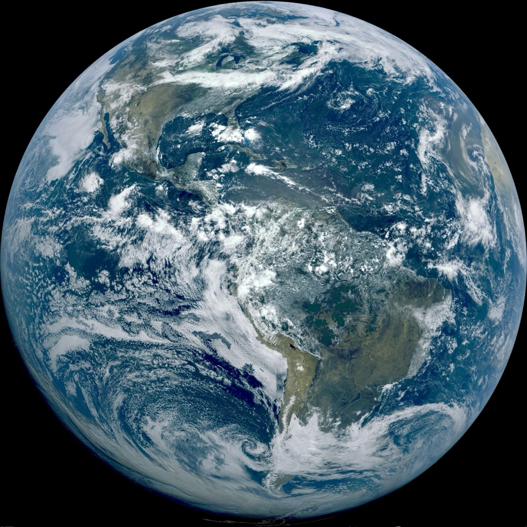

# 일간 예보는 이기고 장기 예보는 밀리는 AI 날씨 모델

_AI 날씨 모델이 못 배우는 것은 정확도가 아니라 시간을 표본하는 방식이다 — 데이터 품질의 시간 축_

## Executive Summary

> [!callout]
> AI 날씨 모델은 며칠 앞 예보에서 수십 년간 다듬어진 물리 모델을 이미 앞질렀다. 그런데 같은 모델이 몇 달에서 몇 년에 걸쳐 천천히 반복되는 기후의 리듬 앞에서는 번번이 무너진다. 흔히 이 실패를 "아직 정확도가 부족해서"로 읽는다. 이 리포트는 다르게 본다. 문제는 정확도가 아니라 학습이 시간을 어떻게 표본(sample)하느냐다. 무엇을 배울 수 있고 무엇을 영영 못 배우는지를 가르는 것은 파라미터 수도, 데이터의 양도 아닌, 학습 신호가 시간을 잘라내는 방식이다.

> 데이터 기반 날씨 모델은 몇 시간 간격의 상태를 이어붙이며 다음 상태를 맞히도록 학습한다. 이 간격은 흔히 6시간으로 알려졌지만 모델마다 다르다. 더 결정적인 것은 학습 도중 손실 함수가 실제로 펼쳐 보는 시간이 길어야 며칠에 그친다는 점이다. 여섯 개 대표 모델을 뜯어 보면 가장 관대한 기준조차 5일이다. 그 결과 준2년 주기 진동이나 엘니뇨처럼 몇 달에서 몇 년을 주기로 숨 쉬는 저주파 신호는 학습 신호 안에 단 한 번도 온전히 들어오지 않는다.

> 이 원리는 날씨에만 갇히지 않는다. 시계열과 센서, 운영 로그로 예측 모델을 만드는 모든 곳에서, 데이터를 얼마나 촘촘히 그리고 얼마나 길게 표본했는가가 모델이 배울 수 있는 주기의 상한을 미리 정해 둔다. 페블러스의 관점에서 데이터 품질은 결측과 노이즈 같은 정적 차원을 넘어 시간 표본 구조라는 동적 차원을 품어야 한다. 이 글은 AI 예보가 이긴 것과 못 배우는 것을 가르는 경계가 결국 데이터의 구조에 있음을 여섯 모델의 학습 절차로 짚는다.

<!-- stat-card -->
**~90%** — 단기 예보에서 AI가 물리 모델을 앞선 비율 — GraphCast의 변수·리드타임 조합 대 ECMWF HRES

<!-- stat-card -->
**5일** — 학습 손실이 실제로 펼쳐 보는 가장 긴 시간 — 여섯 모델 중 최장 사례(NeuralGCM)

<!-- stat-card -->
**~170배** — 가장 가까운 저주파 리듬이 그 학습 창 밖에 있는 거리 — QBO 28개월 대 5일 (6시간 스텝 기준 ~3,400배)

<!-- stat-card -->
**~1/3** — 30년 장기 시뮬레이션 중 불안정화한 비율 — 안정성이 곧 리듬 학습은 아님(NeuralGCM 계열)

## 어제의 질문, 오늘의 질문

바로 하루 전, 우리는 이 블로그에서 [AI 날씨 모델이 20년 전 기후로 미래를 예보한다](/blog/ai-climate-model-cold-bias/ko/)는 글을 냈다. 거기서 던진 질문은 "모델이 무엇을 학습했는가"였다. 학습 데이터의 분포가 과거에 치우쳐 있으면, 아무리 정교한 모델이라도 그 낡은 기후를 미래에 겹쳐 놓는다는 이야기였다. 오늘 글은 그 질문을 한 칸 아래로 내린다. 무엇을 학습했는가가 아니라, 학습이 시간을 어떻게 표본했는가를 본다.

두 질문은 닮았지만 다른 층위에 있다. 앞의 글이 데이터의 **내용**이 낡았다는 이야기라면, 이 글은 데이터를 **시간으로 잘라내는 방식** 자체가 무엇을 배울 수 있는지를 결정한다는 이야기다. 같은 실패를 만드는 서로 다른 원인 층위다. 겹치는 현상(준2년 진동이나 남반구 환상모드 같은 저주파 변동의 재현 실패)은 앞 글에서 이미 자세히 다뤘으니, 여기서는 다시 서술하지 않고 링크로 넘긴다. 대신 그 실패가 왜 정확도 튜닝으로는 좁혀지지 않는 구조적 한계인지, 학습 절차의 시간 구조에서 답을 찾는다.

*▲ GOES-16 위성이 담은 지구 전체 원반 영상(2022-07-26). AI 날씨 모델은 이런 관측을 몇 시간 간격으로 이어붙여 학습한다. | Source: [NOAA / Wikimedia Commons (Public Domain)](https://commons.wikimedia.org/wiki/File:True_Color_Earth_viewed_from_GOES_16.jpg)*

> [!callout]
> 이 글이 더하는 한 문장은 이것이다. **학습 신호가 표본하지 못한 시간 스케일은, 파라미터를 아무리 늘려도 원리적으로 배울 수 없다.** 데이터 품질에는 결측·노이즈 같은 정적 차원만 있는 게 아니라, 간격과 창 길이와 커버리지라는 시간 축이 있다.

## 며칠은 이기고 몇 년은 진다

AI 날씨 모델의 단기 우위는 정량적으로 확인된 현실이다. 구글 딥마인드의 GraphCast는 유럽중기예보센터(ECMWF)의 고해상도 물리 모델 HRES와 견줘 변수와 리드타임 조합의 약 90%에서 더 정확했고, 500hPa 지위고도 같은 핵심 변수의 예보 스킬을 7~14% 끌어올렸다. 확산 기반 앙상블 모델 GenCast는 ECMWF의 앙상블 예보 대비 검증 대상의 97% 이상에서 우위를 보였다. 며칠 규모의 예보에서 AI가 이겼다는 말은 과장이 아니다.

그런데 같은 모델을 2주 너머로 밀면 이야기가 뒤집힌다. 예보 스킬은 기후값(climatology), 즉 "그냥 계절 평균으로 찍기"보다도 아래로 떨어진다. ECMWF조차 15일에서 두 달 사이 구간의 정확도가 급격히 낮아진다고 공식적으로 인정한다. 그리고 준2년 진동(QBO)이나 남반구 환상모드(SAM) 같은 저주파 변동에 이르면, 성공률을 숫자로 매기는 것조차 무의미해진다. 재현 자체가 실패로 판정되기 때문이다. 아래 개념도는 리드타임이 길어질수록 AI의 우위가 어떻게 반전되는지를 요약한 것이다.
