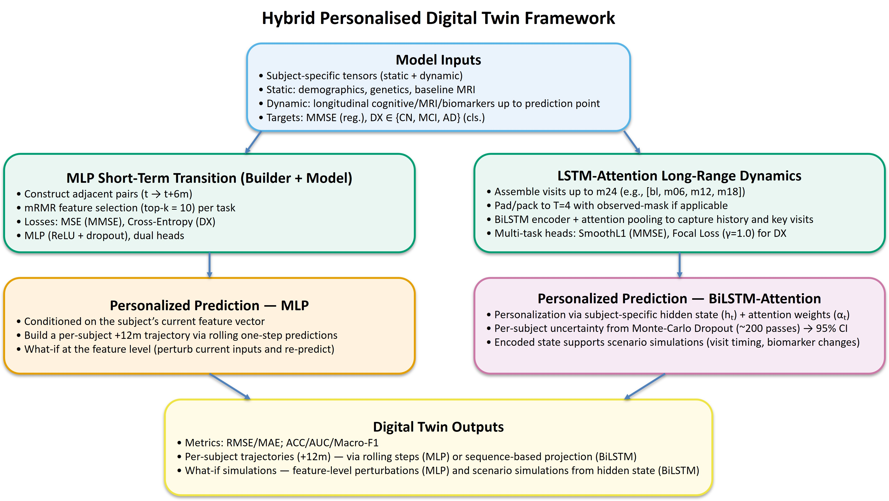
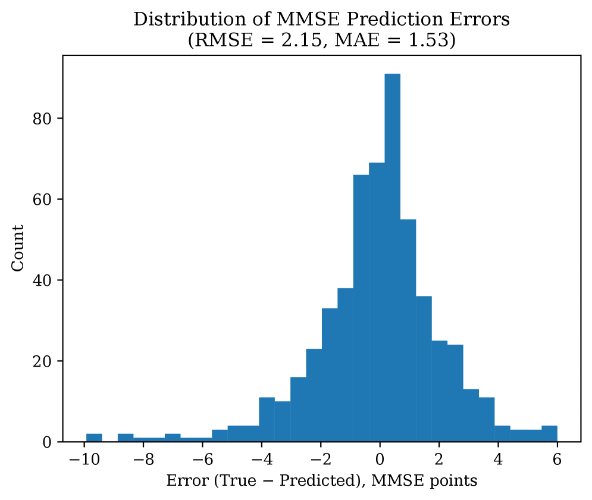
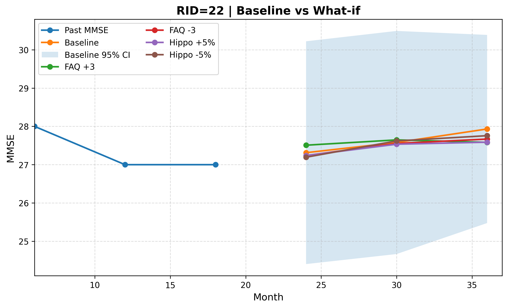
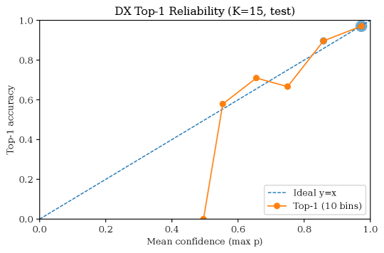

# AI가 환자마다 다른 알츠하이머 진행 지도를 그린다

_전환 기반 디지털 트윈은 어떻게 적은 데이터로 개인별 진행과 불확실성을 예측하는가_

## Executive Summary

> [!callout]
> 알츠하이머병은 같은 진단을 받아도 사람마다 진행 속도와 경로가 다르다. 그런데 기존 머신러닝 예측 모델은 대부분 '집단 평균'을 학습해, 빠르게 악화되는 환자와 안정적인 환자를 같은 곡선으로 뭉갠다. 한 연구진이 발표한 **전환 기반 디지털 트윈**(arXiv:2606.09671)은 이 한계를 정면으로 겨눈다. 환자 전체 시계열을 한꺼번에 학습하는 대신, 인접한 두 방문 사이의 '전환(transition)'을 학습 단위로 삼아, 데이터가 희소하고 불규칙한 임상 현실에서도 개인별 진행과 그 불확실성을 함께 내놓는다.

> 핵심은 '적은 데이터를 더 잘 쓰는 설계'다. 환자 한 명이 평균 네 번 안팎밖에 방문하지 않는 연구 코호트에서, 전체 시퀀스를 통째로 학습하면 표본이 수백 개에 그치지만, 인접 방문 쌍으로 쪼개면 유효 학습 단위가 몇 배로 늘어난다. 논문이 보고한 결과에서 전환 기반 모델은 시퀀스 기반 모델보다 진단 분류 정확도가 약 10%포인트 높았고, 점 하나로 미래를 단정하는 대신 '아마도 이 범위'라고 말하는 불확실성까지 정량화했다.

> 결국 이 모든 성능은 '희소한 종단 데이터를 어떻게 다루느냐'라는 데이터 품질 문제로 귀결된다. 전 세계 치매 환자가 2050년 약 1억 4천만 명에 이르고 한국이 2026년 치매 100만 명 시대에 들어서는 지금, 개인을 예측하는 AI의 토대는 더 많은 데이터가 아니라 **더 잘 정의된 데이터**다. 이 글은 그 접점을 데이터 품질의 관점에서 짚는다.

이 글의 핵심을 정량으로 잡으면 다음 네 수치로 압축된다. 앞의 세 수치는 원 논문이 보고한 결과이고, 마지막은 디지털 트윈이 임상 현장에서 이미 거두고 있는 효용이다.

약 90.6%

전환 기반 모델의 진단 분류 정확도 (희소 ADNI 데이터, 논문 보고치)

+약 10%p

시퀀스 기반 모델 대비 정확도 향상 — 데이터 효율성의 핵심

평균 4회

환자 한 명당 실제 방문 횟수 — 종단 데이터 희소성의 실측

17~35%

디지털 트윈이 줄인 임상시험 대조군 규모 (Unlearn.AI)

## 같은 진단, 다른 미래

부모님이 알츠하이머 진단을 받았다고 하자. 가족이 가장 먼저 묻는 질문은 진단명이 아니라 시간이다. "앞으로 어떻게, 얼마나 빠르게 진행될까." 의사도 정확히 답하기 어렵다. 같은 알츠하이머라도 어떤 사람은 몇 년에 걸쳐 서서히 변하고, 어떤 사람은 가파르게 무너진다. 진행의 속도와 경로가 사람마다 다르기 때문이다.

그런데 이 질문에 답해야 할 예측 AI 대부분은 **'집단 평균'**을 학습한다. 수백 명의 궤적을 평균 낸 하나의 곡선을 그려 놓고, 새 환자를 그 위에 올린다. 평균은 통계적으로 안전하지만, 정작 가족이 알고 싶은 '이 사람'의 미래는 평균 속에 흐릿하게 묻힌다. 빠르게 악화되는 환자와 안정적인 환자가 같은 선 위에서 뭉개진다.

역설적이게도 신약 시대가 열리면서 이 한계는 더 또렷해졌다. 레카네맙(레켐비)과 도나네맙(키순라)은 알츠하이머 진행을 늦추는 첫 질병조절 치료제로 승인됐지만, 그 효과 역시 '집단 평균'으로 보고된다. 레카네맙은 위약 대비 인지 저하를 약 27% 둔화시켰고, 도나네맙은 저tau군에서 진행 위험을 35~36% 낮췄다. 모두 의미 있는 숫자지만, 어디까지나 집단의 평균 효과다. 누가, 언제, 얼마나 이득을 볼지는 개인마다 다르다.

> [!callout]
> **집단 평균 AI는 "이 병이 보통 어떻게 진행되는가"에 답한다.** 우리가 정작 필요한 건 "내 부모님이 어떻게 진행될 것인가"다. 신약이 등장한 시대일수록, 평균을 넘어 개인을 예측하는 일은 덜 중요해지는 게 아니라 더 중요해졌다.

## 희소하고 불규칙한 데이터라는 벽

개인을 예측하고 싶어도 막상 손에 쥔 데이터를 보면 막막해진다. 알츠하이머 진행 예측 연구의 표준 자원인 ADNI(알츠하이머병 신경영상 이니셔티브) 코호트가 대표적이다. 2004년부터 2,400명 넘는 참가자를 추적해 온 대규모 연구지만, 한 사람의 기록을 들여다보면 이야기가 달라진다.

ADNI가 설계한 '이상적' 추적 일정은 일곱 번에서 여덟 번의 방문이다. 그러나 실제 평균 방문 횟수는 네다섯 번에 그친다. 이번 논문이 사용한 부분집합에서는 환자 한 명당 평균이 약 3.7회까지 내려간다. 760명의 기록을 모두 합쳐도 2,801건뿐이다. 사람들은 중간에 연구를 그만두고, 약속한 날에 오지 못하며, 어떤 검사는 누락된다.

희소성만 문제가 아니다. 방문 사이의 간격도 들쭉날쭉하다. 누군가는 6개월 간격으로, 누군가는 1년 또는 2년 간격으로 기록이 남는다. 아래는 시계열 학습 모델이 마주하는 데이터 현실을 정리한 것이다.

| 항목 | 이상 | 현실 |
| --- | --- | --- |
| 방문 횟수 | 7~8회 (계획된 일정) | 평균 약 4회 (본 논문 사용분 약 3.7회) |
| 방문 간격 | 일정한 주기 | 6·12·24·36개월 등 비균일 |
| 완결성 | 전 기간 추적 완료 | 코호트 이탈·결측 빈번 |
| 학습 표본 | 긴 완전 시퀀스 다수 | 짧고 불완전한 시퀀스 소수 |

****************

> [!callout]
> 데이터 희소성과 불규칙성은 단순한 불편이 아니라 예측의 벽이다. 전체 시계열을 통째로 학습하는 시퀀스 모델은 긴 완전한 기록을 원하지만, 임상 현실은 짧고 끊긴 기록만 내놓는다. 더 많은 환자를 모으는 데는 수년과 막대한 비용이 든다. 그래서 질문은 바뀐다. "데이터를 더 모을 것인가"가 아니라 **"가진 데이터를 어떻게 더 잘 쓸 것인가"**로.

## 전환 기반 디지털 트윈: 적은 데이터로 더 멀리

이 논문의 발상은 단순하지만 강력하다. 환자의 전체 여정을 하나의 긴 이야기로 학습하는 대신, **'이번 방문에서 다음 방문으로 가는 한 걸음'**을 학습 단위로 삼는 것이다. 이것이 전환(transition) 기반 모델링이다. 환자의 디지털 트윈은 거대한 일대기가 아니라, 한 상태에서 다음 상태로 넘어가는 수많은 작은 전이의 집합으로 만들어진다.

*▲ 하이브리드 디지털 트윈 구조: MLP 분기가 인접 방문 사이의 단기 '전환'을 학습하고, BiLSTM-어텐션 분기가 장기 의존성과 불확실성·What-if 예측을 맡는다. | Source: [Huang et al., arXiv:2606.09671, Figure 1](https://arxiv.org/abs/2606.09671)*

### 3.1. 왜 '전환'이 '시퀀스'보다 데이터를 잘 쓰는가

차이는 표본 수에서 시작된다. 방문이 네 번뿐인 환자의 기록을 전체 시퀀스로 학습하면, 그 환자는 단 하나의 학습 사례가 된다. 그런데 인접한 방문 쌍으로 쪼개면 '1→2, 2→3, 3→4'처럼 세 개의 전환이 나온다. 같은 데이터에서 유효 학습 단위가 몇 배로 늘어나는 셈이다. 실제로 760명의 짧은 기록은 약 2,000개의 전환 쌍으로 불어났다.

아래 두 카드는 같은 환자 데이터가 두 방식에서 어떻게 다른 양의 학습 신호로 바뀌는지 보여준다.

#### 시퀀스 기반 학습

한 환자의 전체 방문을 하나의 긴 시계열로 묶어 학습한다. 장기 의존성을 보지만, 희소 데이터에서는 학습 사례가 환자 수만큼으로 제한된다.

환자 1명 → **1개** 학습 시퀀스

#### 전환 기반 학습

인접한 두 방문의 쌍을 학습 단위로 쓴다. 표본이 크게 늘고, 희소 데이터에서는 장기 의존성보다 안정적인 '로컬 상태 전이'를 학습한다.

방문 4회 환자 1명 → **3개** 전환 쌍

데이터 효율성만 좋아진 게 아니다. 희소하고 끊긴 기록에서는 '먼 과거가 먼 미래를 설명한다'는 장기 의존성보다, '지금 상태에서 다음 상태로의 짧은 전이'가 훨씬 안정적으로 학습된다. 적은 데이터를 더 잘 쓰는 설계가 곧 더 견고한 학습으로 이어진다.

### 3.2. 성능 비교: 논문이 보고한 결과

논문은 전환 기반 모델(MLP)과 시퀀스 기반 모델(BiLSTM)을 같은 데이터로 비교했다. 760명·2,801건의 희소한 기록만으로 학습했는데도, 전환 기반 모델은 진단 분류와 인지점수 예측 양쪽에서 일관되게 앞섰다. 아래 표는 논문 Table 1이 보고한 핵심 지표다.

| 지표 | 전환 기반 (MLP) | 시퀀스 기반 (BiLSTM) |
| --- | --- | --- |
| 진단 분류 정확도 | 0.906 | 0.806 |
| 진단 분류 AUC | 0.976 | 0.928 |
| 진단 분류 Macro-F1 | 0.908 | 0.798 |
| 인지점수(MMSE) 예측 오차 (RMSE) | 2.149 | 2.687 |

****************

진단 정확도는 약 10%포인트 높았고(0.906 대 0.806), 불균형에 민감한 Macro-F1에서도 0.908 대 0.798로 11%포인트 가까이 앞섰으며, 인지점수 예측 오차는 약 20% 줄었다. 한두 지표의 우연이 아니라 분류·회귀 전 영역에서 일관된 차이라는 뜻이다. 같은 데이터, 다른 학습 단위가 만든 결과다. 논문은 여기에 정적 특징(나이, 유전형 등 변하지 않는 정보)과 동적 특징(매 방문 측정되는 변화)을 함께 쓰고, mRMR이라는 특징 선택으로 핵심 변수 15개만 추렸을 때 검증 정확도가 0.943으로 가장 높았다고 보고한다. 특징을 무작정 다 넣으면 오히려 성능이 떨어졌다. 데이터를 더하는 것보다 잘 고르는 것이 중요하다는 신호다.

*▲ 인지점수(MMSE) 예측 오차의 분포. 오차가 0 부근에 좁게 모여 있다(RMSE 2.15, MAE 1.53). 희소한 종단 데이터만으로도 예측이 한쪽으로 크게 치우치지 않았음을 보여준다. | Source: [Huang et al., arXiv:2606.09671, Figure 2](https://arxiv.org/abs/2606.09671)*

전환을 학습 단위로 쓰면 또 하나의 능력이 따라온다. **What-if 시나리오**다. "특정 변수가 이렇게 바뀌면 진행 경로는 어떻게 달라질까"를 디지털 트윈 위에서 시뮬레이션해 볼 수 있다. 개인의 미래를 정해진 한 줄로 보는 대신, 조건에 따라 갈라지는 여러 갈래로 그려 볼 수 있다.

## '아마도'를 말하는 AI: 불확실성과 신뢰

의료에서 정확도만큼 중요한 것이 '얼마나 확신하는가'다. "2년 뒤 인지점수 22점"이라고 단정하는 AI와, "20~24점일 가능성이 높고 신뢰도는 이 정도"라고 말하는 AI는 임상에서 전혀 다른 도구다. 앞의 AI는 틀렸을 때 돌이키기 어려운 결정을 부르지만, 뒤의 AI는 의사가 불확실성이 큰 환자를 더 자주 살피게 하고, 가족이 과신도 과한 불안도 없이 준비하게 한다.

이 논문은 **몬테카를로 드롭아웃(Monte Carlo Dropout)**으로 예측에 구간을 붙였다. 보통은 학습이 끝나면 꺼 두는 드롭아웃을 예측 시점에도 켜 둔 채 여러 번 추론을 반복하면, 매번 조금씩 다른 답이 나온다. 이 답들의 분포가 곧 '이 예측이 얼마나 흔들리는가'를 보여주는 불확실성 구간이 된다. 점 하나가 아니라 범위와 신뢰도를 함께 내놓는 셈이다.

*▲ 한 환자의 디지털 트윈. 기본 예측(Baseline)에 95% 신뢰구간 띠가 함께 그려지고, 특정 변수를 바꿨을 때의 What-if 경로들이 갈라진다. 미래를 점 하나가 아니라 '범위와 갈림길'로 보여준다. | Source: [Huang et al., arXiv:2606.09671, Figure 5](https://arxiv.org/abs/2606.09671)*

중요한 건 그 불확실성이 '잘 보정'되어야 한다는 점이다. AI가 "90% 확신한다"고 말할 때 실제로 열 번 중 아홉 번 맞아야 그 신뢰도가 쓸모 있다. 논문은 보정 오차 지표(ECE)로 이 정합성을 확인했는데, 전체 ECE가 0.0185로 매우 낮았다. 모델이 내놓은 확신의 정도와 실제 적중률이 거의 어긋나지 않았다는 뜻이다. 자신 있게 틀리는 AI가 아니라, 모를 때 모른다고 말하는 AI에 가까워지는 것이다.

*▲ 신뢰도 보정(reliability) 그래프. 모델이 말한 확신(가로축)과 실제 적중률(세로축)이 이상선(점선 y=x)에 가깝게 붙을수록 잘 보정된 것이다. 점들이 대각선을 따라가며 낮은 ECE(0.0185)를 시각적으로 뒷받침한다. | Source: [Huang et al., arXiv:2606.09671, Figure 3](https://arxiv.org/abs/2606.09671)*

### 4.1. 신뢰의 최소 조건: leak-free 검증

불확실성을 정량화하기 전에, 모델 성능 자체가 진짜인지부터 의심해야 한다. 종단 데이터에서 가장 흔한 함정이 **데이터 누수(leakage)**다. 같은 환자의 다른 방문 기록이 학습용과 평가용에 동시에 섞이면, 모델은 '이미 본 환자'를 맞히면서 거짓으로 높은 점수를 낸다. 시험 문제를 미리 본 학생이 만점을 받는 것과 같다.

이 논문은 **환자 단위 분할(subject-level split)**로 누수를 차단했다. 한 환자의 모든 기록이 학습용이면 학습용에만, 평가용이면 평가용에만 들어가도록 사람 단위로 데이터를 나눈 것이다. 사소해 보이지만, 이것이 무너지면 화려한 정확도 숫자는 임상에 가는 순간 모두 거짓이 된다. 데이터를 어떻게 나누느냐가 곧 신뢰성을 결정한다.

> [!callout]
> **좋은 의료 AI는 더 정확한 점 하나를 찍는 AI가 아니라, '아마도 이 범위'라고 정직하게 말하고 그 정직함이 데이터로 검증되는 AI다.** 불확실성 정량화와 누수 없는 검증은 선택이 아니라 임상 신뢰의 최소 조건이다.

## 결국 데이터 품질의 문제다

지금까지의 이야기를 한 줄로 줄이면 이렇다. 이 모델의 성능은 '더 많은 데이터'가 아니라 **'희소한 데이터를 더 잘 정의하고 구조화한 설계'**에서 나왔다. 방문 빈도, 결측 처리, 표본 단위, 누수 차단 같은 데이터 품질 변수가 그대로 개인별 예측 신뢰도를 좌우했다. 모델이 아니라 데이터의 정의가 성능의 상한을 결정했다.

### 5.1. 다른 산업으로 이식되는 설계 교훈

이 원리는 알츠하이머에만 갇히지 않는다. 희소하게 관측되는 시계열에서 개인 맞춤 예측을 뽑아내야 하는 모든 영역이 같은 문제를 안고 있다. 설비가 가끔만 점검되는 예지보전, 드물게 신호를 남기는 고객 이탈 예측, 측정이 비싸 자주 못 하는 산업 공정이 그렇다. '전환 기반 학습 + 불확실성 정량화 + 누수 없는 검증'은 이런 영역에 그대로 이식할 수 있는 설계 교훈이다.

기업이 AI를 도입할 때 가장 자주 듣는 진단은 "데이터가 부족하다"다. 이 논문이 보여주는 처방은 다르다. **"데이터의 정의와 표본 단위를 다시 설계하라."** 같은 데이터라도 학습 단위를 바꾸면 유효 표본이 몇 배가 되고, 분할 방식을 바꾸면 신뢰성이 살아난다. 데이터를 더 모으기 전에, 가진 데이터를 다시 정의하는 일이 먼저다.

### 5.2. 시장과 고령화라는 타이밍

타이밍도 맞물린다. 헬스케어 디지털 트윈 시장은 기관별 추정 연평균 성장률이 25.9%에서 68%에 이르는 초기 고성장 구간에 있고, 그중에서도 개인 맞춤 의료가 가장 큰 세그먼트(약 27%)다. 이미 Unlearn.AI 같은 기업은 디지털 트윈으로 임상시험 대조군 규모를 17~35% 줄여 유럽 의약품청(EMA)의 정식 인정을 받았다. 다만 가상 대조군만으로 신약 승인을 받은 핵심 임상은 아직 없고, 디지털 트윈은 여전히 탐색과 보조의 단계에 있다.

한국의 맥락은 더 무겁다. 치매 환자는 2025년 약 97만 명으로 추정되고 2026년 100만 명을 넘어선다. 국가 치매관리비용은 22조 9천억 원으로 GDP의 약 1%에 이른다. '집단 평균을 넘어 개인을 예측하는 AI'는 학술적 호기심이 아니라, 고령사회가 감당해야 할 현실의 문제로 다가오고 있다.

> [!callout]
> **Editor's Note.** 페블러스는 의료 AI 회사가 아니다. 우리가 이 논문에 주목하는 이유는 알츠하이머를 직접 풀기 위해서가 아니라, 여기서 증명된 데이터 품질의 원리가 모든 희소 데이터 AI에 통하기 때문이다. 관찰 빈도와 결측과 누수 같은 데이터 변수가 곧 예측 신뢰도가 된다는 명제는, 페블러스가 AI-Ready Data와 DataClinic으로 풀어 온 문제 그 자체다. 이 보고서가 의료라는 가장 까다로운 무대에서 그 원리의 보편성을 확인한 사례로 읽히기를 바란다.

## 결론: 평균을 넘어, 정직하게 개인을 향해

전환 기반 디지털 트윈이 던지는 메시지는 두 갈래다. 하나는 방법론이다. 적은 데이터를 더 잘 쓰는 설계, 점이 아니라 범위를 말하는 정직함, 누수를 차단하는 검증이 모여 '집단 평균'을 넘어 개인의 미래를 향한다. 다른 하나는 관점이다. 의료 AI의 발목을 잡는 것은 모델의 한계가 아니라 데이터의 정의이며, 돌파구도 거기에 있다는 것이다.

"내 부모님의 알츠하이머를 AI가 예측한다"는 약속은 아직 연구 단계에 있다. 실제 진료에 닿으려면 추가 검증과 규제 승인, 개인 데이터의 안전한 확보가 더 필요하다. 그러나 방향만큼은 분명하다. 개인별 진행과 그 불확실성을 함께 내놓는 AI는, 더 많은 데이터를 기다리는 대신 가진 데이터를 더 잘 정의하는 데서 출발한다.

> [!callout]
> **한 문장 요약:** 개인을 예측하는 AI의 토대는 더 많은 데이터가 아니라 더 잘 정의된 데이터다. 알츠하이머라는 가장 어려운 무대가, 데이터 품질이 곧 예측 신뢰도라는 원리를 다시 증명했다.

## 참고문헌

본문에서 인용한 자료를 학술, 정책·통계, 시장·산업의 세 갈래로 정리했다.

### R.1. 학술

- 1.Huang, Zhang, Michopoulou, Kipps, Attar. (2026). "Transition-Based Digital Twin Modelling for Alzheimer's Disease under Sparse Longitudinal Data." [arXiv:2606.09671](https://arxiv.org/abs/2606.09671)
- 2.Wang et al. (2025). "Using AI-generated digital twins to boost clinical trial efficiency in Alzheimer's disease." _Alzheimer's & Dementia: TRCI_. [PMC12639399](https://pmc.ncbi.nlm.nih.gov/articles/PMC12639399/)
- 3.van Dyck, C. H. et al. (2022). "Lecanemab in Early Alzheimer's Disease (CLARITY AD)." _New England Journal of Medicine_. [DOI:10.1056/NEJMoa2212948](https://www.nejm.org/doi/full/10.1056/NEJMoa2212948)
- 4.Sims, J. R. et al. (2023). "Donanemab in Early Symptomatic Alzheimer Disease (TRAILBLAZER-ALZ 2)." _JAMA_. [JAMA](https://jamanetwork.com/journals/jama/fullarticle/2807533)
- 5.Weber, M. et al. / Worldwide ADNI (2021). ADNI 코호트 규모·이탈 통계. _Alzheimer's & Dementia_. [adni.loni.usc.edu](https://adni.loni.usc.edu/)
- 6.GBD 2019 Dementia Forecasting Collaborators. (2022). Estimation of the global prevalence of dementia in 2019 and forecasted prevalence in 2050. _Lancet Public Health_.

### R.2. 정책·통계

- 7.World Health Organization. (2023). Dementia Fact Sheet. [WHO](https://www.who.int/news-room/fact-sheets/detail/dementia)
- 8.중앙치매센터·보건복지부. (2024). 「대한민국 치매현황 2024」, 「2023 치매역학조사」. 한국 약 97만 명, 2026년 100만 돌파, 국가비용 22.9조 원. [중앙치매센터](https://www.nid.or.kr/)
- 9.Alzheimer's Association. (2025). 2025 Alzheimer's Disease Facts and Figures. [alz.org](https://www.alz.org/alzheimers-dementia/facts-figures)
- 10.U.S. Food and Drug Administration. (2024). 레카네맙(2023-07-06)·도나네맙(2024-07-02) 허가 공문, 외부대조군 draft 가이던스(2023-02). [FDA](https://www.fda.gov/)
- 11.Alzheimer's Disease Neuroimaging Initiative. ADNI 코호트·방문 스케줄. [adni.loni.usc.edu](https://adni.loni.usc.edu/)

### R.3. 시장·산업

- 12.Grand View Research. (2024). Healthcare Digital Twins Market Size, Share & Trends Analysis Report. CAGR 25.9%, 개인화 의료 세그먼트 약 27%. [Grand View Research](https://www.grandviewresearch.com/industry-analysis/healthcare-digital-twins-market-report)
- 13.MarketsandMarkets. (2024). Digital Twins in Healthcare Market — Global Forecast to 2030. CAGR 68%. [MarketsandMarkets](https://www.marketsandmarkets.com/)
- 14.Unlearn.AI. (2024). TwinRCT / PROCOVA. 대조군 축소 17~35%, EMA qualification 획득. [unlearn.ai](https://www.unlearn.ai/)
