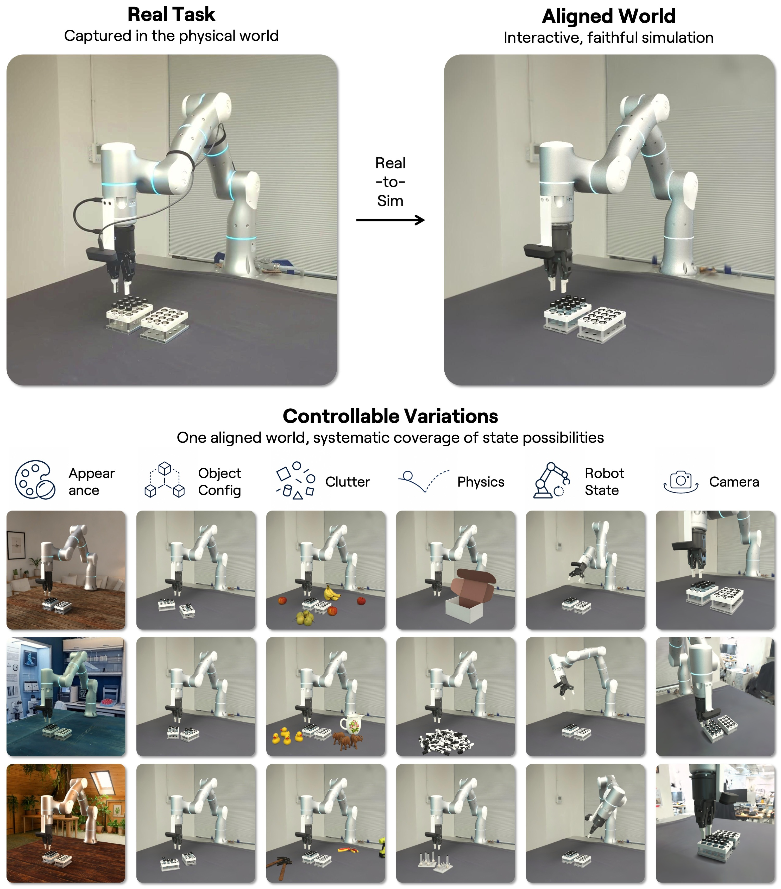

# AMD가 사들인 월드랩스, 로봇 성적표는 그림 안에만 있다

_AMD가 월드랩스를 전액 주식 82억 달러에 인수한다. 로봇 성공률은 블로그 그림에만 있고, 학계 지표로 측정한 적은 없다_

## Executive Summary

> [!callout]
> 이 글은 AMD가 2026년 9월 28일 발표한 82억 달러짜리 월드랩스 인수에서, 매체가 지나간 자리를 읽는다. 대부분의 보도는 이 거래를 칩 회사가 AI 스타 연구자를 영입한 일로 정리했다. 그런데 AMD 보도자료를 끝까지 읽으면 인수 자산 목록의 마지막에 "로봇 학습과 시뮬레이션 기술"이 붙어 있고, 월드랩스 자신의 글을 따라가면 그 기술이 어디서 왔는지가 적혀 있다. 월드랩스가 두 달 전에 인수한 SceniX라는 회사다.

> 그 엔진이 내놓은 결과는 7월에 블로그 한 편으로 공개됐다. 실측 학습 데이터 없이 시뮬레이션에서 배운 정책이 실물 로봇 다섯 종에 그대로 옮겨 갔다는 내용이다. 본문에는 성공률이 한 개도 적혀 있지 않다. 그림을 열면 사정이 달라진다. 축에는 성공률 눈금이 있고, 평가 대상이 엔비디아와 피지컬 인텔리전스가 만든 모델 둘이며, 가로축이 사후학습 반복 횟수라는 사실이 범례와 축 라벨에 적혀 있다. 본문이 말하지 않은 것을 그림이 말한다.

> 월드랩스는 같은 글에서 품질의 기준을 새로 세웠다. 쓸 만한 시뮬레이션은 실제 성공률을 정확히 맞출 필요가 없고 현실과 같은 결정을 내리게 해 주면 된다는 것이다. 합리적인 완화다. 문제는 그다음이다. 같은 명제를 정량으로 재는 지표가 2024년에 이미 나와 있고, 그 지표를 만든 연구실이 페이페이 리가 몸담았던 곳이다. 월드랩스는 그 지표를 쓰지 않았고, 남이 같은 지표로 다시 측정해 볼 도구도 열지 않았다. 생성기를 만드는 쪽이 평가 지표까지 쥐면 비는 자리는 독립적으로 측정하는 자리다.

±5.9 %p

실물 100회가 남기는 오차

성공률 0.9 근방의 95% 신뢰구간 반폭. 월드랩스가 체크포인트당 돌린 실물 시행이 100회다. 페블러스 계산

0건

로봇 발표문이 인용한 벤치마크와 기준선

원문 전수 검색 결과 benchmark, baseline, 순위 상관계수, 인용 문헌이 모두 0건이다

69일

SceniX 인수에서 AMD 발표까지

월드랩스가 로봇 시뮬레이션 회사 SceniX를 산 2026년 7월 21일부터 AMD 발표일까지의 간격

20 : 1

시뮬레이션 대 실물 시행 비율

체크포인트당 시뮬 2,000회 대 실물 100회. ALOHA 큐브 핸드오버 과제 기준이며, 학습 데이터량이 아니라 평가 횟수다

## 82억 달러는 확정가가 아니다

발표된 82억 달러는 AMD가 종결 시점에 실제로 치를 값이 아니다. 이 거래는 현금이 한 푼도 들어가지 않는 전액 보통주 교환이고, 교환에 쓰일 주식 수가 아직 정해지지 않았기 때문이다. AMD가 2026년 9월 26일 체결한 합병계약을 담은 Form 8-K는 그 사실을 회사 스스로 적어 두었다.

"the number of shares to be issued … **is not known**"

AMD, Form 8-K (amd-20260926), 2026년 9월 26일 체결 · 발행 주식 수는 종결일 2거래일 전까지의 10거래일 일별 거래량가중평균가격으로 산정한다고 같은 문서가 밝힌다.

발표는 미국 동부 시간 9월 28일 16시 5분, 정규장이 닫힌 뒤에 나왔다. 종결은 2026년 말까지로 예정돼 있고 규제 승인과 통상적인 종결 조건이 걸려 있다. 종결 전까지 AMD는 월드랩스를 반도체 사업과 분리해 운영한다고 CNBC가 전했다. 법인명은 World Labs Technologies, Inc.이고 본사는 샌프란시스코다.

이 8-K를 어느 항목으로 제출했는지도 함께 볼 만하다. 제출 항목은 3.02, 곧 미등록 주식 발행 하나뿐이다. 중요 계약 체결을 알리는 1.01 항목이 아니고, 제출 문서 목록에 합병계약서 자체가 첨부되지 않았다. 그래서 위약금과 규제 승인 관련 약정, 인력 유지 조건, 기존 투자자 지분의 처리 같은 조건은 공개 기록에 아예 없다. 발행 방식도 공모가 아니다. 같은 문서가 1933년 증권법 제4조(a)(2)와 레귤레이션 D 룰 506에 따른 사모 발행이라고 적는다. 이 글이 뒤에서 여러 번 공표되지 않았다고 적게 되는 까닭의 절반이 여기 있다. 조건을 담은 문서가 제출되지 않았으니 읽을 수가 없다. 8-K가 적은 금액도 "approximately $8.2 billion…subject to customary adjustments"라, 총액 자체에 조정 여지를 달아 두었다.

### 1.1. 자일링스 선례가 보여 주는 폭

전액 주식 거래에서 발표가와 종결가가 얼마나 벌어지는지는 AMD 자신의 이력에 답이 있다. 자일링스 인수는 2020년 10월 27일 약 350억 달러로 발표됐고, 2022년 2월 14일 종결됐다. 종결 시 회계상 인수대가는 488억 달러였다. FY2022 Form 10-K에 적힌 값이다. 발표 시점보다 39.4% 높다.

그래서 널리 퍼진 "AMD 역대 두 번째 규모"라는 서술은 축이 어긋난 비교다. 자일링스를 490억 달러로 적는 기사들이 쓰는 값은 종결가이고, 월드랩스의 82억 달러는 발표가다. 발표가끼리 견주면 350억 달러 대 82억 달러다. 순위 자체는 바뀌지 않지만, 두 숫자를 나란히 놓고 배수를 말하는 문장은 서로 다른 시점의 값을 곱하고 나누는 셈이 된다.

두 거래를 한 표에 넣어 보면 어긋난 자리가 보인다. 아래 표의 마지막 행이 이 글에서 가장 덜 알려진 수치다.

| 항목 | 자일링스 | 월드랩스 |
| --- | --- | --- |
| 발표 | 2020-10-27 · 약 350억 달러 | 2026-09-28 · 약 82억 달러 |
| 대가 형태 | 전액 AMD 보통주 | 전액 AMD 보통주 |
| 종결 | 2022-02-14 | 2026년 말 예정 |
| 종결 시 회계상 인수대가 | 488억 달러 | 미정 |
| 발표가 대비 이동 | +39.4 % | 미정 |
| 발행 주식 수 | 4억 2,900만 주 | 미정 · 9/28 종가 환산 약 1,350만 주 |

표 1. 자일링스 값은 AMD FY2022 Form 10-K와 2020년 발표문에서, 월드랩스 값은 2026년 9월 28일 보도자료와 Form 8-K에서 가져왔다. 자일링스의 488억 달러는 AMD 4억 2,900만 주의 공정가치 485억 달러에 대체 주식보상 2억 7,500만 달러를 더한 값이고, 적용 주가는 2022년 2월 11일 종가 113.18달러다. 월드랩스의 1,350만 주는 82억 달러를 9월 28일 종가로 나눈 환산값이므로 실제 발행 수는 종결 시점 주가 흐름에 따라 달라진다.

표의 첫 행과 마지막 행을 이어 읽으면 통념과 반대되는 그림이 나온다. 발표가로 견주면 자일링스가 월드랩스의 네 배쯤이다. 그런데 주식 수로 견주면 서른두 배 차이가 난다. 자일링스 때 AMD 주가는 113달러였고 지금은 600달러를 넘기 때문이다. 같은 돈을 주식으로 치르는 비용이 주가와 함께 내려간 셈이다. 이 비교에도 한 겹의 주의가 붙는다. 자일링스의 4억 2,900만 주는 종결 시 실제로 발행된 수이고, 월드랩스의 1,350만 주는 9월 28일 종가로 환산한 값이다. AMD의 희석률은 82억 달러를 그 종가 기준 시가총액으로 나눈 0.83%에 그친다.

시가총액   1,632,000,000주 × 607.87달러 = 9,920억 달러
희석률     82억 ÷ 9,920억 = 0.83 %
주식 수    82억 ÷ 607.87달러 = 약 1,350만 주
자일링스 대비  4억 2,900만 주 ÷ 1,350만 주 = 약 32배

발행주식수는 AMD의 2026년 6월 27일 기준 Form 10-Q 값이고 자사주는 없다. 주가는 9월 28일 종가다. 세 값 모두 9월 28일 종가를 고정한 환산이므로, 8-K가 정한 10거래일 가중평균 방식과는 다르다.

### 1.2. 주가가 뉴스를 반영한 날은 9월 29일이다

이 거래를 다룬 글에서 가장 흔한 날짜 착오가 여기 있다. 9월 28일 AMD 주가는 3.61% 내렸는데, 발표는 그날 장이 닫힌 뒤에 나왔다. 그 하락은 반도체 종목 전반의 조정이고 이 거래에 대한 반응이 아니다. 뉴스를 반영한 첫 정규장은 9월 29일이었다. 그날 주가는 장중 한때 1.3%까지 올랐다가 반락해 607.57달러로 닫혔고, 전일 대비 0.05% 낮은 사실상 보합이었다. 애널리스트 반응은 대체로 우호적이었다고 복수 매체가 전한다. 로젠블랫과 스티펠이 매수를 유지했고 BofA는 목표가를 720달러로 올렸다.

### 1.3. 82억 달러는 AMD에 어느 정도 체급인가

희석률 0.83%라는 숫자는 이 거래가 AMD 주주에게 작은 일이라는 인상을 준다. 손익계산서 쪽으로 옮기면 인상이 달라진다. 82억 달러는 AMD의 FY2026 2분기 총매출 115억 달러의 71%에 해당하고, 같은 해 상반기 연구개발비 합계 49억 2,800만 달러의 1.66배다. 분기 매출의 열에 일곱쯤을 한 연구소에 얹은 거래이고, 반년치 연구개발 예산보다 크다.

월드랩스 쪽 사다리도 짧다. 2024년 9월 스텔스를 벗을 때 기업가치는 약 10억 달러로 보도됐고, 2026년 2월 18일 오토데스크가 주도한 10억 달러 라운드 때는 50억 달러가 거론됐다. 그 50억 달러는 블룸버그가 2026년 1월 23일 "Fei-Fei Li's AI Startup World Labs in Funding Talks at $5 Billion Valuation"이라는 제목으로 먼저 보도한 값이고, 월드랩스는 확인도 반박도 하지 않았다. 2월 라운드 발표문에도 기업가치는 적히지 않았다. 82억 달러가 그 1.6배라는 서술은 맞지만, 분모가 보도값이고 분자가 발표 시점 환산가라 배수 자체가 두 겹의 불확정 위에 있다.

덧붙일 주의가 하나 있다. 일부 3차 출처가 이 라운드의 기업가치를 12억 달러대로 적었는데, 그 값은 월드랩스가 창업 이후 모은 누적 조달액이다. 기업가치로 옮겨 쓰면 숫자의 뜻이 바뀐다. 2월 라운드에 이름을 밝힌 투자자 목록에는 AMD 자신과 오토데스크, 에머슨 콜렉티브, 피델리티, 엔비디아, 씨가 들어 있다. 이 목록은 월드랩스 자사 블로그에 그대로 적혀 있다.

## 로봇 학습 엔진을 만든 곳은 SceniX다

AMD가 산 로봇 학습 역량의 엔진은 월드랩스가 직접 만든 것이 아니다. 두 달 전에 인수한 다른 회사에서 왔다. 이 귀속은 페블러스의 추론이 아니라 월드랩스가 자기 글에 적은 문장이다. 그런데 CNBC, 톰스하드웨어, 재팬타임스 어디에도 그 회사 이름이 나오지 않는다.

출발점은 AMD 보도자료 본문이다. 월드랩스가 무엇을 만드는 회사인지 설명하는 문장의 끝에 조항 하나가 붙어 있다.

"World Labs develops spatial-intelligence models that generate, reconstruct and simulate interactive 3D environments from text, image and video inputs, **as well as technology for robotic learning and simulation**."

AMD, 「AMD to Acquire World Labs to Advance the Future of AI Compute」, 2026년 9월 28일

"로봇 학습과 시뮬레이션 기술"이라는 이 마지막 구절이 가리키는 자산이 어디서 왔는지는 월드랩스 블로그에 적혀 있다. 회사는 2026년 7월 21일 SceniX라는 로봇 시뮬레이션 회사를 인수했고, 일주일 뒤 발표문에서 그 회사가 무엇을 만들어 왔는지 밝혔다.

"On July 21, SceniX, a robotics and simulation company, joined World Labs. SceniX has been building systems that turn real robots, environments, and interactions into simulations for policy training and evaluation, **developing a real-to-sim-to-real (R2S2R) engine** that turns one physical task into many controllable, reusable worlds, helping robotics teams train policy models and test changes faster, uncover failures earlier, and reduce costly experimentation on hardware."

World Labs, 「Building Worlds That Train Robots」, 2026년 7월 28일

R2S2R은 실물을 시뮬레이션으로 옮기고, 거기서 학습한 정책을 다시 실물로 되돌리는 왕복 경로를 뜻한다. 월드랩스가 AMD에 넘기는 로봇 학습 설비의 이름이 그것이고, 그 엔진을 만든 주체를 회사 스스로 SceniX라고 적었다. 인수 발표까지 걸린 시간은 69일이다.

*▲ 실물 과제 한 건을 정렬된 시뮬레이션으로 옮긴 뒤, 외관·물체 배치·잡동사니·물리·로봇 자세·카메라 여섯 축을 체계적으로 바꿔 통제 가능한 세계 여러 개를 만든다 | Source: [World Labs, "Building Worlds That Train Robots"](https://www.worldlabs.ai/blog/real-to-sim-to-real)*

이 귀속은 7월 발표문 한 군데에만 있는 것도 아니다. 인수 발표 당일 페이페이 리가 자기 이름으로 올린 글에 같은 문장이 다시 나온다. 회사가 2024년 창업 이후 쌓은 역량을 열거하는 대목에서 "with the acquisition of SceniX, we're building towards an industry leading capability for robotics simulation"이라고 적는다. 회사가 AMD로 넘어가는 날 대표가 직접 꼽은 로봇 역량의 출처가 SceniX다. 그 이름이 없는 문서는 AMD 보도자료 쪽이다.

### 2.1. 69일 안에 벌어진 네 가지 일

네 사건을 날짜순으로 늘어놓으면 무게중심이 어디로 기울었는지 보인다. SceniX 인수와 R2S2R 공개 사이는 일주일이고, Atlas 공개와 AMD 발표 사이는 4주가 되지 않는다. 회사가 로봇 쪽으로 방향을 튼 시점과 인수 발표가 같은 분기 안에 들어 있다.
