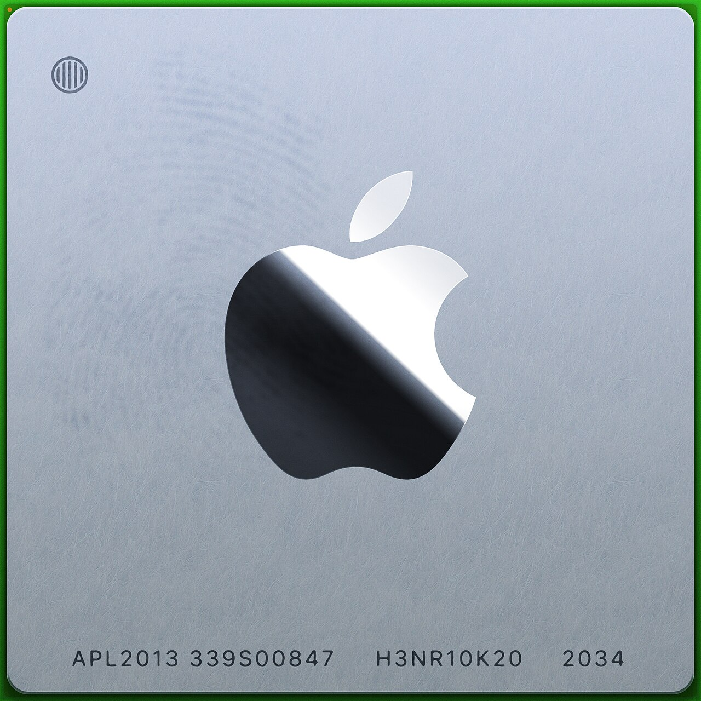
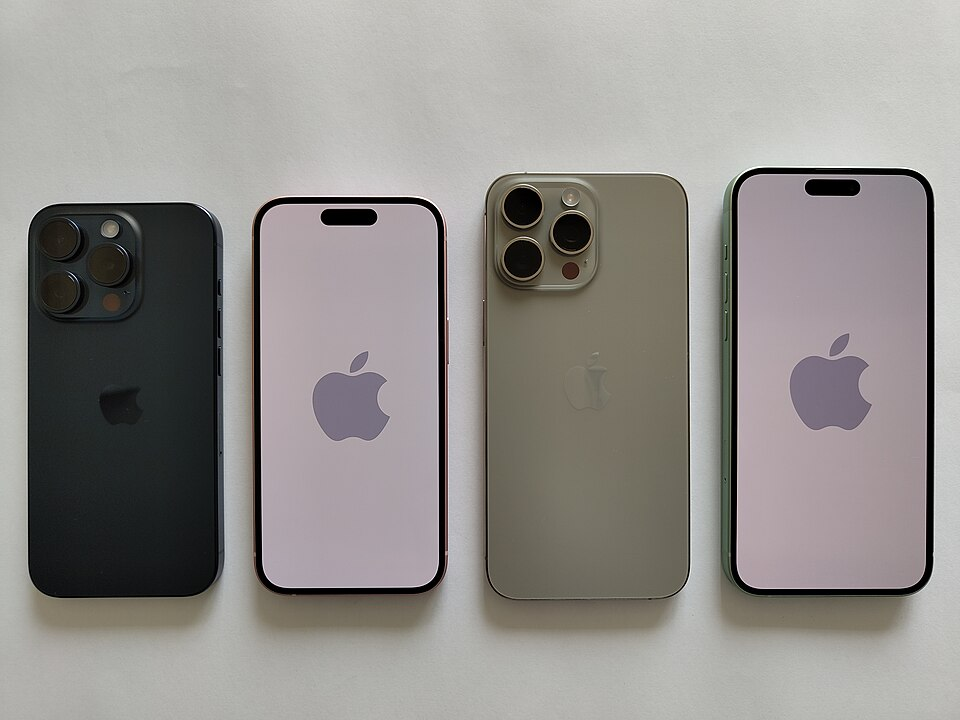

# 모델은 빌리고, 데이터는 가둔다: WWDC 2026이 깐 주권 AI 인프라

_Gemini 협력, 온디바이스+Private Cloud Compute, 그리고 데이터를 _

## Executive Summary

> [!callout]
> WWDC 2026의 진짜 뉴스는 대화형 Siri가 아니다. Apple이 25억 대의 소비자 디바이스 위에 "데이터가 어디서 만들어지고, 어디에 저장되고, 누가 통제하는가"를 다시 설계한 **주권 AI 데이터 인프라**를 깔았다는 사실이다. Apple은 프론티어 비서를 자체 모델로 만드는 대신 Google Gemini 기술을 라이선스해 가져왔고(보도 기준 추정), 그 모델을 일반 클라우드가 아니라 데이터를 "저장하지 않도록" 설계한 Private Cloud Compute에서 격리 실행한다. 이 글은 WWDC 2026의 기능 발표를 데이터 인프라의 지도로 다시 그린다.

> 선택은 모순처럼 보인다. 능력이 부족해 남의 모델을 빌리면서도, 데이터 통제권은 한 치도 내주지 않으려 한다. 그러나 이 모순이야말로 2026년 소비자 AI의 핵심 설계 원리다. 클라우드 AI에 대한 신뢰가 무너지고 데이터 주권 요구가 커지는 환경에서, **"모델은 빌리되 데이터는 내 디바이스 안에 둔다"**는 분리가 빅테크의 표준이 되어 간다. 온디바이스에는 2비트로 압축한 30억 파라미터 모델을 두고, 그 한계를 넘는 요청만 서버로 위탁하는 "온디바이스 우선" 라우팅이 그 분리를 구현한다.

> 개인 맥락(메시지·사진·캘린더·메일)을 온디바이스 시맨틱 인덱스로 묶어 Siri를 "진짜 비서"로 만드는 것도, Spatial Reframing이 사진을 디바이스에서 3D로 재구성하는 것도 모두 같은 줄기다. 지능은 데이터가 있는 곳으로 가야 한다. 이 보고서는 데이터 실무자가 "다음 분기 우리 제품의 AI 데이터 전략을 어떻게 짤 것인가"를 판단하도록, 화려한 기능 뒤에 깔린 데이터 아키텍처를 읽는다.

이 보고서의 핵심을 정량으로 잡으면 네 수치로 압축된다. 디바이스가 얼마나 많고, 그 위의 모델이 얼마나 작으며, 왜 그렇게까지 데이터를 가두려 하는지를 보여준다.

<!-- stat-card -->
**25억** — Apple 전체 활성 디바이스 — 온디바이스 AI가 깔리는 잠재 규모 (Apple 공식)

<!-- stat-card -->
**2비트 / 30억** — 온디바이스 AFM 3 Core의 압축률·파라미터 — "압축의 승리" (Apple 공식)

<!-- stat-card -->
**70%** — AI 기업을 거의·전혀 신뢰하지 않는 미국인 비율 — '데이터 미저장'의 시장 이유 (Pew)

<!-- stat-card -->
**약 9.4억** — Apple Intelligence 활성화 추정 기기 (1년 전 대비 약 3.4배, Presenc AI 추정)

## 기능 나열을 데이터 지도로 다시 그리기

WWDC 2026 발표를 받아 적으면 기능 목록이 된다. 새 macOS의 이름은 macOS Golden Gate이고, Liquid Glass의 가독성을 다듬고 글래스 강도를 조절하는 슬라이더가 생겼다. 앱 실행은 최대 30% 빨라지고, 새 사진 로딩은 70%, AirDrop은 80% 빨라졌으며, iPad 외장 드라이브 전송은 5배가 됐다. Spotlight·Photos·Mail 검색 엔진은 재설계되어 방금 만든 콘텐츠까지 즉시 인덱싱한다. TechCrunch가 이미 정리한 이 목록을, 우리는 다른 질문으로 다시 읽는다. **이 수치들은 무엇을 위한 정제인가.**

*▲ WWDC 2026의 무대, 쿠퍼티노 Apple Park. 발표의 표면은 기능 목록이지만, 그 아래에는 데이터 인프라의 재설계가 깔려 있다. | Source: [Wikimedia Commons — Daniel L. Lu (CC BY-SA 4.0)](https://commons.wikimedia.org/wiki/File:Aerial_view_of_Apple_Park_dllu.jpg)*

답은 데이터 파이프라인이다. 온디바이스 AI를 돌리려면 모델이 참조할 데이터가 디바이스 안에서 빠르게 읽히고, 색인되고, 옮겨져야 한다. 사진 로딩 70%, 외장 드라이브 전송 5배, 검색 엔진 재설계와 즉시 인덱싱은 사용자 눈에는 "빨라졌다"로 보이지만, 시스템 관점에서는 **모델이 쓸 데이터를 제때 공급하는 파이프라인의 정비**다. 화려한 퍼센트 뒤에서 Apple이 손본 것은 결국 데이터가 디바이스 안을 흐르는 속도다.

지원 범위에서 가장 자주 오독되는 대목을 먼저 못 박아 둔다. iOS 27은 iOS 26과 같은 기종, 즉 2019년 출시된 iPhone 11(A13)까지 지원하고 성능 향상도 그 범위까지 닿는다. 역대 처음으로 구형 기기를 떨어뜨리지 않은 OS다. 그러나 **새 Siri와 차세대 Apple Intelligence는 iPhone 15 Pro(A17 Pro) 이상에서만** 작동한다. "OS 성능이 도달하는 선"과 "AI 지능이 도달하는 선"은 다른 선이다. Apple은 인프라 베이스는 7년 전 기기까지 넓히되, 진짜 지능은 최신 실리콘에 고정하는 이중 전략을 택했다.

> [!callout]
> 기능 발표를 데이터 렌즈로 보면 메시지가 하나로 모인다. 성능 수치는 신기능 자랑이 아니라 **온디바이스 AI를 돌릴 데이터 파이프라인의 정제**이고, 기기 지원의 이중 전략은 "AI를 어디까지 책임지고 돌릴 것인가"라는 데이터 처리 능력의 선 긋기다.

## 모델을 '빌리는' 시대: Apple–Gemini 협력

이 재설계의 배경에는 절박함이 있다. Apple Intelligence는 출시 1년이 지나도록 소비자 인식이 좀처럼 살아나지 않았다. 한 조사에서는 80%가 한 번쯤 써 봤다고 했지만, 다른 집계에서는 절반 이상이 기능을 아예 켜지 않은 채로 두었고, 기능에 대한 지불 의향은 월 9.11달러에서 8달러 수준으로 내려갔다. 자체 모델만으로 프론티어 비서를 만들겠다는 계획이 시간표를 맞추지 못한 것이 재설계의 직접적인 동기였다.

경쟁 구도를 겹쳐 보면 절박함은 더 또렷해진다. ChatGPT는 주간 활성 사용자가 8억 명을 넘었고(2026년 초 9억 명 돌파, 보도 기준), Gemini 앱은 월 활성 사용자 7억 5,000만 명에 이른다(Alphabet 실적). 반면 Siri는 25억 대라는 압도적인 도달 잠재력을 깔고 앉아 있으면서도, 실제 생성형 AI 비서로서의 채택은 그 규모에 한참 못 미쳤다. **가장 넓은 무대를 가진 플레이어가 정작 그 무대를 쓰지 못하고 있던 셈이다.** 시간표를 직접 맞출 수 없다면, 능력은 빌려 와서라도 그 무대를 살려야 했다.

그래서 Apple은 길을 바꿨다. Bloomberg의 마크 거먼 보도(Apple 미확인)에 따르면, Apple은 약 1.2조 파라미터 규모의 맞춤 Gemini 모델을 연 10억 달러 안팎에 라이선스해 클라우드 쪽 고난도 추론에 활용한다. 모든 수치는 보도 기반 추정이며 다년 총액은 더 클 수 있다. 중요한 것은 액수가 아니라 구조다. **Apple은 모델의 능력을 외부에서 빌렸지만, 데이터 통제권은 빌려주지 않았다.** 계약상 Google은 Apple 사용자 데이터로 자사 모델을 학습할 수 없고, 추론은 Apple이 통제하는 환경에서 일어난다.

*▲ Apple이 클라우드 쪽 고난도 추론에 빌려 온 것으로 보도된 Google Gemini. 능력은 외부에서 빌렸지만, 데이터 통제권은 빌려주지 않았다. | Source: [Wikimedia Commons — Google LLC (Public Domain)](https://commons.wikimedia.org/wiki/File:Google_Gemini_logo_2025.svg)*

모델 소싱의 지형이 바뀌고 있다는 신호다. 직접 학습하느냐, 빌려서 자기 데이터로 정렬하느냐는 이제 소비자 제품의 전략 선택지다. 아래 표는 그 분리를 정리한 것이다.

| 층위 | 무엇을 외부에서 빌렸나 | 무엇을 내부에 가뒀나 |
| --- | --- | --- |
| 모델 능력 | 클라우드 고난도 추론에 맞춤 Gemini 라이선스(보도 추정) | 온디바이스 3B 모델·서버 PT-MoE는 Apple 자체 AFM |
| 데이터 | (없음) — 사용자 데이터 학습 금지(계약상) | 개인 맥락·추론 입력 모두 Apple 통제 환경에 격리 |
| 실행 환경 | 확장 인프라 일부에 Google Cloud·NVIDIA GPU | Apple Silicon 기반 PCC + Confidential Computing |

************

> [!callout]
> 능력은 외부에서 빌리고, 데이터는 내부에 가둔다. 이 분리가 WWDC 2026이 보여준 모델 소싱의 새 문법이다. 빅테크조차 모든 모델을 직접 만들지는 않는다. 다만 **데이터만큼은 어디서도 빌리지 않는다.**

## '저장하지 않는' 아키텍처: 온디바이스 + Private Cloud Compute

데이터를 내재화한다는 약속이 슬로건에 그치지 않으려면 두 가지가 필요하다. 디바이스에서 충분히 많은 일을 처리할 만큼 작고 빠른 모델, 그리고 디바이스를 벗어나는 요청을 받아도 데이터를 남기지 않는 서버다. Apple은 둘 다 내놓았다.

### 3.1. 온디바이스 우선 라우팅과 '압축의 승리'

온디바이스 모델 AFM 3 Core는 30억 파라미터를 가중치당 2비트(QAT, 양자화 인식 학습)로 압축했다. 일반적인 16비트의 8분의 1 수준이다. 휴대폰 메모리 안에 들어가면서도 쓸 만한 품질을 내도록 짜낸 결과이고, 이것이 "온디바이스 우선"을 가능케 한 토대다. 서버 모델은 20억~40억 개 중 일부만 활성화하는 Parallel-Track MoE 구조로, 용량이 필요한 요청만 받는다. 기본은 디바이스가 처리하고, 한계를 넘는 요청만 서버로 위탁한다.

다만 정확히 어떤 작업이 로컬에서, 어떤 작업이 서버에서 처리되는지의 분배 비율은 Apple이 공개한 적이 없다. "온디바이스 X% / 클라우드 Y%" 같은 수치는 신뢰할 수 없으며, 확인된 것은 정성적인 "온디바이스 우선" 정책뿐이다. 라우팅의 흐름은 다음과 같다.

| 단계 | 처리 위치 | 데이터의 운명 |
| --- | --- | --- |
| 1. 기본 요청 | 디바이스 — AFM 3 Core (3B, 2비트) | 디바이스를 벗어나지 않음 |
| 2. 용량 초과 | Private Cloud Compute — 서버 AFM(PT-MoE) | 암호화 전송, 처리 후 미저장 |
| 3. 고난도 추론 | PCC 확장 인프라 — 맞춤 Gemini(보도 추정) | 로그·세션 없음, 학습 금지 |

************

### 3.2. '데이터 미저장'은 검증 가능한 설계다

일반 클라우드 AI와 PCC의 차이는 "데이터를 남기지 않는다"는 약속을 **구조로 강제**한다는 데 있다. PCC는 다섯 가지 요건 위에 설계됐다. 연산 후 상태를 남기지 않는 무상태(Stateless), 보증을 강제할 수 있는 설계(Enforceable), 운영자조차 들여다볼 수 없는 특권 접근 차단(No privileged access), 특정 사용자를 겨냥할 수 없는 비표적성(Non-targetability), 그리고 외부가 검증할 수 있는 투명성(Verifiable transparency)이다.

이 다섯 요건은 Confidential Computing으로 구현된다. NVIDIA Confidential Computing, Intel TDX, Google Titan 보안 칩, 그리고 변경 불가능한 추가 전용(append-only) 원장이 결합한다. 결정적으로, 2026년 6월 한 ACM 컨퍼런스 논문이 PCC의 핵심 프라이버시 주장을 독립적으로 검증했다. 회사의 자기 선언이 아니라 외부 검증을 통과한 아키텍처라는 뜻이다. 일반 클라우드처럼 로그와 세션을 남기지 않는 것이 구조적 차이다.

> [!callout]
> "데이터를 저장하지 않는다"는 마케팅 문구는 흔하다. 드문 것은 그것을 **외부가 검증할 수 있는 설계**로 만든 경우다. PCC는 주권 AI의 소비자 버전인 셈이다. 데이터를 내 통제 밖으로 보내더라도, 그것이 어떻게 다뤄지는지를 증명할 수 있게 한다.

### 3.3. 왜 디바이스인가: 프라이버시 너머의 경제학

데이터를 디바이스 안에 두려는 이유가 프라이버시뿐이라고 보면 절반만 본 것이다. 나머지 절반은 경제학이다. 클라우드 추론은 쿼리당 선형으로 과금되고, 그 부담은 사용자가 늘수록 그대로 비례해 커진다. 반면 온디바이스 추론은 칩이라는 선투자만 끝나면 추가 쿼리의 한계비용이 사실상 0에 수렴한다. 25억 대의 기기를 가진 회사에게, 추론을 디바이스로 미는 것은 프라이버시 약속인 동시에 거대한 원가 구조의 선택이다.

*▲ Apple Silicon. 칩이라는 선투자가 끝나면 추가 쿼리의 한계비용은 0에 수렴한다 — 데이터를 디바이스에 가두는 선택이 추론 경제학에서도 합리적인 이유다. | Source: [Wikimedia Commons — Henriok (CC0)](https://commons.wikimedia.org/wiki/File:Apple_silicon_processor.jpg)*

에너지 축에서도 같은 그림이 나온다. 일반 AI 쿼리 한 번은 구글 검색의 약 10배 전력을 쓰고, 추론에 특화된 모델은 한 쿼리에 기본의 최대 100배에 달하는 7~40Wh를 소모한다는 분석이 있다(arXiv 2505.09598). 더 중요한 것은 비중이다. AI가 쓰는 전체 에너지의 80~90%가 학습이 아니라 추론에서 나온다. 추론이 AI 컴퓨팅의 3분의 1에서 3분의 2로 넘어가는 전환기(Deloitte 추정)에, 그 추론을 부하 시 30~70W로 도는 Apple Silicon 위로 분산시키는 것은 **비용·전력·신뢰라는 세 축을 한 번에 누르는 수**다. 데이터를 디바이스에 가두는 선택은, 결국 추론 경제학에서도 합리적이다.

## 개인 맥락이라는 데이터: Siri의 시맨틱 인덱스

새 Siri가 "진짜 비서"처럼 보이는 이유는 자연스러운 대화 때문이 아니다. 메시지·사진·캘린더·메일에 흩어진 개인 맥락을 가로질러 참조하기 때문이다. "지난주에 받은 그 콘서트 티켓 찾아 줘", "가족 사진 중에 작년 여름 바다에서 찍은 것 공유해 줘" 같은 요청에 답하려면, Siri는 사용자의 데이터를 검색 가능한 형태로 쥐고 있어야 한다. 데모가 인상적이었던 만큼, 그 뒤에 깔린 데이터 작업도 만만치 않다.

Apple이 손본 것이 바로 이 지점이다. Spotlight·Photos·Mail이 하나의 검색 엔진을 공유하고, 새로 만든 데이터를 즉시 인덱싱한다. Siri 위에는 메시지·사진·캘린더·메일을 가로질러 맥락을 묶고 앱 액션을 조율하는 System Orchestrator가 있다. 화면을 읽는 On-screen awareness와 카메라를 통한 Visual Intelligence까지 더해, 기기 안 개인 데이터와 화면과 웹 지식을 하나로 연결한다.

*▲ 새 Siri와 차세대 Apple Intelligence는 iPhone 15 Pro(A17 Pro) 이상에서만 작동한다. 개인 맥락의 시맨틱 인덱스는 최신 실리콘 위에서 온디바이스로 일어난다. | Source: [Wikimedia Commons (CC BY-SA 4.0)](https://commons.wikimedia.org/wiki/File:Apple_iPhone_15_Pro.jpg)*

데이터 실무자의 눈에 이것은 익숙한 문제다. 흩어진 개인 데이터를 하나의 검색 가능한 표현으로 묶는 일은 **소비자 스케일의 RAG이자 시맨틱 인덱스 구축**이다. 임베딩을 만들고, 색인하고, 질의에 맞는 조각을 꺼내 오는 그 작업이 수억 대의 기기에서 온디바이스로 일어난다. 디바이스를 벗어나는 요청만 데이터 미저장 PCC를 거친다. "Siri가 똑똑해졌다"는 결국 "개인 데이터가 모델이 쓸 수 있는 형태로 정제·구조화됐다"는 말과 같다.

> [!callout]
> 비서의 지능은 모델 크기가 아니라 데이터의 정리 상태에서 나온다. Siri의 "진짜 비서"화는 본질적으로 **개인 데이터의 품질 문제**다. 메시지·사진·메일을 얼마나 잘 색인하고 그 색인을 얼마나 안전하게 다루느냐가 비서의 쓸모를 결정한다.

## 온디바이스가 데이터를 '만든다': Spatial Reframing과 Physical AI

이미지 기능은 보통 발표의 양념으로 취급된다. 그러나 이번 Spatial Reframing은 데이터 관점에서 가장 흥미로운 대목이다. 이미 찍은 사진을 두고, 마치 사후에 카메라를 움직인 것처럼 구도와 원근을 다시 잡는 기능이다. 단순한 2D 크롭이 아니다. 온디바이스 3D 공간 모델이 장면을 재구성하고, PCC의 생성 모델이 가려졌던 영역을 복원한다. 전경의 인물과 배경이 따로 움직이고, 가려졌던 부분이 자연스럽게 드러난다.

이 외에도 Image Playground는 부분 지정 수정과 내 사진 기반 생성을 지원하고, Photos의 Cleanup 품질이 올라갔으며 이미지 Extend가 추가됐다. 공통점은 분명하다. **디바이스가 원본에 없던 데이터를 생성한다.** 가려져서 찍히지 않은 픽셀을, 모델이 "그럴듯하게" 채워 넣는다.

여기서 Physical AI와 같은 질문이 떠오른다. 복원되고 생성된 데이터가 "그럴듯함"을 넘어 "옳음"을 보증하는가. 로봇과 VLA(Vision-Language-Action) 모델은 합성 데이터로 학습 데이터를 증강하면서 똑같은 문제를 안는다. 생성된 라벨이 자동으로 옳은 것은 아니다. 가려진 부분을 채운 결과가 실제 장면과 다르다면, 소비자 사진에서는 어색한 사진 한 장으로 끝나지만 로봇에서는 잘못된 행동으로 이어진다. 같은 원리, 다른 위험이다.

> [!callout]
> 온디바이스 생성은 "데이터를 처리하는 AI"에서 "데이터를 만드는 AI"로의 이동이다. 그리고 만들어진 데이터의 신뢰성을 보증하는 문제는 **소비자 사진과 산업용 로봇이 공유한다.** 합성되고 복원된 데이터가 정말 옳은가. 이 물음이 Physical AI와 소비자 카메라를 잇는 데이터 품질의 공통 과제다.

## 데이터 주권의 지정학: Child Safety, 그리고 EU·중국

온디바이스 처리는 기술 선택이기 전에 통치 선택이다. WWDC 2026이 대폭 강화한 아동·청소년 보호 기능이 그 증거다. 기존 계정을 Child Account로 전환해 연령별 보호를 자동 적용하고, 앱 구매 승인(Ask to Buy)에 더해 웹사이트 열람 승인(Ask to Browse)이 신설됐다. 누드뿐 아니라 폭력·유혈 콘텐츠도 차단하며, 라이브 FaceTime에도 적용된다. 미국소아과학회(AAP) 등 전문가 연구에 기반해 설계됐다고 Apple은 밝혔다.

이 민감한 판별 — 연령 추정, 유해 콘텐츠 탐지 — 이 가능한 한 디바이스 안에서 일어난다는 점이 핵심이다. 아동의 이미지를 서버로 보내 검사하는 대신, 디바이스가 직접 처리한다. 가장 민감한 데이터일수록 디바이스를 벗어나지 않게 하는 것, 그것이 온디바이스 처리가 가진 규제적 의미다.

규제 지형은 새 Siri의 출시 범위에서 그대로 드러난다. 개발자에게는 발표 당일부터 열리지만 일반 사용자 베타는 올해 후반이고, 언어는 영어부터 시작해 점차 확대된다. 그리고 **EU는 초기 출시에서 제외**되며(Digital Markets Act 등 플랫폼 규제 환경), **중국 본토 계정은 규제로 Apple Intelligence가 작동하지 않는다.** 역설이 여기 있다. "온디바이스 처리·데이터 미저장"은 본래 프라이버시 설계였지만, 동시에 규제가 까다로운 시장에서 컴플라이언스 도구가 될 수 있다. 데이터가 어디로도 가지 않는다면, 데이터 이전을 규제하는 법의 상당 부분이 적용 대상을 잃는다.

> [!callout]
> **Editor's Note.** 페블러스는 Apple 분석 회사가 아니다. 우리가 이 발표에 주목하는 이유는, 여기서 표준이 된 설계 원리가 우리가 vendor-neutral·device-aware·sovereign AI로 다뤄 온 것과 정확히 같기 때문이다. 페블러스는 [Apple Silicon에서 DataClinic을 재현](/report/automatic-config-apple-silicon-2026/ko/)하며 자체 실리콘·로컬 추론으로의 이동을 짚어 왔다. WWDC 2026은 그 흐름이 세계 최대 소비자 플랫폼에서 검증되는 외부 증거다. "모델은 빌리되 데이터는 내재화"하는 분리, 온디바이스 우선 라우팅, 데이터 미저장 컴플라이언스 — 이 세 패턴은 자사 제품의 AI 데이터 전략에 그대로 대입할 수 있는 레퍼런스다. 자랑이 아니라 관찰이다. 업계가 데이터 주권의 방향으로 움직이고 있다.

## 결론: 능력은 빌릴 수 있어도, 데이터는 빌릴 수 없다

WWDC 2026을 데이터 인프라의 지도로 다시 그리면, 흩어져 보이던 기능들이 하나의 설계 원리로 수렴한다. macOS의 성능 향상은 데이터 파이프라인의 정제였고, Gemini 협력은 능력의 외주이면서 데이터의 내재화였으며, PCC는 검증 가능한 데이터 미저장 구조였다. 새 Siri는 개인 데이터의 시맨틱 인덱스였고, Spatial Reframing은 신뢰성이 필요한 데이터 생성이었으며, 아동 보호와 규제 대응은 데이터 주권의 통치적 얼굴이었다.

2026년 소비자 AI의 문법은 분명해졌다. 능력이 모자라면 모델을 빌릴 수 있다. 그러나 데이터만큼은 어디서도 빌리지 않고, 가능한 한 디바이스 안에 둔다. 클라우드 신뢰가 무너지고 규제가 까다로워지는 환경에서, 이 분리는 선택이 아니라 표준이 되어 간다. 데이터 실무자가 다음 분기에 던질 질문도 여기서 나온다. 우리는 무엇을 로컬에 둘 것인가, 어떤 모델을 소싱할 것인가, 그리고 데이터가 어디에 머무는지를 어떻게 증명할 것인가.

> [!callout]
> **한 문장 요약:** WWDC 2026의 진짜 발표는 대화형 Siri가 아니라, 25억 대의 디바이스 위에 깔린 주권 AI 데이터 인프라다. 모델은 빌리고, 데이터는 가둔다.

## 참고문헌

본문에서 인용한 자료를 Apple 1차·공식, 정책·설문, 시장·산업·보도의 세 갈래로 정리했다. Gemini 라이선스 관련 수치는 모두 보도 기반 추정이며 Apple이 공식 확인한 바 없다.

### R.1. Apple 1차·공식

- 1.Apple Newsroom. (2026). "Apple unveils next generation of Apple Intelligence, Siri AI, and more." [apple.com/newsroom](https://www.apple.com/newsroom/2026/06/apple-unveils-next-generation-of-apple-intelligence-siri-ai-and-more/)
- 2.Apple Machine Learning Research. (2026). "Introducing the Third Generation of Apple Foundation Models." 온디바이스 3B·2bpw QAT, 서버 Parallel-Track MoE. [machinelearning.apple.com](https://machinelearning.apple.com/research/introducing-third-generation-of-apple-foundation-models)
- 3.Apple Security Research. "Private Cloud Compute." PCC 5대 요건·검증 가능한 투명성. [security.apple.com](https://security.apple.com/blog/private-cloud-compute/)
- 4.Apple Security Research. "Expanding Private Cloud Compute." Google Cloud·NVIDIA 확장 인프라의 Confidential Computing. [security.apple.com](https://security.apple.com/blog/expanding-pcc/)

### R.2. 정책·설문·학술

- 5.Pew Research Center. (2023). "How Americans View Data Privacy." 미국인 약 70% AI 기업 거의·전혀 불신. [pewresearch.org](https://www.pewresearch.org/internet/2023/10/18/how-americans-view-data-privacy/)
- 6.arXiv:2505.09598. (2025). AI 추론 에너지 소비 분석. 추론이 AI 에너지의 80~90% 차지. [arXiv:2505.09598](https://arxiv.org/abs/2505.09598)
- 7.Ranking Digital Rights. (2025). Big Tech Edition — Apple 평가. [rankingdigitalrights.org](https://rankingdigitalrights.org/bte25/companies/Apple)
- 8.American Academy of Pediatrics. 아동·청소년 미디어 사용 권고 (Child Safety 설계 근거). [aap.org](https://www.aap.org/)

### R.3. 시장·산업·보도

- 9.Counterpoint Research. (2026). Active Installed Base — 약 4대 중 1대가 iPhone. [counterpointresearch.com](https://counterpointresearch.com/en/insights/Active-Installed-Base-8-Smartphone-OEMs-Top-200-mn-Nearly-1-in-4-is-an-iPhone)
- 10.AppleInsider. (2026). "Apple reaches 2.5 billion active devices." 2026-01-29. [appleinsider.com](https://appleinsider.com/)
- 11.Deloitte. (2026). TMT Predictions 2026. 추론 비중 1/3→2/3, 추론칩 시장 500억 달러+. [deloitte.com](https://www2.deloitte.com/us/en/insights/industry/technology/technology-media-and-telecom-predictions.html)
- 12.Gurman, M. / Bloomberg. (2026). Apple–Google Gemini 라이선스 보도 — 약 1.2조 파라미터, 연 ~10억 달러(Apple 미확인). [bloomberg.com](https://www.bloomberg.com/)
