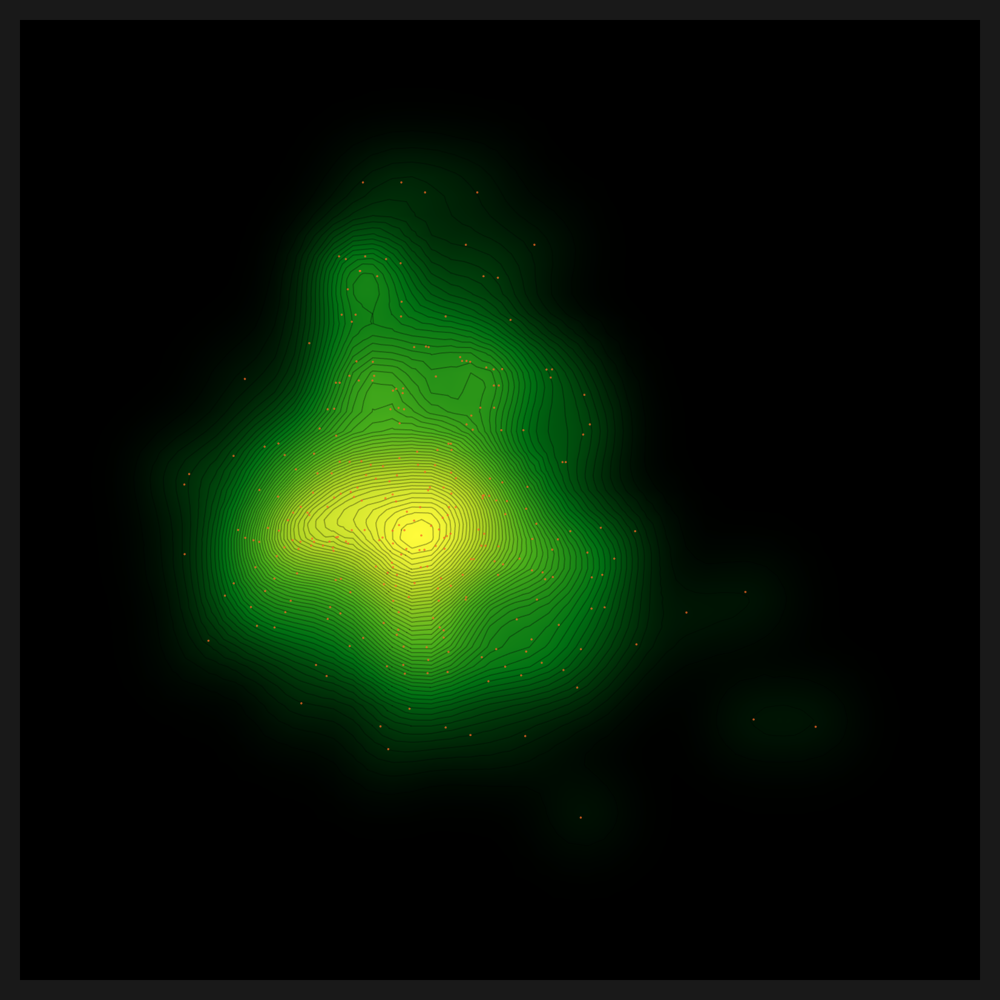
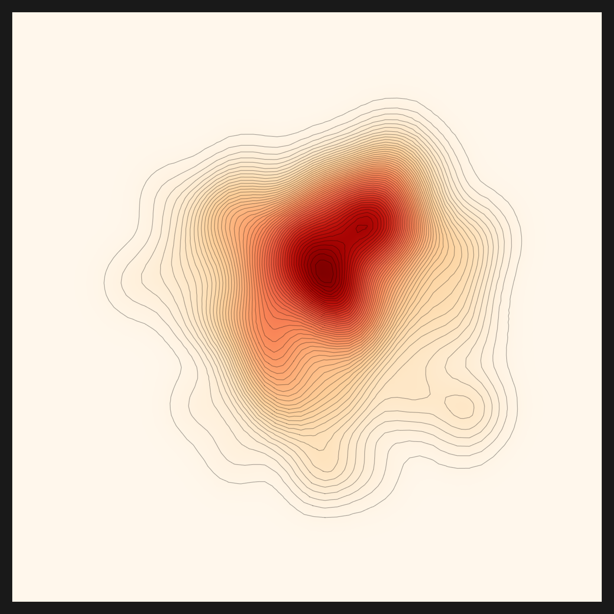
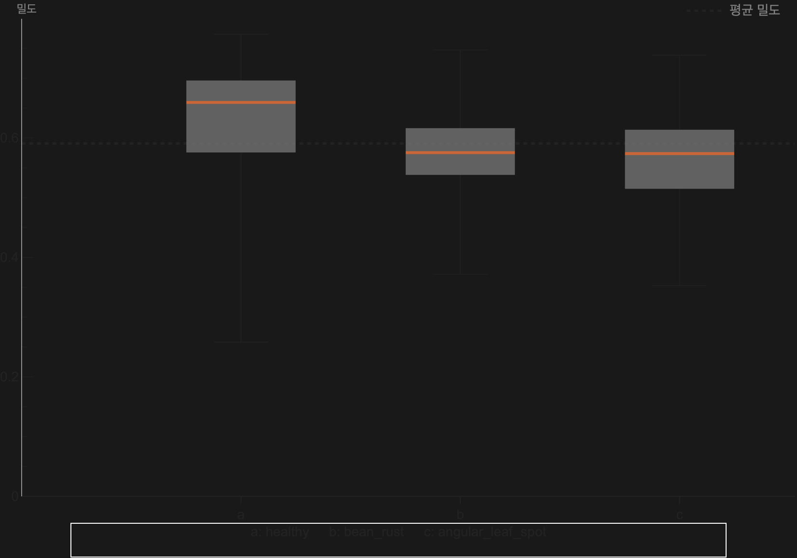

# The Engine That Ran Zero Lines, Until It Drew a Density Map

_Porting an NVIDIA + vLLM engine to Apple Silicon — device-aware, vendor-neutral, for sovereign AI_

## Executive Summary

> [!callout]
> There was an engine that ran zero lines. **automatic-config** is the internal Agentic AI engine Pebblous built while developing [DataGreenhouse](/project/DataGreenhouse/data-greenhouse-strategy/en/) under the AADS project — a multi-layer agent framework wrapping DataClinic's many tools and policies, and our team's internal core asset, the Data Clinic engine. As the reasonable choice of a team that built a fast, working engine first, it had been written to fit the in-house setup it grew up in: a single NVIDIA GPU and a running vLLM server on an internal company machine. An Apple Silicon Mac has none of those three. We decided to bring our own engine back to life on a Mac, from the first line to the last. The destination was a density map of a single bean leaf, a picture that lets you see data quality with your own eyes.

> There were twelve places where it stopped. We did not route around any of them. At each wall the rule was the same: one commit, one fix, always at the root. The deepest wall turned out to be the simplest. What had collapsed the entire density map was a single `.cuda()` line buried in a helper script. We changed that one line to be device-aware (cuda → mps → cpu), and the map came back. With it, the **full preprocessing → recommendation → diagnosis pipeline finished end to end on a Mac for the first time**. That is the first time our engine has run end to end anywhere outside NVIDIA.

> But finishing the run is not the same as a valid result. The philosophy behind automatic-config's recommendation is "representative image → an initial ontology (the domain) → the right lens." On the first run the pipeline went all the way through without a crash, yet inside it the domain extraction was **failing silently**. With the domain left empty, the lens fell back not on any understanding of the data but on download popularity, which is why both the bean leaves and the skin lesions landed on the very same, most famous `openai/clip-vit-base-patch32`. To be honest, the first telling, that "the engine chose the lens that fit the data on its own," was an overstatement. We caught that silent failure, routed the recommendation LLM through a capable endpoint the way diagnosis already was, and stripped the popularity bias out of the ranking, and only then, in v2, did the domain understanding come back.

> The proof came from a third dataset. Feed in fashion images and the domain resolved to fashion, and the final recommendation shifted, for the first time, away from CLIP to `patrickjohncyh/fashion-clip`. That was the first time the same engine picked a different lens for different data. So this is a success story, but an honest one. It is the story of bringing an engine that ran zero lines back to life, of admitting that the recommendation we had reported as "finished" was in fact blind to the domain, and of fixing and proving it, and of how every one of those fixes makes the engine vendor-neutral. Disclosing the limits honestly, we believe, only makes the piece stronger.

### By the numbers

M5 Max / 128GB / macOS, 2026-06-07. Source: Pebblous Data Clinic local reproduction.

<!-- stat-card -->
**12 walls** — 1 commit = 1 fix — Each cleared by a root fix, never a workaround

<!-- stat-card -->
**1.9 → 46** — embedding img/s (MPS) — device-aware switched the CPU path to Apple Silicon GPU

<!-- stat-card -->
**3 layers** — vendor-neutral routing — perception, reasoning, analysis swappable by env

<!-- stat-card -->
**fashion-clip** — first non-CLIP lens chosen — A differentiated lens for fashion data, once domain extraction was recovered and popularity bias removed

**_Editor's note._** There is a strategic reason we revived our own engine, the one Pebblous built while developing DataGreenhouse under the AADS project, on a Mac. The data diagnosis that [DataClinic](/project/DataClinic/en/) performs has to run in the customer's environment, and that environment is not always an NVIDIA cluster. It can be an on-prem server in a regulated industry, or a sovereign setting where data cannot leave the building. For a diagnosis to reach places where data can never leave the customer's walls, sovereign and on-prem operation is the direction Pebblous has to take. Only by running our own engine end to end with our own hands do we get a measured blueprint for making AADS run anywhere. This article is that first measurement.

## The engine that ran zero lines

What we had in hand was not a document but running code. `automatic-config` is the internal Agentic AI engine Pebblous built while developing DataGreenhouse under the AADS project — an Agentic AI engine, a multi-layer agent framework wrapping DataClinic's many tools and policies. Inside it, `vision_agent` is the actual engine of Pebblous Data Clinic 2.0, with five domains bound into a single pipeline. There is preprocessing, which cleans data and turns it into embeddings; recommendation, which automatically picks the right embedding lens for a given dataset; diagnosis, which measures the shape of the data through density, distance, and N-indicators; and then diet and bulkup, which trim or augment the dataset. "Diagnostic engine" sounds abstract until you reach its end, where a single map renders the density of bean-leaf images.

The engine has two structural traits, and each becomes a porting burden in its own right. One is the dual track: a deterministic `graph` (StateGraph) that walks the steps in order, sitting alongside a `react` track where an LLM orchestrates them. The other is the hybrid of languages. Python handles the neural networks and feature extraction; Wolfram (.wl) handles the mathematics of density and geometry, and the chart rendering. Within a single pipeline, Python and Wolfram call each other.

And the device and models were pinned throughout the code, a natural consequence of code written to run fast on the team's in-house GPU setup. A 61GB Qwen2.5-32B was wired in as the reasoning LLM; the role-specific models (VLM, RAG) were fixed as well. The LLM endpoint pointed at a vLLM at `localhost:11211`, and the device was `"cuda"` or `.cuda()` in place after place. There was not a single branch toward MPS. In one line: this was code faithful to the place it was built, "one NVIDIA GPU and a running vLLM on an internal server." Adding a sovereign layer on top of it is the work of this report.

> [!callout]
> So on a Mac it stopped at the first line. `python` was not where we wanted it, `cuda` did not exist, and there was no vLLM listening on port `11211`. An engine that ran zero lines. That was the starting point.

## The unspoken premise: NVIDIA + vLLM

Read enough code and you learn that the deepest premises are the ones never stated. Nowhere did automatic-config say "this engine only runs on NVIDIA." Yet every line assumed it. A premise seldom arrives as a declaration; it seeps into code as a habit.

The heaviest premise was model size. Even after narrowing the candidates, the reasoning LLM was set to download a separate 61GB Qwen2.5-32B. On a laptop, that one line becomes a wall of disk and download time. Beside it sat the role-specific models (VLM-2B, RAG-meta-7B, RAG-emb-8B), pinned as fixed values. When the choice of model is frozen into the code, the model does not change even when the environment does.

The second premise was the endpoint. The decision LLM called a vLLM at `localhost:11211`. On a Mac there is nothing on that port, so what comes back is a single line: `Connection refused`. The third premise ran deepest. The device was `"cuda"` all over the code, and on a machine without CUDA that line crashes outright, no branch to catch it. The fourth premise was Wolfram. The mathematics of density and geometry lived in Wolfram (.wl), a proprietary runtime that needs a license and takes about forty seconds to cold-start.

> [!callout]
> None of these premises deserve blame. To build an engine that runs fast on an internal server, they were reasonable choices. But the moment you move that engine somewhere else, each unspoken premise becomes a wall. Porting, in the end, is the work of questioning again what someone once took for granted.

## Twelve walls — root fixes, not workarounds

There were twelve places where it stopped. A way around always existed. We could have dropped a dimension, skipped a step, or covered the gap with a temporary patch. Each time, we chose to fix the root instead. The rule was simple: one commit, one fix. One fix per wall, and a commit message that explained why the fix was a legitimate portability change. The table below is the full account of those twelve walls.

| # | Wall | Symptom | Fix |
| --- | --- | --- | --- |
| 1 | 61GB reasoning LLM | Hardcoded Qwen2.5-32B download | env routing (RECOMMEND_REASONING_MODEL) |
| 2 | Hardcoded role models | VLM and RAG models pinned | env routing |
| 3 | hf socket hang | Large model download stalls at 0/N | hf_transfer (Rust downloader) |
| 4 | fork DataLoader deadlock | num_workers>0 clashes on macOS | num_workers=0 when non-CUDA |
| 5 | MPS unused | Only cuda-or-cpu branch → CPU 1.9 img/s | device-aware mps (15–46 img/s) |
| 6 | OMP libomp triple-load | faiss+torch+sklearn segfault | KMP_DUPLICATE_LIB_OK=TRUE and more |
| 7 | distance/density device="cuda" | gaussian-rbf path crashes | device-aware |
| 8 | N-indicator index | n_candidates (512>N) loop → missing file | loop over valid_n |
| 9 | Hardcoded decision LLM at 11211 | Connection refused | env routing (LM Studio 1234) |
| 10 | Wolfram → python | RunProcess["python"] hits system python | inject .venv/bin into PATH |
| 11 | feature.mx stale cache | Broken .mx + existence guard blocks rebuild | Delete broken cache, regenerate |
| 12 | norm/nearest_set .cuda() | Density map x-axis $Failed | device-aware |

``````````````````````````

Read the table again and one grain runs through it. More than half of the fixes are the same kind. Either something hardcoded is pulled out into env, or one `"cuda"` spot is made device-aware. The walls wore different shapes, but their roots were strikingly alike. That likeness leads into the insight of the next section.

One effect showed up clearly in the numbers. At wall 5, before MPS was turned on, embedding ran at 1.9 images per second. Once we opened the device path to Apple Silicon's Metal Performance Shaders, it climbed to between 15 and 46 images per second. Same code, same machine; the only thing that changed was one device branch. On the Mac, the tool stack settled like this. Preprocessing embeddings ran on SigLIP (MPS), the diagnostic feature lens was CLIP, the decision LLM was qwen3.6-35b in LM Studio, the analysis mathematics and charts were Wolfram, and the large-model downloads went through hf_transfer.

## The deepest wall — one .cuda() line that broke the density map

Of the twelve walls, the one that held us longest was the last. After the diagnosis had finished, text appeared where the density map should have been. A grid filled with `Flatten[$Failed]`. In Wolfram, `$Failed` is the mark for "a computation was attempted but produced no result." The chart was intact; the density inside it was entirely empty.

It was the kind of trail you follow by peeling layers. Lift one and a healthy line appears; follow that line and another wall is already waiting. The density map reads `density.mx`; `density.mx` presumes `norm.mx`; `norm.mx` leans in turn on `feature.mx`. Checking each suspect in turn, peeling the layered dependency one layer at a time, we reached the innermost point, a place where norm had simply never been generated. There the trail stopped. Inside `norm.py`, the script that builds norm, there was a single line that crashes on macOS: `.cuda()`. After days of following the trail, the end of it being one line was both deflating and oddly satisfying. On a machine without CUDA, that one line brought the whole norm computation down, and every density map stacked above it turned to `$Failed`. The same pattern sat in `nearest_set.py`, one more line.

The fix was the same as walls 5 and 7: device-aware. Two lines, changed to branch `cuda → mps → cpu`. Norm came out as it should, and density was computed again on top of it. One line had broken the picture; one line set it back up. Below is the density map that came back to life, evidence the engine survived to the end after starting from zero.


*▲ Density heatmap (SmoothDensityHistogram). Contours spread out from a bright high-density center, points mark individual samples, and the ring near the edge is the outliers. After the single `.cuda()` line was made device-aware, norm computed correctly and this picture returned. | Source: Pebblous Data Clinic local reproduction, 2026-06-07*

> [!callout]
> That the deepest wall was the simplest line distills the lesson of this work. When a diagnostic chart breaks into `$Failed`, the cause is rarely a flashy algorithm; more often it is a single hardcoded device line at the tail of a helper script. device-aware is the first task of any port to macOS or to a sovereign environment.

## Five lenses and three-layer routing

### 5.1. The same data through five distance metrics

Once the density map was back, the diagnosis did not end with a single picture. The engine looked at the same bean-leaf embeddings five times, through five distance metrics. A distance metric is a ruler for "how close are two pieces of data." Change the ruler and the same data looks different. Five metrics, then, are five lenses trained on one dataset. How you handle the embeddings the lenses read is a sister thread of its own; [compressing vectors without any training](/report/turbovec-2026/en/), for instance, looks at the same embedding space from a different angle.

- •**euclidean** is straight-line distance. The most intuitive ruler, it measures point to point in a straight line.
- •**gaussian-rbf** is a local-density kernel. It weighs nearby neighbors more heavily, asking "how crowded is the neighborhood."
- •**linear-cosine** reads direction. Rather than distance, it measures whether two vectors point the same way, a lens that asks "is this a similar direction."
- •**rbf×cosine** is the product of two lenses. A pair has to be both close (the ball) and pointing the same way (the cone) to score high. **This is the metric the engine selected automatically for the bean-leaf data.**
- •**norm-rbf×cosine** is the normalized variant of rbf×cosine. By flattening scale differences, it brings the shape of the distribution out more sharply.

The five panels below are the same bean-leaf data seen through five distance metrics. Where euclidean is a wide, round cloud, rbf×cosine pulls its center into a sharp cross. Same data, but the shape of the core changes this much from one metric to the next. The diagnosis chose the metric that fit the bean-leaf distribution: rbf×cosine. One distinction is worth nailing down here. The metric (the ruler that measures distance) and the lens (the model that turns data into embeddings) sit on different layers. Selecting the metric is something the diagnosis genuinely did on top of the bean-leaf embeddings; whether the recommendation read the data to pick the lens (CLIP) that produced those embeddings is a separate question. That question had a less-than-honest first answer, which the next section sets straight.

euclidean — straight-line distance

gaussian-rbf — local density

linear-cosine — direction

rbf×cosine — diagnosis-selected ★

norm-rbf×cosine — normalized variant


*▲ Same bean-leaf data, five distance metrics. Each metric is a different ruler for "closeness." euclidean reads it wide and round; rbf×cosine reads the center as a sharp cross. The metric the diagnosis chose to fit the bean-leaf distribution was rbf×cosine. | Source: Pebblous Data Clinic local reproduction, 2026-06-07*

### 5.2. Turning hardcoding into routable backends

Only after clearing all the walls did the core insight come into focus. What we had done was not delete the hardcoding. We had generalized it into a backend you can route. We did not erase the 61GB model; we made the model swappable by env. We did not throw away the vLLM endpoint; we made the endpoint something env could point at. A hardcoded value, it turned out, was never a defect. It was a candidate for a routing point.

Seen this way, the engine divides into three layers: perception, reasoning, and analysis. The neural network's perception is close to an eye that reads patterns; the LLM's reasoning adds judgment to those patterns; Wolfram's analysis measures the structure with mathematics and renders it as a picture. Each of the three has exactly one routing point.

| Layer | Role | Routing point | Status |
| --- | --- | --- | --- |
| Perception | Python lens — CLIP, SigLIP | model routing (RECOMMEND_*_MODEL) | Done |
| Reasoning | LLM endpoint — qwen3.6-35b | endpoint routing (LLM_BASE_URL) | Done |
| Analysis | Wolfram (.wl) math and charts | engine routing (DIAGNOSIS_ENGINE) — proposed | Not yet applied (#112) |

``````

Two of the three layers are already vendor-neutral. Perception's model can be chosen by env, and reasoning's LLM endpoint can be pointed at by env. Every Python helper script underneath them now branches device-aware (`cuda → mps → cpu`). This is the heart of running macOS sovereign. The remaining layer is analysis. Wolfram is both a strength and a burden: it resolves the mathematics of density and geometry with elegance, but as a proprietary runtime it is the heaviest thing to carry into a sovereign setting. The analysis layer is **not yet swappable by env.** Putting a future routing point, `DIAGNOSIS_ENGINE`, on this layer and migrating Wolfram, step by step, to open Python (numpy, scipy, matplotlib) is, for now, a **proposal rather than an implementation**. We filed it as a separate issue (#112); applying it is the next piece of work.

This three-layer routing is itself the blueprint for porting. If the model, the LLM, and before long the analysis engine can all be swapped by env, then the same engine runs the same way on an NVIDIA cluster, on Apple Silicon, and on an on-prem server in a regulated industry. Below is what that blueprint actually produced: a bean-leaf montage that shows, in a single glance, the dense and the sparse samples in the embedding space.


*▲ Montage of high- and low-density bean-leaf samples (the Korean labels read "high-density samples" / "low-density samples"). Dense and sparse samples in the embedding space placed side by side. This is one way to see data quality with your eyes. | Source: Pebblous Data Clinic local reproduction, 2026-06-07*

> [!callout]
> Hardcoding is not a defect; it is a candidate for a routing point. Resolve the model, the LLM, the device, and the analysis engine one by one through env and routing, and the engine becomes vendor-neutral as it stands. That single sentence is the spine of this reproduction.

## For the recommendation to pick a real lens — three layers of bias, all peeled back

Here we need to stop and write something down honestly. Up to the previous section we kept saying the recommendation picked the lens that fit the bean-leaf data. That statement is not accurate enough to leave standing. The design philosophy of automatic-config's recommendation is clear: look at a representative image, build an initial ontology (the domain of the data), and then pick the embedding lens that fits that domain. The trouble was that, on the v1 run, the middle link of this chain was broken.

### 6.1. v1 was a silent failure

When we first reported the bean-leaf and skin-lesion recommendations as "finished," the inside of the output was hollow. `domain.txt` read `"unknown"`, and `domain_evidence` held a single line: `"Failed to extract domain evidence."` The domain-extraction step had failed quietly, with no crash and no warning. What is striking is where it failed. The VLM's perception itself was fine. It described the bean leaf accurately as a "green plant leaf held by hand with brown spots," and the skin lesion as a "skin lesion with a raised red center." What collapsed was the next step, synthesizing that description into a domain-evidence JSON. The small local LLM (Qwen2.5-0.5B/7B) could not carry out that synthesis.

With the domain left empty, lens selection lost its grip on the data and fell to another criterion: a download-popularity fallback. So both the bean leaves and the skin lesions landed on the most-downloaded embedding model in the world, `openai/clip-vit-base-patch32`. The real reason CLIP was recommended for both datasets was not "CLIP fits both," but "the engine could not see the domain, so it chose by popularity."

> [!callout]
> **Lesson. Finishing the pipeline (no crash) is not the same as a valid output.** We looked only at structural completion, that it "ran all the way through," and never verified that the output meant anything. That was the root of the trouble. `status=done` is not a guarantee that the result is right. A silent failure is more dangerous than a crash. A crash stops you; a silent failure carries a wrong answer all the way to the end and reports "success." So this fix also planted a warning guard (`⚠️ [DOMAIN EXTRACTION FAILED]`) at the very spot that had been going quiet.

### 6.2. v2 — routing brought the domain understanding back

The direction of the fix was exactly the insight of §5: apply the reasoning layer's routing to the recommendation as well. Just as the diagnosis's decision LLM was already routed to the `LLM_BASE_URL` endpoint, we put the recommendation's reasoning LLM on the same routing (#107). Running the domain extraction on a capable model (qwen3.6-35b in LM Studio) instead of a small one reconnected the broken link. This time the domain filled in properly.

| Dataset | Domain (v1) | Domain (v2) | Final lens |
| --- | --- | --- | --- |
| beans | unknown | agriculture (crop/plant disease) | CLIP |
| skin (lesions) | unknown | dermatology | CLIP |
| fashion | unknown | fashion | fashion-clip ★ |
| chest_xray | unknown | radiology | vit-chest-xray ★ |

The domain that had been `unknown` for all of them in v1 came through clearly in v2: beans as agriculture and plant disease, skin lesions as dermatology, fashion as fashion, chest x-rays as radiology. The engine had started to actually understand the domain of the data. But one more thing surfaces here. Beans and skin lesions, now that their domains were understood, still ended on CLIP as the final lens. Understanding the domain alone, in other words, was not enough to change the lens.

### 6.3. Three layers of CLIP bias — the domain alone wasn't enough

Dig into why the lens stayed on CLIP even once the domain was understood, and you find the bias propping CLIP up stacked three layers deep in the ranking. Understanding the domain had only peeled back the first of them. All three have to come off before the recommendation finally picks the lens that fits the data.

| Layer | Bias | Status |
| --- | --- | --- |
| ① | Domain-extraction silent failure → no domain → popularity order | Solved by routing (35B) |
| ② | Candidates cut to the top 30 by downloads | fashion-clip survived (in general, diversification needed: #111) |
| ③ | Ranking popularity weight 0.5; CLIP (23M) dominates on popularity | domain=1.0 put fashion-clip first |
| Residual | Candidate metadata noise (small-LLM summaries → nsfw/fairface contamination) | Vector-DB pre-embedding task (#111) |

``

The most stubborn was the third layer, the ranking's popularity weight. CLIP has 23 million downloads; fashion-clip has 3 million. Even when the domain pointed at fashion, as long as popularity held half the score, CLIP outweighed fashion-clip on popularity alone. So we ran the weights as an experiment. The embeddings were already cached, so with no LLM calls at all, we re-ranked the same fashion data while shifting only the balance between the domain score and the popularity score.

| Weights | 1st | Fashion lens rank |
| --- | --- | --- |
| domain=0.5 · pop=0.5 | CLIP | fashion-clip 4th |
| domain=1.0 · pop=0.0 | fashion-clip ★ | fashion-clip 1st · marqo-fashionSigLIP 3rd |

The result was unmistakable. Drop the popularity weight to zero so that only the domain scores, and fashion-clip jumped straight to first, with another fashion-specific lens (marqo-fashionSigLIP) following at third. Peel back both domain understanding (①) and popularity bias (③), and for the first time the recommendation picked something other than CLIP: `patrickjohncyh/fashion-clip`. It is the first record of the same engine choosing a different lens for different data. Below is the density map of the fashion data seen through that fashion-clip lens.


*▲ The fashion data density map seen through the fashion-clip lens. The red core at the center is the large cluster of apparel (Topwear, Bottomwear), and the two small rings broken off from it are separated categories like Bags and Shoes. It is a different shape again from the bean leaves' single core and the skin lesions' distribution: a different lens, different data, a different shape. | Source: Pebblous Data Clinic local reproduction, 2026-06-08*

> [!callout]
> For "the recommendation picks the lens that fits the data" to be true, there were conditions: (a) route the domain extraction through a capable LLM, and (b) strip the popularity bias out of the ranking. The fashion-clip case is the proof. Stated honestly, the engine **is capable of** domain-driven lens differentiation, but that capability became real only after the silent failure was caught and the bias peeled away. The remaining residual (candidate metadata noise) is a task we carry forward into vector-DB pre-embedding (#111).

### 6.4. Chest x-rays — a second non-CLIP lens

That fashion-clip was no fluke got confirmed once more on a fourth dataset. Feed in chest x-ray images and the domain resolved to `radiology`. The key concepts came out as chest, xray, copd, pacemaker, patient, and child, and the final recommendation again shifted away from CLIP, this time to `codewithdark/vit-chest-xray`. Once the domain understanding was restored, the engine differentiated lenses on two domains: fashion → fashion-clip, and chest x-rays → vit-chest-xray (`codewithdark/vit-chest-xray`). Two specialized domains, two non-CLIP lenses. Radiology is a domain even more sharply specialized than fashion, so this second case is the firmer proof that domain-driven lens selection works. With the three layers of bias all removed, the recommendation follows the domain the data points to and picks the real lens.


*▲ Chest x-ray data seen through the vit-chest-xray lens — a dense core at the center. A different distribution again from the bean leaves and the fashion data: a different domain means a different lens and a different shape to the data. | Source: Pebblous Data Clinic local reproduction, 2026-06-08*

## What the diagnosis said about the beans

It is easy to lose sight of one thing when all your attention goes into reviving the engine. The point of Data Clinic is not to draw charts; it is to diagnose data. So what did the diagnosis actually say about this bean-leaf data? Read the density map together with two supporting charts and it comes down to a single sentence. **This bean-leaf dataset is relatively homogeneous.**

Start with the density map. A high-density core holds firm at the center, and contours spread smoothly outward from it. A few small rings drift near the edge; those are the handful of outliers. One core, a few outliers: a sign that the data clusters well into one mass. The histogram, which lays the density distribution out as bars, tells the same story. Most samples pile into a peak in the 0.55–0.65 density band, and the tails thin out toward both extremes. In other words, samples that sit far out on their own are rare.


*▲ Density distribution histogram of the bean-leaf samples. The peak gathers in the 0.55–0.65 band and the tails thin toward both extremes, meaning samples that sit far out on their own are rare. | Source: Pebblous Data Clinic local reproduction, 2026-06-07*

Go one step further and the balance between classes shows up too. The dataset splits into three classes: healthy leaves (healthy), bean rust (bean_rust), and angular leaf spot (angular_leaf_spot). Measure each class by its average distance from the origin of the embedding space, and the three classes land at nearly the same height, side by side. None of them sits off on its own.


*▲ Density distribution for the three bean-leaf classes (a: healthy · b: bean_rust · c: angular_leaf_spot). All three medians (orange line) sit near the mean density (dashed line, about 0.58); no class sits off on its own, and the distribution is balanced. | Source: Pebblous Data Clinic local reproduction, 2026-06-07*

Three classes distributed alike in the embedding space carries a practical meaning. There is no large bias in learning difficulty between classes, no single disease that sits unusually easy or unusually hard to recognize. Nothing in this distribution argues for rushing to correct one class with a diet that trims data or a bulkup that adds it. The conclusion the diagnosis reached about the data is that, as it stands, it is relatively healthy. What a diagnosis ultimately asks about is, in the end, [data quality](/project/DataClinic/data-quality/en/).

The N-indicators show the same homogeneity from another angle. The diagnosis measures density not once but at several scales. n_local=1 is the microscopic scale that sees only the single nearest neighbor; n_meso=16 is a mid-sized neighborhood; n_global=299 is the macroscopic scale that takes in every sample. Varying the neighbor count N and watching how steadily density holds (stability versus churn) reveals how much the shape of the data wobbles as the scale changes. When density does not swing much across multiple scales, the data is much the same single mass at any magnification.

> [!callout]
> A chart is not the destination; it is the language of the diagnosis. About this bean-leaf data the engine said: one high-density core plus a few outliers, three classes in balance, stable across multiple scales. In a word, relatively homogeneous data. That is exactly what DataGreenhouse is for: translating the health of data into a picture and numbers a person can read. Underneath it lies the idea of [cultivating data with intent rather than gathering it by chance](/project/DataClinic/data-greenhouse/en/).

## A Pebblous perspective — carrying our own engine to a sovereign place

**_Editor's note._** A memo of what came into view while we re-read our own team's engine all the way through and carried it to a sovereign architecture. "Porting it to Pebble Beach," the phrase we use internally, is in the end a commitment: the same diagnosis should run the same way wherever the data lives. For us, sovereign and on-prem are not a nice-to-have property but the strategic direction of carrying the diagnosis into regulated places where data can never leave the customer's environment.

What DataClinic does is measure the health of data. But a diagnosis has to happen where the data lives, all the more so in fields like healthcare, finance, and the public sector, where data cannot leave the building. If our own engine only runs on an NVIDIA cluster, then its diagnosis reaches only the customers whose data can come to that cluster; in sovereign settings where data can never leave the customer's environment, the diagnosis cannot reach at all. Vendor-neutral is not a marketing word. It is a question of how far a diagnosis can reach, and widening that reach into regulated, on-prem ground is Pebblous's strategic direction.

What this reproduction confirmed is that device-aware and routing are the two handles that widen that reach. device-aware keeps the same code from breaking whether it runs on NVIDIA, on Apple Silicon, or on a CPU. Routing lets the model, the LLM, and the analysis engine be swapped to fit the environment. Put the two together, and instead of moving data to where the diagnosis lives, you can bring the diagnosis to where the data lives. The foundation of sovereign AI operations sits right there.

Let us also be clear about what this work touched. We did not build a new algorithm this time. We brought our own team's engine back from a state where it ran zero lines, and in doing so we obtained, by measurement, a map of the port: what needs to be replaced or improved, and through which routing. A diagnosis that runs anywhere also runs along the same grain as the [strategic alignment between Korea's national AI action plan and Pebblous AADS](/project/AADS/korea-ai-strategy-aads-alignment/en/). That map is exactly what AADS and [DataClinic](/project/DataClinic/en/) need in order to reach more environments. A single bean-leaf density map is the first coordinate on that map.

## Tracked to completion — all closed

This story had a midway knot. When the full pipeline first ran to the end, two cells were empty. The density for some of the five metrics had not been computed, so those lenses' density maps stayed `$Failed`, and the final packaging step, pebbloscope, ended with `status=error`. Stopping there would have left this as a half-success, a "mostly there." We did not stop; we followed those two cells to the end.

The root of the empty density sat in a familiar place. `norm.py` and `nearest_set.py`, the files that compute distance and density for the combined metrics and the very ones already fixed once at wall 12, were moving tensors along another path without considering the device. On a machine without CUDA, that path quietly leaked empty results. Once we made both scripts device-aware all the way through and regenerated the distance and density for the combined metrics, the blocked cells filled in one by one. **All five metrics (euclidean · gaussian-rbf · linear-cosine · rbf×cosine · norm-rbf×cosine) now render correctly**, and on top of them pebbloscope's final packaging closed with `status=done`. The pipeline finished without leaving a single cell empty.

> [!callout]
> Just as the deepest wall was one hardcoded device line, the root of the last two cells was the same pattern. Even a file fixed once can hide another device assumption in a different call path. Follow it to the end, and the root turns out to be the same. device-aware is only finished when it is applied to every path, not just one.

### 8.1. The environment that finished the run

From preprocessing through recommendation, the diagnosis CORE, and on to the charts, it ran to the end locally on the Mac. The final lens for the bean-leaf recommendation was `openai/clip-vit-base-patch32`. As noted in §6, though, in v1 that choice was not the result of reading the domain but a popularity fallback, and even after v2 recovered the domain understanding (agriculture), the beans stayed on CLIP. The diagnostic N-indicators came out as n_local=1, n_meso=16, n_global=299. A single diagnosis leaves behind no small output: about 520 charts and roughly 1,257 data files (.mx, .csv, .json) add up to around 1,777 files in one run. Among them, this article carries five metric density maps, two bean-leaf charts, and two interpretation charts. The environment variables needed to reproduce this are below.

KMP_DUPLICATE_LIB_OK=TRUE OMP_NUM_THREADS=1 MKL_NUM_THREADS=1 VECLIB_MAXIMUM_THREADS=1  

                            LLM_BASE_URL=http://localhost:1234/v1  LLM_MODEL=qwen/qwen3.6-35b-a3b  LLM_API_KEY=lm-studio  

                            PATH=.venv/bin:$PATH  PYTORCH_ENABLE_MPS_FALLBACK=1  HF_HUB_ENABLE_HF_TRANSFER=1

### 8.2. The next places

The pipeline is closed, but there are two issues marking places to make it better. These are not blocked leftovers but next steps. One is **#111**: the recommendation step rebuilds the candidate-model index on every run, and moving that to a prebuilt vector database makes recommendation faster. At the same time, it cleans up the residual left in §6, the candidate metadata noise produced by small-LLM summaries, by way of capable pre-embedding. The other is **#112**: a **proposal** to abstract the analysis layer's Wolfram into routing that env can swap (`DIAGNOSIS_ENGINE`). As noted earlier, this routing is not yet implemented but future work, the starting point for a gradual migration to open Python. Fill in these two and all three layers become vendor-neutral.

### 8.3. One lightly open cell

There are no blocked cells left. The density maps for all five metrics, and pebbloscope's final packaging, all closed cleanly. One thing, though, we note honestly. The decision LLM (qwen-35b) connected and worked well, but it had a small roughness, dropping to a fallback path on some JSON responses. It had no effect on the chart output, and it is a non-blocking item that smoothing the prompt and parser will tidy up. We name it so as not to leave the ending hollow, but it does not take anything away from the ending.

Thank you for reading to the end. This is not a success story written to make noise, but a record of running our own team's engine end to end with our own hands. Each time a line stopped, "keep going" was what brought the bean-leaf density map back, and we followed the last two cells to the end in the same spirit until they closed. With that same instinct, we mean to carry on the sovereign work of making the engine our AADS effort produced run wherever the data lives.

**Pebblous Data Communication Team**  
June 7, 2026

<!-- stat-card -->
**🏥 DataClinic** — We suggest reading this alongside the [DataClinic](/project/DataClinic/en/) hub, the place that gathers Pebblous's data-quality work on diagnosing the health of data and making that diagnosis possible anywhere.

## Frequently Asked Questions (FAQ)

Here are the questions that come up most often about this reproduction. What automatic-config is, why it ran zero lines on a Mac, what device-aware is and why it matters, why there are five distance metrics, whether the recommendation really picked the lens that fit the data (and why at first it could not), what the diagnosis said about the bean-leaf data, and what vendor-neutral and sovereign AI mean in operations. There are two core points: hardcoding is not a defect but a candidate for a routing point; and finishing the pipeline is not the same as a valid output.

## References

### Papers

- 1.Zhai, X., Mustafa, B., Kolesnikov, A., & Beyer, L. (2023). "Sigmoid Loss for Language Image Pre-Training." _ICCV 2023_. arXiv:2303.15343. SigLIP — the preprocessing embedding lens (MPS). [arxiv.org/abs/2303.15343](https://arxiv.org/abs/2303.15343)
- 2.Radford, A., Kim, J. W., Hallacy, C., & Sutskever, I. (2021). "Learning Transferable Visual Models From Natural Language Supervision." _ICML 2021_. arXiv:2103.00020. CLIP ViT-B/32 — the bean-leaf diagnostic feature lens (a v1 popularity fallback; even after v2 recovered the domain, the beans stayed on CLIP). [arxiv.org/abs/2103.00020](https://arxiv.org/abs/2103.00020)
- 3.Chia, P. J., Attanasio, G., Bianchi, F., et al. (2022). "Contrastive Language and Vision Learning of General Fashion Concepts." _Scientific Reports_, 12, 18958. FashionCLIP (patrickjohncyh/fashion-clip) — the first non-CLIP lens chosen for the fashion data, once domain understanding was recovered and popularity bias removed. [huggingface.co/patrickjohncyh/fashion-clip](https://huggingface.co/patrickjohncyh/fashion-clip)

### Tools & Runtime

- 4.PyTorch. (2024). "MPS backend — PyTorch documentation." The Apple Silicon Metal Performance Shaders backend — the device-aware mps path. [pytorch.org/docs/stable/notes/mps.html](https://pytorch.org/docs/stable/notes/mps.html)
- 5.Hugging Face. (2023). "hf_transfer — high-performance Rust downloader for the Hugging Face Hub." Resolving the socket hang on large-model downloads (Rust). [github.com/huggingface/hf_transfer](https://github.com/huggingface/hf_transfer)
- 6.LLVM / Intel OpenMP. (2024). "KMP_DUPLICATE_LIB_OK — Intel OpenMP runtime." The env that avoids the faiss+torch+sklearn libomp triple-load segfault. [github.com/llvm/llvm-project/tree/main/openmp](https://github.com/llvm/llvm-project/tree/main/openmp)
- 7.Wolfram Research. (2024). "Wolfram Engine for Developers." The analysis layer (.wl) — density and geometry mathematics plus chart rendering. [wolfram.com/engine/](https://www.wolfram.com/engine/)
