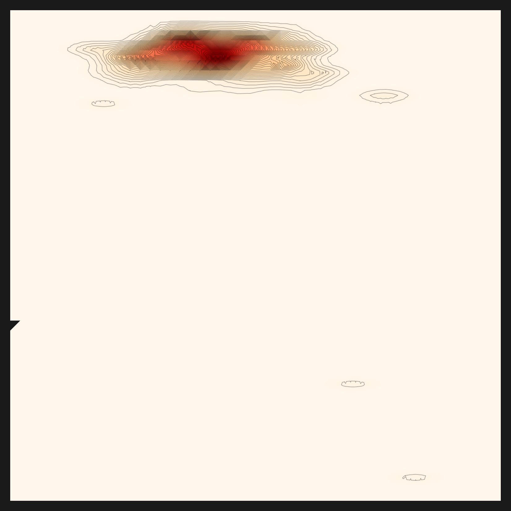
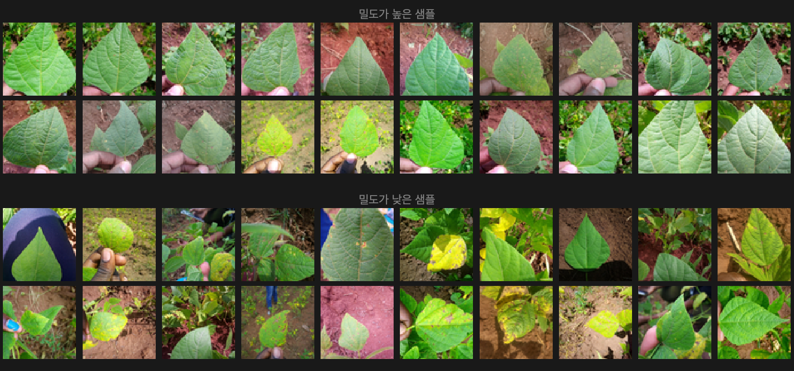
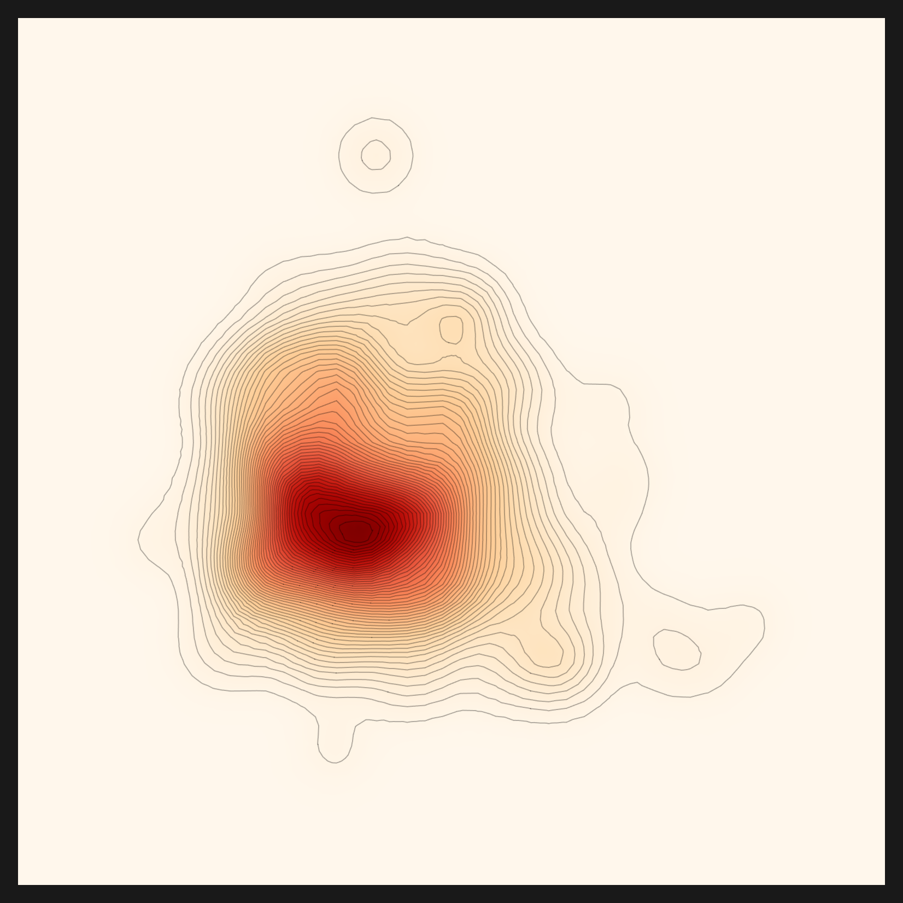
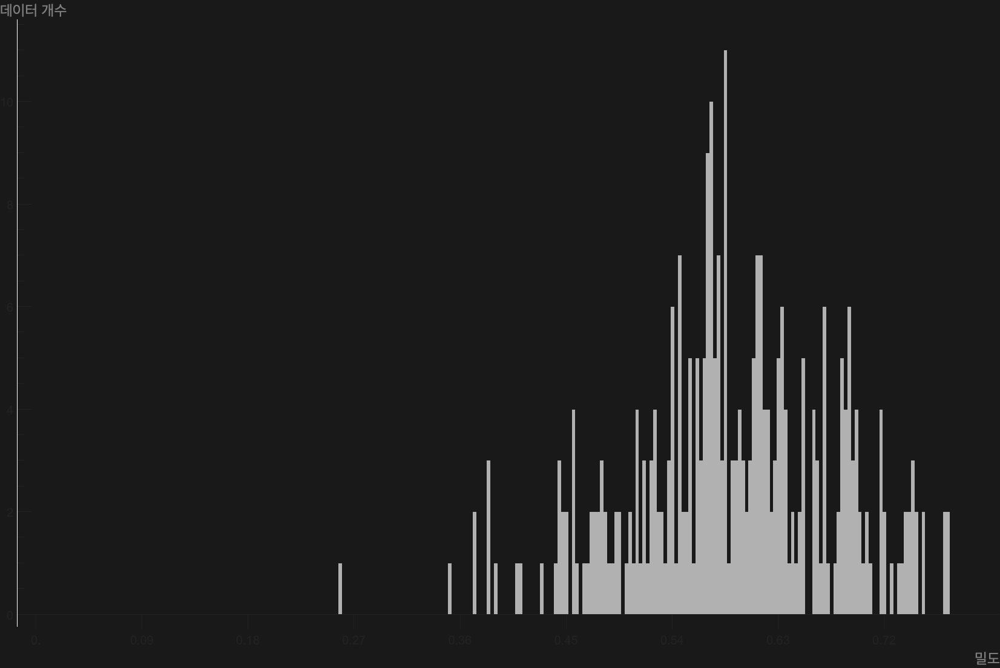

# 한 줄도 안 돌던 엔진이 콩잎 밀도맵을 그리기까지

_NVIDIA·vLLM 엔진을 Apple Silicon에서 — device-aware·vendor-neutral로 sovereign AI 이식하기_

## Executive Summary

> [!callout]
> 한 줄도 안 돌던 엔진이 있었다. **automatic-config**는 페블러스가 AADS 과제에서 [데이터그린하우스(DataGreenhouse)](/project/DataGreenhouse/data-greenhouse-strategy/ko/)를 개발하며 만든 사내 Agentic AI 엔진, 곧 데이터클리닉의 복잡한 툴들과 정책들을 감싼 다층 에이전트 프레임워크이자 우리 팀의 사내 핵심 자산이다. 빠르게 동작하는 엔진을 먼저 만든 팀의 합리적 선택대로, 이 엔진은 NVIDIA GPU 한 대와 vLLM 서버가 켜진 사내 환경에 맞춰 쓰여 있었다. Apple Silicon Mac에는 그 셋 중 무엇도 없다. 우리는 우리 손으로 만든 이 엔진을 처음부터 끝까지 Mac에서 다시 돌려 보기로 했다. 도착점은 콩잎 한 장의 밀도맵, 데이터의 품질을 눈으로 보는 그림이었다.

> 막힌 자리는 모두 열두 군데였다. 우리는 그 벽들을 우회하지 않았다. 매 벽마다 "1 커밋 = 1 처방"으로 근본을 고쳤다. 가장 깊었던 벽은 의외로 단순했다. 밀도맵을 통째로 무너뜨린 것은 보조 스크립트 안의 `.cuda()` 한 줄이었다. 그 한 줄을 device-aware(cuda→mps→cpu)로 바꾸자 밀도맵이 살아났다. 그렇게 **preprocessing → recommendation → diagnosis 풀 파이프라인이 Mac에서 처음으로 끝까지 완주**했다. 우리 엔진이 NVIDIA 바깥에서 end-to-end로 돈 첫 기록이다.

> 그런데 완주가 곧 유효함은 아니었다. automatic-config 추천의 철학은 "대표이미지 → 초기 온톨로지(도메인) → 적합 렌즈"다. 처음 돌렸을 때 파이프라인은 크래시 없이 끝까지 갔지만, 그 안쪽에서 도메인 추출이 **침묵 실패**하고 있었다. 도메인이 비니까 렌즈는 데이터 이해가 아니라 다운로드 인기순으로 떨어졌고, 그래서 콩잎에도 피부 병변에도 똑같이 가장 유명한 `openai/clip-vit-base-patch32`가 뽑혔다. "엔진이 데이터에 맞는 렌즈를 스스로 골랐다"는 첫 서사는, 솔직히 말하면 과장이었다. 우리는 그 침묵 실패를 잡아냈고, 추천 LLM도 진단처럼 capable 엔드포인트로 라우팅하고 랭킹의 인기 편향을 걷어, v2에서 비로소 도메인 이해를 복구했다.

> 증명은 세 번째 데이터셋에서 나왔다. 패션 이미지를 넣자 도메인이 fashion으로 잡혔고, 최종 추천이 처음으로 CLIP이 아닌 `patrickjohncyh/fashion-clip`으로 바뀌었다. 같은 엔진이 데이터에 따라 다른 렌즈를 고른 첫 기록이다. 이 글은 그래서 성공기이되 정직한 성공기다. 한 줄도 안 돌던 엔진을 끝까지 살린 이야기, 그 위에서 "완주했다"고 보고했던 추천이 사실은 도메인을 보지 못하고 있었음을 인정하고 고쳐 증명한 이야기, 그리고 그 모든 수정이 엔진을 어떻게 vendor-neutral하게 만드는지에 대한 기록이다. 한계를 정직하게 공개하는 편이 글을 더 단단하게 만든다고 믿는다.

### 숫자로 보면

M5 Max / 128GB / macOS, 2026-06-07. 출처: Pebblous Data Clinic 로컬 재현 기록.

<!-- stat-card -->
**12개 벽** — 1 커밋 = 1 처방 — 우회가 아니라 근본 수정으로 하나씩 통과

<!-- stat-card -->
**1.9 → 46** — 임베딩 img/s (MPS) — device-aware로 CPU에서 Apple Silicon GPU 경로 전환

<!-- stat-card -->
**3계층** — vendor-neutral 라우팅 — 지각·추론·분석을 env로 갈아끼우는 백엔드로

<!-- stat-card -->
**fashion-clip** — 처음 고른 비-CLIP 렌즈 — 도메인 추출 복구 + 인기 편향 제거 후 패션 데이터에 차별화된 렌즈 선택

**_편집자의 노트._** 페블러스가 AADS 과제에서 데이터그린하우스를 개발하며 만든 우리 엔진을 굳이 Mac에서 다시 돌려 본 데는 전략적인 이유가 있다. [DataClinic](/project/DataClinic/ko/)이 다루는 데이터 진단은 결국 고객의 환경에서 돌아야 한다. 그 환경은 늘 NVIDIA 클러스터가 아니다. 규제 산업의 온프렘 서버일 수도, 데이터를 외부로 내보낼 수 없는 sovereign 환경일 수도 있다. 데이터가 고객의 울타리를 벗어날 수 없는 영역으로 진단이 닿으려면, sovereign·온프렘 운영은 페블러스가 가야 할 방향이다. 우리 엔진을 우리 손으로 한 번 끝까지 돌려 봐야, AADS가 어디에서나 돌아가게 만들 청사진을 실측으로 얻는다. 이 글은 그 첫 실측이다.

## 한 줄도 안 돌던 엔진

우리가 손에 쥔 것은 문서가 아니라 동작하는 코드였다. `automatic-config`는 페블러스가 AADS 과제에서 데이터그린하우스를 개발하며 만든 사내 Agentic AI 엔진, 곧 데이터클리닉의 복잡한 툴들과 정책들을 감싼 다층 에이전트 프레임워크다. 그 안의 `vision_agent`는 Pebblous Data Clinic 2.0의 실제 엔진으로 다섯 도메인이 하나의 파이프라인으로 묶여 있다. 데이터를 씻어 임베딩으로 바꾸는 전처리(preprocessing), 데이터셋에 맞는 임베딩 렌즈를 자동으로 고르는 추천(recommendation), 밀도와 거리와 N-지표로 데이터의 모양을 재는 진단(diagnosis), 그리고 데이터를 덜거나 보태는 다이어트(diet)와 벌크업(bulkup)이다. 진단 엔진이라는 말이 추상적으로 들리지만, 그 끝에는 콩잎 이미지의 밀도를 그린 한 장의 지도가 있다.

이 엔진에는 두 가지 구조적 특징이 있고, 그 둘이 그대로 이식의 부담이 된다. 하나는 이중 트랙이다. 결정론적으로 단계를 밟는 graph(StateGraph)와, LLM이 단계를 오케스트레이션하는 react가 함께 들어 있다. 다른 하나는 하이브리드 언어다. 신경망과 feature 추출은 Python이 맡고, 밀도와 기하의 수학 그리고 차트 렌더는 Wolfram(.wl)이 맡는다. Python과 Wolfram이 한 파이프라인 안에서 서로를 호출한다.

그리고 device와 모델이 코드 곳곳에 고정돼 있었다. 이것은 사내 GPU 환경에 맞춰 빠르게 동작하도록 짠 코드의 자연스러운 결과다. 추론용 LLM으로 61GB짜리 Qwen2.5-32B가 박혀 있었고, 역할별 모델(VLM·RAG)도 고정돼 있었다. LLM 엔드포인트는 `localhost:11211`의 vLLM을 가리켰고, device는 곳곳에서 `"cuda"` 혹은 `.cuda()`였다. MPS로 분기하는 자리는 한 곳도 없었다. 한 줄로 요약하면, 그 엔진이 만들어진 자리, 곧 "NVIDIA 한 대와 vLLM이 켜진 사내 서버"에 충실한 코드였다. 그 위에 sovereign 레이어를 더하는 것이 이번 작업이다.

> [!callout]
> 그래서 Mac에서는 첫 줄부터 멈췄다. `python`도 우리가 원하는 자리에 없었고, `cuda`는 존재하지 않았고, `11211` 포트의 vLLM도 켜져 있지 않았다. 한 줄도 안 돌던 엔진. 출발점은 거기였다.

## NVIDIA·vLLM이라는 암묵 전제

코드를 읽다 보면, 명시되지 않은 전제일수록 더 깊이 박혀 있다는 걸 알게 된다. automatic-config의 전제는 어디에도 "이 엔진은 NVIDIA에서만 돕니다"라고 적혀 있지 않았다. 다만 모든 줄이 그것을 가정하고 있었다. 전제는 선언이 아니라 습관으로 코드에 스민다.

가장 무거운 전제는 모델의 크기였다. 추론 LLM으로 후보를 추려 놓고도 61GB짜리 Qwen2.5-32B를 별도로 내려받게 돼 있었다. 노트북에서 그 한 줄은 곧 디스크와 다운로드 시간의 벽이 된다. 그 옆으로 역할별 모델(VLM-2B·RAG-meta-7B·RAG-emb-8B)이 고정값으로 박혀 있었다. 어떤 모델을 쓸지가 코드 안에 굳어 있으면, 환경이 바뀌어도 모델은 바뀌지 않는다.

두 번째 전제는 엔드포인트였다. 결정용 LLM은 `localhost:11211`의 vLLM을 호출했다. Mac에는 그 포트에 아무것도 없으니 돌아오는 것은 `Connection refused` 한 줄이다. 세 번째 전제는 가장 깊었다. device가 곳곳에서 `"cuda"`였다. CUDA가 없는 기계에서 그 줄은 분기 없이 그대로 크래시한다. 네 번째 전제는 Wolfram이었다. 밀도와 기하의 수학을 Wolfram(.wl)이 맡았는데, 이는 독점 런타임이고 라이선스가 필요하며 콜드스타트에 약 40초가 걸린다.

> [!callout]
> 이 전제들은 비난할 대상이 아니다. 사내 서버에서 빠르게 동작하는 엔진을 만들려면 합리적인 선택이었다. 다만 그 엔진을 다른 자리로 옮기려는 순간, 암묵 전제 하나하나가 벽이 된다. 이식이란 결국 누군가 당연하게 여긴 것을 다시 질문하는 일이다.

## 벽 12개 — 우회가 아닌 근본 수정

막힌 자리는 모두 열두 군데였다. 우회하는 길은 늘 있었다. 차원을 줄이거나, 단계를 건너뛰거나, 임시 패치로 덮을 수 있었다. 그러나 우리는 매번 근본을 고치기로 했다. 원칙은 단순했다. "1 커밋 = 1 처방". 벽 하나에 처방 하나, 그리고 그 처방이 왜 정당한 portability 수정인지가 커밋 메시지에 남도록 했다. 아래 표가 그 열두 벽의 전모다.

| # | 벽 | 증상 | 처방 |
| --- | --- | --- | --- |
| 1 | 추론 LLM 61GB | Qwen2.5-32B 하드코딩 다운로드 | env 라우팅 (RECOMMEND_REASONING_MODEL) |
| 2 | 역할별 모델 하드코딩 | VLM·RAG 모델 고정 | env 라우팅 |
| 3 | hf 소켓 hang | 큰 모델 다운로드가 0/N에서 정지 | hf_transfer (Rust 다운로더) |
| 4 | fork DataLoader 데드락 | macOS에서 num_workers>0 충돌 | 비-CUDA면 num_workers=0 |
| 5 | MPS 미사용 | cuda-or-cpu만 분기 → CPU 1.9 img/s | device-aware mps (15~46 img/s) |
| 6 | OMP libomp 3중복 | faiss+torch+sklearn 세그폴트 | KMP_DUPLICATE_LIB_OK=TRUE 외 |
| 7 | 거리/밀도 device="cuda" | gaussian-rbf 경로 크래시 | device-aware |
| 8 | N-지표 인덱스 | n_candidates(512>N) 순회 → 파일 부재 | valid_n 순회 |
| 9 | 결정 LLM 11211 하드코딩 | Connection refused | env 라우팅 (LM Studio 1234) |
| 10 | Wolfram→python | RunProcess["python"]이 시스템 python | PATH에 .venv/bin 주입 |
| 11 | feature.mx stale 캐시 | 깨진 .mx + 존재-가드가 재생성 차단 | 깨진 캐시 삭제 후 재생성 |
| 12 | norm/nearest_set .cuda() | 밀도맵 x축 $Failed | device-aware |

``````````````````````````

표를 다시 읽어 보면 한 가지 결이 보인다. 처방의 절반 이상이 같은 종류다. 하드코딩된 무언가를 env로 빼거나, `"cuda"` 한 자리를 device-aware로 바꾸는 것이다. 벽들은 서로 다른 모양이었지만, 그 뿌리는 놀랄 만큼 비슷했다. 이 닮음이 다음 절의 통찰로 이어진다.

한 가지 효과는 숫자로도 또렷했다. 벽 5번, MPS를 켜기 전 임베딩 속도는 초당 1.9장이었다. Apple Silicon의 Metal Performance Shaders로 device 경로를 열자 초당 15장에서 46장으로 올라갔다. 같은 코드, 같은 기계, 바뀐 것은 device 분기 한 군데였다. 도구 스택은 Mac 위에서 이렇게 정리됐다. 전처리 임베딩은 SigLIP(MPS), 진단 feature 렌즈는 CLIP, 결정 LLM은 LM Studio의 qwen3.6-35b, 분석 수학과 차트는 Wolfram, 대형 모델 다운로드는 hf_transfer가 맡았다.

## 가장 깊은 벽 — .cuda() 한 줄이 무너뜨린 밀도맵

벽 열둘 중 가장 오래 붙잡은 것은 마지막이었다. 진단이 다 끝난 뒤, 밀도맵이 그려져야 할 자리에 그림 대신 텍스트가 떴다. `Flatten[$Failed]`로 채워진 그리드. Wolfram의 `$Failed`는 "계산을 시도했으나 결과가 없다"는 표식이다. 차트는 멀쩡한데 밀도가 통째로 비어 있었다.

양파를 까는 추적이었다. 한 겹을 벗기면 멀쩡한 줄이 나오고, 그 줄을 따라가면 또 다른 벽이 기다렸다. 밀도맵은 `density.mx`를 읽고, `density.mx`는 `norm.mx`를 전제하고, `norm.mx`는 다시 `feature.mx`에 기댄다. 의심 가는 곳을 차례로 짚어 가며 다층 의존을 한 겹씩 벗기자, 가장 안쪽에 norm이 통째로 생성되지 않은 자리가 있었다. 거기서 추적이 멈췄다. 그 norm을 만드는 `norm.py` 안에, macOS에서 크래시하는 줄이 하나 있었다. 바로 `.cuda()`. 며칠을 따라온 끝이 고작 한 줄이라는 사실이 허탈하면서도 통쾌했다. CUDA가 없는 기계에서 그 한 줄이 norm 산출을 통째로 무너뜨렸고, 그 위에 쌓인 밀도맵이 전부 `$Failed`가 된 것이다. 같은 패턴이 `nearest_set.py`에도 한 줄 더 숨어 있었다.

처방은 벽 5번, 7번과 똑같았다. device-aware. `cuda → mps → cpu`로 분기하도록 두 줄을 고쳤다. 그러자 norm이 정상으로 산출됐고, 그 위로 밀도가 다시 계산됐다. 한 줄이 무너뜨린 그림을, 한 줄이 다시 세웠다. 아래가 그렇게 살아난 밀도맵이다. 한 줄도 안 돌던 엔진이 끝까지 살아남았다는 증거다.


*▲ 밀도 히트맵(SmoothDensityHistogram) — 노란 고밀도 중심에서 등고선이 퍼지고, 점은 개별 샘플, 가장자리의 고리는 이상치다. `.cuda()` 한 줄을 device-aware로 고치자 norm이 정상 산출됐고 이 그림이 살아났다. | 출처: Pebblous Data Clinic 로컬 재현, 2026-06-07*

> [!callout]
> 가장 깊은 벽이 가장 단순한 줄이었다는 사실이 이 작업의 교훈을 압축한다. 진단 차트가 `$Failed`로 깨질 때, 원인은 화려한 알고리즘이 아니라 보조 스크립트 끝에 박힌 device 하드코딩 한 줄인 경우가 많았다. device-aware는 macOS와 sovereign 환경 이식의 1번 과제다.

## 다섯 개의 렌즈와 3계층 라우팅

### 5.1. 같은 데이터를 다섯 개의 거리 메트릭으로 본다

밀도맵이 살아난 뒤, 진단은 한 장의 그림으로 끝나지 않았다. 진단 엔진은 같은 콩잎 임베딩을 다섯 가지 거리 메트릭으로 다섯 번 들여다봤다. 거리 메트릭이란 "두 데이터가 얼마나 가까운가"를 재는 자다. 자를 바꾸면 같은 데이터도 다르게 보인다. 다섯 개의 메트릭은 곧 같은 임베딩을 비추는 다섯 개의 시선인 셈이다. 임베딩 자체를 어떻게 다루느냐도 한 갈래의 자매 주제인데, 이를테면 [학습 없이 벡터를 압축하는 방법](/report/turbovec-2026/ko/)은 같은 임베딩 공간을 다른 각도에서 들여다본다.

- •**euclidean**은 직선 거리다. 가장 직관적인 자로, 두 점 사이를 곧장 잰다.
- •**gaussian-rbf**는 국소 밀도 커널이다. 가까운 이웃에 더 큰 가중을 줘서 "주변이 얼마나 붐비는가"를 본다.
- •**linear-cosine**은 방향을 본다. 거리가 아니라 벡터가 같은 쪽을 보는지를 재는, "닮은 방향인가"를 묻는 렌즈다.
- •**rbf×cosine**은 두 렌즈의 곱이다. "가깝고(공) 동시에 같은 방향(원뿔)"을 둘 다 만족해야 높은 점수를 준다. **엔진이 콩잎 데이터에 자동으로 선택한 메트릭**이다.
- •**norm-rbf×cosine**은 rbf×cosine의 정규화 변형이다. 스케일 차이를 눌러 분포의 모양을 더 또렷이 드러낸다.

아래 다섯 장이 같은 콩잎 데이터를 다섯 거리 메트릭으로 비춘 결과다. euclidean이 넓고 둥근 구름이라면, rbf×cosine은 중심이 십자로 날카롭게 모인다. 같은 데이터인데 메트릭에 따라 코어의 모양이 이렇게 달라진다. 진단은 그중 콩잎 분포에 맞는 메트릭으로 rbf×cosine을 골랐다. 여기서 메트릭(거리를 재는 자)과 렌즈(데이터를 임베딩으로 바꾸는 모델)는 다른 층위라는 점을 짚어 둔다. 메트릭 선택은 진단이 콩잎 임베딩 위에서 실제로 수행한 일이지만, 그 임베딩을 만든 렌즈(CLIP) 자체를 추천이 데이터를 보고 골랐는가는 다른 질문이다. 그 질문에는 정직하지 못한 첫 답이 있었고, 다음 절에서 바로잡는다.

euclidean — 직선 거리

gaussian-rbf — 국소 밀도

linear-cosine — 방향

rbf×cosine — 진단 선택 ★

norm-rbf×cosine — 정규화 변형


*▲ 같은 콩잎 데이터, 다섯 개의 거리 메트릭 — 각 메트릭은 "가까움"을 재는 서로 다른 자다. euclidean은 넓고 둥글게, rbf×cosine은 중심을 십자로 날카롭게 본다. 진단이 콩잎 분포에 맞게 고른 메트릭은 rbf×cosine이다. | 출처: Pebblous Data Clinic 로컬 재현, 2026-06-07*

### 5.2. 하드코딩을 라우팅 가능한 백엔드로

벽들을 다 뚫고 나서야 핵심 통찰이 또렷해졌다. 우리가 한 일은 하드코딩을 "제거"한 것이 아니었다. 하드코딩을 "라우팅 가능한 백엔드"로 일반화한 것이었다. 61GB 모델을 지운 게 아니라 모델을 env로 갈아끼울 수 있게 했고, vLLM 엔드포인트를 버린 게 아니라 엔드포인트를 env로 가리킬 수 있게 했다. 하드코딩된 값은 결함이 아니라 "라우팅 포인트의 후보"였던 셈이다.

이 시각으로 보면 엔진이 세 개의 층으로 나뉜다. 지각·추론·분석이다. 신경망의 지각은 무늬를 읽는 눈에 가깝고, LLM의 추론은 그 무늬에 판단을 더하며, Wolfram의 분석은 수학으로 구조를 재고 그림으로 옮긴다. 세 층 각각에 라우팅 포인트가 하나씩 있다.

| 계층 | 맡은 일 | 라우팅 포인트 | 상태 |
| --- | --- | --- | --- |
| 지각 (perception) | Python 렌즈 (CLIP·SigLIP) | 모델 라우팅 (RECOMMEND_*_MODEL) | 완료 |
| 추론 (reasoning) | LLM 엔드포인트 (qwen3.6-35b) | 엔드포인트 라우팅 (LLM_BASE_URL) | 완료 |
| 분석 (analysis) | Wolfram(.wl) 수학·차트 | 엔진 라우팅 (DIAGNOSIS_ENGINE), 제안 | 아직 적용 아님 (#112) |

``````

세 층 가운데 둘은 이미 vendor-neutral이 됐다. 지각의 모델은 env로 고를 수 있고, 추론의 LLM 엔드포인트도 env로 가리킬 수 있다. 그 모든 Python 보조 스크립트에는 device-aware(`cuda → mps → cpu`)가 적용됐다. 이것이 macOS sovereign 운영의 핵심이다. 남은 한 층은 분석이다. Wolfram은 강점이자 부담이다. 밀도와 기하의 수학을 우아하게 풀지만 독점 런타임이라 sovereign 환경에서 가장 무겁다. 분석 층은 **아직 env로 갈아끼울 수 없다.** 이 층에 `DIAGNOSIS_ENGINE`이라는 향후 라우팅 포인트를 두고, Wolfram을 열린 Python(numpy·scipy·matplotlib)으로 점진 이식하자는 것은 지금은 구현이 아니라 **제안**이다. 별도 이슈(#112)로 남겼고, 적용은 다음 작업이다.

이 3계층 라우팅이 곧 이식의 청사진이다. 모델도, LLM도, 그리고 머지않아 분석 엔진까지 env로 갈아끼울 수 있다면, 같은 엔진이 NVIDIA 클러스터에서도 Apple Silicon에서도 규제 산업의 온프렘 서버에서도 똑같이 돈다. 아래는 그 청사진이 실제로 그려낸 결과물이다. 임베딩 공간에서 조밀한 샘플과 희소한 샘플을 한눈에 보여 주는 콩잎 몽타주다.


*▲ 콩잎 고/저밀도 샘플 몽타주(한글 라벨: "밀도가 높은 샘플" / "밀도가 낮은 샘플") — 임베딩 공간에서 조밀한 샘플과 희소한 샘플을 나란히 놓았다. 이것이 데이터 품질을 눈으로 보는 한 가지 방법이다. | 출처: Pebblous Data Clinic 로컬 재현, 2026-06-07*

> [!callout]
> 하드코딩은 결함이 아니라 라우팅 포인트의 후보다. 모델·LLM·device·분석 엔진을 차례로 env와 라우팅으로 풀면, 그 엔진은 그대로 vendor-neutral해진다. 이 한 문장이 이번 재현의 척추다.

## 추천이 진짜 렌즈를 고르려면 — 3겹 편향을 다 걷어야

여기서 한 번 멈추고 정직하게 적어야 할 일이 있다. 앞 절까지 우리는 추천이 콩잎 데이터에 맞는 렌즈를 골랐다고 말해 왔다. 그 말은 그대로 두기엔 정확하지 않다. automatic-config 추천의 설계 철학은 분명하다. 대표이미지를 보고 초기 온톨로지, 곧 데이터의 도메인을 세우고, 그 도메인에 맞는 임베딩 렌즈를 고른다. 문제는 v1 실행에서 이 사슬의 가운데 고리가 끊겨 있었다는 것이다.

### 6.1. v1은 침묵 실패였다

처음 콩잎과 피부 병변 데이터셋의 추천을 "완주"로 보고했을 때, 산출물의 안쪽은 비어 있었다. `domain.txt`는 `"unknown"`이었고, `domain_evidence`에는 `"Failed to extract domain evidence."`라는 한 줄만 남아 있었다. 도메인 추출 단계가 크래시 없이, 아무 경고 없이 조용히 실패한 것이다. 흥미로운 건 실패 지점이다. VLM의 지각 자체는 멀쩡했다. 콩잎을 "손에 든 초록 식물 잎, 갈색 반점"으로, 피부 병변을 "가운데가 붉게 솟은 피부 병변"으로 정확히 묘사했다. 무너진 건 그다음, 그 묘사를 도메인 evidence JSON으로 합성하는 추출 단계였다. 로컬에 띄운 소형 LLM(Qwen2.5-0.5B/7B)이 그 합성을 해내지 못했다.

도메인이 비니까 렌즈 선택은 데이터 이해를 잃고 다른 기준으로 떨어졌다. 다운로드 인기순 fallback이다. 그래서 콩잎에도 피부 병변에도 똑같이, 세상에서 가장 많이 받은 임베딩 모델인 `openai/clip-vit-base-patch32`가 뽑혔다. 두 데이터셋 모두 CLIP이 추천된 진짜 이유는 "두 데이터에 CLIP이 맞아서"가 아니라 "도메인을 보지 못해 인기로 골라서"였다.

> [!callout]
> **교훈. 파이프라인 완주(크래시 없음)는 산출물 유효가 아니다.** 우리는 구조적 완료, 곧 "끝까지 돌았다"만 보고 산출물의 의미를 검증하지 않았다. 그것이 화근이었다. `status=done`은 결과가 옳다는 보증이 아니다. 침묵 실패는 크래시보다 위험하다. 크래시는 멈춰 세우지만, 침묵 실패는 잘못된 답을 들고 끝까지 가서 "성공"이라고 보고하기 때문이다. 그래서 이번 수정에는 침묵하던 그 지점에 경고 가드(`⚠️ [DOMAIN EXTRACTION FAILED]`)를 함께 심었다.

### 6.2. v2 — 라우팅으로 도메인 이해를 복구하다

수정의 방향은 §5의 통찰 그대로였다. 추론 층의 라우팅을 추천에도 적용한 것이다. 진단의 결정 LLM이 이미 `LLM_BASE_URL` 엔드포인트로 라우팅되고 있었듯, 추천의 reasoning LLM도 같은 라우팅에 태웠다(#107). 소형 모델 대신 capable한 모델(LM Studio의 qwen3.6-35b)로 도메인 추출을 돌리자, 끊겼던 고리가 다시 이어졌다. 이번엔 도메인이 제대로 채워졌다.

| 데이터셋 | 도메인 (v1) | 도메인 (v2) | 최종 렌즈 |
| --- | --- | --- | --- |
| beans (콩잎) | unknown | agriculture (농업·식물병) | CLIP |
| skin (피부 병변) | unknown | dermatology (피부과) | CLIP |
| fashion (패션) | unknown | fashion (패션) | fashion-clip ★ |
| chest_xray (흉부 엑스레이) | unknown | radiology (영상의학) | vit-chest-xray ★ |

v1에서 모두 `unknown`이던 도메인이, v2에서는 콩잎=농업·식물병, 피부 병변=피부과, 패션=패션, 흉부 엑스레이=영상의학으로 또렷이 잡혔다. 엔진이 데이터의 도메인을 실제로 이해하기 시작한 것이다. 다만 여기서 한 가지가 더 드러난다. 도메인을 이해한 콩잎과 피부 병변은 여전히 최종 렌즈가 CLIP이었다. 도메인 이해만으로는 렌즈가 바뀌지 않았다는 뜻이다.

### 6.3. CLIP-편향 3겹 — 도메인만으론 부족했다

도메인을 이해해도 렌즈가 CLIP에 머무른 이유를 파고들자, 랭킹 안에 CLIP을 떠받치는 편향이 세 겹으로 쌓여 있었다. 도메인 이해는 그중 첫 겹을 걷어냈을 뿐이다. 세 겹을 다 걷어야 추천이 비로소 데이터에 맞는 렌즈를 고른다.

| 겹 | 편향 | 상태 |
| --- | --- | --- |
| ① | 도메인 추출 침묵 실패 → 도메인 없음 → 인기순 | 라우팅(35B)으로 해결 |
| ② | 후보를 top30 다운로드순으로 컷 | fashion-clip은 생존 (일반적으론 #111 다양화 필요) |
| ③ | 랭킹 popularity 가중치 0.5, CLIP(2300만)이 인기로 압도 | domain=1.0으로 fashion-clip 1위 |
| 잔여 | 후보 메타 노이즈 (소형 LLM 요약 → nsfw·fairface 오염) | 벡터DB 사전임베딩 과제 (#111) |

``

가장 끈질긴 건 세 번째 겹, 랭킹의 인기 가중치였다. CLIP은 다운로드 2300만, fashion-clip은 300만이다. 도메인이 패션을 가리켜도, 점수의 절반을 인기가 차지하는 한 CLIP이 인기로 fashion-clip을 눌렀다. 그래서 가중치를 직접 실험해 봤다. 임베딩은 이미 캐시돼 있어 LLM 호출 없이, 도메인 점수와 인기 점수의 비중만 바꿔 가며 같은 패션 데이터를 다시 랭킹한 것이다.

| 가중치 | 1위 | 패션 렌즈 순위 |
| --- | --- | --- |
| domain=0.5 · pop=0.5 | CLIP | fashion-clip 4위 |
| domain=1.0 · pop=0.0 | fashion-clip ★ | fashion-clip 1위 · marqo-fashionSigLIP 3위 |

결과는 또렷했다. 인기 가중치를 0으로 내려 도메인에만 점수를 주자, fashion-clip이 단숨에 1위로 올라섰고 또 다른 패션 전용 렌즈(marqo-fashionSigLIP)가 3위로 뒤따랐다. 도메인 이해(①)와 인기 편향 제거(③)를 함께 걷어내자, 추천이 처음으로 CLIP이 아닌 `patrickjohncyh/fashion-clip`을 골랐다. 같은 엔진이 데이터에 따라 다른 렌즈를 고른 첫 기록이다. 아래가 그 fashion-clip 렌즈로 본 패션 데이터의 밀도맵이다.


*▲ fashion-clip 렌즈로 본 패션 데이터 밀도맵 — 가운데 빨간 코어는 의류(Topwear·Bottomwear)의 큰 군집이고, 떨어져 나온 작은 고리 둘은 Bags·Shoes처럼 분리된 카테고리다. 콩잎의 단일 코어, 피부 병변의 분포와는 또 다른 모양이다. 다른 렌즈, 다른 데이터, 다른 모양. | 출처: Pebblous Data Clinic 로컬 재현, 2026-06-08*

> [!callout]
> "추천이 데이터에 맞는 렌즈를 고른다"는 말은 참이 되려면 조건이 있었다. (a) 도메인 추출을 capable LLM으로 라우팅하고, (b) 랭킹의 인기 편향을 걷어야 한다. fashion-clip 사례가 그 증거다. 정직하게 말하면, 엔진은 도메인-구동 렌즈 차별화가 **가능하다**. 단 그 가능성은 침묵 실패를 잡아내고 편향을 걷어낸 뒤에야 실제가 됐다. 남은 잔여(후보 메타 노이즈)는 벡터DB 사전임베딩(#111)으로 이어 갈 과제다.

### 6.4. 흉부 엑스레이 — 두 번째 비-CLIP 렌즈

fashion-clip이 우연이 아니었음은 네 번째 데이터셋에서 한 번 더 확인됐다. 흉부 엑스레이 이미지를 넣자 도메인이 `radiology`, 곧 영상의학으로 잡혔다. 핵심 개념으로 chest·xray·copd·pacemaker·patient·child가 함께 추출됐고, 최종 추천은 또다시 CLIP이 아니라 `codewithdark/vit-chest-xray`로 갈렸다. 도메인 이해를 복구하자 엔진은 두 도메인에서 렌즈를 차별화한 셈이다. 패션→fashion-clip, 그리고 흉부 엑스레이→vit-chest-xray(`codewithdark/vit-chest-xray`). 두 개의 전문 도메인, 두 개의 비-CLIP 렌즈다. 영상의학은 패션보다도 더 날카롭게 특화된 영역이라, 이 두 번째 사례가 도메인-구동 렌즈 선택이 작동한다는 더 단단한 증거가 된다. 3겹 편향을 다 걷어내면, 추천은 데이터가 가리키는 도메인을 따라 진짜 렌즈를 고른다.


*▲ vit-chest-xray 렌즈로 본 흉부 엑스레이 데이터 — 중심 고밀도 코어. 콩잎·패션과 또 다른 분포로, 도메인이 다르면 렌즈도 데이터의 모양도 달라진다. | 출처: Pebblous Data Clinic 로컬 재현, 2026-06-08*

## 진단이 콩잎에 대해 말한 것

엔진을 살려내는 일에 집중하다 보면 정작 한 가지를 놓치기 쉽다. Data Clinic의 본질은 차트를 그리는 것이 아니라 데이터를 진단하는 것이다. 그렇다면 이 콩잎 데이터에 대해 진단은 무엇이라고 말했을까. 밀도맵과 두 장의 보조 차트를 함께 읽으면 한 문장으로 정리된다. **이 콩잎 데이터셋은 비교적 균질하다.**

먼저 밀도맵이다. 고밀도 코어가 가운데에 단단히 모여 있고, 그 바깥으로 등고선이 매끄럽게 퍼진다. 동떨어진 작은 고리 몇 개가 가장자리에 보이는데, 이것이 소수의 이상치다. 코어 하나에 이상치 소수. 데이터가 한 덩어리로 잘 뭉쳐 있다는 신호다. 밀도 분포를 막대로 펼친 히스토그램도 같은 이야기를 한다. 대부분의 샘플이 밀도 0.55~0.65 구간에 봉우리를 이루고, 양극단으로 갈수록 꼬리가 얇아진다. 극단적으로 동떨어진 샘플이 드물다는 뜻이다.


*▲ 콩잎 샘플의 밀도 분포 히스토그램 — 봉우리가 밀도 0.55~0.65 구간에 모이고 양극단으로 꼬리가 얇아진다. 극단적으로 동떨어진 샘플이 드물다는 뜻이다. | 출처: Pebblous Data Clinic 로컬 재현, 2026-06-07*

한 발 더 들어가면 클래스 사이의 균형도 읽힌다. 이 데이터셋은 세 개의 클래스로 나뉜다. 건강한 잎(healthy), 콩 녹병(bean_rust), 각진 잎점무늬병(angular_leaf_spot)이다. 클래스별로 임베딩 공간의 원점에서 평균 거리를 재 보면, 세 클래스의 점이 거의 같은 높이에 나란히 놓인다. 어느 한 클래스만 외따로 떨어져 있지 않다는 뜻이다.


*▲ 세 콩잎 클래스(a: healthy · b: bean_rust · c: angular_leaf_spot)의 밀도 분포. 세 박스의 중앙값(오렌지 선)이 모두 평균 밀도(점선, 약 0.58) 부근에 모여 있다. 어느 클래스도 외따로 떨어지지 않은, 균형 잡힌 분포다. | 출처: Pebblous Data Clinic 로컬 재현, 2026-06-07*

세 클래스가 임베딩 공간에서 비슷하게 분포한다는 것은 실무로 옮기면 이런 의미다. 클래스 사이에 학습 난이도의 큰 편향이 없다. 어떤 병만 유난히 인식하기 쉽거나 어렵게 분포해 있지 않다. 데이터를 덜어내는 다이어트나 보태는 벌크업으로 한쪽 클래스를 급히 보정해야 할 이유가, 적어도 이 분포에서는 보이지 않는다. 진단이 데이터에 내린 결론은 "이 데이터는 지금 상태로도 비교적 건강하다"는 것이다. 진단이 끝내 묻는 것은 결국 [데이터 품질](/project/DataClinic/data-quality/ko/)이다.

N-지표도 같은 균질성을 다른 각도에서 보여 준다. 진단은 밀도를 한 번이 아니라 여러 스케일에서 잰다. n_local=1은 가장 가까운 이웃 한 명만 보는 미시 스케일이고, n_meso=16은 중간 규모의 이웃, n_global=299는 전체 샘플을 보는 거시 스케일이다. 이렇게 이웃 수 N을 바꿔 가며 밀도가 얼마나 안정적으로 유지되는지(stability/churn)를 보면, 데이터의 모양이 스케일에 따라 얼마나 흔들리는지가 드러난다. 다중 스케일에서 밀도가 크게 출렁이지 않는다면, 그 데이터는 어느 배율로 봐도 비슷한 한 덩어리라는 뜻이다.

> [!callout]
> 차트는 도착점이 아니라 진단의 언어다. 이 콩잎 데이터에 대해 엔진은 "고밀도 코어 하나 + 소수 이상치, 세 클래스가 균형, 다중 스케일에서 안정"이라고 말했다. 한마디로 비교적 균질한 데이터다. 데이터그린하우스가 하려는 일이 바로 이것이다. 데이터의 건강 상태를 사람이 읽을 수 있는 그림과 수치로 옮기는 것. 데이터를 우연히 만나 모으는 대신 [의도를 갖고 길러 낸다는 발상](/project/DataClinic/data-greenhouse/ko/)이 그 밑에 깔려 있다.

## 페블러스 관점 — 우리 엔진을 sovereign 자리로 옮긴다는 것

**_편집자의 노트._** 우리 팀이 만든 엔진을 끝까지 다시 읽고 sovereign 아키텍처로 옮기면서 무엇이 보였는지를 적어 둔다. "Pebble Beach로 옮긴다"는 우리 안의 표현은, 데이터가 머무는 어느 자리에서든 같은 진단이 똑같이 돌아야 한다는 다짐이다. 우리에게 sovereign·온프렘은 듣기 좋은 속성이 아니라, 데이터가 고객의 환경을 벗어날 수 없는 규제 영역까지 진단을 가져가려는 전략의 방향이다.

DataClinic이 다루는 일은 데이터의 건강을 재는 것이다. 그런데 진단은 데이터가 있는 자리에서 이뤄져야 한다. 의료·금융·공공처럼 데이터를 밖으로 내보낼 수 없는 영역일수록 그렇다. 우리 엔진이 NVIDIA 클러스터에서만 돈다면, 그 진단은 데이터가 그 클러스터로 올 수 있는 고객에게만 닿는다. 데이터가 고객의 환경을 떠날 수 없는 sovereign 영역에서는 진단 자체가 닿지 못한다. vendor-neutral은 마케팅 단어가 아니라, 진단이 닿을 수 있는 범위의 문제이고, 그 범위를 규제 산업의 온프렘까지 넓히는 것이 페블러스의 전략 방향이다.

이번 재현이 확인해 준 것은 device-aware와 라우팅이 그 범위를 넓히는 두 개의 손잡이라는 사실이다. device-aware는 같은 코드가 NVIDIA·Apple Silicon·CPU 어디서든 깨지지 않게 한다. 라우팅은 모델과 LLM과 분석 엔진을 환경에 맞게 갈아끼우게 한다. 둘을 합치면, 데이터를 진단이 있는 자리로 옮기는 대신 데이터가 있는 자리에 진단을 가져갈 수 있다. sovereign AI 운영의 토대가 거기에 있다.

이 작업이 닿는 자리도 분명히 해 둔다. 우리는 이번에 새 알고리즘을 만들지 않았다. 우리 팀이 만든 엔진을 한 줄도 안 돌던 상태에서 끝까지 살려냈고, 그 과정에서 "무엇을 어떤 라우팅으로 대체하거나 개선해야 하는가"라는 이식의 지도를 실측으로 얻었다. 어디에서나 돌아가는 sovereign 진단은 [대한민국 AI 행동계획과 페블러스 AADS의 전략적 정합성](/project/AADS/korea-ai-strategy-aads-alignment/ko/)과도 같은 결을 이룬다. AADS와 [DataClinic](/project/DataClinic/ko/)이 더 많은 환경으로 가려면 필요한 것이 바로 이 지도다. 콩잎 밀도맵 한 장은 그 지도의 첫 좌표다.

## 끝까지 추적해 전부 닫았다

이 글에는 한 차례 중간 매듭이 있었다. 풀 파이프라인이 처음 완주했을 때, 두 칸이 비어 있었다. 다섯 메트릭 중 일부의 밀도가 산출되지 않아 그 렌즈의 밀도맵만 `$Failed`로 남았고, 최종 패키징 단계 pebbloscope가 `status=error`로 끝났다. 거기서 멈췄다면 "대부분 됐다"는 절반의 성공기로 끝났을 것이다. 우리는 멈추지 않고 두 칸을 끝까지 따라갔다.

빈 밀도의 뿌리는 익숙한 자리였다. 조합 메트릭의 거리·밀도를 계산하는 `norm.py`와 `nearest_set.py`가, 벽 12번에서 한 번 고친 그 파일들이, 또 다른 경로에서 device를 고려하지 않고 텐서를 옮기고 있었다. CUDA가 없는 기계에서 그 경로가 조용히 빈 결과를 흘렸다. 두 스크립트를 끝까지 device-aware로 손보고 조합 메트릭의 거리와 밀도를 다시 생성하자, 막혔던 칸이 차례로 채워졌다. **다섯 메트릭(euclidean · gaussian-rbf · linear-cosine · rbf×cosine · norm-rbf×cosine)이 모두 정상으로 렌더**됐고, 그 위에서 pebbloscope의 최종 패키징도 `status=done`으로 닫혔다. 한 칸도 비우지 않은 채 파이프라인이 끝났다.

> [!callout]
> 가장 깊은 벽이 device 하드코딩 한 줄이었듯, 마지막 두 칸의 뿌리도 같은 패턴이었다. 한 번 고친 파일이라도 다른 호출 경로에 device 가정이 또 숨어 있을 수 있다. 끝까지 따라가면, 그 뿌리는 결국 같다. device-aware는 한 곳이 아니라 모든 경로에 적용되어야 비로소 끝난다.

### 8.1. 완주한 환경

전처리에서 추천, 진단 CORE, 그리고 차트까지 Mac 로컬에서 끝까지 돌았다. 콩잎 추천의 최종 렌즈는 `openai/clip-vit-base-patch32`였다. 다만 §6에서 적었듯, v1에서 이 선택은 도메인을 본 결과가 아니라 인기순 fallback이었고, v2에서 도메인 이해(agriculture)를 복구한 뒤에도 콩잎은 CLIP에 머물렀다. 진단 N-지표는 n_local=1·n_meso=16·n_global=299로 나왔다. 진단 한 번이 남기는 산출은 결코 작지 않다. 차트 약 520장, 데이터 파일(.mx·.csv·.json) 약 1,257개를 합쳐 한 번의 진단이 약 1,777개의 파일을 쏟아 낸다. 그 가운데 이 글이 실은 다섯 장의 메트릭 밀도맵과 두 장의 콩잎 차트, 그리고 두 장의 해석 차트가 있다. 재현에 필요한 환경 변수는 아래와 같다.

KMP_DUPLICATE_LIB_OK=TRUE OMP_NUM_THREADS=1 MKL_NUM_THREADS=1 VECLIB_MAXIMUM_THREADS=1  

                            LLM_BASE_URL=http://localhost:1234/v1  LLM_MODEL=qwen/qwen3.6-35b-a3b  LLM_API_KEY=lm-studio  

                            PATH=.venv/bin:$PATH  PYTORCH_ENABLE_MPS_FALLBACK=1  HF_HUB_ENABLE_HF_TRANSFER=1

### 8.2. 다음 자리

파이프라인은 닫혔지만, 더 좋게 만들 자리는 두 개의 이슈로 남겼다. 이것은 막힌 잔여가 아니라 다음 발걸음이다. 하나는 **#111**이다. 추천 단계에서 후보 모델 인덱스를 매 실행마다 다시 만드는데, 이를 사전 구축한 벡터DB로 옮기면 추천이 빨라진다. 동시에 §6에서 남긴 잔여, 곧 소형 LLM 요약이 만든 후보 메타 노이즈도 capable 사전임베딩으로 함께 정리된다. 다른 하나는 **#112**다. 분석 층의 Wolfram을 env로 갈아끼울 수 있는 라우팅(`DIAGNOSIS_ENGINE`)으로 추상화하자는 **제안**이다. 앞서 적었듯 이 라우팅은 아직 구현된 것이 아니라 향후 작업이고, 열린 Python으로 점진 이식하는 길의 출발점이다. 이 둘이 채워지면 3계층이 모두 vendor-neutral해진다.

### 8.3. 가볍게 열린 한 칸

막힌 칸은 더 이상 없다. 다섯 메트릭의 밀도맵도, pebbloscope의 최종 패키징도 모두 정상으로 닫혔다. 다만 한 가지를 정직하게 적어 둔다. 결정용 LLM(qwen-35b)은 연결되어 잘 동작했지만, 일부 JSON 응답을 파싱할 때 fallback 경로로 빠지는 작은 거칠음이 있었다. 차트 산출에는 아무 영향이 없었고, 프롬프트와 파서를 다듬으면 정리될 비차단 항목이다. 끝을 비우지 않으려 적되, 이것이 결말을 깎지는 않는다.

끝까지 읽어 주셔서 감사하다. 이 글은 화제를 만들기 위한 성공기가 아니라, 우리 팀이 만든 엔진을 우리 손으로 한 번 끝까지 돌려 본 기록이다. 한 줄이 막힐 때마다 "계속 가자"가 콩잎 밀도맵을 살렸고, 마지막 두 칸까지 같은 마음으로 끝까지 따라가 닫았다. 같은 발상으로, AADS에서 자라난 우리 엔진을 데이터가 머무는 어디에서나 돌게 만드는 sovereign 작업을 계속 이어 가려 한다.

**페블러스 데이터 커뮤니케이션팀**  
2026년 6월 7일

<!-- stat-card -->
**🏥 DataClinic** — 이 글은 [DataClinic](/project/DataClinic/ko/) 허브와 함께 읽기를 권합니다. 데이터의 건강을 진단하고, 그 진단을 어디에서나 가능하게 만드는 페블러스의 데이터 품질 작업을 모아 둔 자리입니다.

## 자주 묻는 질문 (FAQ)

이번 재현을 두고 자주 나오는 질문을 모았다. automatic-config가 무엇인지, 왜 Mac에서 한 줄도 안 돌았는지, device-aware가 무엇이고 왜 핵심인지, 다섯 개의 거리 메트릭은 왜 필요한지, 추천이 정말 데이터에 맞는 렌즈를 골랐는지(그리고 처음엔 왜 그러지 못했는지), 진단이 콩잎 데이터에 대해 무엇이라고 말했는지, vendor-neutral과 sovereign AI가 운영에서 어떤 의미인지까지. 핵심은 둘이다. 하드코딩은 결함이 아니라 라우팅 포인트의 후보다. 그리고 파이프라인 완주가 곧 산출물 유효는 아니다.

## 참고문헌

### 논문

- 1.Zhai, X., Mustafa, B., Kolesnikov, A., & Beyer, L. (2023). "Sigmoid Loss for Language Image Pre-Training." _ICCV 2023_. arXiv:2303.15343. SigLIP — 전처리 임베딩 렌즈(MPS). [arxiv.org/abs/2303.15343](https://arxiv.org/abs/2303.15343)
- 2.Radford, A., Kim, J. W., Hallacy, C., & Sutskever, I. (2021). "Learning Transferable Visual Models From Natural Language Supervision." _ICML 2021_. arXiv:2103.00020. CLIP ViT-B/32 — 콩잎 진단 feature 렌즈(v1 인기순 fallback, v2 도메인 복구 후에도 콩잎은 CLIP 유지). [arxiv.org/abs/2103.00020](https://arxiv.org/abs/2103.00020)
- 3.Chia, P. J., Attanasio, G., Bianchi, F., et al. (2022). "Contrastive Language and Vision Learning of General Fashion Concepts." _Scientific Reports_, 12, 18958. FashionCLIP (patrickjohncyh/fashion-clip) — 도메인 이해 복구 + 인기 편향 제거 후 패션 데이터에 선택된 첫 비-CLIP 렌즈. [huggingface.co/patrickjohncyh/fashion-clip](https://huggingface.co/patrickjohncyh/fashion-clip)

### 도구 · 런타임

- 4.PyTorch. (2024). "MPS backend — PyTorch documentation." Apple Silicon Metal Performance Shaders 백엔드 — device-aware mps 경로. [pytorch.org/docs/stable/notes/mps.html](https://pytorch.org/docs/stable/notes/mps.html)
- 5.Hugging Face. (2023). "hf_transfer — high-performance Rust downloader for the Hugging Face Hub." 대형 모델 다운로드 소켓 hang 해소(Rust). [github.com/huggingface/hf_transfer](https://github.com/huggingface/hf_transfer)
- 6.LLVM / Intel OpenMP. (2024). "KMP_DUPLICATE_LIB_OK — Intel OpenMP runtime." faiss+torch+sklearn libomp 3중복 세그폴트 회피 env. [github.com/llvm/llvm-project/tree/main/openmp](https://github.com/llvm/llvm-project/tree/main/openmp)
- 7.Wolfram Research. (2024). "Wolfram Engine for Developers." 분석 층(.wl) 밀도·기하 수학 + 차트 렌더. [wolfram.com/engine/](https://www.wolfram.com/engine/)
