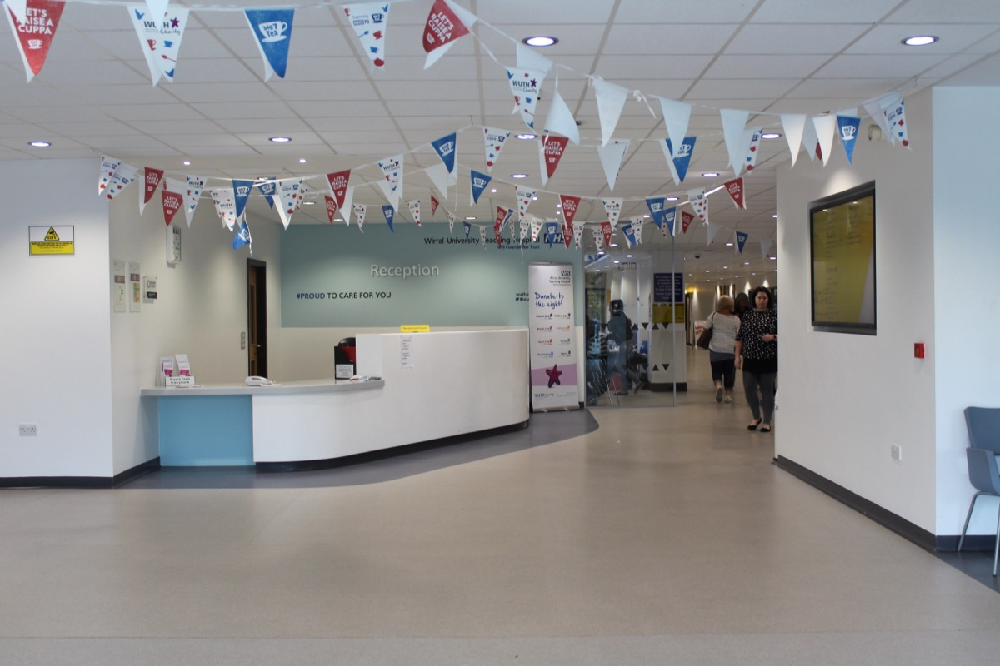

# 베세머·베인 조사, 병원은 왜 진료만 AI에 못 맡길까?

_미국 의료계 임원 226명 조사 — 진료비 청구 업무는 열에 일곱, 병원 임상은 스물다섯에 하나가 사람 승인 없이 돌아간다_

## Executive Summary

> [!callout]
> 이 글은 베세머 벤처 파트너스와 베인 앤드 컴퍼니가 2026년 9월 30일 공개한 「2026 헬스케어 AI ROI 스코어카드」를 전문과 35쪽짜리 발표 자료까지 열어 읽는다. 미국의 병원·보험사·제약사 임원 226명에게 업무 65개에 AI를 넣어 본 결과를 묻고, 돈이 얼마나 돌아왔는지와 어디까지 기계에 맡겼는지를 업무별로 줄 세운 조사다. 결과의 모양은 선명하다. 사람 승인 없이, 또는 거의 없이 돌아가는 일은 진료실 밖 행정 업무에 몰려 있다.

> 다만 이 대비를 "진료비 청구 업무만 자동화됐다"로 읽으면 틀린다. 보험사의 가입자 응대도, 병원 접수·안내도 같은 수준으로 돌아간다. 갈라진 선은 청구와 나머지 사이가 아니라 행정과 임상 사이에 있고, 보고서의 문장도 거기에 선을 긋는다. 영역 아홉을 다 놓으면 한 칸 더 좁혀진다. 제약의 임상 개발은 36%여서 혼자 떨어진 것은 "임상" 일반이 아니라 **병원 임상**, 곧 환자 한 사람 앞에서 내리는 일곱 가지 판단이다. 그리고 보고서가 임상의 정체 이유로 든 것은 모델 성능이 아니다. 믿지 못하고, 사고가 나면 의사가 책임을 지고, 규제 경로가 불확실하고, 보험이 값을 쳐 주지 않는다는 넷이다. 데이터는 그 넷에 없다.

> 여기까지가 공개 문서를 맞대면 누구나 확인할 수 있는 사실이다. 여기서부터는 이 글의 해석이다. 이 조사의 수익률은 감사받은 재무 수치가 아니라 임원이 스스로 적어 낸 배수이고, 보고서 자신이 두 영역의 격차를 "무엇을 가치로 치느냐의 차이"로 설명한다. 행정 쪽 가치는 1년 예산 안에 들어오고 특정 시스템에 귀속되는 것인데, 임상 쪽 편익에는 보고서가 그 수식어를 붙이지 않았다. 그리고 임상의가 믿겠다며 답한 조건 가운데 가장 많이 꼽힌 넷은 전부 남겨야 하는 기록이었다. 간격의 얼마만큼이 값어치의 차이이고 얼마만큼이 셈의 차이인지를 이 조사는 가르지 못한다.

<!-- stat-card -->
**67% · 4%** — 사람 승인 없이, 또는 거의 없이 돌아가는 비율 — 진료비 청구 업무와 병원 임상 업무. 나머지 일곱 영역이 31~62%에 흩어져 있어 혼자 떨어진 칸은 병원 임상뿐이다

<!-- stat-card -->
**4.0배 · 2.9배** — 같은 두 업무의 투자 대비 실현 배수 — 둘 다 임원이 스스로 적어 낸 값이라고 보고서가 축에 적어 뒀다. 감사받은 재무 결과가 아니다

<!-- stat-card -->
**46~96%** — AI 이전부터 있던 임상 경고의 무시율 폭 — 연구 23편 종합(2000~2019년). 보고서의 77%는 무시율이 아니라 절반 넘게 무시한다고 답한 사람의 비율이고, 그 "절반"이 이 폭의 맨 아래 눈금이다

<!-- stat-card -->
**48% · 5%** — 값을 치를 뜻이 없다고 답한 보험사 비율 — 사람이 빠진 AI 진료와, 사람이 확인하는 AI 진료. 같은 질문에 열 배 가까이 벌어진다

## AI에 맡긴 일을 업무별로 줄 세우면 행정이 위에 몰린다

조사의 틀부터 적어 둔다. 베세머 벤처 파트너스가 베인 앤드 컴퍼니와 함께 2026년 9월 30일 「2026 헬스케어 AI ROI 스코어카드」를 공개했다. 물은 대상은 임원 226명이고, 병원만이 아니라 **병원·보험사·제약사 세 집단**을 함께 묶은 수다. 물은 범위는 업무 65개이고, 보고서는 이를 작년 틀 위에서 돌리되 임상 AI와 투자 회수 쪽으로 범위를 넓혔다고 스스로 밝힌다. 뒤에 나오는 "임상 4%"는 세 집단을 섞은 값이 아니라 **병원의 임상 업무** 수치다. 대상군을 섞으면 그 자리에서 틀린다.

업무 분류도 같이 봐야 한다. 발표 자료 32~33쪽이 업무 65개를 집단별·경로별로 모두 펼쳐 놓는데, 병원의 **임상** 경로에 든 것은 일곱이다. 환자 분류, 진단 보조, 감별 진단 생성, 치료 추천, 수술 지원 및 로봇, 검사 결과 판독, 진료 공백 식별. 전부 환자 한 사람을 앞에 두고 내리는 판단이다. 반대로 요즘 "임상 AI"로 가장 많이 불리는 **진료 기록 작성 보조**(받아쓰기·주변음 청취)는 임상이 아니라 접수·안내 경로에 들어가 있고, 임상시험 환자 조율과 외래 안내, 추적 진료도 같은 쪽이다. 의료 코딩과 사전 승인, 거부·이의제기 관리는 수익주기 경로다. 그러니 "임상 4%"는 저 일곱 가지에 매겨진 수치다.

이 일곱은 대부분 올해 새로 들어온 자리다. 발표 자료 2쪽이 올해 조사를 "2025년과 같은 업무에 병원 임상 AI 업무 여섯 개를 더한 것"이라고 적기 때문이다. 일곱 가운데 여섯이 올해 처음 물어본 업무라는 뜻인데, 어느 하나가 작년부터 있던 업무인지는 발표 자료가 표시하지 않아 짚어 내지 못했다.

이 조사가 다른 의료 AI 조사와 갈리는 지점은 축이 둘이라는 데 있다. 하나는 얼마나 도입했는지이고, 다른 하나는 돈이 얼마나 돌아왔는지다. 그리고 거기에 세 번째 눈금이 붙는다. 그 일을 **사람 승인 없이 기계가 끝까지 끌고 가는지**다. 보고서는 이 세 번째 눈금을 "자율성이 실마리"라고 부르며, 영역 셋을 한 문장에 나란히 놓는다.

"병원 수익주기 업무에서는 응답자의 3분의 2가 이제 반자율 또는 완전자율 에이전트를 돌리고, 보험사 가입자 응대에서는 62%가 그렇게 한다. 병원 임상 업무에서 그 수치는 4%다. 일을 통째로 넘긴 자리에서, 그들이 넘긴 것은 **행정 업무**다."
                        원문: "Two-thirds of provider revenue cycle respondents now run semi- or fully autonomous agents, and 62% do so in payer member engagement. In provider clinical work, the figure is 4%. Where organizations have handed the work over entirely, they have handed over administrative work."

마지막 문장이 이 글의 출발점이다. 숫자 둘만 떼어 놓으면 청구 업무 혼자 기계에 넘어간 그림이 된다. 보고서의 수치는 그 그림을 받쳐 주지 않는다. 보험사의 가입자 응대가 62%이고, 발표 자료 22쪽을 열면 병원 접수·안내 업무도 49%가 같은 수준으로 돌아간다. 그 22쪽의 제목이 곧 보고서의 요약이다. "반자율·완전자율 에이전트가 **행정 업무**를 점점 더 가져가고 있다". 가름선은 **행정과 임상 사이**에 있다.

*▲ 병원 접수·안내 창구 — 이 업무도 진료비 청구와 같은 수준(49%)으로 자율 에이전트가 돌아간다 | Source: [Rodhullandemu via Wikimedia Commons (CC BY-SA 4.0)](https://commons.wikimedia.org/wiki/File:Reception_Desk,_Arrowe_Park_Hospital.jpg)*

### 1.1. 자율성과 수익률을 한 판에 놓으면 임상 한 점이 혼자 떨어진다

보고서 본문은 영역 아홉의 회수 배수를 줄 세워 적어 뒀고, 발표 자료 22쪽은 같은 아홉의 자율성 비율을 막대로 싣는다. 영역 이름이 양쪽에서 똑같아 한 판에 겹쳐 놓을 수 있다. 가로는 그 업무를 기계가 사람 승인 없이 끌고 가는 비율이고, 세로는 임원들이 스스로 적어 낸 투자 대비 회수 배수다.
