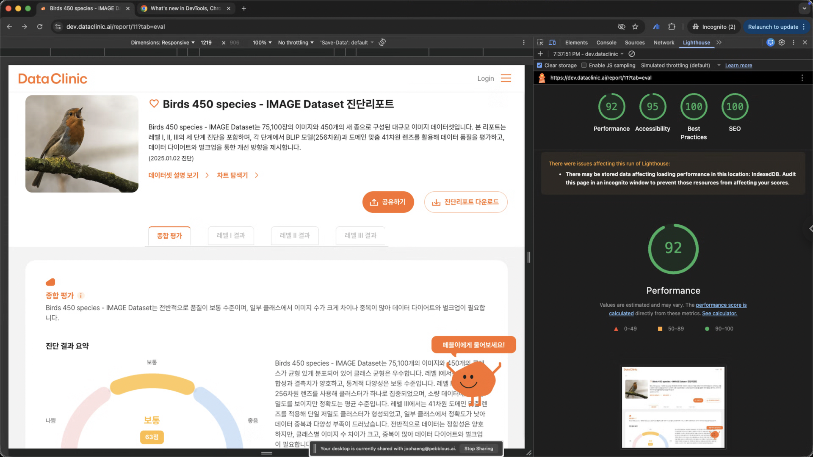

# Lighthouse 39점 → 92점, 2일 만에 끝낸 웹 성능 최적화

_Claude Code와 함께한 실전 기록_

## Executive Summary

> [!callout]
> 페블러스 [DataClinic](https://dataclinic.ai) 웹앱의 [Lighthouse Performance](https://developer.chrome.com/docs/lighthouse/performance)가 39점, [SEO](https://developers.google.com/search/docs/fundamentals/seo-starter-guide)는 측정 자체가 불가능한 상태였습니다. 외주를 맡기면 시니어 프론트엔드 개발자, SEO 전문가, QA 엔지니어 2~3명이 3~4주, 약 2,000만 원이 소요되는 규모의 작업이었습니다. [Claude Code](https://docs.anthropic.com/en/docs/claude-code/overview)와의 협업으로 이 작업을 API 비용 56만 원, 단 2일 만에 완료했습니다.

> 핵심 전략은 네 가지였습니다. 28,000px 거대 페이지를 탭뷰 아키텍처로 전환하여 렌더링 양을 1/4로 줄였고, SEO 메타데이터 체계를 제로부터 구축하여 N/A에서 100점을 달성했습니다. Skeleton UI를 정밀 적용하여 CLS를 0.661에서 0.021로 97% 감소시켰고, 접근성 개선으로 83에서 95점을 끌어올렸습니다.

> 이 글은 에이전틱 AI가 실무에서 어떤 레버리지를 제공하는지 보여주는 실전 기록입니다. 코드 수정→빌드→측정→분석의 반복 사이클을 분 단위로 돌릴 수 있었던 것이 핵심이며, 최종 비용 비율은 AI 1 대 사람 35 — 약 97%의 비용 절감을 달성했습니다.

## 1. 들어가며

웹 퍼포먼스는 사용자 경험과 검색 순위를 좌우하는 핵심 지표입니다. Google의 Lighthouse는 Performance, Accessibility, Best Practices, SEO 네 가지 축으로 웹페이지 품질을 측정하는 사실상의 표준 도구인데요, 점수를 올리려면 프론트엔드 아키텍처부터 메타데이터, 접근성, 이미지 최적화까지 광범위한 영역을 건드려야 합니다.

저는 AI 데이터 전문 기업 [Pebblous(페블러스)](https://pebblous.ai)의 대표입니다. 페블러스는 최소한의 인원으로 최대의 결과를 만들어야 하는 스타트업이기에, 저 역시 직접 코드를 쓰며 [DataClinic](https://dataclinic.ai)이라는 데이터 분석 보고서 웹앱을 개발하고 있습니다.

문제는 보고서 상세 페이지(`/report/[id]`)의 Lighthouse 점수였습니다. Performance 39점, SEO는 측정 자체가 불가능한 상태. 외주를 주면 2,000만 원에 한 달, 직접 하면 몇 주가 걸릴 작업이었습니다. 하지만 Claude Code와의 협업으로 **2일 만에, API 비용 약 56만 원으로** 대폭 개선했습니다. 그 과정을 기록합니다.

## 2. Before & After: 한눈에 보는 결과

이틀간의 작업은 크게 두 단계로 나뉩니다. 첫째 날 탭뷰 아키텍처 전환과 SEO 체계 구축으로 Performance 87, SEO 100을 달성했고, 둘째 날 CLS Skeleton placeholder 정밀 적용으로 Performance 92, Best Practices 만점을 추가 달성했습니다. 아래 표에서 각 단계별 점수 변화를 한눈에 확인할 수 있습니다.

| Category | Before (3/7) | Mid (3/8 오전) | Final (3/8 저녁) | 총 변화 |
| --- | --- | --- | --- | --- |
| Performance | 39 | 87 | 92 | +53 |
| Accessibility | 83 | 95 | 95 | +12 |
| Best Practices | 92 | 96 | 100 | +8 |
| SEO | N/A | 100 | 100 | N/A → 만점 |

SEO가 처음에 N/A였던 이유가 재미있습니다. 보고서 페이지의 DOM이 28,000px 이상으로 거대해서, Lighthouse의 SEO 수집기(AnchorElements gatherer)가 타임아웃되어 아예 점수를 매길 수 없었습니다. 페이지가 너무 크면 점수가 낮은 게 아니라 측정 자체가 불가능해지는 것이죠.

*DataClinic 보고서 페이지의 Lighthouse 최종 측정 결과 (Performance 92, Best Practices 100, SEO 100)*

## 3. Core Web Vitals: 숫자로 보는 체감 성능 개선

Lighthouse 점수의 이면에는 Core Web Vitals라는 세부 지표가 있습니다. 이 지표들이 실제 사용자가 느끼는 체감 속도를 결정합니다. 아래 표에서 각 지표별 개선폭을 확인할 수 있습니다.

| Metric | Before | Mid | Final | 개선율 |
| --- | --- | --- | --- | --- |
| CLSCumulative Layout Shift | 0.661 | 0.19 | 0.021 | 97% 감소 |
| LCPLargest Contentful Paint | 4.7s | 1.3s | 1.8s | 62% 감소 |
| Speed Index | 11.5s | 0.9s | 0.9s | 92% 감소 |
| TBTTotal Blocking Time | 200ms | 0ms | 0ms | 100% 제거 |
| TTITime to Interactive | 4.8s | 1.3s | 1.8s | 63% 감소 |
| FCPFirst Contentful Paint | 0.4s | 0.6s | 0.7s | 약간 증가 |

****  
****  
********  
****  
****

가장 극적인 개선은 CLS입니다. 0.661("나쁨")에서 0.021("좋음")로, 97% 감소를 달성했습니다. Google의 "좋음" 기준이 0.1 미만인데, 0.021은 그 기준의 1/5 수준입니다. LCP는 4.7초에서 1.8초로, Speed Index는 11.5초에서 0.9초로 줄었습니다. 체감 속도가 완전히 달라진 수준입니다.

FCP만 소폭 증가한 이유는 탭뷰 전환 시 초기 렌더링 구조가 변경되었기 때문입니다. 하지만 0.7초는 여전히 "좋음" 기준(1.8초 미만)을 충분히 만족하며, 전체적인 사용자 경험에 미치는 영향은 미미합니다.

## 4. 무엇을 했나: 4가지 핵심 작업

### 4.1 아키텍처 전환 — 동시 렌더링에서 탭뷰로

가장 큰 임팩트를 준 변경입니다. 기존 구조는 Evaluation, Level 1, Level 2, Level 3 네 개 섹션을 한 페이지에 모두 렌더링하여 28,000px 이상의 거대한 페이지를 만들고 있었습니다. 변경 후에는 선택된 탭의 섹션만 렌더링하여 렌더링 양을 약 1/4로 축소했습니다.

URL 설계도 유연하게 가져갔습니다. 기본은 탭뷰(`/report/[id]`), 기존 리스트뷰도 쿼리 파라미터로 유지(`/report/[id]?view=list`)하여 하위 호환성을 보장했습니다. 이 한 가지 변경만으로 LCP 62% 감소, Speed Index 92% 감소, TBT 100% 제거라는 극적인 결과를 얻었습니다.

> [!callout]
> 62%

> [!callout]
> 92%

> [!callout]
> 100%

### 4.2 SEO 메타데이터 체계 구축 — N/A에서 100점으로

SEO 점수가 아예 측정되지 않던 상태에서 만점을 달성하기까지, 체계적인 메타데이터 인프라를 구축했습니다. `generateMetadata`에서 보고서별 동적 title, description, canonical URL, alternates(ko/en)를 자동 생성하도록 구현했고, JSON-LD 구조화 데이터(TechArticle, BreadcrumbList, FAQPage 스키마)를 적용했습니다.

OpenGraph와 Twitter Card 메타 태그로 소셜 미디어 공유를 최적화하고, `noindex` 메타 태그를 제거하여 크롤러 접근을 허용했으며, 동적 OG 이미지(ImageResponse 1200x630)를 생성하는 시스템도 구축했습니다. SEO 관련 Lighthouse audit 항목 7개(`is-crawlable`, `canonical`, `image-alt`, `document-title`, `meta-description`, `hreflang`, `robots-txt`)를 모두 PASS로 만들었습니다.

### 4.3 CLS 개선 — Skeleton UI 도입

CLS(Cumulative Layout Shift) 0.661은 "나쁨" 수준입니다. 페이지 로드 중 레이아웃이 크게 흔들리고 있었다는 뜻이죠. 사용자가 읽으려던 텍스트가 갑자기 밀려나는 경험 — 그것이 CLS입니다.

1차로 Evaluation, Level1, Level2, Level3 각 컴포넌트에 Skeleton UI를 적용하고 탭뷰 전환으로 동시 렌더링을 제거하여 CLS를 0.19까지 낮췄습니다. 여기서 멈추지 않고 2차로 히어로 영역에 Skeleton placeholder를 정밀 적용하여 **CLS 0.021**을 달성했습니다. 0.1 미만이면 "좋음" 기준인데, 0.021은 그 기준의 1/5 수준입니다. 이 개선이 Performance 87에서 92로 끌어올린 핵심 요인입니다.

### 4.4 접근성 및 기타 개선

접근성(Accessibility) 점수를 83에서 95로 끌어올린 작업들입니다. 버튼에 `aria-label`을 추가하여 스크린 리더가 버튼의 용도를 읽을 수 있게 하고, 이미지에 의미 있는 `alt` 속성을 추가하고, 링크에 접근 가능한 이름을 부여했습니다.

그 외에도 `/api/json` 404 에러를 해결하고(API route를 locale 경로 바깥으로 이동), 이미지에 `object-fit: contain`을 적용하여 비율 깨짐을 수정했습니다. 이러한 세부 작업들이 쌓여 Best Practices 100점을 만들었습니다.

## 5. 프로젝트 규모: 36개 커밋, 139개 파일

이 모든 작업이 이틀 동안 이루어졌습니다. 숫자로 보면 그 밀도가 느껴집니다. 특히 소스 코드 78개 파일에 걸친 2,254줄의 추가와 297줄의 삭제는, 단순 수정이 아니라 아키텍처 수준의 리팩토링이 포함된 작업량입니다.

| 항목 | 수치 |
| --- | --- |
| 총 커밋 수 | 36 |
| 변경된 파일 | 139개+ |
| 소스 코드 변경 | 78파일, +2,254 / -297 라인 |
| 문서 작성 | 50+파일, +1,800+ 라인 |
| Lighthouse 측정 데이터 | 25개 JSON 파일 |
| 스킬 스크립트 | 4파일, +1,089 라인 |

## 6. Claude Code와의 작업 방식

Claude Code는 Anthropic의 CLI 기반 AI 코딩 에이전트입니다. 이번 프로젝트에서 Claude Code와의 협업은 **진단 → 계획 → 실행 → 측정**의 반복 사이클로 이루어졌습니다.

> [!callout]
> 1. Lighthouse JSON 분석

> Lighthouse 측정 결과 JSON을 Claude Code에 제공하면, 개선이 필요한 항목을 우선순위별로 정리해 줌

> [!callout]
> 2. 개선 계획 수립

> 각 항목에 대한 구체적 해결 방안을 코드 레벨에서 제안

> [!callout]
> 3. 코드 작성 및 수정

> 제안된 방안을 바로 코드로 구현 — 새 컴포넌트 생성, 기존 코드 리팩토링, 메타데이터 추가 등

> [!callout]
> 4. 재측정 및 검증

> 변경 후 다시 Lighthouse를 돌려 개선 효과 확인

이 사이클을 하루 동안 수십 차례 빠르게 반복할 수 있었던 것이 핵심입니다. 사람 혼자였다면 한 사이클에 수시간이 걸릴 작업을 분 단위로 처리했습니다. 또한 Claude Code의 커스텀 스킬 기능을 활용하여 `seo-check`, `lighthouse-check` 같은 전용 스킬을 만들어 반복 작업을 자동화하고, 분석 결과를 체계적으로 축적했습니다.

## 7. AI vs 사람 팀: 비용 비교

동일한 작업을 AI 에이전트 없이 사람이 수행했을 경우를 추정해 보겠습니다. 이 작업은 한 사람이 모든 영역을 커버하기 어렵습니다. SEO, Performance, Accessibility, Architecture를 모두 다루려면 현실적으로 2~3명의 전문가 팀이 필요합니다.

### 7.1 작업별 소요 인일 (Work Breakdown)

아래 표는 각 작업 영역별 예상 소요 시간입니다. SEO 분석부터 문서화까지 총 23~34 인일(man-days)이 필요한 규모입니다.

| 작업 영역 | 세부 내용 | 예상 인일 |
| --- | --- | --- |
| SEO 분석 & 기획 | 현황 감사, 분석, 우선순위 도출, 체크리스트 | 2~3 |
| SEO 구현 | generateMetadata, sitemap, canonical, hreflang, JSON-LD, OG Image | 5~7 |
| 성능 최적화 | CLS 원인 분석, Skeleton UI 설계·구현, 폰트·번들 최적화 | 4~6 |
| Tabview 아키텍처 | 탭 전환 뷰 설계·구현(822줄), 쿼리파라미터 통합, 호환 | 4~5 |
| 접근성 개선 | aria-label, image-alt, heading-order, color-contrast | 1~2 |
| Best Practices | image-aspect-ratio, API route 404, console error | 1~2 |
| 측정 & 분석 | Lighthouse 25회+ 측정, 결과 비교, 병목 식별, 보고서 | 3~4 |
| 버그 수정 & 문서화 | 이중 locale, og:image localhost, build 에러, CLAUDE.md 등 | 3~5 |
| 합계 | 23~34 인일 |  |

### 7.2 외주 비용 환산

외주 단가 기준으로 환산하면 시니어 프론트엔드 개발자(일 80만 원) 18일, SEO 전문가(일 60만 원) 4일, QA 엔지니어(일 50만 원) 6일로, 총 **약 2,000만 원**(USD ~$14,000) 규모입니다. 기간은 약 3~4주가 소요됩니다.

### 7.3 실제 AI 비용: Claude Code 토큰 사용량

이번 프로젝트에서 실제로 사용된 Claude Code(Claude Opus 4.6 모델)의 토큰과 비용을 공개합니다. Cache read가 전체 비용의 68%를 차지합니다. 긴 대화에서 매 턴마다 전체 컨텍스트를 캐시로 재전달하기 때문인데, cache read 단가($1.50/M)는 일반 input($15/M)의 1/10 수준이므로 캐시가 없었다면 비용은 약 7배였을 것입니다.

| 항목 | 단가 (/M tokens) | 토큰 수 | 비용 |
| --- | --- | --- | --- |
| Input | $15 | 36K | $0.55 |
| Output | $75 | 445K | $33.35 |
| Cache read | $1.50 | 177.6M | $266.33 |
| Cache creation | $18.75 | 4.8M | $90.93 |
| 합계 | $391 (~56만 원) |  |  |

### 7.4 최종 비교

AI 에이전트와 사람 팀의 최종 비교표입니다. 비용 35배, 시간 10~15배의 차이 — 약 97%의 비용 절감을 달성했습니다.

|  | AI Agent (Claude Code) | Human Team |
| --- | --- | --- |
| 비용 | ~56만 원 | ~1,980만 원 |
| 소요 시간 | ~2일 | 3~4주 |
| 인력 | 1명 (+ AI) | 2~3명 |
| Lighthouse 측정 | 25회+ (즉시 분석) | 5~10회 (수동 분석) |
| 비용 비율 | 1 | 35x |

### 7.5 AI 에이전트 협업이 효과적이었던 이유

이 수치의 핵심은 단순히 "빠르다"가 아닙니다. AI 에이전트 협업이 특히 효과적이었던 구조적 이유가 있습니다.

- **빠른 피드백 루프** — 코드 수정 → 빌드 검증 → Lighthouse 측정 → 분석을 분 단위로 반복. 사람 혼자라면 한 사이클에 30분~1시간 걸릴 것을 5~10분으로 단축
- **전문 영역 통합** — SEO, Performance, Accessibility, Architecture를 별도 전문가 없이 한 세션에서 처리
- **코드베이스 즉시 이해** — 139개 파일, 수만 줄의 코드를 즉시 탐색·분석
- **문서 자동화** — 측정 보고서, 비교 분석, 커밋 히스토리를 자동 생성
- **일관성 유지** — 36개 커밋 전체에서 코딩 컨벤션, 커밋 메시지 스타일 일관 유지

## 8. 아직 남은 것들

Performance 92, Best Practices 100을 달성했지만 아직 과제가 남아 있습니다. 완벽한 점수가 목표가 아니라 지속적인 개선이 목표이기에, 향후 작업 목록을 투명하게 공유합니다.

- **이미지 CDN 리사이징** — 원본 이미지 크기 최적화 (Performance 추가 개선 가능)
- **색상 대비 개선** — 브랜드 컬러 #F86825의 대비율이 3.0으로 WCAG 기준 4.5에 미달 (Accessibility 95→100 가능)
- **프로덕션 배포 후 재측정** — dev 환경이 아닌 실서비스에서의 점수 확인

## 9. 마치며

2일 만에 Lighthouse Performance 39→92, SEO N/A→100, Best Practices 만점을 달성하고, 2,000만 원짜리 프로젝트를 56만 원으로 해결한 이 경험은 AI 코딩 에이전트가 실무에서 어떤 레버리지를 제공하는지 보여주는 좋은 사례라고 생각합니다.

중요한 점은 Claude Code가 모든 걸 대신해 준 게 아니라는 것입니다. **무엇을 개선할지 방향을 잡고, 결과를 판단하는 것은 여전히 사람의 몫**이었습니다. Claude Code는 그 방향이 정해진 후의 실행 속도를 극적으로 높여주는 도구였습니다. 마치 숙련된 페어 프로그래머가 옆에서 쉬지 않고 코드를 써주는 느낌에 가까웠습니다.

웹 성능 최적화처럼 **분석 → 수정 → 측정의 반복이 핵심인 작업**은 AI 에이전트와의 협업이 특히 큰 효과를 발휘하는 영역입니다. 비슷한 고민을 하고 계신 분들께 참고가 되길 바랍니다.

> [!callout]
### 그 다음: 소프트웨어에서 데이터로

> 페블러스 내부 프론트엔드 개편 프로젝트에서, 기존 2,000만 원과 4주가 소요될 작업을 AI 에이전트를 활용해 단 56만 원의 API 비용과 2일 만에 해결했습니다.

> 소프트웨어 엔지니어링에서 입증된 이 **'에이전틱 AI의 폭발적 레버리지'**를, 페블러스는 **AADS(Agentic AI Data Scientist)**를 통해 피지컬 AI(제조, 로봇, 국방)의 데이터 병목 해소에 그대로 이식합니다. 사람이 수작업으로 라벨링하고 검수하던 수억 원 규모의 데이터 정제 비용을 API 토큰 단위의 비용으로 혁신하는 것 — 이것이 페블러스 데이터 클리닉 2.0이 그리는 미래입니다.

## PDF 보기/다운로드

이 글의 전체 내용(부록 포함: 36개 커밋 로그, Lighthouse 상세 Audit 결과)을 PDF로 확인하실 수 있습니다.

📊

### Lighthouse 웹 성능 최적화 보고서

Performance 39→92, SEO N/A→100 — Claude Code와 함께한 실전 기록 전문

[PDF 보기](../source/blog-2026-mar-lighthouse.pdf)[PDF 다운로드](../source/blog-2026-mar-lighthouse.pdf)
