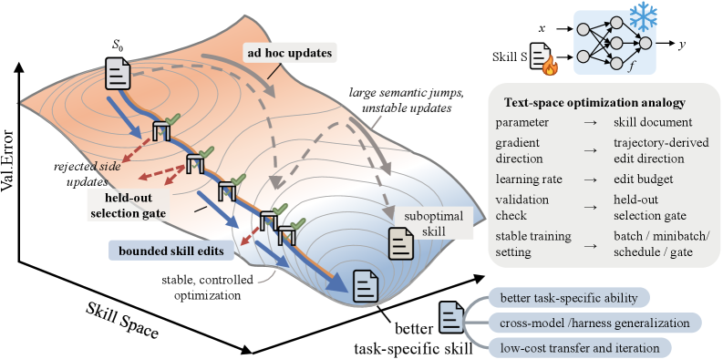
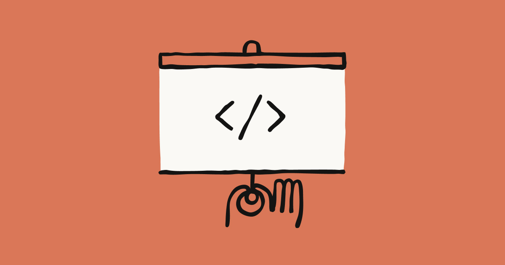
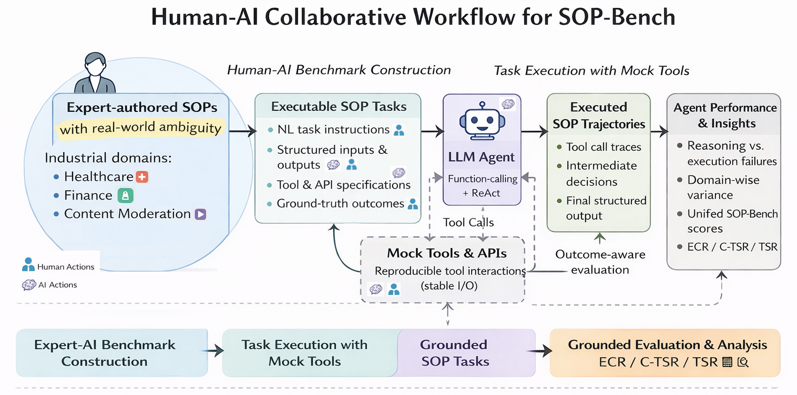
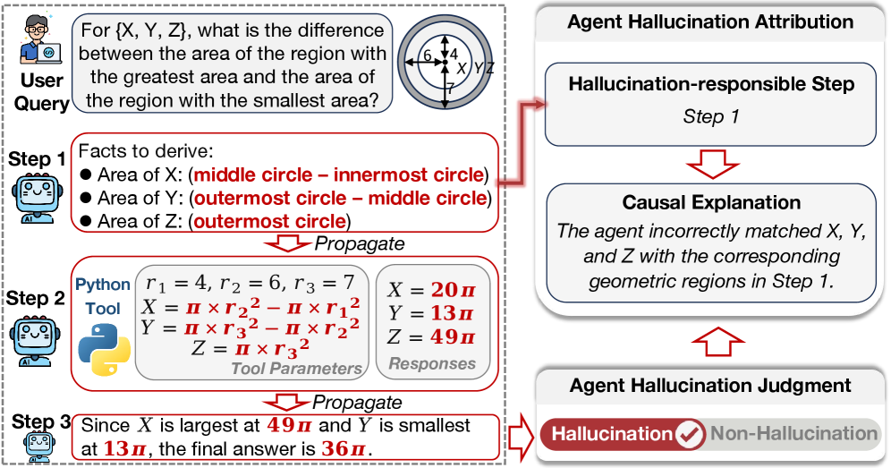

# Every Job Is an Algorithm — What Claude Code Workflows Just Proved

_From Miessler_

## Executive Summary

> [!callout]
> In 2024, Daniel Miessler declared: "Every company is a graph of algorithms, and most employees are simply nodes executing those algorithms." On May 28, 2026, Anthropic attached an execution engine to that graph. Claude Code Dynamic Workflows orchestrates up to **1,000 subagents** in a single run, cross-validates results through adversarial verification, and sustains long-running tasks via checkpoint-based resumption. Bun's Zig-to-Rust port (**960,000 lines, 6 days, 99.8% tests passing**) proved this architecture operates at a scale unreachable by single-agent loops.

> But tools alone don't produce outcomes. McKinsey reports that of companies that have adopted AI (**88%**), only **5.5%** report meaningful financial impact. SkillOpt (Microsoft Research, 2026) achieved top or tied performance across 52 (model, benchmark, harness) configurations without touching model weights. Optimizing natural-language skill documents alone delivered **+19–25 pp** gains. This is direct empirical evidence for Miessler's thesis: enterprise value is determined by the design quality of business processes (algorithms), not the AI model itself.

> Human roles are not disappearing. They are being redefined. Gallup finds that only **21%** of global workers are genuinely engaged. Miessler argues that only **4%** of work tasks require above-median creativity. When the remaining 96% are algorithmatized, what humans retain is: the judgment to decide what problems to solve, the creativity to envision new products, and the orchestration skill to design and optimize the workflow graph. Data quality is the decisive variable in this transformation.

**_Editor's Note._** Enterprise work being decomposed into a graph of algorithms, with 1,000 subagents flowing through that graph. Data quality sits at the center of the picture. Pebblous's place is diagnosing the data quality at each node of the workflow graph. This piece traces both the picture and the place where they meet.

### Key Metrics

Sources: [Anthropic Engineering](https://www.anthropic.com/news/code-execution-with-mcp), Bun Issue #25425, McKinsey AI ROI study, Gartner Data Quality Cost Estimate.

<!-- stat-card -->
**1,000** — subagents/run — Anthropic (May 2026)

<!-- stat-card -->
**960K lines** — 6 days / 99.8% — Bun Rust port result

<!-- stat-card -->
**88% / 5.5%** — adoption / impact — McKinsey AI ROI gap

<!-- stat-card -->
**$12.9M** — annual quality cost — Gartner (2024–2025)

## "Companies Are Just Graphs of Algorithms" — Dissecting the Miessler Thesis

In 2024, security researcher and Fabric project founder Daniel Miessler put forward a provocative proposition: "Companies are graphs of algorithms, and most employees are merely nodes executing those algorithms." The claim ran counter to conventional organizational theory — but by 2026, academic evidence has begun to validate it.

### Algorithms Beat Models

SkillOpt (Microsoft Research, 2026) achieved top or tied performance across all 52 (model, benchmark, harness) configurations tested. The crucial point: it never touched model weights. Optimizing natural-language skill documents alone yielded **+19–25 pp** gains. This is direct academic evidence for Miessler's thesis: enterprise value is determined not by the AI model itself, but by the design quality of business processes (algorithms).

*▲ SkillOpt text-space optimization — editing skill documents in the direction of "gradient" instead of updating model weights | Source: [Microsoft Research, arXiv 2605.23904](https://arxiv.org/abs/2605.23904)*

### Why Most Work Can Be Algorithmized

Gallup's 2025 State of the Global Workplace report finds that only **21%** of global employees are genuinely engaged. Miessler, citing McKinsey data, estimates that only **4%** of work tasks require above-median creativity. The remaining 96% involves repeating formalized procedures — which is precisely the definition of an algorithm.

> [!callout]
> If Miessler's thesis was a thought experiment in 2024, SkillOpt's "+25 pp" converted it into empirical fact in 2026. The question then becomes: who executes these algorithms, and how? That answer is Dynamic Workflows.

## Claude Code Dynamic Workflows — The Execution Engine Arrives

On May 28, 2026, Anthropic launched Dynamic Workflows in Claude Code. This marks the third leap in agent evolution — Skills (2024) → Cowork (2025) → Dynamic Workflows (2026) — and represents a qualitatively different tier.

*▲ Claude Code Dynamic Workflows — Anthropic official announcement, May 28, 2026 | Source: [Anthropic Blog](https://claude.com/blog/introducing-dynamic-workflows-in-claude-code)*

### Core Architecture: Orchestration Replaces Context

Prior AI coding tools addressed large codebases by expanding the context window — Google Gemini's 1M-token context being the canonical example. Claude Code Dynamic Workflows chose the opposite strategy. Rather than growing context, it assigns **up to 16 parallel subagents** to each handle their own domain, with a total of **1,000 subagents** orchestrated within a single run.

Three architectural elements make this scale possible. First, a JavaScript-based orchestration script decomposes tasks at runtime and dispatches them to subagents. Second, an adversarial verification layer deploys separate agents to cross-check each other's outputs. Third, checkpoint-based resumption ensures reliability for long-running tasks.

### Bun Port: The First Large-Scale Proof

Bun's Zig-to-Rust migration is Dynamic Workflows' first large-scale success story. **960,000 lines** of code ported in **6 days**, with **99.8%** of tests passing. Context matters, however: Bun is an Anthropic-acquired project with optimal support; the result is pre-production; and language-to-language migration is a specialized task type. The HN community noted that "the LLM bottleneck is accuracy, not speed." The technique is demonstrably effective for large-scale codebase audits and migrations, but generalization to creative greenfield development requires additional validation.

### Five-Tool Comparison

Tool selection in the coding agent market is increasingly a function of workflow stage rather than raw features.

| Tool | Core Strength | Best-Fit Scenario |
| --- | --- | --- |
| Claude Code | 1,000 subagents, adversarial verification | Large-scale migration, codebase audit |
| GitHub Copilot | Team governance, PR review integration | Team code review workflows |
| Cursor | IDE-native, fast iteration | Individual developer productivity |
| Devin | Async autonomous execution, self-build-test | Technical debt, async tasks |
| Amazon Q | Deep AWS infrastructure integration | AWS-native development environments |

In Korea, NAVER and Kakao have officially adopted a dual-stack approach — "ChatGPT (general-purpose) + Claude Code (development-dedicated)." Kakao completed full-company rollout by late May 2026, while simultaneously preparing its own agents (NAVER Agent N, Kakao Kanana) for release in H2 2026, setting up a competition-and-complement dynamic between foreign and domestic AI agents.

## SOP Crystallization — The Reality of Pseudo-Deterministic Workflows

There is an optimistic view that "simply writing an SOP will have AI execute it automatically." SOP-Bench (Amazon, 2026) quantitatively refutes this. Even the best agent (ReAct Agent) achieved an average success rate of only **48%**; Function-Calling Agents reached just **27%**. As tool registries grow larger, incorrect tool-call rates approach nearly 100%.

*▲ SOP-Bench architecture — expert-authored SOPs → LLM agent execution → mock tools → performance evaluation | Source: [Amazon Science, arXiv 2506.08119](https://arxiv.org/abs/2506.08119)*

### The Scope of "Pseudo"

The workflow structure — which tasks to execute in what order — is pre-determined by CLAUDE.md and skill files. But the execution of each node (code generation, analysis, etc.) depends on probabilistic LLM reasoning. This "structure is deterministic, execution is probabilistic" combination is what defines pseudo-deterministic.

The extremes of the spectrum clarify why this tradeoff matters. Compiled AI (2026) achieved deterministic code generation, reducing runtime token consumption by **57x** and output variance to **0%** — but completely surrendered flexibility for unexpected situations. At the other end, AFlow (ICLR 2025 Oral) used Monte Carlo Tree Search to explore workflows themselves in a fully probabilistic approach, but output variance ranged from 18–75%.

> [!callout]
> Claude Code's hybrid approach — "use CLAUDE.md to fix structure, dynamically spawn subagents at runtime" — simultaneously captures the predictability of determinism and the flexibility of probabilistic reasoning. Constraining tool scope through skill files is the key design principle that structurally prevents the "tool over-calling" problem identified by SOP-Bench.

## Data Quality Determines Workflow Accuracy

A workflow engine operates precisely as accurately as the quality of its fuel (data). The most overlooked variable behind McKinsey's reported "88% adoption, 5.5% outcomes" gap is data quality. Gartner estimates that enterprises spend an average of **$12.9M per year** on data quality problems.

### The Error Propagation Mechanism

AgentHallu (2026) analyzed 693 trajectories and identified the systematic pathways by which hallucinations originating in the Planning stage propagate into the Tool-Use stage. Each workflow node receives the previous node's output as its input. When the data entering the first node is inaccurate, errors propagate downstream and amplify through successive nodes.

*▲ Agent hallucination propagation — errors in Planning (red) amplify through Tool-Use and final output across all steps | Source: [AgentHallu, arXiv 2601.06818](https://arxiv.org/abs/2601.06818)*

### Skill Quality Management Is the Performance Bottleneck

Ratchet's (2026) key finding is counterintuitive. LLM-auto-generated skills delivered **+0.0 pp** improvement, while human-curated skills achieved **+16.2 pp**. This 16 pp gap proves that lifecycle management of skills (retiring, refining, meta-skilling) is far more decisive than skill creation. The same principle applies precisely to data quality management: accumulating data is not enough — it must be diagnosed, refined, and retired.

DataFlow (2025) proposed a framework integrating data quality with AI pipelines. The five dimensions of AI-Ready Data — accuracy, completeness, consistency, provenance, and bias — are simultaneously the five execution conditions of an SOP. When data flowing through each workflow node fails to meet these five conditions, no orchestration engine, however sophisticated, can guarantee accurate results.

## Redefining the Human Role — What Remains

McKinsey estimates that **60–70%** of knowledge work is automatable. Gartner predicts that by the end of 2026, **75%** of developers will spend more time on orchestration and architecture than on writing code. Writing code gives way to designing the SOP for agents that write code — this becomes the developer's new core competency.

### Three Roles That Remain for Humans

When 96% of work is algorithmized, human roles converge on three areas:

- 1.**Taste (Judgment)** — The ability to decide what to solve and what not to. Algorithms solve given problems efficiently, but they cannot judge which problems are worth solving.
- 2.**New Product/Service Conception** — The creative leap to build what doesn't exist yet. Designing an SOP for the first time in a domain where no SOP yet exists remains uniquely human.
- 3.**Workflow Design and Optimization** — The meta-competency of composing the algorithm graph and optimizing connections between nodes. Just as MUSE-AutoSkill (2026) integrated the full skill lifecycle (creation–memory–management–evaluation–refinement), humans need a birds-eye view of the entire workflow.

According to SemiAnalysis, **4%** of GitHub commits are already generated by Claude Code. This share will grow rapidly, and developers' daily reality is shifting from "time spent writing code" to "time spent supervising agents doing it correctly."

## Why Pebblous Is Watching This Space

Dynamic Workflows is the engine that runs business operations as a graph of algorithms. But an engine operates precisely as accurately as the quality of its fuel. The "data quality = workflow accuracy" equation repeatedly confirmed in this report connects directly to Pebblous's core business.

### Diagnosing the Fuel Flowing Through Workflow Nodes

When enterprises decompose their operations into algorithm graphs and execute them through Dynamic Workflows, the quality of data flowing through each node determines the accuracy of the entire pipeline. The "algorithms (skills) > models" principle proven by SkillOpt ultimately means that algorithmic quality depends on input data quality. DataClinic automatically diagnoses the AI-Ready level of this input data across five dimensions: accuracy, completeness, consistency, provenance, and bias.

### Structural Isomorphism with the Verification Layer

Dynamic Workflows' adversarial verification — a mechanism where separate agents cross-validate each other's results — is structurally isomorphic to DataClinic's automated quality auditing. Both follow the same design principle: "independently cross-validate results to preemptively block errors." If Ratchet's finding that "skill management > skill creation" applies equally to data, then a system for managing data lifecycle becomes essential infrastructure for workflow success.

### The Solution to the "88% Adoption, 5.5% Outcomes" Gap

McKinsey's reported gap stems from four practical challenges: (1) SOP mapping as a prerequisite — making existing work explicit enough for agents to execute; (2) data pipeline quality auditing — establishing a baseline before AI deployment; (3) designing human oversight points — where to place HITL checkpoints; (4) understanding the cost structure — calculating ROI for "significantly more" token consumption. Of these four, the second — establishing data pipeline quality baselines and automated diagnosis — is directly where DataClinic delivers.

### Questions to Explore Going Forward

The central questions this report raises: which dimension of data quality is most decisive in raising SOP-Bench's 27–48% success rates? How far can error propagation be contained by integrating Dynamic Workflows' adversarial verification with automated data quality auditing? These are directions Pebblous must continuously explore as it develops DataClinic and DataGreenhouse.

## Frequently Asked Questions

Questions that frequently arise from this report, compiled here: the architectural significance of Dynamic Workflows, the generalizability of the Bun port case, the realistic limits of SOP automation (27–48% success rates), token cost structures, and how Korean enterprises should prepare. Understanding the "why," "how much," and "how far" before tool selection is the starting point for enterprise AI adoption.

## References

### Academic Papers (arXiv)

- 1.Wang, L. et al. (2023). "A Survey on Large Language Model based Autonomous Agents." _arXiv preprint_. [arxiv.org/abs/2308.11432](https://arxiv.org/abs/2308.11432)
- 2.Wu, Q. et al. (2023). "AutoGen: Enabling Next-Gen LLM Applications via Multi-Agent Conversation." _arXiv preprint_. [arxiv.org/abs/2308.08155](https://arxiv.org/abs/2308.08155)
- 3.Wang, G. et al. (2023). "Voyager: An Open-Ended Embodied Agent with Large Language Models." _arXiv preprint_. [arxiv.org/abs/2305.16291](https://arxiv.org/abs/2305.16291)
- 4.Zhang, J. et al. (2025). "AFlow: Automating Agentic Workflow Generation." _ICLR 2025 Oral_. [arxiv.org/abs/2410.10762](https://arxiv.org/abs/2410.10762)
- 5.Agashe, S. et al. (2025). "Agent-S: LLM Agentic Workflow to Automate Standard Operating Procedures." _arXiv preprint_. [arxiv.org/abs/2503.15520](https://arxiv.org/abs/2503.15520)
- 6.Liu, Y. et al. (2025). "DataFlow: An LLM-Driven Framework for Unified Data Preparation and Workflow Automation." _arXiv preprint_. [arxiv.org/abs/2512.16676](https://arxiv.org/abs/2512.16676)
- 7.Chen, T. et al. (2024). "A Survey on LLM-based Multi-Agent System." _arXiv preprint_. [arxiv.org/abs/2412.17481](https://arxiv.org/abs/2412.17481)
- 8.Workflow Survey Team. (2025). "A Survey on Agent Workflow — Status and Future." _arXiv preprint_. [arxiv.org/abs/2508.01186](https://arxiv.org/abs/2508.01186)
- 9.Microsoft Research. (2026). "SkillOpt: Executive Strategy for Self-Evolving Agent Skills." _arXiv preprint_. [arxiv.org/abs/2605.23904](https://arxiv.org/abs/2605.23904)
- 10.MUSE Team. (2026). "MUSE-AutoSkill: Self-Evolving Agents via Skill Creation, Memory, Management, and Evaluation." _arXiv preprint_. [arxiv.org/abs/2605.27366](https://arxiv.org/abs/2605.27366)
- 11.Ratchet Team. (2026). "Ratchet: A Minimal Hygiene Recipe for Self-Evolving LLM Agents." _arXiv preprint_. [arxiv.org/abs/2605.22148](https://arxiv.org/abs/2605.22148)
- 12.Compiled AI Team. (2026). "Compiled AI: Deterministic Code Generation for LLM-Based Workflow Automation." _arXiv preprint_. [arxiv.org/abs/2604.05150](https://arxiv.org/abs/2604.05150)
- 13.AgentHallu Team. (2026). "AgentHallu: Benchmarking Automated Hallucination Attribution of LLM-based Agents." _arXiv preprint_. [arxiv.org/abs/2601.06818](https://arxiv.org/abs/2601.06818)
- 14.Amazon Science Team. (2026). "SOP-Bench: Complex Industrial SOPs for Evaluating LLM Agents." _arXiv preprint_. [arxiv.org/abs/2506.08119](https://arxiv.org/abs/2506.08119)
- 15.Scheduler Theory Team. (2026). "From Agent Loops to Structured Graphs: A Scheduler-Theoretic Framework." _arXiv preprint_. [arxiv.org/abs/2604.11378](https://arxiv.org/abs/2604.11378)
- 16.IBM Research. (2026). "From Static Templates to Dynamic Runtime Graphs: A Survey of Workflow Optimization." _arXiv preprint_. [arxiv.org/abs/2603.22386](https://arxiv.org/abs/2603.22386)

### Industry Reports & Official Announcements

- 17.Anthropic. (2026-05-28). "[Introducing Dynamic Workflows in Claude Code](https://claude.com/blog/introducing-dynamic-workflows-in-claude-code)." _Anthropic Blog_.
- 18.Anthropic. (2026). "[Claude Code Workflows Official Documentation](https://code.claude.com/docs/en/workflows)." _Claude Code Documentation_.
- 19.McKinsey & Company. (2023-06). "[The Economic Potential of Generative AI: The Next Productivity Frontier](https://www.mckinsey.com/capabilities/mckinsey-digital/our-insights/the-economic-potential-of-generative-ai-the-next-productivity-frontier)." _McKinsey Global Institute_.
- 20.Gartner. (2024). "Data Quality Market Guide." _Gartner Research_. (Cited in industry coverage; exact URL subscriber-only.)
- 21.Gallup. (2025). "[State of the Global Workplace 2025 Report](https://www.gallup.com/workplace/349484/state-of-the-global-workplace.aspx)." _Gallup Press_.
- 22.Miessler, D. (2024). "[Companies Are Just Graphs of Algorithms](https://danielmiessler.com/blog/companies-are-just-graphs-of-algorithms)." _danielmiessler.com_.
- 23.Miessler, D. (2024). Fabric Project. GitHub: [github.com/danielmiessler/fabric](https://github.com/danielmiessler/fabric).
- 24.SemiAnalysis. (2026). "Claude Code Market Share and Enterprise Adoption." _SemiAnalysis Newsletter_.
- 25.The Register. (2026). "Bun Ports 960K Lines of Zig to Rust Using Claude Code Dynamic Workflows." _The Register_.
- 26.Sumner, J. (2026). Bun Project Update. [bun.sh](https://bun.sh).

### Media & Analysis

- 27.Hacker News. (2026-05-28). "Ask HN: Dynamic Workflows in Claude Code — First Impressions." [news.ycombinator.com](https://news.ycombinator.com).
- 28.McKinsey & Company. (2026). "The State of AI in Early 2026: Gen AI Adoption Surges." _McKinsey Global Survey_.
- 29.Gartner. (2026). "Predicts 2026: Software Engineering AI." _Gartner Research_.
- 30.Accenture Technology Vision. (2026). "Agentic AI in the Enterprise." _Accenture_.
- 31.Naver Corp. (2026). "NAVER Agent N — Technical Preview." _NAVER Tech Blog_.
- 32.Kakao Corp. (2026). "Claude Code Full-Company Deployment Completion." _Kakao Newsroom_.
- 33.Pebblous Research. (2026). DataClinic Product Documentation. [blog.pebblous.ai](https://blog.pebblous.ai).
