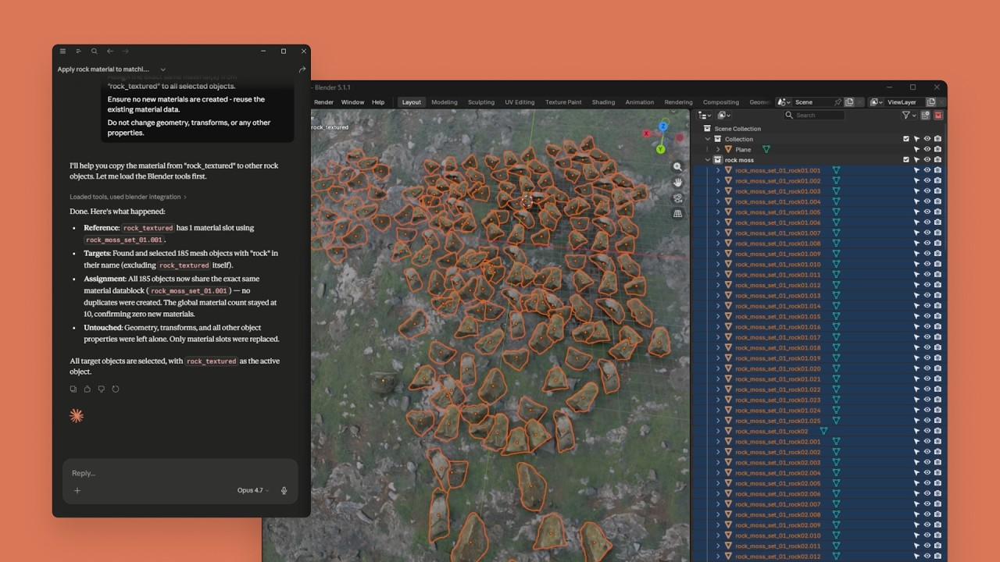
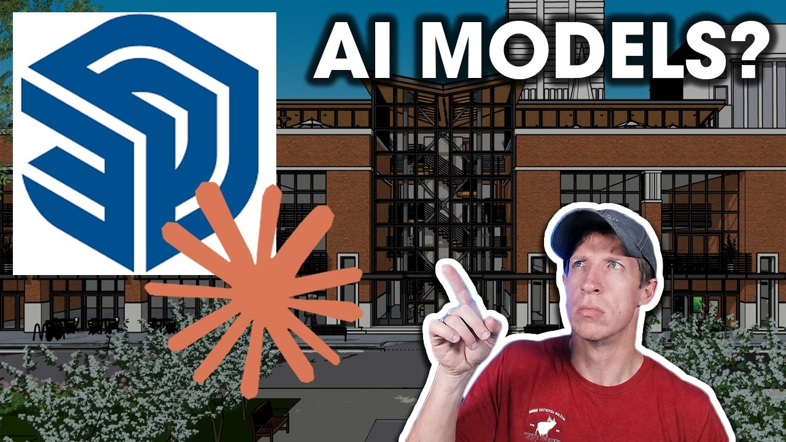
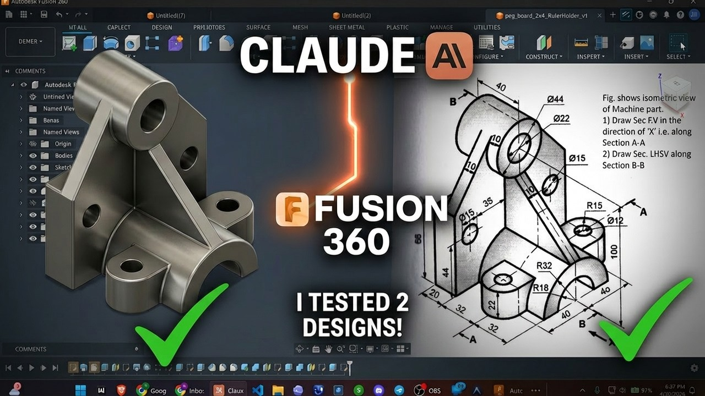
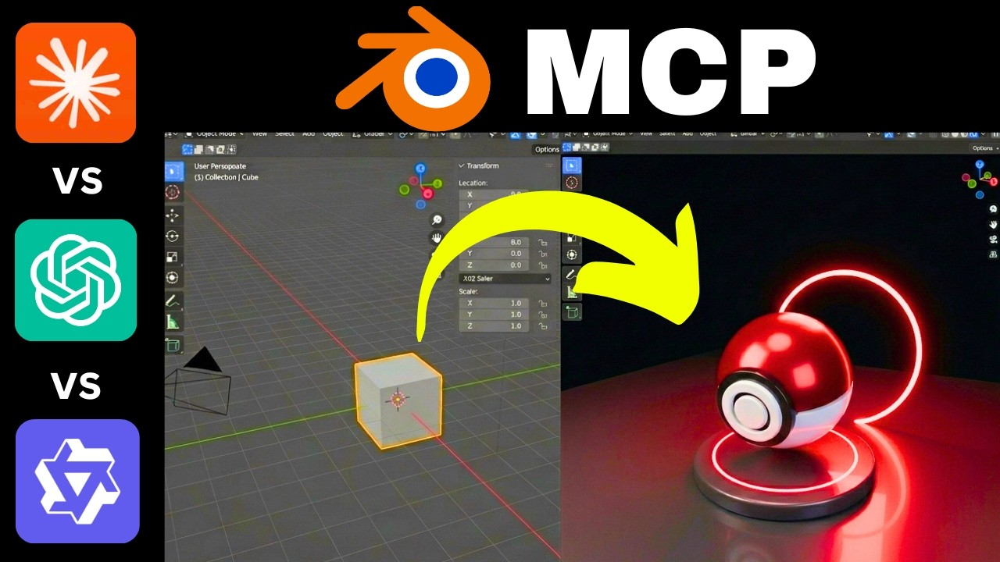

# 에이전트가 일할 때, 누군가는 데이터를 거둬간다

_Claude의 9개 커넥터가 부산물로 만드는 합성 데이터, 그리고 그것을 학습하는 다음 세대 AI_

읽는 시간: ~18분 · [English](../en/)

## Executive Summary

> [!callout]
> 2026년 4월 28일, 앤트로픽은 Blender, Adobe, Autodesk Fusion 등 9개 전문 창작 도구에 Claude 에이전트를 삽입하는 "Claude for Creative Work"를 발표했다. 이 발표의 진짜 의미는 9개 커넥터 자체가 아니다. **MCP(Model Context Protocol) 기반으로 Python API 전체를 노출하고 임의 코드 실행을 허용하는 구조가 열린 순간, 창작자가 작업하는 자리마다 합성 데이터가 부산물로 쏟아진다 — 그리고 그 데이터를 다음 세대 AI가 학습한다.** 크리에이티브 AI 시장은 2026년 **$7.16B**(Research and Markets)에 달하지만, 이 시장에서 에이전트가 생성한 데이터의 품질을 검증하는 메커니즘은 어디에도 존재하지 않는다.

> MCP 순차 호출에서 각 단계의 미세한 왜곡은 최종 산출물에 **O(T)**로 선형 누적된다는 사실이 마틴게일 분석으로 수학적으로 증명되었다(arXiv 2602.13320). AI 생성 콘텐츠가 학습 데이터의 **3%**만 차지해도 후속 모델의 붕괴가 시작된다는 실험 결과(Anyverse)와 결합하면, 품질 검증 없는 에이전트 생성 데이터는 크리에이티브 파이프라인 전체를 오염시킬 수 있다. 5대 빅테크 중 이 문제에 대한 해답을 제시한 기업은 없다.

> 이 구조는 PebbloSim의 "에이전트 → 시뮬레이터 제어 → 합성 데이터 생성" 파이프라인과 정확히 동형이다. 자율주행 도메인에서 DataClinic이 축적한 듀얼 임베딩 기반 품질 진단 기술은, 크리에이티브 에이전트 생태계의 품질 공백을 채울 수 있는 $7.16B 시장의 보완재(complement)로 전이 가능하다. Anthropic이 에이전트를 제공하면, 그 에이전트가 만든 산출물의 품질을 보장하는 역할이 남아 있다.

## 앤트로픽의 크리에이티브 AI 전략 해부 — "도구 안의 에이전트"가 여는 새로운 데이터 경로

2026년은 에이전트 전쟁의 해다. OpenAI가 Codex 에이전트를 업그레이드하고, Google이 Veo 3.1과 Imagen을 Gemini에 통합하는 가운데, 앤트로픽은 전혀 다른 방향을 선택했다. 새로운 생성 도구를 만드는 대신, **기존 전문 도구 안에 에이전트를 삽입**하는 전략이다. 2026년 3월 기준 ARR $30B, 엔터프라이즈 LLM 시장 점유율 40%(Menlo Ventures)를 기록하는 앤트로픽이 크리에이티브 도메인에 진출하는 방식은, 그 자체로 데이터 흐름의 구조적 변화를 예고한다.

### 9개 커넥터의 접근 수준 스펙트럼

9개 커넥터는 MCP(Model Context Protocol)를 통해 각 도구의 API에 연결된다. MCP는 앤트로픽이 2024년 11월 도입하고 2025년 12월 Linux Foundation에 기증한 오픈 표준으로, 현재 월 9,700만 SDK 다운로드, 10,000+ 프로덕션 서버, 177,000+ 등록 도구를 보유한 사실상 업계 표준이다. 각 커넥터의 도구 접근 깊이는 곧 데이터 품질 리스크의 크기와 정비례한다.

| 커넥터 | 접근 수준 | 데이터 생성 능력 | 품질 리스크 |
| --- | --- | --- | --- |
| Blender | Python API 전체, 임의 코드 실행 | 3D 메시, 애니메이션, 렌더링 | 극히 높음 |
| Resolume Arena/Wire | 실시간 라이브 비주얼 제어 | 실시간 영상, VJ 비주얼 | 높음 |
| Adobe | 50+ Creative Cloud 도구 오케스트레이션 | 이미지, 영상, 디자인 | 높음 |
| Autodesk Fusion | 대화형 3D CAD 생성/수정 | CAD 모델, 부품 설계 | 높음 |
| SketchUp | 클라우드 3D geometry 생성 | 건축/인테리어 3D 모델 | 중간 |
| Affinity by Canva | 배치 이미지 스크립트 자동화 | 배치 이미지 편집 | 중간 |
| Splice | 로열티프리 샘플 검색 | 오디오 검색 결과 | 낮음 |
| Ableton | 문서 기반 어시스턴트 | 문서 검색만 | 최소 |

### 커넥터 활용 — 실제 창작 결과물

커뮤니티 실전 테스트와 공식 데모에서 확인된 실제 창작 결과물이다. 프롬프트 하나로 3D 모델, CAD 부품, 건축 렌더링이 생성된다. 이 결과물들이 바로 부산물로 쏟아져 어딘가에 학습 데이터로 쌓이는 합성 데이터다.

[https://youtu.be/LZMWsZbZU5w](https://youtu.be/LZMWsZbZU5w)

*Blender MCP — Claude가 대화로 지시해 `rock_textured` 머티리얼을 186개 오브젝트에 일괄 적용. 좌측 Claude 대화창의 지시가 Blender 뷰포트(우)에 실시간 반영된다.
                                  
출처: Anthropic 공식 · YouTube ↗*

[https://youtu.be/X1lnTEpy6PQ](https://youtu.be/X1lnTEpy6PQ)

*SketchUp MCP — 텍스트 프롬프트로 생성된 3D 건축 렌더링. 건물 구조, 창문, 조경까지 Claude가 SketchUp에 직접 geometry를 생성한다.
                                  
출처: YouTube ↗*

[https://youtu.be/qXgZaHPUKIw](https://youtu.be/qXgZaHPUKIw)

*Autodesk Fusion MCP — 기술 도면(우)을 입력하자 Claude가 Fusion 360에서 3D 기계 부품을 직접 모델링(좌). 제조 공차 검증은 사용자 몫이다.
                                  
출처: YouTube ↗*

### 경쟁사와의 근본적 차이

OpenAI는 Sora와 DALL-E로 자체 생성 엔진을 구축하고, Google은 Veo/Imagen을 Gemini에 네이티브 통합하며, Microsoft는 Copilot을 Office에 임베드한다. 이들은 모두 **자기 플랫폼 안에서** 콘텐츠를 생성한다. 앤트로픽만이 "기존 전문 도구 내부에서 에이전트가 작동"하는 전략을 선택했다. 이 접근은 Blender 활성 사용자 1,500만~2,500만 명, Adobe Creative Cloud 구독자 3,500만~4,100만 명, Autodesk 구독자 779만 명이라는 기존 사용자 기반을 그대로 활용할 수 있다. 그러나 이 전략에는 고유한 리스크가 따른다. 에이전트 생성 데이터가 기존 수작업 데이터와 구별 없이 파이프라인에 유입되기 때문이다.

## 누가 데이터를 거둬가는가 — 합성 데이터 품질 리스크의 해부

Blender 커넥터가 Python API "전체"를 노출하여 에이전트에게 임의 코드 실행을 허용하는 순간, 에이전트는 보조자가 아니라 자율적 데이터 생산 주체가 된다. SceneCraft(ICML 2024), LL3M(2025), BlenderLLM(2024) 등 다수 학술 연구가 이와 정확히 동형인 "LLM → Blender API → 3D 에셋" 파이프라인을 검증했다. 이 연구들이 공통적으로 보고하는 것은, 에이전트의 자기비평이 시각적 피드백에 한정되며, 물리적 무결성, 제조 공차 준수, 메타데이터 정합성 검증은 범위 밖이라는 점이다.

### 4가지 품질 리스크 유형

에이전트가 자율적으로 생성하는 데이터는 네 가지 경로로 파이프라인을 오염시킨다.

| 리스크 유형 | 설명 | 해당 커넥터 |
| --- | --- | --- |
| 물리 법칙 위반 | 비매니폴드 메시, 구조적 무결성 미검증, 중력/재질 속성 무시 | Blender, Autodesk Fusion, SketchUp |
| 메타데이터 오염 | 에이전트 생성 에셋이 수작업 데이터와 구별 없이 유입 | 전체 9개 커넥터 |
| 스타일 드리프트 | 배치 작업 시 에셋 간 품질 편차, 일관성 부족 | Adobe, Affinity, Blender |
| 출처 소실 | 에이전트 수정 이력이 기존 VCS로 추적 불가 | 전체 9개 커넥터 |

### MCP 순차 호출의 오류 선형 누적 — 수학적 근거

에이전트가 복잡한 3D 모델을 만들기 위해 수십에서 수백 회 도구를 호출할 때, 각 단계의 미세한 왜곡은 최종 산출물에 어떤 속도로 전파되는가? arXiv 2602.13320(2026)의 마틴게일 분석은 이에 대한 수학적 답을 제공한다.

> [!callout]
> MCP 순차 호출에서 정보 왜곡은 호출 횟수 T에 비례하여 **O(T)**로 선형 성장한다. 에이전트가 도구를 10회 호출하면 10배, 100회 호출하면 100배의 왜곡이 누적된다. 이 결과는 "단계별 진단 + 중간 검증점"이라는 품질 보장 루프의 필요성을 이론적으로 뒷받침하는 핵심 근거다.

[https://youtu.be/TojQChim9mM](https://youtu.be/TojQChim9mM)

*Blender MCP 벤치마크: 기본 큐브(좌)에서 Claude의 순차적 도구 호출로 생성된 포토리얼리스틱 Pokéball 렌더링(우). 결과물은 인상적이지만, 이 과정에서 축적된 **O(T) 오류**가 메시 무결성·UV 매핑·재질 정확도에 어떤 영향을 미치는지 검증하는 메커니즘은 없다.
                              
출처: YouTube — Claude vs ChatGPT vs Windsurf Blender MCP 비교 ↗*

### 3% 임계치 — 모델 붕괴의 시작

Anyverse의 Stable Diffusion 실험은 학습 데이터 내 AI 생성 콘텐츠가 **3%**만 차지해도 후속 모델의 붕괴가 시작된다는 결과를 보고한다. AI 생성 3D 모델의 정확도는 85~95% 수준이지만, 비매니폴드 메시, UV 레이아웃 오류, 애니메이션 부적합성 등 구조적 결함이 함께 보고된다(3DGCQA, Gen3DEval). AI 생성 코드의 이슈 발생률이 수작업 대비 1.7배(CodeRabbit, 470 PR 분석)라는 데이터까지 고려하면, 에이전트 생성 에셋의 품질 리스크는 과소평가할 수 없다.

구체적 시나리오를 상정해보자. Blender 에이전트가 자동차 부품의 3D 모델을 생성한다. 이 모델이 제조 파이프라인에 유입되어 CNC 가공 프로그램의 입력으로 사용될 때, 비매니폴드 메시나 제조 공차를 벗어난 geometry는 불량품으로 직결된다. 현재 이 과정에서 에이전트 생성 데이터의 물리적 무결성을 자동 검증하는 메커니즘은 부재하다.

## 보이지 않는 전선 — MCP 보안과 C2PA의 한계

에이전트 생성 데이터의 품질 문제가 양적 리스크라면, MCP 보안 취약점과 출처 추적의 한계는 질적 리스크다. 이 두 축은 결국 하나의 결론으로 수렴한다. 출처 추적만으로는 부족하고, 데이터 자체의 독립적 품질 검증이 필요하다.

### MCP Tool Poisoning — 72.8%의 성공률

MCPTox(arXiv 2508.14925, 2025) 벤치마크는 실제 MCP 서버 45개를 대상으로 한 Tool Poisoning 공격의 성공률이 최대 **72.8%**에 달한다고 보고한다. Tool Shadowing(정상 도구를 악성 도구로 대체), Rug Pulls(사전 승인된 도구의 사후 변경) 등 MCP 특유의 공격 벡터가 확인되었다. Agent-SafetyBench(arXiv 2412.14470, 2024)는 현재 LLM 에이전트의 두 가지 근본적 결함 — 견고성 부족(lack of robustness)과 위험 인식 부족(lack of risk awareness) — 을 체계적으로 분석했다.

Blender 커넥터가 Python API "전체"를 노출하는 구조에서 이 취약점은 특히 위험하다. 악의적으로 변조된 MCP 서버가 에이전트에게 파괴적 코드 실행을 유도할 경우, 시스템 파일 삭제부터 학습 데이터 오염까지 광범위한 피해가 가능하다.

### C2PA 출처 추적의 근본적 취약점

Adobe가 주도하는 C2PA(Content Credentials)는 현재 가장 널리 도입된 출처 추적 표준이다. 그러나 2026년 학술 분석(arXiv 2604.24890)은 이 표준의 근본적 한계를 지적한다.

- •**타임스탬프 제거/교체 가능** — 콘텐츠 생성 시점의 위조가 기술적으로 가능
- •**인증서 폐기 후 유효 보고** — 폐기된 인증서로 서명된 콘텐츠가 여전히 유효로 표시
- •**명세의 불완전성과 비일관성** — "명세 자체가 불완전하고 비일관적이며 악용에 취약"(논문 결론)

워터마킹(SynthID 등)도 대안으로 논의되지만, 전 모달리티를 통합하는 솔루션은 아직 미성숙 단계다. C2PA가 "누가 만들었는가"를 추적한다면, 독립적 품질 검증은 "만든 것이 쓸 수 있는 수준인가"를 판단한다. 이 두 레이어는 대체가 아니라 보완 관계다.

### 크리에이터 커뮤니티의 양극화

크리에이터 커뮤니티의 반응은 뚜렷하게 양극화되어 있다. 한쪽에서는 **"이제 Blender에서 나오는 모든 것이 AI 슬롭이라고 가정해야 한다"**는 우려가, Blender Foundation의 앤트로픽 후원 수락에 대해서는 "AI 기업의 돈을 받지 말라"는 반발이 나온다. 다른 한쪽에서는 MCP 커넥터가 opt-in이라는 점, "아티스트를 대체하는 게 아니라 함께 일하는 구조"라는 점을 인정한다. Adobe Creators' Toolkit Report(2025.10)에 따르면 크리에이터의 86%가 이미 생성 AI를 사용하지만, 34%는 "신뢰할 수 없는 출력 품질"을 최대 장벽으로 꼽는다.

## 경쟁 지형 — 빅테크 크리에이티브 AI 전략과 데이터 품질 공백

크리에이티브 AI 시장에서 5대 빅테크는 각각 근본적으로 다른 전략을 구사한다. 그러나 에이전트 생성 데이터의 품질 보장이라는 관점에서 보면, 공통점이 하나 있다. 어떤 기업도 이 문제에 대한 해답을 제시하지 않았다.

| 기업 | 전략 | 핵심 제품 | 데이터 품질 접근 |
| --- | --- | --- | --- |
| Anthropic | 도구 안의 에이전트 | Claude + MCP 9개 커넥터 | 부재 |
| OpenAI | 자체 생성 + 범용 에이전트 | Sora, DALL-E, Codex | 부재 |
| Google | 플랫폼 내재화 | Veo 3.1, Imagen, Gemini | 부재 |
| Microsoft | 워크플로 임베드 | Copilot, Designer | 부재 |
| Adobe | 이중 전략(자체+제3자) | Firefly AI Assistant + Claude 커넥터 | C2PA(불충분) |

Adobe의 이중 전략은 주목할 만하다. 자체 Firefly AI Assistant를 운영하면서 동시에 제3자인 Claude 커넥터를 수용하는 "프리네미(frenemy)" 구조를 취한다. Content Credentials(C2PA)를 출처 추적 솔루션으로 제시하지만, 앞서 분석한 바와 같이 명세 자체의 취약점이 확인된 상태다.

### 규제 환경이 만드는 품질 의무

ISO/IEC 5259(데이터 품질), ISO 42001(AI 관리 시스템), EU AI Act가 형성하는 규제 프레임워크는 에이전트 생성 데이터에 대한 품질 의무를 점차 강화하고 있다. 그러나 이 표준들은 아직 비정형 창작 데이터(3D 메시, PSD 레이어, MIDI 시퀀스)를 명시적으로 다루지 않는다. 표준화 공백은 곧 선점 기회이기도 하다. 한국콘텐츠진흥원 데이터에 따르면 국내 콘텐츠 산업의 AI 활용률은 2025년 기준 20.0%에서 32.1%로 급상승 중이며, 이 성장은 품질 거버넌스에 대한 수요를 동반한다.

## 비정형 창작 데이터를 위한 새로운 품질 프레임워크

에이전트가 생성하는 3D 메시, PSD 레이어, MIDI 시퀀스, 영상 프레임은 기존의 정형 데이터 품질 메트릭으로 평가할 수 없다. 학술계는 이 문제를 인식하고 있으며, "단일 메트릭에서 통합 프레임워크"로의 전환이 진행 중이다.

### 학술적 진전

- •**SDQM(arXiv 2510.06596, 2025)** — MAUVE, alpha-Precision/beta-Recall/Authenticity를 결합한 합성 데이터 품질 메트릭으로 mAP50과 **0.87 상관**을 달성. 합성 데이터 품질이 실제 모델 성능을 예측할 수 있음을 입증
- •**Gen3DEval(CVPR 2025)** — VLM(Vision-Language Model) 기반으로 텍스트 충실도, 외관 품질, 표면 무결성을 자동 평가하는 3D 생성 모델 벤치마크
- •**3DGCQA(arXiv 2409.07236, 2024)** — AI 생성 3D 콘텐츠의 6가지 왜곡 카테고리를 정의한 품질 평가 데이터베이스
- •**PhyCAGE(arXiv 2411.18548, 2024)** — 물리적으로 그럴듯한(physically plausible) 3D 에셋 생성을 위한 합성적 접근

### 새로운 품질 지표의 필요

기존 메트릭(FID, IS, Precision/Recall)은 이미지의 시각적 유사성에 초점을 맞춘다. 에이전트가 생성하는 크리에이티브 데이터에는 이에 더해 네 가지 차원의 품질 지표가 필요하다.

| 품질 차원 | 의미 | 해당 모달리티 |
| --- | --- | --- |
| 구조적 무결성 | 매니폴드 메시, 올바른 UV, 유효한 topology | 3D, CAD |
| 물리 법칙 준수 | 중력, 재질 속성, 제조 공차 적합성 | 3D, CAD, 영상 |
| 스타일 일관성 | 배치 생성 에셋 간 시각적/미적 통일성 | 이미지, 3D, 영상 |
| 출처 추적 가능성 | 생성 과정의 감사 로그, 변경 이력 | 전체 모달리티 |

합성 데이터 생성 시장이 2026년 $710~791M에서 2034년 $6,905M(Fortune Business Insights, CAGR 31.1%)으로 성장하는 가운데, 이 네 가지 차원을 통합하는 품질 프레임워크의 부재는 명확한 시장 공백이다.

## 페블러스가 이 전환에 주목하는 이유 — PebbloSim에서 Creative AI까지

Claude for Creative Work가 열어놓은 "에이전트 → 전문 도구 → 합성 데이터" 파이프라인은, 페블러스가 [PebbloSim](https://blog.pebblous.ai/project/PebbloSim/pebblosim-design-strategy/ko/)에서 이미 구축하고 있는 구조와 정확히 동형이다. 자율주행 도메인과 크리에이티브 도메인에서 동일한 패턴이 반복되고 있으며, 동일한 질문이 발생한다. **"에이전트가 생성한 합성 데이터의 품질을 누가 보장하는가?"**

### 구조적 동형성 — 같은 패턴, 같은 질문

두 시스템의 아키텍처를 병렬로 비교하면, 에이전트가 외부 시뮬레이터/도구를 제어하여 합성 데이터를 생성하는 동일한 구조가 드러난다.

| 구조 요소 | Claude Creative | PebbloSim |
| --- | --- | --- |
| 에이전트 | Claude (LLM 기반) | AADS (자율 에이전트) |
| 프로토콜 | MCP (Model Context Protocol) | Vector-to-Param (US 12,481,720) |
| 제어 대상 | Blender / Autodesk / Adobe | NVIDIA Omniverse / 물리 시뮬레이터 |
| 산출물 | 3D 모델, 이미지, 오디오, 영상 | 자율주행 센서 데이터, 물리 시뮬레이션 |
| 품질 보장 | 부재 | DataClinic 진단 루프 |

차이점은 하나다. [PebbloSim](https://blog.pebblous.ai/project/PebbloSim/pebblosim-design-strategy/ko/)에는 DataClinic 진단 루프가 존재하고, Claude Creative에는 존재하지 않는다. PebbloSim의 "제로 피지컬 할루시네이션" 합성 데이터 기술, 듀얼 임베딩(뉴럴+심볼릭) 진단, ISO 42001 준수 감사 추적 자동 생성은 크리에이티브 에이전트 생태계의 품질 공백을 정확히 채울 수 있는 기술 자산이다. 학술계에서도 Neuro-Symbolic Generative Diffusion(arXiv 2506.01121), PhyCAGE(arXiv 2411.18548) 등이 동일한 방향 — 물리 법칙에 기반한 합성 데이터 품질 보장 — 을 연구하고 있다.

### DataClinic 플라이휠의 크리에이티브 도메인 확장

DataGreenhouse의 5계층 아키텍처(관측-판단-행동-증명) 중 특히 두 계층이 크리에이티브 에이전트 품질 보장에 직접 적용 가능하다. Observation Layer의 듀얼 임베딩(뉴럴+심볼릭) 관측은 에이전트 생성 데이터와 수작업 데이터를 식별하고 분류할 수 있다. Governance Layer의 ISO/IEC 5259 + ISO 42001 감사 로그 자동화는 에이전트 생성 에셋의 출처와 품질 이력을 추적한다.

페블러스의 기존 고객 사례는 이 확장의 현실성을 뒷받침한다. 현대자동차에서 용접 결함 감지 정확도를 50%에서 97~99%로 끌어올리고, 불량률을 16 PPM에서 3.4 PPM으로 낮춘 DataClinic의 진단 기술은 제조 데이터에 특화되어 있지만, 그 핵심 원리 — 밀도 기반 이상치 탐지, 임베딩 공간 분석, 단계별 품질 진단 — 는 3D 메시, 이미지, 오디오 품질 진단으로 확장 가능한 범용적 접근이다.

### 앞으로 탐구할 질문들

크리에이티브 AI 시장($7.16B, 2026)과 합성 데이터 시장($710~791M, 2026)이 교차하는 지점에서, 다음 질문들이 남아 있다.

- •SDQM이 달성한 "합성 데이터 품질 점수 → 모델 성능 예측(0.87 상관)"을 3D 메시와 영상 도메인에서 재현할 수 있는가?
- •MCP 순차 호출의 O(T) 오류 누적을 중간 검증점(checkpoint)으로 차단하는 아키텍처는 어떤 형태인가?
- •Blender/Autodesk/Adobe 파이프라인에 플러그인으로 삽입되는 품질 진단 레이어 — "DataClinic for Creative" — 는 기술적으로 어떤 로드맵을 따를 수 있는가?
- •NVIDIA Omniverse 위에 PebbloSim을 얹는 것과 동일한 "경쟁이 아닌 보완" 전략이 Adobe/Autodesk 생태계에서도 작동하는가?

Anthropic이 에이전트를 제공하면, 그 에이전트가 만든 산출물의 품질을 보장하는 보완재가 필요하다. 이 보완재의 자리가 비어 있다.

## FAQ

## 참고문헌

### 학술 논문

1. Gen3DEval: Using vLLMs for Automatic Evaluation of Generated 3D Objects — arXiv 2504.08125, CVPR 2025
2. LL3M: Large Language 3D Modelers — arXiv 2508.08228 (2025)
3. Information Fidelity in Tool-Using LLM Agents: A Martingale Analysis of MCP — arXiv 2602.13320 (2026)
4. SDQM: Synthetic Data Quality Metric for Object Detection Dataset Evaluation — arXiv 2510.06596 (2025)
5. Verifying Provenance of Digital Media: Why C2PA Specifications Fall Short — arXiv 2604.24890 (2026)
6. SceneCraft: An LLM Agent for Synthesizing 3D Scene as Blender Code — arXiv 2403.01248, ICML 2024
7. BlenderLLM: Training LLMs for Computer-Aided Design with Self-improvement — arXiv 2412.14203 (2024)
8. 3DGCQA: A Quality Assessment Database for 3D AI-Generated Contents — arXiv 2409.07236 (2024)
9. PhyCAGE: Physically Plausible Compositional 3D Asset Generation — arXiv 2411.18548 (2024)
10. Agent-SafetyBench: Evaluating the Safety of LLM Agents — arXiv 2412.14470 (2024)
11. MCPTox: A Benchmark for Tool Poisoning Attack on Real-World MCP Servers — arXiv 2508.14925 (2025)
12. Neuro-Symbolic Generative Diffusion Models for Physically Grounded Generation — arXiv 2506.01121 (2025)
13. MCP: Landscape, Security Threats, and Future Research Directions — arXiv 2503.23278 (2025)
14. Watermarking for AI Content Detection: A Review — arXiv 2504.03765 (2025)
15. Recent Advances in 3D Object and Scene Generation: A Survey — arXiv 2504.11734 (2025)
16. Evaluation and Benchmarking of LLM Agents: A Survey — arXiv 2507.21504 (2025)

### 업계 보고서 및 기사

1. Anthropic — [Claude for Creative Work 공식 발표](https://www.anthropic.com/news/claude-for-creative-work) (2026.04.28)
2. Adobe — [Firefly AI Assistant + Claude 커넥터](https://news.adobe.com/news/2026/04/adobe-new-creative-agent)
3. Autodesk — [Fusion x Claude](https://develop3d.com/ai/claude-for-cad-blender-autodesk-fusion/)
4. Blender Foundation — [Anthropic Corporate Patron 가입](https://www.blender.org/press/anthropic-joins-the-blender-development-fund-as-corporate-patron/)
5. Trimble — [SketchUp x Claude](https://news.trimble.com/2026-04-28-Trimble-Links-SketchUp-with-Anthropics-Claude)
6. PebbloSim 설계 전략: [KO](https://blog.pebblous.ai/project/PebbloSim/pebblosim-design-strategy/ko/) | [EN](https://blog.pebblous.ai/project/PebbloSim/pebblosim-design-strategy/en/)

### 시장 데이터 및 통계

1. Research and Markets — AI in Art & Creativity 시장: $7.16B (2026), CAGR 24.9%
2. Fortune Business Insights — 합성 데이터 생성 시장: $791.34M (2026) → $6,905.32M (2034)
3. Mordor Intelligence — 합성 데이터 시장: $710M (2026)
4. Grand View Research — 생성 AI 콘텐츠 창작 시장: $80.12B (2030), CAGR 32.5%
5. Adobe Creators' Toolkit Report (2025.10) — 크리에이터 86% 생성 AI 사용
6. Envato "Beyond Adoption" (2026) — 크리에이티브 전문가 49% 매일 AI 사용
7. CodeRabbit — AI 생성 코드 이슈 발생률 1.7x (470 PR 분석)
8. Anyverse — 학습 데이터 내 AI 콘텐츠 3%로 모델 붕괴 시작
9. Menlo Ventures — 엔터프라이즈 LLM 시장 점유율: Anthropic 40% (2025)
10. Anthropic — ARR $30B, 기업 가치 $380B (2026.02)
11. 한국콘텐츠진흥원 — 콘텐츠 산업 AI 활용률 20.0% → 32.1% (2025)
