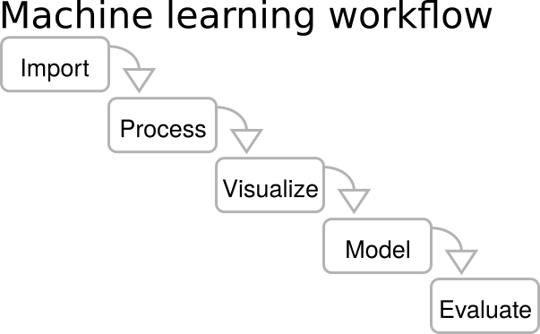

# Colorado Rewrote Its Own AI Act

_What SB 26-189 Asks of ADMT — A Compliance Guide_

## Executive Summary

> [!callout]
> In 2021, Colorado became the first of America's fifty states to pass a comprehensive AI regulation, SB 21-169. Five years later, on May 14, 2026, the same legislature rewrote that law almost from scratch. SB 26-189 was not a simple amendment but a "shrink-then-redesign." The original's sweeping Impact Assessment requirements and one-size-fits-all risk management program were effectively removed. In their place came two things: a narrower and more precise definition called **ADMT** (Automated Decision-Making Technology), and a dual-duty structure that **splits responsibility between developers and deployers**. America's first comprehensive state-level AI law has now been repositioned as "an Americanized, lightweight version of the EU AI Act."

> SB 26-189 rests on three pillars. First, ADMT is scoped to systems used in **"consequential decisions,"** meaning decisions that materially affect individuals in education, employment, housing, financial services, insurance, healthcare, or essential government services. That language alone cuts away much of the ambiguity that haunted earlier drafts. Second, borrowing from the EU AI Act's six-operator architecture, the bill assigns documentation, risk assessment, and deployer-notification duties to developers, and impact assessment, policy-making, and consumer-notification duties to deployers. Third, consumers gain three rights: **the right to an explanation, the right to correction, and the right to meaningful human review**. Yet academic research raises real doubts about whether this scaffolding can actually work. Galdon Clavell and colleagues (2025), analyzing 1.5 years of NYC Local Law 144 enforcement data, identified four traps that ADMT regulation tends to fall into: vague data requirements, missing demographic representation standards, no shared impact-measurement methodology, and weak data-quality assurance. Sele and Chugunova (2024) showed in a 292-participant experiment that "human review" raises adoption by seven percentage points but actually _lowers_ accuracy, because reviewers tend to defer to the algorithm precisely on the most inaccurate recommendations.

> About seven months remain until the January 1, 2027 effective date. During that window the Colorado Attorney General must finalize implementing rules, while roughly **6,960 tech companies** doing business in the state, plus thousands of deployers in hiring, finance, healthcare, and insurance, must build out their compliance frameworks. A single AI bias audit in the U.S. costs $5,000–$50,000; annual compliance for a single high-risk system under the EU AI Act runs about €52,000. Global AI governance spending is forecast to climb from **$492M in 2026** to over $1B by 2030 (Gartner, 2026). But the biggest barrier is not cost — it is data. When Longpre and colleagues (2023) audited 1,800 text datasets, they found that **70% had missing license information** and **50% had attribution errors**. The moment ADMT requires provenance for training data, most industry-standard datasets become non-compliant by default.

**Editor's note.** SB 26-189 marks the moment when a market for "reviewable decision infrastructure," built upward from provenance audits of training data, opens on American soil for the first time. Pebblous wrote this report because at the center of that signal sits a single variable: data quality. With seven months to go before the rule takes effect, how far can models carry the burden, and where does data hit its limits? This piece is an attempt to map that boundary.

### Key Figures

Sources: [Colorado General Assembly](https://leg.colorado.gov/bills/sb26-189), Gartner press release (Feb 17, 2026), Longpre et al. 2023 (Nature Machine Intelligence), Stanford hiring bias study (2026).

<!-- stat-card -->
**2027-01-01** — SB 26-189 Effective — ~7 months to prepare

<!-- stat-card -->
**7 Domains** — ADMT Coverage — Education, hiring, housing, finance, insurance, health, government

<!-- stat-card -->
**70% / 50%** — Dataset license missing / attribution errors — Longpre et al. (2023)

<!-- stat-card -->
**$492M → $1B** — AI governance market (2026→2030) — Gartner 2026

## From SB 21-169 to SB 26-189: A Three-Act Story

It is uncommon for a state legislature to rewrite its own law from scratch within five years. Colorado did exactly that. The same body that passed America's first comprehensive AI regulation in 2021 (SB 21-169) tried to elevate it to EU AI Act levels with SB 24-205 in 2024, then dialed it back into a more precise and lightweight form with SB 26-189 in 2026. These three acts read like a clinical record of what the United States has been learning about how to regulate AI.

*Colorado State Capitol, Denver. Three rounds of AI legislation — SB 21-169 (2021), SB 24-205 (2024), and SB 26-189 (2026) — passed through this building over five years. Source: Ken Lund, CC BY-SA 2.0*

### 1.1. The 2021 Starting Point — SB 21-169

In 2021, Colorado passed SB 21-169, the "Protecting Consumers from Unfair Discrimination in Insurance Practices" Act. Although limited to the insurance sector, it was the first state-level attempt to write into law the recognition that algorithms and predictive models can produce unfair discrimination. The statute placed an affirmative duty on insurers using External Consumer Data and Information Sources (ECDIS) along with algorithms and predictive models to demonstrate that those tools do not generate unreasonable discrimination against protected classes. The scope was narrow but the principle was unmistakable: "A decision made by an algorithm is not exempt from accountability."

### 1.2. The 2024 Expansion — SB 24-205's Ambition and Stall

In 2024, SB 24-205 (the "Colorado AI Consumer Protection Act") dramatically expanded the scope from insurance to seven core domains: education, employment, housing, financial services, insurance, healthcare, and government services. Timed to coincide with the EU AI Act's August 1, 2024 entry into force, Colorado attempted to import a full pre-deployment regulatory framework for "high-risk AI systems," including impact assessments, risk management programs, NIST AI RMF alignment, and external audits. Industry pushback was immediate and intense. The Common Sense Institute's economic impact analysis estimated that if the original SB 24-205 took effect as written, Colorado could lose **up to 30,359 jobs** and forgo **$5.5B in GDP**. (That figure applies to the original draft; SB 26-189 substantially loosened those requirements.) Governor Jared Polis ultimately delayed implementation once, and the legislature resolved to start over.

### 1.3. The 2026 Redesign — SB 26-189

Signed by Governor Polis on May 14, 2026, SB 26-189 is the product of that "shrink-then-redesign." The pre-deployment scaffolding that defined SB 24-205, including mandatory impact assessments, risk management programs, NIST RMF alignment, and external audits, has effectively been removed. Two things took its place: a narrower and more precise scope of application called ADMT, and a lightweight, transparency-first compliance structure. The Colorado AG's fiscal impact analysis estimates the government spending required to implement SB 26-189 at just **$56,000 in FY 2026-27**. That stands in sharp contrast to the billions of dollars in economic burden projected for the original SB 24-205.

One could read this shift as a retreat. From an academic perspective, however, the picture looks different. Galdon Clavell and González-Sendino (2025), analyzing 1.5 years of NYC Local Law 144 enforcement data, diagnosed the traps that broadly-defined ADMT regulation tends to fall into. Colorado appears to have studied that experience. Narrowing the scope to "consequential decisions" is less a weakening of protection than a sharpening of focus. Rather than trying to regulate every form of automation — and ending up regulating none of it because the rules are too vague — the new bill concentrates on decisions that genuinely shape people's lives.

### 1.4. Timeline: 2021 → 2027 (and Beyond)

Viewed side by side, the three acts reveal the learning curve U.S. AI legislation has traveled.

| When | Law | Key Change |
| --- | --- | --- |
| 2021 | SB 21-169 | Insurance-only ban on algorithmic discrimination. Establishes the principle that "algorithmic decisions are subject to accountability." |
| 2024 | SB 24-205 | Expansion to seven domains. Attempt to introduce EU AI Act–level pre-deployment regulation (impact assessment, RMF alignment, external audit). Implementation postponed after industry pushback. |
| 2026-05-14 | SB 26-189 signed | Pre-deployment scaffolding removed. ADMT definition tightened, developer-deployer split introduced, three consumer rights added. Post-hoc transparency model. |
| 2026-08-12 | Technical effective date | Statute itself takes effect; substantive compliance duties begin January 1, 2027. |
| 2027-01-01 | Substantive compliance | Developer and deployer duties, consumer rights, and AG enforcement become fully operative. |
| 2030-01-01 | Cure period ends | The 60-day cure period for violations expires. Penalties can apply immediately thereafter. |

Notably, SB 26-189 is not just Colorado's story. In 2025 alone, 38 U.S. states adopted AI-related bills, and as of March 2026 a cumulative 1,561 AI legislative proposals had been introduced across the U.S. states. (A separate breakdown of U.S. state-level AI chatbot laws can be found in our companion post ["U.S. State AI Chatbot Regulations 2026"](/blog/us-state-ai-chatbot-laws-2026/).) Within this layered legislative landscape, SB 26-189 is the most comprehensive case to date, and is likely to become a reference model that other states consult as they write their own laws.

> [!callout]
> SB 26-189's message is simple: an AI regulation that is "narrow but workable" is more useful than one that is "broad but ambiguous." If there is one lesson Colorado took from the NYC LL144 enforcement experience, it is exactly that line.

## What Is ADMT? — Scope and Definitions

The most important word in SB 26-189 is ADMT, short for Automated Decision-Making Technology. But the word matters less than where its boundary sits. NYC LL144 drifted for 1.5 years in part because its definition of "AEDT" (Automated Employment Decision Tool) was unclear; Colorado consciously tried to avoid that trap. Understanding what ADMT does and does not cover is the starting point for any compliance strategy.

*Machine learning workflow: data import → processing → visualization → modeling → evaluation. ADMT regulation applies when this pipeline's outputs materially influence a "consequential decision" about an individual. Source: Brylie Christopher Oxley, CC0*

### 2.1. Five Components of ADMT

By statute, ADMT is a technology that satisfies all five of the following criteria. First, it processes personal data. Second, that processing produces decision-relevant outputs — predictions, recommendations, classifications, rankings, or scores. Third, those outputs materially influence a decision about an individual. Fourth, that decision qualifies as a "consequential decision." Fifth, simple automation (spam filters, firewalls, calculators, generic search) is excluded. Miss any one of these five elements and the system is not ADMT.

### 2.2. "Consequential Decision" — Seven Covered Domains

SB 26-189 defines a "consequential decision" as a decision in one of the following seven domains that produces a legal or similarly significant effect on an individual.

| Domain | Representative Decisions | Current AI Adoption |
| --- | --- | --- |
| Education | Admissions, financial aid, learning-track placement | Steady growth across higher education |
| Employment | Resume screening, interview scoring, promotion | 99% of the Fortune 500 (Novoresume 2026); 67% overall (DemandSage 2026) |
| Finance & Lending | Credit scoring, loan approval, interest-rate pricing | Credit scoring market $10.29B (2025) → $46.22B (2034) |
| Government Services | Public benefits eligibility, social service allocation | Highly variable across states; numerous reports of automated denials |
| Healthcare | Diagnostic support, patient triage, treatment recommendation | 80% of hospitals (Docus.ai 2025); 66% of physicians use AI tools |
| Housing | Tenant screening, sale approval, rent setting | Rapid expansion of tenant screening tools |
| Insurance | Underwriting, premium setting, claims review | Already covered under SB 21-169 |

### 2.3. Exclusions — Simple Automation and Carve-Outs

Several categories of technology are intentionally excluded from ADMT. Spam filters, firewalls, generic search and autocomplete, basic database lookups, and calculators are not ADMT. What unites them is that they do not "materially influence a decision about an individual." Beyond that, FDA-regulated medical devices, HIPAA-covered entities using ADMT for non-employment purposes, and credit decisions made in compliance with FCRA or ECOA qualify for "deemed compliance" — existing federal regulation is taken as sufficient. The crucial exception: AI used in employment decisions is not eligible for those carve-outs.

There is also a small-employer exemption. Deployers with **40 or fewer employees** are generally excluded from the requirements. This functions much like the EU AI Act's proportionality regime for SMEs and reflects an American preference for practical thresholds. Colorado has an estimated 2,960 tech companies with 10 or more employees and 66 with 500 or more; once ADMT deployers in the seven covered domains are added, the number of businesses directly within scope reaches the thousands.

### 2.4. "Is My Company an ADMT Deployer?" — A 30-Second Checklist

> [!callout]
> If all five of the following are true, your company is an ADMT deployer under SB 26-189:

- 1. You do business affecting Colorado consumers (residents).
- 2. You have more than 40 employees (with some exceptions).
- 3. You make decisions in one of the seven domains — education, employment, housing, finance, insurance, healthcare, or government services.
- 4. You materially use the output of an algorithm, AI, or predictive model in those decisions.
- 5. Those decisions have a legal or otherwise significant effect on individuals (consequential decision).

Academic critique remains. Probabilistic Risk Assessment for AI (arXiv 2504.18536) argues that binary definitions of "high-risk systems" have inherent limits and that regulation must shift from capability thresholds to actual harm estimation. SB 26-189's ADMT definition still rests on the binary question of "is this ADMT or not?" Yet the same system may produce material impact in one context and trivial impact in another. A uniform classification can invite avoidance strategies. How the Colorado AG's implementing rules handle these gray zones is the first item on the regulatory watch list.

## Developer vs. Deployer — A Dual Responsibility Framework

The second pillar of SB 26-189 is the separation of responsible parties. Compared with the EU AI Act, which distinguishes six operator categories (provider, deployer, importer, distributor, and more), Colorado's structure is simpler. Even so, this is the first time a U.S. state-level AI law has separated roles at this granularity. Developers and deployers carry different obligations, and which side of the line a company sits on determines its compliance cost and risk exposure.

### 3.1. Side-by-Side: Developer vs. Deployer Duties

Placing the two roles next to each other clarifies how responsibility is distributed.

| Duty | Developer | Deployer |
| --- | --- | --- |
| Technical Documentation | Training data categories, known limits and risks, usage guidance | System usage policy and applied use cases |
| Risk Assessment | Evaluate intrinsic system risks and mitigations | Impact assessment for the deployment context |
| Notification | Notify deployers of significant updates | Provide pre-use ADMT notice to consumers |
| Adverse-Outcome Disclosure | (No direct duty) | Detailed disclosure within 30 days |
| Consumer-Rights Response | (Assist deployer on request) | Handle explanation, correction, and human-review requests |
| Contractual Shift | Some duties may be transferred by contract | Consumer notice and human-review duties are non-transferable |

****

### 3.2. "Which Side Are You On?" — Scenario Guide

In practice, the distinction is rarely clean. A SaaS vendor is typically a developer. A hiring company that uses that SaaS in its recruiting workflow is a deployer. But what about a deployer that fine-tunes the vendor's base model with its own data? The EU AI Act treats "substantial modification" as a trigger that automatically promotes a deployer into provider (developer) duties. Whether SB 26-189 will adopt the same rule is a key question for the implementing regulations — and one with major implications for the U.S. SaaS market.

### 3.3. Academic Lens — The Reviewable ADM Framework

Cobbe and colleagues (2021) describe automated decision-making as a "socio-technical process." Responsibility, in their account, does not attach to a single model but to record-keeping across the entire system. For the developer-deployer split to mean something, snapshots of the data, model version, and score decomposition at the moment of decision must be preserved somewhere. Answering "what data fed into this decision" within thirty days requires that infrastructure. Most AI systems in production today do not have it.

Lam and colleagues (2024) push the point further. Drawing on financial-audit models, they propose a criterion-audit framework in which auditing firms, audited entities, standards bodies, and certification bodies form a network. The implication for SB 26-189 is straightforward: both developers and deployers may eventually require external audits. Today the statute leans on post-hoc transparency, but the cost trajectory of the EU AI Act — €52,000 per high-risk system per year — suggests that comparable audit burdens could enter the U.S. market over time.

> [!callout]
> As recent work on EU AI Act subject roles (arXiv 2510.13591) shows, the developer-deployer divide is not a "static role" but a "dynamic transformation." A deployer that fine-tunes a model on proprietary data, or that otherwise substantially modifies the system, can be promoted into developer duties. How Colorado's implementing rules define "substantial modification" is the single most important watch-list item for this section.

## Three Rights for Consumers

With pre-deployment regulation pared back, SB 26-189 fills the gap with post-hoc consumer rights. An individual who receives an adverse decision gains three rights: the right to an explanation, the right to correction, and the right to meaningful human review. The model echoes GDPR Article 22, but this is the first time a U.S. state has codified such a triad for ADMT specifically. Academic literature, however, is skeptical about whether these rights can actually work as written.

*The EU's General Data Protection Regulation (GDPR). SB 26-189's trio of rights — explanation, correction, and human review — borrows from GDPR Article 22 on automated individual decision-making, marking the first time a U.S. state has enacted this framework for ADMT. Source: TheDigitalArtist, CC0*

### 4.1. Right to Explanation

A consumer who receives an adverse outcome may request a meaningful explanation of what role the ADMT played in that decision and which data and factors were used. A bare statement that "the AI system made the decision" is not enough.

The trouble is that "meaningful explanation" means different things in different domains. Fresz and colleagues (2024) show that GDPR, the AI Act, product safety law, and fiduciary duty each demand different properties from explainable AI (XAI). A hiring explanation must let a candidate see which part of their record counted against them; a lending explanation must spell out which credit factors drove the decision; a medical explanation must surface the clinical reasoning. A single SHAP or LIME output cannot satisfy all of these. ADMT deployers will need to build domain-specific explanation infrastructure rather than buying a one-size-fits-all interpretability tool.

### 4.2. Right to Correction

If factually inaccurate personal data was used in a decision, the consumer may request correction. The structure echoes GDPR Article 16, but in the ADMT context the right to correction presupposes the ability to trace data provenance. If you cannot answer "which data fed into this decision," you cannot honor a request to "correct that data."

Operationally, the right to correction demands data lineage infrastructure. Tracing precisely which batch of training data contributed to which weight in a model remains nearly impossible with current industry tooling. But the deployer-level question of "what input data entered the system at the moment of this decision" is answerable with proper logging. The implementing regulations will need to clarify how the two layers of correction — training-data lineage and inference-time logging — are distinguished and enforced.

### 4.3. Right to Meaningful Human Review

This is both the most important and the most contested right. A consumer may request that a person with the authority to modify or reverse the decision review it. The statute is explicit that this must be "meaningful human review," not merely a rubber-stamp.

Empirical research, however, suggests the right may not work the way intuition predicts. In a 292-participant experiment, Sele and Chugunova (2024) measured what happens when humans review automated recommendations. The findings cut two ways. First, system uptake rose by **seven percentage points** — people trusted the process more when a human was in the loop. Second, decision accuracy actually _fell_. Reviewers tended to avoid intervening in the worst recommendations, deferring to the algorithm precisely when override would have helped most. Automation bias short-circuited critical human review.

This is a warning sign for SB 26-189. Without sufficient context (the data, model version, and score decomposition at the moment of decision), sufficient time, and meaningful incentives tied to review quality, human review can collapse into click-through approval. This is precisely the failure mode that the reviewability framework of Cobbe and colleagues (2021) is built to prevent.

### 4.4. Why These Rights Matter — The Data of Bias

The social justification for the three rights is not abstract principle but measured discrimination. A May 2026 Stanford study reported by Fortune found that AI hiring algorithms penalize Black applicants by **over 25%**. A 2025 University of Washington study found that AI hiring tools preferred resumes with white-associated names 85% of the time, versus 9% for Black-associated names — an extreme bias. In credit scoring, women have been observed to receive scores 6 to 8 points lower than men on average (MDPI 2025). A 2024 Nature analysis of six LLMs confirmed gender bias in all six.

And one more data point. According to a 2024 Gallup survey, only **about 33%** of employees know that their employer uses AI in employment decisions. People cannot exercise rights to explanation, correction, or human review for decisions they do not know AI is involved in. That is why SB 26-189's pre-use notice requirement is foundational rather than ornamental.

> [!callout]
> Codifying the three rights is a beginning, not an end. Buijsman and Veluwenkamp (2025) argue that impact assessment reports lose meaning unless they explicitly state which conception of fairness — Rawlsian, solidaristic, or causal — has been adopted. The second item on the watch list is whether Colorado's implementing rules will spell out a minimum standard for "meaningful human review," a domain-specific standard for "meaningful explanation," and a workable boundary for the right to correction.

## Compliance Costs and a 7-Month Roadmap

About seven months remain until January 1, 2027. What an ADMT deployer needs to build in that window is not just a policy document. It is an impact assessment process, a 30-day adverse-outcome disclosure workflow, a consumer-rights response infrastructure, and, above all, a record-keeping system capable of answering questions about data provenance. Cost and timeline have to be planned together.

### 5.1. Penalties and Enforcement Structure

*Colorado Springs Municipal Court. Under SB 26-189, enforcement authority rests exclusively with the Colorado Attorney General — there is no private right of action for affected consumers. Source: David Shankbone, CC BY-SA 3.0*

Violations of SB 26-189 carry penalties of up to **$20,000 per violation**, rising to **$50,000** when the victim is a senior citizen. Enforcement is exclusive to the Colorado Attorney General; there is no private right of action, so consumers cannot sue deployers directly but must instead route complaints through the AG's office. Through January 1, 2030, deployers receive a **60-day cure period** after AG notice and can avoid penalties by remedying the violation within that window (the cure period does not apply to willful or repeated violations).

Compared with the EU AI Act's ceiling of €35M or 7% of global turnover, Colorado's penalties are mild. Yet by closing off class-action exposure and concentrating enforcement in the AG's office, the statute makes the office's resources and political will the central determinant of how seriously SB 26-189 actually bites.

### 5.2. Compliance Costs — Market Data

Several reference data points help frame what compliance is likely to cost.

| Cost Item | Range | Source |
| --- | --- | --- |
| AI bias audit (per audit) | $5,000 – $50,000 | U.S. market average |
| AI compliance training (per employee/year) | $2,000 – $5,000 | U.S. market average |
| EU single high-risk system (annual) | €52,000 (~$57,000) | EU AI Act implementation data |
| New QMS build (one-time) | €193,000 – €330,000 | EU enterprise average |
| Large enterprise initial investment ($1B+ revenue) | $8M – $15M | U.S. large-enterprise average |
| U.S. compliance failure losses (2025) | $4.4B | U.S. market aggregate |

Gartner projects the global AI governance market to grow from $492M in 2026 to over $1B by 2030. The global RegTech market is expanding from $24.34B in 2025 to $112.10B by 2033 (CAGR 21.1%), and AI in RegTech specifically is growing from $2.57B in 2025 to $3.51B in 2026 (CAGR 36.7%). Add the three together and the compliance-infrastructure market sits at roughly $35B in 2025, on track for $140B+ by 2033.

### 5.3. A Seven-Month Roadmap

Translated into operational steps, here is what an ADMT deployer should be doing between now and January 2027.

| Stage | Target Date | Key Work |
| --- | --- | --- |
| 1. Inventory | T-7 months (now) | Identify which of your systems qualify as ADMT. Map them to the seven domains. |
| 2. Developer/Deployer Classification | T-6 months | Clarify the role of in-house, vendor, and SaaS components. Review contracts. |
| 3. Data Provenance Audit | T-5 months | Document training and operational data lineage. Check licenses and attribution. |
| 4. Impact Assessment | T-4 months | Draft risk, mitigation, and impact reports for each ADMT. |
| 5. Workflow Build-Out | T-3 months | Design the pre-use notice, 30-day disclosure, and consumer-rights response processes. |
| 6. Human Review Infrastructure | T-2 months | Appoint and train reviewers. Build the snapshot-at-decision retention system. |
| 7. Mock Run | T-1 month | Simulate consumer-rights requests; measure response-time performance. |
| 8. Effective Date | T-0 (2027-01-01) | Substantive compliance duties begin. |

### 5.4. Lessons from the NYC LL144 Failure — Traps to Avoid

Galdon Clavell and González-Sendino (2025) analyzed 1.5 years of enforcement data from NYC Local Law 144, the law mandating audits of AI employment-decision tools, and distilled four practical gaps from their work building the compliance-automation tool ITACA_144.

- 1.**Vague data requirements.** It was never clear which data should be retained or in what format, so deployers interpreted the requirement differently.
- 2.**Missing demographic representation standards.** There was no shared baseline for which demographic groups to include in samples or in what proportions, making audit results incomparable.
- 3.**No impact-measurement methodology.** With no standard way to quantify bias, the same system produced different audit verdicts depending on the auditor.
- 4.**Weak data-quality assurance.** The data being audited was itself unverified, undermining the credibility of every conclusion drawn from it.

A separate Ada Lovelace Institute report by Groves and colleagues (2024) identified four root causes of NYC LL144's "failure to establish an effective audit regime." How Colorado's implementing rules avoid those same traps will determine whether SB 26-189 actually works.

> [!callout]
> "The expensive thing is not compliance — it is failure." In 2025 alone, U.S. compliance failures led to $4.4B in losses. SB 26-189's $20,000-per-violation cap may sound modest, but the moment thirty-day disclosure obligations get missed at scale, the aggregate add up to a serious number even without class-action exposure. And the reputational cost of being labeled "ADMT non-compliant" in the market is a separate, harder-to-measure burden of its own.

## Three AI Laws Compared — Colorado, EU, and Korea

Read in isolation, SB 26-189 looks like a U.S. state matter. Place it on the global AI governance map and a different picture emerges. The EU AI Act came into force in August 2024 and is heading toward full enforcement of its high-risk provisions in August 2026. Korea passed its AI Basic Act in January 2026. Comparing the three is practical, not academic — Korean companies running ADMT in Colorado, and U.S. companies expanding into Korea, both have to live inside the same overlap.

### 6.1. Three-Way Comparison Across Eight Dimensions

| Dimension | Colorado SB 26-189 | EU AI Act | Korea AI Basic Act |
| --- | --- | --- | --- |
| Effective Date | 2027-01-01 | 2026-08-02 (high-risk) | 2026-01-22 + 1-year grace |
| Legislative Unit | U.S. state | EU (27 member states) | National |
| Regulatory Philosophy | Harm-based (consequential decision) | Risk-based (4 tiers) | High-impact AI + Generative AI |
| Operator Structure | Developer + Deployer | 6 categories (provider et al.) | Single business operator |
| Impact Assessment | Deployer impact assessment + policy | Fundamental Rights IA (FRIA, Art 27) | Risk management plan |
| Consumer Rights | Explanation, correction, human review | Right to explanation + remedies | Pre-use notice + AI generation label |
| Penalties | Up to $20,000/violation ($50,000 for seniors) | €35M or 7% of global turnover | Administrative fines + grace period |
| Exemptions | Deployers with ≤40 employees + some domains | Proportionality for SMEs | Standards still being finalized |

### 6.2. Philosophical Differences — Risk vs. Harm vs. Hybrid

The deepest difference among the three regimes is what they choose to regulate. The EU AI Act takes a risk-based approach: it classifies AI systems themselves into four tiers of intrinsic risk and applies obligations across the entire lifecycle (development, deployment, operation) of high-risk systems. Colorado's SB 26-189 is closer to a harm-based approach: it focuses less on the system itself and more on the "consequential" character of the decision the system informs. Korea's AI Basic Act is a hybrid: it carves out "high-impact AI" and "generative AI" as separate categories and combines post-hoc disclosure duties with pre-deployment risk management.

The operational implication is concrete. In the EU, obligations trigger when "the system itself is classified as high-risk." In Colorado, obligations trigger when "the decision is consequential and sits in one of the seven domains." In Korea, obligations trigger when "the system is high-impact AI or generative AI." The same system can carry different obligations under each regime.

### 6.3. The Triple-Compliance Scenario for Korean Companies

A Korea-based company offering ADMT services in Colorado and operating in the EU must comply with all three regimes simultaneously. The Korean AI Basic Act's pre-use notice and AI-generation labeling for high-impact AI, Colorado SB 26-189's three consumer rights, and the EU AI Act's Fundamental Rights Impact Assessment (FRIA) along with its roughly €52,000-per-system annual compliance cost — all of these run in parallel.

Gartner predicts that fragmented AI regulation will quadruple by 2030, extending to cover 75% of the global economy. A compliance strategy designed around a single jurisdiction will leave gaps in any multinational deployment. SB 26-189 is one piece of that global governance landscape — and a reference point that other U.S. states are likely to consult when drafting their own laws.

> [!callout]
> "Colorado is just following Europe" is too simple a story. Distilling the EU's six operator categories down to two (developer and deployer), substituting harm-based scope for risk-based tiers, and replacing €35M fines with $20,000 administrative penalties are deliberate choices to Americanize and lighten the model. Those same choices are why the Colorado approach is positioned to spread across other U.S. states.

## Why Pebblous Watches This — Data Provenance Becomes the Evidence Layer

SB 26-189 should be read as a law about data, not a law about models. For the right to explanation to mean anything, a deployer must be able to answer "what data went into this decision." For the right to correction to mean anything, the deployer must be able to point to which input data should be changed. For the right to human review not to collapse into formality, reviewers must be handed the data, model version, and score decomposition at the moment of decision. All three rights stand on a single foundation: data provenance infrastructure.

### 7.1. Today's Datasets Are Already Non-Compliant

When Longpre and colleagues (2023) audited 1,800 text datasets, they found something startling: **more than 70% had missing license information and more than 50% had attribution errors**. A large share of industry-standard datasets cannot answer the question of where their data came from. A follow-up paper by Longpre and colleagues (2024), analyzing 4,000 datasets across 608 languages, 798 sources, 659 organizations, and 67 countries, showed that since 2019 multimodal training has come to depend on web-crawled, synthetic, and YouTube-derived content — making provenance tracing effectively impossible at the field level.

The implication is direct. The moment ADMT requires provenance for training data, most industry-standard datasets are non-compliant by default. If SB 26-189's impact assessment asks about data lineage, and the 30-day disclosure asks "which data shaped this decision," that 70% license-missing rate converts instantly into compliance risk.

### 7.2. Five Ways DataClinic Feeds into Impact Assessment

Pebblous's DataClinic is built to diagnose the input data feeding ADMT systems. Its outputs map directly onto the core requirements of an SB 26-189 impact assessment report.

- 1.**Data lineage map.** Document the sources, collection dates, and movement paths of training and operational data in traceable form. A direct answer to the 70% license-missing problem flagged by Longpre and colleagues.
- 2.**Bias diagnostics.** Automated measurement of data bias against protected classes — race, gender, age. The kind of analysis that surfaces patterns like Stanford's 25%+ Black-applicant penalty before they become enforcement events.
- 3.**License and attribution checks.** Verify license compatibility, redistribution rights, and credit trails for training data. Organized so that compliance auditors get immediate, answerable artifacts.
- 4.**Missing-value and outlier analysis.** Quantify which data patterns are absent and which outliers materially affected model decisions. Usable as direct support for consumer correction requests.
- 5.**Sample representativeness checks.** A direct response to the demographic representation gap Galdon Clavell identified — the same gap where NYC LL144 failed.

### 7.3. AI-Ready Data and ADMT Compliance Are the Same Shape

Pebblous defines AI-Ready Data along five dimensions: accuracy, completeness, consistency, provenance, and bias-awareness. Those dimensions map almost one-to-one onto the inputs that an SB 26-189 impact assessment requires. Accuracy and completeness support the factual basis of decisions. Consistency makes decisions traceable across time. Provenance is the infrastructure on which the rights to explanation and correction stand. Bias-awareness is what an anti-discrimination assessment is testing.

As Cobbe and colleagues (2021) argue, ADM is a socio-technical process. Accountability does not attach to a single model but to record-keeping across the entire system. The hardest part of that record-keeping is preserving data lineage. DataClinic's diagnostic reports are designed in a format that can serve as the first chapter of an impact assessment report.

### 7.4. Open Questions to Explore

This report leaves several questions deliberately open. How will Colorado's implementing rules avoid the four traps that NYC LL144 stumbled into over 1.5 years of enforcement — vague data requirements, missing demographic standards, no shared measurement methodology, weak data-quality assurance? How will the explicit fairness-concept statement that Buijsman and Veluwenkamp call for be incorporated into impact assessment reports? How will the automation bias documented by Sele and Chugunova be designed out of human-review workflows? These are the questions that will decide whether SB 26-189 actually works — and they all live in the territory that data-quality infrastructure has to answer for.

> [!callout]
> "The first gate of Colorado ADMT compliance is not the model — it is the data." That single sentence is the conclusion of this report. Model interpretability is the second problem; the provenance, licensing, and bias of the data the model learned from is the first. The infrastructure U.S. companies need to build in the next seven months and the infrastructure Korean companies need to compete in global markets sit in the same place.

## Frequently Asked Questions

Below are ten questions readers raise most often about SB 26-189: effective date, the precise definition of ADMT, covered domains, the developer vs. deployer split, the practicality of consumer rights, penalties, how it differs from SB 24-205, the role of data quality, exemptions, and the impact on Korean companies. Compliance design starts with a clear answer to "what applies, to whom, and starting when."

## References

### Academic Papers

- 1.Cobbe, J., Lee, M. S. A., & Singh, J. (2021). "Reviewable Automated Decision-Making: A Framework for Accountable Algorithmic Systems." _FAccT '21_. [arxiv.org/abs/2102.04201](https://arxiv.org/abs/2102.04201)
- 2.(2025). "Subject Roles in the EU AI Act: Mapping and Regulatory Implications." _arXiv preprint_. [arxiv.org/abs/2510.13591](https://arxiv.org/abs/2510.13591)
- 3.Buijsman, S., & Veluwenkamp, H. (2025). "Measuring the right thing: justifying metrics in AI impact assessments." _arXiv preprint_. [arxiv.org/abs/2504.05007](https://arxiv.org/abs/2504.05007)
- 4.Longpre, S., Mahari, R., Chen, A., & Hooker, S. (2024). "The Data Provenance Initiative: A Large Scale Audit of Dataset Licensing & Attribution in AI." _Nature Machine Intelligence_. [arxiv.org/abs/2310.16787](https://arxiv.org/abs/2310.16787)
- 5.Longpre, S. (2024). "Bridging the Data Provenance Gap Across Text, Speech, and Video." _arXiv preprint_. [arxiv.org/abs/2412.17847](https://arxiv.org/abs/2412.17847)
- 6.Galdon Clavell, G., & González-Sendino, R. (2025). "What we learned while automating bias detection in AI hiring systems for compliance with NYC Local Law 144." _arXiv preprint_. [arxiv.org/abs/2501.10371](https://arxiv.org/abs/2501.10371)
- 7.Groves, L., Metcalf, J., Kennedy, A., Vecchione, B., & Strait, A. (2024). "Auditing Work: Exploring the New York City algorithmic bias audit regime." _FAccT '24_. [arxiv.org/abs/2402.08101](https://arxiv.org/abs/2402.08101)
- 8.Lam, K., Lange, B., Blili-Hamelin, B., Davidovic, J., Brown, S., & Hasan, A. (2024). "A Framework for Assurance Audits of Algorithmic Systems." _FAccT '24_. [arxiv.org/abs/2401.14908](https://arxiv.org/abs/2401.14908)
- 9.Fresz, B., Dubovitskaya, E., Brajovic, D., Huber, M., & Horz, C. (2024). "How Should AI Decisions Be Explained? Requirements for Explanations from the Perspective of European Law." _arXiv preprint_. [arxiv.org/abs/2404.12762](https://arxiv.org/abs/2404.12762)
- 10.Sele, D., & Chugunova, M. (2024). "Putting a human in the loop: Increasing uptake, but decreasing accuracy of automated decision-making." _PLOS ONE_. [DOI: 10.1371/journal.pone.0298037](https://journals.plos.org/plosone/article?id=10.1371/journal.pone.0298037)

### Legislation and Policy Documents

- 11.Colorado General Assembly. (2026-05-14). "[SB 26-189: Concerning Consumer Protections in Interactions with Artificial Intelligence Systems](https://leg.colorado.gov/bills/sb26-189)." Signed by Governor Polis; effective January 1, 2027.
- 12.European Union. (2024-08-01). "[Regulation (EU) 2024/1689 on Artificial Intelligence (EU AI Act)](https://artificialintelligenceact.eu/)." _Official Journal of the European Union_.
- 13.National Assembly of the Republic of Korea. (2026-01-22). "[Framework Act on the Development of Artificial Intelligence and the Establishment of a Foundation of Trust (Korea AI Basic Act)](https://www.law.go.kr/lsInfoP.do?lsiSeq=268543)."

### Industry Reports and Market Data

- 14.Gartner. (2026-02-17). "[Gartner Forecasts AI Governance Spending to Exceed $1 Billion by 2030](https://www.gartner.com/en/newsroom/press-releases/2026-02-17-ai-governance-forecast)." _Gartner Newsroom_.
- 15.Common Sense Institute Colorado. (2025-08). "[Economic Impact Analysis of Colorado SB 24-205](https://commonsenseinstituteco.org/sb24-205-economic-impact/)." (Based on the original SB 24-205 draft; not applicable to SB 26-189 figures.)
- 16.Fortune. (2026-05-26). "[Stanford Study: AI Hiring Algorithms Penalize Black Applicants by Over 25%](https://fortune.com/2026/05/26/ai-hiring-bias-stanford-study/)."
