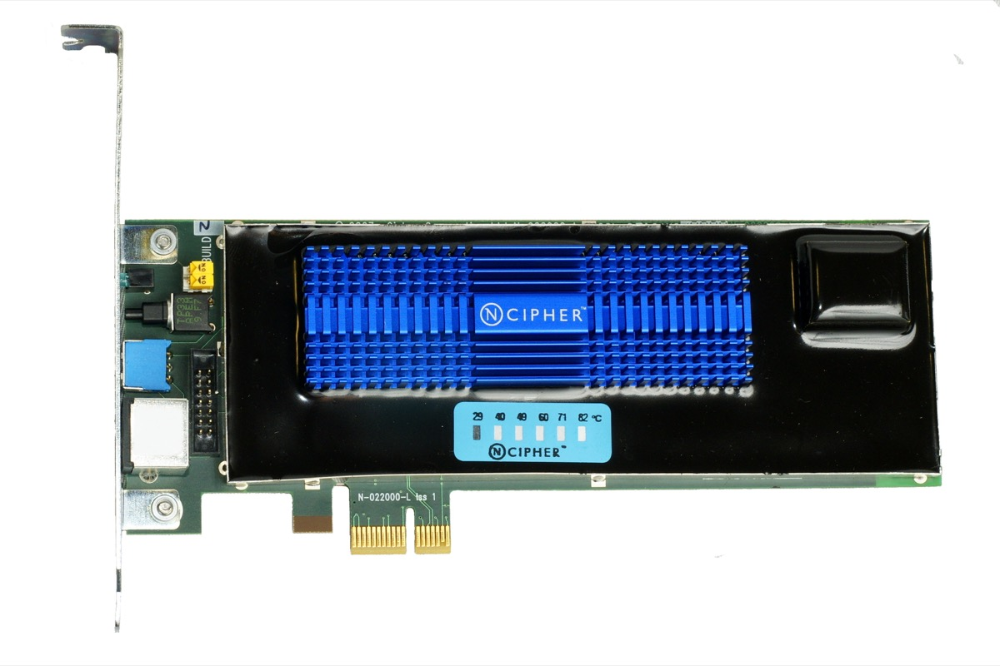
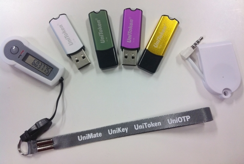

# It Wasn

_Six questions a record $431M fine puts to every IT company that handles data_

## Executive Summary

> [!callout]
> On June 11, 2026, South Korea's Personal Information Protection Commission (PIPC) levied the largest fine in its history against a major online platform. But the weight of this case does not lie in the number. It lies in a single sentence the regulator nailed to its decision. **"This incident was not caused by sophisticated hacking, but by the absence of basic safeguards and a failure of management."** This report takes that one sentence as its starting point — not to put a single company on trial, but because everyone who handles data is standing in front of the same mirror.

> A former employee, holding an authentication signing key obtained before leaving, forged access tokens and quietly extracted member data for roughly seven months without being caught. During that time, 44 million tokens minted for members who did not even exist knocked on the system's door — and that signal was never detected. A key that could be read in plaintext, a secret never revoked from a departed employee, credentials that were never rotated, access control with no thresholds. None of it was a flashy zero-day. All of it was a lapse in the fundamentals.

> We break this case into six violations — signing keys, access control, breach notification, CPO independence, data destruction, and logs-and-consent — explain each in engineering terms, and map them one by one onto NIST, OWASP, and South Korea's Personal Information Protection Act (PIPA). Then we turn that mapping back into a checklist that any organization can apply to its own systems today. Data you never held cannot leak; a key that rotates is soon worthless even if stolen; an immutable log can testify to the scope of an incident. The questions converge into one: where, right now, are our keys, our logs, our consent?

<!-- stat-card -->
**$431M** — Record fine (South Korea) — KRW 624.6B · PIPC resolution

<!-- stat-card -->
**~37.55M** — Data subjects affected — 33.22M members + 4.33M non-members

<!-- stat-card -->
**148 million** — Undetected accesses (delivery) — abnormal traffic via 16 IPs

<!-- stat-card -->
**~7 months** — Breach undetected — Apr–Nov 2025

## What Happened: An Objective Reconstruction

Emotion aside, here are the confirmed facts. On June 11, 2026, the PIPC imposed on Coupang a fine of KRW 624.68 billion (about $431M), an administrative penalty of KRW 16.8 million (~$11.6K), and corrective and disclosure orders. Its affiliate Coupang Fulfillment Services (CFS) received an additional fine of KRW 248 million (~$171K). The $431M figure splits into two strands: a violation of personal-data safeguards (about KRW 423.5 billion, ~$292M) and the collection of activity records without data-subject consent (about KRW 201.1 billion, ~$139M).

The number of data subjects affected is roughly 37.55 million. By account, about 33.22 million were members and at least about 4.33 million were non-members. The exposed items included names, email addresses, delivery details (recipient name, phone, address, building-entrance access codes), and order history. The delivery records contained information not only about members themselves, but in many cases about third parties such as family members or acquaintances. In other words, there were people who were not Coupang members at all yet had their information leak from inside someone else's delivery address book.

### 1.1. How the Attack Unfolded

The perpetrator was not an unknown external hacker. It was a former employee who had personally built Coupang's alternative (backup) authentication system. When they left the company at the end of 2024, they retained the authentication signing key, and used it to mint forged authentication tokens — querying the member-information edit, delivery-address management, and order-list pages one after another to extract data. From the system's point of view, these tokens were properly signed and therefore "genuine." The timeline below is reconstructed from the PIPC decision and contemporaneous reporting.

| When | Event |
| --- | --- |
| Dec 2024 | The authentication-system developer leaves. They retain the signing key; access rights are not revoked. |
| Jan 2025 | Access begins — believed to be testing whether the forged tokens work. |
| Apr–Jun 2025 | About 148 million accesses to delivery-address pages via 16 IPs. |
| Jun–Oct 2025 | Querying expands to member-information pages. |
| Nov 2025 | A blackmail complaint triggers awareness of the incident — the first detection, about seven months in. |
| Jan–Feb 2026 | After learning of an additional leak (about 160,000 people), notification is sent past the statutory 72 hours. |
| Jun 11, 2026 | The PIPC resolves to impose its largest-ever fine. |

The heaviest cell in this timeline is "about seven months." During that span, 148 million abnormal accesses piled up, and 44 million forged tokens minted for non-existent member numbers passed authentication. By any standard these were signals loud enough to "see," yet the system never registered them as a scream.

> [!callout]
> The PIPC's conclusion compresses into a single sentence. **"This incident was not caused by sophisticated hacking, but by the absence of basic safeguards and a failure of management."** What makes that sentence important is not the assigning of blame. If the cause was not a flashy zero-day but a lapse in fundamentals — keys, destruction, logs, consent — then the same risk lies latent in any organization, regardless of size or industry.

*▲ Personal data breach concept: an unlocked padlock amid flowing data | Source: [Blogtrepreneur via Wikimedia Commons (CC BY 2.0)](https://commons.wikimedia.org/wiki/File:Data_Security_Breach_(29723649810).jpg)*

## The Violations the PIPC Named, in Engineering Terms

The violations the PIPC resolved on fall broadly into six strands. Each one reads in the same order: what happened → why it's dangerous → what the canonical practice is. Only that order moves us from blame to inspection. The map below sets out how the six violations connect to engineering standards and legal provisions, all in one view.

| Violation | PIPA | Engineering standard / CWE | Canonical practice |
| --- | --- | --- | --- |
| Signing key in plaintext, unrotated, not revoked on departure | Art. 29 (safeguards) | NIST SP 800-57, OWASP Secrets Mgmt, CWE-321/798 | HSM/KMS storage · scheduled + event rotation · immediate revocation |
| Lax access control; 44M forged tokens undetected | Art. 29 (safeguards) | NIST SP 800-207/92, CWE-347/294, ATT&CK T1078 | Token existence checks · anomaly detection · automatic threshold blocking |
| Notification past 72 hours; non-members never notified | Art. 34 (notification) | cf. GDPR Art. 33 (72h) | 72-hour notification playbook · system to trace non-members |
| CPO obstructed from acting independently | Art. 31 (CPO) | GDPR Art. 37–39 DPO independence | Real CPO authority · veto power · seat at decisions |
| Failure to destroy data (2.46M withdrawn members · 310K accounts) | Art. 21 (destruction) | NIST SP 800-88, crypto-shredding | Automatic destruction · synced destruction of copies/derivatives |
| Logs tampered with; activity records collected without consent | Art. 63 · Art. 15 | CWE-778, ATT&CK T1070, WORM | Immutable logs · legal hold · identifier = personal data |

### 2.1. The Signing Key: One Master Key Was Everything

Coupang's token authentication granted access on the strength of a digital-signature check alone. If the signature was valid, the request passed — and the key that produced that signature was, in effect, the master key. Leak that one key, and the doors to every member account swing open at once: a single point of failure by design. On top of that, the signing key could be read in plaintext even when there was no business need, and after the employee who had access to it left, the key was neither rotated nor revoked.

An authentication signing key is a secret on the order of a master key. The canonical practice comes down to four points. First, forbid plaintext exposure and store it in an HSM or KMS, decrypting only at the moment of use. Second, separate read permissions to enforce least privilege. Third, run scheduled rotation and event-driven rotation together. Fourth, revoke it immediately on departure or role change. Drop any one of these, and "the one person who knows the key" can open everything. NIST SP 800-57 and the OWASP Secrets Management Cheat Sheet codify the same principles, and plaintext or hardcoded credentials are classified among the most dangerous weaknesses as CWE-321 and CWE-798.

*▲ nCipher nShield F3 Hardware Security Module (HSM) — a dedicated device that stores cryptographic credentials without plaintext exposure, decrypting only at the moment of use | Source: [Alexander Klink via Wikimedia Commons (CC BY 3.0)](https://commons.wikimedia.org/wiki/File:NCipher_nShield_F3_Hardware_Security_Module.jpg)*

### 2.2. Access Control: 44 Million Screams Went Unheard

During the attack, traffic to personal-data pages spiked far above normal. The more decisive signal was the abnormal access generated by about 44 million authentication tokens for members who did not exist. Even though the member numbers were not real, the system accepted those tokens simply because the signatures were valid. While about 148 million accesses accumulated on delivery-address pages alone via 16 IPs, Coupang did not register the anomalous behavior until a blackmail-email complaint arrived. Blocking thresholds were inadequate, and no detailed analysis followed the anomalies that were detected.

A token must not be validated on its signature alone. Even when the signature is valid, an existence-and-validity check should reject a member number that does not actually exist. On top of that, rate limiting, anomaly detection (UEBA), thresholds for abnormal traffic with automatic blocking, and a loop that runs continuously from detection through analysis to response all need to be in place. NIST SP 800-207 (zero trust) and SP 800-92 (log management) are the standards for this design; improper signature verification maps to CWE-347, and abuse of valid accounts to MITRE ATT&CK T1078. 148 million is a number that any threshold should have caught.

*▲ Hardware authentication tokens (OTP) — a signature alone is not enough; member existence and validity checks, plus multi-factor authentication, must accompany it | Source: [Wikimedia Commons (CC BY-SA 3.0)](https://commons.wikimedia.org/wiki/File:Authentication_devices.jpg)*

### 2.3. Breach Notification: The Clock Starts With the Incident

Coupang learned of an additional leak affecting about 160,000 people (January 2026) yet sent notification past the statutory 72 hours (February). The larger gap is that it never carried out notification to the non-member data subjects whose details were mixed into delivery addresses. The PIPC urged action four times, but the non-members lost the chance to prevent secondary harm — they did not even know their information had been exposed.

In breach response, a clock is running. Having a 72-hour notification playbook ready in advance is table stakes; the harder task is a notification system that can identify and reach even "data subjects who aren't my members." For anyone handling data that mixes in third-party information — like delivery addresses — that system has to be designed in peacetime, not after an incident. GDPR Article 33's 72-hour rule is one example of institutionalizing the same sense of time.

### 2.4. CPO Independence: Governance Is Real Authority, Not an Org Chart

Through the internal investigation and disclosure, the Chief Privacy Officer (CPO) was excluded from decision-making and was not sufficiently briefed. As a result, unverified content relying solely on the hacker's statements spread through notices and the press, amplifying confusion. The PIPC judged this a "hollowing-out of the CPO institution."

Governance does not work just because a title is drawn on an org chart. It becomes authority only when the CPO or DPO actually sits at the incident decision table and can veto fact-checking before any notification or disclosure. The independence and direct reporting line of the DPO under GDPR Articles 37–39 are the reference point. An officer without authority cannot prevent an incident — they only inherit the blame for it.

### 2.5. Destruction: Data You Don't Hold Cannot Leak

Despite an internal policy (destroy within 90 days of withdrawal, or immediately), 2.46 million delivery records and 310,000 account numbers belonging to withdrawn members remained undestroyed. A database copied for dispatch purposes still held the information of 710,000 withdrawn members, and some of it ended up in the actual leak. The data of departed customers sat forgotten somewhere in the system and kept operating as a risk long after the customers were gone.

The cheapest security is not holding the data at all. Define retention periods clearly, set automatic destruction, and on withdrawal destroy data per policy — but above all, verify that copies, derivatives, and dispatch databases are destroyed at the same time. The moment you erase the original and forget the copy, data minimization collapses. NIST SP 800-88 (media sanitization) and crypto-shredding (neutralizing data by destroying only the encryption keys) are the practical baselines, and a regular data inventory is the net that finds the "forgotten copies."

### 2.6. Logs and Consent: The Black Box Was Erased, the Identifiers Were Joined

The final strand overlaps two things. One is logs. Even after a data-preservation order had been issued, about five months of access logs were deleted manually, and the six-month auto-deletion policy was not suspended. As a result, a substantial part of the entire delivery-address access record disappeared, making it impossible even to identify the data subjects harmed during that period. Logs are security's black box. When the logs are gone, you can't even prove how large the incident was. WORM or append-only storage — where once written, a record can't be modified or deleted — together with a legal hold that immediately stops auto-deletion when an incident occurs, is the canonical practice. Insufficient logging maps to CWE-778, and evidence destruction to ATT&CK T1070.

The other is consent. While operating Coupang Partners, the company collected device identifiers (GAID/IDFA/PCID) and visit records from other companies' web and apps without consent — even when users did not click the ad — and stored them alongside member numbers in an advertising database. About 11.17 million people were affected, and this portion alone drew a fine of about KRW 201.1 billion (~$139M). A device identifier may look ambiguous on its own, but the moment it is joined with a member number it becomes identifiable personal data. In the same vein, the PIPC also faulted Coupang for failing to adequately sanction so-called "ad-hijacking" partners that forcibly redirected users to Coupang even without a click, thereby leaving unchecked the collection of activity records against users' will. Tracking and personalized advertising presuppose clear notice, consent, and withdrawal — and carry a duty to oversee even a partner's data collection. This sits directly downstream of the roughly KRW 100 billion (~$69M) penalty imposed on Google and Meta in 2022.

## Your Own Checklist: Six Questions to Ask Today

Now we turn the incident into a checklist. The six areas below are not for one particular company but for every organization that handles data. We've written them as questions, not statements. If there's an item you can't answer on the spot, that's very likely the weakest link in your organization right now.

### 3.1. Authentication & Key Management

- •Can our signing keys and secrets be read in plaintext? Have they been moved into an HSM/KMS?
- •Is there a defined key-rotation cycle, and is rotation actually happening?
- •Are departures and role changes wired as automatic triggers for key revocation and access removal?
- •Does a token pass on its signature alone, or do we also verify the member's existence and validity?

### 3.2. Access Control & Detection

- •Are thresholds set for abnormal traffic, with automatic blocking when they're exceeded?
- •Are anomaly detection (UEBA) and SIEM log correlation running continuously?
- •Is the loop from detection to analysis to response actually turning, with people in it?

### 3.3. Data Minimization & Destruction

- •Does every dataset have a defined retention period, and does automatic destruction work?
- •On withdrawal or expiry, are copies, derivatives, and dispatch databases destroyed at the same time as the original?
- •Are we finding the "forgotten copies" through a regular data inventory?

### 3.4. Breach-Response Governance

- •Do we have a 72-hour notification playbook, and have we validated it through a tabletop exercise?
- •Do we have a system that can identify and notify even data subjects who aren't our members?
- •Does the CPO/DPO actually take part in incident decisions and hold veto power?

### 3.5. Logs & Evidence

- •Are critical access logs preserved immutably (WORM/append-only)?
- •Is there a legal-hold procedure that instantly freezes auto-deletion when an incident occurs?

### 3.6. Third Parties, Tracking & Consent

- •When we join device identifiers with member numbers, are we treating them as personal data?
- •Are clear notice, consent, and withdrawal guaranteed for tracking and personalized ads?
- •Are we overseeing even our partners' and third parties' data collection?

> [!callout]
> If this checklist feels like it addresses one company's peculiar problem, set the root causes of the world's largest breaches beside it and the impression changes. Flashy zero-days are actually rare. What recurs is a failure to automate the fundamentals — keys, destruction, detection, notification, governance.

- •**Equifax (2017)**: An expired SSL certificate left unattended for 19 months turned monitoring off, and an unpatched flaw compounded it, exposing 147 million people. A combination of an unrevoked credential and long-running non-detection.
- •**Uber (2016)**: Cloud credentials exposed on GitHub were the starting point. Plaintext secret exposure and absent access control.
- •**LastPass (2022)**: Encryption keys were stolen by way of a developer environment. A textbook failure of privilege and key management.
- •**Capital One (2019)**: A misconfiguration met over-retained data. A failure of data minimization and destruction.

Industry statistics point the same way. According to IBM's Cost of a Data Breach report, breaches involving stolen credentials take an average of 292 days to detect and contain. Coupang's roughly seven months (about 210 days) of non-detection is, statistically, closer to "not abnormal" than otherwise — which is to say that non-detection of credential breaches is a universal blind spot. GitGuardian's research found that many secrets, once leaked, remained valid long afterward. Missing key rotation is not one company's aberration; it's the whole industry's habit.

*▲ Data breaches by cause (PrivacyRights.Org, 2021) — Hacking/Malware (~2,600) dominates, followed by Unintended Disclosure (~1,800) and Physical Loss (~1,750). Insider threats (~600) are far from negligible | Source: [PrivacyRights.Org / Wikimedia Commons (Public Domain)](https://commons.wikimedia.org/wiki/File:Data_breaches_by_cause.png)*

## In Front of the Mirror: To Everyone Who Handles Data

In the age of AI, data is the greatest asset. And, at the same time, the greatest responsibility. The better the model gets, the more data we draw in — and the data we've gathered turns from asset into liability the moment it goes unprotected. The $431M in this case is the size of that liability when it arrives as a real-world invoice.

When we speak of "AI-Ready Data," we don't mean merely clean, well-organized data. We mean data whose provenance is traceable, that is collected minimally, managed safely, and destroyed responsibly. Data of unknown origin, tracking data gathered without consent, data left undestroyed — to an AI, too, these are liabilities, not assets. The six violations in this case happen to line up exactly with the inverse list of the safety-by-design that any data-handling infrastructure should have.

So we don't read this case as someone else's problem. Data governance is not the security team's job alone; it is also a question of data quality. Tracing provenance and collecting minimally are the ethical floor of quality, and this case testifies — in numbers — to how large the cost grows when that floor gives way. A mirror is there to reflect. It is not there to blame.

> [!callout]
> Before closing this report, it would be worth turning the same questions toward our own organization. Where are our keys right now, and in what state? Can our logs hold up when someone tries to erase them? Was the consent we gathered really consent? Has the data of departed customers really departed? If there's even one question where the answer stalls, that's where we begin today.

## Editor's Note

Pebblous is a company that handles customers' data directly. Diagnosing the provenance, history, and quality of data through DataClinic, and building the infrastructure to grow data responsibly, is our core work. So the six violations in this case are a checklist for us, too. When the systems we build are held up to the same mirror, we are reminded again that provenance, minimal collection, access control, and responsible destruction are not points of pride but fundamentals we have to answer for every day. If this piece becomes an occasion for any organization to examine itself, that is enough.

## References

### Primary Sources & Public Record

- 1.Personal Information Protection Commission (PIPC). (2026). "[PIPC resolves sanctions against Coupang and its affiliates for personal-data breach and infringement](https://www.pipc.go.kr/np/cop/bbs/selectBoardArticle.do?bbsId=BS074&nttId=12171)." Press release (June 11, 2026).
- 2.The Kyunghyang Shinmun. (2026). "[Coverage of the Coupang personal-data breach](https://www.khan.co.kr/article/202606111100001)." (June 11, 2026).
- 3.JTBC News. (2026). "[KRW 624.6 billion … 'an unprecedented fine' — the Coupang shock](https://youtu.be/78s-wcyMRuQ)." (June 11, 2026).
- 4.Personal Information Protection Commission (PIPC). (2022). "[KRW 100 billion penalty against Google and Meta for collecting third-party behavioral data](https://www.pipc.go.kr/np/cop/bbs/selectBoardArticle.do?bbsId=BS074&nttId=8221)." (September 14, 2022).

### Industry & Statistical Reports

- 5.IBM Security. (2025). "[Cost of a Data Breach Report 2025](https://www.ibm.com/reports/data-breach)."
- 6.Verizon. (2025). "[2025 Data Breach Investigations Report (DBIR)](https://www.verizon.com/business/resources/reports/2025-dbir-data-breach-investigations-report.pdf)."
- 7.GitGuardian. (2025). "[The State of Secrets Sprawl 2025](https://www.gitguardian.com/state-of-secrets-sprawl-report-2025)."
- 8.GitGuardian. (2026). "[The State of Secrets Sprawl 2026](https://blog.gitguardian.com/the-state-of-secrets-sprawl-2026/)."
- 9.DLA Piper. (2026). "[GDPR Fines and Data Breach Survey: January 2026](https://www.dlapiper.com/en-us/insights/publications/2026/01/dla-piper-gdpr-fines-and-data-breach-survey-january-2026)."
- 10.Ponemon Institute / DTEX. (2025). "[Cost of Insider Risks Global Report 2025](https://www.dtexsystems.com/blog/2025-cost-insider-risks-takeaways/)."

### Engineering Standards

- 11.NIST. "[SP 800-57 Recommendation for Key Management](https://csrc.nist.gov/pubs/sp/800/57/pt1/r5/final)."
- 12.OWASP. "[Secrets Management Cheat Sheet](https://cheatsheetseries.owasp.org/cheatsheets/Secrets_Management_Cheat_Sheet.html)."
