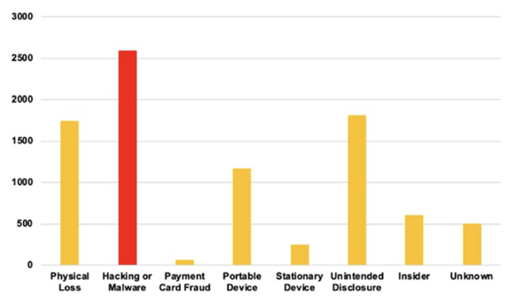

# 쿠팡 유출 사고가 드러낸 기본의 누락

_역대 최고 과징금 6,246억이 데이터를 다루는 모든 IT 기업에 던지는 6가지 질문_

## Executive Summary

> [!callout]
> 2026년 6월 11일, 개인정보보호위원회는 한 온라인 플랫폼에 역대 최고 과징금을 의결했습니다. 그러나 이 사건의 무게는 금액에 있지 않습니다. 개보위가 의결문에 못 박은 한 문장에 있습니다. **"고도의 해킹이 아니라, 기본적인 안전관리 체계의 미비와 관리 소홀로 발생했다."** 이 보고서는 그 한 문장을 출발점으로 삼습니다. 특정 기업을 심판하기 위해서가 아니라, 데이터를 다루는 우리 모두가 같은 거울 앞에 서 있기 때문입니다.

> 전직 직원이 퇴사 전에 확보한 인증 서명키 하나로 위조 토큰을 만들어, 약 7개월 동안 들키지 않고 회원 정보를 빼냈습니다. 그동안 '존재하지도 않는 회원'의 토큰 4,400만 개가 시스템 문을 두드렸지만, 그 신호는 끝내 탐지되지 않았습니다. 평문으로 열람되던 키, 퇴직자에게서 폐기되지 않은 비밀, 회전 없는 자격증명, 임계치 없는 접근통제. 어느 것도 화려한 제로데이가 아닙니다. 모두 기본기의 누락입니다.

> 우리는 이 사건을 6대 위반(서명키·접근통제·유출통지·CPO 독립성·파기·로그와 동의)으로 나누어 기술로 풀고, NIST와 OWASP, 개인정보보호법 조항에 하나씩 매핑합니다. 그리고 그 매핑을 다시, 어느 조직이든 오늘 자사 시스템에 그대로 대입할 수 있는 점검표로 되돌립니다. 보유하지 않은 데이터는 유출되지 않고, 회전되는 키는 탈취되어도 곧 무력해지며, 불변 로그는 사고의 범위를 증언합니다. 질문은 하나로 모입니다. 우리의 키는, 우리의 로그는, 우리의 동의는 지금 어디에 있는가.

<!-- stat-card -->
**6,246억 원** — 역대 최고 과징금(한국) — 개인정보보호위원회 의결

<!-- stat-card -->
**약 3,755만 명** — 유출 정보주체 — 회원 3,322만 + 비회원 433만

<!-- stat-card -->
**1억 4,800만 회** — 미탐지 접근(배송지) — 16개 IP로 비정상 접속

<!-- stat-card -->
**약 7개월** — 공격 미인지 기간 — 2025년 4월~11월

## 무슨 일이 있었나: 사건의 객관적 재구성

먼저 감정을 덜어내고, 확인된 사실만 놓습니다. 2026년 6월 11일 개인정보보호위원회는 쿠팡에 과징금 6,246억 8,100만 원과 과태료 1,680만 원, 그리고 시정명령과 공표명령을 의결했습니다. 계열사 쿠팡풀필먼트서비스(CFS)에도 과징금 2억 4,800만 원이 함께 부과됐습니다. 6,246억 원은 개인정보 안전조치 위반(약 4,235억 원)과 정보주체 동의 없는 활동기록 수집(약 2,011억 원)이라는 두 갈래로 나뉩니다.

유출된 정보주체는 약 3,755만 명입니다. 계정 기준 회원이 약 3,322만 명, 회원이 아닌 정보주체가 최소 약 433만 명입니다. 빠져나간 항목에는 이름, 이메일, 배송지(이름·전화·주소·공동현관 비밀번호), 주문 내역이 포함됐습니다. 배송지에는 회원 본인뿐 아니라 가족이나 지인 같은 제3자의 정보도 다수 섞여 있었습니다. 자신이 쿠팡 회원이 아닌데도 누군가의 배송 주소록 안에서 정보가 새어 나간 사람들이 있었다는 뜻입니다.

### 1.1. 공격은 어떻게 진행됐나

가해자는 외부의 정체불명 해커가 아니었습니다. 과거 쿠팡에서 대체 인증(백업 인증) 체계를 직접 개발했던 전직 직원입니다. 2024년 말 퇴사하면서 인증 서명키를 확보했고, 이 키로 위조 인증토큰을 만들어 회원정보 수정·배송지 관리·주문 목록 페이지를 차례로 조회하며 정보를 빼냈습니다. 시스템 입장에서 이 토큰은 정상적으로 서명된 '진짜'였습니다. 아래는 개보위 의결과 보도를 토대로 재구성한 타임라인입니다.

| 시점 | 사건 |
| --- | --- |
| 2024.12 | 인증 체계 개발자 퇴사. 서명키를 확보한 상태로 접근권은 회수되지 않음 |
| 2025.1 | 위조 토큰 동작 테스트로 추정되는 접근 시작 |
| 2025.4~6 | 배송지 페이지에 16개 IP로 약 1억 4,800만 회 접근 |
| 2025.6~10 | 회원정보 페이지로 조회 범위 확대 |
| 2025.11 | 협박성 민원 접수를 계기로 사고 인지. 약 7개월 만의 첫 인지 |
| 2026.1~2 | 추가 유출 인지(약 16만 명) 후 법정 72시간을 넘겨 통지 |
| 2026.6.11 | 개인정보보호위원회, 역대 최고 과징금 의결 |

타임라인에서 가장 무거운 칸은 '약 7개월'입니다. 그 기간 동안 1억 4,800만 회의 비정상 접근이 쌓였고, 존재하지 않는 회원번호로 만들어진 위조 토큰 4,400만 개가 인증을 통과했습니다. 어떤 기준으로 보아도 충분히 '보이는' 신호였지만, 시스템은 그것을 비명으로 받아들이지 못했습니다.

> [!callout]
> 개보위가 이 사건에 내린 결론은 한 문장으로 압축됩니다. **"이번 사고는 고도의 해킹이 아니라, 기본적인 안전관리 체계의 미비와 관리 소홀로 발생했다."** 이 문장이 중요한 이유는 책임을 묻는 데 있지 않습니다. 원인이 화려한 제로데이가 아니라 키·파기·로그·동의 같은 기본기의 누락이라면, 같은 위험은 규모와 업종을 가리지 않고 어느 조직에나 잠복해 있다는 뜻이기 때문입니다.

*▲ 개인정보 유출 개념 이미지 | Source: [Blogtrepreneur via Wikimedia Commons (CC BY 2.0)](https://commons.wikimedia.org/wiki/File:Data_Security_Breach_(29723649810).jpg)*

## 개보위가 짚은 위반, 기술로 풀다

개보위가 의결한 위반은 크게 여섯 갈래입니다. 각 갈래는 '무슨 일이 있었나 → 왜 위험한가 → 정본 실무는 무엇인가'의 순서로 짚습니다. 그래야 비난이 아니라 점검으로 옮겨 갈 수 있습니다. 먼저 여섯 위반이 어떤 공학 표준과 법 조항에 닿아 있는지를 아래 지도로 정리했습니다.

| 위반 | 개인정보보호법 | 공학 표준 / CWE | 정본 실무 |
| --- | --- | --- | --- |
| 서명키 평문·미회전·퇴직자 미폐기 | 제29조 안전조치 | NIST SP 800-57, OWASP Secrets Mgmt, CWE-321/798 | HSM/KMS 보관·정기+이벤트 회전·즉시 폐기 |
| 접근통제 소홀, 4,400만 위조 토큰 미탐지 | 제29조 안전조치 | NIST SP 800-207/92, CWE-347/294, ATT&CK T1078 | 토큰 실재성 검증·이상탐지·임계치 자동 차단 |
| 유출 통지 72시간 초과, 비회원 미통지 | 제34조 통지 | GDPR Art.33(72h) 비교 | 72시간 통지 플레이북·비회원 추적 체계 |
| CPO 독립적 직무수행 방해 | 제31조 CPO | GDPR Art.37~39 DPO 독립성 | CPO 실질 권한·거부권·의사결정 참여 |
| 파기 의무 위반(탈퇴회원 246만·계좌 31만) | 제21조 파기 | NIST SP 800-88, crypto-shredding | 자동 파기·복제/파생 DB 동기 파기 |
| 로그 훼손·동의 없는 활동기록 수집 | 제63조·제15조 | CWE-778, ATT&CK T1070, WORM | 불변 로그·legal hold·식별자=개인정보 |

### 2.1. 인증 서명키: 마스터키 한 개가 전부였다

쿠팡의 토큰 인증은 전자서명 검증만으로 접근을 허용하는 구조였습니다. 서명이 유효하면 통과시켰고, 그 서명을 만드는 키가 곧 마스터키였습니다. 키 하나만 새어 나가면 전 회원 계정의 문이 동시에 열리는 단일 실패점(single point of failure) 설계였던 셈입니다. 게다가 업무상 필요하지 않은 경우에도 서명키를 평문으로 열람할 수 있었고, 그 키에 접근하던 직원이 퇴사한 뒤에도 키는 갱신되거나 폐기되지 않았습니다.

인증 서명키는 마스터키에 준하는 비밀입니다. 정본 실무는 네 가지로 요약됩니다. 첫째, 평문 노출을 금지하고 HSM이나 KMS에 보관해 사용하는 순간에만 복호화합니다. 둘째, 열람 권한을 분리해 최소권한 원칙을 지킵니다. 셋째, 정기 회전과 이벤트성 회전을 함께 돌립니다. 넷째, 퇴직이나 역할 변경이 일어나면 즉시 폐기합니다. 이 가운데 하나라도 빠지면 '키를 아는 한 사람'이 전체를 엽니다. NIST SP 800-57과 OWASP Secrets Management Cheat Sheet가 같은 원칙을 명문화하고 있고, 평문·하드코딩 자격증명은 CWE-321·CWE-798이 가장 위험한 약점으로 분류합니다.

*▲ nCipher nShield F3 하드웨어 보안 모듈(HSM) — 서명키 등 암호화 자격증명을 평문 노출 없이 보관·사용하는 전용 장치 | Source: [Alexander Klink via Wikimedia Commons (CC BY 3.0)](https://commons.wikimedia.org/wiki/File:NCipher_nShield_F3_Hardware_Security_Module.jpg)*

### 2.2. 접근통제: 4,400만 개의 비명이 들리지 않았다

공격 기간 중 개인정보 페이지 접속량은 평소보다 크게 치솟았습니다. 더 결정적인 신호는 존재하지 않는 회원의 인증토큰 약 4,400만 개로 발생한 비정상 접속이었습니다. 실재하지 않는 회원번호인데 서명만 유효하다는 이유로 시스템은 그 토큰을 받아들였습니다. 배송지 페이지에만 16개 IP로 약 1억 4,800만 회의 접근이 누적되는 동안, 쿠팡은 협박 메일 민원이 들어오기 전까지 이상 행위를 인지하지 못했습니다. 차단 임계치 설정이 미흡했고, 탐지된 이상에 대한 상세 분석도 뒤따르지 않았습니다.

토큰은 서명만 검증해서는 안 됩니다. 서명이 유효하더라도 실재하지 않는 회원번호라면 거부하는 실재성·유효성 검증이 함께 가야 합니다. 그 위에 레이트 리미팅, 이상 탐지(UEBA), 비정상 트래픽 임계치와 자동 차단, 그리고 탐지에서 분석을 거쳐 대응으로 이어지는 루프가 상시 돌아야 합니다. NIST SP 800-207(제로 트러스트)과 SP 800-92(로그 관리)가 이 설계의 표준이며, 서명 검증 부적절은 CWE-347, 유효 계정 악용은 MITRE ATT&CK T1078로 분류됩니다. 1억 4,800만 회는 어떤 임계치로도 걸러졌어야 할 숫자입니다.

*▲ USB 하드웨어 인증 토큰(OTP) — 서명만으로는 충분하지 않다. 회원 실재성·유효성 검증과 다중 인증이 함께 가야 한다 | Source: [Wikimedia Commons (CC BY-SA 3.0)](https://commons.wikimedia.org/wiki/File:Authentication_devices.jpg)*

### 2.3. 유출 통지: 시계는 사고와 함께 돌기 시작한다

쿠팡은 약 16만 명의 추가 유출을 인지(2026년 1월)하고도 법정 72시간을 넘겨 통지(2월)했습니다. 더 큰 공백은 배송지에 섞여 있던 비회원 정보주체에 대한 통지를 끝내 이행하지 않았다는 점입니다. 개보위가 네 차례 촉구했지만, 비회원들은 자신의 정보가 유출된 사실조차 알지 못한 채 2차 피해를 예방할 기회를 잃었습니다.

유출 대응에는 시계가 돌아갑니다. 72시간 통지 플레이북을 미리 갖추는 것은 기본이고, 더 어려운 과제는 '내 회원이 아닌 데이터 주체'까지 식별하고 연락할 수 있는 통지 체계입니다. 배송지처럼 제3자 정보가 섞이는 데이터를 다루는 곳이라면, 그 체계는 사고가 난 뒤가 아니라 평시에 설계되어 있어야 합니다. GDPR Art.33의 72시간 규정이 같은 시간 감각을 제도화한 사례입니다.

### 2.4. CPO 독립성: 거버넌스는 조직도가 아니라 실질 권한이다

자체 조사와 공개 과정에서 개인정보 보호책임자(CPO)는 의사결정에서 배제됐고 정보도 충분히 공유받지 못했습니다. 그 결과 해커 진술에만 의존한 미검증 내용이 공지와 언론을 통해 퍼지며 혼란을 키웠습니다. 개보위는 이를 'CPO 제도의 형해화'로 판단했습니다.

거버넌스는 조직도에 직책이 그려져 있다고 작동하지 않습니다. CPO 또는 DPO가 인시던트 의사결정 테이블에 실제로 앉고, 통지나 공개 전 사실검증에 거부권을 행사할 수 있어야 비로소 권한입니다. GDPR Art.37~39가 규정하는 DPO의 독립성과 직접 보고라인이 참조점입니다. 권한 없는 책임자는 사고를 막지 못하고 사고의 책임만 떠안습니다.

### 2.5. 파기: 보유하지 않은 데이터는 유출되지 않는다

내부 규정(탈퇴 90일 또는 즉시 파기)이 있었음에도, 탈퇴회원의 배송지 246만 건과 계좌번호 31만 건이 파기되지 않고 남아 있었습니다. 발송용으로 복제해 둔 DB에도 탈퇴자 71만 명의 정보가 그대로 있었고, 그중 일부가 실제 유출로 이어졌습니다. 떠난 고객의 데이터가 시스템 어딘가에 잊힌 채 남아, 떠난 뒤에도 위험으로 작동한 것입니다.

가장 저렴한 보안은 데이터를 갖지 않는 것입니다. 보유기간을 명확히 정의하고, 자동 파기를 걸고, 탈퇴 시 규정대로 파기하되 무엇보다 복제·파생·발송용 DB까지 동시에 파기되는지를 확인해야 합니다. 원본만 지우고 사본을 잊는 순간 데이터 최소화는 무너집니다. NIST SP 800-88(매체 정화)과 암호화 키만 폐기해 데이터를 무력화하는 crypto-shredding이 실무 기준이며, 정기 데이터 인벤토리가 '잊힌 사본'을 찾아내는 그물입니다.

### 2.6. 로그와 동의: 블랙박스가 지워지고, 식별자가 결합됐다

마지막 갈래는 두 가지가 겹칩니다. 하나는 로그입니다. 자료보전 명령이 내려진 뒤에도 약 5개월치 접속 로그가 수동으로 삭제됐고, 6개월 자동삭제 정책도 중단되지 않았습니다. 그 결과 전체 배송지 접근 기록의 상당 부분이 사라져, 해당 기간에 피해를 본 정보주체를 특정하는 일 자체가 불가능해졌습니다. 로그는 보안의 블랙박스입니다. 로그가 사라지면 사고가 얼마나 컸는지조차 증명할 수 없습니다. 한 번 기록되면 수정·삭제가 불가능한 WORM 또는 append-only 저장과, 사고 발생 시 자동삭제를 즉시 멈추는 legal hold가 정본 실무입니다. 불충분한 로깅은 CWE-778, 증거 인멸은 ATT&CK T1070으로 분류됩니다.

다른 하나는 동의입니다. 쿠팡 파트너스를 운영하면서, 이용자가 광고를 클릭하지 않아도 기기 식별자(GAID/IDFA/PCID)와 타사 웹·앱 방문기록을 동의 없이 수집해 회원번호와 함께 광고 DB에 저장했습니다. 약 1,117만 명이 대상이었고, 이 부분에만 약 2,011억 원의 과징금이 매겨졌습니다. 기기 식별자 자체는 모호해 보여도, 회원번호와 결합되는 순간 그것은 식별 가능한 개인정보가 됩니다. 같은 맥락에서 개보위는 이용자가 클릭하지 않아도 강제로 쿠팡으로 전환시키는 이른바 '납치광고' 파트너를 적절히 제재하지 않아, 이용자 의사에 반한 활동기록 수집을 방치한 점도 함께 지적했습니다. 추적과 맞춤광고에는 명확한 고지·동의·철회가 전제이고, 파트너의 데이터 수집까지 감독할 책임이 따릅니다. 이는 2022년 구글·메타에 부과된 약 1,000억 원 처분의 직접적인 연장선 위에 있습니다.

## 우리 회사 점검표: 오늘 던질 6개의 질문

이제 사건을 점검표로 바꿉니다. 아래 여섯 영역은 특정 기업이 아니라 데이터를 다루는 모든 조직을 위한 것입니다. 설명문이 아니라 질문으로 적었습니다. 질문에 즉답이 나오지 않는 항목이 있다면, 그곳이 지금 우리 조직의 가장 약한 고리일 가능성이 높습니다.

### 3.1. 인증·키 관리

- •우리의 서명키·비밀은 평문으로 열람 가능한가? HSM/KMS로 옮겨져 있는가?
- •키 회전 주기가 정해져 있고, 실제로 회전이 일어나고 있는가?
- •퇴직·역할 변경이 키 폐기와 접근권 회수의 자동 트리거로 걸려 있는가?
- •토큰은 서명만으로 통과하는가, 회원의 실재성·유효성까지 검증하는가?

### 3.2. 접근통제·탐지

- •비정상 트래픽에 대한 임계치가 설정돼 있고, 초과 시 자동 차단되는가?
- •이상 탐지(UEBA)와 SIEM 로그 상관분석이 상시 가동되는가?
- •탐지에서 분석, 대응으로 이어지는 루프가 사람과 함께 돌아가는가?

### 3.3. 데이터 최소화·파기

- •데이터마다 보유기간이 정의돼 있고, 자동 파기가 작동하는가?
- •탈퇴·만료 시 원본뿐 아니라 복제·파생·발송용 DB까지 동시에 파기되는가?
- •정기 데이터 인벤토리로 '잊힌 사본'을 찾아내고 있는가?

### 3.4. 유출 대응 거버넌스

- •72시간 통지 플레이북이 있고, 모의훈련으로 검증해 봤는가?
- •회원이 아닌 데이터 주체까지 식별·통지할 수 있는 체계가 있는가?
- •CPO/DPO가 인시던트 의사결정에 실제로 참여하고 거부권을 갖는가?

### 3.5. 로그·증거

- •핵심 접근 로그가 불변(WORM/append-only)으로 보존되는가?
- •사고 발생 시 자동삭제를 즉시 동결하는 legal hold 절차가 있는가?

### 3.6. 제3자·추적·동의

- •기기 식별자를 회원번호와 결합해 수집하면서 개인정보로 취급하고 있는가?
- •추적·맞춤광고에 명확한 고지·동의·철회가 보장되는가?
- •파트너·제3자의 데이터 수집까지 우리가 감독하고 있는가?

> [!callout]
> 이 점검표가 한 회사만의 특이한 문제를 다룬다고 느껴진다면, 세계적 대형 유출의 근본 원인을 나란히 놓아 보면 생각이 바뀝니다. 화려한 제로데이는 오히려 드뭅니다. 반복되는 것은 키·파기·탐지·통지·거버넌스라는 기본기의 자동화 실패입니다.

- •**Equifax(2017)**: 만료된 SSL 인증서를 19개월 방치해 모니터링이 꺼졌고, 미패치가 겹쳐 1억 4,700만 명이 노출됐습니다. 미폐기 자격증명과 장기 미탐지의 결합입니다.
- •**Uber(2016)**: GitHub에 노출된 클라우드 자격증명이 출발점이었습니다. 시크릿 평문 노출과 접근통제 부재입니다.
- •**LastPass(2022)**: 개발자 환경을 경유해 암호화 키가 탈취됐습니다. 권한·키 관리 실패의 전형입니다.
- •**Capital One(2019)**: 설정 오류와 과보유 데이터가 만났습니다. 데이터 최소화와 파기의 실패입니다.

산업 통계도 같은 방향을 가리킵니다. IBM의 2024년 보고서에 따르면 탈취된 자격증명으로 인한 침해는 탐지와 봉쇄까지 평균 292일이 걸립니다. 쿠팡의 약 7개월(약 210일) 미인지는 통계적으로 보면 오히려 '이상하지 않은' 수치에 가깝습니다. 그만큼 자격증명 침해의 미탐지는 보편적 사각지대라는 뜻입니다. GitGuardian의 조사에서는 한 번 유출된 시크릿의 다수가 오랜 시간이 지나도 여전히 유효한 상태로 남아 있었습니다. 누락된 키 회전은 한 회사의 일탈이 아니라 업계 전체의 습관입니다.

*▲ 데이터 침해 원인 유형별 건수 (PrivacyRights.Org 기반, 2021) — 해킹·맬웨어(~2,600건)가 압도적 1위, 비의도적 노출(~1,800건)·물리적 분실(~1,750건)이 그 뒤를 잇는다. 인사이더 위협(~600건)도 결코 무시할 수 없는 수준 | Source: [PrivacyRights.Org / Wikimedia Commons (Public Domain)](https://commons.wikimedia.org/wiki/File:Data_breaches_by_cause.png)*

## 거울 앞에서: 데이터를 다루는 모두에게

AI 시대에 데이터는 가장 큰 자산입니다. 그리고 동시에 가장 큰 책임입니다. 모델이 좋아질수록 더 많은 데이터를 끌어모으게 되고, 끌어모은 데이터는 보호받지 못하는 순간 자산에서 부채로 돌아섭니다. 이 사건이 보여 준 6,246억 원은, 그 부채가 현실의 청구서로 도착했을 때의 크기입니다.

우리가 'AI-Ready Data'를 말할 때, 그것은 단지 깨끗하고 잘 정리된 데이터를 뜻하지 않습니다. 출처가 추적되고(provenance), 최소한으로 수집되며, 안전하게 관리되고, 책임 있게 파기되는 데이터를 뜻합니다. 출처를 모르는 데이터, 동의 없이 모은 추적 데이터, 파기되지 않고 남은 데이터는 AI에게도 자산이 아니라 부채입니다. 이 사건의 여섯 위반은 공교롭게도, 데이터를 다루는 인프라가 갖춰야 할 안전 설계의 반대편 목록과 정확히 겹칩니다.

그래서 우리는 이 사건을 남의 일로 읽지 않습니다. 데이터 거버넌스는 보안 부서만의 일이 아니라 데이터 품질의 문제이기도 합니다. 출처를 추적하는 일과 최소한으로 수집하는 일은 품질의 윤리적 하한선이고, 이 사건은 그 하한선이 무너졌을 때 비용이 얼마나 커지는지를 숫자로 증언합니다. 거울은 비추기 위해 있습니다. 비난하기 위해 있는 것이 아닙니다.

> [!callout]
> 이 보고서를 덮기 전에, 우리 조직을 향해 같은 질문을 던져 보면 좋겠습니다. 우리의 키는 지금 어디에, 어떤 상태로 있는가. 우리의 로그는 누군가 지우려 할 때 버틸 수 있는가. 우리가 모은 동의는 정말 동의였는가. 떠난 고객의 데이터는 정말 떠났는가. 답이 막히는 질문이 하나라도 있다면, 그곳이 우리가 오늘 시작할 자리입니다.

## Editor's Note

페블러스는 고객의 데이터를 직접 다루는 회사입니다. 데이터의 출처와 이력, 품질을 진단하는 DataClinic, 그리고 데이터를 책임 있게 키우는 인프라를 만드는 일이 우리의 본업입니다. 그래서 이번 사건의 6대 위반은 우리에게도 그대로 점검표입니다. 우리가 만드는 시스템이 같은 거울에 비춰질 때, 증적·최소수집·접근통제·책임 있는 파기가 자랑거리가 아니라 매일 답해야 할 기본기라는 사실을 다시 확인합니다. 이 글이 어떤 조직에든 자기 점검의 계기가 된다면, 그것으로 충분합니다.

## 참고문헌

### 1차 근거·공론

- 1.개인정보보호위원회. (2026). "[개인정보위, 쿠팡 및 계열사의 개인정보 유출 및 침해 제재처분 의결](https://www.pipc.go.kr/np/cop/bbs/selectBoardArticle.do?bbsId=BS074&nttId=12171)." 보도자료(2026.6.11).
- 2.경향신문. (2026). "[쿠팡 개인정보 유출 관련 보도](https://www.khan.co.kr/article/202606111100001)." (2026.6.11).
- 3.JTBC News. (2026). "[624,600,000,000원…'전례 없는 과징금' 쿠팡 충격](https://youtu.be/78s-wcyMRuQ)." (2026.6.11).
- 4.개인정보보호위원회. (2022). "[구글·메타 타사 행태정보 수집 과징금 1,000억 원 처분](https://www.pipc.go.kr/np/cop/bbs/selectBoardArticle.do?bbsId=BS074&nttId=8221)." (2022.9.14).

### 산업·통계 보고서

- 5.IBM Security. (2025). "[Cost of a Data Breach Report 2025](https://www.ibm.com/reports/data-breach)."
- 6.Verizon. (2025). "[2025 Data Breach Investigations Report (DBIR)](https://www.verizon.com/business/resources/reports/2025-dbir-data-breach-investigations-report.pdf)."
- 7.GitGuardian. (2025). "[The State of Secrets Sprawl 2025](https://www.gitguardian.com/state-of-secrets-sprawl-report-2025)."
- 8.GitGuardian. (2026). "[The State of Secrets Sprawl 2026](https://blog.gitguardian.com/the-state-of-secrets-sprawl-2026/)."
- 9.DLA Piper. (2026). "[GDPR Fines and Data Breach Survey: January 2026](https://www.dlapiper.com/en-us/insights/publications/2026/01/dla-piper-gdpr-fines-and-data-breach-survey-january-2026)."
- 10.Ponemon Institute / DTEX. (2025). "[Cost of Insider Risks Global Report 2025](https://www.dtexsystems.com/blog/2025-cost-insider-risks-takeaways/)."

### 공학 표준

- 11.NIST. "[SP 800-57 Recommendation for Key Management](https://csrc.nist.gov/pubs/sp/800/57/pt1/r5/final)."
- 12.OWASP. "[Secrets Management Cheat Sheet](https://cheatsheetseries.owasp.org/cheatsheets/Secrets_Management_Cheat_Sheet.html)."
