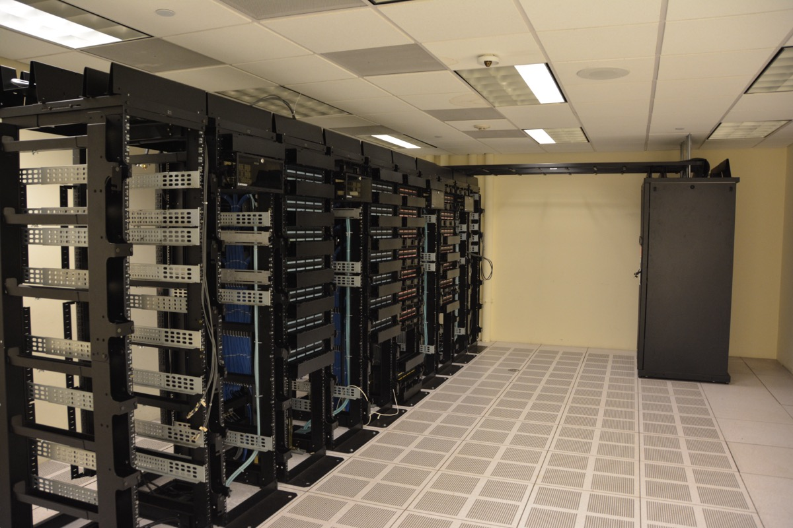

# 동네 데이터센터 반대, 왜 조사마다 답이 다를까?

_전국 조사 여덟 건은 반대율을 저마다 다르게 적었지만, 펜실베이니아를 열여덟 달 다닌 연구진이 들은 네 갈래는 한곳을 겨눴다_

## Executive Summary

> [!callout]
> 이 글은 "미국 사람들이 동네 데이터센터에 얼마나 반대하는가"라는 물음에 왜 답이 하나로 나오지 않는지를 따라간다. 2026년 봄부터 여름까지 넉 달 남짓한 사이에 미국에서 전국 조사 여덟 건이 나왔고, 지역 데이터센터 반대율은 49%에서 75%까지 적혔다. 같은 3월에 49%와 71%가 함께 나왔다. 흩어진 것은 여론만이 아니었다. 무엇을 물었는지, 어느 칸을 읽어 줬는지, 얼마나 가까운 곳을 가리켰는지가 조사마다 달랐다.

> 무엇에 찬성하느냐고 물으면 답은 오히려 선명해진다. 성인 삼천여 명을 물은 조사에서 응답자가 가장 널리 동의한 항목은 "짓지 마라"가 아니었다. "전력망을 보강해야 한다면 그 비용은 지은 쪽이 내라"였다. 반대로 데이터센터가 일자리와 세수에 보탬이 된다는 평가는 모든 항목 가운데 가장 낮았다. 사람들이 내놓는 요구는 인공지능을 멈추라는 쪽이 아니라 청구서를 누가 받느냐는 쪽에 가깝다.

> 그 요구의 내용은 펜실베이니아에서 열여덟 달을 머문 연구진이 직접 들은 이야기와 겹친다. 전기요금, 집값, 앞서 두 차례 지나간 산업의 기억, 협상 자리에 앉은 사람이 비밀유지계약에 서명해 말을 못 하는 상황. 네 갈래는 저마다 다른 데서 출발하는데, 연구진이 그 끝에서 만난 상대는 같았다. 그리고 이 글이 마지막에 마주치는 것은 더 불편한 사실이다. 그 논쟁의 크기를 말해 주는 숫자들이 집계처마다 다른 것을 세고 있다.

49% · 71%

같은 3월에 나온 두 조사의 반대율

같은 나라, 다른 문항

73%

전력망 보강 비용을 건설사가 내게 하는 정책 지지

건설 수 제한 지지(62%)보다 높다

5개

제안 100여 개 중 1단계 인허가를 다 받은 사업

펜실베이니아 주정부 집계, 2026년 8월

13 ~ 400

펜실베이니아 데이터센터 개수 집계 범위

집계처 일곱 곳, 기준 시점 2026년 7~9월

*▲ 논쟁의 대상이 되는 시설 — 데이터센터 내부 서버 랙. | Source: [Wikimedia Commons (Carl Lender, CC BY 2.0)](https://commons.wikimedia.org/wiki/File:Datacenter_Server_Racks_(22370909788).jpg)*

## 같은 계절에 물었는데 답이 마흔아홉에서 일흔다섯까지 나왔다

2026년 9월 22일 [테크크런치 기사](https://techcrunch.com/2026/09/22/everyone-can-find-a-reason-to-dislike-data-center-construction/)는 이렇게 시작한다. "미국인의 60% 이상이 신규 데이터센터를 제한하는 데 찬성한다." 기사는 이 한 문장의 근거로 세 건의 조사에 링크를 걸어 두었다. 그 세 건을 차례로 열어 보면 곧 이상한 점이 보인다. 셋은 같은 것을 재지 않았다. 둘은 "내가 사는 지역에 데이터센터가 들어오는 데 찬성하는가"를 물었고, 나머지 하나는 "신규 데이터센터 수를 제한하는 정책에 찬성하는가"를 물었다. 앞의 것은 반대율이고 뒤의 것은 정책 지지율이다. 두 값을 한 문장으로 묶는 순간 무엇이 60%인지가 사라진다.

범위를 세 건에서 여덟 건으로 넓히면 어긋남의 폭이 더 커진다. 2026년 2월부터 8월까지 미국에서 나온 전국 조사 여덟 건을 현장 시점 순으로 늘어놓은 것이 아래 표다. 맨 오른쪽 두 열, 그러니까 "어느 쪽도 아니다" 칸을 응답자에게 읽어 줬는지와 조사를 어떤 방식으로 돌렸는지를 함께 놓았다. 이 두 열이 뒤에서 답을 가르는 자리가 된다.

| 조사 | 현장 시점 | 응답자 | 무엇을 물었나 | 반대 | 지지 | '어느 쪽도' 칸 | 방식 |
| --- | --- | --- | --- | --- | --- | --- | --- |
| 애넌버그 1차 | 2026-02~03 | 미공개 | 내 지역 신규 데이터센터 | 49 | 21 | 있음 | 온라인+전화 |
| 갤럽 | 2026-03-02~18 | 1,000 | 내 지역 AI 데이터센터 | 71 | 27 | 따로 읽어 주지 않음 | 전화 |
| 로이터·입소스 | 2026-06-03~08 | 4,531 | 내 커뮤니티 데이터센터 | 57 | 14 | 명시 안 됨 | 온라인 |
| 애넌버그 2차 | 2026-06-16~07-19 | 1,320 | 내 지역 신규 데이터센터 | 61 | 14 | 있음(25% 선택) | 온라인+전화 |
| AP-NORC·EPIC | 2026-07-06~24 | 3,424 | 정책: 신규 건설 수 제한 | 8 | 62 | 있음(29% 선택) | 확인 못 함 |
| 폭스뉴스 | 2026-07-17~20 | 1,003등록 유권자 | 내 지역 AI용 데이터센터 | 70 | 30 | 양자택일 | 전화+온라인 |
| 히트맵 프로 | 2026-08-08~13 | 2,045등록 유권자 | 내 근처 신규 데이터센터 | 75 | 미공개 | 명시 안 됨 | 문자·웹 |
| 매사추세츠대 | 2026-08-21~26 | 1,000 | 내 지역 AI 데이터센터 | 65 | 11 | 있음(24% 선택) | 온라인 |

****

각 조사의 원 토플라인과 발표문에서 확인한 값이다. AP-NORC·EPIC 행만 물음의 성격이 다르다. 나머지 일곱은 내 지역에 짓는 데 찬성하는지를 물었고, 이 한 건은 신규 건설 수를 제한하는 정책에 찬성하는지를 물었다. 같은 열에 놓여 있지만 같은 수가 아니다.

표에서 가장 먼저 눈에 걸리는 두 줄은 맨 위 두 줄이다. 애넌버그 공공정책센터의 1차 조사는 2026년 2월에서 3월 사이에 반대 49%를 적었고, 갤럽은 3월 2일부터 18일까지 물어 반대 71%를 적었다. 현장 시점이 겹친다. 두 조사 사이의 22%p는 한 달 안에 여론이 뒤집혀서 생긴 값으로 보기 어렵다.

### 1.1. 문항이 다르면 답도 다른 것을 잰다

두 조사가 다르게 한 것을 꼽으면 넷이다. 첫째, 그 세 번째 칸이다. 애넌버그는 응답자에게 읽어 줬고 갤럽은 따로 읽어 주지 않았다. 다만 갤럽이 "모르겠다"를 어떻게 처리하는지에 대한 자체 방법론 각주는 원문으로 확인하지 못했다. 정확한 서술은 "제공하지 않았다"가 아니라 "제3의 선택지를 명시적으로 읽어 주지 않았다"다. 둘째, 애넌버그는 "데이터센터"를 물었고 갤럽은 "AI 데이터센터"를 물었다. 셋째, 한쪽은 주로 온라인이고 다른 쪽은 전화다. 넷째, 물음이 가리키는 거리가 다르다.

넷째 항목은 한 조사 안에서 직접 확인된다. 로이터·입소스는 같은 응답자에게 거리를 바꿔 가며 세 번 물었다. 신규 데이터센터 건설 전반에 대한 반대는 45%, "내 커뮤니티에"로 좁히면 57%, "집에서 반경 10마일 안"으로 더 좁히면 59%가 됐다. 물음이 응답자의 뒷마당에 가까워질수록 반대가 올라간다. 표의 여덟 건은 이 거리를 저마다 다르게 잡고 있다.

### 1.2. 중립 칸만으로는 22%p가 설명되지 않는다

네 후보 가운데 가장 그럴듯해 보이는 것은 첫째, 그러니까 중립 칸이다. 세 번째 선택지를 주면 양쪽에서 사람이 빠져나가니 반대율이 내려갈 것이라는 짐작은 자연스럽다. 그런데 설문 방법론 쪽 문헌은 이 짐작을 그대로 받아 주지 않는다. 엘키에르와 윌리언이 2024년 _Political Science Research and Methods_에 실은 사전등록 실험은 미국 응답자 4,810명을 정책 문항 여덟 개에 무작위로 배정해 "모르겠다" 칸의 제공 여부만 달리했다. 저자들의 보고는 조심스럽다. "우리는 예상한 방향으로 평균 1%의 처치 효과를 관측했으나, 이 또한 통계적 유의성에 이르지 못한다." 단일 문항 최대 효과도 3%p였다.

다만 같은 논문은 효과가 커지는 조건도 밝혀 두었다. 응답자가 해당 쟁점을 잘 모르고 그 쟁점의 현저성이 낮을 때다. 인프라 법안 문항에서 5.6%p, 낙태 문항에서 7.2%p, 상속세 문항에서 10%p까지 벌어졌다. 2026년 봄의 데이터센터는 그 조건에 정확히 들어맞는 쟁점이었다. 히트맵 프로의 시계열에서 "잘 모르겠다"는 응답이 15%에서 21%로 오르던 시기가 바로 이때다. 그러니 정직한 착지는 이렇다. 중립 칸이 작동할 조건이기는 했으나, 22%p 가운데 얼마가 그 몫인지는 공개된 자료로 가를 수 없다.

### 1.3. 표를 세로로 읽으면 무너지는 쪽은 반대가 아니다

반대 열만 보면 49에서 75까지 흩어져 읽는 사람이 방향을 잡기 어렵다. 그런데 같은 표의 지지 열을 세로로 훑으면 훨씬 깔끔한 대비가 나온다. "어느 쪽도 아니다" 칸을 명시적으로 읽어 준 조사에서 지지는 11%에서 21% 사이에 머문다. 애넌버그 1차 21%, 애넌버그 2차 14%, 매사추세츠대 11%다. 반면 사실상 둘 중 하나를 고르게 한 조사에서는 27%와 30%가 나온다. 갤럽 27%, 폭스뉴스 30%다. 거의 두 배 차이다.

이렇게 읽으면 중립 칸이 실제로 하는 일이 보인다. 그 칸은 반대를 깎는 것이 아니라 지지를 깎는다. 강제 선택 조사가 "지지"로 집계한 응답 가운데 상당 부분은 세 번째 문이 열려 있으면 그리로 걸어 나가는 무른 지지라는 뜻이다. 다만 여기서 멈춰야 한다. 표의 여덟 건은 모집단도 다르다. 폭스뉴스와 히트맵 프로는 등록 유권자를 물었고 매사추세츠대와 애넌버그는 성인 전체를 물었다. 갤럽은 전화이고 나머지는 대체로 온라인이다. 여기까지가 "이렇게 읽힌다"이고, "이것이 원인이다"로 넘어가면 이 글이 1절 첫머리에서 지적한 그 동작을 스스로 하는 셈이 된다.

### 1.4. 그렇다고 여론이 가만히 있었던 것은 아니다

재는 방식이 흔들렸다는 말이 여론은 그대로였다는 말은 아니다. 같은 문항으로 반복 측정한 조사가 표에 딱 하나 있다. 기후·에너지 전문 매체가 자체 발주한 히트맵 프로의 추적 조사다. 이 조사에서 2025년 9월에는 지지 43%가 반대 42%보다 높았다. 열한 달 뒤인 2026년 8월에는 반대가 75%가 됐고, 그 가운데 "강하게 반대"만 60%를 넘었다. 발주처가 데이터센터에 비판적인 논조를 가진 매체라는 점은 함께 적어 둘 일이지만, 한 조사가 제 앞뒤로 잰 값이 이만큼 움직였다는 사실 자체는 남는다. 애넌버그도 두 웨이브 사이에 반대가 12%p 올랐고, 발표문은 이를 자신들이 측정한 인공지능 관련 문항 가운데 가장 큰 변화라고 적었다.

표 안에서 데이터센터 문항을 두 번 이상 물은 곳은 히트맵 프로뿐이지만, AP-NORC는 바로 옆 문항을 같은 문안으로 두 번 물었다. 인공지능 산업의 환경 영향이 걱정된다는 응답은 2025년 9월 41%에서 2026년 7월 53%로 올랐다. 이 문항이 유용한 이유는 같은 묶음에 다른 산업이 함께 들어 있었다는 데 있다. 암호화폐는 29%에서 28%, 육류 생산은 29%에서 32%, 항공 여행은 23%에서 28%로 거의 제자리다. 같은 기관이 같은 문안으로 두 번 물은 네 항목 가운데 인공지능만 12%p 움직였다. 인공지능이 사회 전반에 해가 될 것이라는 전망도 44%에서 52%로 올랐다. 불안이 전반적으로 부풀었다고 보기는 어렵고, 움직인 것은 한 항목이다.

이 블로그도 앞서 [갤럽의 71%를 인용한 적이 있다](/blog/ai-mega-datacenter-open-weight-shift/ko/). 그 글은 이 조사를 "5월에 발표된 조사"로 적었는데, 발표가 5월이고 현장은 3월이다. 위 표가 현장 시점 순인 이유가 여기 있다. 발표일로 늘어놓으면 애넌버그 1차와 갤럽이 서로 다른 계절에 있는 것처럼 보이고, 22%p가 그 사이의 시간 탓으로 읽힌다.

## 가장 큰 다수가 고른 것은 비용을 누가 낼지 정하는 규칙이다

반대율이 조사마다 흔들린다면 다른 각도로 물어볼 수 있다. 무엇에 반대하느냐가 아니라 무엇에 찬성하느냐다. 앞 표에서 유일하게 정책을 물은 조사가 이 물음에 답을 준다. AP-NORC 공공문제연구센터와 시카고대 에너지정책연구소가 함께 돌린 2026년 에너지 조사다. 성인 3,424명, 표집오차 ±2.2%p, 현장은 7월 6일부터 24일까지였다. 이 조사는 데이터센터 관련 정책 네 가지를 늘어놓고 각각에 찬성하는지 반대하는지를 물었다.

네 항목의 지지율은 아래와 같다. 여기서 중요한 것은 1위와 3위의 순서다. 가장 많은 지지를 받은 것은 건설을 막는 조항이 아니었다.
