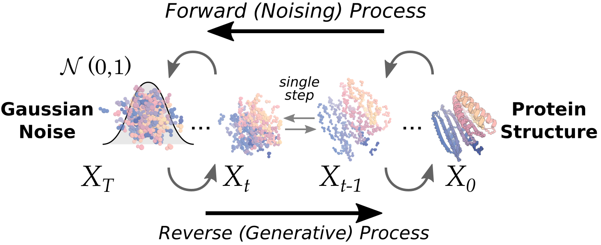

# AlphaFold Folded Proteins. Now AI Designs Them From Scratch.

_Beyond structure prediction, what turned protein design into manufacturing-grade engineering wasn_

## Executive Summary

> [!callout]
> If AlphaFold opened an era of prediction — solving "how does a given sequence fold?" — the center of gravity in protein science is now shifting toward generation, the de novo era of "can we build a protein with the function we want from scratch?" This report argues that the real protagonist of that shift is not a smarter model. The pivotal fact is that the experimental hit rate for protein binder design jumped from under 1% in traditional approaches to tens of percent in the latest pipelines, turning design from a luck-driven search into a manufacturing-grade engineering discipline whose success rate can be predicted and managed.

> What produced this leap? General tech media answer "bigger generative models," but the data points to a different picture. The decisive lever was not parameters but a high-quality wet-lab data loop in which design, synthesis, measurement, and feedback keep circulating. In protein fitness prediction, researchers have observed a threshold beyond which bigger models actually perform worse, and what is genuinely scarce is not models but the experimentally verified "ground truth." That said, headline hit rates swing widely by target, so this report examines the leap and its limits together.

> This is a natural-science proof of the thesis Pebblous has long argued in the data-quality debate. In an age where AI has begun generating hypotheses and designs on its own, what work remains for the human scientist? This report's answer is that the work increasingly converges on curation — deciding what to measure and which data to trust.

The backbone of this report is the four numbers below: the leap in hit rate (①), the experimental burden that leap removed (②), the wet-lab data that nonetheless remains scarce (③), and the threshold showing that a bigger model is not the answer (④). The body works through these four signals in turn.

<!-- stat-card -->
**<1% → tens of %** — De novo binder experimental hit rate — A roughly 2–3 order-of-magnitude leap over traditional Rosetta

<!-- stat-card -->
**Under 100 per target** — Designs taken into the lab — Down sharply from screening hundreds of thousands to millions

<!-- stat-card -->
**240K vs 200M** — Experimental PDB structures vs predicted structures — Measured data is ~1/870 of predictions — raw material exploded, ground truth stays scarce

<!-- stat-card -->
**~3 billion params** — Threshold of fitness-prediction performance — Beyond this scale, bigger models actually get worse

## From Folding AI to Building AI

When AlphaFold2 effectively solved protein structure prediction in 2021, it marked a watershed for the life sciences. Feed in an amino acid sequence and it would predict, at near-experimental accuracy, the three-dimensional shape that sequence folds into. But this is, in essence, the work of reconstructing an answer nature had already solved — the model learned and reproduced the sequence-to-structure mapping that evolution had laid down over billions of years.

De novo design runs in the opposite direction. You first specify a desired function — "make me a protein that binds this target" — and then generate, from scratch, a new sequence and structure to carry out that function. Because you are producing a molecule that has never existed in nature, no ground-truth label exists in advance. Whether you "got it right" can only be known by synthesizing it and running the experiment. This is precisely where the data loop stops being optional and becomes inevitable.

> [!callout]
> Prediction is an exam with an answer key; generation is an exam where you have to build the answer key yourself, through experiments. Because the problem comes with no answer key, the performance of de novo design depends as much on how quickly and accurately you measure designs and feed the results back into training as it does on the model's cleverness.

*▲ Protein ribbon diagram — helices, sheets, and loops folded in three dimensions. Prediction recovers this structure; de novo design builds a new one from scratch | Source: [RosettaCommons/RFdiffusion](https://github.com/RosettaCommons/RFdiffusion)*

### 1.1. A Lineage of Methods — How Prediction Models Became Generative Tools

Today's de novo design did not arrive all at once. Tools that once read structure were gradually repurposed into tools that write it. The lineage below compresses that arc.

| Year | Method | Role |
| --- | --- | --- |
| 2021 | AlphaFold2 | Sequence → structure prediction. Repurposed as the validation and filtering engine for de novo design. |
| 2022 | ProteinMPNN | Designs sequences that fit a given backbone. Sharply improved stability and expression yields. |
| 2023 | RFdiffusion | Generates new backbones with a diffusion model. Raised binder design hit rates nearly 100-fold. |
| 2024 | AlphaProteo | DeepMind's binder-generation pipeline. Reported single-digit to 88% hit rates depending on the target. |
| 2025 | BindCraft · ESM3 · RFdiffusion2 | Achieved average hit rates of tens of percent by cleverly composing existing weights — without training a new model. |

Lineage compiled from: Jumper et al. (2021), Dauparas et al. (2022), Watson et al. (2023), Zambaldi et al. (2024), Pacesa et al. (2025).

*▲ RFdiffusion diffusion process — the forward (noising) and reverse (generative) passes form a pair; the reverse pass is the engine of de novo backbone generation | Source: [RosettaCommons/RFdiffusion (Watson et al., 2023)](https://github.com/RosettaCommons/RFdiffusion)*

## Hit Rate: From Luck to a Plan

The most concrete evidence that protein design has become "engineering" is the hit rate. The hit rate is the fraction of designed proteins that — once actually synthesized and tested — exhibit the intended function, such as binding to a target, in experiment. When that number rises steadily and becomes predictable, design shifts from a search where "you get lucky and land one" to a manufacturing process where you can plan that "for every N you build, N of them work."

Traditional Rosetta-based design typically had an experimental hit rate under 1%, and for difficult molecules like antibodies it fell below even 0.1%. In 2023, RFdiffusion showed an in vitro hit rate of about 19% — a two-orders-of-magnitude leap over the prior baseline; in 2024, AlphaProteo reported single digits up to 88% depending on the target; and in 2025, BindCraft reported averages in the 30–50% range. The comparison below shows the change at a glance.

<!-- stat-card -->
**Traditional Rosetta (~2021)< 1%** — RFdiffusion (2023, in vitro)~19% — AlphaProteo (2024, by target)9–88% — BindCraft (2025, average)~30–50% — The bars visualize representative reported figures. Because the measurement criteria differ, read them as a trend rather than an absolute comparison.

The rising hit rate also shows up as a sharp drop in screening burden. Where the old approach meant generating hundreds of thousands to millions of candidates and filtering them down, it is now increasingly common to obtain working molecules from fewer than 100 designs per target taken into the lab. Building less while a higher fraction works — that is the essence of becoming an engineering discipline.

*▲ De novo binders designed by RFdiffusion (blue helices) bound to HA, IL-7Rα, PD-L1, and TrkA targets (tan). These molecules never existed in nature yet worked experimentally in vitro | Source: [RosettaCommons/RFdiffusion (Watson et al., 2023)](https://github.com/RosettaCommons/RFdiffusion)*

### 2.1. The Trap in Headline Numbers — Target Dependence and Measurement Level

But the moment you pin the "manufacturing-grade engineering" narrative to a single number, the exaggeration begins. Hit rates swing widely by target. The same pipeline may reach 88% on a target like BHRF1, yet fall to around 10% on a difficult target like HER2, and some rebuttal studies report that for certain targets like TNFα it essentially fails. The authors themselves acknowledge that hit rates can be inflated for targets used in developing the model.

The measurement level must also be distinguished. Even for the same RFdiffusion, the roughly 19% from actual experiment (in vitro) and the ~3% estimated by a computational metric (in silico) are figures of an entirely different order. There is no guarantee that a design that looks good inside a computer will also work in a test tube, and computational metrics are imperfect proxies that correlate poorly with real binding affinity. This is exactly why this report keeps the hit rate as its spine yet always attaches a range and a caveat.

- •**Target dependence**: Headline hit rates often come from easy targets. On real-world-difficulty targets, they fall to single digits.
- •**Measurement level**: Do not compare in vitro and in silico figures directly. Only experimental validation is the real hit rate.
- •**The trap of averages**: "46% on average" and "30.7% of all designs worked" use different criteria, so presenting a range is the more honest choice.

## Where the Loop Closes — Design, Synthesis, Measurement, Feedback

Reduce the mechanism that lifted the hit rate to one phrase and it is "how fast the loop turns." How quickly and accurately the DMTA cycle — Design, Make, Test, Analyze, then feed the results back into the next design — circulates is what governs performance. When this loop is closed, the model learns the failures and successes of its own designs through experiment and steadily improves.

Below is a simplified picture of how those four stages mesh and turn. Each stage produces the input for the next, and the final analysis is fed back into the design model.

<!-- stat-card -->
**① Design** — A generative model produces candidate proteins

<!-- stat-card -->
**② Make** — A biofoundry synthesizes them automatically

<!-- stat-card -->
**③ Test** — Affinity, expression, and stability are measured

<!-- stat-card -->
**④ Analyze · Feed back** — Results are fed back into the next design

↻   Measured data flows back to ① — the more tightly the loop closes, the higher the hit rate climbs

A traditional DMTA cycle took years to complete one turn. As AI design joined forces with biofoundries, that cycle shrank to weeks. Automation technologies such as cell-free synthesis and high-throughput expression process thousands of variants a day, and self-driving labs like SAMPLE finish one round in 9–10 hours. In one self-driving-lab case using RFdiffusion2, the best-performing binder was reached in just 2 rounds and 96 designs, and in industrial enzyme development, activity improved up to 26-fold in just 2 DBTL cycles.

> [!callout]
> A faster loop means wet-lab data accumulates faster. And because that data then aligns the model, a fast-turning lab does not merely do its work faster — it has a model that keeps getting smarter. The true output of automation is not the finished protein, but well-labeled data.

## Label Quality Sets the Hit Rate

This is the point this report presses hardest: the decisive lever that lifted the hit rate was not a bigger model but, in the end, data. The most direct evidence is BindCraft. BindCraft trained no new model. It achieved a more-than-10-fold hit rate purely through pipeline improvements — reusing AlphaFold2's weights and cleverly inserting a filter that re-folds the designs to check them. The model scale stayed the same; what changed was how the data was handled.

There is evidence in the opposite direction too. In protein fitness prediction, researchers observe a threshold beyond roughly 3 billion parameters where standard benchmark performance actually gets worse. The protein language model study AMPLIFY reports reaching top performance far smaller and cheaper than existing foundation models through data-quality improvements alone, and explicitly states that the assumption "scale equals performance" is likely false. Another study, FLIGHTED, directly states that biomolecular design models are constrained more by available data than by parameters.

So is that precious data sufficient? No. Experimentally validated PDB structures number around 240,000, while the structures AlphaFold has predicted exceed 200 million. The raw material to feed the model (predictions) exploded nearly 870-fold, but the wet-lab data that serves as the ground truth for success stays at about 1/870 of that. The contrast below lays the asymmetry bare.

<!-- stat-card -->
**~240,000** — Experimentally validated structures (RCSB PDB) — Biased toward crystallizable proteins, almost no negative data

<!-- stat-card -->
**~200M+** — Predicted structures (AlphaFold DB) — Mostly predictions with no experimental validation

*▲ BindCraft pipeline — no new model trained; AlphaFold2 weights are reused and pipeline design alone achieves average hit rates in the tens of percent | Source: [BindCraft (Pacesa et al., 2025)](https://github.com/martinpacesa/BindCraft)*

Quantity is not the only problem; the grain of quality is even more decisive. The PDB is biased toward globular proteins that crystallize well, so membrane proteins and disordered proteins are underrepresented while certain families are overrepresented. More fatal is the absence of negative data. The PDB has almost no "failed to bind" cases, so the model cannot learn what does not work. Without a record of failure, the model easily stumbles on new, out-of-distribution targets.

And because data is scarce, the temptation arises to reuse predicted structures in training. But reusing AlphaFold's predictions as labels propagates the model's artifacts straight into the next model (self-distillation). Affinity values lacking standardized measurement also amplify the noise. Every one of these flaws has exactly the same structure as the problems DataClinic has dealt with in classification data — label errors, class imbalance, measurement bias. Garbage in, garbage out holds just as firmly in proteins.

> [!callout]
> It is the precision, diversity, and balance of labels — not the model — that set the limit of generalization. The ceiling on the hit rate is determined not by parameter count but by the quality of the wet-lab data the model is trained and aligned on. This is the point where the AI-Ready Data thesis is reconfirmed in protein design, the most physical of domains.

## In the Age of AI-Generated Hypotheses, Humans Curate the Data

What is the lever that will lift the hit rate further? The answer academia points to is, again, not a bigger model. It is retraining and alignment on the lab-derived data that accumulates in the wet lab. When models of every size are aligned with wet-lab data, both fitness prediction and generation improve together. And the larger the model, the more it gains from that alignment. In other words, for scaling up parameters to mean anything, a wet-lab alignment loop must sit on top of it.

This structure does not shrink the human scientist's work — it relocates it. The more AI pours out hypotheses and designs, the more the value rises in deciding what to measure first, judging which data to trust, and designing how failures get recorded. Prioritizing targets, standardizing measurement protocols, labeling negative data instead of discarding it — these are all data curation.

The capital markets point the same way. Xaira Therapeutics, spun out of the Baker lab, raised one of the largest seed rounds in bio-AI history — on the order of $1 billion — with integrated wet-lab automation at its core, and companies like Generate:Biomedicines and EvolutionaryScale likewise position their own wet-lab data and automation as competitive advantages. Above all, the fact that BindCraft — which touched only the data pipeline, with no new model — was rapidly adopted by major pharma companies such as Merck, Roche, Novo Nordisk, Novartis, and AstraZeneca shows plainly that the center of gravity in competition has already shifted from models to data. Market-size estimates vary widely by source, but the direction of the bets is consistent: the moat lies not in the model but in the high-quality experimental data a company generates itself.

So the sentence "AI does science" is only half true. AI generates hypotheses quickly, but for those hypotheses to lead to meaningful discovery, you need people who decide what to measure and what to trust. The more AI automates design, the more human work converges on safeguarding the data quality that sets the speed of discovery.

<!-- stat-card -->
**EDITOR'S NOTE — A VIEW FROM PEBBLOUS** — It is striking that the thesis we have long argued in the data-quality debate — that data sets the ceiling on model performance — is reconfirmed here in protein design, the most physical of domains. The way affinity measurement error and the absence of negative data break a design model's generalization is essentially the same as the label-quality problems DataClinic has dealt with in classification data. The picture of robotic self-driving labs generating data in the physical world and feeding it back also touches the Physical AI conversation. This piece is not an advertisement for any particular solution, but a record of an observation: in science too, AI-Ready data sets the ceiling on the speed of discovery.

## References

### Academic Papers

- 1.Watson, J. L. et al. (2023). "De novo design of protein structure and function with RFdiffusion." _Nature_ 620, 1089–1100. [doi:10.1038/s41586-023-06415-8](https://doi.org/10.1038/s41586-023-06415-8)
- 2.Dauparas, J. et al. (2022). "Robust deep learning–based protein sequence design using ProteinMPNN." _Science_ 378, 49–56. [doi:10.1126/science.add2187](https://doi.org/10.1126/science.add2187)
- 3.Jumper, J. et al. (2021). "Highly accurate protein structure prediction with AlphaFold." _Nature_ 596, 583–589. [doi:10.1038/s41586-021-03819-2](https://doi.org/10.1038/s41586-021-03819-2)
- 4.Zambaldi, V. et al. (2024). "De novo design of high-affinity protein binders with AlphaProteo." _Nature Biotechnology_. [arXiv:2409.08022](https://arxiv.org/abs/2409.08022)
- 5.Pacesa, M. et al. (2025). "BindCraft: one-shot design of functional protein binders." _Nature_ 646, 483–492. [doi:10.1038/s41586-025-09429-6](https://doi.org/10.1038/s41586-025-09429-6)
- 6.Hayes, T. et al. (2025). "Simulating 500 million years of evolution with a language model (ESM3)." _Science_. [doi:10.1126/science.ads0018](https://doi.org/10.1126/science.ads0018)
- 7.Varadi, M. et al. (2024). "AlphaFold Protein Structure Database in 2024: providing structure coverage for over 214 million protein sequences." _Nucleic Acids Research_ 52, D368–D375. [doi:10.1093/nar/gkad1011](https://doi.org/10.1093/nar/gkad1011)
- 8.Fournier, Q. et al. (2024). "Protein Language Models Are Biased by Labeling Choices: AMPLIFY, a Fair and Efficient Protein Encoder." _bioRxiv_. [bioRxiv:2024.09.23.614603](https://www.biorxiv.org/content/10.1101/2024.09.23.614603)
- 9.FLIGHTED Research Group (2024). "FLIGHTED: Inferring Fitness Landscapes from High-Throughput Experimental Data." _bioRxiv_. [bioRxiv:2024.03.26.586797](https://www.biorxiv.org/content/10.1101/2024.03.26.586797)

### Reviews & Commentary

- 10.Maffone et al. (2026). "The latest AI breakthroughs in structural biology: protein binder design and conformational state prediction." _Communications Biology_. [doi:10.1038/s42003-026-10112-3](https://www.nature.com/articles/s42003-026-10112-3)
- 11.Nature News (2026). "AI is learning to design proteins from scratch." _Nature_. [nature.com/articles/d41586-026-01820-1](https://www.nature.com/articles/d41586-026-01820-1)
- 12.Nature Editorial (2026). "AI for discovery" (immersive feature). _Nature_. [nature.com/immersive/aifordiscovery](https://www.nature.com/immersive/aifordiscovery/index.html)

### Databases & Statistics

- 13.RCSB PDB (2025). "RCSB Protein Data Bank — PDB Statistics." [rcsb.org/stats](https://www.rcsb.org/stats)
