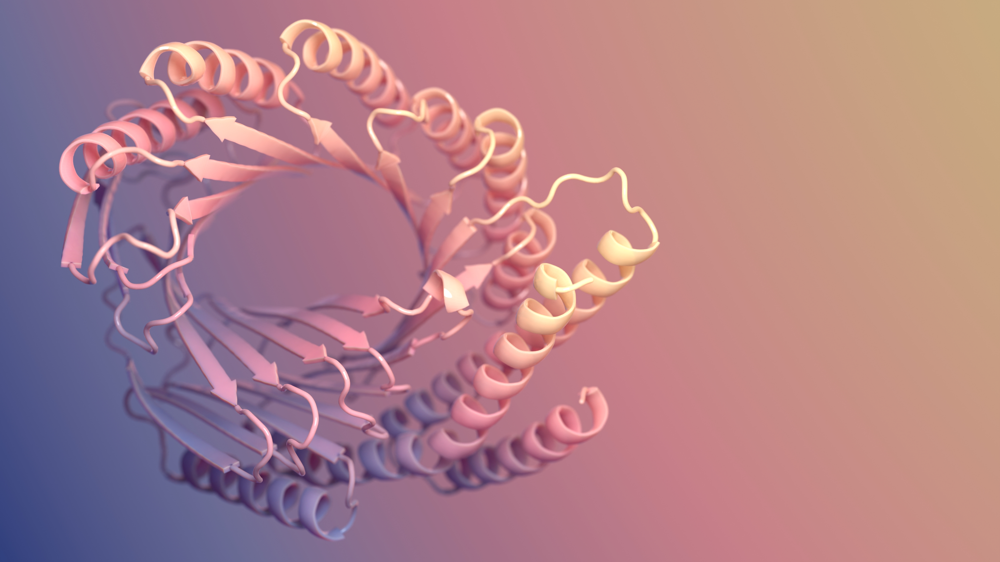
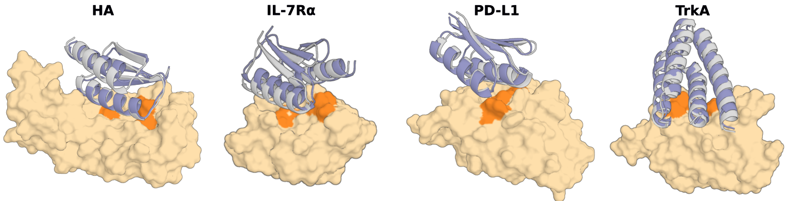
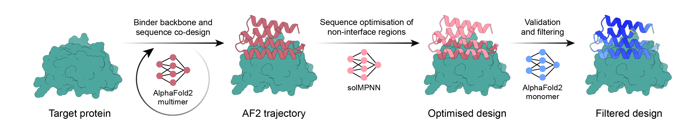

# AlphaFold이 접은 단백질을, 이제 AI가 처음부터 설계한다

_구조 예측을 넘어, 단백질 설계를 양산 공학으로 만든 건 더 큰 모델이 아니라 실측 데이터 루프였다_

## Executive Summary

> [!callout]
> AlphaFold이 "주어진 서열이 어떻게 접히는가"를 푸는 예측의 시대를 열었다면, 단백질 과학의 무게중심은 이제 "원하는 기능을 가진 단백질을 처음부터 짓는가"라는 생성(de novo)의 시대로 옮겨가고 있다. 이 글은 그 전환의 진짜 주인공이 똑똑해진 모델이 아니라고 본다. 핵심은 단백질 결합체(binder) 설계의 실험 성공률이 전통 방식의 1% 미만에서 최신 파이프라인의 수십 퍼센트로 뛰어, 설계가 운에 기대던 탐색에서 성공률을 예측·관리할 수 있는 양산형 공학으로 바뀌었다는 점이다.

> 무엇이 이 도약을 만들었나. 일반 테크 미디어는 "더 큰 생성 모델"이라 답하지만, 데이터는 다른 그림을 가리킨다. 결정적 레버는 파라미터가 아니라 설계·합성·측정·피드백이 도는 고품질 실측 데이터 루프였다. 실제로 단백질 적합도 예측에서는 일정 규모를 넘기면 더 큰 모델이 오히려 나빠지는 임계가 관측됐고, 정작 희소한 것은 모델이 아니라 실험으로 검증된 "정답" 데이터다. 다만 헤드라인 성공률은 표적에 따라 크게 출렁이므로, 이 글은 도약과 한계를 함께 본다.

> 이것은 페블러스가 데이터 품질 담론에서 줄곧 말해온 명제의 자연과학판 증명이다. AI가 가설과 설계를 스스로 만들기 시작한 시대에 인간 과학자에게 남는 일은 무엇인가 — 이 리포트의 답은, 그 일이 점점 더 무엇을 측정하고 어떤 데이터를 신뢰할지 결정하는 큐레이션으로 수렴한다는 것이다.

이 리포트의 뼈대는 아래 네 숫자다. 성공률의 도약(①), 그 도약이 줄인 실험 부담(②), 그럼에도 여전히 희소한 실측 데이터(③), 그리고 더 큰 모델이 답이 아님을 보여 주는 임계점(④) — 본문은 이 네 신호를 차례로 풀어 간다.

<!-- stat-card -->
**<1% → 수십%** — de novo 결합체 실험 성공률 — 전통 Rosetta 대비 약 2~3 자릿수 도약

<!-- stat-card -->
**타깃당 100개 미만** — 실험에 올리는 설계 후보 수 — 과거 수십만~수백만 스크리닝에서 급감

<!-- stat-card -->
**24만 vs 2억** — 실측 PDB 구조 vs 예측 구조 — 실측은 예측의 약 1/870 — 재료는 폭증, 정답은 희소

<!-- stat-card -->
**약 30억 파라미터** — 적합도 예측 성능의 임계 — 이 규모를 넘기면 더 큰 모델이 오히려 나빠진다

## 접는 AI에서 짓는 AI로

2021년 AlphaFold2가 단백질 구조 예측을 사실상 풀어낸 사건은 생명과학의 분수령이었다. 아미노산 서열만 넣으면 그 서열이 어떤 3차원 모양으로 접히는지를 실험 수준에 근접하게 맞혔다. 하지만 이 일은 본질적으로 자연이 이미 푼 답을 복원하는 작업이다. 진화가 수십억 년에 걸쳐 만들어 둔 단백질들의 서열–구조 대응을 모델이 학습해 재현한 것이다.

de novo 설계는 방향이 반대다. "이 표적에 달라붙는 단백질을 만들어 줘"처럼 원하는 기능을 먼저 정하고, 그 기능을 수행할 새로운 서열과 구조를 처음부터 생성한다. 자연에 존재한 적 없는 분자를 만들어 내는 일이므로, 정답 레이블이 미리 존재하지 않는다. 그래서 "맞게 만들었는가"는 오직 합성하고 실험해 보아야만 알 수 있다. 바로 이 지점에서 데이터 루프가 선택이 아니라 필연이 된다.

> [!callout]
> 예측은 채점표가 있는 시험이고, 생성은 채점표를 실험으로 직접 만들어야 하는 시험이다. 정답이 주어지지 않는 문제이기에, de novo 설계의 성능은 모델의 영리함만큼이나 "얼마나 많은 설계를 빠르고 정확하게 측정해 다시 학습으로 돌려보내는가"에 달려 있다.

*▲ 단백질 리본 다이어그램 — 나선·판·루프가 3차원으로 접힌 구조. 예측은 이 구조를 복원하지만, de novo 설계는 이런 구조를 처음부터 새로 만들어 낸다 | Source: [RosettaCommons/RFdiffusion](https://github.com/RosettaCommons/RFdiffusion)*

### 1.1. 방법의 계보 — 예측 모델이 생성 도구가 되기까지

오늘의 de novo 설계는 한 번에 등장하지 않았다. 구조를 읽던 도구들이 단계적으로 구조를 쓰는 도구로 전환됐다. 아래 계보는 그 흐름을 압축한 것이다.

| 연도 | 방법 | 역할 |
| --- | --- | --- |
| 2021 | AlphaFold2 | 서열 → 구조 예측. de novo 설계의 검증·필터 엔진으로 재활용된다. |
| 2022 | ProteinMPNN | 주어진 골격(backbone)에 맞는 서열을 설계. 안정성·발현율을 크게 끌어올렸다. |
| 2023 | RFdiffusion | 확산 모델로 새 골격을 생성. 결합체 설계 성공률을 100배 가까이 끌어올렸다. |
| 2024 | AlphaProteo | DeepMind의 결합체 생성 파이프라인. 표적별로 한 자릿수~88%의 성공률을 보고. |
| 2025 | BindCraft · ESM3 · RFdiffusion2 | 새 모델 학습 없이 기존 가중치를 영리하게 엮어 평균 수십 퍼센트 성공률을 달성. |

계보 정리: Jumper et al.(2021), Dauparas et al.(2022), Watson et al.(2023), Zambaldi et al.(2024), Pacesa et al.(2025).

*▲ RFdiffusion 확산 과정 — 순방향(노이즈 추가)과 역방향(단백질 구조 생성)이 쌍을 이루며, 역방향이 de novo 설계의 엔진이 된다 | Source: [RosettaCommons/RFdiffusion (Watson et al., 2023)](https://github.com/RosettaCommons/RFdiffusion)*

## 성공률, 운이 아니라 계획이 되다

단백질 설계가 "공학"이 되었다는 말의 가장 구체적인 증거는 성공률(hit rate)이다. 성공률은 설계해서 실제로 합성·실험한 단백질 가운데 의도한 기능, 이를테면 표적 결합을 실험적으로 보인 비율이다. 이 숫자가 안정적으로 올라가고 예측 가능해질 때, 설계는 "운이 좋으면 하나 건진다"는 탐색에서 "몇 개를 만들면 몇 개가 작동한다"고 계획할 수 있는 양산 공정으로 바뀐다.

전통적인 Rosetta 기반 설계의 실험 성공률은 통상 1% 미만이었고, 항체 같은 까다로운 분자는 0.1%에도 못 미쳤다. 2023년 RFdiffusion은 약 19%의 in vitro 성공률로 기존 대비 두 자릿수 배의 도약을 보였고, 2024년 AlphaProteo는 표적별로 한 자릿수에서 88%까지, 2025년 BindCraft는 평균 약 30~50%대를 보고했다. 아래는 그 변화를 한눈에 보여주는 비교다.

<!-- stat-card -->
**전통 Rosetta (~2021)< 1%** — RFdiffusion (2023, in vitro)~19% — AlphaProteo (2024, 표적별)9~88% — BindCraft (2025, 평균)약 30~50% — 막대는 보고된 대표 수치를 시각화한 것으로, 측정 기준이 서로 다르므로 절대 비교가 아닌 추세로 읽어야 한다.

성공률 상승은 스크리닝 부담의 급감으로도 나타난다. 과거에는 수십만에서 수백만 개 후보를 만들어 거르는 식이었지만, 이제는 표적당 100개 미만의 설계만 실험에 올려도 작동하는 분자를 얻는 사례가 늘었다. 만드는 양이 줄고 맞는 비율이 오르는 것, 그것이 공학화의 본질이다.

*▲ RFdiffusion이 처음부터 설계한 단백질 결합체(파란 나선) — HA·IL-7Rα·PD-L1·TrkA 표적(황색)에 각각 결합한다. 자연에 없던 분자들이 in vitro에서 실제로 작동했다 | Source: [RosettaCommons/RFdiffusion (Watson et al., 2023)](https://github.com/RosettaCommons/RFdiffusion)*

### 2.1. 헤드라인 숫자의 함정 — 표적 의존성과 측정 층위

그러나 "양산형 공학"이라는 서사를 단일 숫자로 못 박는 순간 과장이 시작된다. 성공률은 표적에 따라 크게 출렁인다. 같은 파이프라인이라도 BHRF1 같은 표적에서는 88%에 이르지만, HER2처럼 까다로운 표적에서는 10% 안팎으로 떨어지고, TNFα 같은 일부 표적에서는 사실상 실패한다는 반박 연구도 있다. 모델 개발에 사용된 표적은 성공률이 부풀려질 수 있다는 점도 저자들 스스로 인정한다.

측정 층위도 구분해야 한다. 같은 RFdiffusion이라도 실제 실험(in vitro)에서의 약 19%와, 계산상 지표(in silico)로 추산한 3% 수준은 전혀 다른 차원의 수치다. 컴퓨터 안에서 좋아 보이는 설계가 시험관에서도 작동한다는 보장은 없으며, 계산 지표는 실제 친화도와 잘 맞지 않는 불완전한 대리 지표일 뿐이다. 이 글이 성공률을 척추로 삼되 늘 범위와 단서를 붙이는 이유가 여기에 있다.

- •**표적 의존성**: 헤드라인 성공률은 쉬운 표적에서 나온 경우가 많다. 실전 난이도 표적에서는 한 자릿수로 떨어진다.
- •**측정 층위**: in vitro와 in silico 수치를 직접 비교하면 안 된다. 실험 검증만이 진짜 성공률이다.
- •**평균의 함정**: "평균 46%"와 "전체 설계 중 30.7%가 작동"은 측정 기준이 달라, 폭으로 제시하는 편이 정직하다.

## 루프가 닫히는 자리 — 설계·합성·측정·피드백

성공률을 끌어올린 메커니즘을 한 단어로 줄이면 "루프의 회전 속도"다. 설계(Design)하고, 합성(Make)하고, 측정(Test)하고, 그 결과를 분석(Analyze)해 다음 설계로 돌려보내는 DMTA 사이클이 얼마나 빠르고 정확하게 도는가가 성능을 좌우한다. 이 루프가 닫혀 있을 때, 모델은 자기 설계의 실패와 성공을 실험으로 배워 점점 나아진다.

아래는 그 네 단계가 어떻게 맞물려 도는지를 단순화한 그림이다. 각 단계는 다음 단계의 입력을 만들고, 마지막 분석 결과는 다시 설계 모델로 환류된다.

<!-- stat-card -->
**① 설계** — 생성 모델이 후보 단백질을 만든다

<!-- stat-card -->
**② 합성** — 바이오파운드리가 자동으로 만든다

<!-- stat-card -->
**③ 측정** — 친화도·발현·안정성을 잰다

<!-- stat-card -->
**④ 분석·환류** — 결과를 다음 설계로 되먹인다

↻   측정된 데이터가 다시 ①로 — 루프가 닫힐수록 성공률이 오른다

전통적인 DMTA 사이클은 한 바퀴 도는 데 수년이 걸렸다. AI 설계와 바이오파운드리가 결합하면서 이 주기는 수주로 줄었다. 무세포(cell-free) 합성과 고처리량 발현 같은 자동화 기술은 하루에 수천 개 변이체를 처리하고, SAMPLE 같은 자율 실험실(self-driving lab)은 한 라운드를 9~10시간에 끝낸다. RFdiffusion2를 쓴 자율 실험실 사례에서는 단 2라운드, 96개 설계만에 최고 성능 결합체에 도달했고, 산업용 효소 개발에서는 단 2회의 DBTL 사이클로 활성이 최대 26배 향상됐다.

> [!callout]
> 루프가 빨라진다는 것은 곧 실측 데이터가 쌓이는 속도가 빨라진다는 뜻이다. 그리고 그 데이터가 다시 모델을 정렬하므로, 회전이 빠른 실험실은 단지 일을 빨리 하는 것이 아니라 더 똑똑해지는 모델을 가진다. 자동화의 진짜 산출물은 결과물 단백질이 아니라, 양질의 라벨이 붙은 데이터다.

## 성공률을 정하는 건 라벨 품질이다

이 리포트가 가장 힘주어 말하려는 대목이 여기다. 성공률을 끌어올린 결정적 레버는, 결국 더 큰 모델이 아니라 데이터였다. 가장 직접적인 증거는 BindCraft다. BindCraft는 새 모델을 학습시키지 않았다. AlphaFold2의 가중치를 재활용하고, 설계를 다시 접어 보는 필터를 영리하게 끼워 넣는 파이프라인 개선만으로 10배 이상의 성공률을 얻었다. 모델 규모는 그대로였고, 바뀐 것은 데이터를 다루는 방식이었다.

반대 방향의 증거도 있다. 단백질 적합도(fitness) 예측에서는 약 30억 파라미터를 넘기면 표준 벤치마크 성능이 오히려 나빠지는 임계가 관측된다. 단백질 언어 모델 연구(AMPLIFY)는 데이터 품질 개선만으로 기존 기반 모델보다 훨씬 작고 저렴하게 최고 성능에 도달했다고 보고하며, "규모가 곧 성능"이라는 가정은 거짓일 가능성이 높다고 명시한다. 또 다른 연구(FLIGHTED)는 생체분자 설계 모델이 파라미터보다 가용 데이터에 의해 더 제약된다고 직접 진술한다.

그렇다면 그 귀한 데이터는 충분한가. 아니다. 실험으로 검증된 PDB 구조는 약 24만 개인 반면, AlphaFold가 예측한 구조는 2억 개가 넘는다. 모델에 먹일 재료(예측)는 870배 가까이 폭증했지만, 성공의 정답이 되는 실측 데이터는 그 1/870 수준에 머문다. 아래 대비가 이 비대칭을 그대로 보여준다.

<!-- stat-card -->
**약 24만** — 실험 검증 구조 (RCSB PDB) — 결정화 가능한 단백질에 편향, 음성 데이터 거의 없음

<!-- stat-card -->
**약 2억+** — 예측 구조 (AlphaFold DB) — 대부분 실험 검증이 없는 예측값

*▲ BindCraft 파이프라인 — 새 모델 학습 없이 AlphaFold2 가중치 재활용과 파이프라인 설계만으로 평균 수십 퍼센트 성공률을 달성했다 | Source: [BindCraft (Pacesa et al., 2025)](https://github.com/martinpacesa/BindCraft)*

데이터의 양만 문제가 아니다. 품질의 결이 더 결정적이다. PDB는 결정화가 잘 되는 구형 단백질에 편향되어 막단백질이나 무질서 단백질은 과소 대표되고, 특정 패밀리는 과다 대표된다. 더 치명적인 것은 음성 데이터의 부재다. PDB에는 "결합에 실패한" 사례가 거의 없어, 모델이 무엇이 작동하지 않는지를 배우지 못한다. 실패의 기록이 없으면 모델은 분포 밖의 새 표적에서 쉽게 헛디딘다.

그리고 데이터가 부족하니 예측 구조를 학습에 다시 쓰려는 유혹이 생긴다. 하지만 AlphaFold가 만든 예측을 라벨로 재사용하면 모델의 아티팩트가 다음 모델로 그대로 전파된다(self-distillation). 측정 표준화가 없는 친화도 값들도 노이즈를 키운다. 이 모든 결함은 DataClinic이 분류 데이터에서 다뤄 온 문제 — 라벨 오류, 클래스 불균형, 측정 편향 — 와 정확히 같은 구조다. garbage in, garbage out은 단백질에서도 그대로 성립한다.

> [!callout]
> 모델이 아니라 라벨의 정밀도·다양성·균형이 일반화의 한계를 정한다. 성공률의 천장은 파라미터 수가 아니라, 그 모델이 학습하고 정렬되는 실측 데이터의 품질이 결정한다. 이것이 AI-Ready 데이터 테제가 단백질 설계라는 가장 물리적인 도메인에서 다시 확인되는 지점이다.

## AI가 가설을 만드는 시대, 인간은 데이터를 큐레이션한다

앞으로 성공률을 더 끌어올릴 레버는 무엇일까. 학계가 지목하는 답도 더 큰 모델이 아니다. 실험실에서 축적되는 lab 유래 데이터로의 재학습(retraining)과 정렬(alignment)이다. 모든 규모의 모델은 실측 데이터로 정렬될 때 적합도 예측과 생성이 함께 좋아진다. 그리고 큰 모델일수록 그 정렬에서 가장 큰 이득을 본다. 다시 말해 파라미터를 키우는 일이 의미를 가지려면, 그 위에 실측 정렬 루프가 반드시 얹혀 있어야 한다.

이 구조는 인간 과학자의 일을 줄이는 것이 아니라 이동시킨다. AI가 가설과 설계를 쏟아낼수록, 무엇을 먼저 측정할지 정하고, 어떤 데이터를 신뢰할지 판단하고, 실패를 어떻게 기록할지 설계하는 일의 가치가 올라간다. 표적의 우선순위를 정하는 것, 측정 프로토콜을 표준화하는 것, 음성 데이터를 버리지 않고 라벨링하는 것 — 이것은 모두 데이터 큐레이션이다.

자본 시장도 같은 방향을 가리킨다. Baker 연구실에서 갈라져 나온 Xaira Therapeutics는 wet-lab 자동화 통합을 핵심으로 내세워 바이오AI 역대 최대 규모인 10억 달러대 시드를 모았고, Generate:Biomedicines와 EvolutionaryScale 같은 기업들도 자체 실측 데이터와 자동화를 경쟁 우위로 내세운다. 무엇보다 새 모델 없이 데이터 파이프라인만 손본 BindCraft가 Merck·Roche·노보 노디스크·노바티스·아스트라제네카 같은 대형 제약사에 빠르게 채택됐다는 사실은, 경쟁의 무게중심이 이미 모델에서 데이터로 옮겨갔음을 단적으로 보여준다. 시장 규모 추정치는 기관마다 편차가 크지만, 베팅의 방향은 일관된다. 해자(moat)는 모델이 아니라 자체적으로 생성하는 양질의 실험 데이터에 있다는 것이다.

그러니 "AI가 과학을 한다"는 문장은 절반만 맞다. AI는 가설을 빠르게 만들지만, 그 가설이 의미 있는 발견으로 이어지려면 무엇을 측정하고 무엇을 신뢰할지 결정하는 사람이 필요하다. AI가 설계를 자동화할수록, 인간의 일은 발견의 속도를 정하는 데이터의 품질을 지키는 쪽으로 수렴한다.

<!-- stat-card -->
**EDITOR'S NOTE — 페블러스의 시선** — 우리가 데이터 품질 담론에서 줄곧 말해 온 명제 — 모델 성능의 상한은 데이터가 정한다 — 가 단백질 설계라는 가장 물리적인 도메인에서 다시 확인됐다는 점이 흥미롭다. 친화도 측정 오차와 음성 데이터의 부재가 설계 모델의 일반화를 무너뜨리는 구조는, DataClinic이 분류 데이터에서 다뤄 온 라벨 품질 문제와 본질적으로 같다. 로봇 자동 실험실이 물리 세계에서 데이터를 만들어 되먹이는 그림은 Physical AI 담론과도 맞닿는다. 이 글은 특정 솔루션의 광고가 아니라, "과학에서도 AI-Ready 데이터가 발견 속도의 상한을 정한다"는 관찰의 기록이다.

## 참고문헌

### 학술 논문

- 1.Watson, J. L. et al. (2023). "De novo design of protein structure and function with RFdiffusion." _Nature_ 620, 1089–1100. [doi:10.1038/s41586-023-06415-8](https://doi.org/10.1038/s41586-023-06415-8)
- 2.Dauparas, J. et al. (2022). "Robust deep learning–based protein sequence design using ProteinMPNN." _Science_ 378, 49–56. [doi:10.1126/science.add2187](https://doi.org/10.1126/science.add2187)
- 3.Jumper, J. et al. (2021). "Highly accurate protein structure prediction with AlphaFold." _Nature_ 596, 583–589. [doi:10.1038/s41586-021-03819-2](https://doi.org/10.1038/s41586-021-03819-2)
- 4.Zambaldi, V. et al. (2024). "De novo design of high-affinity protein binders with AlphaProteo." _Nature Biotechnology_. [arXiv:2409.08022](https://arxiv.org/abs/2409.08022)
- 5.Pacesa, M. et al. (2025). "BindCraft: one-shot design of functional protein binders." _Nature_ 646, 483–492. [doi:10.1038/s41586-025-09429-6](https://doi.org/10.1038/s41586-025-09429-6)
- 6.Hayes, T. et al. (2025). "Simulating 500 million years of evolution with a language model (ESM3)." _Science_. [doi:10.1126/science.ads0018](https://doi.org/10.1126/science.ads0018)
- 7.Varadi, M. et al. (2024). "AlphaFold Protein Structure Database in 2024: providing structure coverage for over 214 million protein sequences." _Nucleic Acids Research_ 52, D368–D375. [doi:10.1093/nar/gkad1011](https://doi.org/10.1093/nar/gkad1011)
- 8.Fournier, Q. et al. (2024). "Protein Language Models Are Biased by Labeling Choices: AMPLIFY, a Fair and Efficient Protein Encoder." _bioRxiv_. [bioRxiv:2024.09.23.614603](https://www.biorxiv.org/content/10.1101/2024.09.23.614603)
- 9.FLIGHTED Research Group (2024). "FLIGHTED: Inferring Fitness Landscapes from High-Throughput Experimental Data." _bioRxiv_. [bioRxiv:2024.03.26.586797](https://www.biorxiv.org/content/10.1101/2024.03.26.586797)

### 리뷰·해설

- 10.Maffone et al. (2026). "The latest AI breakthroughs in structural biology: protein binder design and conformational state prediction." _Communications Biology_. [doi:10.1038/s42003-026-10112-3](https://www.nature.com/articles/s42003-026-10112-3)
- 11.Nature News (2026). "AI is learning to design proteins from scratch." _Nature_. [nature.com/articles/d41586-026-01820-1](https://www.nature.com/articles/d41586-026-01820-1)
- 12.Nature Editorial (2026). "AI for discovery" (immersive feature). _Nature_. [nature.com/immersive/aifordiscovery](https://www.nature.com/immersive/aifordiscovery/index.html)

### 데이터베이스·통계

- 13.RCSB PDB (2025). "RCSB Protein Data Bank — PDB Statistics." [rcsb.org/stats](https://www.rcsb.org/stats)
