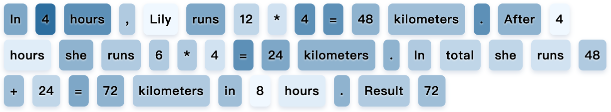
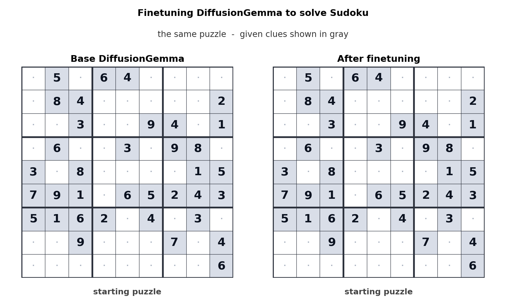

# The AI That Writes All at Once — How Diffusion Models Reshape Text Generation and the Bar for Data Quality

_The paradigm shift from autoregressive to diffusion, seen through Google_

## Executive Summary

> [!callout]
> DiffusionGemma, the experimental open model Google released on June 10, 2026, abandons a habit that nearly every large language model has followed. Instead of committing text one token at a time from left to right, it unrolls a blank 256-token canvas all at once and refines it repeatedly, the way a blurry draft is sharpened into a clear one. In effect, it brings the mechanism of image-generation models to words. The headline was "up to 4× faster," but the question this report asks lies underneath it: when the way text is generated changes at the root, does the quality bar for the data that feeds the model change with it?

> Speed is not free. DiffusionGemma trails its autoregressive peer Gemma 4 on nearly every benchmark, and the size of the gap swings wildly by task. On language and general knowledge it is narrow (5.0 points on MMLU Pro), but on multi-step mathematical reasoning (AIME 2026) it widens to 19.2 points. Conversely, on tasks that fill in blanks out of order, such as code infilling or mid-sentence editing, diffusion is actually stronger. The speed is not a blanket advantage; it is a conditional gain that pays off only on certain tasks.

> Through the lens of data, the most interesting signal is efficiency. LLaDA 8B, a precursor in the diffusion family, matched LLaMA3 8B on MMLU using just 2.3 trillion training tokens, far below the 15 trillion LLaMA3 was trained on. With the moment when internet text fails to keep up with compute supply now projected for around 2028, the trait of "squeezing more out of the same data" reaffirms, in a new architecture, the proposition that data quality sets the ceiling on model quality. Whether diffusion is more sensitive to data noise than AR, however, remains an open question with no direct comparative study yet. One thing is clear: whatever the architecture, undiagnosed data defects flow straight into the model.

<!-- stat-card -->
**Up to 4×** — Generation speed — 1,000+ tok/s on H100 vs. peer AR Gemma 4 (low concurrency)

<!-- stat-card -->
**26B→3.8B** — Active parameters — MoE design runs in 18GB VRAM on a consumer GPU

<!-- stat-card -->
**256 tokens** — Per forward pass — Refines the whole canvas at once where AR writes one token

<!-- stat-card -->
**-5.0pt** — MMLU Pro gap — The price of speed: 77.6 vs 82.6 (vs peer Gemma 4)

## From One Token to All at Once — How Diffusion Generates Text

Most language models, ChatGPT included, write the way someone takes dictation. They settle on the first word, condition the next word on it, then condition the third on the first two. Words already written are never reconsidered. This is the autoregressive (AR) approach, and in formal terms it factorizes the probability of a whole sentence into a chain of conditional probabilities over the preceding tokens.

$$p(x_1, x_2, \dots, x_n) = \prod_{i=1}^{n} p(x_i \mid x_1, \dots, x_{i-1})$$

Eq. 1. The AR factorization of sentence probability — tokens generated one by one, left to right.

A diffusion language model builds text differently. Like a painter who lays down a faint outline on a blank canvas and sharpens the form through repeated passes, it starts with an entire 256-token block held in a masked (hidden) state. The model then estimates all the hidden positions at once, commits the tokens it is most confident about first, and repeats — refilling what remains. Rather than one character at a time, it makes the whole screen a little sharper with each pass.

### 1.1 Training Masks, Inference Restores

This borrows the two-stage structure of image diffusion models directly. During training (the forward process), a clean sentence has more and more of its tokens progressively hidden. At inference (the reverse process), it goes the other way: starting from a fully masked state and unmasking one step at a time. Where images "add and remove noise," text "hides and restores tokens." DiffusionGemma typically repeats this refinement 12–16 times (up to 48), committing the 15–20 tokens it is confident enough about at each step.

### 1.2 Bidirectional Attention — The Back Fixes the Front

The most fundamental difference between the two approaches is the direction of attention. AR uses causal attention, so each token sees only what comes before it. Diffusion uses bidirectional attention, so every token sees both directions. That means a word destined for the end of a sentence can reach back and revise a choice made at its start. This "see and fix the whole thing at once" property is the spine holding up every comparison in this report. Where the speed comes from (Section 3) and how data is represented differently (Section 4) both diverge from exactly here.

AUTOREGRESSIVE

#### Dictation

Commits tokens one at a time, left to right. Causal attention (sees only backward). Written tokens cannot be revised. One token per forward pass.

DIFFUSION

#### Filling in blanks

Refines the whole canvas iteratively from a masked state. Bidirectional attention (sees both directions). Can re-estimate at each step. Many tokens per forward pass.

*▲ LLaDA training (a) and inference (b, c) — (a) independent token masking, (b) response masking at inference, (c) iterative refinement step | Source: [LLaDA (arXiv:2502.09992)](https://arxiv.org/abs/2502.09992)*

Let us clear up one misconception. Saying diffusion is "parallel for free" is not quite right. It sees 256 tokens at once, but completing that block requires many refinement steps — that is, 12–48 forward passes. The speed gain only materializes when this number of passes is far smaller than the number of tokens. Exactly when that condition holds is what Section 3 works out.

## Anatomy of DiffusionGemma — 26B Packed into 18GB

DiffusionGemma's specs speak to its design intent on their own. It is a Mixture-of-Experts (MoE) model with 26B total parameters, but only 3.8B actually activate on any single forward pass: a structure that calls just 8 of 128 experts. As a result, with 4-bit floating-point quantization (NVFP4) it fits inside 18GB of VRAM and runs on a single consumer GPU like an RTX 5090. Despite its small footprint it handles a 256K-token long context and multimodal input (text, image, and video, trained across 140-plus languages), so this is not a model that traded away capability to hit a size target. The message "run it on your desk, not in the cloud, one user at a time" is carved into the numbers.

| Item | Value | Meaning |
| --- | --- | --- |
| Total / active parameters | 26B / 3.8B | MoE 8-of-128 experts + 1 shared |
| VRAM (quantized) | 18GB | NVFP4 + FP8, a single consumer GPU |
| Parallel generation block | 256 tokens | The canvas one forward pass handles |
| Context length | 256K tokens | Sliding window 1,024 |
| Refinement steps | 12–16 (up to 48) | Adaptive stopping (entropy-based) |
| Base model | Gemma 4 family | Draws on Gemini Diffusion research |
| Multimodal | Text, image, video input | Text output, trained on 140+ languages |
| License | Apache 2.0 | Commercial use allowed, training cutoff 2025-01 |

********************************

### 2.1 How Fast Is It, GPU by GPU?

The throughput Google reported is over 1,000 tokens per second on an H100 and over 700 on an RTX 5090. The vLLM team, verifying independently, reported 1,107 tok/s on an H100 (FP8, batch=1) and 1,288 tok/s on an H200. Set against the peer AR Gemma 4 (26B), which sits around 303 tok/s under the same batch=1 condition, the felt difference is clear. The figures below are all at batch=1 — a low-concurrency setting where one user sends one request.

| Hardware | Throughput (tok/s) | Condition · Source |
| --- | --- | --- |
| H100 | 1,000+ ~ 1,107 | FP8, batch=1 · Google / vLLM |
| H200 | 1,288 | FP8, batch=1 · vLLM |
| RTX 5090 | 700+ | Consumer GPU · Google / NVIDIA |
| DGX Station | up to 2,000 | NVIDIA announcement (~800 also cited) |
| (reference) AR Gemma 4 26B | ~303 | low batch · cited by the-decoder |

****

One thing to watch is that the quantization format is NVFP4. It is easy to confuse with the NF4 seen in some coverage, but NVFP4 is NVIDIA's format that handles both weights and activations as 4-bit floating point. This distinction directly affects accuracy and the hardware acceleration path, so it must be kept straight when deploying the model.

## Where the Speed Comes From, and What It Gives Up

The root of "4× faster" is which GPU resource the model is bound to. An AR model must re-read its enormous weights from memory for every single token it produces. In a low-batch setting the GPU's compute units mostly sit idle, and the bottleneck is memory bandwidth (memory-bandwidth-bound). Diffusion, by contrast, computes 256 positions at once and fills those compute units. The bottleneck shifts to compute capacity (compute-bound). It gets more work done per single memory read.

### 3.1 A Hardware Tailwind

This structural difference matters because the direction hardware is evolving favors diffusion. From 2012 to 2022, GPU compute (FLOPS) grew roughly 80×, while memory bandwidth grew only 17×. Compute became abundant, bandwidth relatively scarce. Bandwidth-bound AR loses ground as this gap widens; compute-bound diffusion gains. In other words, the faster future GPUs get, the larger diffusion's relative advantage becomes.

> [!callout]
> That gain has a clear boundary, though. "Up to 4×" is the official figure for the low-concurrency case of one person sending one request. In high-QPS cloud serving, where many requests are batched together, AR also fills its compute units, and diffusion's edge steadily erodes. While many studies report "the advantage vanishes or reverses at high batch," others — like Fast-dLLM v2 — report holding 1.5–1.8× even at high batch with a well-built acceleration stack. The conclusion is that it depends heavily on the acceleration stack and decoding strategy, and that on unified memory like Apple Silicon the same acceleration does not appear.

### 3.2 The Price Is Quality — but It Varies by Task

DiffusionGemma scores below Gemma 4 on nearly every benchmark. The point is not that it is "weaker overall" but how the gap is distributed. On tasks that grab an outline in one pass — language, general knowledge — the difference is narrow, around 5 points. But on tasks where logic must be built one step at a time — multi-step math like AIME, or long-context consistency — the gap widens sharply. The strength of seeing the whole thing at once flips into a weakness in sequential reasoning.

DiffusionGemma's gap vs. peer Gemma 4 (longer bar = larger deficit, in percentage points)

MMLU Pro (language · general knowledge)-5.0

LiveCodeBench v6 (code)-8.0

GPQA Diamond (science reasoning)-9.1

MRCR v2 (long context, 128k)-12.1

AIME 2026 (multi-step math)-19.2

*▲ LLaDA sampling on a math problem — darker tokens are higher confidence. Confidence rises across the whole canvas simultaneously, not left to right | Source: [LLaDA (arXiv:2502.09992)](https://arxiv.org/abs/2502.09992)*

The interesting reversal is on "non-sequential" tasks. On work that requires seeing context on both sides at once — infilling a blank in the middle of code, in-line editing the middle of an already-written document — diffusion is actually the more natural fit. AR, seeing only to the left, is structurally disadvantaged at "knowing the back and filling in the middle." That is precisely why Google, while pinning DiffusionGemma down as "for research and experimentation, not production," listed code infilling and inline editing as recommended use cases.

> [!callout]
> In short, DiffusionGemma's speed is not a universal ticket but a matter of task selection. In low-concurrency, local environments, on fill-in-the-blank tasks, both speed and quality are reasonable. For tasks where precise instruction-following or long-context consistency matters, an AR model is still the safer choice.

## Do the Data-Quality Rules Actually Change?

Now we return to this report's central question: when the generation method changes, does the data-quality bar change too? Answered honestly, it splits in two. That diffusion uses data more efficiently is an established signal; whether it is more sensitive to data noise is still an open question. Mixing the two becomes overstatement, so we keep them visually separate as well.

### 4.1 Data Efficiency Is Already an Established Signal

The firmest evidence is LLaDA 8B. This diffusion model trained on just 2.3 trillion tokens and was effectively even with LLaMA3 8B, which trained on 15 trillion, on MMLU, 65.9 to 65.4. The same performance, on one-sixth the data. More striking is its behavior under data constraints. When the same data is trained over repeatedly, the AR model stalls into overfitting around 14,000 steps, while the diffusion model keeps improving monotonically past 20,000. One study dubbed this a "super data learner" — a diffusion language model that absorbs data more thoroughly.

The character of that efficiency compresses into three numbers: matching scores on less data (2.3T ≈ 15T), generation far less monotonous in its diversity (93.4% first-word uniqueness), and a retention rate on the reverse reasoning that AR so often trips over (88%). If the first is direct evidence of efficiency, the latter two are clues that the efficiency stems from a structure that represents data differently. What that structure is, we see in the very next subsection.

<!-- stat-card -->
**2.3T ≈ 15T** — Data efficiency — LLaDA 8B matches MMLU on one-sixth the tokens

<!-- stat-card -->
**93.4%** — Generation diversity — MDLM first-word uniqueness; AR is 3.3%

<!-- stat-card -->
**88% vs 41%** — Reverse reasoning retention — LLaDA beats the reversal curse (GPT-4o 41%)

The point at which internet text fails to keep pace with compute supply is projected for around 2028. From then on, the value of "squeeze more from the data you have" rises above "gather more data." That is the macro backdrop for the attention on data-efficient diffusion. This is not free, of course. To reach the same validation loss in a single epoch, diffusion can demand up to 16× more compute. It is a trade-off that favors a world where data is scarce and compute is plentiful.

*▲ LLaDA 8B (pink) matches LLaMA3 8B (blue) across benchmark dimensions — 2.3T tokens versus 15T, with a similar radar footprint | Source: [LLaDA (arXiv:2502.09992)](https://arxiv.org/abs/2502.09992)*

### 4.2 Bidirectional Structure Represents Data Differently

Beyond efficiency, there is another quantitative signal: text diversity. An AR model produces a unique first word in only 3.3% of its generated sentences, whereas a masked diffusion model (MDLM) reaches 93.4%. AR is fluent but monotonous; diffusion is diverse but uneven in consistency. There is also a difference on the "reversal curse" that AR is weak at — the phenomenon where a model that learned "A is B" cannot answer "what is B." LLaDA held a reverse score of 88% while GPT-4o dropped to 41%. It is evidence that a structure seeing the whole at once inscribes the global relationships in data into its internal representation in a way different from AR.

### 4.3 Noise Sensitivity Is Still an Open Question

So is diffusion more sensitive to data noise? Intuitively, it seems likely. Since the learning objective is to restore masked positions, there is reason to think it reacts differently to defects like label mismatch or duplication. But intuition and evidence diverge. No study has directly compared the noise sensitivity of AR and diffusion. What follows honestly separates what is established from what remains open.

#### Established facts

- • Parallel token updates theoretically create a "hard constraint-satisfaction (CSP hard phase)" regime, so training loss cannot converge to zero (Kim et al. 2025).
- • Sampling quality is sensitive to the denoiser's robustness and calibration.
- • Clipping the noise schedule to reduce variance directly improves perplexity.

#### Open questions

- • On the same noisy data, which collapses more — AR or diffusion? No direct comparative study exists.
- • Quantifying how global-consistency defects (document-level factual contradictions) affect bidirectional training.
- • By task type, which defects are more fatal in which architecture.

> [!callout]
> So the honest answer right now to "does the data-quality bar change" is this: the proposition that quality sets the ceiling on model quality remains fully valid. What changes is which dimension of quality — diversity, consistency, noise, balance — matters more, and that depends on the task and the architecture. The bar is not discarded; its priorities are reordered. It is exactly here that the question "must AI-Ready Data be architecture-neutral?" first gains practical weight.

## Experiment or Turning Point? The Diffusion-LM Lineage

DiffusionGemma did not appear out of nowhere. It is one link in a lineage: SEDD and MDLM (2024), which laid the theoretical foundation for discrete diffusion; LLaDA (February 2025), which narrowed the gap with AR at the 8B scale; Block Diffusion, which added length flexibility; LLaDA-MoE (September 2025), the first MoE diffusion model; and the commercial services Mercury and Gemini Diffusion. And waiting behind it is the 100B-scale LLaDA 2.0.

2024**SEDD · MDLM** — the theoretical foundation of discrete-space diffusion. Solved "how do you define a score in categorical space."

2025-02**LLaDA 8B** — narrowed the MMLU gap with AR to 0.5pt. Selected as a NeurIPS 2025 Oral.

2025-09**LLaDA-MoE-7B-A1B** — the first MoE diffusion model. Direct precursor to DiffusionGemma's 26B/3.8B structure.

2025–2026**Mercury · Gemini Diffusion** — commercialization. Mercury 2 runs at ~1,000 tok/s for $0.25 input / $0.75 output per million tokens.

2026-06**DiffusionGemma** — Google's first open diffusion model. Same-day support for vLLM, Transformers, Unsloth, and MLX at launch.

2026–**LLaDA 2.0-flash (100B)** — signs of surpassing AR on coding benchmarks (per announcement; independent verification not confirmed).

### 5.1 Does Scale Close the Gap?

The best signal for gauging maturity is what happens when you scale up. LLaDA 2.0-flash, the 100B MoE model released by Ant Group, reports beating its AR peer on coding and agentic benchmarks: HumanEval 94.51% to 93.29%, MBPP 88.29% to 86.65%, and a 4.2-point edge on MultiPL-E. That said, these figures are Ant Group's own announcement with no confirmed independent verification, so it is safest to take them as "a signal that it has begun surpassing AR in specific domains."

### 5.2 A Day-Zero Ecosystem, and Inference That Moved to Your Desk

*▲ DiffusionGemma Sudoku finetuning — the diffusion fill-in-the-blank structure applies naturally to constraint-satisfaction problems | Source: [Google Blog, 2026](https://blog.google/innovation-and-ai/technology/developers-tools/diffusion-gemma-faster-text-generation/)*

From launch day, DiffusionGemma had support from vLLM (the first native diffusion-LM support), HuggingFace Transformers, Unsloth, MLX, SGLang, and NVIDIA NeMo/NIM. A tooling ecosystem ready at the same time means the cost of experimentation is low. And running a 26B-class model locally in 18GB of VRAM lands directly on on-device, low-concurrency inference — edge and Physical AI scenarios. A model that delivers fast responses from the GPU on your desk, with no cloud round trip, carries a different value where the network is unstable or latency is critical.

> [!callout]
> So the question "is now the time to bet?" suits a measured answer. The gap on general reasoning still remains, so a wholesale switch is premature. But progressively adopting diffusion for the tasks where it is structurally favored — code infilling, inline editing, low-latency local inference — is entirely reasonable. The length of the lineage and the direction of the hardware trend both back this choice.

## The Pebblous View — The Question That Survives the Architecture Change

While the speed headline blankets the market, the concern of someone who works with data lies elsewhere: does the training data I am refining and diagnosing right now remain an asset even after the architecture shifts from AR to diffusion? The evidence this report has followed answers, "yes — with one condition."

### 6.1 Where Data-Quality Diagnosis Stands

A diffusion model takes restoring masked data as its learning objective. That opens the possibility it reacts differently from AR to noise, label mismatch, and duplication in training data. But, as written honestly above, this is plausibility, not establishment. So the value of diagnosing and correcting data defects does not vanish when the architecture changes — it instead expands into a new question: "which defects are more fatal in which architecture?" Add to this that data efficiency (squeezing more from the same data) becomes a competitive edge in an era of data scarcity.

### 6.2 Where It Touches Practical Decisions

- •**Data pipeline owners:** the core value of cleaning, deduplication, and quality diagnosis holds regardless of architecture. But the priority of dimensions diffusion handles differently — diversity, global consistency — is worth re-examining.
- •**Inference infrastructure owners:** the shift to compute-bound changes GPU selection. With diffusion, the bandwidth premium of an H200 matters less and raw compute weighs more. It also directly affects edge-deployment decisions.
- •**Technical decision-makers:** the realistic call right now is task-by-task gradual adoption, not an all-in bet. Drawing the boundary between the tasks diffusion is strong and weak at, with data, lets you split the risk of the bet into smaller pieces.

> [!callout]
> Reduced to one sentence: whatever the architecture, data quality sets the ceiling on model quality. Diffusion is not a case that discards this old proposition but one that reaffirms it from a new angle. The bar does not disappear; only which bar you look at first changes.

**Editor's Note.** Through DataClinic, which diagnoses and corrects data quality, and PebbloSim, which simulates synthetic data, Pebblous has been measuring the causal link between training data and model quality. The "architecture-neutral data quality" question this report addresses is a continuation of that work.

## References

### Primary Sources & Industry

- 1.Google. (2026, June 10). [DiffusionGemma: Faster Text Generation](https://blog.google/innovation-and-ai/technology/developers-tools/diffusion-gemma-faster-text-generation/). _Google Blog_.
- 2.Google. (2026). [diffusiongemma-26B-A4B-it: Model Card](https://huggingface.co/google/diffusiongemma-26B-A4B-it). _HuggingFace_. (source of benchmark table: MMLU Pro, AIME, GPQA, etc.)
- 3.Google. (2026). [DiffusionGemma Documentation](https://ai.google.dev/gemma/docs/diffusiongemma). _Google AI for Developers_.
- 4.Google Developers. (2026). _DiffusionGemma — The Developer Guide_. Google Developers Blog. (Sudoku fine-tuning demo, adaptive denoising parameters)
- 5.NVIDIA. (2026). _Run DiffusionGemma Locally on RTX_. NVIDIA RTX AI Garage Blog. (DGX Station 2,000 tok/s · DGX Spark 150 tok/s)
- 6.vLLM Project. (2026, June 10). _DiffusionGemma Throughput Benchmarks_. vLLM Blog. (H100 FP8 1,008 tok/s · H200 1,288 tok/s measured)

### Academic Papers

- 7.Nie, S., Zhu, F., You, Z., Zhang, X., Hu, J., Zhou, J., … & Li, C. (2025). [Large Language Diffusion Models](https://arxiv.org/abs/2502.09992). _NeurIPS 2025 (Oral)_. arXiv:2502.09992
- 8.Inception Labs. (2025). [Mercury: A Commercial-Scale Diffusion Language Model](https://arxiv.org/abs/2506.17298). arXiv:2506.17298
- 9.(2025). [Performance Characterization of Diffusion Language Models](https://arxiv.org/abs/2510.04146). arXiv:2510.04146. (roofline analysis — compute-bound vs memory-bound)
- 10.(2025). [Fast-dLLM: Efficient Decoding for Diffusion Language Models](https://arxiv.org/abs/2509.26328). arXiv:2509.26328. (high-batch advantage retention)
- 11.(2025). [Diffusion Language Models are Super Data Learners](https://arxiv.org/abs/2511.03276). arXiv:2511.03276.
- 12.(2025). [Mind the Memory Gap: GPU FLOPS vs. Bandwidth Growth](https://arxiv.org/abs/2503.08311). arXiv:2503.08311.
- 13.InclusionAI / Ant Group. (2025). [LLaDA 2.0: Scaling Diffusion Language Models](https://arxiv.org/abs/2512.15745). arXiv:2512.15745. (100B MoE; Ant Group self-reported, not independently verified)
- 14.Sahoo, S. S., Arriola, M., Schiff, Y., Gokaslan, A., Marroquin, E., Guttag, J., Rush, A. M., & Kuleshov, V. (2024). [Simple and Effective Masked Diffusion Language Models](https://arxiv.org/abs/2406.07524). arXiv:2406.07524. (MDLM — genealogy)
- 15.Lou, A., Meng, C., & Ermon, S. (2024). [Discrete Diffusion Language Modeling by Estimating the Ratios of the Data Distribution](https://arxiv.org/abs/2310.16834). _ICML 2024_. arXiv:2310.16834. (SEDD — genealogy)
- 16.Arriola, M. et al. (2025). _Block Diffusion: Interpolating Between Autoregressive and Diffusion Language Models_. (high-batch crossover analysis — genealogy)
- 17.CMU Machine Learning Blog. (2025). _Diffusion Beats Autoregressive in Data-Constrained Settings_. (data-constrained efficiency analysis)
