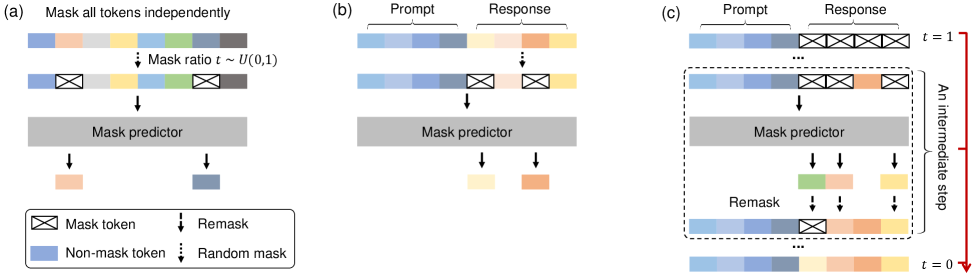
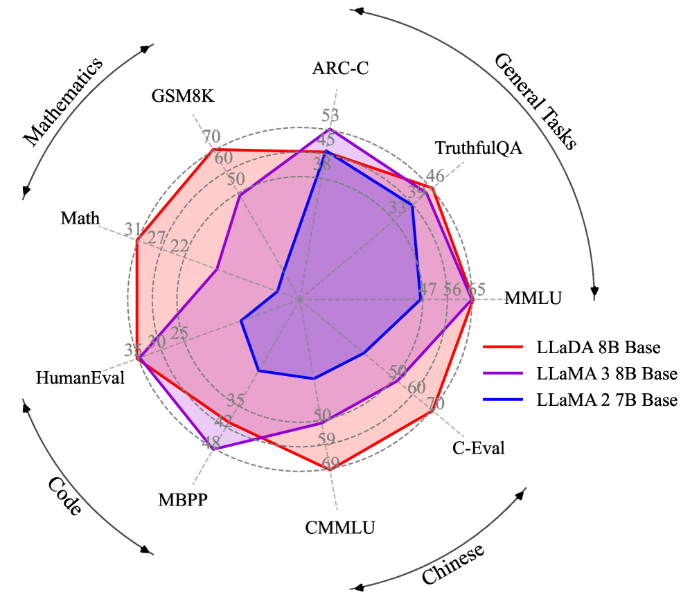

# 문장을 한 번에 쓰는 확산 모델 DiffusionGemma

_Google DiffusionGemma로 보는 autoregressive에서 diffusion으로의 패러다임 전환_

## Executive Summary

> [!callout]
> 2026년 6월 10일 Google이 공개한 실험적 오픈 모델 DiffusionGemma는, 거의 모든 대형 언어 모델이 따르던 한 가지 습관을 버렸다. 텍스트를 왼쪽에서 오른쪽으로 한 토큰씩 확정하는 방식 대신, 256토큰짜리 빈 캔버스를 한 번에 펼쳐 놓고 흐릿한 초안을 또렷하게 다듬듯 반복해서 정제한다. 이미지 생성 모델의 원리를 글자에 가져온 셈이다. 헤드라인은 "최대 4배 빠르다"였지만, 이 보고서가 던지는 질문은 그 아래에 있다. 생성 방식이 근본부터 바뀌면, 그 모델을 먹이는 데이터의 품질 기준도 함께 바뀌는가.

> 속도는 공짜가 아니다. DiffusionGemma는 거의 모든 벤치마크에서 동급 autoregressive 모델 Gemma 4에 뒤지는데, 격차의 폭이 작업마다 극단적으로 갈린다. 언어·일반지식은 MMLU Pro 기준 5.0%포인트로 좁지만, 다단계 수학추론(AIME 2026)에서는 19.2%포인트까지 벌어진다. 반대로 코드 빈칸 채우기나 문장 중간 편집처럼 "순서 없이 빈자리를 메우는" 작업에서는 오히려 확산이 강하다. 속도는 "전반적으로 강하다"가 아니라 "특정 작업에서만 값어치를 한다"는 조건부 이득이다.

> 데이터의 눈으로 보면 가장 흥미로운 신호는 효율이다. 확산 계열의 선행 모델 LLaDA 8B는 2.3조 토큰만으로, 15조 토큰을 학습한 LLaMA3 8B와 MMLU에서 대등한 점수를 냈다. 인터넷 텍스트가 컴퓨트 공급을 못 따라가는 시점이 2028년 무렵으로 예측되는 지금, "같은 데이터에서 더 많이 짜낸다"는 특성은 데이터 품질이 모델 품질의 상한을 정한다는 명제를 새 아키텍처에서 다시 확인시킨다. 다만 확산이 AR보다 데이터 노이즈에 더 민감한가라는 질문은, 직접 비교 연구가 아직 없는 열린 문제로 남아 있다. 분명한 것은 하나다. 아키텍처가 무엇이든, 진단되지 않은 데이터 결함은 그대로 모델로 흘러 들어간다.

<!-- stat-card -->
**최대 4×** — 생성 속도 — H100에서 1,000+ tok/s, 동급 AR Gemma 4 대비(저동시성)

<!-- stat-card -->
**26B→3.8B** — 활성 파라미터 — MoE 구조로 18GB VRAM 소비자 GPU에서 구동

<!-- stat-card -->
**256 토큰** — forward 1회 처리 — AR이 토큰 1개를 쓸 때 캔버스 전체를 동시에 정제

<!-- stat-card -->
**-5.0%p** — MMLU Pro 격차 — 속도의 대가, 77.6 vs 82.6 (동급 Gemma 4 대비)

## 한 토큰씩에서 한 번에 — 확산이 텍스트를 생성하는 법

ChatGPT를 포함한 대부분의 언어 모델은 받아쓰기를 하듯 글을 쓴다. 첫 단어를 정하고, 그것을 조건으로 다음 단어를 정하고, 다시 그 둘을 조건으로 세 번째 단어를 정한다. 이미 쓴 글자는 되돌아보지 않는다. 이것이 autoregressive(자기회귀, 이하 AR) 방식이며, 수식으로는 전체 문장의 확률을 앞 토큰들에 대한 조건부 확률의 연쇄로 분해한다.

$$p(x_1, x_2, \dots, x_n) = \prod_{i=1}^{n} p(x_i \mid x_1, \dots, x_{i-1})$$

식 1. AR 모델의 문장 확률 분해 — 토큰을 좌→우 순서로 하나씩 조건부 생성

확산 언어 모델은 글을 다르게 짓는다. 화가가 빈 캔버스에 흐릿한 윤곽을 먼저 깔고 여러 번 덧칠해 형태를 또렷하게 만들 듯, 256토큰짜리 블록 전체를 마스킹(가림) 상태로 펼쳐 놓고 시작한다. 그다음 모델이 가려진 자리들을 동시에 추정하고, 확신이 높은 토큰부터 확정해 나가며, 남은 자리를 다시 채우는 과정을 반복한다. 한 번에 한 글자가 아니라, 한 번에 화면 전체를 조금씩 또렷하게 만드는 방식이다.

### 1.1 학습은 가리고, 추론은 복원한다

이 방식은 이미지 확산 모델의 두 단계 구조를 그대로 빌려 온다. 학습할 때(forward 과정)는 깨끗한 문장에서 토큰 일부를 점점 더 많이 가린다. 추론할 때(reverse 과정)는 그 반대로, 완전히 가려진 상태에서 출발해 가림을 한 단계씩 풀어 간다. 이미지에서 "노이즈를 더했다 빼는" 자리에, 텍스트에서는 "토큰을 가렸다 복원하는" 동작이 들어선 것이다. DiffusionGemma는 보통 12~16회, 최대 48회까지 이 정제 단계를 반복하며, 한 단계마다 확신이 충분히 선 15~20개 토큰을 확정한다.

### 1.2 양방향 어텐션 — 뒤가 앞을 고친다

두 방식의 가장 본질적인 차이는 시선의 방향이다. AR은 인과(causal) 어텐션을 써서 각 토큰이 자기 앞쪽만 본다. 확산은 양방향(bidirectional) 어텐션을 써서 모든 토큰이 앞뒤를 모두 본다. 문장 끝에 놓일 단어가 문장 앞부분의 선택을 되돌려 고칠 수 있다는 뜻이다. 이 "전체를 한꺼번에 보고 고친다"는 성질이 이 보고서의 모든 비교를 떠받치는 척추다. 속도의 출처(섹션 3)도, 데이터를 다르게 표현하는 방식(섹션 4)도 결국 여기서 갈라진다.

AUTOREGRESSIVE

#### 받아쓰기

토큰을 좌→우로 하나씩 확정. 인과 어텐션(앞만 봄). 한 번 쓴 글자는 수정 불가. forward 1회당 토큰 1개.

DIFFUSION

#### 빈칸 채우기

캔버스 전체를 마스킹 상태에서 반복 정제. 양방향 어텐션(앞뒤 모두 봄). 단계마다 재추정 가능. forward 1회당 토큰 다수.

*▲ LLaDA의 학습(a)과 추론(b, c) 과정 — (a) 독립적 토큰 마스킹, (b) 응답부 마스킹 추론, (c) 반복 정제 단계 | Source: [LLaDA (arXiv:2502.09992)](https://arxiv.org/abs/2502.09992)*

오해를 하나 정리해 두자. 확산이 "공짜로 병렬"이라는 말은 정확하지 않다. 256토큰을 한 번에 보지만, 그 블록을 완성하려면 정제 단계를 여러 번 거쳐야 한다. 다시 말해 forward pass를 12~48회 반복한다. 속도 이득은 이 반복 횟수가 토큰 수보다 훨씬 적을 때 비로소 생긴다. 그 조건이 정확히 언제 성립하는지는 섹션 3에서 따진다.

## DiffusionGemma 해부 — 18GB에 들어간 26B

DiffusionGemma의 스펙은 그 자체로 설계 의도를 말해 준다. 총 26B 파라미터를 가진 MoE(Mixture of Experts) 모델이지만, 한 번의 forward pass에서 실제로 켜지는 것은 3.8B뿐이다. 128명의 전문가 중 8명만 호출하는 구조다. 덕분에 4비트 부동소수점 양자화(NVFP4)를 적용하면 18GB VRAM 안에 들어가, RTX 5090 같은 소비자 GPU 한 장에서 돌아간다. 작은 몸집에도 256K 토큰의 긴 컨텍스트와 텍스트·이미지·비디오 입력(140개 이상 언어 학습)을 받아내므로, 능력을 줄여 크기를 맞춘 모델이 아니다. "클라우드가 아니라 내 책상 위에서, 한 번에 한 명을 위해 돌리는 모델"이라는 메시지가 숫자에 새겨져 있다.

| 항목 | 수치 | 의미 |
| --- | --- | --- |
| 총 / 활성 파라미터 | 26B / 3.8B | MoE 8-of-128 experts + 1 shared |
| VRAM (양자화 시) | 18GB | NVFP4 + FP8, 소비자 GPU 한 장 |
| 병렬 생성 블록 | 256 토큰 | forward 1회가 다루는 캔버스 크기 |
| 컨텍스트 길이 | 256K 토큰 | 슬라이딩 윈도우 1,024 |
| 정제 단계 | 12~16회 (최대 48) | adaptive stopping (entropy 기준) |
| 기반 모델 | Gemma 4 family | Gemini Diffusion 연구 차용 |
| 멀티모달 | 텍스트·이미지·비디오 입력 | 텍스트 출력, 140+ 언어 학습 |
| 라이선스 | Apache 2.0 | 상업적 사용 허용, 학습 cutoff 2025-01 |

********************************

### 2.1 GPU마다 얼마나 빠른가

Google이 제시한 처리량은 H100에서 초당 1,000토큰 이상, RTX 5090에서 700토큰 이상이다. 이를 독립적으로 검증한 vLLM 팀은 H100 FP8·batch=1 조건에서 1,107 tok/s, H200에서 1,288 tok/s를 보고했다. 같은 batch=1 조건에서 동급 AR Gemma 4(26B)가 약 303 tok/s에 머문 점과 대비하면 체감 차이가 분명하다. 아래 수치는 모두 batch=1, 즉 한 사용자가 한 요청을 보내는 저동시성 환경 기준이다.

| 하드웨어 | 처리량 (tok/s) | 조건 · 출처 |
| --- | --- | --- |
| H100 | 1,000+ ~ 1,107 | FP8, batch=1 · Google / vLLM |
| H200 | 1,288 | FP8, batch=1 · vLLM |
| RTX 5090 | 700+ | 소비자 GPU · Google / NVIDIA |
| DGX Station | up to 2,000 | NVIDIA 발표(재인용 ~800 병기) |
| (참고) AR Gemma 4 26B | ~303 | low batch · the-decoder 인용 |

****

주의할 점은 양자화 포맷이 NVFP4라는 사실이다. 일부 보도에서 보이는 NF4와 혼동하기 쉬운데, NVFP4는 가중치와 활성값을 모두 4비트 부동소수점으로 다루는 NVIDIA의 포맷이다. 이 차이는 정확도와 하드웨어 가속 경로에 직접 영향을 주므로, 모델을 배포할 때 반드시 구분해야 한다.

## 속도는 어디서 오고 무엇을 내주는가

"4배 빠르다"의 근원은 모델이 GPU의 어느 자원에 묶여 있느냐에 있다. AR 모델은 토큰을 하나 만들 때마다 거대한 가중치를 메모리에서 다시 읽어 와야 한다. 저배치 환경에서 GPU의 연산 장치는 대부분 놀고, 병목은 메모리 대역폭에 걸린다(memory-bandwidth-bound). 반면 확산은 256개 위치를 한 번에 계산하므로 연산 장치를 가득 채운다. 병목이 연산 능력으로 옮겨 간다(compute-bound). 같은 한 번의 메모리 읽기로 더 많은 일을 하는 셈이다.

### 3.1 하드웨어 추세라는 순풍

이 구조적 차이가 중요한 이유는, 하드웨어가 진화하는 방향이 확산 쪽에 유리하기 때문이다. 2012년부터 2022년까지 GPU의 연산력(FLOPS)은 약 80배 늘었지만, 메모리 대역폭은 17배 느는 데 그쳤다. 연산은 풍족해지고 대역폭은 상대적으로 귀해졌다. 메모리 대역폭에 묶인 AR은 이 격차가 벌어질수록 손해를 보고, 연산에 묶인 확산은 이득을 본다. 즉 미래의 GPU가 빨라질수록 확산의 상대적 이점도 커진다.

> [!callout]
> 다만 이 이득에는 분명한 경계가 있다. "최대 4배"는 한 사람이 한 요청을 보내는 저동시성 조건의 공식 수치다. 여러 요청을 한꺼번에 묶어 처리하는 고QPS 클라우드 서빙에서는 AR도 연산 장치를 채우게 되어 확산의 이득이 점점 줄어든다. 다수 연구가 "고배치에서 우위 소멸 또는 역전"을 보고하는 한편, Fast-dLLM v2처럼 가속 스택을 잘 짜면 고배치에서도 1.5~1.8배를 유지한다는 보고도 있다. 결론은 가속 스택과 디코딩 전략에 크게 의존한다는 것이며, Apple Silicon 같은 통합 메모리에서는 동일한 가속이 나오지 않는다.

### 3.2 대가는 품질, 그러나 작업마다 다르다

DiffusionGemma는 거의 모든 벤치마크에서 Gemma 4보다 낮은 점수를 받는다. 핵심은 "전반적으로 약하다"가 아니라 격차의 분포다. 언어·일반지식처럼 한 번에 윤곽을 잡는 작업에서는 차이가 5%포인트 안팎으로 좁지만, AIME 같은 다단계 수학추론이나 긴 문맥 일관성처럼 한 걸음씩 논리를 쌓아야 하는 작업에서는 격차가 크게 벌어진다. 한 번에 전체를 보는 강점이, 순차적 추론에서는 약점으로 뒤집힌다.

동급 Gemma 4 대비 DiffusionGemma 격차 (막대가 길수록 열세, 단위 %포인트)

MMLU Pro (언어·일반지식)-5.0

LiveCodeBench v6 (코드)-8.0

GPQA Diamond (과학추론)-9.1

MRCR v2 (장문맥 128k)-12.1

AIME 2026 (다단계 수학)-19.2

*▲ 확산 LM의 수학 문제 샘플링 과정 — 진한 색일수록 확신도가 높은 토큰. 좌→우가 아니라 캔버스 전체에서 동시에 확신도가 오른다 | Source: [LLaDA (arXiv:2502.09992)](https://arxiv.org/abs/2502.09992)*

흥미로운 반전은 "비순차적" 작업이다. 코드 한가운데 빈칸을 채우는 infilling, 이미 쓰인 문서의 중간을 고치는 in-line editing처럼 앞뒤 맥락을 동시에 봐야 하는 일에서는 확산이 오히려 자연스럽다. AR은 왼쪽만 보므로 "뒤를 알고 가운데를 채우는" 작업에 구조적으로 불리하다. Google이 DiffusionGemma를 "프로덕션용이 아닌 연구·실험용"으로 못 박으면서도 코드 인필링과 인라인 편집을 권장 사용처로 든 이유가 여기 있다.

> [!callout]
> 정리하면 DiffusionGemma의 속도는 만능 티켓이 아니라 작업 선택의 문제다. 저동시성·로컬 환경에서, 빈칸 채우기 계열 작업이라면 속도와 품질이 모두 합리적이다. 반대로 정교한 지시 따르기나 긴 문맥의 일관성이 중요한 작업에서는 아직 AR 모델이 안전한 선택이다.

## 데이터 품질의 기준은 정말 바뀌는가

이제 이 보고서의 중심 질문으로 돌아온다. 생성 방식이 바뀌면 데이터 품질의 기준도 바뀌는가. 답을 정직하게 나누면 둘이다. 데이터를 더 효율적으로 쓴다는 것은 이미 확립된 신호이고, 데이터 노이즈에 더 민감한가는 아직 열린 질문이다. 이 둘을 섞으면 과장이 되므로, 시각적으로도 구분해 둔다.

### 4.1 데이터 효율은 이미 확립된 신호다

가장 단단한 증거는 LLaDA 8B다. 이 확산 모델은 2.3조 토큰만 학습하고도 15조 토큰을 쓴 LLaMA3 8B와 MMLU에서 65.9 대 65.4로 사실상 대등했다. 같은 성능을 6분의 1 분량의 데이터로 낸 셈이다. 더 인상적인 것은 데이터가 제한된 환경에서의 행동이다. 같은 데이터를 여러 번 반복 학습할 때, AR 모델은 약 14,000스텝 부근에서 과적합으로 정체하지만, 확산 모델은 20,000스텝을 넘어서도 단조롭게 좋아진다. 한 연구는 이를 "확산 언어 모델은 데이터를 더 잘 빨아들이는 학습자(super data learner)"라고 불렀다.

효율의 성격은 세 숫자로 압축된다. 데이터를 적게 쓰고도 대등한 점수(2.3조≈15조), 생성 결과가 훨씬 덜 단조로운 다양성(첫 단어 고유성 93.4%), AR이 자주 걸려 넘어지는 역방향 추론의 유지율(88%)이다. 앞의 하나가 효율의 직접 증거라면, 뒤의 둘은 그 효율이 데이터를 다르게 표현하는 구조에서 비롯된다는 단서다. 그 구조가 무엇인지는 바로 다음 절에서 본다.

<!-- stat-card -->
**2.3T ≈ 15T** — 데이터 효율 — LLaDA 8B가 6분의 1 토큰으로 MMLU 대등

<!-- stat-card -->
**93.4%** — 생성 다양성 — MDLM 첫 단어 고유성, AR은 3.3%

<!-- stat-card -->
**88% vs 41%** — 역방향 추론 유지율 — LLaDA가 reversal curse를 극복(GPT-4o 41%)

인터넷 텍스트가 컴퓨트 공급을 따라가지 못하는 시점이 2028년 무렵으로 예측된다. 그때부터는 "데이터를 더 모으는" 전략보다 "가진 데이터에서 더 짜내는" 전략의 값이 올라간다. 데이터 효율이 높은 확산 계열이 주목받는 거시적 배경이다. 물론 이것이 공짜는 아니다. 같은 검증 손실에 도달하기까지 단일 에폭에서는 확산이 최대 16배 더 많은 연산을 요구할 수 있다. 데이터가 귀하고 연산이 흔한 환경에서 유리한 트레이드오프다.

*▲ LLaDA 8B(분홍)가 LLaMA3 8B(파랑)와 대등한 벤치마크 형태 — 2.3조 토큰으로 15조 토큰을 쓴 모델과 비슷한 성능 분포 | Source: [LLaDA (arXiv:2502.09992)](https://arxiv.org/abs/2502.09992)*

### 4.2 양방향 구조는 데이터를 다르게 표현한다

효율 외에 또 하나의 정량 신호가 있다. 텍스트 다양성이다. AR 모델은 생성한 문장의 첫 단어가 고유한 경우가 3.3%에 불과한 반면, 마스킹 확산 모델(MDLM)은 93.4%에 이른다. AR은 유창하지만 단조롭고, 확산은 다양하지만 일관성이 들쭉날쭉하다는 뜻이다. 또 AR이 약한 "역방향 추론(reversal curse)"에서도 차이가 난다. "A는 B다"를 배운 모델이 "B는 무엇인가"를 못 맞히는 현상인데, LLaDA는 역방향 점수를 88% 유지한 반면 GPT-4o는 41%로 떨어졌다. 전체를 한꺼번에 보는 구조가 데이터의 전역적 관계를 AR과 다른 방식으로 내부 표현에 새긴다는 증거다.

### 4.3 노이즈 민감도는 아직 열린 질문이다

그렇다면 확산은 데이터 노이즈에 더 민감할까. 직관적으로는 그럴 법하다. 마스킹된 자리를 복원하는 것이 학습 목표이니, 라벨 불일치나 중복 같은 결함에 다르게 반응할 개연성이 있다. 그러나 직관과 증거는 다르다. AR과 확산의 노이즈 민감도를 직접 비교한 연구는 아직 없다. 다음은 무엇이 확립됐고 무엇이 열려 있는지를 정직하게 가른 것이다.

#### 확립된 사실

- • 병렬 토큰 업데이트는 이론적으로 "어려운 제약충족(CSP hard phase)" 영역을 만들어, 학습 손실이 0으로 수렴하지 못한다(Kim et al. 2025).
- • 샘플링 품질이 denoiser의 견고성·보정(calibration)에 민감하다.
- • 노이즈 스케줄을 잘라(clipped) 분산을 줄이면 perplexity가 직접 개선된다.

#### 열린 질문

- • 같은 노이즈 데이터에서 AR과 확산 중 어느 쪽이 더 크게 무너지는가 — 직접 비교 연구 부재.
- • 전역 일관성 결함(문서 단위 사실 모순)이 양방향 학습에 미치는 영향의 정량.
- • 작업 유형별로 어떤 결함이 어떤 아키텍처에서 더 치명적인가.

> [!callout]
> 그래서 "데이터 품질의 기준이 바뀌는가"에 대한 현재의 정직한 답은 이렇다. 품질이 모델 품질의 상한을 정한다는 명제는 그대로 유효하다. 다만 품질의 어느 차원(다양성·일관성·노이즈·균형)이 더 중요해지는지는 작업과 아키텍처에 따라 달라진다. 기준이 폐기되는 것이 아니라, 우선순위가 재정렬된다. "AI-Ready Data는 아키텍처-중립적이어야 하는가"라는 질문은 이 지점에서 비로소 실무적 무게를 갖는다.

## 실험인가, 전환점인가 — 확산 LM의 계보

DiffusionGemma는 갑자기 등장한 것이 아니다. 이산 확산의 이론적 토대를 놓은 SEDD와 MDLM(2024), 8B 스케일에서 AR과의 격차를 좁힌 LLaDA(2025년 2월), 길이 유연성을 더한 Block Diffusion, 첫 MoE 확산 모델 LLaDA-MoE(2025년 9월), 상용 서비스로 나온 Mercury와 Gemini Diffusion으로 이어지는 계보의 한 마디다. 그리고 그 뒤에는 100B 스케일의 LLaDA 2.0이 기다리고 있다.

2024**SEDD · MDLM** — 이산 공간 확산의 이론적 토대. "categorical 공간에서 score를 어떻게 정의하나"를 풀다

2025-02**LLaDA 8B** — AR과 MMLU 격차를 0.5pt까지 좁힘. NeurIPS 2025 Oral 선정

2025-09**LLaDA-MoE-7B-A1B** — 첫 MoE 확산 모델. DiffusionGemma의 26B/3.8B 구조의 직접 선행

2025~2026**Mercury · Gemini Diffusion** — 상용화. Mercury 2는 입력 $0.25 / 출력 $0.75(100만 토큰)로 ~1,000 tok/s

2026-06**DiffusionGemma** — Google의 첫 오픈 확산 모델. 출시일 당일 vLLM·Transformers·Unsloth·MLX 동시 지원

2026~**LLaDA 2.0-flash (100B)** — 코딩 벤치마크에서 AR 추월 신호(발표 기준, 독립 검증 미확인)

### 5.1 스케일이 격차를 좁히는가

성숙도를 가늠하는 가장 좋은 신호는 스케일업의 결과다. Ant Group이 공개한 100B MoE 모델 LLaDA 2.0-flash는 코딩과 에이전트 벤치마크에서 동급 AR을 앞질렀다고 보고한다. HumanEval 94.51% 대 93.29%, MBPP 88.29% 대 86.65%, MultiPL-E에서는 4.2%포인트 우위다. 다만 이 수치는 Ant Group 자체 발표이며 독립 검증이 확인되지 않았으니, "특정 영역에서 AR을 넘기 시작했다는 신호" 정도로 받아들이는 것이 안전하다.

### 5.2 출시 당일 생태계, 그리고 책상 위로 내려온 추론

*▲ DiffusionGemma 스도쿠 파인튜닝 — 빈칸 채우기(constraint satisfaction) 특성이 스도쿠에 그대로 적용된다 | Source: [Google Blog, 2026](https://blog.google/innovation-and-ai/technology/developers-tools/diffusion-gemma-faster-text-generation/)*

DiffusionGemma는 출시 당일부터 vLLM(최초의 확산 LM 네이티브 지원), HuggingFace Transformers, Unsloth, MLX, SGLang, NVIDIA NeMo/NIM의 지원을 받았다. 도구 생태계가 동시에 준비됐다는 것은 실험 비용이 낮다는 뜻이다. 그리고 18GB VRAM에 26B급을 담아 로컬에서 돌린다는 점은 온디바이스·저동시성 추론, 즉 엣지와 Physical AI 시나리오에 직접 닿는다. 클라우드 왕복 없이 책상 위 GPU에서 빠른 응답을 내는 모델은, 네트워크가 불안정하거나 지연이 치명적인 현장에서 다른 값을 갖는다.

> [!callout]
> 그래서 "지금 베팅할 때인가"라는 질문에는 절충적 답이 어울린다. 일반 추론에서의 격차가 아직 남아 있으므로 전면 교체는 이르다. 그러나 코드 인필링, 인라인 편집, 저지연 로컬 추론처럼 확산이 구조적으로 유리한 작업부터 점진적으로 채택하는 것은 충분히 합리적이다. 계보의 길이와 하드웨어 추세의 방향이 이 선택을 뒷받침한다.

## 페블러스 관점 — 아키텍처가 바뀌어도 남는 질문

속도 헤드라인이 시장을 덮는 동안, 데이터를 만지는 사람의 관심사는 다른 곳에 있다. 지금 내가 정제하고 진단하는 학습 데이터가, 아키텍처가 AR에서 확산으로 바뀌어도 자산으로 남는가. 이 보고서가 따라온 증거들은 "그렇다, 단 조건이 있다"고 답한다.

### 6.1 데이터 품질 진단의 자리

확산 모델은 가려진 데이터를 복원하는 것을 학습 목표로 삼는다. 학습 데이터의 노이즈·라벨 불일치·중복에 AR과 다른 방식으로 반응할 개연성이 열린다. 다만 앞서 정직하게 적었듯, 이것은 확립이 아니라 개연이다. 그래서 데이터의 결함을 진단하고 교정하는 일의 가치는 아키텍처가 바뀌어도 사라지지 않고, 오히려 "어떤 결함이 어떤 아키텍처에서 더 치명적인가"라는 새 질문으로 확장된다. 데이터 효율(같은 데이터에서 더 짜내기)이 데이터 고갈 시대의 경쟁력이 된다는 점도 여기에 더해진다.

### 6.2 실무 의사결정에 닿는 지점

- •**데이터 파이프라인 담당자:** 정제·중복 제거·품질 진단의 핵심 가치는 아키텍처와 무관하게 유지된다. 다만 다양성·전역 일관성처럼 확산이 다르게 다루는 차원의 우선순위는 재점검할 가치가 있다.
- •**추론 인프라 담당자:** compute-bound로의 전환은 GPU 선택을 바꾼다. 확산에서는 H200의 대역폭 프리미엄 효과가 작아지고 raw compute의 비중이 커진다. 엣지 배포 의사결정에도 직접 영향을 준다.
- •**기술 의사결정자:** 전면 베팅이 아니라 작업 단위의 점진 채택이 현재의 현실적 판단이다. 확산이 강한 작업과 약한 작업의 경계를 데이터로 그려 두면, 베팅의 위험을 작게 나눠 질 수 있다.

> [!callout]
> 한 문장으로 줄이면, 아키텍처가 무엇이든 데이터 품질이 모델 품질의 상한을 정한다. 확산은 이 오래된 명제를 폐기하는 사례가 아니라, 새 각도에서 다시 확인시키는 사례다. 기준이 사라지는 것이 아니라, 어느 기준을 먼저 볼지가 달라질 뿐이다.

**Editor's Note.** 페블러스는 데이터 품질을 진단·교정하는 DataClinic과 합성 데이터 시뮬레이션 PebbloSim을 통해, 학습 데이터가 모델 품질에 미치는 인과를 측정해 왔습니다. 이 보고서가 다룬 "아키텍처-중립적 데이터 품질" 질문은 그 작업의 연장선에 있습니다.

## 참고 자료

### 1차 소스 · 업계

- 1.Google. (2026, June 10). [DiffusionGemma: Faster Text Generation](https://blog.google/innovation-and-ai/technology/developers-tools/diffusion-gemma-faster-text-generation/). _Google Blog_.
- 2.Google. (2026). [diffusiongemma-26B-A4B-it: Model Card](https://huggingface.co/google/diffusiongemma-26B-A4B-it). _HuggingFace_. (벤치마크 표 출처: MMLU Pro, AIME, GPQA 등)
- 3.Google. (2026). [DiffusionGemma Documentation](https://ai.google.dev/gemma/docs/diffusiongemma). _Google AI for Developers_.
- 4.Google Developers. (2026). _DiffusionGemma — The Developer Guide_. Google Developers Blog. (Sudoku 파인튜닝 demo, adaptive denoising 파라미터)
- 5.NVIDIA. (2026). _Run DiffusionGemma Locally on RTX_. NVIDIA RTX AI Garage Blog. (DGX Station 2,000 tok/s · DGX Spark 150 tok/s)
- 6.vLLM Project. (2026, June 10). _DiffusionGemma Throughput Benchmarks_. vLLM Blog. (H100 FP8 1,008 tok/s · H200 1,288 tok/s 실측)

### 학술 논문

- 7.Nie, S., Zhu, F., You, Z., Zhang, X., Hu, J., Zhou, J., … & Li, C. (2025). [Large Language Diffusion Models](https://arxiv.org/abs/2502.09992). _NeurIPS 2025 (Oral)_. arXiv:2502.09992
- 8.Inception Labs. (2025). [Mercury: A Commercial-Scale Diffusion Language Model](https://arxiv.org/abs/2506.17298). arXiv:2506.17298
- 9.(2025). [Performance Characterization of Diffusion Language Models](https://arxiv.org/abs/2510.04146). arXiv:2510.04146. (compute-bound vs memory-bound roofline 분석)
- 10.(2025). [Fast-dLLM: Efficient Decoding for Diffusion Language Models](https://arxiv.org/abs/2509.26328). arXiv:2509.26328. (고배치 우위 유지 결과)
- 11.(2025). [Diffusion Language Models are Super Data Learners](https://arxiv.org/abs/2511.03276). arXiv:2511.03276.
- 12.(2025). [Mind the Memory Gap: GPU FLOPS vs. Bandwidth Growth](https://arxiv.org/abs/2503.08311). arXiv:2503.08311.
- 13.InclusionAI / Ant Group. (2025). [LLaDA 2.0: Scaling Diffusion Language Models](https://arxiv.org/abs/2512.15745). arXiv:2512.15745. (100B MoE; Ant Group 자체 발표, 독립 미검증)
- 14.Sahoo, S. S., Arriola, M., Schiff, Y., Gokaslan, A., Marroquin, E., Guttag, J., Rush, A. M., & Kuleshov, V. (2024). [Simple and Effective Masked Diffusion Language Models](https://arxiv.org/abs/2406.07524). arXiv:2406.07524. (MDLM — 계보)
- 15.Lou, A., Meng, C., & Ermon, S. (2024). [Discrete Diffusion Language Modeling by Estimating the Ratios of the Data Distribution](https://arxiv.org/abs/2310.16834). _ICML 2024_. arXiv:2310.16834. (SEDD — 계보)
- 16.Arriola, M. et al. (2025). _Block Diffusion: Interpolating Between Autoregressive and Diffusion Language Models_. (고배치 전환점 분석 — 계보)
- 17.CMU Machine Learning Blog. (2025). _Diffusion Beats Autoregressive in Data-Constrained Settings_. (데이터 제약 환경 효율 분석)
