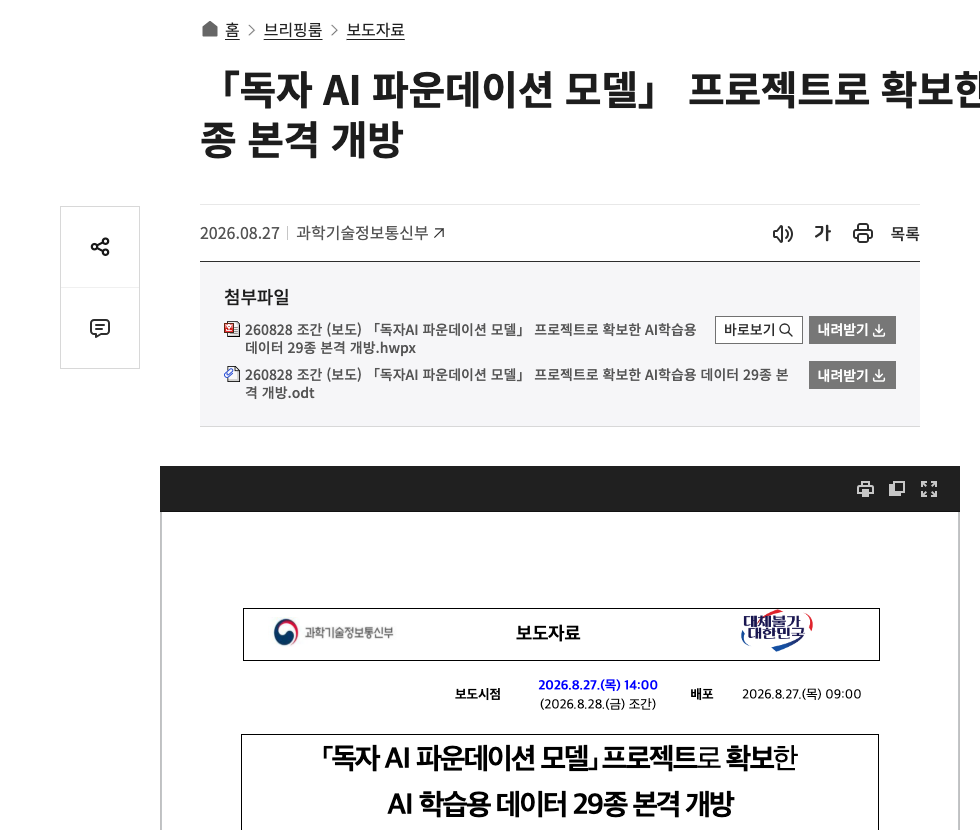
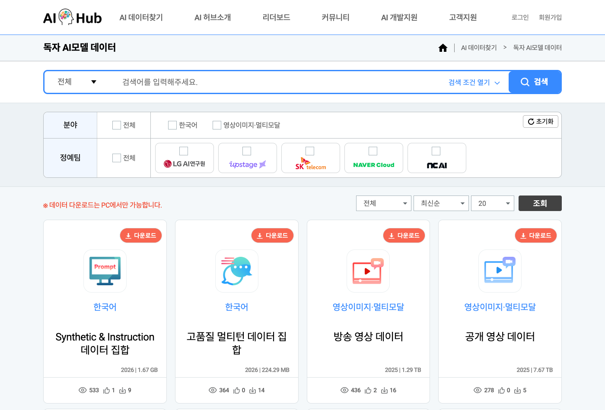

# 정부 보도자료와 AI허브가 같은 학습데이터를 다르게 센다

_독자 AI 파운데이션 모델 5개 팀이 국비로 만든 학습데이터 29종을 항목마다 열어 맞춰 봤다_

## Executive Summary

> [!callout]
> 2026년 8월 27일 과학기술정보통신부와 한국지능정보사회진흥원은 「독자 AI 파운데이션 모델」 프로젝트 다섯 정예팀이 국비로 만든 학습데이터 29종을 AI허브에 열었다. 대한민국 국민이라면 누구나 무료로 내려받아 쓸 수 있다고 했다. 그런데 창구에 가 보면 목록에 놓여 있는 것은 22건이다. 그래서 발표 기록과 창구 기록을 항목마다 나란히 놓고 맞춰 봤다.

> 29와 22는 어긋난 숫자가 아니었다. 보도자료 붙임은 데이터셋을 형식별로 쪼개 29행으로 세었고, 창구는 데이터셋 단위로 22건을 등재했다. 다섯 팀 모두 정확히 대응한다. 어긋나는 곳은 다른 데 있었다. 같은 데이터셋의 건수와 용량과 형식을 두 공식 기록이 서로 다르게 적는다. 민원 상담 음성 데이터는 창구의 머리 필드에 「3,434시간」으로 적혀 있는데, 같은 페이지 아래쪽 통계는 음성이 514시간이라고 밝힌다. 3,434는 시간이 아니라 전사 파일의 개수다.

> 공개 데이터셋은 총량으로 도착하지 않는다. 항목으로 도착하고, 항목마다 조건이 다르다. 용량의 대부분은 영상 두 건에 몰려 있는데 이용자의 손길은 그 반대편의 작은 텍스트로 간다. 안전성 데이터 두 건은 목록에서 버튼부터 다르다. 그리고 스물두 건 어디에도 이용조건이 적혀 있지 않다. 받는 쪽이 매번 자기 손으로 세어 볼 수밖에 없다는 뜻이다.

<!-- stat-card -->
**82.8%** — 영상 두 건의 용량 비중 — 전체 11,075.6 GiB 가운데 네이버클라우드 2건. 단일 최대 한 건이 70.9%

<!-- stat-card -->
**29행 → 22건** — 붙임의 행 수와 창구의 등재 수 — 형식별로 쪼갠 축의 차이일 뿐, 누락된 데이터셋은 없다

<!-- stat-card -->
**3,434 → 514** — 민원 음성 데이터의 표기와 실제 시간 — 머리 필드가 전사 파일 3,434개를 「3,434시간」으로 적었다

<!-- stat-card -->
**0건** — 이용조건이 표기된 데이터셋 — 22건 상세 페이지에 라이선스·이용허락 항목이 없다

## 경쟁에서 진 팀의 데이터도 남는다

「독자 AI 파운데이션 모델」 프로젝트는 국내 다섯 정예팀을 뽑아 국산 대형 모델을 만들게 하고, 단계평가로 팀을 걸러 내는 사업이다. 2026년 8월 27일 과학기술정보통신부와 NIA가 개방을 발표한 데이터는 그 다섯 팀이 **1차 단계평가 과정에서** 만든 것이다. 발표 시점 기준으로 다섯 팀 가운데 둘은 이미 사업에서 빠진 뒤였다.

*▲ 이 글이 대조의 출발점으로 삼은 보도자료 원문 | Source: [대한민국 정책브리핑](https://www.korea.kr/briefing/pressReleaseView.do?newsId=156775729)*

서울경제 보도에 따르면 네이버클라우드와 NC AI는 이후 단계평가에서 탈락했고, 그럼에도 정부 예산으로 확보한 데이터의 의무 개방 대상에는 포함됐다. 이 대목은 보도자료 본문이 직접 밝히지 않는다. 다만 확인은 어렵지 않다. 보도자료 붙임의 팀별 목록에도, 창구의 등재 목록에도 두 팀의 데이터가 그대로 올라와 있다. 등재된 22건 가운데 **12건**이 이 두 팀의 것이고, 개방 용량으로는 **83.6%**에 해당한다. 경쟁에서 진 쪽의 산출물이 사라지지 않고 창구에 남는 구조다.

남는 이유는 사업 설계에 있다. 보도자료는 개방의 근거를 이렇게 적는다.

> [!callout]
> "「독자 AI 파운데이션 모델」 사업 공고상 참여조건에 따라 데이터 구축·가공예산을 통해 확보한 데이터 중 50% 이상 개방이 필요한 상황에서, 네이버클라우드, 업스테이지, 에스케이텔레콤, 엔씨에이아이는 품질검증 등을 거친 데이터 전체를 개방하기로 하였다. 엘지AI연구원은 의무개방량(50% 이상)을 준수하여 공개 대상 데이터를 통계적으로 선별·개방하기로 하였다."

잘못 읽히기 쉬운 것은 LG AI연구원 대목이다. 보도가 "규정에 따라 50% 이상을 선별 개방한다"고 쓰면, 규정 때문에 절반만 열었다는 뜻으로 읽히기 쉽다. 그런데 원문의 낱말은 **의무개방량**이고 50%는 하한이다. 네 팀은 검증을 통과한 분량 전체를 냈고, LG AI연구원은 하한을 지키는 선에서 데이터셋마다 일정 간격으로 표본을 뽑아 냈다. 그 선별 과정은 TTA가 검증했다고 적혀 있다. 실제로 몇 퍼센트를 열었는지는 계산할 수 없다. 붙임에는 「개방량」 열만 있고 구축 총량을 적은 열이 없기 때문이다.

검증을 맡은 것은 NIA와 한국정보통신기술협회다. 두 기관은 1차 단계평가가 끝난 뒤 각 정예팀에서 구축·가공 예산으로 확보한 데이터 전체를 넘겨받았고, 품질검증과 개인정보·유해성 검증을 거쳐 라이선스 제약이 걸린 데이터를 빼는 조치를 진행했다. 즉 창구에 올라온 22건은 팀이 만든 전부가 아니라 세 단계를 통과하고 남은 것이다.

데이터에 붙은 돈은 한 덩어리가 아니었다. 5개 정예팀 최종 선정을 다룬 2025년 8월 보도를 보면, 정부의 데이터 지원은 세 갈래로 나뉘어 있었다. 개방 발표문이 말하는 "2025년 데이터 구축·가공 예산 150억 원"은 이 가운데 팀별 개별수요에 해당하는 것으로 보이고, 나머지 두 갈래는 별도 예산이다.

| 지원 갈래 | 규모 | 성격 |
| --- | --- | --- |
| 데이터 공동구매 | 100억 원 | 정예팀 공통 신청분을 정부가 일괄 구매·가공 |
| 방송영상 학습용 데이터 | 200억 원 | 고품질 방송영상 전용 지원 라인 |
| 팀별 데이터셋 구축·가공 | 팀당 28억 원 | 각 팀이 자체 개발 전략에 맞춰 직접 구축 |

출처: 바이라인네트워크, 「독자 AI 파운데이션 모델 사업 5개 정예팀 정해졌다」(2025-08-04). 공고문에는 개별수요가 연 28~40억 원의 범위로 적혀 있고 확정액은 하한이 채택됐다. 방송영상 200억 원 라인의 집행 주체는 공개된 자료에서 확인되지 않는다. 이 예산 항목과 뒤에 나올 영상 데이터 용량 쏠림을 인과로 이어 읽을 근거는 없다.

국비로 만든 학습데이터의 일정 비율 이상을 공개하라는 정량 조항은 흔치 않다. 공개된 자료에서 확인한 범위로는, 일본의 GENIAC 관련 문서에서 학습데이터 공개 의무 조항을 찾지 못했고 인도의 IndiaAI와 싱가포르의 SEA-LION에도 그런 조항이 없다. 유럽의 OpenEuroLLM은 후보 데이터를 공개 카탈로그로 정리하도록 프로그램 구조에 요구를 둔다. 각국 공모요령 원문까지 열어 보지는 못했으므로 "한국만 유일하다"고 단정할 수는 없다. 다만 눈에 띄는 것은 방향이다. 유럽과 인도는 국가가 데이터를 모아 팀에 **주고**, 한국은 팀이 만든 데이터를 국민에게 **내놓게** 한다. 탈락한 팀의 산출물까지 창구에 남는 것은 그 설계의 결과다.

같은 8월 27일, 정부는 고가치 공공데이터 100종의 개방 시점을 앞당기는 결정도 내놓았다. [그 결정을 다룬 앞선 리포트](/report/public-data-top100-ai-license-2026-08/ko/)가 정부에서 정예팀으로 가는 흐름을 본 것이라면, 이 글은 정예팀에서 국민으로 돌아오는 흐름을 본다.

## 29종과 22건은 같은 목록이었다

발표는 29종이라고 했다. 창구를 열어 세면 22건이다. AI허브의 「독자 AI모델 데이터」 메뉴를 2026년 8월 29일에 조회한 결과, 등재된 데이터셋은 일련번호 71890부터 71913까지 22건이었다. 개방 이틀째의 목록이다. 일곱은 어디로 갔을까.

*▲ 실제로 열어 보면 이렇게 22건이 등재돼 있다 | Source: [AI허브 「독자 AI모델 데이터」](https://aihub.or.kr/aihubdata/wblextrldata/list.do?currMenu=520&topMenu=100)*

답은 첨부파일에 있었다. 과기정통부 보도자료의 붙임1 「정예팀별 데이터 구축·활용 현황 및 개방(안)」은 **정예팀명 · 데이터셋명 · 형식 · 개방량 · 용량** 다섯 열로 된 표다. 행을 세면 정확히 29개이고, 그 안에 적힌 데이터셋 이름 중 서로 다른 것을 세면 정확히 22개다. 즉 정부가 말한 「종」은 데이터셋을 영상·텍스트·음성·이미지 같은 형식으로 쪼갠 행의 수이고, 창구의 「건」은 데이터셋 자체의 수다.

그 대응은 총계에서만 맞는 것이 아니라 팀별로도 하나하나 맞는다. 오른쪽 두 열만 보면 된다. 붙임의 고유 데이터셋 수와 창구 등재 수가 다섯 팀 모두에서 같다.

| 정예팀 | 붙임1 행 수 | 고유 데이터셋명 | AI허브 등재 |
| --- | --- | --- | --- |
| 네이버클라우드 | 6 | 2 | 2 |
| 업스테이지 | 5 | 5 | 5 |
| SK텔레콤 | 6 | 4 | 4 |
| NC AI | 10 | 10 | 10 |
| LG AI연구원 | 2 | 1 | 1 |
| 합계 | 29 | 22 | 22 |

차이 일곱은 다섯 데이터셋에서 나온다. 네이버클라우드의 공개 영상과 방송 영상은 각각 영상·텍스트·음성 세 행으로 갈라지고, SK텔레콤의 두 LMM 데이터셋과 LG AI연구원의 Scene Understanding 데이터셋은 각각 두 행으로 갈라진다. 이 다섯이 차지하는 행이 열둘이고, 나머지 열일곱 데이터셋은 한 행씩이다. 열둘이 다섯으로 접히면서 일곱이 줄어든다.
