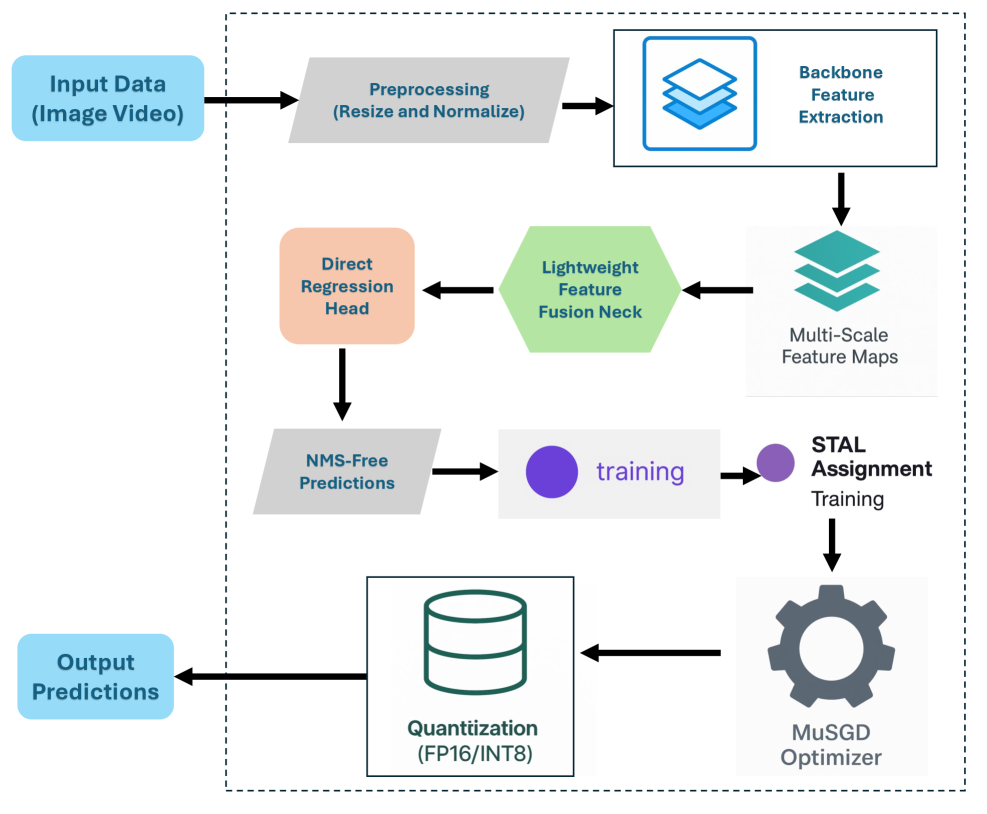
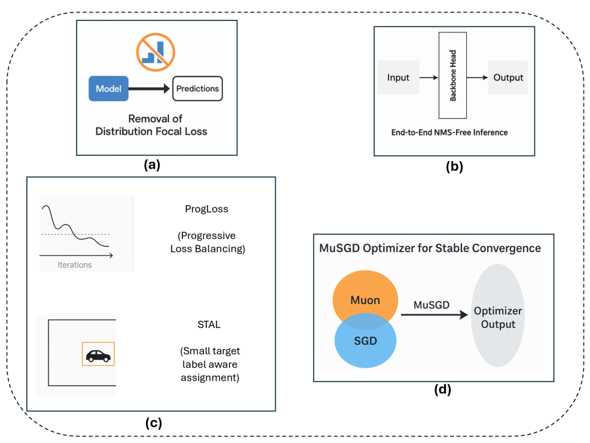
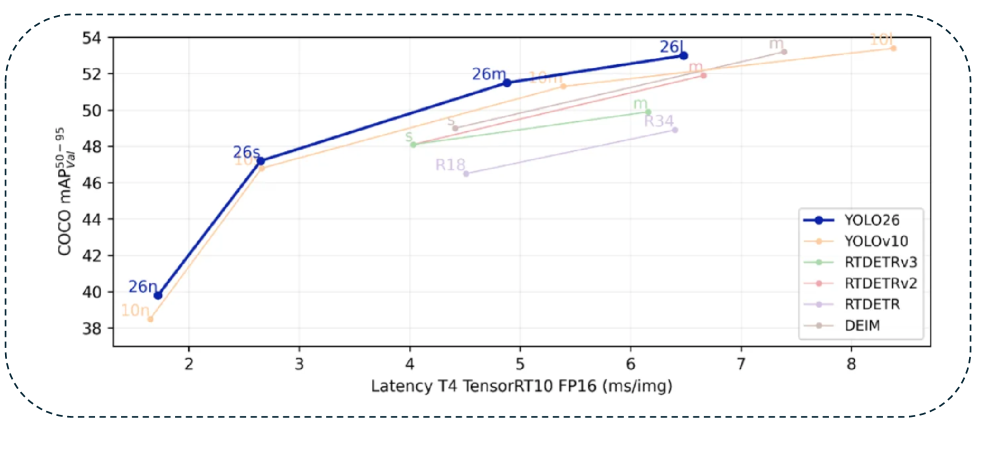

# When Satellites See, AI Reads

_How YOLO26, LangGraph, and serverless GPUs are turning natural language into satellite intelligence_

## Executive Summary

> [!callout]
> More than 1,000 Earth observation satellites currently orbit the planet, generating petabytes of imagery every day. Yet less than 5% of that data is ever analyzed. The bottleneck is not capture but interpretation. A trained analyst can spend hours reading a single satellite image, and skilled interpreters are in short supply worldwide. "Satellites already see everything, but there are not enough people to read what they see" remains the structural dilemma of the field.

> The GeoVision project offers a technical architecture that attacks this bottleneck head-on. Ultralytics' YOLO26 detects objects in satellite imagery in real time, LangGraph orchestrates four tools (detection, segmentation, classification, visualization) as an agent, and the user simply types "find the buildings in this area." Modal runs inference on serverless GPUs (A10G), while CopilotKit provides a streaming chat interface. The old paradigm of "one model, one task" gives way to a new one: "an agent that composes multiple models to fulfill the user's intent."

> What makes this transition meaningful is data quality. The accuracy of satellite image analysis is never determined by model architecture alone. Input resolution, atmospheric correction state, cloud coverage, and label consistency all govern model performance. An agentic system provides the structural foundation to build pipelines that automatically assess and correct these quality variables. Pebblous pays close attention to this technology because DataClinic's image quality diagnostics and PebbloSim's synthetic satellite imagery generation can become core components of precisely this pipeline.

## A Flood of Data from Above, Yet Analysis Stands Still

Earth Observation (EO) is the most powerful monitoring tool humanity possesses. Climate tracking, deforestation surveillance, urban sprawl analysis, disaster response, crop yield forecasting -- all would be impossible or prohibitively expensive without satellite imagery. And the data supply is exploding.

### 1.1 The Satellite Data Explosion

The number of EO satellites has surged over the past decade. The Copernicus Sentinel constellation, Planet Labs' fleet of over 200 micro-satellites, Maxar's high-resolution commercial birds, and China's Gaofen series collectively beam tens of terabytes of imagery to the ground every day.

- •Sentinel-2: Operated by ESA, this multispectral satellite revisits the entire globe every five days. It delivers 13-band imagery at 10 m resolution for free, with cumulative downloads exceeding 100 PB.
- •Planet Labs: A commercial platform imaging the entire Earth daily through 200+ Dove satellites. It provides 3--5 m resolution imagery, generating roughly 30 TB per day.
- •Maxar WorldView: Ultra-high-resolution commercial satellites at 30 cm, capable of identifying individual buildings. A critical data source for defense, insurance, and urban planning.

The problem is that the vast majority of this data piles up in archives without ever being analyzed. ESA reports that less than 5% of Copernicus data is actually used for analysis. NASA's EOSDIS stores over 60 PB of data, most of which is never even downloaded.

### 1.2 The Bottleneck Is Interpretation, Not Capture

The traditional satellite image analysis workflow is labor-intensive. A specialist downloads the imagery, performs atmospheric and geometric corrections, defines a region of interest (ROI), then manually identifies objects or produces maps. Fully analyzing a single high-resolution satellite image can take hours to days.

Deep learning has automated parts of this process, but the fundamental structure has not changed. Conventional deep-learning-based satellite analysis operates on a "one model, one task" pipeline. Detecting buildings requires a building detection model; segmenting roads requires a road segmentation model; classifying land use requires a land-use classification model. Each demands its own training data, hyperparameter tuning, and GPU infrastructure.

> [!callout]
> The real bottleneck of Earth observation is not a lack of data but a lack of analytical capacity. Satellites already see plenty. The problem is that not enough systems can read what they see. Agentic AI can bridge this structural gap because it transcends the limits of any single model, composing multiple models and converting a user's natural-language intent into an executable analysis pipeline.

*▲ DOTA-v2.0 dataset: 18 classes of real satellite imagery — vehicles, ships, aircraft, stadiums, airports, and more across 1,793,658 annotated instances | Source: [Ultralytics DOTA-v2.0 Docs](https://docs.ultralytics.com/datasets/obb/dota-v2/)*

### 1.3 Limits of the Conventional Approach

The structural limitations of the traditional satellite image analysis pipeline can be summarized as follows.

- •Single-task models: Detection, segmentation, and classification each run as separate models. Answering a compound question like "What is the green-space ratio in areas with the highest building density?" requires manual combination of multiple model outputs.
- •Expert dependency: Operating GIS software (ArcGIS, QGIS) takes months of training. Policy makers or disaster-response field personnel cannot directly analyze satellite imagery.
- •Infrastructure cost: Inference on high-resolution satellite imagery requires GPUs, and costs spike under always-on operation. Maintaining a persistent GPU cluster for intermittent analysis demand is wasteful.
- •Data-quality blind spots: There is no automated mechanism to assess up front how input image quality (cloud cover, atmospheric conditions, sensor noise) will affect the results. Analysts fall back on experience.

The agentic architecture that GeoVision proposes tackles all four limitations at once. YOLO26 handles real-time object detection, LangGraph composes multiple tools, Modal supplies serverless GPUs, and CopilotKit opens a natural-language interface.

## The Evolution of YOLO -- From v8 to YOLO26

YOLO (You Only Look Once) has been synonymous with real-time object detection since Joseph Redmon published the original paper in 2015. True to its name, it processes an image in a single forward pass to predict object locations and classes simultaneously. A decade of evolution has led to YOLO26, now emerging as the core inference engine for satellite image analysis.

### 2.1 The YOLO Lineage: Balancing Speed and Accuracy

The history of YOLO is a story of steadily closing the gap between speed and accuracy. Tracing what each version solved reveals the direction of the technology.

YOLOv1 (2015) proved the very concept of real-time object detection. While the dominant R-CNN family took multiple seconds per image, YOLO processed frames at 45 fps -- but accuracy suffered badly on small and densely packed objects. YOLOv2 (2016) introduced anchor boxes for better handling of varied object sizes, and YOLOv3 (2018) added multi-scale prediction to improve small-object detection. YOLOv4 (2020) and YOLOv5 (2020) advanced training techniques (Mosaic augmentation, CIoU loss) and deployment convenience.

YOLOv8 (2023, Ultralytics) adopted an anchor-free design, eliminating the manual step of configuring anchor boxes. By decoupling the classification and regression heads it also boosted detection accuracy. YOLOv8 positioned itself as a "general-purpose vision engine" by offering detection, segmentation, pose estimation, and classification within a single framework.

*▲ Full YOLO26 architecture pipeline -- NMS-free inference, STAL small-target label assignment, and MuSGD optimizer are the key innovations | Source: [Sapkota et al., arXiv:2509.25164](https://arxiv.org/abs/2509.25164)*

### 2.2 YOLO11 and YOLO26: The NMS-Free Era

YOLO11 (2024) introduced C3K2 blocks and a lightweight attention mechanism (C2PSA) to improve parameter efficiency. But the true paradigm shift arrived with YOLO26 (2025).

YOLO26 brings three core innovations.

- •NMS-Free inference: Non-Maximum Suppression (NMS) was the post-processing step every YOLO variant relied on for a decade. It removed duplicate detection boxes but could accidentally discard accurate boxes in dense scenes, and it consumed a significant share of inference time. YOLO26 performs one-to-one matching during training, producing clean detection outputs without NMS. This matters especially for edge deployment -- removing the variable execution time of NMS makes inference latency predictable.
- •Area Attention: Applying attention over an entire image scales quadratically with the pixel count. YOLO26 partitions the image into regions and computes attention within each, preserving the representational power of Transformers while keeping computation manageable. For high-resolution satellite imagery, this design makes a practical difference.
- •Edge optimization: The YOLO26n (nano) model achieves 40.6 mAP on COCO with just 2.4 M parameters. That is higher accuracy with fewer parameters than YOLO11n (2.6 M params, 39.5 mAP). This level of efficiency is directly applicable to on-board satellite computing and drone edge processing.

*▲ YOLO26's four architecture innovations -- (a) DFL removal simplifies the detection head, (b) NMS-free end-to-end inference, (c) ProgLoss + STAL for small objects, (d) MuSGD for stable convergence | Source: [Sapkota et al., arXiv:2509.25164](https://arxiv.org/abs/2509.25164)*

### 2.3 YOLO on Satellite Imagery: Wins and Challenges

YOLO variants are already widely deployed for satellite object detection. On the xView dataset (DoD-sponsored, 60 classes, 1 M objects), YOLOv8-based models rank among the top performers, and they show competitive results on the DOTA (aerial object detection) benchmark as well.

Satellite imagery, however, differs fundamentally from natural images. Objects can be extremely small (a building may be just 10 x 10 pixels), oriented bounding boxes (OBB) are often required, and object density within a single image can range from hundreds to tens of thousands. Additional domain-specific demands include multispectral band utilization and temporal change detection -- neither of which exists in standard natural-image object detection.

*▲ Oriented bounding box (OBB) detection on satellite port imagery — ships, vehicles, and other objects detected with precise rotation angles. Standard horizontal boxes cannot capture the true boundaries of arbitrarily oriented objects in satellite views | Source: [Ultralytics DOTA-v2.0](https://docs.ultralytics.com/datasets/obb/dota-v2/)*

> [!callout]
> YOLO26 provides the technical foundation for applying a "general-purpose real-time detector" to satellite imagery, but domain adaptation for satellite-specific characteristics (tiny objects, OBB, multispectral bands) remains necessary. What matters is not YOLO26 in isolation but a system architecture that treats YOLO26 as "one tool among several," combining it with domain-specific modules. That is precisely the role of agentic orchestration.

### 2.4 Benchmark Performance Comparison

Comparing YOLO-family model performance on COCO val2017 makes YOLO26's parameter efficiency unmistakable. The table below shows nano-variant figures.

| Model | Parameters | mAP50-95 | Latency (ms) |
| --- | --- | --- | --- |
| YOLOv8n | 3.2M | 37.3 | 1.47 |
| YOLO11n | 2.6M | 39.5 | 1.55 |
| YOLO26n | 2.4M | 40.6 | 1.30 |

YOLO26n simultaneously achieves the highest accuracy (40.6 mAP) and the fastest speed (1.30 ms) with the fewest parameters (2.4 M). This Pareto optimum delivers practical advantages for both edge deployment and serverless inference.

*▲ Full YOLO family performance comparison -- YOLO26 (blue line) sets a new accuracy-speed Pareto frontier across all model sizes | Source: [Ultralytics](https://github.com/ultralytics/assets)*

## LangGraph Orchestrates YOLO

The central insight behind GeoVision's architecture is straightforward: "Composing multiple models well" creates more value than "making a single model better." LangGraph provides the methodology for that composition.

### 3.1 What Is LangGraph?

LangGraph is an agent orchestration framework developed by the LangChain team. It lets an LLM-based agent call tools, observe results, and decide the next action through cyclic workflows defined as directed graphs. Where LangChain focused on linear chains, LangGraph offers stateful graphs that support conditional branching, loops, and parallel execution.

Three core concepts underpin the framework. A Node is an execution unit, an Edge defines transitions between nodes, and State is shared context across the graph. Each time the agent calls a tool, the state updates and the next-node transition condition is evaluated. This structure naturally expresses logic like "if detection returns zero objects, check image quality first; if more than ten, proceed to segmentation."

### 3.2 GeoVision's 4-Tool Architecture

GeoVision registers four tools with its LangGraph agent. Each tool is independently callable, and the agent analyzes the user's natural-language query to determine the right combination.

- •detect_objects: Invokes the YOLO26 model to detect objects in satellite imagery. Returns bounding-box coordinates, class labels, and confidence scores. Triggered when the user says "find the buildings."
- •segment_regions: Performs semantic segmentation, classifying every pixel into categories such as buildings, roads, green space, and water bodies. Answers requests like "analyze the land-use profile of this area."
- •classify_scene: Classifies the overall scene of the image -- urban, rural, forest, coastal, industrial, and so on. Useful for filtering large imagery archives by scene type.
- •visualize_results: Renders detection, segmentation, and classification results visually for the user. Produces bounding-box overlays, segmentation-mask color maps, and summary charts.

### 3.3 An Agentic Workflow in Action

Suppose a user asks: "Find the buildings in this satellite image and calculate the green-space ratio in the most densely built-up areas." Under a conventional single-model pipeline, an analyst would need to (1) run a building detection model, (2) manually identify high-density clusters, (3) apply a land-classification model to those clusters, and (4) compute the green-space percentage by hand -- four sequential steps.

GeoVision's LangGraph agent decomposes and executes these steps automatically. The LLM parses the user's intent, devises an execution plan, calls detect_objects to locate buildings, analyzes spatial density in the results to identify clusters, applies segment_regions to those clusters to compute green-space ratios, and finally calls visualize_results to render the output. Each step's result accumulates in the LangGraph State, feeding into the next step as input.

> [!callout]
> The real power of agentic orchestration lies not in "how good the tools are" but in "how well the tools are composed." Even with identical tool performance, the agent's ability to select tools, sequence them, and connect their outputs to match the user's intent determines the value of the entire system. LangGraph is the framework that implements this "intelligence of composition."

### 3.4 Infrastructure: Modal + CopilotKit

GeoVision's infrastructure stack rests on two pillars: Modal for inference compute, and CopilotKit for the user interface.

Modal is a serverless GPU platform. Package the YOLO26 model into a container image, and an A10G GPU is allocated only when a request arrives; idle time costs nothing. Satellite image analysis tends to be "infrequent but bursty," making the serverless model a natural fit. To minimize cold-start latency, model weights are pre-cached on Modal's Volumes.

CopilotKit is an open-source framework for embedding LLM-powered copilots into web applications. In GeoVision it provides a chat interface where users enter analysis requests in natural language and watch the agent's execution in real time -- which tools it is calling, where it is in the process. For satellite image analysis, where inference can take seconds to tens of seconds, real-time feedback on progress is decisive for user experience.

### 3.5 Nebius Token Factory: LLM Serving

For the "brain" behind the agent, GeoVision uses the gpt-oss-20b model served through Nebius' Token Factory. Nebius (formerly Yandex Cloud) specializes in GPU cloud infrastructure, and Token Factory serves open-source LLMs via API. Compared to proprietary models (GPT-4, Claude), costs are lower, and the flexibility of open-source models is advantageous when domain-specific prompt tuning is required, as in satellite image analysis.

In this architecture, the LLM's role is limited to tool selection and execution planning. The actual vision inference (object detection, segmentation) is handled by YOLO26. The LLM parses the user's natural-language request, selects the appropriate tools, interprets their execution results, and reports back in natural language -- strictly an "orchestrator." This separation of roles is what enables the system to achieve cost efficiency and inference accuracy simultaneously.

## Competitive Landscape and Market

The EO AI market is on a growth trajectory, but the players break into three camps: traditional GIS vendors integrating AI, satellite operators expanding into analytics, and agentic AI newcomers like GeoVision. We examine the strengths and limits of each approach.

### 4.1 Traditional GIS Vendors Integrating AI

Esri (ArcGIS) dominates the GIS market. ArcGIS Pro now includes deep-learning-based object detection and land classification, ArcGIS Living Atlas provides global satellite imagery layers, and in 2024 Esri unveiled ArcGIS GeoPilot -- a natural-language spatial analysis tool that marks a first step toward agentic capabilities.

Esri's approach, however, "adds" AI on top of the existing GIS ecosystem. The analysis workflow remains centered on a desktop client, and the migration to a cloud-native architecture is incremental. How agentic orchestration will integrate with Esri's monolithic architecture remains an open question.

### 4.2 Satellite Operators' Analytics Platforms

Planet Labs has moved beyond delivering raw imagery via API. Its Planet Insights Platform now offers analytics services -- change detection, asset monitoring, supply-chain analysis. Maxar is similarly expanding with the Maxar Intelligence Platform.

Their strength is direct access to the data source: they can feed the latest high-resolution imagery from their own satellites straight into analysis. Their weakness is a closed ecosystem optimized for proprietary satellite data. Integration with open data sets like Sentinel-2 or Landsat is limited, and the flexibility to combine data from multiple sensors is constrained.

### 4.3 The Foundation Model Approach

Between 2023 and 2025, a wave of EO-specific foundation models emerged. IBM/NASA's Prithvi is a geospatial foundation model pre-trained on Harmonized Landsat Sentinel-2 (HLS) data. Microsoft's Satlas is a large-scale vision model trained on Sentinel-2 imagery. The Clay Foundation Model went open-source with a multi-sensor (SAR, optical, thermal infrared) EO foundation model.

Foundation models benefit from domain-specific pre-training, enabling strong downstream task performance with limited labeled data. Most, however, remain in the research phase and lag behind the YOLO family in production-grade inference speed, cost efficiency, and real-time processing capability.

*▲ YOLO26 vs Transformer-based detectors (RT-DETR, DEIM) -- at the same latency, YOLO26 consistently achieves higher mAP | Source: [Sapkota et al., arXiv:2509.25164](https://arxiv.org/abs/2509.25164)*

### 4.4 Market Size and Outlook

The EO analytics market has a multi-layered structure. The overall EO market stood at roughly $8.5 B in 2025 and is projected to grow at a 12--15% CAGR through 2030 (Euroconsult, 2025). The data analytics software segment accounts for about $2.8 B.

What makes this interesting is that AI-powered analytics is accelerating overall market growth. McKinsey (2024) projects that AI could expand the EO market to more than $16 B by 2030 by raising data accessibility and utilization. In particular, once non-specialists can analyze satellite imagery through natural language, the market extends into industries that previously never touched satellite data -- insurance, finance, real estate, retail.

> [!callout]
> GeoVision's agentic approach differentiates itself not by "who has the best model" but by "who provides an interface that non-experts can actually use." Esri, Planet, and Microsoft all possess powerful models and data, but the user experience of handling compound analysis requests in natural language and streaming results in real time is still in its infancy. Innovation at this interface is the key to unlocking market expansion.

### 4.5 Use Cases by Sector

Examining the sectors where agentic EO technology can create the most immediate value makes the market's potential tangible.

- •Disaster response: Rapidly assessing damage after floods, wildfires, or earthquakes is a time-critical task. A natural-language request like "compare pre- and post-earthquake imagery and highlight collapsed buildings" is all it takes to produce a damage assessment.
- •Precision agriculture: Multispectral satellite imagery feeds crop health monitoring, irrigation efficiency analysis, and harvest timing prediction. An agent combining NDVI (vegetation index) analysis with change detection can answer "which zones in this farm are under stress?"
- •Urban planning: Time-series satellite imagery is central to tracking urban expansion patterns, green-space changes, and infrastructure aging. If non-specialist urban planners can request analysis in natural language, the threshold for data-driven decision-making drops dramatically.
- •ESG monitoring: Demand is growing for satellite-based objective measurement of environmental indicators -- carbon-emission source tracking, deforestation surveillance, water-quality monitoring. With the EU's CSRD (Corporate Sustainability Reporting Directive) effective from 2025, companies now face the reality of verifying satellite-based ESG data themselves.

## The Pebblous Perspective -- A Dual Defense Line for Satellite Imagery

Pebblous' interest in the GeoVision architecture is not idle curiosity. Two core products -- DataClinic and PebbloSim -- occupy exactly the positions in a satellite image analysis pipeline where quality infrastructure is most needed.

### 5.1 DataClinic: Satellite Image Quality Diagnostics

In satellite image analysis, "garbage in, garbage out" is especially lethal. Feed an image with 50% cloud cover into a building detection model and detection rates plummet -- yet automated pipelines frequently run inference without first checking input quality. The result: analysts must retroactively determine "was the output wrong, or was the input bad?"

DataClinic's image quality diagnostics module performs this pre-flight filtering. It automatically evaluates cloud cover fraction, atmospheric condition indicators, sensor noise levels, resolution consistency, and georeferencing accuracy. Images scoring below threshold are either excluded from the pipeline or flagged with warnings. Integrating DataClinic into GeoVision's agentic architecture means the LangGraph agent would call a DataClinic quality-check tool before invoking detect_objects -- a preflight check stage.

### 5.2 PebbloSim: Synthetic Satellite Imagery Generation

The biggest bottleneck in training satellite object detection models is the scarcity of labeled data. Take building detection: the combinatorial space of building types worldwide (high-rises, low-rise houses, factories, temporary structures) and imaging conditions (solar elevation angle, season, sensor type) is effectively infinite. Real satellite imagery alone cannot cover it all.

PebbloSim addresses this data deficit through synthetic satellite image generation. A physics-based simulation engine reproduces solar position, atmospheric scattering, and sensor characteristics to create synthetic images that are hard to distinguish from real ones. The crucial advantage: synthetic images come with perfect labels (ground truth) by default. Precise building outlines, pixel-level segmentation masks, and per-object attribute data are all generated naturally during the simulation process.

Synthetic data alone, however, is not enough. A domain gap between synthetic and real imagery persists; unless this gap is narrowed, models trained on synthetic data will underperform on real-world inputs. Pebblous' approach is to use DataClinic to measure the domain gap and then adjust PebbloSim's generation parameters to minimize it -- a closed feedback loop.

### 5.3 Dual Defense Line: Diagnose + Supplement

Pebblous' "dual defense line" architecture provides two layers of data quality assurance for agentic satellite image analysis systems like GeoVision.

- •First line -- DataClinic (input quality verification): Before inference, diagnose input image quality and filter out sub-standard imagery. Automated decisions such as "This image has 62% cloud cover and is unsuitable for building detection. Shall I substitute the image from two days ago?" become possible.
- •Second line -- PebbloSim (training data augmentation): When the model exposes weaknesses (missed building types, degraded performance under certain imaging conditions), generate targeted synthetic data to reinforce the model. When DataClinic diagnoses a weakness, PebbloSim produces the data to fix it -- a closed feedback loop.

### 5.4 Integration Scenario with the Agentic Architecture

Registering DataClinic and PebbloSim as tools in GeoVision's LangGraph agent structurally expands its analytical capability. Two quality-focused tools join the existing four (detection, segmentation, classification, visualization).

- •diagnose_quality: DataClinic diagnoses the input image's quality and returns an analysis-suitability score.
- •generate_synthetic: PebbloSim generates synthetic satellite imagery under specified conditions, providing retraining data for the model.

In this 6-tool architecture, when the agent receives "analyze this image," it first diagnoses image quality, proceeds to detection/segmentation only if quality is sufficient, and for regions where detection confidence is low, autonomously manages the entire loop of generating synthetic data to reinforce the model.

> [!callout]
> YOLO26's real-time detection performance and LangGraph's agentic orchestration revolutionize the "execution" of satellite image analysis. But execution accuracy ultimately depends on input data quality. The dual defense line that DataClinic (diagnostics) and PebbloSim (augmentation) provide builds the "foundation for execution accuracy." No matter how capable the model, it is useless if the data is not ready. This is why Pebblous focuses on data quality infrastructure rather than model development.

## Frequently Asked Questions

Key questions and answers on satellite imagery AI analysis, YOLO26, and LangGraph-based agentic systems.

## References

### Papers and Academic Sources

1. Redmon et al., "You Only Look Once: Unified, Real-Time Object Detection," CVPR 2016. arXiv:1506.02640
2. Jocher et al., "Ultralytics YOLO," GitHub, 2023-2025. https://github.com/ultralytics/ultralytics
3. Ultralytics Team, "YOLO26: State-of-the-Art Real-Time Object Detection," 2025. https://docs.ultralytics.com/models/yolo26/
4. LangChain Team, "LangGraph: Build Resilient Language Agents as Graphs," 2024. https://github.com/langchain-ai/langgraph
5. Schelter et al., "On Challenges in Machine Learning Model Management," IEEE Data Eng. Bull., 2018.
6. Sculley et al., "Hidden Technical Debt in Machine Learning Systems," NeurIPS 2015.
7. Northcutt et al., "Pervasive Label Errors in Test Sets Destabilize Machine Learning Benchmarks," NeurIPS 2021. arXiv:2103.14749
8. Lam et al., "xView: Objects in Context in Overhead Imagery," 2018. arXiv:1802.07856
9. Ding et al., "Object Detection in Aerial Images: A Large-Scale Benchmark and Challenges (DOTA)," IEEE TPAMI, 2021.
10. Jakubik et al., "Foundation Models for Generalist Geospatial Artificial Intelligence (Prithvi)," 2023. arXiv:2310.18660
11. Bastani et al., "Satlas: A Large-Scale, Multi-Task Dataset for Remote Sensing," 2023. arXiv:2211.15660

### Industry and Corporate Sources

1. Euroconsult, "Earth Observation Market Report," 2025.
2. McKinsey Global Institute, "The Economic Potential of Generative AI and Earth Observation," 2024.
3. ESA Copernicus Programme, "Sentinel-2 User Guide," 2024. https://sentinel.esa.int/web/sentinel/user-guides/sentinel-2-msi
4. Planet Labs, "Planet Platform Overview," 2025. https://www.planet.com/products/platform/
5. Modal Labs, "Serverless GPU Infrastructure for AI," 2025. https://modal.com
6. CopilotKit, "Build AI Copilots for Any Application," 2025. https://www.copilotkit.ai
7. Nebius AI, "Token Factory -- Open LLM Serving," 2025. https://nebius.ai
8. Clay Foundation, "Clay Foundation Model for Earth Observation," 2024. https://clay.earth
9. Esri, "ArcGIS GeoPilot Preview," 2024. https://www.esri.com

### Data Sources

1. COCO val2017 Benchmark Results -- Ultralytics Documentation, 2025.
2. NASA EOSDIS Data Volume -- https://www.earthdata.nasa.gov, 2025.
3. Kaggle State of Data Science Survey, 2024.
4. xView Challenge Leaderboard -- https://xviewdataset.org, 2024.
