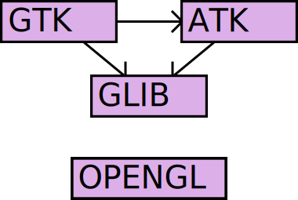

# GitNexus Two Months Later: The Production Audit

_88% token reduction, a PolyForm license gray zone, and Node OOM on large repos. The ledger, two months on._

## Executive Summary

> [!callout]
> GitNexus hit GitHub trending #1 on April 10, 2026. Two months later, it's still standing — with conditions. Our [April piece](/blog/gitnexus-code-knowledge-graph-2026/en/) covered the hype; this one opens the ledger.

> The headline number: senior engineer Satapathy measured 88% fewer tool calls and 74% token savings in a 17-agent production environment. The star count reached ~41K, but a Pump.fun crypto impersonation inflated part of that figure — the maintainer said so publicly. More quietly, PolyForm NC's commercial use gray zone pushed LangWatch to switch to CodeGraphContext (MIT) instead.

<!-- stat-card -->
**41K** — GitHub Stars — Apr 10: 1,195 → Jun 5: ~41K (3.5×)

<!-- stat-card -->
**v1.6.5** — Stable Release — 2026-05-16, v1.6.6-rc in progress

<!-- stat-card -->
**23** — Contributors — v1.6.5 cycle: 61 commits

<!-- stat-card -->
**Series — GitNexus Report** — This is the follow-up to our [GitNexus introduction (April 2026)](/blog/gitnexus-code-knowledge-graph-2026/en/). We track which criticisms from April were addressed, and what new limits have emerged.

## The Numbers Two Months Later

*Software distribution package dependency graph. GitNexus auto-generates a similar function/module call graph from your codebase. Source: Wikimedia Commons (Ludovic Courtès, GFDL 1.3+)*

Stars were 1,195 when trending #1 on April 10. As of June 5: approximately 41,000, with 4.7K forks. Releases progressed through v1.5.0 (Apr 19, cross-repo impact), v1.6.5 (May 16, stable), and into v1.6.6-rc. The v1.6.5 cycle alone produced 61 commits from 23 contributors — 15 of them first-time contributors. In the same period, the graph DB backend was swapped from KuzuDB to LadybugDB v0.15.

Citing 41K directly carries risk. A Pump.fun crypto token impersonated GitNexus, and the maintainer publicly warned that some star growth may be bot or event-driven. Use 41K as trend evidence, not a standalone KPI. Validate activity through commits, contributors, and release cadence.

## After "Browser-Only Is Hype" — What Changed

Our strongest critique in the [April piece](/blog/gitnexus-code-knowledge-graph-2026/en/) was the misleading "browser-only" marketing. The Vercel app is just a frontend; the local server needs to be running on port 4747 for anything to actually work. Two months on, we check whether that critique landed.

### 2.1. Docker/CLI Promoted to First-Class Citizens

Between May and June, `Dockerfile.web`, `Dockerfile.cli`, and `docker-compose.yaml` were officially added. Images are on GitHub Container Registry and Docker Hub with Cosign signatures. `gitnexus serve --host 0.0.0.0` enables production server mode, and CLI commands (`index`, `analyze`, `wiki`, `status`) are now stable.

### 2.2. One-Command Global MCP Setup

`npx gitnexus setup` auto-detects your editor (Claude Code, Cursor, Continue) and writes the global MCP config. PreToolUse/PostToolUse hooks detect stale indices after commits and prompt re-indexing. This hook pattern was originally built by Satapathy in his own environment and has since been absorbed as an official feature.

### 2.3. Remaining Gaps

The official Docker image still only bundles the web UI; CLI requires a separate build (Issue #966). The browser UI's ~5,000-file ceiling remains. For production, CLI/server mode is the right answer. That hasn't changed.

## Dissecting the Satapathy Case — How Did 88% Happen?

*Knowledge graph visualization. In Satapathy's 17-agent setup, GitNexus represents code symbol relationships in this structure, allowing agents to infer dependencies without reading files directly. Source: Wikimedia Commons (Fuzheado, CC BY-SA 4.0)*

Senior engineer Sidharth Satapathy's April 14 post is the most-cited GitNexus adoption case. 88% fewer tool calls, 74% token savings, 100% file-read elimination. Here is how those numbers came to be.

### 3.1. Context Tiers in a 17-Agent Crew

Satapathy's environment spans 17 agents: CXO, senior engineers, and ICs across Engineering, Product, Marketing, and Legal. Not every agent gets the same graph access. Roles get tiered token budgets.

| Tier | Target | Token Budget |
| --- | --- | --- |
| Tier 1 | Broad architecture queries | ~900 tokens (full crib sheet + dual engine instructions) |
| Tier 2 | Narrow lookups | ~400 tokens (instructions only) |
| Tier 3 | Narrow IC | ~50 tokens (single hint) |
| Non-technical | Marketing / Legal | ~50 tokens |

************

Every agent prompt contains the same rule: "For code lookups, call `gitnexus query` first. Cap file reads to 1 for simple lookups, 3 for implementations." That single instruction generates half the savings. The other half is the routing decision tree.

### 3.2. The Routing Decision Tree

| Query Type | Routing Target | Intent |
| --- | --- | --- |
| Code symbol lookup | GitNexus context | callers, callees, clustering |
| Blast radius analysis | GitNexus impact | depth-ranked, risk-rated |
| Cross-layer / semantic | Graphify query/path | cross-language meaning |
| Past decisions / prefs | Graphify memory graph | decision history |
| Harness / config | Graphify harness graph | environment context |
| Last resort | Grep | when all else fails |

Actual routing split: GitNexus ~70%, Graphify ~25%, Grep ~5%. Grep is last resort, not first instinct. Most AI agents reach for grep first; in this environment graph queries come before everything else.

### 3.3. Measured Numbers

| Metric | Before | After | Reduction |
| --- | --- | --- | --- |
| Total tool calls (3-query aggregate) | 58 ops | 7 ops | 88% |
| File reads | 35 | 0 | 100% |
| Grep operations | 18 | 0 | 100% |
| Retrieval tokens (single query) | ~13,750 | ~3,500 | 74% |
| Document editor workflow | 29 ops (grep 9 + read 15) | 3 MCP ops | 90% |

********************

### 3.4. The Hidden Finding: Transitive Dependency Visibility

The token savings are measurable. What's harder to measure showed up in the `DocumentsService` change analysis. Two MCP calls revealed that modifying this service breaks 9 execution flows three hops away (`agent_tools.py → agent_service.py → agent.py`). The AI agents' entire chat and action approval workflow was sitting on transitive dependencies nobody had mapped. Grep can't find these. Neither can GraphQL or simple import tracing. Only AST-parsed graphs see them. The graph approach surfaces 2.7× more dependencies than grep.

## What GitNexus Can't Do

*Linux OOM killer output. GitNexus Issue #1983 documented a similar Node.js heap OOM when attempting to index the Linux kernel repository — a limit that won't be resolved quickly. Source: Wikimedia Commons (Neo139, CC BY-SA 3.0)*

### 4.1. Breaks on Large Repositories

Issue #2031 reports "nothing output for hours" on a large repo analysis. No progress indicator means users can't tell if it froze or is still running. The maintainer's guidance: "Over 10,000 files risks heap overflow; over 50,000 files, run overnight." Issue #1983 documents a Node.js heap OOM while attempting to analyze the Linux kernel. This is bounded by Node's memory limits and won't be resolved quickly.

### 4.2. Language Parsing Gaps

Issue #2035 reports Java annotation `@XxlJob(CONSTANT)` failing to parse. Issue #2028 documents parent class API path prefixes being duplicated. As of v1.6.5, Vue, Swift, Rust, Kotlin, Go, and Dart have incomplete coverage. Swift support was completed in v1.6.6-rc. Kotlin, Ruby method resolution, PHP/Laravel, and Go's O(n²) performance fix are in progress. About half the gaps may close by the formal release in three months.

### 4.3. Fundamental Limits and Organizational Risk

Cross-language semantic edges — TypeScript types shadowing Python enums, UI screenshots referenced in backend docstrings — are outside the graph. Non-code context (configuration, architecture decision records, operational notes) isn't in the graph at all. The auto-reindex hook reduced sync lag but didn't eliminate it. Organizationally, core decisions remain concentrated in a single maintainer. Twenty-three contributors joined the v1.6.5 cycle, but bus factor is unresolved. Commercial license negotiations run through the maintainer personally (`founders@akonlabs.com`).

## Competitive Tool Comparison — Why GitNexus Specifically?

*Directed dependency graph example. Different tools approach this structure differently — GitNexus via Tree-sitter AST parsing, CodeGraphContext via multiple graph DB backends. Source: Wikimedia Commons (Aleksi Nurmi, Public Domain)*

### 5.1. Four-Tier Comparison

| Tier | Tool | Stars | License | Strength |
| --- | --- | --- | --- | --- |
| KG Engine | GitNexus | 41K | PolyForm NC | 16 MCP tools, deep Claude Code integration |
| KG Engine | CodeGraphContext | 3.6K | MIT | Commercially safe; selectable DB backend (KuzuDB/FalkorDB/Neo4j/LadybugDB) |
| Review-Focused | Code-Review-Graph | 14.7K | MIT | 28+ languages, monorepo v2.5.0 (2026-05-25) |
| Context Packing | Repomix | 22.4K | MIT | ~70% compression; not Graph RAG |

********************

### 5.2. Code-Review-Graph Token Reduction Details

Code-Review-Graph reports 6.8× reduction on PR reviews, up to 49× on monorepos. But 49× is the extreme case of a large Next.js monorepo. The average across 6 real open-source repos is 8.2×. On small, single-file changes, structural metadata overhead can actually increase token usage. Evaluate based on your repo's actual size and change patterns.

### 5.3. Situational Decision Criteria

| Situation | First Choice |
| --- | --- |
| Experimentation / personal / research | GitNexus (depth of integration is decisive) |
| Commercial SaaS embed | CodeGraphContext (MIT) or negotiate a license |
| PR review automation | Code-Review-Graph |
| Simple context packing | Repomix |

### 5.4. PolyForm NC Gray Zone — The LangWatch Precedent

LangWatch, an open-source observability company, opened Issue #2804 asking whether using GitNexus as an internal dev tool constituted commercial use. No clear answer came. LangWatch immediately switched to CodeGraphContext, citing "MIT licensed — no commercial use concerns" (Issue #2810). For any commercial adoption consideration, verify whether license negotiation is feasible first (`founders@akonlabs.com`); if not, CodeGraphContext's MIT safety is the practical default.

## Pebblous Perspective: Code Graphs and Data Lineage

Digging into code knowledge graphs, we keep seeing resemblances to data lineage graphs. Data lineage is the graph of "column A flows through transform T to become column B, which trains model M to produce decision D." GitNexus code graphs are "function f calls g via c, through module m to API e." The domains are different but the grammar is the same.

### 6.1. Structural Isomorphism

| Property | DataClinic Data Lineage | GitNexus Code Graph |
| --- | --- | --- |
| Node | Column A | Function f |
| Edge | Transform T (ETL, normalization, aggregation) | Call c (caller→callee) |
| Downstream | Column B → Model M → Decision D | Function g → Module m → API e |
| Blast Radius | 1 column → N downstream models | 1 function → 9 execution flows |
| LLM alone | Insufficient (external index needed) | Insufficient (external index needed) |

********************

Four key properties align. Nodes are "defined objects." Edges are "references, transforms, calls." Blast radius analysis is the primary use case. An external graph index must be built in advance for LLMs to use it. When the structure is identical across domains, advances in one forecast the future of the other.

### 6.2. AI-Ready Data and Code-as-Lineage

The same pattern is appearing in the data domain. Atlan has declared "data lineage and explainability are mandatory for EU AI Act compliance." The Graph RAG pattern pioneered in code is spreading into data. The next chapter of AI-Ready Data is likely "Code-as-Lineage": tracking data transformation code itself as a graph and merging it with data lineage. GitNexus's measured results are first-order external evidence for that future.

## Should You Adopt It Now?

The ledger is open. The conclusion is conditional recommendations, not declarations.

### 7.1. Go Ahead

- Personal side projects, R&D teams, academic / public / non-profit
- Teams onboarding legacy codebases over 50,000 LoC
- Heavy Claude Code users: MCP integration depth is the decisive factor

### 7.2. Reconsider

- Commercial SaaS embed: negotiate a license or switch to CodeGraphContext MIT
- Linux-kernel-scale codebases: Node OOM unresolved (#1983)
- Vue / Swift / Kotlin-centric teams: parsing gaps, partially addressed in v1.6.6-rc

### 7.3. Recommended First Three Steps

1. Run `npx gitnexus@latest analyze` on your own repo. You'll have an answer within five minutes.
2. Attach MCP to Claude Code and use it for a week (`npx gitnexus setup`).
3. Compare token bills before and after. Verify whether the Satapathy case reproduces in your environment.

### 7.4. Re-evaluation Checklist in Three Months

- License clarity: has the PolyForm NC gray zone been resolved?
- Maintainer diversity: have contributors grown beyond 23?
- Swift / Kotlin / Go support: has v1.6.6-rc reached a formal release?

> [!callout]
> Trending #1 doesn't mean it fits every context. Adoption is conditional. Put your license line, codebase size, and language stack on top of this ledger, then decide. And schedule a re-evaluation date in advance.

## References

### Official Sources

- 1.Patwari, A. (2026). [GitNexus — MCP-Native Code Knowledge Graph Engine](https://github.com/abhigyanpatwari/GitNexus). GitHub.
- 2.Patwari, A. (2026-05-16). [GitNexus v1.6.5 Release Notes](https://github.com/abhigyanpatwari/GitNexus/releases/tag/v1.6.5). GitHub.
- 3.Patwari, A. (2026). [GitNexus Issues #1983, #2028, #2031, #2035](https://github.com/abhigyanpatwari/GitNexus/issues). GitHub. (OOM, infinite wait, Java annotation parsing gap)
- 4.Patwari, A. (2026). [GitNexus ARCHITECTURE.md](https://github.com/abhigyanpatwari/GitNexus/blob/main/ARCHITECTURE.md). GitHub.
- 5.PolyForm Project. (2020). [PolyForm Noncommercial License 1.0.0](https://polyformproject.org/licenses/noncommercial/1.0.0).

### Industry Sources

- 6.Satapathy, S. (2026-04-14). [My AI Agent Stopped Reading Files: What a Dual Knowledge Graph Actually Looks Like in Production](https://www.sidharthsatapathy.com/blog/gitnexus-dual-graph-engine-token-savings/).
- 7.Walker, R. (2026-05). [Code Intelligence Tools for AI Agents Compared](https://rywalker.com/research/code-intelligence-tools).
- 8.AI-Chain. (2026-05). [GitNexus and Graphify are not substitutes](https://ai-chain.tw/en/blog/gitnexus-graphify-ai-coding-workflow-guide/).
- 9.MarkTechPost. (2026-04-24). [Meet GitNexus: An Open-Source MCP-Native Knowledge Graph Engine](https://www.marktechpost.com/2026/04/24/meet-gitnexus-an-open-source-mcp-native-knowledge-graph-engine/).
- 10.Atlan. (2026). [AI Memory vs RAG vs Knowledge Graph](https://atlan.com/know/ai-memory-vs-rag-vs-knowledge-graph/).

### Competitive Tools / License Precedents

- 11.LangWatch. (2026). [Issue #2804 — PolyForm Noncommercial Dev Tool Usage Clarification](https://github.com/langwatch/langwatch/issues/2804). GitHub.
- 12.LangWatch. (2026). [Issue #2810 — CodeGraphContext MIT Recommendation](https://github.com/langwatch/langwatch/issues/2810). GitHub.
- 13.CodeGraphContext. (2025). [CodeGraphContext](https://github.com/CodeGraphContext/CodeGraphContext). GitHub. (MIT license, 3.6K stars)
- 14.tirth8205. (2025). [code-review-graph](https://github.com/tirth8205/code-review-graph). GitHub. (MIT license, 14.7K stars)
- 15.Pebblous Research. (2026-04). [GitNexus: Code Knowledge Graphs and Graph RAG for AI Agents](/blog/gitnexus-code-knowledge-graph-2026/en/). Pebblous Blog. (introductory article)
