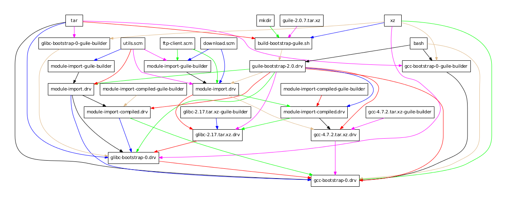
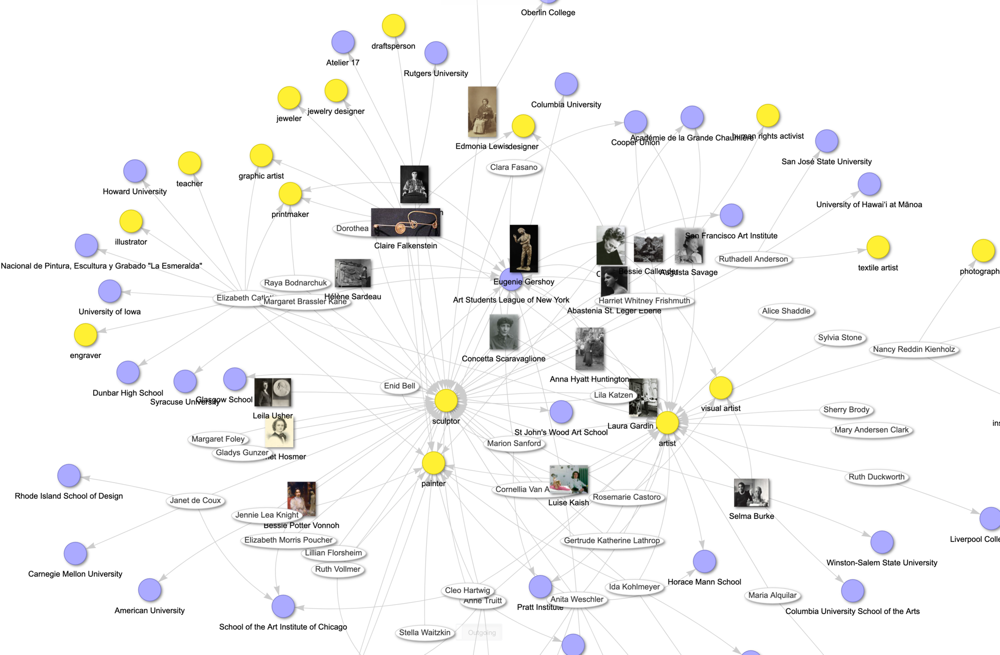
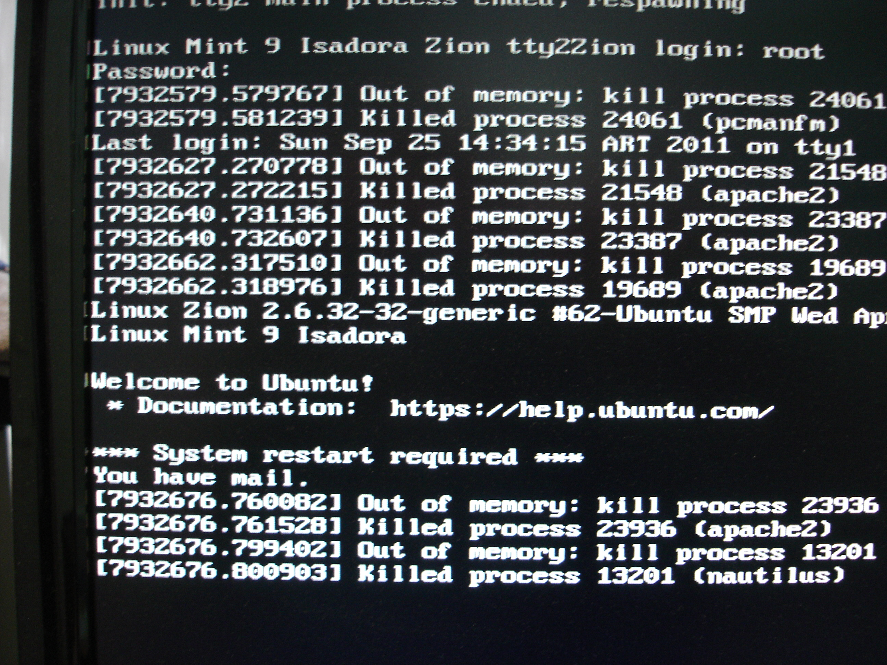

# 두 달 후의 GitNexus — 41K 스타, 88% 토큰 절감, 그리고 못 푼 숙제들

_GitHub 트렌딩 1위 이후 두 달. 진짜 수치, 실전 한계, 그리고 도입 판단 기준._

## Executive Summary

> [!callout]
> GitNexus는 두 달 후에도 살아 있다. 조건이 붙는다. [4월 소개글](/blog/gitnexus-code-knowledge-graph-2026/ko/)이 가능성을 다뤘다면, 이 글은 회계 장부다.

> 핵심 수치는 하나다. 시니어 엔지니어 Satapathy가 17개 에이전트 환경에서 도구 호출을 88% 줄이고 토큰을 74% 절감했다. 스타는 41K를 찍었지만, 메인테이너 본인이 Pump.fun 사칭 사건으로 일부 수치가 부풀었다고 경고했다. 더 조용한 뇌관은 라이선스다. LangWatch는 상업 사용 해석을 기다리다 포기하고 MIT 라이선스인 CodeGraphContext로 옮겼다.

<!-- stat-card -->
**41K** — GitHub 스타 — 4/10 1,195 → 6/5 약 41K (3.5×)

<!-- stat-card -->
**v1.6.5** — 안정 릴리즈 — 2026-05-16, v1.6.6-rc 진행 중

<!-- stat-card -->
**23** — 컨트리뷰터 — v1.6.5 사이클 61 commits

<!-- stat-card -->
**시리즈 — GitNexus 리포트** — 이 글은 [GitNexus 소개글 (2026년 4월)](/blog/gitnexus-code-knowledge-graph-2026/ko/)의 후속편입니다. 소개글에서 지적한 비판들이 두 달 후 어떻게 해소됐는지, 그리고 새로 드러난 한계는 무엇인지를 다룹니다.

## 두 달 후의 숫자

*소프트웨어 배포 패키지의 의존성 그래프. GitNexus는 코드베이스에서 이와 유사한 함수·모듈 호출 그래프를 자동 생성한다. 출처: Wikimedia Commons (Ludovic Courtès, GFDL 1.3+)*

4월 10일 트렌딩 1위 당시 스타는 1,195개였다. 6월 5일 현재 약 41,000개, 포크 4.7K. 릴리즈는 v1.5.0(4/19, cross-repo impact), v1.6.5(5/16, 안정 버전)를 지나 v1.6.6-rc에 들어갔다. v1.6.5 한 사이클만 봐도 61 commits, 23 contributors, 그중 15명이 첫 기여다. 같은 기간에 그래프 DB 백엔드를 KuzuDB에서 LadybugDB v0.15로 갈아끼웠다.

다만 41K는 그대로 인용하면 위험하다. Pump.fun에서 GitNexus를 사칭한 암호화폐 토큰이 발행됐고, 그 사건과 맞물려 스타 증가 일부가 봇·이벤트성 유입일 수 있다고 메인테이너 본인이 공지했다. 41K는 "추세 증거"로만 쓰고, 실질 활동은 commits, contributors, 릴리즈 cadence로 교차 확인해야 한다.

## "브라우저 전용은 과장" 이후 무엇이 바뀌었나

4월 [소개글](/blog/gitnexus-code-knowledge-graph-2026/ko/)에서 가장 강하게 지적한 건 "브라우저 전용" 마케팅의 과장이었다. Vercel 앱은 프론트엔드일 뿐, 로컬 서버가 4747 포트에 떠 있어야 작동한다고 썼다. 두 달이 지난 지금 그 비판이 작동했는지를 확인할 시간이다.

### 2.1. Docker/CLI가 1급 시민으로 승격

5~6월 사이 `Dockerfile.web`, `Dockerfile.cli`, `docker-compose.yaml`이 공식 추가됐다. GitHub Container Registry와 Docker Hub에 이미지가 올라가고 Cosign 서명까지 붙었다. `gitnexus serve --host 0.0.0.0` 한 줄로 프로덕션 서버 모드가 가능해졌고, CLI 명령어(`index`, `analyze`, `wiki`, `status`)도 정착됐다.

### 2.2. npx gitnexus setup 한 번으로 전역 MCP 자동 설정

`npx gitnexus setup` 한 번이면 Claude Code, Cursor, Continue 등 사용 중인 에디터를 자동 감지해 전역 MCP 설정을 작성한다. PreToolUse/PostToolUse 훅으로 커밋 후 stale 인덱스를 자동 감지한다. 이 훅은 Satapathy가 자기 환경에서 직접 만들었던 패턴이 공식 기능으로 흡수됐다.

### 2.3. 해소되지 않은 한계

Docker Issue #966에서 보이듯 공식 이미지는 웹 UI만 포함하고 CLI는 별도 빌드가 필요하다. 브라우저 UI의 약 5,000파일 한계도 그대로다. 실전 사용은 CLI/서버 모드가 정답이라는 점은 변하지 않았다.

## Satapathy 사례 해부 — 88%는 어떻게 나왔나

*지식 그래프 시각화 예시. Satapathy의 17-agent 환경에서 GitNexus는 코드 심볼 간 관계를 이와 같은 그래프 구조로 표현해 에이전트가 직접 파일을 읽지 않고도 의존성을 파악할 수 있게 한다. 출처: Wikimedia Commons (Fuzheado, CC BY-SA 4.0)*

시니어 엔지니어 Sidharth Satapathy가 4월 14일 발표한 사례는 GitNexus 도입 사례 중 가장 자주 인용된다. 도구 호출 88% 감소, 토큰 74% 절감, 파일 읽기 100% 제거. 이 수치가 어떻게 나왔는지 분해한다.

### 3.1. 17-agent crew의 컨텍스트 티어

Satapathy 환경은 CXO·시니어 엔지니어·IC가 엔지니어링·제품·마케팅·법무 4개 도메인에 흩어진 17-agent crew다. 역할에 따라 그래프 접근 티어와 토큰 예산을 나눠 할당한다.

| 티어 | 대상 | 토큰 예산 |
| --- | --- | --- |
| Tier 1 | 광역 아키텍처 질문 | 약 900 토큰 (전체 crib sheet + 이중 엔진 지침) |
| Tier 2 | 좁은 조회 | 약 400 토큰 (지침만) |
| Tier 3 | 좁은 IC | 약 50 토큰 (한 줄 힌트) |
| 비기술 | 마케팅·법무 | 약 50 토큰 |

************

모든 에이전트 프롬프트에 공통 규칙이 박혀 있다. "코드 조회는 `gitnexus query`를 먼저 호출하라. 파일 읽기는 단순 조회 1회, 구현 3회로 제한한다." 이 규칙 하나가 절감의 절반을 만들고, 나머지 절반은 라우팅 결정트리다.

### 3.2. 라우팅 결정 트리

| 질의 종류 | 라우팅 대상 | 의도 |
| --- | --- | --- |
| 코드 심볼 조회 | GitNexus context | callers, callees, clustering |
| blast radius 분석 | GitNexus impact | depth-ranked, risk-rated |
| 크로스레이어·시맨틱 | Graphify query/path | 언어 간 의미 연결 |
| 과거 결정·선호도 | Graphify memory graph | 의사결정 이력 |
| 하네스·설정 | Graphify harness graph | 환경·설정 컨텍스트 |
| 최후 수단 | Grep | 위 모두 실패 시 |

실제 라우팅 비율은 GitNexus 약 70%, Graphify 약 25%, Grep 약 5%. Grep이 1순위가 아니라 마지막 보루라는 점이 핵심이다.

### 3.3. 실측 수치

| 지표 | Before | After | 절감률 |
| --- | --- | --- | --- |
| 전체 도구 호출 (3개 쿼리 집계) | 58 ops | 7 ops | 88% 감소 |
| 파일 읽기 | 35회 | 0회 | 100% 제거 |
| Grep 연산 | 18회 | 0회 | 100% 제거 |
| 정보 검색 토큰 (단일 쿼리) | ~13,750 | ~3,500 | 74% 절감 |
| Document editor 워크플로 | 29 ops (grep 9 + read 15) | 3 MCP ops | 90% 감소 |

********************

### 3.4. 숨은 진실 — transitive 의존성 가시화

수치보다 더 중요한 발견이 본문 뒤에 묻혀 있다. `DocumentsService` 변경 분석에서, 이 서비스가 바뀌면 3-hop 떨어진 에이전트 툴 레이어의 9개 실행 흐름(`agent_tools.py → agent_service.py → agent.py`)이 깨진다는 게 MCP 호출 2회로 파악됐다. 이 의존성은 grep으로도 단순 import 추적으로도 탐지되지 않는다. AST 파싱을 거친 그래프만 보인다. 88%는 결과고, 실제 가치는 "에이전트가 못 보던 transitive 의존성 가시화"에 있다.

## GitNexus가 잘 못하는 일들

*Linux 시스템의 Out of Memory(OOM) 킬러 로그. GitNexus는 10만 줄 이상 대형 코드베이스 분석 시 Node.js JavaScript heap OOM으로 인해 이와 유사한 메모리 한계에 직면한다 (Issue #1983). 출처: Wikimedia Commons (Neo139, CC BY-SA 3.0)*

### 4.1. 큰 레포에서 무릎을 꿇는다

Issue #2031은 대형 레포 분석 중 "nothing output for hours"를 보고한다. 진행 인디케이터가 없어 멈춘 건지 돌아가는 건지 알 수 없다. 메인테이너 권고는 "10,000파일 이상이면 heap 초과 위험, 50,000파일 이상이면 야간 실행"이다. Issue #1983은 Linux 커널 분석 중 Node JavaScript heap OOM으로 죽은 사례다. 단기간에 풀릴 가능성은 낮다.

### 4.2. 언어별 파싱 갭

Issue #2035는 Java 어노테이션 `@XxlJob(CONSTANT)`이 파싱되지 않는 문제를 보고한다. Issue #2028은 부모 클래스 API 경로 prefix가 중복 생성되는 버그다. 한국 팀이 자주 쓰는 언어 중 Vue, Swift, Rust, Kotlin, Go, Dart가 v1.6.5 시점에서 커버리지가 부족했다. v1.6.6-rc에서 Swift 지원이 완성됐고, Kotlin 구현과 Ruby 메서드 해상도, PHP/Laravel 강화, Go의 O(n²) 성능 수정이 진행 중이다. 3개월 후 정식 릴리즈에서는 갭의 절반 정도가 메워질 수 있다.

### 4.3. 본질적 한계와 조직 리스크

cross-language semantic edges(TypeScript 타입이 Python enum을 가리는 의미적 연결)와 non-code context(설정, 아키텍처 결정 문서)는 그래프 밖이다. auto-reindex 훅이 동기화 lag을 줄였지만 완전히 없애지는 못했다. 조직 측면에서는 핵심 결정이 단일 메인테이너에게 집중돼 있다. 23 contributors가 늘어났지만 버스 팩터 미해결이고, 상업 라이선스 협상도 개인 명의(`founders@akonlabs.com`)로 진행된다.

## 경쟁 도구 비교 — 왜 굳이 GitNexus인가

*소프트웨어 의존성 그래프의 추상 구조. GitNexus, CodeGraphContext, Code-Review-Graph 모두 이와 같은 방향성 그래프를 기반으로 코드 관계를 표현하지만, 라이선스·통합 깊이·언어 지원 범위에서 차별화된다. 출처: Wikimedia Commons (Aleksi Nurmi, 퍼블릭 도메인)*

### 5.1. 4-티어 비교

| 티어 | 도구 | 스타 | 라이선스 | 강점 |
| --- | --- | --- | --- | --- |
| KG 엔진 | GitNexus | 41K | PolyForm NC | 16 MCP tools, Claude Code 통합 깊음 |
| KG 엔진 | CodeGraphContext | 3.6K | MIT | 상업 사용 안전, DB 백엔드 선택 (KuzuDB/FalkorDB/Neo4j/LadybugDB) |
| 리뷰 특화 | Code-Review-Graph | 14.7K | MIT | 28개+ 언어, 모노레포 v2.5.0 (2026-05-25) |
| 패킹 | Repomix | 22.4K | MIT | ~70% 압축, 단순 컨텍스트 패킹 (그래프 RAG 아님) |

********************

### 5.2. Code-Review-Graph 토큰 절감 디테일

Code-Review-Graph는 PR 리뷰 6.8배, 모노레포 최대 49배까지 보고됐다. 다만 6개 실제 오픈소스 레포 평균은 8.2배다. 소규모 단일 파일 변경에서는 구조 메타데이터 오버헤드로 오히려 증가하기도 한다. 레포 규모와 변경 패턴을 같이 봐야 한다.

### 5.3. 상황별 결정 기준

| 상황 | 첫 선택 |
| --- | --- |
| 실험·개인·연구 | GitNexus (통합 깊이가 결정타) |
| 상업 SaaS 임베드 | CodeGraphContext (MIT) 또는 별도 라이선스 협상 |
| PR 리뷰 자동화 | Code-Review-Graph |
| 단순 컨텍스트 패킹 | Repomix |

### 5.4. PolyForm NC 회색지대 — LangWatch 전례

LangWatch는 오픈소스 옵저버빌리티 회사인데, 자기네 dev tool로 GitNexus를 쓰는 게 commercial인지를 묻는 Issue #2804를 열었다. 명확한 답 없이 마감됐고, LangWatch는 곧바로 "MIT licensed — no commercial use concerns"를 이유로 CodeGraphContext로 전환했다(Issue #2810). 한국 대기업·금융·SI가 도입을 검토한다면 라이선스 협상이 가능한지(`founders@akonlabs.com`) 먼저 확인하는 편이 낫다.

## 페블러스가 본다 — 코드 그래프와 데이터 계보

코드 지식 그래프를 들여다보면 데이터 계보 그래프와 닮은 구석이 자꾸 보인다. 데이터 계보는 "컬럼 A가 변환 T를 거쳐 컬럼 B가 되고, 모델 M이 의사결정 D를 만든다"는 그래프다. 코드 그래프는 "함수 f가 g를 부르고, 모듈 m을 거쳐 API e에 도달한다"는 그래프다. 도메인이 달라도 문법은 같다.

### 6.1. 구조적 동형성

| 속성 | DataClinic 데이터 계보 | GitNexus 코드 그래프 |
| --- | --- | --- |
| 노드 | 컬럼 A | 함수 f |
| 엣지 | 변환 T (ETL, 정규화, 집계) | 호출 c (caller→callee) |
| 다음 노드 | 컬럼 B → 모델 M → 의사결정 D | 함수 g → 모듈 m → API e |
| blast radius | 컬럼 1개 → N개 다운스트림 모델 | 함수 1개 → 9개 실행 흐름 |
| LLM 단독 처리 | 불가 (외부 인덱스 필요) | 불가 (외부 인덱스 필요) |

********************

네 가지 핵심 속성이 일치한다. 노드는 "정의된 객체", 엣지는 "참조·변환·호출", blast radius 분석이 핵심 사용 사례, 외부 그래프 인덱스가 사전에 필요하다. 한쪽의 발전은 다른 쪽의 미래를 시사한다.

### 6.2. AI-Ready Data와 Code-as-Lineage

2026년 데이터 영역에서도 같은 패턴이 잡힌다. Atlan은 "데이터 계보·설명가능성이 EU AI Act 대응 필수"를 선언했고, 코드 영역이 먼저 만든 그래프 RAG 패턴이 데이터 영역으로 번지는 중이다. AI-Ready Data의 다음 챕터는 "Code-as-Lineage"일 가능성이 높다. 데이터 변환 코드 자체를 그래프로 추적해 데이터 계보와 합치는 것. GitNexus의 실측은 그 미래의 1차 외부 증거다.

## 그래서, 지금 도입할까

두 달의 회계장부를 펼쳐 보였다. 마지막은 단언 대신 조건부 권고다.

### 7.1. 도입해도 좋다

- 개인 사이드 프로젝트, R&D 팀, 학술·공공·비영리
- 50,000 LoC 이상 레거시 코드 온보딩이 필요한 팀
- Claude Code 헤비 유저: MCP 통합 깊이가 결정타

### 7.2. 다시 생각하자

- 상업 SaaS 임베드: 라이선스 협상 또는 CodeGraphContext MIT로 전환
- Linux 커널 급 초대형 코드베이스: Node OOM 한계 미해결(#1983)
- Vue·Swift·Kotlin 중심 팀: 파싱 갭, v1.6.6-rc에서 일부 해소 중

### 7.3. 추천 시작 3단계

1. `npx gitnexus@latest analyze`를 자기 레포에서 먼저 돌려라. 5분 안에 답이 나온다.
2. Claude Code에 MCP를 붙여서 일주일 써봐라(`npx gitnexus setup`).
3. 토큰 비용 청구서를 전후 비교해라. Satapathy 사례가 자기 환경에서도 재현되는지 확인.

### 7.4. 3개월 후 재확인 체크리스트

- 라이선스 명확화: PolyForm NC 회색지대가 해소됐는지
- 메인테이너 다변화: 23 contributors가 더 늘었는지
- Swift·Kotlin·Go 지원 진전: v1.6.6-rc가 정식 릴리즈에 도달했는지

> [!callout]
> 1위 도구라고 모든 자리에 맞지 않는다. 도입은 조건부다. 자기 환경의 라이선스 라인, 코드 규모, 사용 언어를 회계장부 위에 올려놓고 결정해라. 그리고 재평가 일정을 미리 박아둬라.

## 참고문헌

### 공식 소스

- 1.Patwari, A. (2026). [GitNexus — MCP-Native Code Knowledge Graph Engine](https://github.com/abhigyanpatwari/GitNexus). GitHub.
- 2.Patwari, A. (2026-05-16). [GitNexus v1.6.5 Release Notes](https://github.com/abhigyanpatwari/GitNexus/releases/tag/v1.6.5). GitHub.
- 3.Patwari, A. (2026). [GitNexus Issues #1983, #2028, #2031, #2035](https://github.com/abhigyanpatwari/GitNexus/issues). GitHub. (OOM, 무한대기, Java 파싱 갭)
- 4.Patwari, A. (2026). [GitNexus ARCHITECTURE.md](https://github.com/abhigyanpatwari/GitNexus/blob/main/ARCHITECTURE.md). GitHub.
- 5.PolyForm Project. (2020). [PolyForm Noncommercial License 1.0.0](https://polyformproject.org/licenses/noncommercial/1.0.0).

### 업계 소스

- 6.Satapathy, S. (2026-04-14). [My AI Agent Stopped Reading Files: What a Dual Knowledge Graph Actually Looks Like in Production](https://www.sidharthsatapathy.com/blog/gitnexus-dual-graph-engine-token-savings/).
- 7.Walker, R. (2026-05). [Code Intelligence Tools for AI Agents Compared](https://rywalker.com/research/code-intelligence-tools).
- 8.AI-Chain. (2026-05). [GitNexus and Graphify are not substitutes](https://ai-chain.tw/en/blog/gitnexus-graphify-ai-coding-workflow-guide/).
- 9.MarkTechPost. (2026-04-24). [Meet GitNexus: An Open-Source MCP-Native Knowledge Graph Engine](https://www.marktechpost.com/2026/04/24/meet-gitnexus-an-open-source-mcp-native-knowledge-graph-engine/).
- 10.Atlan. (2026). [AI Memory vs RAG vs Knowledge Graph](https://atlan.com/know/ai-memory-vs-rag-vs-knowledge-graph/).

### 경쟁 도구 / 라이선스 사례

- 11.LangWatch. (2026). [Issue #2804 — PolyForm Noncommercial Dev Tool Usage Clarification](https://github.com/langwatch/langwatch/issues/2804). GitHub.
- 12.LangWatch. (2026). [Issue #2810 — CodeGraphContext MIT Recommendation](https://github.com/langwatch/langwatch/issues/2810). GitHub.
- 13.CodeGraphContext. (2025). [CodeGraphContext](https://github.com/CodeGraphContext/CodeGraphContext). GitHub. (MIT 라이선스, 3.6K 스타)
- 14.tirth8205. (2025). [code-review-graph](https://github.com/tirth8205/code-review-graph). GitHub. (MIT 라이선스, 14.7K 스타)
- 15.Pebblous Research. (2026-04). [GitNexus, 코드를 지식 그래프로 바꾸는 Graph RAG](/blog/gitnexus-code-knowledge-graph-2026/ko/). 페블러스 블로그. (선행 소개글)
